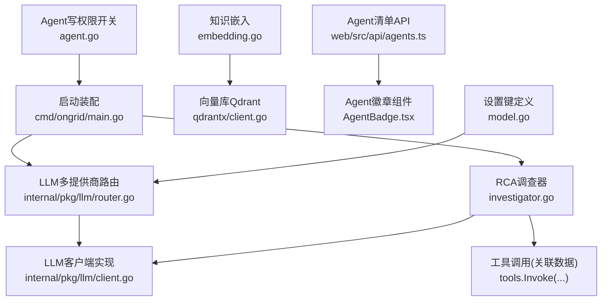
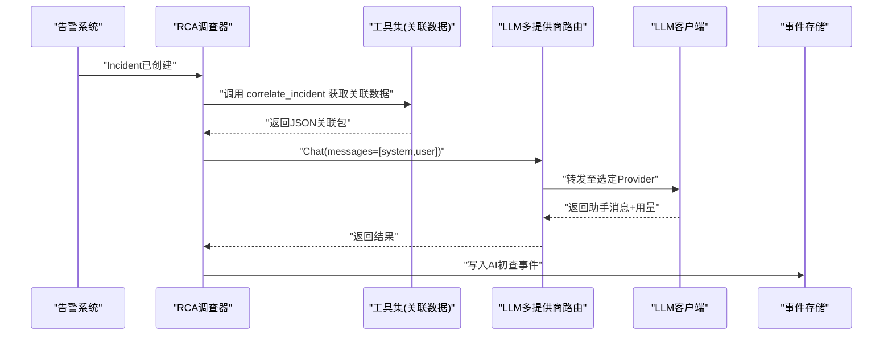
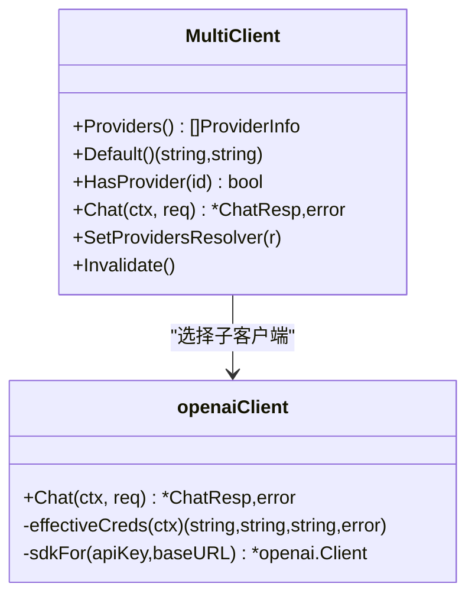
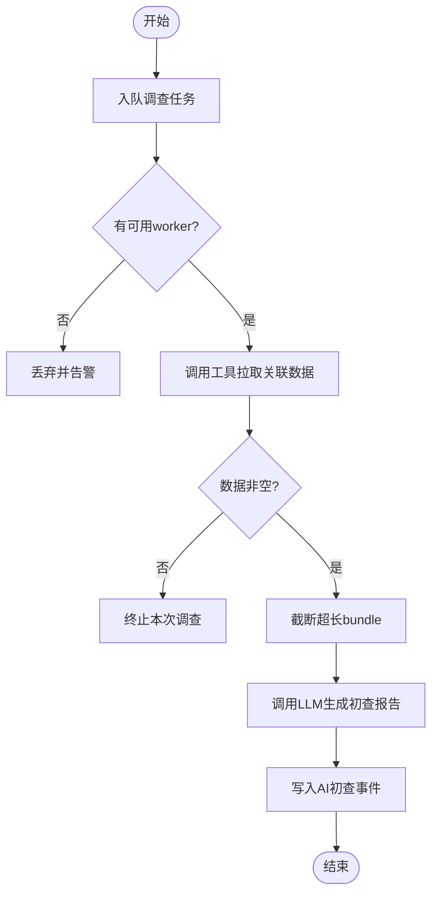
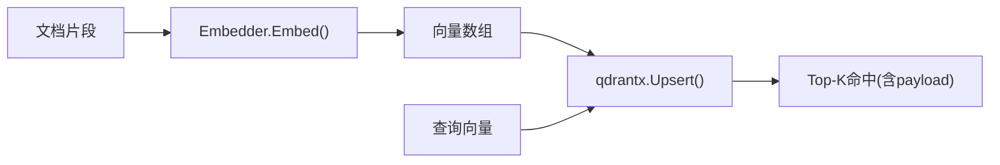
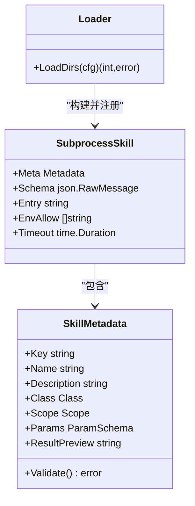
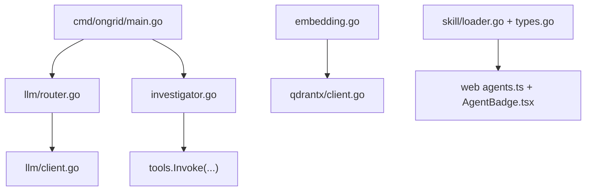

# AI智能运维

<cite>
**本文引用的文件**   
- [cmd/ongrid/main.go](file://cmd/ongrid/main.go)
- [internal/pkg/llm/router.go](file://internal/pkg/llm/router.go)
- [internal/pkg/llm/client.go](file://internal/pkg/llm/client.go)
- [internal/manager/biz/aiops/investigator/investigator.go](file://internal/manager/biz/aiops/investigator/investigator.go)
- [internal/manager/model/setting/model.go](file://internal/manager/model/setting/model.go)
- [internal/manager/biz/setting/agent.go](file://internal/manager/biz/setting/agent.go)
- [internal/skill/loader.go](file://internal/skill/loader.go)
- [internal/skill/types.go](file://internal/skill/types.go)
- [internal/pkg/embedding/embedding.go](file://internal/pkg/embedding/embedding.go)
- [internal/pkg/qdrantx/client.go](file://internal/pkg/qdrantx/client.go)
- [web/src/api/agents.ts](file://web/src/api/agents.ts)
- [web/src/components/AgentBadge.tsx](file://web/src/components/AgentBadge.tsx)
- [ROADMAP.md](file://ROADMAP.md)
</cite>

## 目录
1. [简介](#简介)
2. [项目结构](#项目结构)
3. [核心组件](#核心组件)
4. [架构总览](#架构总览)
5. [详细组件分析](#详细组件分析)
6. [依赖关系分析](#依赖关系分析)
7. [性能与成本优化](#性能与成本优化)
8. [故障排查指南](#故障排查指南)
9. [结论](#结论)
10. [附录：自定义Agent与技能开发指南](#附录自定义agent与技能开发指南)

## 简介
本文件面向AI智能运维模块，聚焦以下目标：
- 基于大语言模型的自动根因诊断（RCA）系统：协调器Agent与专业子Agent的协作机制。
- 多LLM提供商集成与热路由切换：支持OpenAI、Anthropic、Gemini、DeepSeek等模型。
- 知识库与RAG实现：向量搜索、语义匹配与上下文理解。
- 告警驱动的自动调查工作流：从告警触发到初查报告生成的完整流程。
- 自定义Agent与技能开发指南，以及性能优化与成本控制策略。

## 项目结构
AI智能运维相关代码主要分布在以下层次：
- 启动与装配层：cmd/ongrid/main.go 负责多提供商LLM路由、设置解析、RCA调查器初始化、Agent注册等。
- LLM抽象与路由：internal/pkg/llm/* 提供统一Client接口、多Provider路由、预算控制与指标上报。
- RCA调查器：internal/manager/biz/aiops/investigator/* 在告警触发时异步拉取关联数据并调用LLM生成初查报告。
- 知识与RAG：internal/pkg/embedding/* 与 internal/pkg/qdrantx/* 提供向量化与向量检索能力。
- Agent与技能：internal/skill/* 定义技能元数据、加载外部技能包；前端 web/src/api/agents.ts 与 web/src/components/AgentBadge.tsx 暴露Agent清单与标签。
- 配置与开关：internal/manager/model/setting/model.go 与 internal/manager/biz/setting/agent.go 管理LLM提供商与Agent行为开关。

图表来源
- [cmd/ongrid/main.go](file://cmd/ongrid/main.go)
- [internal/pkg/llm/router.go](file://internal/pkg/llm/router.go)
- [internal/pkg/llm/client.go](file://internal/pkg/llm/client.go)
- [internal/manager/biz/aiops/investigator/investigator.go](file://internal/manager/biz/aiops/investigator/investigator.go)
- [internal/pkg/embedding/embedding.go](file://internal/pkg/embedding/embedding.go)
- [internal/pkg/qdrantx/client.go](file://internal/pkg/qdrantx/client.go)
- [web/src/api/agents.ts](file://web/src/api/agents.ts)
- [web/src/components/AgentBadge.tsx](file://web/src/components/AgentBadge.tsx)
- [internal/manager/model/setting/model.go](file://internal/manager/model/setting/model.go)
- [internal/manager/biz/setting/agent.go](file://internal/manager/biz/setting/agent.go)

章节来源
- [cmd/ongrid/main.go](file://cmd/ongrid/main.go)
- [internal/pkg/llm/router.go](file://internal/pkg/llm/router.go)
- [internal/pkg/llm/client.go](file://internal/pkg/llm/client.go)
- [internal/manager/biz/aiops/investigator/investigator.go](file://internal/manager/biz/aiops/investigator/investigator.go)
- [internal/manager/model/setting/model.go](file://internal/manager/model/setting/model.go)
- [internal/manager/biz/setting/agent.go](file://internal/manager/biz/setting/agent.go)
- [internal/skill/loader.go](file://internal/skill/loader.go)
- [internal/skill/types.go](file://internal/skill/types.go)
- [internal/pkg/embedding/embedding.go](file://internal/pkg/embedding/embedding.go)
- [internal/pkg/qdrantx/client.go](file://internal/pkg/qdrantx/client.go)
- [web/src/api/agents.ts](file://web/src/api/agents.ts)
- [web/src/components/AgentBadge.tsx](file://web/src/components/AgentBadge.tsx)

## 核心组件
- 多LLM提供商路由与客户端
  - MultiClient按ChatReq.Provider选择子客户端，支持动态提供者目录刷新与默认提供者选择。
  - openaiClient封装OpenAI兼容SDK，内置预算检查、超时保护、指标记录与Zhipu JWT鉴权适配。
- RCA调查器
  - 在告警产生后异步拉取关联数据（metric/log/trace/edge），以固定systemPrompt驱动LLM输出三段式初查报告，并持久化为事件。
- 知识与RAG
  - embedding将文本转为向量，qdrantx提供集合管理、索引、Upsert、过滤搜索与滚动遍历。
- Agent与技能
  - skill框架定义技能元数据、执行器与权限分类；loader扫描外部技能包并注册为子进程技能。
  - 前端暴露Agent清单与徽章展示，便于用户选择会话Agent。

章节来源
- [internal/pkg/llm/router.go](file://internal/pkg/llm/router.go)
- [internal/pkg/llm/client.go](file://internal/pkg/llm/client.go)
- [internal/manager/biz/aiops/investigator/investigator.go](file://internal/manager/biz/aiops/investigator/investigator.go)
- [internal/pkg/embedding/embedding.go](file://internal/pkg/embedding/embedding.go)
- [internal/pkg/qdrantx/client.go](file://internal/pkg/qdrantx/client.go)
- [internal/skill/loader.go](file://internal/skill/loader.go)
- [internal/skill/types.go](file://internal/skill/types.go)
- [web/src/api/agents.ts](file://web/src/api/agents.ts)
- [web/src/components/AgentBadge.tsx](file://web/src/components/AgentBadge.tsx)

## 架构总览
下图展示了从“告警触发”到“AI初查报告”的端到端流程，以及多LLM路由、RAG与Agent调度的交互关系。

图表来源
- [internal/manager/biz/aiops/investigator/investigator.go](file://internal/manager/biz/aiops/investigator/investigator.go)
- [internal/pkg/llm/router.go](file://internal/pkg/llm/router.go)
- [internal/pkg/llm/client.go](file://internal/pkg/llm/client.go)

## 详细组件分析

### 多LLM提供商路由与客户端
- 路由层MultiClient
  - 支持静态提供者（构造时注入）与动态提供者（通过Resolver刷新）。
  - 提供Providers()/Default()查询当前可用提供者与默认值；Invalidate()可立即失效缓存。
  - Chat()根据req.Provider或默认提供者选择子客户端，失败路径标注状态用于监控。
- 客户端openaiClient
  - 统一OpenAI兼容接口，支持Resolver动态覆盖apiKey/model/baseURL。
  - 内置预算检查（Check/Record）、超时兜底、指标上报与结构化日志。
  - 针对智谱（Zhipu）特殊鉴权：请求前重写Authorization为JWT。

图表来源
- [internal/pkg/llm/router.go](file://internal/pkg/llm/router.go)
- [internal/pkg/llm/client.go](file://internal/pkg/llm/client.go)

章节来源
- [internal/pkg/llm/router.go](file://internal/pkg/llm/router.go)
- [internal/pkg/llm/client.go](file://internal/pkg/llm/client.go)

### RCA调查器（告警驱动的自动调查）
- 设计要点
  - 独立worker池与缓冲队列，避免阻塞告警主路径。
  - 使用固定systemPrompt要求三段式输出：定性、可能根因、立即可执行的排障步骤。
  - 直接调用工具集拉取关联数据，再一次性发送给LLM，减少多轮对话开销。
  - 成功时将结果持久化为事件，供前端渲染。
- 关键流程
  - InvestigateAsync入队 → workerLoop取出任务 → gatherBundle拉取数据 → llmClient.Chat生成初查 → CreateEvent落盘。

图表来源
- [internal/manager/biz/aiops/investigator/investigator.go](file://internal/manager/biz/aiops/investigator/investigator.go)

章节来源
- [internal/manager/biz/aiops/investigator/investigator.go](file://internal/manager/biz/aiops/investigator/investigator.go)

### 知识库与RAG（向量搜索与语义匹配）
- 嵌入服务Embedder
  - 支持OpenAI兼容HTTP /v1/embeddings，也预留本地ONNX推理接口。
  - 对智谱鉴权进行特殊处理，确保认证头正确。
- 向量库Qdrant客户端
  - 提供集合保证（维度校验与重建）、索引建立、Upsert、过滤删除、Top-K搜索与Scroll分页。
  - 支持payload过滤（精确、any-of、text前缀）以提升检索精度。

图表来源
- [internal/pkg/embedding/embedding.go](file://internal/pkg/embedding/embedding.go)
- [internal/pkg/qdrantx/client.go](file://internal/pkg/qdrantx/client.go)

章节来源
- [internal/pkg/embedding/embedding.go](file://internal/pkg/embedding/embedding.go)
- [internal/pkg/qdrantx/client.go](file://internal/pkg/qdrantx/client.go)

### Agent与技能体系（协调器与专家子Agent）
- 协调器与专家
  - 协调器作为首席助理，优先判断是否派发给专家子Agent（如网络、磁盘、SRE等），避免自身过度调用工具。
  - 专家子Agent具备裁剪后的toolBag，专注特定域的诊断与验证。
- 前端Agent清单与徽章
  - agents.ts定义Agent摘要类型与国际化标签映射，用于页面卡片与侧边栏选择。
  - AgentBadge.tsx渲染会话固定的Agent标识。
- 外部技能包加载
  - loader.go扫描指定目录下的skill.json，构建SubprocessSkill并注册到全局注册表。
  - types.go定义技能元数据、参数Schema、权限分类与执行器接口。

图表来源
- [internal/skill/loader.go](file://internal/skill/loader.go)
- [internal/skill/types.go](file://internal/skill/types.go)
- [web/src/api/agents.ts](file://web/src/api/agents.ts)
- [web/src/components/AgentBadge.tsx](file://web/src/components/AgentBadge.tsx)

章节来源
- [internal/skill/loader.go](file://internal/skill/loader.go)
- [internal/skill/types.go](file://internal/skill/types.go)
- [web/src/api/agents.ts](file://web/src/api/agents.ts)
- [web/src/components/AgentBadge.tsx](file://web/src/components/AgentBadge.tsx)

### 配置与开关（LLM提供商与Agent行为）
- LLM提供商设置键
  - model.go定义了各提供商的敏感与非敏感键名（如api_key、base_url、models、default_model）及默认提供者键。
- Agent写权限开关
  - agent.go提供AgentWriteEnabled读取逻辑，默认禁用写操作，需管理员显式开启。

章节来源
- [internal/manager/model/setting/model.go](file://internal/manager/model/setting/model.go)
- [internal/manager/biz/setting/agent.go](file://internal/manager/biz/setting/agent.go)

## 依赖关系分析
- 启动装配依赖
  - main.go组装多提供商ProviderConfig，构建MultiClient，并将LLMSettingsResolver接入路由以实现热更新。
  - 当启用RCA调查器时，main.go实例化Investigator并注入llmClient与工具集。
- 运行时依赖
  - investigator依赖tools.Invoke拉取关联数据，依赖llmClient发起聊天请求。
  - embedding与qdrantx为知识服务提供向量能力。
  - skill.loader与types为Agent扩展提供技能注册与执行框架。

图表来源
- [cmd/ongrid/main.go](file://cmd/ongrid/main.go)
- [internal/pkg/llm/router.go](file://internal/pkg/llm/router.go)
- [internal/pkg/llm/client.go](file://internal/pkg/llm/client.go)
- [internal/manager/biz/aiops/investigator/investigator.go](file://internal/manager/biz/aiops/investigator/investigator.go)
- [internal/pkg/embedding/embedding.go](file://internal/pkg/embedding/embedding.go)
- [internal/pkg/qdrantx/client.go](file://internal/pkg/qdrantx/client.go)
- [internal/skill/loader.go](file://internal/skill/loader.go)
- [internal/skill/types.go](file://internal/skill/types.go)
- [web/src/api/agents.ts](file://web/src/api/agents.ts)
- [web/src/components/AgentBadge.tsx](file://web/src/components/AgentBadge.tsx)

章节来源
- [cmd/ongrid/main.go](file://cmd/ongrid/main.go)
- [internal/pkg/llm/router.go](file://internal/pkg/llm/router.go)
- [internal/pkg/llm/client.go](file://internal/pkg/llm/client.go)
- [internal/manager/biz/aiops/investigator/investigator.go](file://internal/manager/biz/aiops/investigator/investigator.go)
- [internal/pkg/embedding/embedding.go](file://internal/pkg/embedding/embedding.go)
- [internal/pkg/qdrantx/client.go](file://internal/pkg/qdrantx/client.go)
- [internal/skill/loader.go](file://internal/skill/loader.go)
- [internal/skill/types.go](file://internal/skill/types.go)
- [web/src/api/agents.ts](file://web/src/api/agents.ts)
- [web/src/components/AgentBadge.tsx](file://web/src/components/AgentBadge.tsx)

## 性能与成本优化
- 并发与限流
  - RCA调查器采用worker池+缓冲队列，超限时丢弃任务以避免阻塞告警主路径。
  - LLM客户端统一超时阈值，防止慢响应拖垮链路。
- 预算与用量
  - 预算检查在发送前估算prompt大小，成功后记录实际用量，支持按用户维度限额。
  - 路由层记录provider/model/status/duration/tokens等指标，便于监控与定位问题。
- 缓存与热更新
  - 路由层TTL缓存提供者目录，设置变更后可通过Invalidate立即生效。
  - 客户端内部缓存SDK实例与解析凭据，降低频繁解析与连接开销。
- RAG效率
  - qdrantx支持payload索引与过滤，减少全量扫描；批量Upsert提升入库吞吐。
  - embedding支持批量输入，减少HTTP往返。

章节来源
- [internal/manager/biz/aiops/investigator/investigator.go](file://internal/manager/biz/aiops/investigator/investigator.go)
- [internal/pkg/llm/router.go](file://internal/pkg/llm/router.go)
- [internal/pkg/llm/client.go](file://internal/pkg/llm/client.go)
- [internal/pkg/qdrantx/client.go](file://internal/pkg/qdrantx/client.go)
- [internal/pkg/embedding/embedding.go](file://internal/pkg/embedding/embedding.go)

## 故障排查指南
- LLM未配置或不可用
  - 现象：Chat返回ErrNoAPIKey或无提供者错误。
  - 排查：确认环境变量与设置键（api_key、base_url、model）是否正确；检查路由Providers列表与默认提供者。
- 提供商鉴权失败
  - 现象：401或rate limit错误。
  - 排查：智谱需JWT鉴权，确认密钥格式与BaseURL；其他提供商检查Bearer Token与配额。
- 路由未刷新
  - 现象：修改设置后仍使用旧提供者。
  - 排查：调用Invalidate强制刷新；确认Resolver返回有效目录且TTL合理。
- RCA调查被丢弃
  - 现象：后台日志提示队列已满。
  - 排查：增加Workers与QueueDepth；评估告警风暴与LLM延迟。
- 向量检索异常
  - 现象：维度不匹配或索引缺失。
  - 排查：EnsureCollection校验维度；EnsurePayloadIndex建立必要索引；确认Embedder返回向量长度一致。

章节来源
- [internal/pkg/llm/router.go](file://internal/pkg/llm/router.go)
- [internal/pkg/llm/client.go](file://internal/pkg/llm/client.go)
- [internal/manager/biz/aiops/investigator/investigator.go](file://internal/manager/biz/aiops/investigator/investigator.go)
- [internal/pkg/qdrantx/client.go](file://internal/pkg/qdrantx/client.go)
- [internal/pkg/embedding/embedding.go](file://internal/pkg/embedding/embedding.go)

## 结论
本模块通过统一的LLM路由与客户端抽象，实现了多提供商的热切换与可控的成本治理；RCA调查器将告警与观测数据结合，快速产出结构化初查报告；RAG与技能体系为Agent提供了强大的知识检索与设备侧能力扩展。整体架构兼顾可扩展性、可观测性与稳定性，适合在生产环境持续演进。

## 附录：自定义Agent与技能开发指南
- 自定义Agent
  - 通过前端Agent清单接口（agents.ts）了解后端Agent摘要结构，包括名称、描述、允许/禁止工具、权限模式、模型与最大轮次等。
  - 会话固定Agent由AgentBadge组件渲染，便于用户识别当前会话使用的Agent。
- 自定义技能（子进程）
  - 在允许目录下放置skill.json，声明name、description、schema、entry、env_allow、timeout_seconds、class、category等字段。
  - loader会递归扫描并注册为SubprocessSkill，执行器以子进程方式运行，通过stdin/stdout交换JSON。
  - 权限分类遵循safe/mutating/dangerous，Manager侧策略决定是否需要人工审批。
- 最佳实践
  - 明确工具描述与参数Schema，提高LLM调用成功率。
  - 限制子进程超时与环境变量白名单，确保安全与稳定。
  - 对危险操作引入审批流程与审计追踪。

章节来源
- [web/src/api/agents.ts](file://web/src/api/agents.ts)
- [web/src/components/AgentBadge.tsx](file://web/src/components/AgentBadge.tsx)
- [internal/skill/loader.go](file://internal/skill/loader.go)
- [internal/skill/types.go](file://internal/skill/types.go)