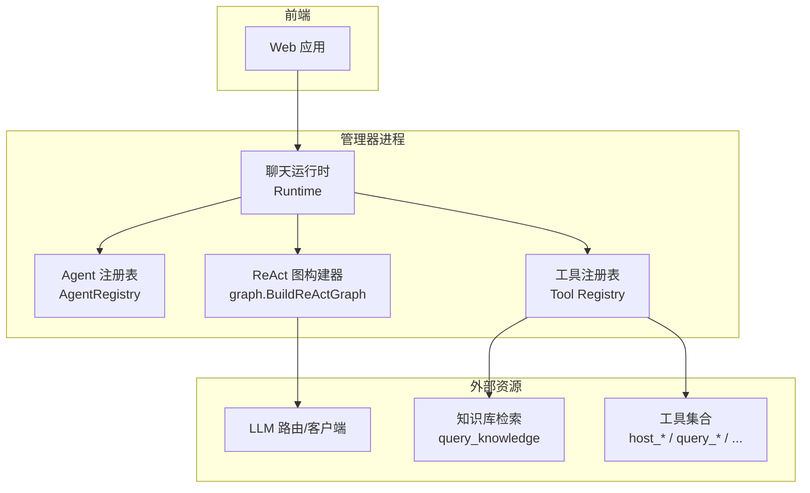
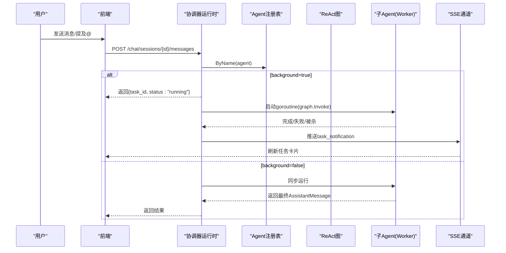
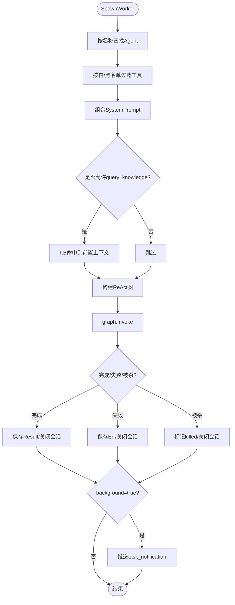
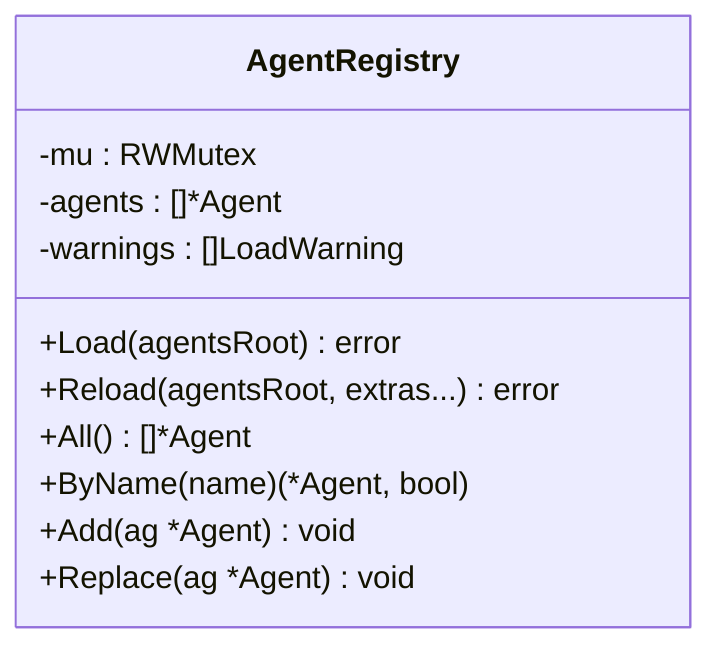
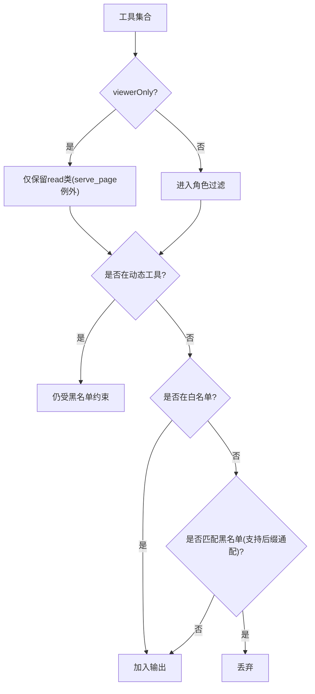
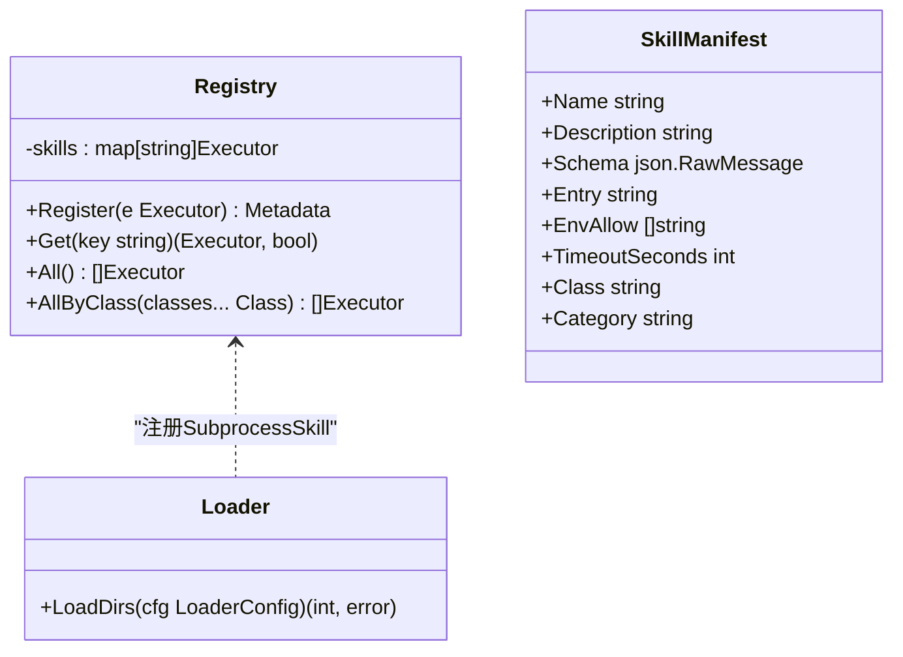
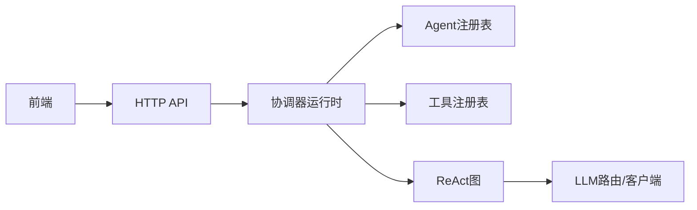

# Agent协作系统

<cite>
**本文引用的文件**   
- [worker.go](file://internal/manager/biz/aiops/chatruntime/worker.go)
- [agent_registry.go](file://internal/manager/biz/aiops/chatruntime/agent_registry.go)
- [main.go](file://cmd/ongrid/main.go)
- [types.go](file://internal/manager/biz/aiops/graph/types.go)
- [loader.go](file://internal/skill/loader.go)
- [registry.go](file://internal/skill/registry.go)
- [types.go](file://internal/skill/types.go)
- [incident-investigator.md](file://agents/incident-investigator.md)
- [reviewer.md](file://agents/reviewer.md)
- [specialist-disk.md](file://agents/specialist-disk.md)
- [specialist-network.md](file://agents/specialist-network.md)
- [specialist-ops.md](file://agents/specialist-ops.md)
- [redirect_stub.go](file://internal/manager/biz/aiops/tools/redirect_stub.go)
- [chat.ts](file://web/src/api/chat.ts)
- [agents.ts](file://web/src/api/agents.ts)
</cite>

## 目录
1. [简介](#简介)
2. [项目结构](#项目结构)
3. [核心组件](#核心组件)
4. [架构总览](#架构总览)
5. [详细组件分析](#详细组件分析)
6. [依赖关系分析](#依赖关系分析)
7. [性能与可扩展性](#性能与可扩展性)
8. [故障排查指南](#故障排查指南)
9. [结论](#结论)
10. [附录：通信协议与消息格式](#附录通信协议与消息格式)

## 简介
本文件系统化梳理 ongrid 的 Agent 协作系统，覆盖协调器（coordinator）与专业子 Agent（worker）的架构设计、任务分发、状态同步与结果聚合机制；详细说明内置 Agent 的职责边界与工具集；阐述技能注册与发现机制（含动态加载与版本管理思路）；提供自定义 Agent 开发指南（技能定义、工具绑定、权限控制）；并给出 Agent 间通信协议与消息格式规范。

## 项目结构
Agent 协作系统由“运行时 + 注册表 + 工具集 + 前端”构成：
- 运行时负责会话编排、工作流图构建、子 Agent 生命周期管理与 SSE 事件投递
- 注册表负责解析与热更新 Agent 人设（frontmatter）
- 工具集通过白名单/黑名单过滤为不同角色暴露能力
- 前端通过 API 与 SSE 展示对话、工具调用卡片与后台任务通知

图表来源
- [worker.go:547-683](file://internal/manager/biz/aiops/chatruntime/worker.go#L547-L683)
- [agent_registry.go:39-76](file://internal/manager/biz/aiops/chatruntime/agent_registry.go#L39-L76)
- [main.go:1473-1510](file://cmd/ongrid/main.go#L1473-L1510)
- [types.go:30-64](file://internal/manager/biz/aiops/graph/types.go#L30-L64)

章节来源
- [worker.go:1-120](file://internal/manager/biz/aiops/chatruntime/worker.go#L1-L120)
- [agent_registry.go:1-146](file://internal/manager/biz/aiops/chatruntime/agent_registry.go#L1-L146)
- [main.go:1473-1510](file://cmd/ongrid/main.go#L1473-L1510)
- [types.go:30-64](file://internal/manager/biz/aiops/graph/types.go#L30-L64)

## 核心组件
- 协调器（Coordinating Runtime）
  - 维护 Worker 内存映射、SSE 事件通道、会话持久化与审计
  - 根据 Agent 人设过滤工具集，构建 ReAct 图并驱动执行
  - 支持同步/异步（background）SpawnWorker，以及 SendToWorker/StopWorker
- 子 Agent（Worker）
  - 独立会话、独立工具视图、独立回调链
  - 状态机：pending → running → completed/failed/killed
  - 后台任务完成通过 task_notification 回推父会话
- Agent 注册表
  - 从 agentsRoot 扫描 *.md frontmatter，支持 Reload 热更新
  - 提供 All/ByName/Add/Replace 等接口
- 工具与权限
  - 基于白名单/黑名单 + 角色降级（viewerOnly）+ 控制工具隔离
  - 动态工具（Origin 标记）始终可见但受黑名单与 viewerOnly 约束
- 启动装配
  - 主进程在启动时加载 bootstrap skill/agent 注册表，并将控制工具注入协调器

章节来源
- [worker.go:64-124](file://internal/manager/biz/aiops/chatruntime/worker.go#L64-L124)
- [worker.go:243-412](file://internal/manager/biz/aiops/chatruntime/worker.go#L243-L412)
- [worker.go:706-724](file://internal/manager/biz/aiops/chatruntime/worker.go#L706-L724)
- [agent_registry.go:39-76](file://internal/manager/biz/aiops/chatruntime/agent_registry.go#L39-L76)
- [main.go:1473-1510](file://cmd/ongrid/main.go#L1473-L1510)

## 架构总览
下图展示了协调器与子 Agent 的协作流程，包括 Spawn、运行、通知与终止。

图表来源
- [worker.go:243-412](file://internal/manager/biz/aiops/chatruntime/worker.go#L243-L412)
- [worker.go:685-704](file://internal/manager/biz/aiops/chatruntime/worker.go#L685-L704)
- [chat.ts:147-159](file://web/src/api/chat.ts#L147-L159)

## 详细组件分析

### 协调器与子 Agent 运行时
- 生命周期
  - SpawnWorker：创建 Worker 记录、预建会话行、选择模型/最大步数、构建工具视图、组装 SystemPrompt、可选 KB 前置增强、构建 ReAct 图并 Invoke
  - SendToWorker：向运行中或已完成 Worker 追加消息继续推理
  - StopWorker：取消运行中/待开始 Worker，置 killed
- 工具过滤
  - 白名单优先；黑名单后缀通配（如 *_skill）
  - 控制工具（AgentTool/SendMessage/TaskStop）仅对协调器可见
  - viewerOnly 模式仅保留 read 类工具（serve_page 例外）
- 回调与持久化
  - 每个 Worker 拥有独立的 Persistence.SessionID，确保消息落库到其自身会话
  - 完成后自动关闭会话行，避免孤儿累积
- 后台任务通知
  - 使用 EventTaskNotification 将 task_notification 推送到父会话 SSE

图表来源
- [worker.go:547-683](file://internal/manager/biz/aiops/chatruntime/worker.go#L547-L683)
- [worker.go:685-704](file://internal/manager/biz/aiops/chatruntime/worker.go#L685-L704)

章节来源
- [worker.go:243-412](file://internal/manager/biz/aiops/chatruntime/worker.go#L243-L412)
- [worker.go:547-683](file://internal/manager/biz/aiops/chatruntime/worker.go#L547-L683)
- [worker.go:706-724](file://internal/manager/biz/aiops/chatruntime/worker.go#L706-L724)

### Agent 注册与热更新
- 加载策略
  - Load：从 agentsRoot 递归扫描 *.md，解析 frontmatter 生成 Agent 列表
  - Reload：原子替换内部切片，支持 marketplace 安装/卸载后热重载
- 查询与变更
  - All/ByName：并发安全读取
  - Add/Replace：程序化插入或就地替换（用于用户编辑路径）

图表来源
- [agent_registry.go:1-146](file://internal/manager/biz/aiops/chatruntime/agent_registry.go#L1-L146)

章节来源
- [agent_registry.go:39-76](file://internal/manager/biz/aiops/chatruntime/agent_registry.go#L39-L76)
- [agent_registry.go:96-146](file://internal/manager/biz/aiops/chatruntime/agent_registry.go#L96-L146)

### 工具与权限控制
- 过滤规则
  - 白名单为空则继承全部工具；否则仅白名单内工具可用
  - 黑名单支持后缀通配（如 *_skill），且“黑胜白”
  - 控制工具仅在协调器可见
  - viewerOnly 模式下仅保留 read 类工具（serve_page 例外）
  - 动态工具（Origin 标记）不受静态白名单限制，但仍受黑名单与 viewerOnly 约束
- 重定向桩
  - 针对易幻觉的工具名，协调器侧可将其重定向至专家 Agent（例如 host_du_summary → specialist-disk）

图表来源
- [worker.go:744-800](file://internal/manager/biz/aiops/chatruntime/worker.go#L744-L800)
- [redirect_stub.go:75-100](file://internal/manager/biz/aiops/tools/redirect_stub.go#L75-L100)

章节来源
- [worker.go:744-800](file://internal/manager/biz/aiops/chatruntime/worker.go#L744-L800)
- [redirect_stub.go:75-100](file://internal/manager/biz/aiops/tools/redirect_stub.go#L75-L100)

### 内置 Agent 定义与职责
以下 Agent 以 Markdown frontmatter 描述，包含 name/description/when_to_use/tools/disallowed_tools/permission_mode/max_turns/critical_reminder/metadata 等字段。

- 事故调查员（incident-investigator）
  - 目标：顺因果链溯源到根因（0号病人），输出因果链、现象、置信度与验证
  - 典型工具：知识检索、告警/拓扑/指标/日志/追踪查询、主机负载与进程、大文件定位等
  - 权限：只读；严格预算与死分支剪枝
- 代码审查员（reviewer）
  - 目标：对 mutating/destructive 提案做二审 approve/reject，默认 reject
  - 典型工具：SOP 文本、边缘摘要、PromQL/LogQL 并行操作检测、关联告警
  - 权限：只读；异步背景任务，结果通过 task-notification 投递
- 磁盘专家（specialist-disk）
  - 目标：文件系统/容量/大文件/inode/挂载点诊断
  - 典型工具：du/find/stat/bash/promql/host_load
  - 权限：只读；先查 KB 再动手
- 网络专家（specialist-network）
  - 目标：OVS/netfilter/netns/conntrack/eBPF/路由/防火墙/网卡诊断
  - 典型工具：bash/probe_http/dns/tcp/netns_inspect/promql/host_load
  - 权限：只读；强调“要点式回报”，不堆原始命令输出
- 运维专家（specialist-ops）
  - 目标：服务状态/启停重启/部署/配置/容量/计划任务
  - 典型工具：bash/processes/load/restart_service/promql/logql/edge_summary/cloud_bash
  - 权限：只读（mutating 走 reviewer 二审）；建议先结构化查询再 bash

章节来源
- [incident-investigator.md:1-114](file://agents/incident-investigator.md#L1-L114)
- [reviewer.md:1-102](file://agents/reviewer.md#L1-L102)
- [specialist-disk.md:1-59](file://agents/specialist-disk.md#L1-L59)
- [specialist-network.md:1-67](file://agents/specialist-network.md#L1-L67)
- [specialist-ops.md:1-66](file://agents/specialist-ops.md#L1-L66)

### 技能注册与发现（含动态加载）
- 注册中心
  - 全局 Registry 提供 Register/Get/All/AllByClass，线程安全
  - 校验 Key/Class/Scope/Params 等元数据一致性，重复 Key 直接 panic（作者期错误）
- 动态加载
  - LoaderConfig.Dirs 指定允许目录，递归扫描 skill.json
  - 构建 SubprocessSkill，校验 entry 路径在 allowlist 下，设置超时、类别、分类
  - 去重策略：已存在则跳过，避免部署期间新旧文件重叠导致崩溃
- 版本管理
  - 当前实现未显式声明版本号；可通过目录布局/文件名约定或外部清单进行版本治理（仓库未实现）

图表来源
- [registry.go:1-127](file://internal/skill/registry.go#L1-L127)
- [loader.go:1-274](file://internal/skill/loader.go#L1-L274)

章节来源
- [registry.go:1-127](file://internal/skill/registry.go#L1-L127)
- [loader.go:1-274](file://internal/skill/loader.go#L1-L274)
- [types.go:1-241](file://internal/skill/types.go#L1-L241)

### 自定义 Agent 开发指南
- 定义 Agent 人设
  - 在 agents 目录下新增 *.md，填写 frontmatter：name/description/when_to_use/tools/disallowed_tools/permission_mode/max_turns/model/background/critical_reminder/metadata
  - 使用 when_to_use 明确触发场景；tools/disallowed_tools 精确限定能力面
- 绑定工具
  - 协调器侧通过 Tool Registry 暴露工具；Agent 仅能访问经白名单过滤后的工具视图
  - 如需将通用工具重定向到专家，可在协调器侧添加 RedirectStub
- 权限控制
  - permission_mode=read-only 配合 viewerOnly 模式，确保只读体验
  - mutating 操作需走 reviewer 二审流程（如 host_restart_service）
- 动态加载
  - 若需要扩展“子进程技能包”，在配置的 ExternalDirs 下放置 skill.json 与入口脚本，Loader 会自动注册
- 版本与热更新
  - Agent 注册表支持 Reload；技能注册表支持增量加载与去重

章节来源
- [agent_registry.go:39-76](file://internal/manager/biz/aiops/chatruntime/agent_registry.go#L39-L76)
- [redirect_stub.go:75-100](file://internal/manager/biz/aiops/tools/redirect_stub.go#L75-L100)
- [loader.go:1-274](file://internal/skill/loader.go#L1-L274)
- [types.go:1-241](file://internal/skill/types.go#L1-L241)

## 依赖关系分析
- 运行时依赖
  - AgentRegistry：解析与管理 Agent 人设
  - Tool Registry：统一工具注册与过滤
  - Graph 构建器：依据输入构造 ReAct 图并驱动 LLM
- 前端依赖
  - chat.ts：发送消息、携带 mentions/locale/webSearchEnabled 等选项
  - agents.ts：获取 Agent 清单与详情，渲染 UI

图表来源
- [chat.ts:147-159](file://web/src/api/chat.ts#L147-L159)
- [agents.ts:1-37](file://web/src/api/agents.ts#L1-L37)
- [worker.go:547-683](file://internal/manager/biz/aiops/chatruntime/worker.go#L547-L683)

章节来源
- [chat.ts:147-159](file://web/src/api/chat.ts#L147-L159)
- [agents.ts:1-37](file://web/src/api/agents.ts#L1-L37)
- [worker.go:547-683](file://internal/manager/biz/aiops/chatruntime/worker.go#L547-L683)

## 性能与可扩展性
- 并发与隔离
  - 每个 Worker 独立 goroutine、独立会话与回调链，互不干扰
  - 后台任务不随 HTTP 请求上下文销毁而中断
- 资源与预算
  - 通过 MaxTurns 限制单轮最大迭代次数；KB 前置减少无效 ReAct 循环
  - 控制工具与动态工具分离，降低提示词膨胀
- 可扩展点
  - 新增 Agent：仅需在 agentsRoot 增加 frontmatter 或通过 Replace 热插拔
  - 新增工具：注册到 Tool Registry，并在 Agent 白名单中声明
  - 动态技能包：通过 Loader 扫描 external dirs 自动注册

[本节为通用指导，无需源码引用]

## 故障排查指南
- Worker 无法启动
  - 检查 Agent 名称是否存在于注册表；确认 ChatModel 与 AgentRegistry 已正确注入
- 工具不可见
  - 核对 Agent 的 tools/disallowed_tools 配置；确认 viewerOnly 模式未误删必要工具
- 后台任务无通知
  - 确认 ParentEmit 已传入；检查 SSE 监听是否订阅 task_notification
- 会话孤儿
  - 确认 runWorker 的 defer CloseSession 正常执行；避免异常路径泄漏

章节来源
- [worker.go:243-412](file://internal/manager/biz/aiops/chatruntime/worker.go#L243-L412)
- [worker.go:547-683](file://internal/manager/biz/aiops/chatruntime/worker.go#L547-L683)
- [worker.go:685-704](file://internal/manager/biz/aiops/chatruntime/worker.go#L685-L704)

## 结论
本系统以“协调器 + 专业子 Agent”的架构实现了高内聚、低耦合的多智能体协作。通过严格的工具过滤、清晰的权限分级、稳定的状态机与 SSE 通知机制，既保证了安全性与可观测性，又提供了良好的可扩展性与用户体验。内置 Agent 覆盖了常见运维场景，结合动态技能包与热更新能力，便于持续演进。

[本节为总结，无需源码引用]

## 附录：通信协议与消息格式

### 前端 → 后端：发送消息
- 端点：POST /chat/sessions/{sessionId}/messages
- 请求体关键字段
  - content：用户消息
  - provider/model：可选，覆盖本次调用的 LLM 提供者与模型
  - mentions：可选，@提及对象
  - web_search_enabled：可选，是否启用 web_search
  - locale：可选，UI 语言（en-US | zh-CN）
- 响应：会话消息 ID 与状态

章节来源
- [chat.ts:147-159](file://web/src/api/chat.ts#L147-L159)

### 后端 → 前端：SSE 事件
- 事件类型
  - assistant/tool/done：常规对话与工具调用流式事件
  - task_notification：后台 Worker 完成/失败/被杀的通知
- task_notification 载荷
  - task_id：Worker 唯一标识
  - status：completed/failed/killed
  - summary：简要摘要
  - result/error：结果或错误信息
  - usage：耗时等用量信息

章节来源
- [worker.go:685-704](file://internal/manager/biz/aiops/chatruntime/worker.go#L685-L704)

### Agent 清单接口
- 端点：GET /v1/agents
- 返回项字段（精简）
  - name/description/when_to_use/tools/disallowed_tools/permission_mode/model/max_turns/system_prompt/critical_reminder/source

章节来源
- [agents.ts:1-37](file://web/src/api/agents.ts#L1-L37)