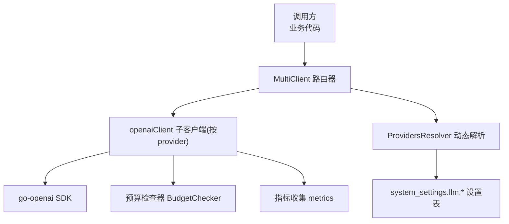
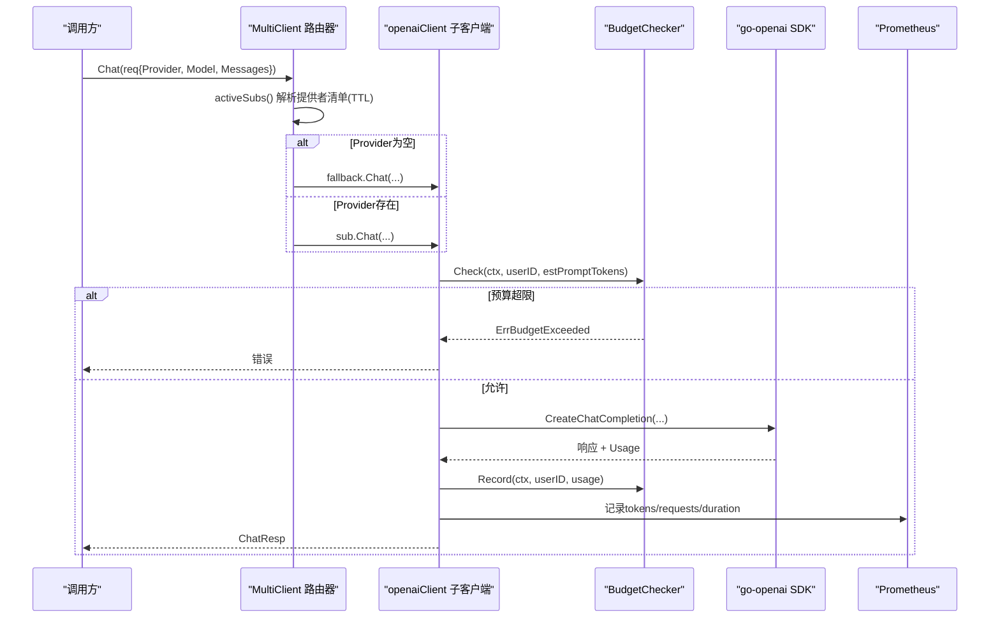
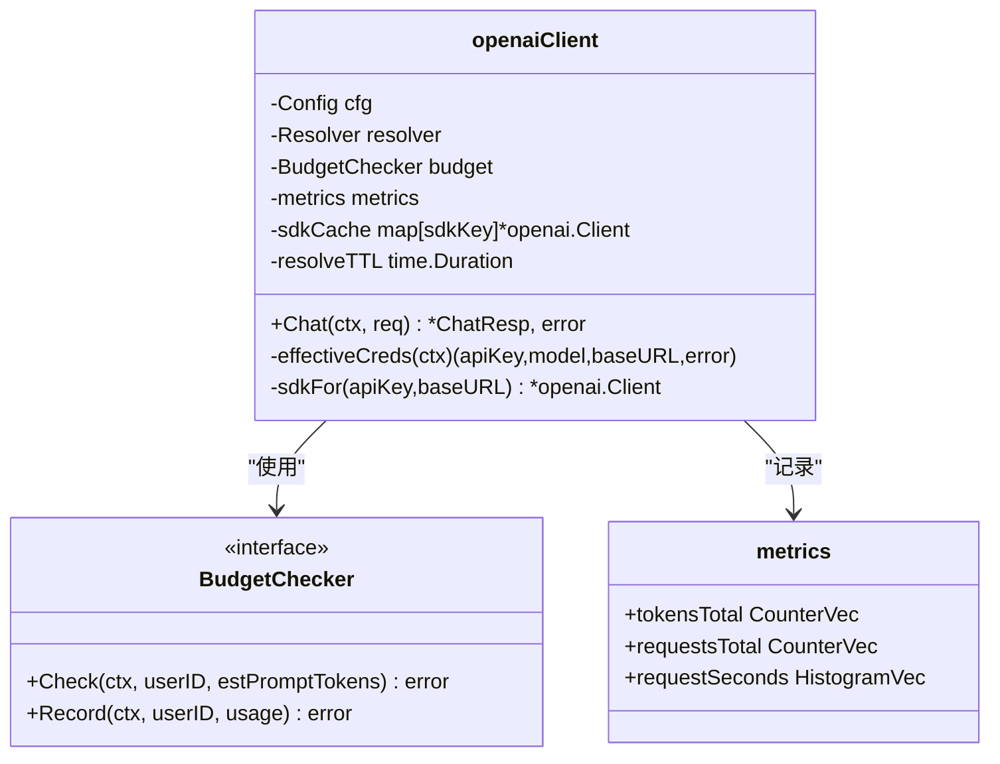
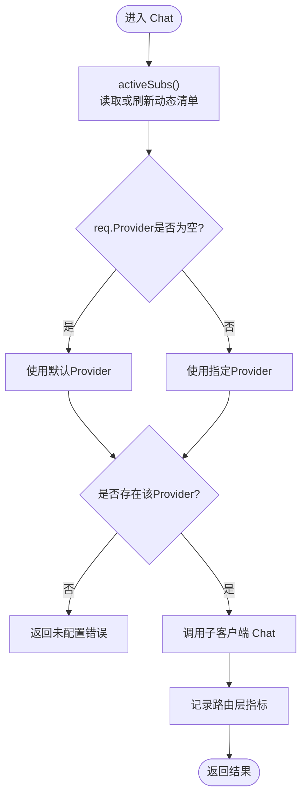
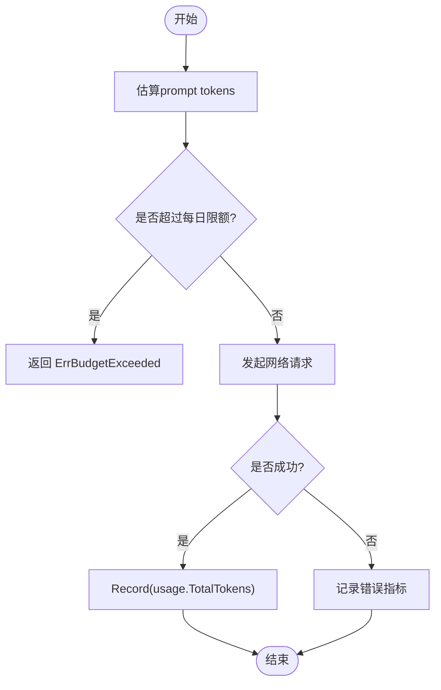
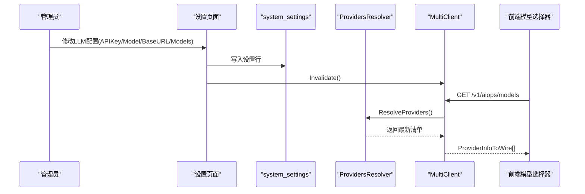
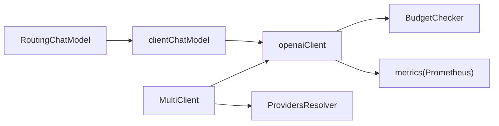

# LLM模型集成

<cite>
**本文引用的文件**   
- [internal/pkg/llm/client.go](file://internal/pkg/llm/client.go)
- [internal/pkg/llm/router.go](file://internal/pkg/llm/router.go)
- [internal/pkg/llm/budget.go](file://internal/pkg/llm/budget.go)
- [internal/pkg/llm/budget_callback.go](file://internal/pkg/llm/budget_callback.go)
- [internal/pkg/llm/eino_routing.go](file://internal/pkg/llm/eino_routing.go)
- [internal/pkg/llm/metrics.go](file://internal/pkg/llm/metrics.go)
- [internal/pkg/prom/manager_metrics.go](file://internal/pkg/prom/manager_metrics.go)
- [cmd/ongrid/main.go](file://cmd/ongrid/main.go)
- [internal/manager/biz/aiops/investigator/investigator.go](file://internal/manager/biz/aiops/investigator/investigator.go)
- [internal/manager/biz/aiops/chatruntime/worker.go](file://internal/manager/biz/aiops/chatruntime/worker.go)
</cite>

## 目录
1. [简介](#简介)
2. [项目结构](#项目结构)
3. [核心组件](#核心组件)
4. [架构总览](#架构总览)
5. [详细组件分析](#详细组件分析)
6. [依赖关系分析](#依赖关系分析)
7. [性能与成本优化](#性能与成本优化)
8. [故障排查指南](#故障排查指南)
9. [结论](#结论)
10. [附录](#附录)

## 简介
本文件系统化梳理项目中多提供商LLM的统一接入、动态路由、预算控制、配置热更新、降级与故障转移，以及可观测性与使用统计。系统支持OpenAI、Anthropic、Gemini、DeepSeek、Zhipu、Kimi等提供者的无缝切换，并通过“设置→集成→LLM模型”界面进行运行时管理，无需重启服务即可生效。

## 项目结构
- 统一客户端层：面向调用方暴露统一的Chat接口，屏蔽底层SDK差异（基于OpenAI兼容协议）。
- 多提供商路由器：按Provider维度分发请求，并维护默认提供者与模型列表。
- 预算控制器：在请求前估算Token用量并拦截超限请求；成功后记录实际用量。
- eino适配层：将现有Client适配为eino ChatModel，支持图编排中的选择与工具绑定。
- 指标与监控：Prometheus指标覆盖延迟、成功率、Token消耗与路由级统计。
- 启动装配：从环境变量与数据库设置中注入提供者清单，构建路由器与内部模型映射。

图表来源
- [internal/pkg/llm/router.go:98-129](file://internal/pkg/llm/router.go#L98-L129)
- [internal/pkg/llm/client.go:154-187](file://internal/pkg/llm/client.go#L154-L187)
- [internal/pkg/llm/budget.go:25-33](file://internal/pkg/llm/budget.go#L25-L33)
- [internal/pkg/llm/metrics.go:26-69](file://internal/pkg/llm/metrics.go#L26-L69)
- [cmd/ongrid/main.go:532-541](file://cmd/ongrid/main.go#L532-L541)

章节来源
- [cmd/ongrid/main.go:532-541](file://cmd/ongrid/main.go#L532-L541)
- [cmd/ongrid/main.go:543-605](file://cmd/ongrid/main.go#L543-L605)
- [cmd/ongrid/main.go:672-721](file://cmd/ongrid/main.go#L672-L721)

## 核心组件
- 统一客户端 Client
  - 暴露Chat接口，封装消息、工具调用、温度参数与Usage统计。
  - 支持通过Resolver在每次调用时动态获取APIKey/Model/BaseURL，具备TTL缓存。
  - 内置默认超时策略与错误分类，记录结构化日志与Prom指标。
- 多提供商路由器 MultiClient
  - 根据ChatReq.Provider选择对应子客户端；空Provider回退到默认或构造时传入的fallback。
  - 支持动态ProvidersResolver刷新提供者清单，TTL=60s，失败软回退至静态清单。
  - 对外暴露Providers/Default/HasProvider/AsWire等能力供UI与上层消费。
- 预算控制器 BudgetChecker
  - InMemoryBudget实现按UTC日全局Token上限控制；Check在发送前估算用量，Record在成功后累计。
  - 返回ErrBudgetExceeded用于快速拒绝。
- eino适配层
  - RoutingChatModel：按Provider分发到内部ChatModel，支持默认提供者动态解析。
  - clientChatModel：将现有llm.Client适配为eino ChatModel，透传工具与温度等选项。
  - BudgetCallbackHandler：在eino回调链中执行预算检查与用量记录。
- 指标与监控
  - llm包内指标：按model维度统计tokens、requests、duration。
  - manager侧指标：按provider+model维度统计调用次数、耗时与router层token计数。

章节来源
- [internal/pkg/llm/client.go:125-128](file://internal/pkg/llm/client.go#L125-L128)
- [internal/pkg/llm/client.go:154-187](file://internal/pkg/llm/client.go#L154-L187)
- [internal/pkg/llm/client.go:344-448](file://internal/pkg/llm/client.go#L344-L448)
- [internal/pkg/llm/router.go:61-87](file://internal/pkg/llm/router.go#L61-87)
- [internal/pkg/llm/router.go:289-334](file://internal/pkg/llm/router.go#L289-L334)
- [internal/pkg/llm/budget.go:18-33](file://internal/pkg/llm/budget.go#L18-L33)
- [internal/pkg/llm/budget_callback.go:56-83](file://internal/pkg/llm/budget_callback.go#L56-L83)
- [internal/pkg/llm/eino_routing.go:89-142](file://internal/pkg/llm/eino_routing.go#L89-L142)
- [internal/pkg/llm/metrics.go:14-69](file://internal/pkg/llm/metrics.go#L14-L69)
- [internal/pkg/prom/manager_metrics.go:234-262](file://internal/pkg/prom/manager_metrics.go#L234-L262)

## 架构总览
下图展示一次典型聊天请求在多提供商环境下的端到端流程，包括动态解析、路由、预算检查、网络调用与指标上报。

图表来源
- [internal/pkg/llm/router.go:289-334](file://internal/pkg/llm/router.go#L289-L334)
- [internal/pkg/llm/client.go:344-448](file://internal/pkg/llm/client.go#L344-L448)
- [internal/pkg/llm/budget.go:35-60](file://internal/pkg/llm/budget.go#L35-L60)
- [internal/pkg/llm/metrics.go:35-69](file://internal/pkg/llm/metrics.go#L35-L69)

## 详细组件分析

### 统一客户端 openaiClient
- 关键职责
  - 解析有效凭据：优先Resolver结果，其次cfg；字段为空则回退。
  - 预算门控：在发送前估算prompt tokens并拦截超限请求。
  - 超时保护：若调用方未设置deadline，应用默认超时。
  - 指标与日志：记录成功/错误/预算拒绝、延迟与token用量。
- 设计要点
  - SDK客户端按(apiKey, baseURL)键缓存，避免频繁重建。
  - 针对特定提供商（如智谱）安装自定义HTTP传输以重写鉴权头。
  - BaseURL规范化：对无路径的自定义地址自动追加/v1，兼容Ollama等OpenAI兼容网关。

图表来源
- [internal/pkg/llm/client.go:189-207](file://internal/pkg/llm/client.go#L189-L207)
- [internal/pkg/llm/client.go:220-251](file://internal/pkg/llm/client.go#L220-L251)
- [internal/pkg/llm/client.go:263-286](file://internal/pkg/llm/client.go#L263-L286)
- [internal/pkg/llm/client.go:344-448](file://internal/pkg/llm/client.go#L344-L448)
- [internal/pkg/llm/metrics.go:14-69](file://internal/pkg/llm/metrics.go#L14-L69)

章节来源
- [internal/pkg/llm/client.go:154-187](file://internal/pkg/llm/client.go#L154-L187)
- [internal/pkg/llm/client.go:220-251](file://internal/pkg/llm/client.go#L220-L251)
- [internal/pkg/llm/client.go:263-286](file://internal/pkg/llm/client.go#L263-L286)
- [internal/pkg/llm/client.go:344-448](file://internal/pkg/llm/client.go#L344-L448)

### 多提供商路由器 MultiClient
- 关键职责
  - 维护静态与动态两套提供者清单；动态清单来自ProvidersResolver，TTL=60s。
  - 当Provider为空时，优先使用默认提供者，再回退到构造时传入的fallback。
  - 暴露Providers/Default/HasProvider/AsWire等查询能力。
- 动态解析与热更新
  - SetProvidersResolver注入解析器；Invalidate强制立即刷新。
  - 解析失败或返回空时，软回退到静态清单，避免冷启动或DB抖动导致不可用。

图表来源
- [internal/pkg/llm/router.go:160-230](file://internal/pkg/llm/router.go#L160-L230)
- [internal/pkg/llm/router.go:289-334](file://internal/pkg/llm/router.go#L289-L334)

章节来源
- [internal/pkg/llm/router.go:98-129](file://internal/pkg/llm/router.go#L98-L129)
- [internal/pkg/llm/router.go:160-230](file://internal/pkg/llm/router.go#L160-L230)
- [internal/pkg/llm/router.go:289-334](file://internal/pkg/llm/router.go#L289-L334)

### 预算控制与成本管理机制
- 预算检查
  - 在发送前估算prompt tokens，超过每日限额直接拒绝，返回ErrBudgetExceeded。
  - 成功后记录实际usage.TotalTokens，保证计费口径一致。
- 全局配额
  - InMemoryBudget按UTC日维度维护全局Token使用量，适合单租户场景。
- eino侧预算
  - BudgetCallbackHandler在OnStart估算并在OnEnd记录，避免重复计费（与client直连路径互斥）。

图表来源
- [internal/pkg/llm/budget.go:35-60](file://internal/pkg/llm/budget.go#L35-L60)
- [internal/pkg/llm/budget_callback.go:105-147](file://internal/pkg/llm/budget_callback.go#L105-L147)
- [internal/pkg/llm/client.go:359-370](file://internal/pkg/llm/client.go#L359-L370)

章节来源
- [internal/pkg/llm/budget.go:18-33](file://internal/pkg/llm/budget.go#L18-L33)
- [internal/pkg/llm/budget_callback.go:56-83](file://internal/pkg/llm/budget_callback.go#L56-L83)
- [internal/pkg/llm/client.go:359-370](file://internal/pkg/llm/client.go#L359-L370)

### 模型配置管理与热更新机制
- 启动装配
  - 从环境变量与设置服务初始化各Provider的配置（ID、Label、APIKey、Model、BaseURL、Models）。
  - 构建MultiClient，并将OpenAI子客户端作为fallback，确保旧路径兼容。
- 动态解析
  - 通过ProvidersResolver读取system_settings.llm.*行，合并env默认值，形成最终清单。
  - TTL=60s；管理员保存后调用Invalidate可立即生效。
- 前端可见性
  - /v1/aiops/models返回ProviderInfoToWire，仅包含非敏感信息，供SPA下拉框渲染。

图表来源
- [cmd/ongrid/main.go:543-605](file://cmd/ongrid/main.go#L543-L605)
- [cmd/ongrid/main.go:672-721](file://cmd/ongrid/main.go#L672-L721)
- [internal/pkg/llm/router.go:232-243](file://internal/pkg/llm/router.go#L232-L243)
- [internal/pkg/llm/router.go:245-267](file://internal/pkg/llm/router.go#L245-L267)

章节来源
- [cmd/ongrid/main.go:543-605](file://cmd/ongrid/main.go#L543-L605)
- [cmd/ongrid/main.go:672-721](file://cmd/ongrid/main.go#L672-L721)
- [internal/pkg/llm/router.go:232-243](file://internal/pkg/llm/router.go#L232-L243)

### 智能路由算法与动态选择策略
- 当前实现
  - 路由策略为“按Provider精确匹配”，空Provider走默认提供者或fallback。
  - 默认提供者由ProvidersResolver返回的defaultProvider决定，否则取清单排序首项。
- 可扩展方向（建议）
  - 基于成本、延迟、质量的多维评分函数，结合实时遥测（延迟分位、错误率、限流比例）与价格表，计算每Provider的性价比得分。
  - 引入权重轮询或阈值触发切换（例如某Provider错误率>阈值则降权），并结合熔断与快速失败。
  - 对推理型模型与工具调用场景分别建模，差异化选择。

[本节为概念性扩展，不直接分析具体文件]

### 降级与故障转移策略
- 软回退
  - ProvidersResolver失败或返回空时，回退到静态清单，保障可用性。
  - openaiClient.effectiveCreds解析失败时，回退到cfg的环境默认值。
- 超时与限流
  - 默认超时保护，避免长尾阻塞；路由层将超时与限流归类为不同状态标签，便于告警。
- 备用路径
  - 当所有Provider均不可用时，fallback（构造时传入的OpenAI子客户端）可作为兜底。

章节来源
- [internal/pkg/llm/router.go:178-190](file://internal/pkg/llm/router.go#L178-L190)
- [internal/pkg/llm/client.go:232-251](file://internal/pkg/llm/client.go#L232-L251)
- [internal/pkg/llm/router.go:336-351](file://internal/pkg/llm/router.go#L336-L351)

### 性能监控、使用统计与优化建议
- 指标体系
  - llm包：按model维度统计tokens、requests、duration。
  - manager侧：按provider+model维度统计调用次数、耗时与router层token计数。
- 使用统计
  - 通过ResponseMeta.Usage或回调输出中的TokenUsage汇总输入/输出token。
- 优化建议
  - 合理设置默认超时与队列深度，避免慢下游拖垮上游。
  - 对高频短文本场景启用更小的Temperature与精简工具集，降低token开销。
  - 利用路由层指标识别高延迟/高错误率Provider，及时调优或下线。

章节来源
- [internal/pkg/llm/metrics.go:35-69](file://internal/pkg/llm/metrics.go#L35-L69)
- [internal/pkg/prom/manager_metrics.go:234-262](file://internal/pkg/prom/manager_metrics.go#L234-L262)
- [internal/manager/biz/aiops/investigator/investigator.go:48-60](file://internal/manager/biz/aiops/investigator/investigator.go#L48-L60)

## 依赖关系分析
- 组件耦合
  - MultiClient依赖ProvidersResolver与多个openaiClient实例；openaiClient依赖BudgetChecker与metrics。
  - eino适配层RoutingChatModel依赖clientChatModel，后者包装llm.Client。
- 外部依赖
  - go-openai SDK用于统一OpenAI兼容协议。
  - Prometheus用于指标采集。
- 潜在循环依赖
  - 当前未发现循环依赖；路由与客户端分层清晰。

图表来源
- [internal/pkg/llm/router.go:98-129](file://internal/pkg/llm/router.go#L98-L129)
- [internal/pkg/llm/client.go:189-207](file://internal/pkg/llm/client.go#L189-L207)
- [internal/pkg/llm/eino_routing.go:317-353](file://internal/pkg/llm/eino_routing.go#L317-L353)

章节来源
- [internal/pkg/llm/router.go:98-129](file://internal/pkg/llm/router.go#L98-L129)
- [internal/pkg/llm/client.go:189-207](file://internal/pkg/llm/client.go#L189-L207)
- [internal/pkg/llm/eino_routing.go:317-353](file://internal/pkg/llm/eino_routing.go#L317-L353)

## 性能与成本优化
- 超时与并发
  - 统一默认超时，避免长尾；后台任务（如RCA调查）采用独立工作协程与队列深度限制，防止风暴式调用。
- Token成本控制
  - 预算门控在发送前拦截，减少无效网络开销；成功后精准记录TotalTokens。
- 模型与工具精简
  - 按需传递Tools与Temperature，避免不必要的schema与参数膨胀。
- 路由层优化
  - 动态清单TTL与失效策略平衡一致性与时延；Invalidate用于管理员即时生效。

章节来源
- [internal/manager/biz/aiops/investigator/investigator.go:48-60](file://internal/manager/biz/aiops/investigator/investigator.go#L48-L60)
- [internal/pkg/llm/client.go:378-384](file://internal/pkg/llm/client.go#L378-L384)
- [internal/pkg/llm/budget.go:35-60](file://internal/pkg/llm/budget.go#L35-L60)
- [internal/pkg/llm/router.go:232-243](file://internal/pkg/llm/router.go#L232-L243)

## 故障排查指南
- 常见问题定位
  - 未配置Provider：检查路由层返回的错误信息，确认是否已注册且APIKey非空。
  - 预算超限：查看预算拒绝日志与计数器，调整每日限额或精简输入。
  - 超时/限流：观察路由层status标签，区分timeout与rate_limited，针对性优化或扩容。
  - 动态配置未生效：确认是否调用Invalidate，或等待TTL过期；检查Resolver是否返回空。
- 关键日志与指标
  - llm chat completion：包含model、user_id、tokens、tool_calls、duration。
  - ongrid_llm_requests_total：按model/result聚合。
  - ongrid_llm_call_duration_seconds：按provider+model聚合。
  - ongrid_llm_router_tokens_total：按provider+model+kind聚合。

章节来源
- [internal/pkg/llm/client.go:436-448](file://internal/pkg/llm/client.go#L436-L448)
- [internal/pkg/llm/metrics.go:35-69](file://internal/pkg/llm/metrics.go#L35-L69)
- [internal/pkg/prom/manager_metrics.go:234-262](file://internal/pkg/prom/manager_metrics.go#L234-L262)
- [internal/pkg/llm/router.go:336-351](file://internal/pkg/llm/router.go#L336-L351)

## 结论
本项目通过统一客户端与多提供商路由器实现了OpenAI、Anthropic、Gemini、DeepSeek、Zhipu、Kimi等模型的无缝切换；借助动态解析与TTL缓存，管理员可在不重启的情况下完成配置热更新；预算控制器与指标体系共同保障了成本可控与运行可观测。未来可在路由层引入多维评分与自适应切换策略，进一步提升稳定性与性价比。

## 附录
- 相关常量与Provider ID
  - 支持的Provider ID：openai、anthropic、zhipu、gemini、deepseek、kimi、custom。
- 默认超时
  - 默认超时为120秒，适用于复杂工具调用与推理模型。

章节来源
- [internal/pkg/llm/eino_routing.go:40-51](file://internal/pkg/llm/eino_routing.go#L40-L51)
- [internal/pkg/llm/client.go:44](file://internal/pkg/llm/client.go#L44)