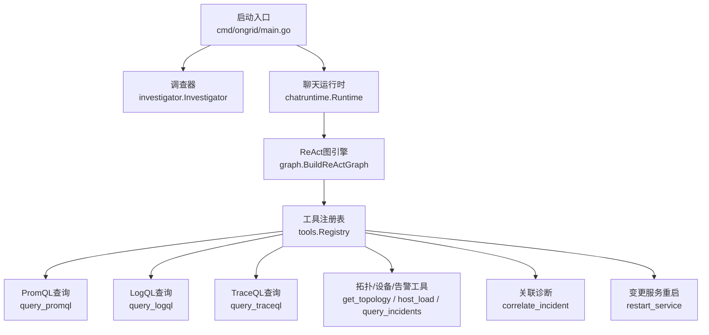
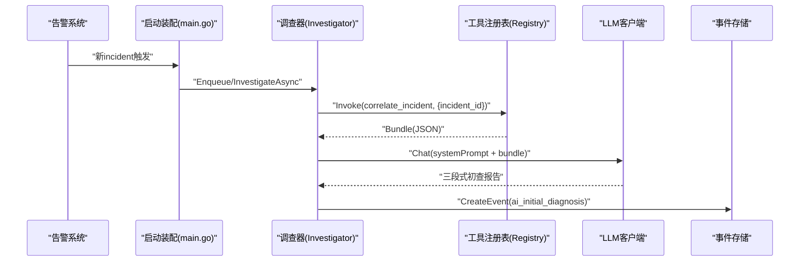
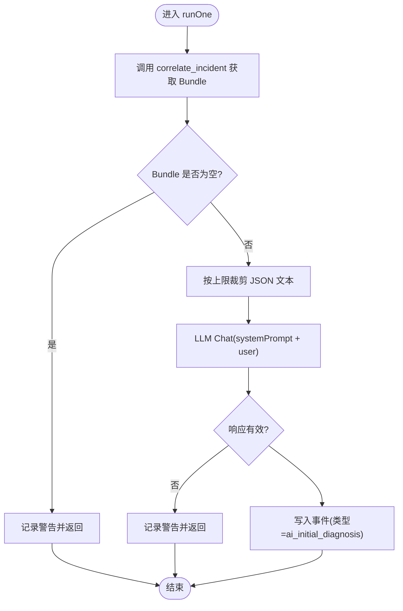
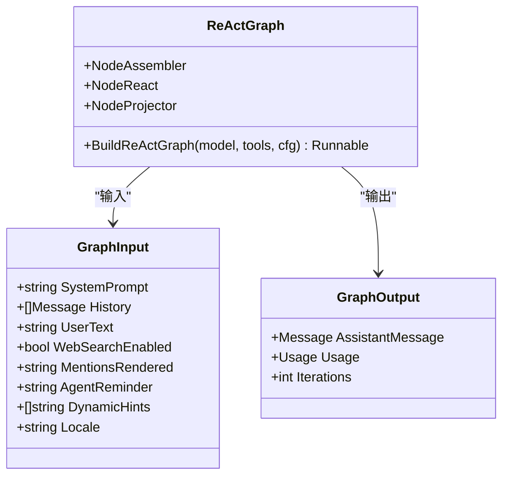
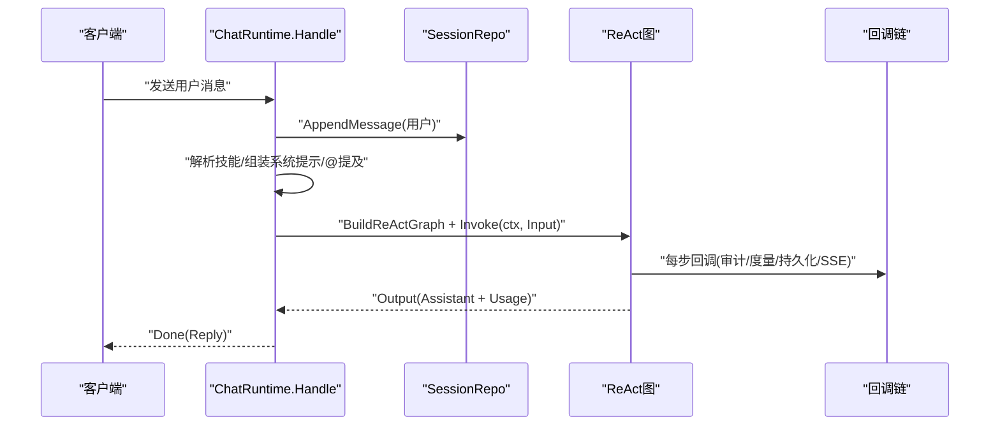
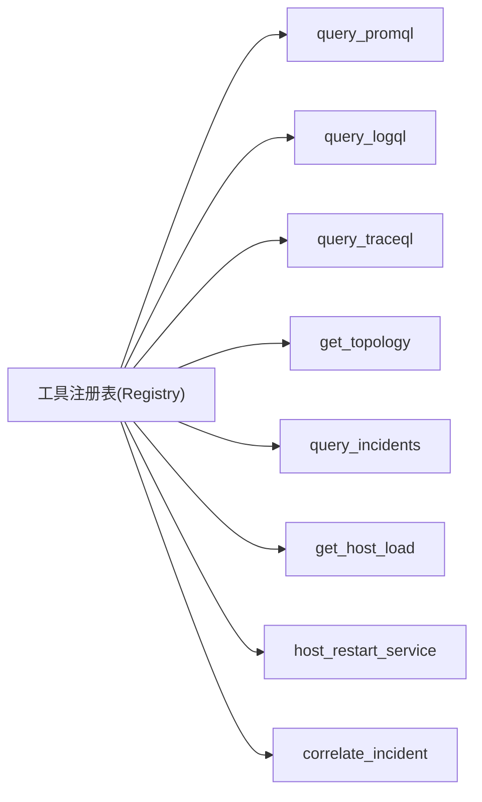
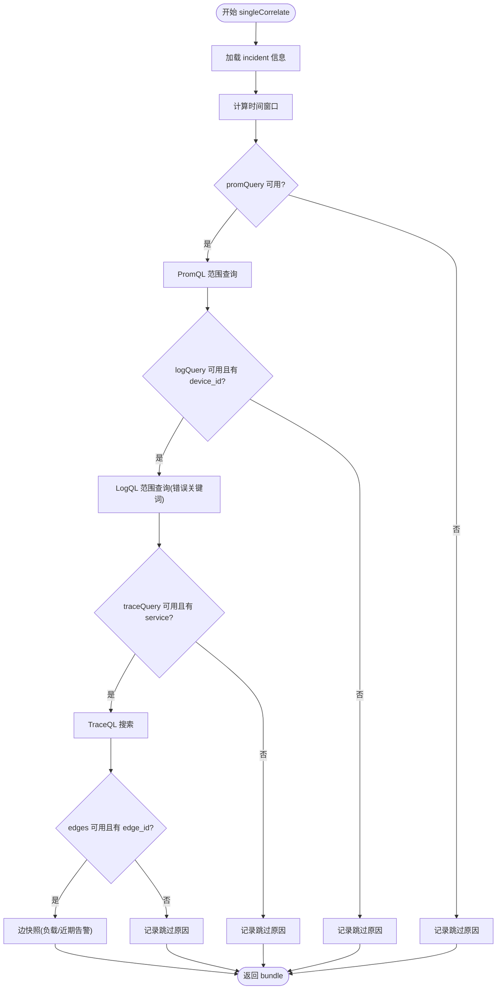
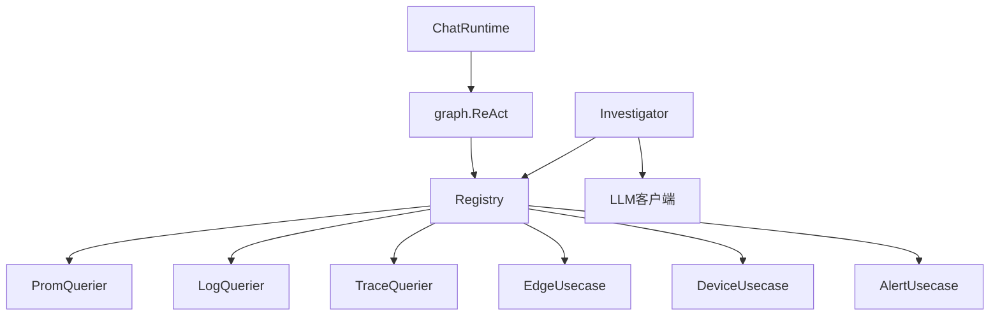

# RCA根因分析引擎

<cite>
**本文引用的文件**
- [cmd/ongrid/main.go](file://cmd/ongrid/main.go)
- [internal/manager/biz/aiops/investigator/investigator.go](file://internal/manager/biz/aiops/investigator/investigator.go)
- [internal/manager/biz/aiops/chatruntime/runtime.go](file://internal/manager/biz/aiops/chatruntime/runtime.go)
- [internal/manager/biz/aiops/graph/react.go](file://internal/manager/biz/aiops/graph/react.go)
- [internal/manager/biz/aiops/tools/registry.go](file://internal/manager/biz/aiops/tools/registry.go)
- [internal/manager/biz/aiops/tools/query_promql.go](file://internal/manager/biz/aiops/tools/query_promql.go)
- [internal/manager/biz/aiops/tools/query_logql.go](file://internal/manager/biz/aiops/tools/query_logql.go)
- [internal/manager/biz/aiops/tools/query_traceql.go](file://internal/manager/biz/aiops/tools/query_traceql.go)
- [internal/manager/biz/aiops/tools/correlate_incident_basetool.go](file://internal/manager/biz/aiops/tools/correlate_incident_basetool.go)
- [internal/manager/biz/aiops/tools/host_load_basetool.go](file://internal/manager/biz/aiops/tools/host_load_basetool.go)
- [internal/manager/biz/aiops/tools/get_topology_basetool.go](file://internal/manager/biz/aiops/tools/get_topology_basetool.go)
- [internal/manager/biz/aiops/tools/query_incidents_basetool.go](file://internal/manager/biz/aiops/tools/query_incidents_basetool.go)
- [internal/manager/biz/aiops/tools/restart_service_basetool.go](file://internal/manager/biz/aiops/tools/restart_service_basetool.go)
</cite>

## 目录
1. [简介](#简介)
2. [项目结构](#项目结构)
3. [核心组件](#核心组件)
4. [架构总览](#架构总览)
5. [详细组件分析](#详细组件分析)
6. [依赖关系分析](#依赖关系分析)
7. [性能考量](#性能考量)
8. [故障排查指南](#故障排查指南)
9. [结论](#结论)
10. [附录](#附录)

## 简介
本文件面向RCA（根因分析）根因分析引擎，系统性阐述自动故障诊断的核心算法与工作流程：从告警事件触发、上下文收集、多源数据关联分析到根因定位策略；并深入解析React图执行引擎的节点调度、工具调用与结果聚合机制；同时说明与指标、日志、链路拓扑等数据源的集成方式。文档覆盖从“告警触发→调查→修复建议”的全生命周期管理，并提供性能优化策略与错误处理机制。

## 项目结构
RCA能力由“调查器（Investigator）+ 聊天运行时（ChatRuntime）+ ReAct图引擎 + 工具注册表（Tools Registry）”构成，并通过HTTP入口在启动时装配。关键路径如下：
- 启动装配：根据环境变量启用结构化RCA调查器，并将旧版AI初查与结构化RCA通过链式编排接入告警触发流程。
- 调查器：在incident诞生后异步拉取关联上下文（指标/日志/链路/边状态），一次性调用LLM生成初查报告并持久化。
- 聊天运行时：统一编排会话、技能、系统提示、@提及注入、历史回放、ReAct图执行、回调链（持久化/SSE/审计/预算）。
- ReAct图：基于eino的react子图，封装消息组装、模型调用、工具节点、输出投影，提供稳定的节点名以便审计与SSE过滤。
- 工具注册表：集中注册query_promql/query_logql/query_traceql、get_topology、correlate_incident、host_load、restart_service等工具，按依赖条件动态注册。

图表来源
- [cmd/ongrid/main.go:1635-1699](file://cmd/ongrid/main.go#L1635-L1699)
- [internal/manager/biz/aiops/investigator/investigator.go:1-329](file://internal/manager/biz/aiops/investigator/investigator.go#L1-L329)
- [internal/manager/biz/aiops/chatruntime/runtime.go:1-800](file://internal/manager/biz/aiops/chatruntime/runtime.go#L1-L800)
- [internal/manager/biz/aiops/graph/react.go:1-317](file://internal/manager/biz/aiops/graph/react.go#L1-L317)
- [internal/manager/biz/aiops/tools/registry.go:1-383](file://internal/manager/biz/aiops/tools/registry.go#L1-L383)

章节来源
- [cmd/ongrid/main.go:1635-1699](file://cmd/ongrid/main.go#L1635-L1699)

## 核心组件
- 调查器（Investigator）
  - 职责：incident首次触发后，直接调用correlate_incident工具拉取多源上下文，拼接固定中文系统提示，单次LLM对话产出三段式初查报告（定性、可能根因、可执行排障步骤），写入事件记录供前端展示。
  - 并发与超时：内置工作池与缓冲队列，独立于请求上下文的LLM超时控制，失败不阻塞告警主路径。
- 聊天运行时（ChatRuntime）
  - 职责：会话所有权校验、技能解析、系统提示拼装、@提及内联、用户消息持久化、构建ReAct图、回调链（持久化/审计/度量/SSE）、动态提示注入、模型选择透传、最终回复翻译。
  - 安全与权限：支持viewer降级为只读工具集、全局写操作门控、协调者专用重定向桩避免幻觉工具导致崩溃。
- ReAct图引擎（graph）
  - 职责：MessageAssembler → ReActSubgraph → OutputProjector；内部复用eino react.Agent.ExportGraph()，暴露稳定节点名；未知工具返回友好提示而非中断运行；MaxStep与外层步数预算解耦。
- 工具注册表（Registry）
  - 职责：集中注册BaseTool，按依赖条件选择性注册（如prom/log/trace/alertUC存在才注册对应工具）；提供Schemas()/Invoke(name,args)给上层使用；支持SetTopologyInfo/SetWorkerSpawner等后置装配。

章节来源
- [internal/manager/biz/aiops/investigator/investigator.go:1-329](file://internal/manager/biz/aiops/investigator/investigator.go#L1-L329)
- [internal/manager/biz/aiops/chatruntime/runtime.go:1-800](file://internal/manager/biz/aiops/chatruntime/runtime.go#L1-L800)
- [internal/manager/biz/aiops/graph/react.go:1-317](file://internal/manager/biz/aiops/graph/react.go#L1-L317)
- [internal/manager/biz/aiops/tools/registry.go:1-383](file://internal/manager/biz/aiops/tools/registry.go#L1-L383)

## 架构总览
RCA根因分析引擎的整体交互如下：
- 告警触发：main.go根据配置与开关，将legacy AI初查与结构化RCA调查器串联，任一为空则跳过。
- 结构化RCA：后台worker拉取bundle（指标/日志/链路/边快照），裁剪长度，调用LLM生成中文三段式报告，持久化为事件。
- 交互式RCA：用户通过聊天界面发起问题，ChatRuntime组装系统提示与历史，构建ReAct图，驱动模型与工具循环，回调链负责持久化与SSE推送。
- 工具层：query_promql/query_logql/query_traceql对接后端存储；get_topology汇总部署事实；correlate_incident批量聚合诊断；host_load批量抓取主机负载；restart_service受ReviewGate审批后执行。

图表来源
- [cmd/ongrid/main.go:1635-1699](file://cmd/ongrid/main.go#L1635-L1699)
- [internal/manager/biz/aiops/investigator/investigator.go:1-329](file://internal/manager/biz/aiops/investigator/investigator.go#L1-L329)
- [internal/manager/biz/aiops/tools/registry.go:1-383](file://internal/manager/biz/aiops/tools/registry.go#L1-L383)

## 详细组件分析

### 调查器（Investigator）
- 设计要点
  - 非阻塞：独立工作池与缓冲队列，满队丢弃并告警，绝不阻塞告警主路径。
  - 上下文裁剪：对bundle进行二次截断，附加标记提示模型尾部被截断。
  - 单轮对话：一次system+user消息，温度低，保证输出稳定。
  - 幂等与容错：缺失LLM或工具时静默退出；失败仅记录警告，不影响incident状态。
- 关键流程
  - 入队：InvestigateAsync投递job，空接收器/停止态/队列满均快速返回。
  - 执行：runOne构造带超时的上下文，gatherBundle调用correlate_incident，capUserMessage裁剪，Chat调用，持久化事件。
  - 关闭：Close关闭通道并等待所有worker完成。

图表来源
- [internal/manager/biz/aiops/investigator/investigator.go:1-329](file://internal/manager/biz/aiops/investigator/investigator.go#L1-L329)

章节来源
- [internal/manager/biz/aiops/investigator/investigator.go:1-329](file://internal/manager/biz/aiops/investigator/investigator.go#L1-L329)

### React图执行引擎（graph）
- 拓扑
  - START → MessageAssembler → ReActSubgraph → OutputProjector → END
  - 内部ReAct子图来自eino react.Agent.ExportGraph()，包含ChatModel与ToolsNode。
- 节点与行为
  - MessageAssembler：拼装system/history/<system-reminder>/user消息；语言指令随locale注入。
  - ReActSubgraph：模型与工具交替执行，未知工具走UnknownToolsHandler返回友好提示，避免中断。
  - OutputProjector：提取assistant消息与usage统计。
- 步数预算
  - 内层MaxStep = MaxIterations*2 + 2，外层WithMaxRunSteps = MaxIterations+10，避免中间报错。

图表来源
- [internal/manager/biz/aiops/graph/react.go:1-317](file://internal/manager/biz/aiops/graph/react.go#L1-L317)

章节来源
- [internal/manager/biz/aiops/graph/react.go:1-317](file://internal/manager/biz/aiops/graph/react.go#L1-L317)

### 聊天运行时（ChatRuntime）
- 职责边界
  - 会话校验、技能解析、系统提示组合、@提及内联、用户消息先持久化、构建ReAct图、回调链装配、动态提示计算、模型选择透传、最终Reply映射。
- 安全与权限
  - viewer角色强制只读工具集；全局写操作门控（AgentWriteEnabled）实时生效；协调者重定向桩避免幻觉工具导致崩溃。
- 回调链
  - 默认处理器链负责持久化assistant/tool行、SSE流式、审计、度量、预算门控；FinalizeBatches兜底恢复未完成的批处理。

图表来源
- [internal/manager/biz/aiops/chatruntime/runtime.go:1-800](file://internal/manager/biz/aiops/chatruntime/runtime.go#L1-L800)

章节来源
- [internal/manager/biz/aiops/chatruntime/runtime.go:1-800](file://internal/manager/biz/aiops/chatruntime/runtime.go#L1-L800)

### 工具注册表与数据源集成（Registry & Tools）
- 注册策略
  - 基础工具（host_load/process_list）始终注册；query_promql/logql/traceql在有对应客户端时注册；topology/edge相关工具在edges可用时注册；alert-flavored工具在alertUC可用时注册；correlate_incident需全部四路（prom/log/trace/alertUC）齐全才注册。
- 数据源集成
  - PromQL：范围查询，step自适应，返回原始Prom响应。
  - LogQL：范围查询，时间窗口与limit/direction控制，返回Loki streams/matrix。
  - TraceQL：标签/时长过滤搜索，限制最小必填项防止全表扫描。
  - Topology：汇总部署级事实（版本、URL、在线边数、规则数、渠道数）。
  - Incident：列表/详情/规则查询，用于概览与钻取。
  - HostLoad：批量抓取主机CPU/内存/负载，device_id→edge_id解析。
  - RestartService：Class="write"，受ReviewGate审批后下发至边缘重启服务。

图表来源
- [internal/manager/biz/aiops/tools/registry.go:1-383](file://internal/manager/biz/aiops/tools/registry.go#L1-L383)
- [internal/manager/biz/aiops/tools/query_promql.go:1-128](file://internal/manager/biz/aiops/tools/query_promql.go#L1-L128)
- [internal/manager/biz/aiops/tools/query_logql.go:1-141](file://internal/manager/biz/aiops/tools/query_logql.go#L1-L141)
- [internal/manager/biz/aiops/tools/query_traceql.go:1-190](file://internal/manager/biz/aiops/tools/query_traceql.go#L1-L190)
- [internal/manager/biz/aiops/tools/get_topology_basetool.go:1-106](file://internal/manager/biz/aiops/tools/get_topology_basetool.go#L1-L106)
- [internal/manager/biz/aiops/tools/query_incidents_basetool.go:1-141](file://internal/manager/biz/aiops/tools/query_incidents_basetool.go#L1-L141)
- [internal/manager/biz/aiops/tools/host_load_basetool.go:1-185](file://internal/manager/biz/aiops/tools/host_load_basetool.go#L1-L185)
- [internal/manager/biz/aiops/tools/restart_service_basetool.go:1-278](file://internal/manager/biz/aiops/tools/restart_service_basetool.go#L1-L278)

章节来源
- [internal/manager/biz/aiops/tools/registry.go:1-383](file://internal/manager/biz/aiops/tools/registry.go#L1-L383)
- [internal/manager/biz/aiops/tools/query_promql.go:1-128](file://internal/manager/biz/aiops/tools/query_promql.go#L1-L128)
- [internal/manager/biz/aiops/tools/query_logql.go:1-141](file://internal/manager/biz/aiops/tools/query_logql.go#L1-L141)
- [internal/manager/biz/aiops/tools/query_traceql.go:1-190](file://internal/manager/biz/aiops/tools/query_traceql.go#L1-L190)
- [internal/manager/biz/aiops/tools/get_topology_basetool.go:1-106](file://internal/manager/biz/aiops/tools/get_topology_basetool.go#L1-L106)
- [internal/manager/biz/aiops/tools/query_incidents_basetool.go:1-141](file://internal/manager/biz/aiops/tools/query_incidents_basetool.go#L1-L141)
- [internal/manager/biz/aiops/tools/host_load_basetool.go:1-185](file://internal/manager/biz/aiops/tools/host_load_basetool.go#L1-L185)
- [internal/manager/biz/aiops/tools/restart_service_basetool.go:1-278](file://internal/manager/biz/aiops/tools/restart_service_basetool.go#L1-L278)

### 关联诊断（CorrelateIncident）
- 目标：围绕incident的时间窗口，并行拉取指标面板、日志片段、链路摘要与边快照，形成结构化bundle供LLM消费。
- 实现要点
  - 窗口计算：以first_fired_at为中心对称窗口。
  - 指标：PromQL范围查询，按幅度排序并截取TopN。
  - 日志：匹配error/panic/oom/fatal/fail关键词，按时间倒序，限制行数。
  - 链路：按service标签搜索，限制数量。
  - 边快照：获取edge基本信息、当前负载探针（CPU/Mem/Up）、近24h告警计数。
  - 批处理：支持incident_ids批量，逐条成功/失败折叠进信封，便于LLM决策。

图表来源
- [internal/manager/biz/aiops/tools/correlate_incident_basetool.go:1-463](file://internal/manager/biz/aiops/tools/correlate_incident_basetool.go#L1-L463)

章节来源
- [internal/manager/biz/aiops/tools/correlate_incident_basetool.go:1-463](file://internal/manager/biz/aiops/tools/correlate_incident_basetool.go#L1-L463)

## 依赖关系分析
- 组件耦合
  - Investigator依赖tools.Registry.Invoke与llm.Client.Chat，以及事件写入接口。
  - ChatRuntime依赖graph.BuildReActGraph、工具包、回调链、会话仓库。
  - graph依赖eino的react子图与工具适配器。
  - Registry依赖各查询客户端与业务usecase，按条件注册工具。
- 外部依赖
  - PromQL/Loki/Tempo客户端、边缘隧道调用、设备/边/告警usecase。
- 潜在环路与规避
  - chatruntime与tools通过接口与延迟装配避免循环；Registry通过SetXxx方法在main.go中后置装配。

图表来源
- [internal/manager/biz/aiops/investigator/investigator.go:1-329](file://internal/manager/biz/aiops/investigator/investigator.go#L1-L329)
- [internal/manager/biz/aiops/chatruntime/runtime.go:1-800](file://internal/manager/biz/aiops/chatruntime/runtime.go#L1-L800)
- [internal/manager/biz/aiops/graph/react.go:1-317](file://internal/manager/biz/aiops/graph/react.go#L1-L317)
- [internal/manager/biz/aiops/tools/registry.go:1-383](file://internal/manager/biz/aiops/tools/registry.go#L1-L383)

章节来源
- [internal/manager/biz/aiops/investigator/investigator.go:1-329](file://internal/manager/biz/aiops/investigator/investigator.go#L1-L329)
- [internal/manager/biz/aiops/chatruntime/runtime.go:1-800](file://internal/manager/biz/aiops/chatruntime/runtime.go#L1-L800)
- [internal/manager/biz/aiops/graph/react.go:1-317](file://internal/manager/biz/aiops/graph/react.go#L1-L317)
- [internal/manager/biz/aiops/tools/registry.go:1-383](file://internal/manager/biz/aiops/tools/registry.go#L1-L383)

## 性能考量
- 并发与限流
  - Investigator：默认3 worker + 100缓冲，队列满丢弃并告警，避免阻塞告警主路径。
  - 工具层：批量工具（host_load、correlate_incident）采用fan-out与并发执行，降低整体延迟。
- 超时控制
  - 各工具调用设置独立超时（如PromQL/LogQL/TraceQL约30s），避免上游慢导致长尾。
- 上下文裁剪
  - Investigator对bundle进行二次裁剪，控制LLM输入大小，降低token成本。
- 步数预算
  - ReAct图内外层步数预算分离，避免中间报错影响用户体验。
- 资源保护
  - TraceQL要求至少一个过滤条件，防止无界搜索；LogQL/PromQL限制最大窗口与步长。

[本节为通用指导，无需列出具体文件来源]

## 故障排查指南
- 常见错误与定位
  - 工具未注册：检查对应依赖是否nil（如prom/log/trace/alertUC），确认NewRegistry参数与SetXxx装配顺序。
  - 未知工具调用：ReAct图会返回友好提示，检查工具名是否在会话工具集中（考虑persona过滤与协调者桩）。
  - 超时与网络异常：查看工具层错误包装（dispatch/marshal/parse），核对上游Prom/Loki/Tempo连通性与配额。
  - 队列积压：Investigator队列满会丢弃任务，适当增大Workers/QueueDepth或降低incident风暴。
  - 会话权限：viewer角色或全局写门控关闭时，写类工具不可用，需调整权限或设置。
- 调试建议
  - 开启SSE回调观察assistant/tool事件序列；检查审计与度量字段；必要时打印回调链中的deps配置。

章节来源
- [internal/manager/biz/aiops/tools/registry.go:1-383](file://internal/manager/biz/aiops/tools/registry.go#L1-L383)
- [internal/manager/biz/aiops/graph/react.go:1-317](file://internal/manager/biz/aiops/graph/react.go#L1-L317)
- [internal/manager/biz/aiops/chatruntime/runtime.go:1-800](file://internal/manager/biz/aiops/chatruntime/runtime.go#L1-L800)
- [internal/manager/biz/aiops/investigator/investigator.go:1-329](file://internal/manager/biz/aiops/investigator/investigator.go#L1-L329)

## 结论
RCA根因分析引擎以“调查器+聊天运行时+ReAct图+工具注册表”为核心，实现了从告警触发到自动化初查与交互式深度诊断的完整闭环。通过严格的并发控制、超时与上下文裁剪、安全的权限与工具过滤、以及丰富的多源数据集成，系统在稳定性、可观测性与可扩展性方面具备良好工程实践。后续可在拓扑有向边、基线对比、相似案例检索与置信度校准等方面持续演进。

[本节为总结性内容，无需列出具体文件来源]

## 附录
- 生命周期阶段
  - 触发：main.go根据环境变量与LLM可用性装配调查器与旧版AI初查。
  - 初查：Investigator拉取bundle并生成三段式报告，写入事件。
  - 交互：ChatRuntime驱动ReAct图，结合工具与回调链完成持久化与SSE推送。
  - 修复：通过write类工具（如restart_service）经ReviewGate审批后执行。

章节来源
- [cmd/ongrid/main.go:1635-1699](file://cmd/ongrid/main.go#L1635-L1699)
- [internal/manager/biz/aiops/investigator/investigator.go:1-329](file://internal/manager/biz/aiops/investigator/investigator.go#L1-L329)
- [internal/manager/biz/aiops/chatruntime/runtime.go:1-800](file://internal/manager/biz/aiops/chatruntime/runtime.go#L1-L800)
- [internal/manager/biz/aiops/tools/restart_service_basetool.go:1-278](file://internal/manager/biz/aiops/tools/restart_service_basetool.go#L1-L278)