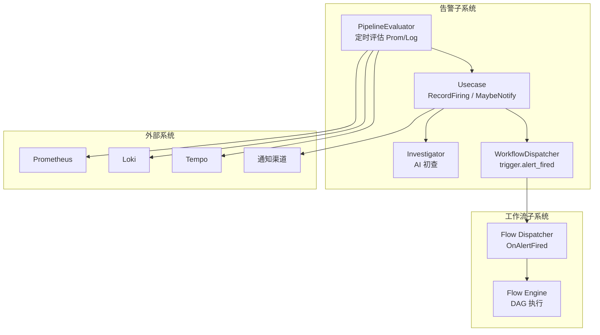
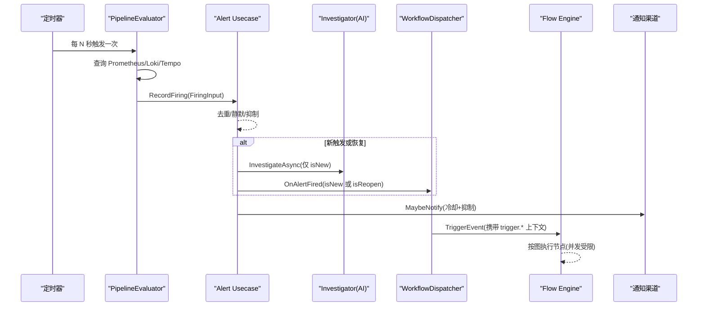
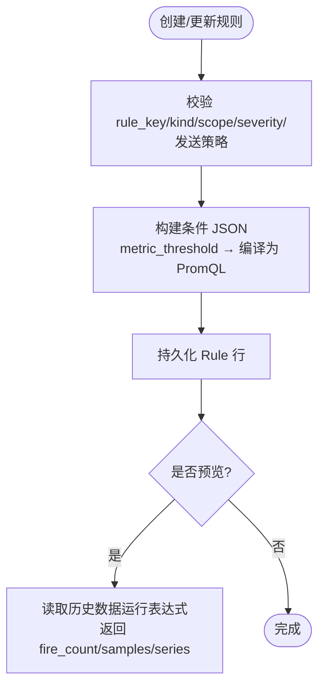
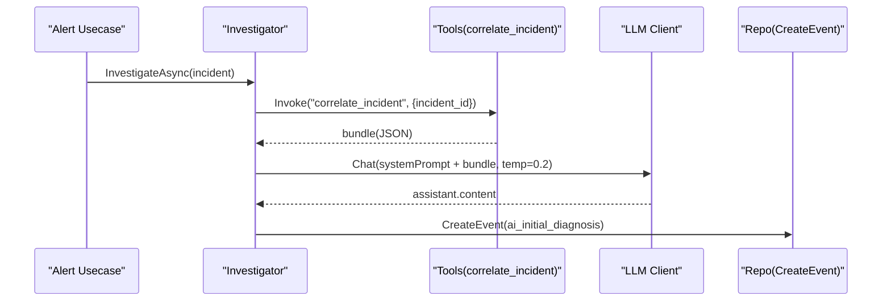
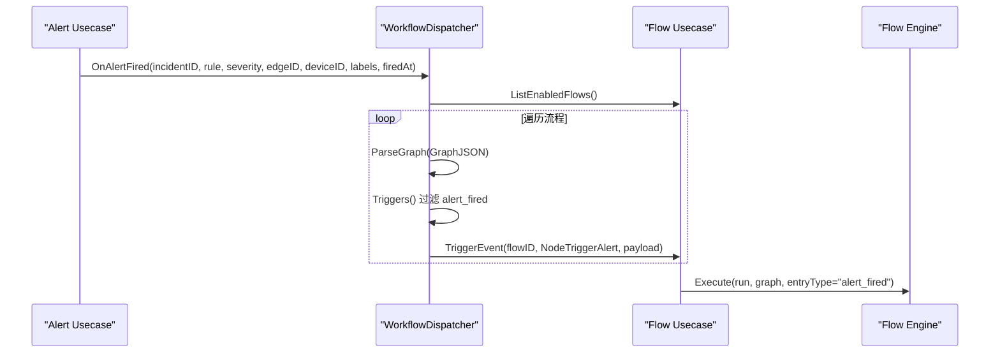
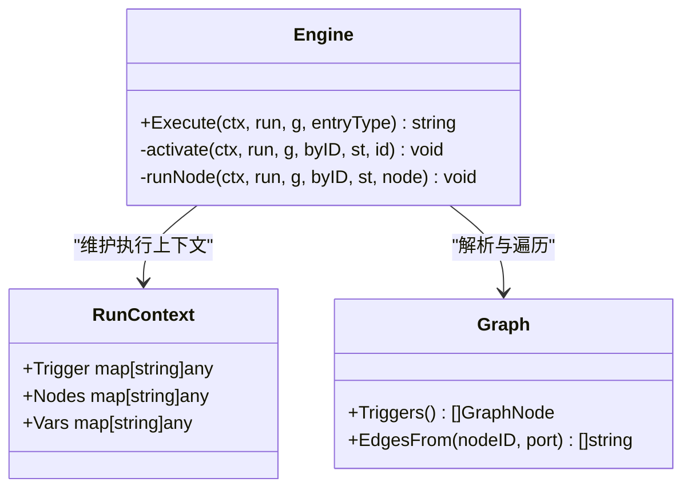
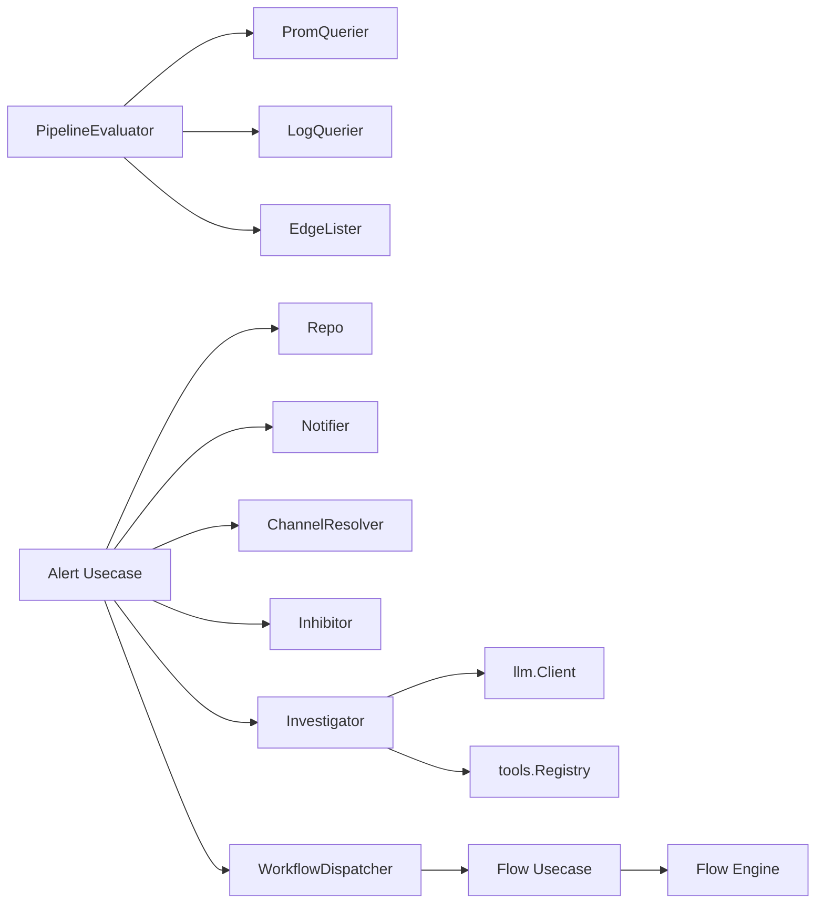

# 告警驱动工作流

<cite>
**本文引用的文件**
- [cmd/ongrid/main.go](file://cmd/ongrid/main.go)
- [internal/manager/biz/alert/usecase.go](file://internal/manager/biz/alert/usecase.go)
- [internal/manager/biz/alert/pipeline.go](file://internal/manager/biz/alert/pipeline.go)
- [internal/manager/biz/alert/evaluators_phaseA.go](file://internal/manager/biz/alert/evaluators_phaseA.go)
- [internal/manager/biz/flow/dispatcher.go](file://internal/manager/biz/flow/dispatcher.go)
- [internal/manager/biz/flow/engine.go](file://internal/manager/biz/flow/engine.go)
- [internal/manager/biz/aiops/investigator/investigator.go](file://internal/manager/biz/aiops/investigator/investigator.go)
- [internal/manager/biz/aiops/tools/correlate_incident_basetool.go](file://internal/manager/biz/aiops/tools/correlate_incident_basetool.go)
- [web/src/api/alerts.ts](file://web/src/api/alerts.ts)
- [web/src/pages/AlertRules.tsx](file://web/src/pages/AlertRules.tsx)
- [docs/workflow-catalog.md](file://docs/workflow-catalog.md)
</cite>

## 目录
1. [简介](#简介)
2. [项目结构](#项目结构)
3. [核心组件](#核心组件)
4. [架构总览](#架构总览)
5. [详细组件分析](#详细组件分析)
6. [依赖关系分析](#依赖关系分析)
7. [性能与并发控制](#性能与并发控制)
8. [监控、调试与排障](#监控调试与排障)
9. [结论](#结论)
10. [附录：规则 DSL 与编译器要点](#附录规则-dsl-与编译器要点)

## 简介
本文件系统性阐述“告警驱动工作流”的端到端实现：从告警规则配置、事件过滤与优先级排序，到自动调查（AI 初查）与自动化修复工作流的触发与执行；并覆盖结果汇总、根因概率评估思路、修复建议生成、DSL 语法与编译路径、以及监控与性能优化策略。目标是帮助读者快速理解并高效使用该能力。

## 项目结构
围绕告警与工作流的核心代码分布在以下模块：
- 告警用例与管道：负责规则加载、PromQL/日志匹配等评估、去重、静默抑制、通知投递、AI 初查与工作流触发。
- 工作流引擎：解析图、调度节点、并行执行、错误分支处理。
- AI 调查器：在首次触发时异步拉取指标/日志/链路证据，调用大模型输出初查报告。
- 前端 API 与页面：提供规则创建/预览、运行时信息展示等。

图表来源
- [internal/manager/biz/alert/usecase.go:315-479](file://internal/manager/biz/alert/usecase.go#L315-L479)
- [internal/manager/biz/alert/pipeline.go:147-196](file://internal/manager/biz/alert/pipeline.go#L147-L196)
- [internal/manager/biz/flow/dispatcher.go:35-81](file://internal/manager/biz/flow/dispatcher.go#L35-L81)
- [internal/manager/biz/flow/engine.go:67-113](file://internal/manager/biz/flow/engine.go#L67-L113)

章节来源
- [cmd/ongrid/main.go:1022-1050](file://cmd/ongrid/main.go#L1022-L1050)
- [internal/manager/biz/alert/usecase.go:315-479](file://internal/manager/biz/alert/usecase.go#L315-L479)
- [internal/manager/biz/alert/pipeline.go:147-196](file://internal/manager/biz/alert/pipeline.go#L147-L196)
- [internal/manager/biz/flow/dispatcher.go:35-81](file://internal/manager/biz/flow/dispatcher.go#L35-L81)
- [internal/manager/biz/flow/engine.go:67-113](file://internal/manager/biz/flow/engine.go#L67-L113)

## 核心组件
- 告警 Usecase：统一入口，负责 incident 生命周期、静默/抑制、通知投递、AI 初查与工作流触发。
- PipelineEvaluator：定时轮询，执行 metric_raw/log_match 等规则，构造 FiringInput 并调用 Usecase。
- Investigator：首次触发时异步发起关联数据收集与大模型推理，写入“AI 初查”事件。
- WorkflowDispatcher：将 alert_fired 事件广播给匹配的 flow，启动 DAG 执行。
- Flow Engine：按图执行节点，支持 fan-out、OR-join、错误端口分支、并发上限。

章节来源
- [internal/manager/biz/alert/usecase.go:73-103](file://internal/manager/biz/alert/usecase.go#L73-L103)
- [internal/manager/biz/alert/pipeline.go:75-145](file://internal/manager/biz/alert/pipeline.go#L75-L145)
- [internal/manager/biz/aiops/investigator/investigator.go:106-164](file://internal/manager/biz/aiops/investigator/investigator.go#L106-L164)
- [internal/manager/biz/flow/dispatcher.go:20-33](file://internal/manager/biz/flow/dispatcher.go#L20-L33)
- [internal/manager/biz/flow/engine.go:34-47](file://internal/manager/biz/flow/engine.go#L34-L47)

## 架构总览
下图展示了从规则评估到工作流执行的完整时序。

图表来源
- [internal/manager/biz/alert/pipeline.go:147-196](file://internal/manager/biz/alert/pipeline.go#L147-L196)
- [internal/manager/biz/alert/usecase.go:315-479](file://internal/manager/biz/alert/usecase.go#L315-L479)
- [internal/manager/biz/flow/dispatcher.go:35-81](file://internal/manager/biz/flow/dispatcher.go#L35-L81)
- [internal/manager/biz/flow/engine.go:67-113](file://internal/manager/biz/flow/engine.go#L67-L113)

## 详细组件分析

### 告警规则配置与评估
- 规则类型与存储形态
  - metric_threshold 为 UI 友好表单，保存时编译为 metric_raw 表达式，统一以 metric_raw 存储与评估。
  - 其他 kind（metric_anomaly、metric_forecast、metric_burn_rate、log_match 等）通过 spec 承载。
- 发送策略（dampening）
  - 通过 NotifyWindowSeconds + NotifyMinFires 实现窗口内最小触发次数阈值，避免风暴。
- 预览（试算）
  - 前端提供预览接口，纯读路径，不持久化、不触发 RecordFiring。

图表来源
- [internal/manager/biz/alert/usecase.go:706-800](file://internal/manager/biz/alert/usecase.go#L706-L800)
- [web/src/api/alerts.ts:372-420](file://web/src/api/alerts.ts#L372-L420)

章节来源
- [internal/manager/biz/alert/usecase.go:575-800](file://internal/manager/biz/alert/usecase.go#L575-L800)
- [web/src/api/alerts.ts:228-420](file://web/src/api/alerts.ts#L228-L420)
- [web/src/pages/AlertRules.tsx:187-218](file://web/src/pages/AlertRules.tsx#L187-L218)

### 事件过滤与优先级排序
- 去重键（dedupe_key）
  - 默认由 scope_type/device_id/rule 组合；pipeline 类规则使用 pipeline:<rule>:<label_set> 形式，确保同一标签集合只产生一个 incident。
- 静默与抑制
  - 静默（Silence）基于 scope/matchers 匹配；抑制（Inhibitor）用于高优告警屏蔽低优告警。
- 严重度排序
  - 工作流触发器支持 min_severity 门限，info < warning < error < critical。

章节来源
- [internal/manager/biz/alert/usecase.go:315-479](file://internal/manager/biz/alert/usecase.go#L315-L479)
- [internal/manager/biz/flow/dispatcher.go:83-108](file://internal/manager/biz/flow/dispatcher.go#L83-L108)

### 自动调查（AI 初查）机制
- 触发时机
  - 仅在 isNew 时触发，避免重复消耗 LLM 成本。
- 执行流程
  - 调用 correlate_incident 工具聚合指标/日志/链路/边端快照；
  - 拼接固定 system prompt，单次 LLM 调用产出三段式初查报告；
  - 以 event_type=ai_initial_diagnosis 写入事件表。
- 并发与超时
  - 独立 worker pool（默认 3 工作线程 + 100 缓冲队列），满队丢弃并记录警告；
  - 每个任务有独立超时（默认 120s），与请求上下文解耦。

图表来源
- [internal/manager/biz/aiops/investigator/investigator.go:166-213](file://internal/manager/biz/aiops/investigator/investigator.go#L166-L213)
- [internal/manager/biz/aiops/investigator/investigator.go:227-293](file://internal/manager/biz/aiops/investigator/investigator.go#L227-L293)
- [internal/manager/biz/aiops/tools/correlate_incident_basetool.go:245-281](file://internal/manager/biz/aiops/tools/correlate_incident_basetool.go#L245-L281)

章节来源
- [internal/manager/biz/alert/usecase.go:442-470](file://internal/manager/biz/alert/usecase.go#L442-L470)
- [internal/manager/biz/aiops/investigator/investigator.go:1-60](file://internal/manager/biz/aiops/investigator/investigator.go#L1-L60)
- [internal/manager/biz/aiops/investigator/investigator.go:166-213](file://internal/manager/biz/aiops/investigator/investigator.go#L166-L213)
- [internal/manager/biz/aiops/tools/correlate_incident_basetool.go:128-243](file://internal/manager/biz/aiops/tools/correlate_incident_basetool.go#L128-L243)

### 工作流触发与调度（trigger.alert_fired）
- 触发条件
  - 当 isNew 或 isReopen 时，非阻塞地调用 WorkflowDispatcher.OnAlertFired。
- 匹配逻辑
  - 遍历已启用流程，解析 Graph，查找 trigger.alert_fired 节点，按 rule 子串与 min_severity 过滤。
- 执行入口
  - 通过 Usecase.TriggerEvent 启动 run，传入 trigger.* 上下文（incident_id、rule、severity、edge_id、device_id、labels、fired_at）。

图表来源
- [internal/manager/biz/alert/usecase.go:452-470](file://internal/manager/biz/alert/usecase.go#L452-L470)
- [internal/manager/biz/flow/dispatcher.go:35-81](file://internal/manager/biz/flow/dispatcher.go#L35-L81)
- [internal/manager/biz/flow/engine.go:67-113](file://internal/manager/biz/flow/engine.go#L67-L113)

章节来源
- [internal/manager/biz/flow/dispatcher.go:35-81](file://internal/manager/biz/flow/dispatcher.go#L35-L81)
- [internal/manager/biz/flow/engine.go:67-113](file://internal/manager/biz/flow/engine.go#L67-L113)

### 调查结果汇总与分析
- 证据聚合
  - correlate_incident 工具对单个 incident 并行拉取：
    - 指标面板（Prometheus range query，按幅度排序，最多 3 条序列）
    - 日志面板（Loki，反向时间序，最多 50 条）
    - 链路面板（Tempo，按服务名搜索，最多 20 条）
    - 边端快照（设备状态、最近负载、近期告警计数）
- 初查报告
  - 固定 system prompt 要求三段式输出：定性、可能根因、可执行步骤。
- 根因概率评估与修复建议
  - 当前实现为确定性提示词约束，未内置显式概率模型；可在上层 Agent/工作流中扩展概率打分与修复建议编排。

章节来源
- [internal/manager/biz/aiops/tools/correlate_incident_basetool.go:283-463](file://internal/manager/biz/aiops/tools/correlate_incident_basetool.go#L283-L463)
- [internal/manager/biz/aiops/investigator/investigator.go:62-71](file://internal/manager/biz/aiops/investigator/investigator.go#L62-L71)

### 工作流执行与并发控制
- 执行语义
  - 从所有 trigger 节点开始；节点完成后沿其控制端口扇出；OR-join + execute-once；错误端口分支继续执行。
- 并发限制
  - 全局并发上限 maxConcurrentNodes=4，防止宽图导致无界并发。
- 超时与容错
  - 单节点 panic 被捕获并标记失败；整体 Execute 外层 recover 保护进程安全。

图表来源
- [internal/manager/biz/flow/engine.go:34-113](file://internal/manager/biz/flow/engine.go#L34-L113)
- [internal/manager/biz/flow/engine.go:115-159](file://internal/manager/biz/flow/engine.go#L115-L159)
- [internal/manager/biz/flow/engine.go:163-260](file://internal/manager/biz/flow/engine.go#L163-L260)

章节来源
- [internal/manager/biz/flow/engine.go:30-47](file://internal/manager/biz/flow/engine.go#L30-L47)
- [internal/manager/biz/flow/engine.go:67-113](file://internal/manager/biz/flow/engine.go#L67-L113)
- [internal/manager/biz/flow/engine.go:115-159](file://internal/manager/biz/flow/engine.go#L115-L159)
- [internal/manager/biz/flow/engine.go:163-260](file://internal/manager/biz/flow/engine.go#L163-L260)

## 依赖关系分析
- 告警子系统
  - PipelineEvaluator 依赖 EdgeLister/PromQuerier/LogQuerier 获取数据源；
  - Usecase 依赖 Repo/Notifier/Resolver/Inhibitor 完成生命周期与投递；
  - Investigator 依赖 llm.Client 与 tools.Registry；
  - WorkflowDispatcher 依赖 Flow Usecase 与 Graph 解析。
- 工作流子系统
  - Engine 依赖 Executors/RunRepo 与 Graph 定义。

图表来源
- [internal/manager/biz/alert/pipeline.go:49-73](file://internal/manager/biz/alert/pipeline.go#L49-L73)
- [internal/manager/biz/alert/usecase.go:73-103](file://internal/manager/biz/alert/usecase.go#L73-L103)
- [internal/manager/biz/aiops/investigator/investigator.go:106-164](file://internal/manager/biz/aiops/investigator/investigator.go#L106-L164)
- [internal/manager/biz/flow/dispatcher.go:20-33](file://internal/manager/biz/flow/dispatcher.go#L20-L33)
- [internal/manager/biz/flow/engine.go:34-47](file://internal/manager/biz/flow/engine.go#L34-L47)

章节来源
- [internal/manager/biz/alert/pipeline.go:49-73](file://internal/manager/biz/alert/pipeline.go#L49-L73)
- [internal/manager/biz/alert/usecase.go:73-103](file://internal/manager/biz/alert/usecase.go#L73-L103)
- [internal/manager/biz/aiops/investigator/investigator.go:106-164](file://internal/manager/biz/aiops/investigator/investigator.go#L106-L164)
- [internal/manager/biz/flow/dispatcher.go:20-33](file://internal/manager/biz/flow/dispatcher.go#L20-L33)
- [internal/manager/biz/flow/engine.go:34-47](file://internal/manager/biz/flow/engine.go#L34-L47)

## 性能与并发控制
- 评估周期与冷却
  - PipelineEvaluator 默认间隔 5 分钟，冷却默认 10 分钟；可通过配置调整。
- 并发上限
  - Flow Engine 最大并发节点数 4；Investigator 默认 3 workers + 100 队列深度。
- 超时控制
  - Investigator 单次 LLM 调用默认 120s；correlate_incident 内部各探针带独立超时。
- 资源保护
  - Investigator 队列满则丢弃并告警，绝不阻塞告警主路径；Engine 层 recover 保护进程稳定。

章节来源
- [internal/manager/biz/alert/pipeline.go:116-145](file://internal/manager/biz/alert/pipeline.go#L116-L145)
- [internal/manager/biz/flow/engine.go:30-47](file://internal/manager/biz/flow/engine.go#L30-L47)
- [internal/manager/biz/aiops/investigator/investigator.go:48-60](file://internal/manager/biz/aiops/investigator/investigator.go#L48-L60)
- [internal/manager/biz/aiops/investigator/investigator.go:166-213](file://internal/manager/biz/aiops/investigator/investigator.go#L166-L213)
- [internal/manager/biz/aiops/tools/correlate_incident_basetool.go:130-138](file://internal/manager/biz/aiops/tools/correlate_incident_basetool.go#L130-L138)

## 监控、调试与排障
- 监控指标
  - 评估耗时直方图：observeEval 记录每种规则的评估耗时与错误。
  - 事件总数计数器：createEvent 成功时递增，便于统计投递失败/风暴等。
- 调试手段
  - 规则预览：前端调用预览接口，观察 fire_count/samples/series，验证表达式与阈值。
  - 单节点测试：Engine.RunSingle 支持在编辑器中对单个节点进行真实执行测试。
- 常见问题定位
  - 告警风暴：检查 dampening 配置与冷却时间；关注 repeat_suppressed 事件。
  - 通知失败：查看 FinishDelivery 记录的 delivery 状态与错误原因。
  - AI 初查未产出：检查 Investigator 队列是否溢出、LLM 是否可用、correlate_incident 是否报错。

章节来源
- [internal/manager/biz/alert/evaluators_phaseA.go:18-32](file://internal/manager/biz/alert/evaluators_phaseA.go#L18-L32)
- [internal/manager/biz/alert/usecase.go:105-123](file://internal/manager/biz/alert/usecase.go#L105-L123)
- [internal/manager/biz/alert/usecase.go:535-573](file://internal/manager/biz/alert/usecase.go#L535-L573)
- [internal/manager/biz/flow/engine.go:277-299](file://internal/manager/biz/flow/engine.go#L277-L299)

## 结论
本方案将“告警→调查→工作流”串联成闭环：规则评估与去重保证稳定性，AI 初查提升首响效率，工作流提供可扩展的自动化修复能力。通过严格的并发与超时控制、完善的监控与调试手段，系统在大规模场景下具备高可用性与可观测性。

## 附录：规则 DSL 与编译器要点
- 支持的规则种类
  - metric_threshold（UI 表单，保存时编译为 metric_raw）
  - metric_raw（原生 PromQL）
  - log_match（LogQL 模式匹配）
  - metric_anomaly / metric_forecast / metric_burn_rate（spec 承载）
- 关键字段
  - rule_key、kind、name、scope_type、join_mode、severity、enabled
  - conditions（metric_threshold 专用）、spec（其他 kind）
  - labels、runbook_url、notify_channel_ids
  - notify_window_seconds、notify_min_fires（发送策略）
- 编译器行为
  - metric_threshold 的条件会被编译为单一 PromQL 表达式，并以 metric_raw 存储，统一进入 PipelineEvaluator 执行。
- 前端交互
  - 列表/详情/启停/删除/预览等 API 均在前端 alerts.ts 暴露；AlertRules 页面展示运行时信息（评估周期与冷却）。

章节来源
- [internal/manager/biz/alert/usecase.go:575-800](file://internal/manager/biz/alert/usecase.go#L575-L800)
- [web/src/api/alerts.ts:228-420](file://web/src/api/alerts.ts#L228-L420)
- [web/src/pages/AlertRules.tsx:187-218](file://web/src/pages/AlertRules.tsx#L187-L218)
- [docs/workflow-catalog.md:1-38](file://docs/workflow-catalog.md#L1-L38)