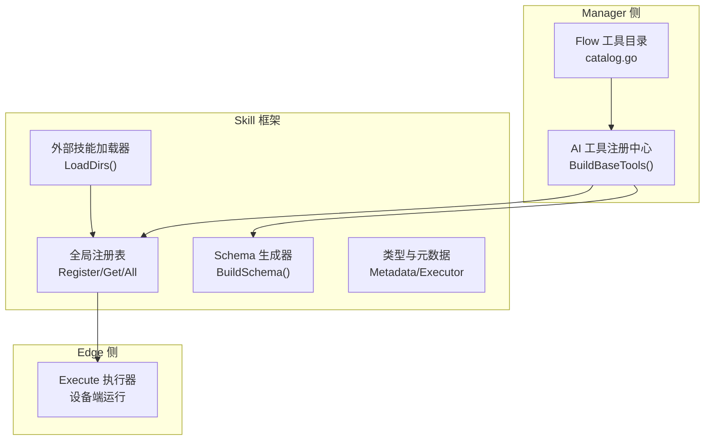
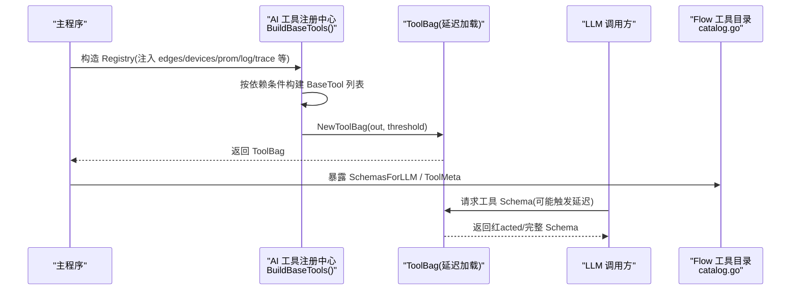
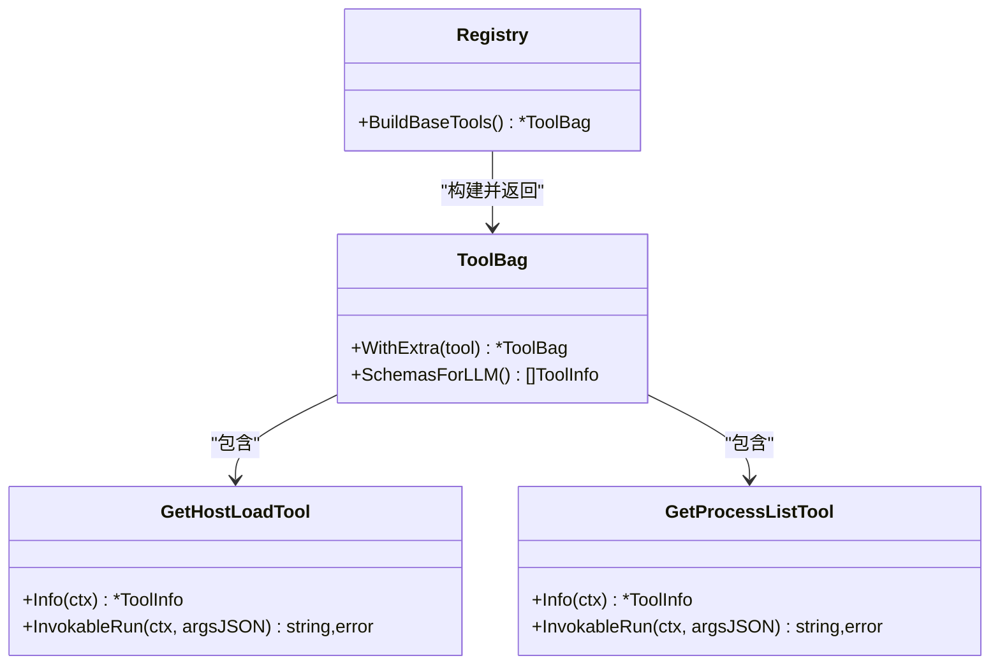
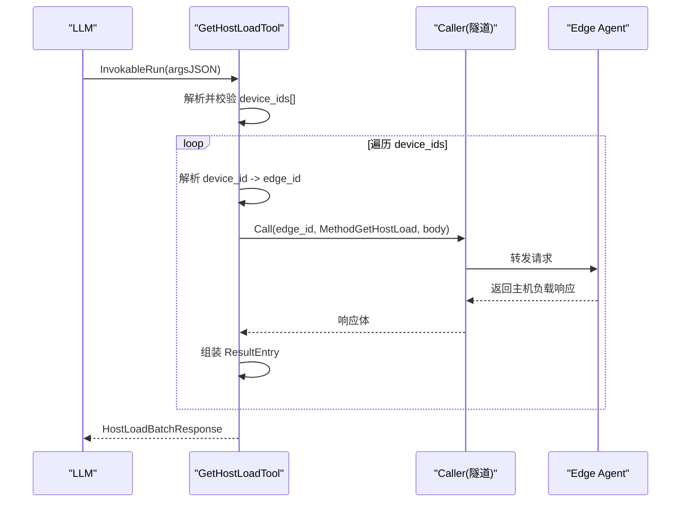
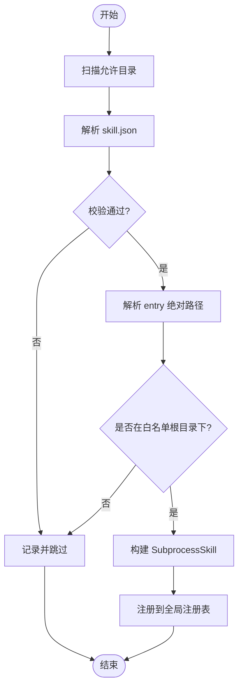
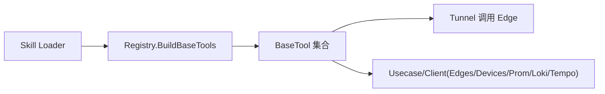

# 工具生态系统

<cite>
**本文引用的文件**
- [internal/skill/types.go](file://internal/skill/types.go)
- [internal/skill/registry.go](file://internal/skill/registry.go)
- [internal/skill/loader.go](file://internal/skill/loader.go)
- [internal/skill/schema.go](file://internal/skill/schema.go)
- [internal/manager/biz/aiops/tools/registry_basetool.go](file://internal/manager/biz/aiops/tools/registry_basetool.go)
- [internal/manager/biz/aiops/tools/host_load_basetool.go](file://internal/manager/biz/aiops/tools/host_load_basetool.go)
- [internal/manager/biz/aiops/tools/host_processes_basetool.go](file://internal/manager/biz/aiops/tools/host_processes_basetool.go)
- [internal/manager/biz/flow/catalog.go](file://internal/manager/biz/flow/catalog.go)
</cite>

## 目录
1. [简介](#简介)
2. [项目结构](#项目结构)
3. [核心组件](#核心组件)
4. [架构总览](#架构总览)
5. [详细组件分析](#详细组件分析)
6. [依赖分析](#依赖分析)
7. [性能考虑](#性能考虑)
8. [故障排查指南](#故障排查指南)
9. [结论](#结论)
10. [附录](#附录)

## 简介
本文件系统化梳理“工具生态系统”的设计与实现，覆盖以下关键主题：
- BaseTool 抽象层：接口定义、参数校验、错误处理与审计追踪
- 内置工具类别与功能：PromQL 查询、日志检索、主机文件操作、进程管理等
- 工具的注册机制与依赖注入：运行时发现与动态加载
- 自定义工具开发指南：编写规范、测试方法与部署流程
- 权限控制、安全沙箱与资源限制

## 项目结构
围绕“工具生态”，代码主要分布在两个层次：
- L2 设备侧能力框架（skill）：定义技能元数据、执行器、注册表、外部子进程技能包加载与 JSON Schema 生成
- Manager 侧 AI 工具集（aiops/tools）：基于 BaseTool 的工厂与具体工具实现，按依赖条件构建并延迟暴露给 LLM

图表来源
- [internal/manager/biz/aiops/tools/registry_basetool.go:72-231](file://internal/manager/biz/aiops/tools/registry_basetool.go#L72-L231)
- [internal/manager/biz/flow/catalog.go:1-25](file://internal/manager/biz/flow/catalog.go#L1-L25)
- [internal/skill/registry.go:10-47](file://internal/skill/registry.go#L10-L47)
- [internal/skill/loader.go:69-110](file://internal/skill/loader.go#L69-L110)
- [internal/skill/schema.go:5-20](file://internal/skill/schema.go#L5-L20)
- [internal/skill/types.go:190-203](file://internal/skill/types.go#L190-L203)

章节来源
- [internal/manager/biz/aiops/tools/registry_basetool.go:72-231](file://internal/manager/biz/aiops/tools/registry_basetool.go#L72-L231)
- [internal/manager/biz/flow/catalog.go:1-25](file://internal/manager/biz/flow/catalog.go#L1-L25)
- [internal/skill/registry.go:10-47](file://internal/skill/registry.go#L10-L47)
- [internal/skill/loader.go:69-110](file://internal/skill/loader.go#L69-L110)
- [internal/skill/schema.go:5-20](file://internal/skill/schema.go#L5-L20)
- [internal/skill/types.go:190-203](file://internal/skill/types.go#L190-L203)

## 核心组件
本节聚焦 BaseTool 抽象层与 Skill 框架的关键设计。

- 元数据与执行器
  - Metadata：包含 Key、Name、Description、Class、Scope、Category、Params、ResultPreview 等字段，用于自动生成 LLM 工具描述、UI 表单与权限门控
  - Executor：统一执行器接口，提供 Metadata() 与 Execute(ctx, params)；支持可选 RawSchemaProvider 以返回手写 JSON Schema
  - Class 与 Scope：Class 分为 safe/mutating/dangerous；Scope 区分 host（设备端）与 manager（管理端）

- 注册表与发现
  - 全局注册表：Register/Get/All/AllByClass，线程安全，启动期注册、运行期并发读取
  - 外部技能加载器：LoadDirs 扫描指定目录下的 skill.json，解析为 SubprocessSkill 并注册到全局注册表，支持白名单路径校验与环境变量白名单

- 参数与 Schema
  - ParamSchema 可转换为 OpenAI function-calling 兼容的 JSON Schema
  - BuildSchema 优先使用 RawSchemaProvider 提供的原始 Schema，否则从 Metadata.Params 推导

- 错误与校验
  - Metadata.Validate 在注册时进行强校验，非法元数据会 panic，避免运行时出现 nil 分发
  - Loader 对每个 manifest 单独捕获异常，单个失败不影响整体启动

章节来源
- [internal/skill/types.go:99-175](file://internal/skill/types.go#L99-L175)
- [internal/skill/types.go:190-203](file://internal/skill/types.go#L190-L203)
- [internal/skill/registry.go:26-74](file://internal/skill/registry.go#L26-L74)
- [internal/skill/loader.go:69-110](file://internal/skill/loader.go#L69-L110)
- [internal/skill/schema.go:5-20](file://internal/skill/schema.go#L5-L20)

## 架构总览
下图展示 Manager 侧 AI 工具注册中心如何根据依赖条件构建 BaseTool 集合，并通过 ToolBag 延迟暴露给 LLM；同时 Flow 引擎通过 catalog 获取工具元数据，形成拖拽式节点。

图表来源
- [internal/manager/biz/aiops/tools/registry_basetool.go:72-231](file://internal/manager/biz/aiops/tools/registry_basetool.go#L72-L231)
- [internal/manager/biz/flow/catalog.go:1-25](file://internal/manager/biz/flow/catalog.go#L1-L25)

## 详细组件分析

### BaseTool 抽象层与工具注册
- 构建策略
  - 注册中心按依赖条件选择性添加工具：如 PromQL/LogQL/TraceQL 查询需对应客户端；拓扑类工具需 topologyGraph；协调器专属工具需 spawner
  - 工具清单顺序固定，便于稳定索引与 UI 分组
  - 当工具总数超过阈值时启用延迟加载，仅向 LLM 暴露最小必要 Schema，按需展开

- 典型工具族
  - 主机负载与进程：get_host_load、get_process_list（批量 device_ids[]，统一 top_n/sort_by）
  - 观测查询：query_promql、query_logql、query_traceql
  - 拓扑与设备：query_devices、get_topology、expand_topology、find_topology_node
  - 告警与事件：query_incidents、get_incident_detail、query_alert_rules、correlate_incident
  - 配置变更：draft_config_change、apply_config_change（写类，需审批）
  - 会话与控制：AgentTool、SendMessage、TaskStop（协调器专用）
  - 运维动作：restart_service（首个 mutating 工具，SOP 审批）
  - Shell 与云命令：host_bash（只读）、cloud_bash（管理端命令执行，需审批）
  - IM 与页面：send_im_message、serve_page

- 延迟与搜索
  - ToolSearch 始终注册，作为延迟模式下的唯一入口，用于按需获取被隐藏工具的参数 Schema

图表来源
- [internal/manager/biz/aiops/tools/registry_basetool.go:72-231](file://internal/manager/biz/aiops/tools/registry_basetool.go#L72-L231)
- [internal/manager/biz/aiops/tools/host_load_basetool.go:101-109](file://internal/manager/biz/aiops/tools/host_load_basetool.go#L101-L109)
- [internal/manager/biz/aiops/tools/host_processes_basetool.go:101-110](file://internal/manager/biz/aiops/tools/host_processes_basetool.go#L101-L110)

章节来源
- [internal/manager/biz/aiops/tools/registry_basetool.go:72-231](file://internal/manager/biz/aiops/tools/registry_basetool.go#L72-L231)
- [internal/manager/biz/aiops/tools/host_load_basetool.go:101-109](file://internal/manager/biz/aiops/tools/host_load_basetool.go#L101-L109)
- [internal/manager/biz/aiops/tools/host_processes_basetool.go:101-110](file://internal/manager/biz/aiops/tools/host_processes_basetool.go#L101-L110)

### 主机负载与进程工具（批量范式）
- 设计要点
  - 采用 device_ids[] 批量入参，top_n/sort_by 共享于所有设备，降低 LLM 多轮交互成本
  - 管理器侧 fan-out 并行调用 edge，结果封装为 per-device 信封，含 success_count/error_count
  - 单设备深查建议使用 host_bash；历史趋势用 query_promql；日志用 query_logql

- 执行流程（以 get_host_load 为例）

图表来源
- [internal/manager/biz/aiops/tools/host_load_basetool.go:153-184](file://internal/manager/biz/aiops/tools/host_load_basetool.go#L153-L184)

章节来源
- [internal/manager/biz/aiops/tools/host_load_basetool.go:15-31](file://internal/manager/biz/aiops/tools/host_load_basetool.go#L15-31)
- [internal/manager/biz/aiops/tools/host_load_basetool.go:116-151](file://internal/manager/biz/aiops/tools/host_load_basetool.go#L116-L151)
- [internal/manager/biz/aiops/tools/host_load_basetool.go:153-184](file://internal/manager/biz/aiops/tools/host_load_basetool.go#L153-L184)
- [internal/manager/biz/aiops/tools/host_processes_basetool.go:15-24](file://internal/manager/biz/aiops/tools/host_processes_basetool.go#L15-24)
- [internal/manager/biz/aiops/tools/host_processes_basetool.go:152-192](file://internal/manager/biz/aiops/tools/host_processes_basetool.go#L152-L192)

### 外部技能加载与安全沙箱
- 加载流程
  - LoadDirs 递归扫描允许目录，解析 skill.json，构建 SubprocessSkill 并注册
  - 重复 key 跳过而非崩溃，确保热更新安全
  - 路径白名单校验：entry 必须位于 allowlist root 下，解析符号链接后仍受约束

- 沙箱与资源限制
  - EnvAllow：仅放行显式声明的环境变量，默认无 PATH
  - TimeoutSeconds：子进程超时上限，未设置则回退默认值
  - Class/Category：沿用 safe/mutating/dangerous 分类，便于后续审批流与 UI 分组

图表来源
- [internal/skill/loader.go:69-110](file://internal/skill/loader.go#L69-L110)
- [internal/skill/loader.go:176-254](file://internal/skill/loader.go#L176-L254)

章节来源
- [internal/skill/loader.go:69-110](file://internal/skill/loader.go#L69-L110)
- [internal/skill/loader.go:176-254](file://internal/skill/loader.go#L176-L254)

### Flow 工具目录与 UI 集成
- catalog.go 将 BaseTool 的元数据（名称、描述、when_to_use、class、category、JSON Schema）暴露给 Flow 引擎，使每个工具成为画布上的拖拽节点，并提供表单驱动的参数输入

章节来源
- [internal/manager/biz/flow/catalog.go:1-25](file://internal/manager/biz/flow/catalog.go#L1-L25)

## 依赖分析
- 组件耦合
  - 注册中心依赖 edges/devices/prom/log/trace/knowledge/topology/spawner 等 usecase 或客户端，按条件装配工具
  - 工具实现依赖 tunnel 调用 edge 能力，或通过 usecase 访问内部服务
- 外部依赖
  - 外部技能通过子进程方式运行，受白名单目录与环境变量白名单保护
- 潜在循环
  - 注册中心与工具之间为单向依赖；注册表与加载器为独立模块，未见循环引用

图表来源
- [internal/manager/biz/aiops/tools/registry_basetool.go:72-231](file://internal/manager/biz/aiops/tools/registry_basetool.go#L72-L231)
- [internal/skill/loader.go:69-110](file://internal/skill/loader.go#L69-L110)

章节来源
- [internal/manager/biz/aiops/tools/registry_basetool.go:72-231](file://internal/manager/biz/aiops/tools/registry_basetool.go#L72-L231)
- [internal/skill/loader.go:69-110](file://internal/skill/loader.go#L69-L110)

## 性能考虑
- 批量范式：主机负载与进程工具采用 device_ids[] 批量入参，减少 LLM 多轮往返，提升吞吐
- 并行 fan-out：管理器侧并行调度 edge 调用，结合批大小与并发度控制总体延迟
- 延迟加载：当工具数量超过阈值时，仅暴露最小 Schema，按需展开，降低 LLM 上下文压力
- 超时控制：edge 调用与子进程均具备超时保护，避免长尾阻塞

[本节为通用指导，不直接分析具体文件]

## 故障排查指南
- 注册阶段
  - 元数据校验失败：Register 会 panic，检查 Key/Name/Description/Class/Scope/Params 是否符合规则
  - 重复 Key：注册表拒绝重复键，确认不同技能的 Key 唯一
- 加载阶段
  - skill.json 解析失败：记录日志并跳过，检查 JSON 格式与必填字段
  - 路径越界：entry 不在白名单根目录下会被拒绝，修正相对路径或调整 allowlist
  - 环境变量缺失：EnvAllow 未包含所需变量，子进程无法访问，补充白名单
- 运行阶段
  - device_id 解析失败：确认设备与 edge 关联存在
  - tunnel 调用失败：检查 edge 可达性与方法名正确性
  - 子进程超时：调整 TimeoutSeconds 或优化子进程逻辑

章节来源
- [internal/skill/registry.go:59-74](file://internal/skill/registry.go#L59-L74)
- [internal/skill/loader.go:176-254](file://internal/skill/loader.go#L176-L254)
- [internal/manager/biz/aiops/tools/host_load_basetool.go:116-151](file://internal/manager/biz/aiops/tools/host_load_basetool.go#L116-L151)
- [internal/manager/biz/aiops/tools/host_processes_basetool.go:114-150](file://internal/manager/biz/aiops/tools/host_processes_basetool.go#L114-L150)

## 结论
本工具生态系统通过统一的 Skill 框架与 BaseTool 抽象层，实现了：
- 清晰的权限分级与范围划分（safe/mutating/dangerous；host/manager）
- 灵活的注册与发现机制（内建 + 外部子进程），支持运行时动态加载
- 面向 LLM 友好的参数 Schema 与延迟暴露策略
- 面向生产的安全沙箱与资源限制（路径白名单、环境变量白名单、超时）
- 面向 Flow 的元数据暴露，形成可视化的工具编排体验

[本节为总结性内容，不直接分析具体文件]

## 附录

### 自定义工具开发指南
- 编写规范
  - 实现 Executor 接口：提供 Metadata() 与 Execute(ctx, params)
  - 若需要复杂参数结构，实现 RawSchemaProvider 返回 JSON Schema
  - 明确 Class 与 Scope，避免遗漏导致误判
- 测试方法
  - 使用 NewRegistryForTest 创建隔离注册表，验证重复键与无效元数据行为
  - 针对 Execute 的边界条件与错误路径编写单元测试
- 部署流程
  - 准备 skill.json 与可执行 entry，放入允许目录
  - 启动时由 Loader 自动发现并注册，观察日志确认加载成功
  - 如需环境变量，配置 EnvAllow；如需超时控制，设置 TimeoutSeconds

章节来源
- [internal/skill/types.go:190-203](file://internal/skill/types.go#L190-L203)
- [internal/skill/registry.go:121-127](file://internal/skill/registry.go#L121-L127)
- [internal/skill/loader.go:69-110](file://internal/skill/loader.go#L69-L110)