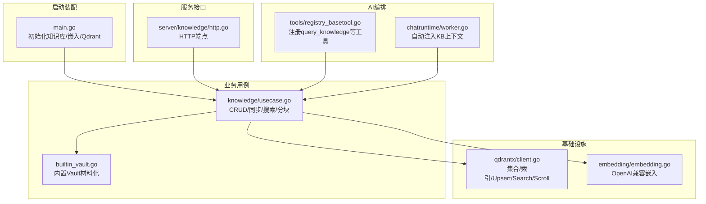
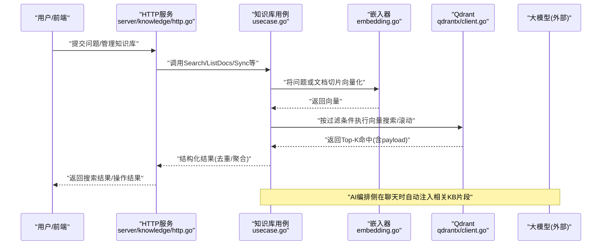
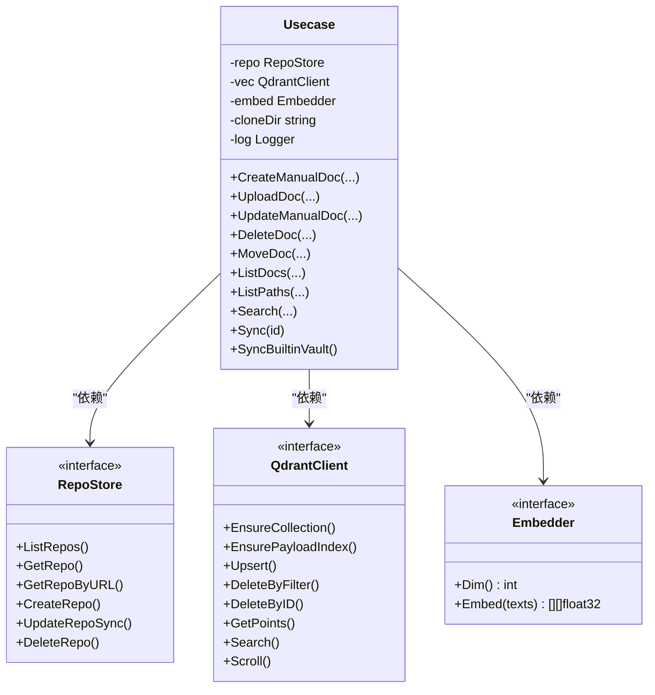
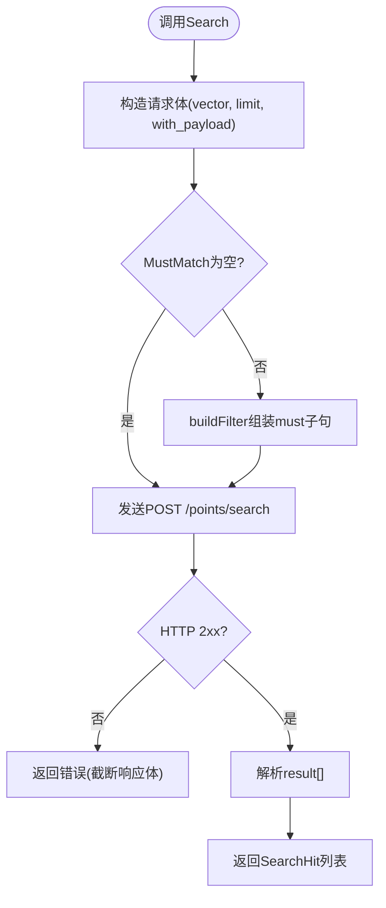
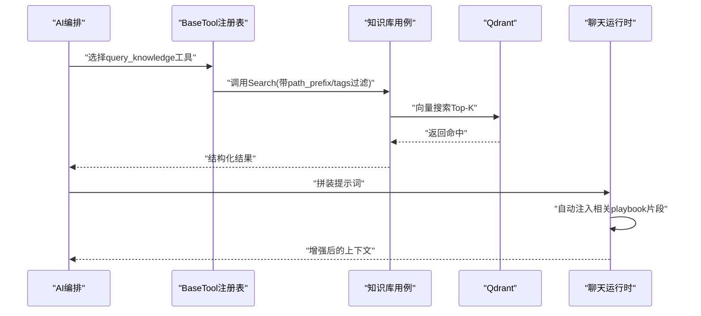
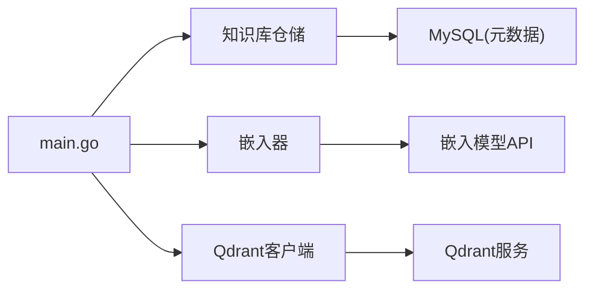

# 知识库与RAG系统

<cite>
**本文引用的文件**   
- [cmd/ongrid/main.go](file://cmd/ongrid/main.go)
- [internal/manager/biz/knowledge/usecase.go](file://internal/manager/biz/knowledge/usecase.go)
- [internal/pkg/qdrantx/client.go](file://internal/pkg/qdrantx/client.go)
- [internal/pkg/embedding/embedding.go](file://internal/pkg/embedding/embedding.go)
- [internal/manager/biz/knowledge/builtin_vault.go](file://internal/manager/biz/knowledge/builtin_vault.go)
- [internal/manager/server/knowledge/http.go](file://internal/manager/server/knowledge/http.go)
- [internal/manager/biz/aiops/tools/registry_basetool.go](file://internal/manager/biz/aiops/tools/registry_basetool.go)
- [internal/manager/biz/aiops/chatruntime/worker.go](file://internal/manager/biz/aiops/chatruntime/worker.go)
</cite>

## 目录
1. [简介](#简介)
2. [项目结构](#项目结构)
3. [核心组件](#核心组件)
4. [架构总览](#架构总览)
5. [详细组件分析](#详细组件分析)
6. [依赖关系分析](#依赖关系分析)
7. [性能考量](#性能考量)
8. [故障排查指南](#故障排查指南)
9. [结论](#结论)
10. [附录](#附录)

## 简介
本文件系统性阐述 Ongrid 的知识库与检索增强生成（RAG）能力，重点覆盖：
- 向量数据库 Qdrant 的集成与使用（集合创建、索引、上载、过滤、搜索）
- 文档向量化与语义相似度匹配（OpenAI 兼容嵌入模型，余弦距离）
- 内置知识库的组织结构与分类（运维概念、故障排查、系统参考等）
- RAG 工作流（用户查询→向量化→检索→上下文增强→LLM 回答）
- 自定义知识库构建与管理（文档导入、仓库同步、索引更新、质量控制）
- 搜索优化策略与多语言支持建议

## 项目结构
知识库与 RAG 相关代码主要分布在以下层次：
- 启动装配层：负责初始化知识库、嵌入器、Qdrant 客户端，并将知识库能力注册为工具供 AI 编排调用
- 业务用例层：实现文档 CRUD、仓库同步、内置 Vault 同步、分块与去重、搜索与列表
- 基础设施层：Qdrant HTTP 封装、嵌入模型 HTTP 封装
- 服务接口层：HTTP 路由与鉴权守卫
- 工具与编排层：将知识库搜索作为 BaseTool 暴露给 AI 编排，并在聊天运行时自动注入相关知识片段

图表来源
- [cmd/ongrid/main.go:1354-1389](file://cmd/ongrid/main.go#L1354-L1389)
- [internal/manager/biz/knowledge/usecase.go:121-167](file://internal/manager/biz/knowledge/usecase.go#L121-L167)
- [internal/pkg/qdrantx/client.go:48-116](file://internal/pkg/qdrantx/client.go#L48-L116)
- [internal/pkg/embedding/embedding.go:72-85](file://internal/pkg/embedding/embedding.go#L72-L85)
- [internal/manager/biz/knowledge/builtin_vault.go:59-77](file://internal/manager/biz/knowledge/builtin_vault.go#L59-L77)
- [internal/manager/server/knowledge/http.go](file://internal/manager/server/knowledge/http.go)
- [internal/manager/biz/aiops/tools/registry_basetool.go:110-139](file://internal/manager/biz/aiops/tools/registry_basetool.go#L110-L139)
- [internal/manager/biz/aiops/chatruntime/worker.go:948-984](file://internal/manager/biz/aiops/chatruntime/worker.go#L948-L984)

章节来源
- [cmd/ongrid/main.go:1354-1389](file://cmd/ongrid/main.go#L1354-L1389)

## 核心组件
- 知识库用例（Usecase）
  - 职责：文档增删改查、上传编辑、仓库同步、内置 Vault 同步、路径树统计、语义搜索、分页滚动
  - 关键特性：按 source_type/source/repo_id/path/tags 进行服务端过滤；对长文档分块并保留标题信号；结果去重与父级聚合
- Qdrant 客户端（qdrantx）
  - 职责：集合确保（含维度校验）、负载字段索引、Upsert、按ID获取、按过滤删除、向量搜索、滚动列举
  - 约定：单集合存储、float32 向量、余弦距离、uint64 点ID
- 嵌入器（embedding）
  - 职责：OpenAI 兼容 /v1/embeddings 调用；智能拼接版本路径；支持 Zhipu JWT 签名；返回固定维度的向量
- 内置 Vault（builtin_vault）
  - 职责：将平台知识以嵌入式 Markdown 材料化到本地目录，再走统一扫描→分块→嵌入→入库流程；云端优先、离线回退

章节来源
- [internal/manager/biz/knowledge/usecase.go:121-167](file://internal/manager/biz/knowledge/usecase.go#L121-L167)
- [internal/pkg/qdrantx/client.go:48-116](file://internal/pkg/qdrantx/client.go#L48-L116)
- [internal/pkg/embedding/embedding.go:72-85](file://internal/pkg/embedding/embedding.go#L72-L85)
- [internal/manager/biz/knowledge/builtin_vault.go:59-77](file://internal/manager/biz/knowledge/builtin_vault.go#L59-L77)

## 架构总览
下图展示从“用户提问”到“答案输出”的端到端 RAG 流程，以及知识库数据如何进入 Qdrant。

图表来源
- [internal/manager/server/knowledge/http.go](file://internal/manager/server/knowledge/http.go)
- [internal/manager/biz/knowledge/usecase.go:732-802](file://internal/manager/biz/knowledge/usecase.go#L732-L802)
- [internal/pkg/qdrantx/client.go:272-302](file://internal/pkg/qdrantx/client.go#L272-L302)
- [internal/pkg/embedding/embedding.go:150-214](file://internal/pkg/embedding/embedding.go#L150-L214)
- [internal/manager/biz/aiops/chatruntime/worker.go:948-984](file://internal/manager/biz/aiops/chatruntime/worker.go#L948-L984)

## 详细组件分析

### 组件A：知识库用例（Usecase）
- 设计要点
  - 单一集合 ongrid_knowledge，通过 source_type/source/repo_id/path/tags 做细粒度过滤
  - 长文档分块（每块≤指定字符数），首块附加标题以提升主题识别
  - 列表与搜索均做“逻辑文档去重”，避免同一文件的多个分块重复出现
  - 路径前缀采用“预计算数组 + keyword 精确匹配”的策略，避免全文分词导致的误匹配
- 关键方法
  - CreateManualDoc/UploadDoc/UpdateManualDoc/DeleteDoc/MoveDoc：组织文档生命周期
  - Sync/DeleteRepo/ListRepos/EnsureRepoSeed：仓库注册与增量同步
  - Search/ListDocs/ListPaths：语义检索与目录树统计
  - SyncBuiltinVault：内置 Vault 云端优先、离线回退的材料化与索引

图表来源
- [internal/manager/biz/knowledge/usecase.go:41-104](file://internal/manager/biz/knowledge/usecase.go#L41-L104)
- [internal/manager/biz/knowledge/usecase.go:121-167](file://internal/manager/biz/knowledge/usecase.go#L121-L167)

章节来源
- [internal/manager/biz/knowledge/usecase.go:121-167](file://internal/manager/biz/knowledge/usecase.go#L121-L167)
- [internal/manager/biz/knowledge/usecase.go:732-802](file://internal/manager/biz/knowledge/usecase.go#L732-L802)
- [internal/manager/biz/knowledge/usecase.go:905-1094](file://internal/manager/biz/knowledge/usecase.go#L905-L1094)
- [internal/manager/biz/knowledge/usecase.go:1096-1200](file://internal/manager/biz/knowledge/usecase.go#L1096-L1200)

### 组件B：Qdrant 客户端（qdrantx）
- 集合与索引
  - EnsureCollection：若存在且维度不匹配，有数据则拒绝重建，无数据则安全重建
  - EnsurePayloadIndex：为 path/path_prefixes/tags/source_type/repo_id 建立 keyword 索引，提升过滤性能
- 写入与读取
  - Upsert：批量写入点（id 稳定可幂等）
  - DeleteByFilter/DeleteByID：按过滤或ID删除
  - GetPoints：按ID获取（绕过过滤器对超大整数的限制）
  - Search：余弦相似度 Top-K，支持 MustMatch 过滤
  - Scroll：分页滚动列举，用于列表页

图表来源
- [internal/pkg/qdrantx/client.go:272-302](file://internal/pkg/qdrantx/client.go#L272-L302)
- [internal/pkg/qdrantx/client.go:386-424](file://internal/pkg/qdrantx/client.go#L386-L424)

章节来源
- [internal/pkg/qdrantx/client.go:48-116](file://internal/pkg/qdrantx/client.go#L48-L116)
- [internal/pkg/qdrantx/client.go:118-150](file://internal/pkg/qdrantx/client.go#L118-L150)
- [internal/pkg/qdrantx/client.go:159-203](file://internal/pkg/qdrantx/client.go#L159-L203)
- [internal/pkg/qdrantx/client.go:209-249](file://internal/pkg/qdrantx/client.go#L209-L249)
- [internal/pkg/qdrantx/client.go:272-302](file://internal/pkg/qdrantx/client.go#L272-L302)
- [internal/pkg/qdrantx/client.go:318-351](file://internal/pkg/qdrantx/client.go#L318-L351)

### 组件C：嵌入器（embedding）
- 提供者抽象
  - OpenAI 兼容：默认 provider="openai"，支持 Azure/GLM/Qwen/DeepSeek 等
  - 本地模式预留：provider="local/fastembed/onnx"（Phase-2）
- 配置与环境变量
  - ONGRID_EMBEDDING_PROVIDER / MODEL / BASE_URL / API_KEY / DIM
- 健壮性
  - 智能拼接 /v1/embeddings 或 /v4/embeddings
  - Zhipu 特殊鉴权：自动签发 JWT
  - 严格校验返回向量数量与维度

章节来源
- [internal/pkg/embedding/embedding.go:72-85](file://internal/pkg/embedding/embedding.go#L72-L85)
- [internal/pkg/embedding/embedding.go:150-214](file://internal/pkg/embedding/embedding.go#L150-L214)
- [internal/pkg/embedding/embedding.go:216-245](file://internal/pkg/embedding/embedding.go#L216-L245)

### 组件D：内置知识库（Built-in Vault）
- 内容组织
  - concepts：运维概念（告警、事件响应等）
  - diagnostics：故障排查指南（OOM、TCP丢包、K8s异常等）
  - systems：系统参考（Linux内存、容器/K8s、网络栈、可观测性栈等）
- 同步策略
  - 云端优先：尝试拉取远程 vault，失败则回退至二进制内嵌快照
  - 原子替换：临时目录+rename，保证并发读一致性
  - 统一管道：材料化后走 scan→chunk→embed→upsert

章节来源
- [internal/manager/biz/knowledge/builtin_vault.go:59-77](file://internal/manager/biz/knowledge/builtin_vault.go#L59-L77)
- [internal/manager/biz/knowledge/usecase.go:1096-1200](file://internal/manager/biz/knowledge/usecase.go#L1096-L1200)

### 组件E：RAG 工作流（从查询到上下文增强）
- 工具注册
  - 将知识库搜索能力注册为 BaseTool，供 AI 编排按需调用
- 自动注入
  - 聊天运行时根据问题自动检索最相关的 playbook，并以结构化提示注入到对话上下文

图表来源
- [internal/manager/biz/aiops/tools/registry_basetool.go:110-139](file://internal/manager/biz/aiops/tools/registry_basetool.go#L110-L139)
- [internal/manager/biz/aiops/chatruntime/worker.go:948-984](file://internal/manager/biz/aiops/chatruntime/worker.go#L948-L984)
- [internal/manager/biz/knowledge/usecase.go:732-802](file://internal/manager/biz/knowledge/usecase.go#L732-L802)

章节来源
- [internal/manager/biz/aiops/tools/registry_basetool.go:110-139](file://internal/manager/biz/aiops/tools/registry_basetool.go#L110-L139)
- [internal/manager/biz/aiops/chatruntime/worker.go:948-984](file://internal/manager/biz/aiops/chatruntime/worker.go#L948-L984)

## 依赖关系分析
- 启动装配
  - main.go 负责迁移知识库元数据、构造知识库仓储、嵌入器与 Qdrant 客户端，并将知识库能力注入到工具注册表
- 耦合与内聚
  - 用例层仅依赖窄接口（RepoStore/QdrantClient/Embedder），便于测试与替换
  - qdrantx 与 embedding 均为薄封装，保持低耦合与高可替换性
- 外部依赖
  - Qdrant：REST API（集合/索引/搜索/滚动）
  - 嵌入模型：OpenAI 兼容 REST API（可切换不同厂商）

图表来源
- [cmd/ongrid/main.go:1354-1389](file://cmd/ongrid/main.go#L1354-L1389)
- [internal/manager/biz/knowledge/usecase.go:41-104](file://internal/manager/biz/knowledge/usecase.go#L41-L104)

章节来源
- [cmd/ongrid/main.go:1354-1389](file://cmd/ongrid/main.go#L1354-L1389)

## 性能考量
- 索引与过滤
  - 为 path/path_prefixes/tags/source_type/repo_id 建立 keyword 索引，避免全表扫描
  - 路径前缀采用“预计算数组 + keyword 精确匹配”，避免全文分词的误匹配与开销
- 批量处理
  - 嵌入与 Upsert 均采用批处理（默认批次大小 32），降低网络与序列化开销
- 过采样与去重
  - 搜索阶段适度 over-fetch（最多5倍上限），随后按父级 URL 去重，保证最终返回唯一文档数
- 集合维度一致性
  - EnsureCollection 会检查现有集合维度，防止因维度不一致导致后续写入失败

章节来源
- [internal/manager/biz/knowledge/usecase.go:147-166](file://internal/manager/biz/knowledge/usecase.go#L147-L166)
- [internal/manager/biz/knowledge/usecase.go:760-802](file://internal/manager/biz/knowledge/usecase.go#L760-L802)
- [internal/pkg/qdrantx/client.go:48-116](file://internal/pkg/qdrantx/client.go#L48-L116)

## 故障排查指南
- 无法写入/维度不匹配
  - 现象：集合已存在但维度不一致，且有数据时拒绝重建
  - 处理：备份后手动删除集合，或调整嵌入维度配置使其一致
- 未配置嵌入器
  - 现象：创建/更新/同步等操作报“未配置嵌入器”
  - 处理：设置 ONGRID_EMBEDDING_API_KEY（及可选 BASE_URL/MODEL/DIM）
- 仓库同步失败
  - 现象：git clone/fetch 失败，last_sync_error 记录原始 git 输出
  - 处理：检查网络/认证（GitHub Token 通过 askpass 注入，不在命令行可见）；必要时触发慢路径重新克隆
- 内置 Vault 同步
  - 现象：云端拉取失败，自动回退到内嵌快照
  - 处理：确认网络连通性或接受离线基线；按钮点击后会显示实际来源（cloud/embedded）

章节来源
- [internal/pkg/qdrantx/client.go:80-86](file://internal/pkg/qdrantx/client.go#L80-L86)
- [internal/manager/biz/knowledge/usecase.go:905-986](file://internal/manager/biz/knowledge/usecase.go#L905-L986)
- [internal/manager/biz/knowledge/usecase.go:1110-1133](file://internal/manager/biz/knowledge/usecase.go#L1110-L1133)

## 结论
Ongrid 的知识库与 RAG 子系统以“窄接口 + 薄封装”的方式整合了 Qdrant 与嵌入模型，提供稳定的文档索引、语义检索与上下文增强能力。通过内置 Vault 与仓库同步机制，既满足开箱即用，又支持企业私有化扩展。配合路径前缀与标签过滤、批处理与去重策略，系统在准确性与性能之间取得良好平衡。

## 附录

### 内置知识库组织结构（示例）
- 运维概念（concepts）
  - 告警、事件响应等
- 故障排查指南（diagnostics）
  - OOM、TCP丢包、K8s异常、磁盘/内存/网络类问题
- 系统参考（systems）
  - Linux内存、容器/K8s、网络栈、可观测性栈（Prometheus/Loki/Tempo）

章节来源
- [internal/manager/biz/knowledge/builtin_vault.go:59-77](file://internal/manager/biz/knowledge/builtin_vault.go#L59-L77)

### 自定义知识库构建与管理
- 文档导入
  - 手动粘贴/上传：支持标题、路径、标签；上传文件按分块入库，支持幂等覆盖
- 仓库同步
  - 注册 Git 仓库（支持分支），首次 clone --depth=1，后续 fast-path fetch/reset，失败回退到 atomic replace
  - 支持 GitHub Token 通过 askpass 注入，避免泄露
- 索引更新
  - 变更即触发重新扫描→分块→嵌入→Upsert；删除仓库时清理对应 Qdrant 点集与本地克隆
- 质量控制
  - 标题前置（首块）增强主题识别
  - 路径前缀数组 + keyword 精确匹配，避免误匹配
  - 列表与搜索均做逻辑文档去重，避免重复条目

章节来源
- [internal/manager/biz/knowledge/usecase.go:184-217](file://internal/manager/biz/knowledge/usecase.go#L184-L217)
- [internal/manager/biz/knowledge/usecase.go:234-318](file://internal/manager/biz/knowledge/usecase.go#L234-L318)
- [internal/manager/biz/knowledge/usecase.go:905-1094](file://internal/manager/biz/knowledge/usecase.go#L905-L1094)
- [internal/manager/biz/knowledge/usecase.go:401-424](file://internal/manager/biz/knowledge/usecase.go#L401-L424)

### 搜索优化策略
- 服务端过滤
  - 使用 must 子句在 Qdrant 侧先过滤，再打分，提高精度
- 路径前缀过滤
  - 利用 path_prefixes 数组与 keyword 精确匹配，实现严格的文件夹树语义
- 标签过滤
  - tags 字段支持 any-of 匹配，适合按领域/子系统筛选
- 过采样与去重
  - 搜索阶段 over-fetch 并按父级 URL 去重，保证返回唯一文档数

章节来源
- [internal/manager/biz/knowledge/usecase.go:732-802](file://internal/manager/biz/knowledge/usecase.go#L732-L802)
- [internal/pkg/qdrantx/client.go:386-424](file://internal/pkg/qdrantx/client.go#L386-L424)

### 多语言支持
- 嵌入模型
  - 当前默认 provider 为 OpenAI 兼容，可通过 BASE_URL 指向任意兼容后端（如 GLM/Qwen/DeepSeek）
  - 未来可扩展本地 ONNX 嵌入（fastembed-go）以满足离线部署
- 文本分块与标题
  - 中文场景建议在标题中补充英文关键词，提升跨语言检索效果
- UI 与日志
  - 错误信息尽量保持英文原样，由前端按 locale 本地化显示

章节来源
- [internal/pkg/embedding/embedding.go:72-85](file://internal/pkg/embedding/embedding.go#L72-L85)
- [internal/pkg/embedding/embedding.go:216-245](file://internal/pkg/embedding/embedding.go#L216-L245)
- [internal/manager/biz/knowledge/usecase.go:976-984](file://internal/manager/biz/knowledge/usecase.go#L976-L984)