# API接口文档

<cite>
**本文引用的文件**
- [api/README.md](file://api/README.md)
- [api/iam/v1/iam.proto](file://api/iam/v1/iam.proto)
- [api/manager/aiops/v1/aiops.proto](file://api/manager/aiops/v1/aiops.proto)
- [api/manager/alert/v1/alert.proto](file://api/manager/alert/v1/alert.proto)
- [api/manager/edge/v1/edge.proto](file://api/manager/edge/v1/edge.proto)
- [api/manager/metric/v1/metric.proto](file://api/manager/metric/v1/metric.proto)
- [api/manager/notification/v1/notification.proto](file://api/manager/notification/v1/notification.proto)
- [api/tunnel/v1/tunnel.proto](file://api/tunnel/v1/tunnel.proto)
- [cmd/ongrid/main.go](file://cmd/ongrid/main.go)
- [internal/iam/server/http.go](file://internal/iam/server/http.go)
- [internal/manager/server/device/http.go](file://internal/manager/server/device/http.go)
- [web/src/api/webshell.ts](file://web/src/api/webshell.ts)
</cite>

## 目录
1. [简介](#简介)
2. [项目结构](#项目结构)
3. [核心组件](#核心组件)
4. [架构总览](#架构总览)
5. [详细组件分析](#详细组件分析)
6. [依赖关系分析](#依赖关系分析)
7. [性能与扩展性](#性能与扩展性)
8. [故障排查指南](#故障排查指南)
9. [结论](#结论)
10. [附录](#附录)

## 简介
本文件为 ongrid 的完整 API 接口参考，覆盖以下方面：
- RESTful HTTP 端点（方法、URL 模式、请求/响应约定、认证方式）
- gRPC 服务定义与调用方式
- WebSocket 连接处理、消息格式与实时交互模式
- SDK 使用与客户端集成要点
- 协议特定示例、错误处理策略与安全考虑
- 速率限制、版本兼容性与向后兼容性说明
- API 测试工具与调试方法
- 面向使用者的最佳实践与性能优化建议

本项目采用“单一真相源”的 proto 契约设计，REST 路由由手写 Go handler 实现，MVP 阶段未启用 grpc-gateway。所有 org_id 等租户上下文通过中间件注入，不在请求体中暴露。

**章节来源**
- [api/README.md:1-41](file://api/README.md#L1-L41)

## 项目结构
API 契约位于 api/ 目录，按业务域划分；HTTP 路由在 cmd/ongrid/main.go 统一挂载，各子域 handler 在 internal/*/server/* 下注册。WebSocket 相关逻辑在前端 web/src/api/webshell.ts 中封装了连接与帧协议。

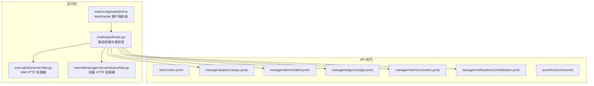

**图表来源**
- [cmd/ongrid/main.go:2350-2482](file://cmd/ongrid/main.go#L2350-L2482)
- [internal/iam/server/http.go:151-155](file://internal/iam/server/http.go#L151-L155)
- [internal/manager/server/device/http.go:46-75](file://internal/manager/server/device/http.go#L46-L75)
- [web/src/api/webshell.ts:29-58](file://web/src/api/webshell.ts#L29-L58)

**章节来源**
- [cmd/ongrid/main.go:2350-2482](file://cmd/ongrid/main.go#L2350-L2482)
- [internal/iam/server/http.go:151-155](file://internal/iam/server/http.go#L151-L155)
- [internal/manager/server/device/http.go:46-75](file://internal/manager/server/device/http.go#L46-L75)
- [web/src/api/webshell.ts:29-58](file://web/src/api/webshell.ts#L29-L58)

## 核心组件
- IAM 服务：提供注册、登录、刷新令牌、获取当前用户信息、组织与成员管理、切换组织等能力。
- Manager 子域服务：AIOPS（对话与会话）、告警（事件生命周期）、Edge（边缘设备管理）、指标查询、通知渠道管理等。
- Tunnel 协议：边云双向通信的消息形状定义（非 gRPC），用于注册、心跳、指标上报、系统探测等。
- HTTP 路由层：统一挂载 /api 前缀，区分公开与受保护组，JWT 鉴权中间件贯穿受保护组。
- WebSocket：设备 Shell 通道，基于自定义子协议与文本帧控制流。

**章节来源**
- [api/iam/v1/iam.proto:9-42](file://api/iam/v1/iam.proto#L9-L42)
- [api/manager/aiops/v1/aiops.proto:9-29](file://api/manager/aiops/v1/aiops.proto#L9-L29)
- [api/manager/alert/v1/alert.proto:9-14](file://api/manager/alert/v1/alert.proto#L9-L14)
- [api/manager/edge/v1/edge.proto:10-29](file://api/manager/edge/v1/edge.proto#L10-L29)
- [api/manager/metric/v1/metric.proto:9-17](file://api/manager/metric/v1/metric.proto#L9-L17)
- [api/manager/notification/v1/notification.proto:10-17](file://api/manager/notification/v1/notification.proto#L10-L17)
- [api/tunnel/v1/tunnel.proto:1-12](file://api/tunnel/v1/tunnel.proto#L1-L12)
- [cmd/ongrid/main.go:2350-2482](file://cmd/ongrid/main.go#L2350-L2482)
- [web/src/api/webshell.ts:29-58](file://web/src/api/webshell.ts#L29-L58)

## 架构总览
整体架构围绕“契约先行”的 proto 定义展开，HTTP 路由在入口集中挂载，受保护路由统一经过 JWT 鉴权中间件。Tunnel 协议承载边云数据面流量，WebSocket 提供交互式 Shell 通道。

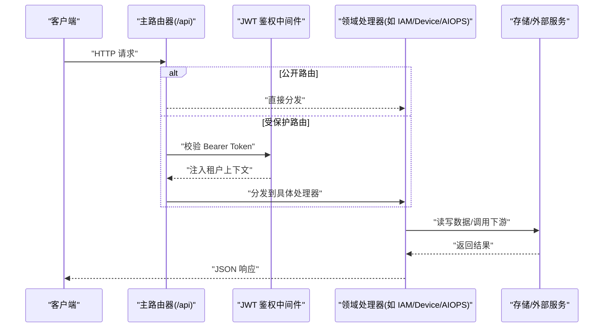

**图表来源**
- [cmd/ongrid/main.go:2350-2482](file://cmd/ongrid/main.go#L2350-L2482)
- [internal/iam/server/http.go:151-155](file://internal/iam/server/http.go#L151-L155)

## 详细组件分析

### IAM 服务（gRPC + HTTP）
- gRPC 服务：IamService，包含注册、登录、刷新、获取自身信息、组织与成员管理、切换组织等 RPC。
- HTTP 端点（公开）：
  - POST /api/v1/auth/login
  - POST /api/v1/auth/refresh
- 认证方式：Bearer JWT（受保护路由）。org_id 从 JWT claims 或 URL path 注入，不出现在请求体。

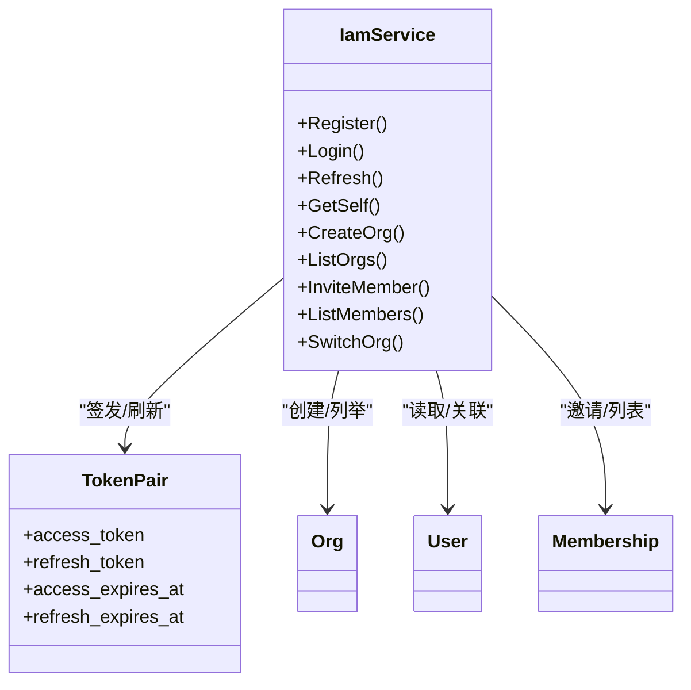

**图表来源**
- [api/iam/v1/iam.proto:9-42](file://api/iam/v1/iam.proto#L9-L42)
- [api/iam/v1/iam.proto:74-80](file://api/iam/v1/iam.proto#L74-L80)
- [api/iam/v1/iam.proto:47-72](file://api/iam/v1/iam.proto#L47-L72)

**章节来源**
- [api/iam/v1/iam.proto:9-42](file://api/iam/v1/iam.proto#L9-L42)
- [internal/iam/server/http.go:151-155](file://internal/iam/server/http.go#L151-L155)

### AIOPS 服务（gRPC）
- 服务：AiopsService
- 关键 RPC：
  - CreateChatSession / ListChatSessions
  - PostMessage（阻塞式终答）
  - StreamMessage（服务端流式片段）
  - ListMessages（分页游标）
- 模型：会话、消息、工具调用与结果、Token 用量统计。

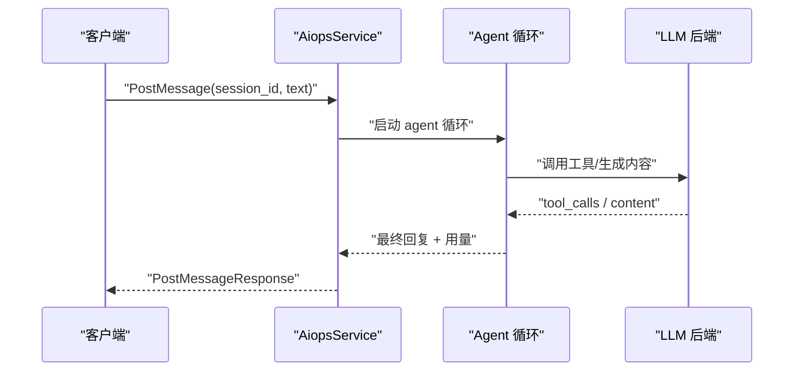

**图表来源**
- [api/manager/aiops/v1/aiops.proto:9-29](file://api/manager/aiops/v1/aiops.proto#L9-L29)
- [api/manager/aiops/v1/aiops.proto:113-126](file://api/manager/aiops/v1/aiops.proto#L113-L126)

**章节来源**
- [api/manager/aiops/v1/aiops.proto:9-29](file://api/manager/aiops/v1/aiops.proto#L9-L29)
- [api/manager/aiops/v1/aiops.proto:113-126](file://api/manager/aiops/v1/aiops.proto#L113-L126)

### 告警服务（gRPC）
- 服务：AlertService
- 关键 RPC：
  - ListIncidents / GetIncident
  - AcknowledgeIncident / ResolveIncident
- 状态机：OPEN → ACKNOWLEDGED/SILENCED → RESOLVED

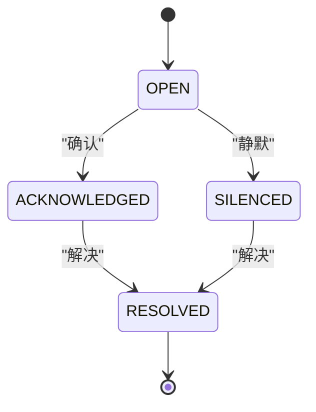

**图表来源**
- [api/manager/alert/v1/alert.proto:9-14](file://api/manager/alert/v1/alert.proto#L9-L14)
- [api/manager/alert/v1/alert.proto:23-29](file://api/manager/alert/v1/alert.proto#L23-L29)

**章节来源**
- [api/manager/alert/v1/alert.proto:9-14](file://api/manager/alert/v1/alert.proto#L9-L14)
- [api/manager/alert/v1/alert.proto:23-29](file://api/manager/alert/v1/alert.proto#L23-L29)

### Edge 管理服务（gRPC）
- 服务：EdgeService
- 关键 RPC：
  - CreateEdge（仅一次明文返回 SecretKey）
  - ListEdges（支持在线状态过滤、名称/主机/IP 精准匹配）
  - GetEdge / DeleteEdge
  - RotateSecret（旧密钥立即失效）
- 模型：Edge、HostInfo、EdgeStatus

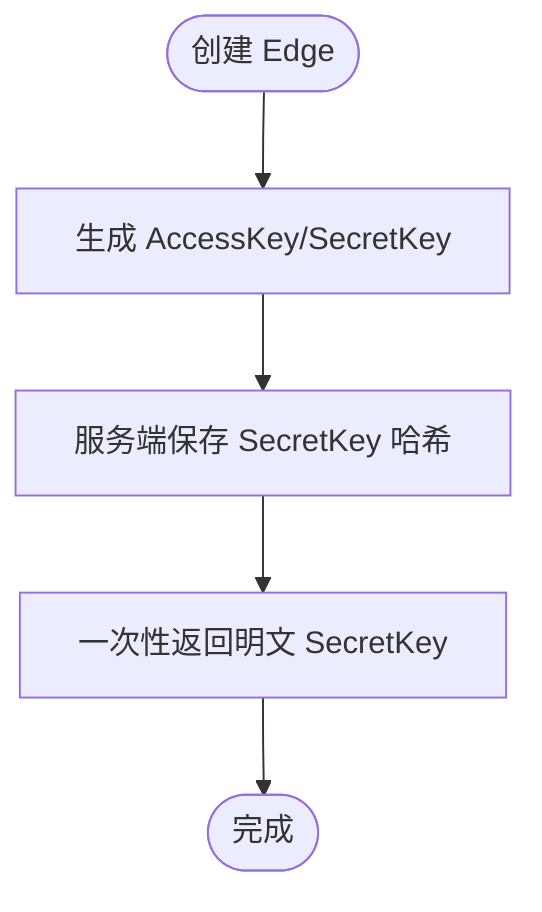

**图表来源**
- [api/manager/edge/v1/edge.proto:10-29](file://api/manager/edge/v1/edge.proto#L10-L29)
- [api/manager/edge/v1/edge.proto:68-77](file://api/manager/edge/v1/edge.proto#L68-L77)

**章节来源**
- [api/manager/edge/v1/edge.proto:10-29](file://api/manager/edge/v1/edge.proto#L10-L29)
- [api/manager/edge/v1/edge.proto:68-77](file://api/manager/edge/v1/edge.proto#L68-L77)

### 指标服务（gRPC）
- 服务：MetricService
- 关键 RPC：QueryHostMetrics（支持 AUTO/RAW/M5/H1 粒度选择）
- 写入路径：不通过此服务，由 edge tunnel push_host_metrics 经 Ingester 落库。

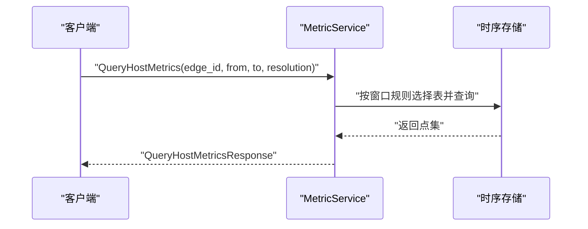

**图表来源**
- [api/manager/metric/v1/metric.proto:9-17](file://api/manager/metric/v1/metric.proto#L9-L17)
- [api/manager/metric/v1/metric.proto:42-54](file://api/manager/metric/v1/metric.proto#L42-L54)

**章节来源**
- [api/manager/metric/v1/metric.proto:9-17](file://api/manager/metric/v1/metric.proto#L9-L17)
- [api/manager/metric/v1/metric.proto:42-54](file://api/manager/metric/v1/metric.proto#L42-L54)

### 通知渠道服务（gRPC）
- 服务：NotificationService
- 关键 RPC：CRUD 渠道、测试发送
- 类型：Webhook、Slack、飞书、钉钉

**章节来源**
- [api/manager/notification/v1/notification.proto:10-17](file://api/manager/notification/v1/notification.proto#L10-L17)
- [api/manager/notification/v1/notification.proto:19-35](file://api/manager/notification/v1/notification.proto#L19-L35)

### Tunnel 协议（边云数据面）
- 传输：geminio 隧道，MVP 使用 JSON 编码，未来可切换二进制。
- 方法（method name）：register_edge、heartbeat、push_host_metrics、get_host_load、get_process_list、get_netstat
- 注意：此处无 gRPC service 声明，仅为请求/响应消息形状。

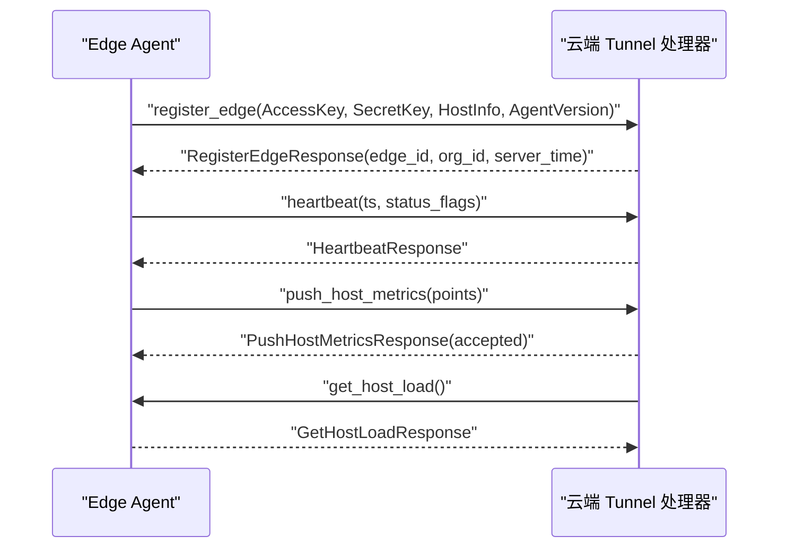

**图表来源**
- [api/tunnel/v1/tunnel.proto:1-12](file://api/tunnel/v1/tunnel.proto#L1-L12)
- [api/tunnel/v1/tunnel.proto:44-87](file://api/tunnel/v1/tunnel.proto#L44-L87)
- [api/tunnel/v1/tunnel.proto:90-103](file://api/tunnel/v1/tunnel.proto#L90-L103)

**章节来源**
- [api/tunnel/v1/tunnel.proto:1-12](file://api/tunnel/v1/tunnel.proto#L1-L12)
- [api/tunnel/v1/tunnel.proto:44-87](file://api/tunnel/v1/tunnel.proto#L44-L87)
- [api/tunnel/v1/tunnel.proto:90-103](file://api/tunnel/v1/tunnel.proto#L90-L103)

### WebSocket 设备 Shell
- 连接：/api/v1/devices/{id}/shell 或 /api/v1/devices/{id}/shell-direct
- 子协议：ongrid.shell.v1
- 首帧：open（cols/rows/term/ssh_user/ssh_pass/ssh_host）
- 控制帧：resize、close
- 服务端回推：ready、auth_error、exit
- 鉴权：query token（由受保护路由下发）

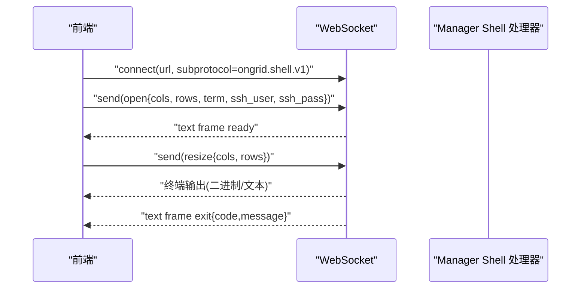

**图表来源**
- [web/src/api/webshell.ts:29-58](file://web/src/api/webshell.ts#L29-L58)
- [web/src/api/webshell.ts:60-99](file://web/src/api/webshell.ts#L60-L99)

**章节来源**
- [web/src/api/webshell.ts:29-58](file://web/src/api/webshell.ts#L29-L58)
- [web/src/api/webshell.ts:60-99](file://web/src/api/webshell.ts#L60-L99)

### HTTP 路由与鉴权
- 公共路由：/api/v1/auth/login、/api/v1/auth/refresh、IM Webhook、页面分享读取等
- 受保护路由：统一挂载于 /api 下的 protected 组，需携带 Bearer JWT
- 设备管理路由：/v1/devices/*（含软删除、SSH 凭据、角色更新等）

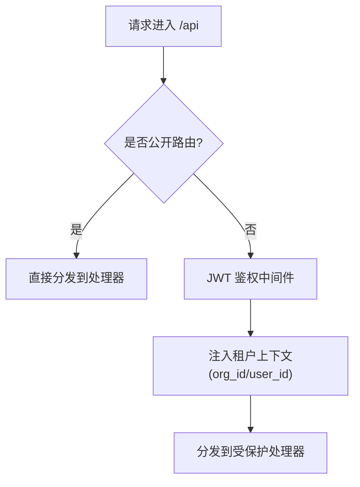

**图表来源**
- [cmd/ongrid/main.go:2350-2482](file://cmd/ongrid/main.go#L2350-L2482)
- [internal/iam/server/http.go:151-155](file://internal/iam/server/http.go#L151-L155)
- [internal/manager/server/device/http.go:46-75](file://internal/manager/server/device/http.go#L46-L75)

**章节来源**
- [cmd/ongrid/main.go:2350-2482](file://cmd/ongrid/main.go#L2350-L2482)
- [internal/iam/server/http.go:151-155](file://internal/iam/server/http.go#L151-L155)
- [internal/manager/server/device/http.go:46-75](file://internal/manager/server/device/http.go#L46-L75)

## 依赖关系分析
- 入口路由集中挂载，handler 按子域拆分，耦合度低、内聚度高。
- 鉴权中间件对受保护路由统一生效，避免重复实现。
- Tunnel 协议独立于 gRPC，保持边云数据面演进解耦。
- 前端 WebSocket 客户端封装屏蔽底层细节，便于集成。

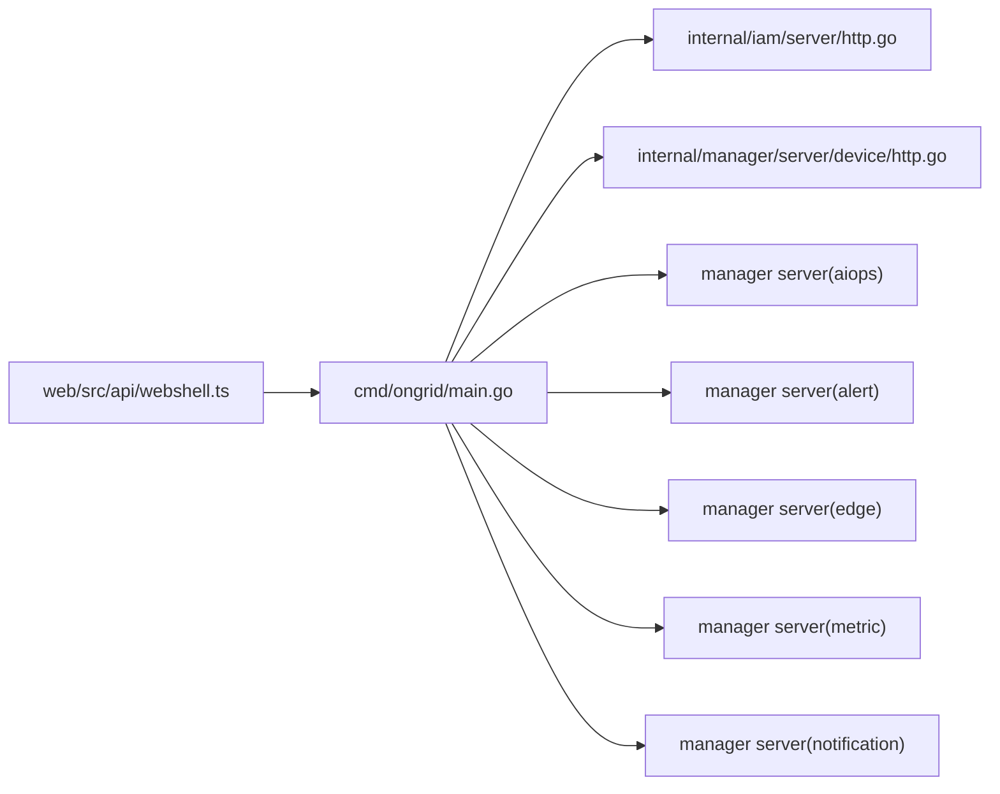

**图表来源**
- [cmd/ongrid/main.go:2350-2482](file://cmd/ongrid/main.go#L2350-L2482)
- [internal/iam/server/http.go:151-155](file://internal/iam/server/http.go#L151-L155)
- [internal/manager/server/device/http.go:46-75](file://internal/manager/server/device/http.go#L46-L75)
- [web/src/api/webshell.ts:29-58](file://web/src/api/webshell.ts#L29-L58)

**章节来源**
- [cmd/ongrid/main.go:2350-2482](file://cmd/ongrid/main.go#L2350-L2482)
- [internal/iam/server/http.go:151-155](file://internal/iam/server/http.go#L151-L155)
- [internal/manager/server/device/http.go:46-75](file://internal/manager/server/device/http.go#L46-L75)
- [web/src/api/webshell.ts:29-58](file://web/src/api/webshell.ts#L29-L58)

## 性能与扩展性
- 指标查询支持自动粒度选择，长窗口聚合降低 IO 压力。
- Tunnel 批量推送指标，减少往返开销。
- 鉴权中间件集中化，避免重复计算。
- 建议：
  - 合理设置 page_size 与 limit，避免大页拉取。
  - 使用 StreamMessage 进行流式渲染，提升用户体验。
  - 对高频读接口实施缓存（如热点配置、字典数据）。
  - 关注数据库连接池监控指标，及时扩容或调优。

[本节为通用指导，无需源码引用]

## 故障排查指南
- 鉴权失败：检查 Bearer Token 是否有效、是否过期；确认 org_id 是否正确注入。
- WebSocket 连接失败：确认子协议一致、token 参数正确、网络可达。
- 指标缺失：检查 Edge 心跳与指标上报是否正常，查看 accepted 计数。
- 告警状态异常：核对状态转换是否符合预期，检查确认/解决操作日志。

**章节来源**
- [internal/iam/server/http.go:116-134](file://internal/iam/server/http.go#L116-L134)
- [api/tunnel/v1/tunnel.proto:62-73](file://api/tunnel/v1/tunnel.proto#L62-L73)
- [api/tunnel/v1/tunnel.proto:76-87](file://api/tunnel/v1/tunnel.proto#L76-L87)
- [api/manager/alert/v1/alert.proto:23-29](file://api/manager/alert/v1/alert.proto#L23-L29)

## 结论
本 API 体系以 proto 契约为核心，结合手写 HTTP 路由与 gRPC 服务，形成清晰的边界与良好的可扩展性。Tunnel 协议与 WebSocket 分别承担数据面与交互面职责，满足大规模设备管理与实时运维需求。遵循本文的最佳实践与排障建议，可有效提升稳定性与性能。

[本节为总结，无需源码引用]

## 附录

### RESTful 端点清单（节选）
- 认证（公开）
  - POST /api/v1/auth/login
  - POST /api/v1/auth/refresh
- 设备管理（受保护）
  - GET /api/v1/devices
  - GET /api/v1/devices/{id}
  - PATCH /api/v1/devices/{id}
  - DELETE /api/v1/devices/{id}?hard=true
  - POST /api/v1/devices/{id}/restore
  - GET /api/v1/devices/{id}/edges
  - PUT /api/v1/devices/{id}/ssh-credentials
  - GET /api/v1/devices/{id}/ssh-info
  - DELETE /api/v1/devices/{id}/ssh-credentials
- 页面分享（公开）
  - GET /api/p/{token}
- 版本信息（受保护）
  - GET /api/v1/version

**章节来源**
- [internal/iam/server/http.go:151-155](file://internal/iam/server/http.go#L151-L155)
- [internal/manager/server/device/http.go:46-75](file://internal/manager/server/device/http.go#L46-L75)
- [cmd/ongrid/main.go:2350-2482](file://cmd/ongrid/main.go#L2350-L2482)

### gRPC 服务清单
- ongrid.iam.v1.IamService
- ongrid.manager.aiops.v1.AiopsService
- ongrid.manager.alert.v1.AlertService
- ongrid.manager.edge.v1.EdgeService
- ongrid.manager.metric.v1.MetricService
- ongrid.manager.notification.v1.NotificationService

**章节来源**
- [api/iam/v1/iam.proto:9-42](file://api/iam/v1/iam.proto#L9-L42)
- [api/manager/aiops/v1/aiops.proto:9-29](file://api/manager/aiops/v1/aiops.proto#L9-L29)
- [api/manager/alert/v1/alert.proto:9-14](file://api/manager/alert/v1/alert.proto#L9-L14)
- [api/manager/edge/v1/edge.proto:10-29](file://api/manager/edge/v1/edge.proto#L10-L29)
- [api/manager/metric/v1/metric.proto:9-17](file://api/manager/metric/v1/metric.proto#L9-L17)
- [api/manager/notification/v1/notification.proto:10-17](file://api/manager/notification/v1/notification.proto#L10-L17)

### WebSocket 协议要点
- 子协议：ongrid.shell.v1
- 首帧 open：包含终端尺寸、SSH 凭据与可选 ssh_host
- 控制帧：resize、close
- 服务端回推：ready、auth_error、exit

**章节来源**
- [web/src/api/webshell.ts:29-58](file://web/src/api/webshell.ts#L29-L58)
- [web/src/api/webshell.ts:60-99](file://web/src/api/webshell.ts#L60-L99)

### 安全与合规
- 所有敏感密钥（如 SecretKey）仅一次性明文返回，服务端仅存哈希。
- org_id 等租户上下文由中间件注入，禁止客户端传入。
- 公开分享链接具备 TTL 限制，防止长期泄露。

**章节来源**
- [api/manager/edge/v1/edge.proto:68-77](file://api/manager/edge/v1/edge.proto#L68-L77)
- [api/README.md:23-31](file://api/README.md#L23-L31)
- [cmd/ongrid/main.go:2350-2482](file://cmd/ongrid/main.go#L2350-L2482)

### 版本与兼容性
- Proto 包命名规范：ongrid.<bc>[.<subdomain>].v<major>
- go_package 指向生成的 Go 包路径
- 每个 RPC 拥有独立的 Request/Response 类型，保障向前兼容
- 变更检测由 CI 中的 buf breaking 执行

**章节来源**
- [api/README.md:21-31](file://api/README.md#L21-L31)
- [api/README.md:33-41](file://api/README.md#L33-L41)

### 速率限制与重试
- 登录接口内置限流器（loginThrottle），防止暴力破解。
- 建议客户端对幂等请求实施指数退避重试，避免雪崩。

**章节来源**
- [internal/iam/server/http.go:147-149](file://internal/iam/server/http.go#L147-L149)

### 测试与调试
- 使用 curl 或浏览器开发者工具验证 HTTP 端点。
- 使用 gRPC 客户端（如 grpcurl）调用 gRPC 服务。
- 使用浏览器控制台或专用 WebSocket 客户端调试 Shell 通道。
- 观察 Prometheus /metrics 指标定位瓶颈。

[本节为通用指导，无需源码引用]