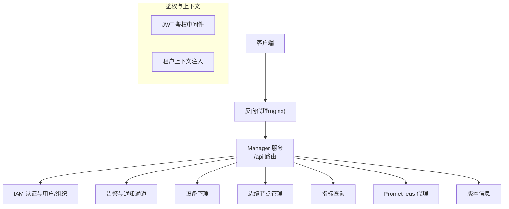
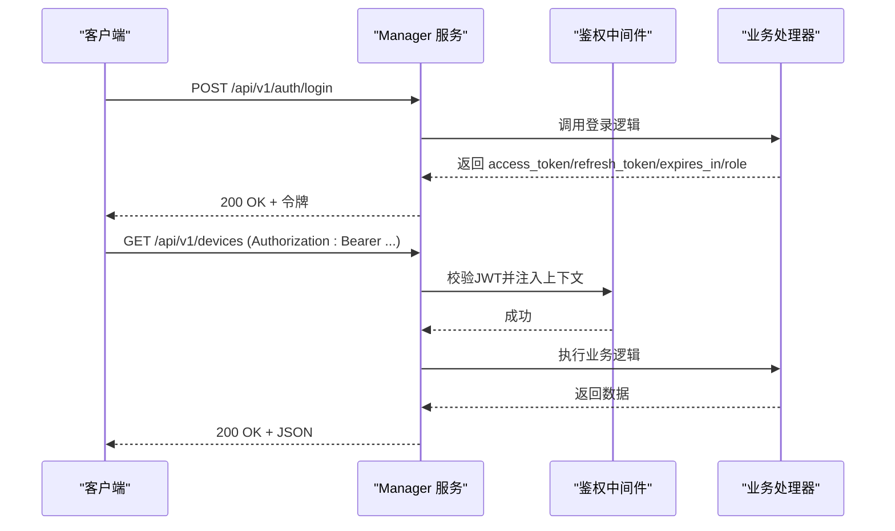
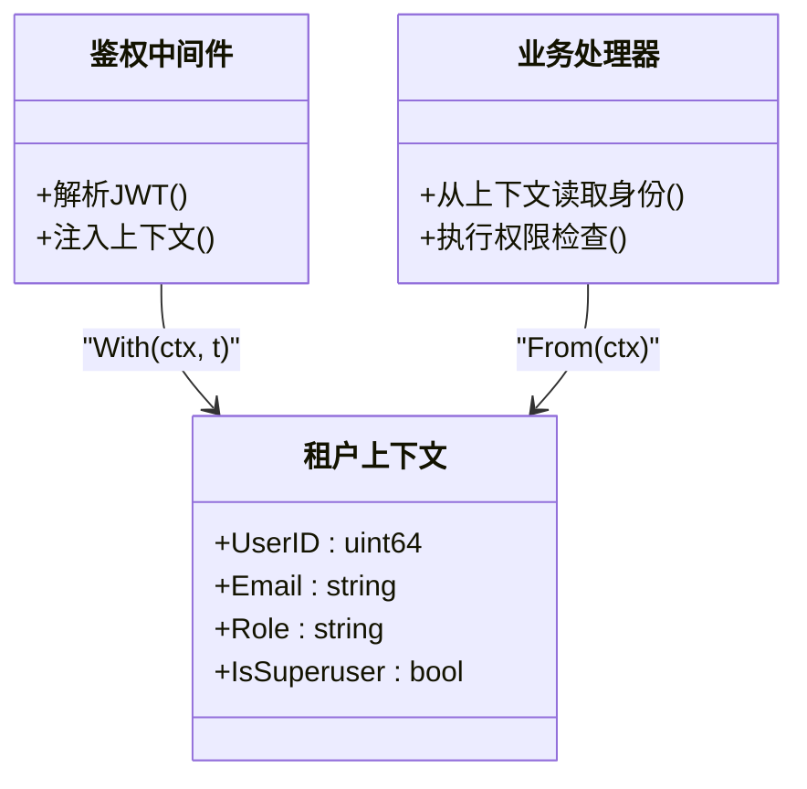

# REST API接口

<cite>
**本文引用的文件**   
- [cmd/ongrid/main.go](file://cmd/ongrid/main.go)
- [internal/iam/server/http.go](file://internal/iam/server/http.go)
- [internal/pkg/auth/middleware.go](file://internal/pkg/auth/middleware.go)
- [internal/pkg/tenantctx/tenantctx.go](file://internal/pkg/tenantctx/tenantctx.go)
- [internal/manager/server/alert/http.go](file://internal/manager/server/alert/http.go)
- [internal/manager/server/device/http.go](file://internal/manager/server/device/http.go)
- [internal/manager/server/edge/http.go](file://internal/manager/server/edge/http.go)
- [internal/manager/server/metric/http.go](file://internal/manager/server/metric/http.go)
- [internal/manager/server/prometheus/http.go](file://internal/manager/server/prometheus/http.go)
</cite>

## 目录
1. [简介](#简介)
2. [项目结构](#项目结构)
3. [核心组件](#核心组件)
4. [架构总览](#架构总览)
5. [详细组件分析](#详细组件分析)
6. [依赖关系分析](#依赖关系分析)
7. [性能与缓存](#性能与缓存)
8. [故障排查指南](#故障排查指南)
9. [结论](#结论)
10. [附录](#附录)

## 简介
本文件为 ongrid 管理端（Manager）的 REST API 接口文档。API 基于 Go + chi 路由，统一以 /api 前缀暴露，鉴权采用 JWT Bearer Token，权限控制通过角色（admin/user）与可选的 RBAC 中间件实现。所有响应体为 JSON，错误响应包含统一的 code 字段便于客户端处理。

## 项目结构
- 入口与路由挂载：主进程在 /api 下注册公共与受保护路由组，并在受保护组中注入 JWT 鉴权中间件。
- 业务域：IAM、告警、设备、边缘节点、指标查询、Prometheus 代理等子域各自提供 HTTP Handler 并注册到对应路由。
- 通用能力：JWT 签发与校验、租户上下文注入、审计事件写入、错误码映射。

**图示来源** 
- [cmd/ongrid/main.go:2352-2416](file://cmd/ongrid/main.go#L2352-L2416)
- [internal/pkg/auth/middleware.go](file://internal/pkg/auth/middleware.go)
- [internal/pkg/tenantctx/tenantctx.go](file://internal/pkg/tenantctx/tenantctx.go)

**章节来源**
- [cmd/ongrid/main.go:2352-2416](file://cmd/ongrid/main.go#L2352-L2416)

## 核心组件
- 认证与令牌
  - 登录、刷新令牌、注册、获取当前用户信息、用户与组织管理。
  - 登录失败速率限制（按 IP 与邮箱双维度）。
- 权限控制
  - 基于角色的访问控制（admin/user），部分写操作要求 admin；可接入 casbin 进行细粒度授权。
- 请求头与参数
  - Authorization: Bearer <access_token>
  - Accept-Language: en|zh（影响 AI 调查输出语言）
  - X-Forwarded-For：由 nginx 设置，用于识别真实客户端 IP
- 分页与过滤
  - 多数列表接口支持 page/page_size 或 limit/offset 组合；具体参数见各接口说明。
- 错误格式
  - 统一返回 { error, code }，code 为稳定字符串标识，如 unauthorized、forbidden、invalid、not-found、internal 等。

**章节来源**
- [internal/iam/server/http.go:151-183](file://internal/iam/server/http.go#L151-L183)
- [internal/iam/server/http.go:221-269](file://internal/iam/server/http.go#L221-L269)
- [internal/manager/server/alert/http.go:941-962](file://internal/manager/server/alert/http.go#L941-L962)
- [internal/manager/server/device/http.go:629-654](file://internal/manager/server/device/http.go#L629-L654)
- [internal/manager/server/edge/http.go:833-856](file://internal/manager/server/edge/http.go#L833-L856)
- [internal/manager/server/metric/http.go:233-257](file://internal/manager/server/metric/http.go#L233-L257)

## 架构总览
- 路由分组
  - 公开路由：/api/v1/auth/*（登录、刷新）
  - 受保护路由：/api 下其余所有路径，需携带有效 JWT
- 鉴权流程
  - 客户端携带 Authorization: Bearer access_token
  - 鉴权中间件解析 JWT，将调用者信息（user_id、email、role）注入请求上下文
  - 业务处理器从上下文读取身份并进行角色/资源级校验
- 审计
  - 关键操作（登录失败、用户/规则/通道变更等）记录审计事件

**图示来源** 
- [cmd/ongrid/main.go:2352-2416](file://cmd/ongrid/main.go#L2352-L2416)
- [internal/iam/server/http.go:151-183](file://internal/iam/server/http.go#L151-L183)
- [internal/pkg/tenantctx/tenantctx.go:1-35](file://internal/pkg/tenantctx/tenantctx.go#L1-L35)

## 详细组件分析

### 认证与账号（IAM）
- 基础信息
  - 前缀：/api/v1
  - 鉴权：登录/刷新无需鉴权；其他接口需要 Bearer Token
  - 速率限制：登录失败按 IP 与邮箱窗口计数，超限返回“尝试过多”
- 端点清单
  - POST /api/v1/auth/login
    - 请求体：{ email, password }
    - 响应：{ access_token, refresh_token, expires_in, role }
    - 状态码：200 OK / 400 无效参数 / 401 认证失败 / 429 尝试过多
  - POST /api/v1/auth/refresh
    - 请求体：{ refresh_token }
    - 响应：同 login
    - 状态码：200 OK / 400 无效参数 / 401 无效刷新令牌
  - POST /api/v1/auth/register（仅 admin）
    - 请求体：{ email, password, role? }
    - 响应：{ id, email, role }
    - 状态码：201 Created / 400 / 401 / 403
  - GET /api/v1/self（任意已认证）
    - 响应：{ id, email, role }
  - GET /api/v1/me（任意已认证）
    - 响应：包含成员信息的增强自我视图
  - GET /api/v1/users（仅 admin）
    - 响应：{ items:[...], total:int }
  - POST /api/v1/users（仅 admin）
    - 请求体：参考 registerReq
    - 响应：同 list 中的 userDTO
  - PATCH /api/v1/users/{id}（仅 admin）
    - 请求体：参考 updateReq（含可选字段）
    - 状态码：200 OK / 400 / 403
  - PATCH /api/v1/users/{id}/role（仅 admin）
    - 请求体：{ role }
    - 状态码：204 No Content
  - PATCH /api/v1/users/{id}/password（仅 admin）
    - 请求体：{ password }
    - 状态码：204 No Content
  - DELETE /api/v1/users/{id}（仅 admin）
    - 状态码：204 No Content
  - 组织管理（/v1/orgs/*）
    - GET /api/v1/orgs、POST /api/v1/orgs、PATCH /api/v1/orgs/{id}、DELETE /api/v1/orgs/{id}
    - GET /api/v1/orgs/{id}/members、POST /api/v1/orgs/{id}/members、PATCH /api/v1/orgs/{id}/members/{user_id}、DELETE /api/v1/orgs/{id}/members/{user_id}
    - 权限：读自己所在组织列表；写操作通常要求更高权限（以服务端实现为准）

- 请求示例（curl）
  - 登录
    - curl -X POST http://<host>/api/v1/auth/login -H 'Content-Type: application/json' -d '{"email":"admin@example.com","password":"***"}'
  - 刷新令牌
    - curl -X POST http://<host>/api/v1/auth/refresh -H 'Content-Type: application/json' -d '{"refresh_token":"***"}'
  - 获取当前用户
    - curl -H 'Authorization: Bearer <token>' http://<host>/api/v1/self

- 错误示例
  - 401 未认证
    - {"error":"...","code":"unauthorized"}
  - 403 无权限
    - {"error":"...","code":"forbidden"}
  - 429 尝试过多
    - {"error":"...","code":"too-many-attempts"}

**章节来源**
- [internal/iam/server/http.go:151-183](file://internal/iam/server/http.go#L151-L183)
- [internal/iam/server/http.go:221-269](file://internal/iam/server/http.go#L221-L269)
- [internal/iam/server/http.go:290-313](file://internal/iam/server/http.go#L290-L313)
- [internal/iam/server/http.go:329-343](file://internal/iam/server/http.go#L329-L343)
- [internal/iam/server/http.go:345-365](file://internal/iam/server/http.go#L345-L365)
- [internal/iam/server/http.go:367-393](file://internal/iam/server/http.go#L367-L393)
- [internal/iam/server/http.go:397-408](file://internal/iam/server/http.go#L397-L408)

### 告警与通知（Alerts & Channels）
- 基础信息
  - 前缀：/api/v1
  - 鉴权：全部需要 Bearer Token
  - 管理员端点：创建/更新/删除规则、测试通道等
- 端点清单
  - 事件
    - GET /api/v1/alerts/incidents?page=1&page_size=20&status=&severity=&query=
      - 响应：{ items:[...], total:int }
    - GET /api/v1/alerts/incidents/{id}
    - GET /api/v1/alerts/incidents/{id}/events?limit=200
    - POST /api/v1/alerts/incidents/{id}/ack
      - 请求体：{ note }
    - POST /api/v1/alerts/incidents/{id}/resolve
      - 请求体：{ note }
    - POST /api/v1/alerts/incidents/{id}/silence
      - 请求体：{ until, reason }
    - GET /api/v1/alerts/incidents/{id}/investigation
      - 当功能未启用时返回 status:"feature_disabled"
    - POST /api/v1/alerts/incidents/{id}/investigation
      - 触发调查（异步），返回 202 Accepted 及当前状态
    - GET /api/v1/alerts/runtime-info
      - 返回评估间隔与冷却时间等运行时信息
  - 通知通道
    - GET /api/v1/notification-channels?page=1&page_size=20
    - GET /api/v1/notification-channels/{id}
    - POST /api/v1/notification-channels（仅 admin）
      - 请求体：{ name, type, endpoint, secret?, enabled }
    - PUT /api/v1/notification-channels/{id}（仅 admin）
    - DELETE /api/v1/notification-channels/{id}（仅 admin）
    - POST /api/v1/notification-channels/{id}/test（仅 admin）
  - 告警规则（可选，取决于构建）
    - GET /api/v1/alert-rules?scope=
    - GET /api/v1/alert-rules/{id}
    - POST /api/v1/alert-rules（仅 admin）
    - POST /api/v1/alert-rules/preview（仅 admin）
      - 请求体：ruleReq + lookback_seconds
    - PUT /api/v1/alert-rules/{id}（仅 admin）
    - POST /api/v1/alert-rules/{id}/enabled（仅 admin）
      - 请求体：{ enabled }
    - DELETE /api/v1/alert-rules/{id}（仅 admin）

- 请求示例（curl）
  - 列出事件
    - curl -H 'Authorization: Bearer <token>' 'http://<host>/api/v1/alerts/incidents?page=1&page_size=20'
  - 测试通道
    - curl -X POST -H 'Authorization: Bearer <token>' http://<host>/api/v1/notification-channels/1/test

- 错误示例
  - 401/403/404/400/501 等，均返回 { error, code }

**章节来源**
- [internal/manager/server/alert/http.go:154-181](file://internal/manager/server/alert/http.go#L154-L181)
- [internal/manager/server/alert/http.go:254-282](file://internal/manager/server/alert/http.go#L254-L282)
- [internal/manager/server/alert/http.go:311-350](file://internal/manager/server/alert/http.go#L311-L350)
- [internal/manager/server/alert/http.go:359-408](file://internal/manager/server/alert/http.go#L359-L408)
- [internal/manager/server/alert/http.go:557-571](file://internal/manager/server/alert/http.go#L557-L571)
- [internal/manager/server/alert/http.go:592-622](file://internal/manager/server/alert/http.go#L592-L622)
- [internal/manager/server/alert/http.go:624-658](file://internal/manager/server/alert/http.go#L624-L658)
- [internal/manager/server/alert/http.go:660-681](file://internal/manager/server/alert/http.go#L660-L681)
- [internal/manager/server/alert/http.go:683-699](file://internal/manager/server/alert/http.go#L683-L699)
- [internal/manager/server/alert/http.go:701-733](file://internal/manager/server/alert/http.go#L701-L733)
- [internal/manager/server/alert/http.go:735-759](file://internal/manager/server/alert/http.go#L735-L759)
- [internal/manager/server/alert/http.go:761-789](file://internal/manager/server/alert/http.go#L761-L789)
- [internal/manager/server/alert/http.go:791-820](file://internal/manager/server/alert/http.go#L791-L820)
- [internal/manager/server/alert/http.go:826-842](file://internal/manager/server/alert/http.go#L826-L842)
- [internal/manager/server/alert/http.go:844-865](file://internal/manager/server/alert/http.go#L844-L865)
- [internal/manager/server/alert/http.go:996-1006](file://internal/manager/server/alert/http.go#L996-L1006)

### 设备管理（Devices）
- 基础信息
  - 前缀：/api/v1
  - 鉴权：全部需要 Bearer Token
  - 管理员端点：创建/更新/删除设备、恢复软删、设置 SSH 凭据等
- 端点清单
  - POST /api/v1/devices（仅 admin）
    - 请求体：{ name, description?, hostname?, ssh_host, ssh_port, ssh_user, ssh_auth_kind, ssh_password?, ssh_key? }
    - 响应：包含 id、name、hostname、description、ssh_*、created_at
  - GET /api/v1/devices
    - 查询参数：
      - hostname、name：精确匹配
      - roles：逗号分隔的角色名，支持 unknown 特殊值（不可与命名角色混用）
      - online：true/false/1/0
      - limit、offset：分页
      - include_deleted：true/1/yes 显示已软删除行
    - 响应：{ items:[...], total:int }
  - GET /api/v1/devices/{id}
  - PATCH /api/v1/devices/{id}（仅 admin）
    - 请求体：updateReq（可选字段合并语义）
    - 响应：最新设备 DTO
  - PATCH /api/v1/devices/{id}/roles（仅 admin）
    - 请求体：{ roles:[string] }
    - 状态码：204 No Content
  - DELETE /api/v1/devices/{id}?hard=true（仅 admin）
    - hard=true 物理删除；默认软删除
    - 状态码：204 No Content
  - POST /api/v1/devices/{id}/restore（仅 admin）
    - 响应：恢复后的设备 DTO
  - GET /api/v1/devices/{id}/edges
    - 响应：{ items:[{ edge_id, device_id, type, created_at }] }
  - PUT /api/v1/devices/{id}/ssh-credentials（仅 admin）
  - GET /api/v1/devices/{id}/ssh-info
  - DELETE /api/v1/devices/{id}/ssh-credentials（仅 admin）

- 请求示例（curl）
  - 列出设备
    - curl -H 'Authorization: Bearer <token>' 'http://<host>/api/v1/devices?include_deleted=true&limit=20&offset=0'
  - 更新设备
    - curl -X PATCH -H 'Authorization: Bearer <token>' -H 'Content-Type: application/json' -d '{"name":"新名称"}' http://<host>/api/v1/devices/1

- 错误示例
  - 400 invalid（参数不合法）
  - 403 forbidden（非 admin）
  - 404 not-found（设备不存在）

**章节来源**
- [internal/manager/server/device/http.go:61-75](file://internal/manager/server/device/http.go#L61-L75)
- [internal/manager/server/device/http.go:215-284](file://internal/manager/server/device/http.go#L215-L284)
- [internal/manager/server/device/http.go:293-338](file://internal/manager/server/device/http.go#L293-L338)
- [internal/manager/server/device/http.go:340-356](file://internal/manager/server/device/http.go#L340-L356)
- [internal/manager/server/device/http.go:370-456](file://internal/manager/server/device/http.go#L370-L456)
- [internal/manager/server/device/http.go:458-474](file://internal/manager/server/device/http.go#L458-L474)
- [internal/manager/server/device/http.go:476-490](file://internal/manager/server/device/http.go#L476-L490)
- [internal/manager/server/device/http.go:496-513](file://internal/manager/server/device/http.go#L496-L513)
- [internal/manager/server/device/http.go:515-545](file://internal/manager/server/device/http.go#L515-L545)

### 边缘节点（Edges）
- 基础信息
  - 前缀：/api/v1
  - 鉴权：全部需要 Bearer Token
  - 管理员端点：创建/删除节点、轮换密钥、升级 Agent、插件配置等
- 端点清单
  - POST /api/v1/edges（仅 admin）
    - 请求体：{ name, device_id?, task_name? }
    - 响应：{ id, name, access_key_id, secret_key, created_at }
  - GET /api/v1/edges
    - 查询参数：status、name、hostname、ip、device_id、limit、offset
    - 响应：{ items:[...], total:int }
  - GET /api/v1/edges/{id}
  - DELETE /api/v1/edges/{id}（仅 admin）
  - POST /api/v1/edges/{id}/rotate-secret（仅 admin）
    - 响应：{ secret_key }
  - POST /api/v1/edges/{id}/upgrade（仅 admin）
    - 请求体：{ url, sha256 }
    - 响应：{ staged_path, bytes }
  - POST /api/v1/edges/{id}/upgrade-package（仅 admin）
    - 请求体（可选）：{ arch?, version? }
    - 响应：{ version, staged_path, bytes, manifest_files, applied, apply_error? }
  - GET /api/v1/edges/{id}/processes?top_n=20&sort_by=mem|cpu
    - 响应：{ items:[pid,name,cmdline,cpu_pct,mem_pct,user], sampled_at }
  - 插件运行态
    - GET /api/v1/edges/{id}/plugins
    - PUT /api/v1/edges/{id}/plugins/{name}（仅 admin）
    - GET /api/v1/integrations/plugin-counts

- 请求示例（curl）
  - 列出边缘节点
    - curl -H 'Authorization: Bearer <token>' 'http://<host>/api/v1/edges?status=online&limit=20'
  - 一键升级包
    - curl -X POST -H 'Authorization: Bearer <token>' -H 'Content-Type: application/json' -d '{}' http://<host>/api/v1/edges/1/upgrade-package

- 错误示例
  - 400 invalid（参数不合法）
  - 403 forbidden（非 admin）
  - 501 not-wired-yet（功能未装配）

**章节来源**
- [internal/manager/server/edge/http.go:141-163](file://internal/manager/server/edge/http.go#L141-L163)
- [internal/manager/server/edge/http.go:396-430](file://internal/manager/server/edge/http.go#L396-L430)
- [internal/manager/server/edge/http.go:432-492](file://internal/manager/server/edge/http.go#L432-L492)
- [internal/manager/server/edge/http.go:494-523](file://internal/manager/server/edge/http.go#L494-L523)
- [internal/manager/server/edge/http.go:525-536](file://internal/manager/server/edge/http.go#L525-L536)
- [internal/manager/server/edge/http.go:538-550](file://internal/manager/server/edge/http.go#L538-L550)
- [internal/manager/server/edge/http.go:566-590](file://internal/manager/server/edge/http.go#L566-L590)
- [internal/manager/server/edge/http.go:602-655](file://internal/manager/server/edge/http.go#L602-L655)
- [internal/manager/server/edge/http.go:689-726](file://internal/manager/server/edge/http.go#L689-L726)
- [internal/manager/server/edge/http.go:167-222](file://internal/manager/server/edge/http.go#L167-L222)
- [internal/manager/server/edge/http.go:266-288](file://internal/manager/server/edge/http.go#L266-L288)
- [internal/manager/server/edge/http.go:291-302](file://internal/manager/server/edge/http.go#L291-L302)

### 指标查询（Metrics）
- 基础信息
  - 前缀：/api/v1
  - 鉴权：需要 Bearer Token
- 端点清单
  - GET /api/v1/edges/{id}/metrics?from=RFC3339&to=RFC3339&resolution=auto|raw|5m|1h
    - 响应：{ resolution, from, to, points:[ts, cpu(avg,max), mem(avg,max), load1/5/15(avg,max), net_rx_bps?, net_tx_bps?, disk_used_pct(avg,max)] }

- 请求示例（curl）
  - curl -H 'Authorization: Bearer <token>' 'http://<host>/api/v1/edges/1/metrics?from=2026-01-01T00:00:00Z&to=2026-01-01T01:00:00Z&resolution=5m'

- 错误示例
  - 400 invalid（时间格式错误或缺失）
  - 404 not-found（节点不存在）

**章节来源**
- [internal/manager/server/metric/http.go:39-41](file://internal/manager/server/metric/http.go#L39-L41)
- [internal/manager/server/metric/http.go:85-126](file://internal/manager/server/metric/http.go#L85-L126)
- [internal/manager/server/metric/http.go:187-208](file://internal/manager/server/metric/http.go#L187-L208)

### Prometheus 代理（内部使用）
- 端点
  - GET /api/prom/auth
    - 基于 Cookie 票据滑动续期，成功后返回 204 No Content
  - 其他查询端点由代理转发，鉴权由该中间流程保障

**章节来源**
- [internal/manager/server/prometheus/http.go:109-146](file://internal/manager/server/prometheus/http.go#L109-L146)

### 版本信息
- 端点
  - GET /api/v1/version（受保护）
    - 响应：{ manager_version }

**章节来源**
- [cmd/ongrid/main.go:2388-2391](file://cmd/ongrid/main.go#L2388-L2391)

## 依赖关系分析
- 鉴权与上下文
  - 鉴权中间件负责解析 JWT，并将调用者信息注入 tenantctx
  - 业务处理器从上下文读取角色与用户 ID，执行权限判断
- 路由挂载
  - 主进程在 /api 下注册公共与受保护路由组，受保护组统一应用鉴权中间件

**图示来源** 
- [internal/pkg/auth/middleware.go](file://internal/pkg/auth/middleware.go)
- [internal/pkg/tenantctx/tenantctx.go:1-35](file://internal/pkg/tenantctx/tenantctx.go#L1-L35)

**章节来源**
- [cmd/ongrid/main.go:2381-2391](file://cmd/ongrid/main.go#L2381-L2391)
- [internal/pkg/tenantctx/tenantctx.go:1-35](file://internal/pkg/tenantctx/tenantctx.go#L1-L35)

## 性能与缓存
- 速率限制
  - 登录失败按 IP 与邮箱窗口计数，防止暴力破解与密码喷洒
- 分页与过滤
  - 列表接口普遍支持 page/page_size 或 limit/offset，建议前端合理设置页大小以减少负载
- 指标查询
  - 支持 auto/raw/5m/1h 分辨率，长时范围建议使用聚合分辨率以降低数据量
- 缓存策略
  - 服务端未内置全局缓存层；建议在网关层（如 nginx）对只读接口做短 TTL 缓存（例如版本、插件计数）
- 性能优化建议
  - 批量查询优先（如 edges 列表配合过滤）
  - 避免频繁轮询敏感接口，结合后端提供的 runtime-info 调整轮询频率
  - 大对象（如 investigation 报告）按需拉取

[本节为通用指导，不涉及具体代码片段]

## 故障排查指南
- 常见错误码
  - unauthorized：未携带或无效令牌
  - forbidden：无权限（非 admin 或资源不匹配）
  - invalid：请求参数不合法
  - not-found：资源不存在
  - not-wired-yet：功能未装配（如插件配置、调查器）
  - internal：服务器内部错误
- 排查步骤
  - 确认 Authorization 头是否正确
  - 检查请求参数是否符合规范（类型、必填项）
  - 查看服务端日志与审计事件（登录失败、规则/通道变更）
  - 对于边缘相关接口，确认节点在线与可达性

**章节来源**
- [internal/manager/server/alert/http.go:941-962](file://internal/manager/server/alert/http.go#L941-L962)
- [internal/manager/server/device/http.go:629-654](file://internal/manager/server/device/http.go#L629-L654)
- [internal/manager/server/edge/http.go:833-856](file://internal/manager/server/edge/http.go#L833-L856)
- [internal/manager/server/metric/http.go:233-257](file://internal/manager/server/metric/http.go#L233-L257)

## 结论
本 API 以 JWT 鉴权为核心，围绕 IAM、告警、设备、边缘节点与指标查询等核心域提供 RESTful 接口。通过统一的错误格式、分页与过滤机制，以及可选的 RBAC 扩展，满足运维场景下的安全与易用需求。建议在生产环境严格配置 JWT 密钥、开启审计、并结合网关层缓存与限流提升整体稳定性与性能。

[本节为总结，不涉及具体代码片段]

## 附录

### 认证与权限要点
- 令牌
  - access_token：用于鉴权的短期令牌
  - refresh_token：用于刷新 access_token
- 请求头
  - Authorization: Bearer <access_token>
  - Accept-Language: en|zh（影响 AI 调查输出语言）
- 权限模型
  - 角色：admin/user
  - 写操作通常需要 admin；可扩展至 casbin 资源级授权

**章节来源**
- [internal/iam/server/http.go:221-269](file://internal/iam/server/http.go#L221-L269)
- [internal/manager/server/alert/http.go:895-906](file://internal/manager/server/alert/http.go#L895-L906)
- [internal/manager/server/edge/http.go:114-127](file://internal/manager/server/edge/http.go#L114-L127)

### 分页与过滤约定
- 通用分页
  - page/page_size：默认 page=1, page_size=20
  - limit/offset：部分接口兼容
- 布尔查询
  - true/1/yes 视为真；false/0/no 视为假；空串默认关闭
- 角色过滤
  - roles 支持逗号分隔；unknown 不可与命名角色混用

**章节来源**
- [internal/manager/server/alert/http.go:254-282](file://internal/manager/server/alert/http.go#L254-L282)
- [internal/manager/server/device/http.go:215-284](file://internal/manager/server/device/http.go#L215-L284)
- [internal/manager/server/device/http.go:603-613](file://internal/manager/server/device/http.go#L603-L613)

### 版本管理与兼容性
- 版本接口
  - GET /api/v1/version 返回 manager_version，供前端检测差异
- 向后兼容
  - 历史字段保留（如 host_info、is_superuser 列）但不再作为输入
  - 新增字段以可选形式出现，旧客户端可忽略

**章节来源**
- [cmd/ongrid/main.go:2388-2391](file://cmd/ongrid/main.go#L2388-L2391)
- [internal/iam/server/http.go:167-170](file://internal/iam/server/http.go#L167-L170)

### Postman 集合使用指南
- 新建集合
  - Base URL 设置为 https://<host>/api
  - 添加环境变量 token，值为 access_token
- 预请求脚本（可选）
  - 自动设置 Authorization: Bearer {{token}}
- 常用请求
  - 登录：POST /v1/auth/login
  - 刷新：POST /v1/auth/refresh
  - 设备列表：GET /v1/devices
  - 边缘列表：GET /v1/edges
  - 指标查询：GET /v1/edges/:id/metrics

[本节为通用指导，不涉及具体代码片段]