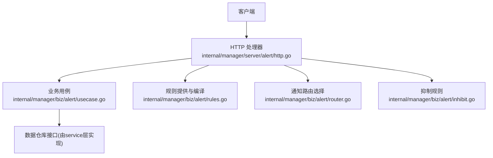
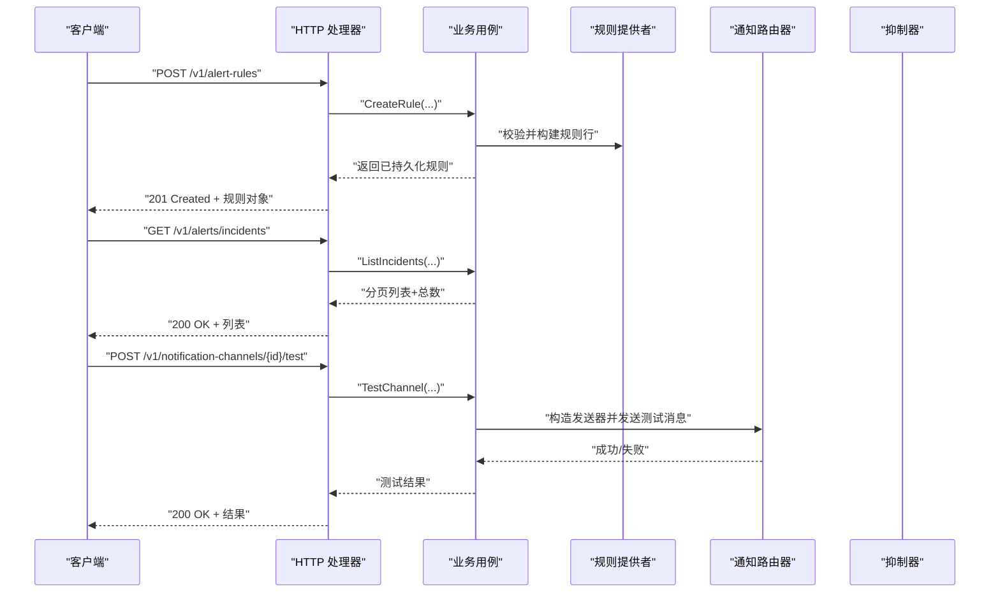
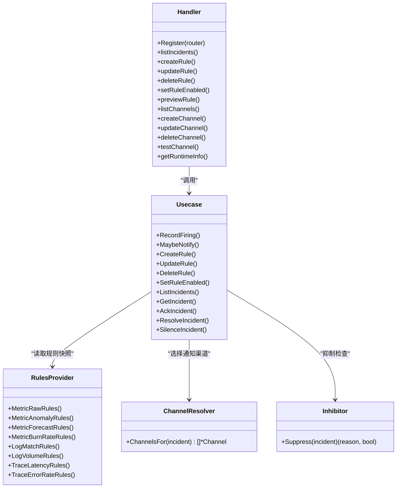

# 告警管理API

<cite>
**本文引用的文件**   
- [alert.proto](file://api/manager/alert/v1/alert.proto)
- [http.go](file://internal/manager/server/alert/http.go)
- [usecase.go](file://internal/manager/biz/alert/usecase.go)
- [rules.go](file://internal/manager/biz/alert/rules.go)
- [router.go](file://internal/manager/biz/alert/router.go)
- [inhibit.go](file://internal/manager/biz/alert/inhibit.go)
</cite>

## 目录
1. [简介](#简介)
2. [项目结构](#项目结构)
3. [核心组件](#核心组件)
4. [架构总览](#架构总览)
5. [详细接口说明](#详细接口说明)
6. [依赖关系分析](#依赖关系分析)
7. [性能与稳定性](#性能与稳定性)
8. [故障排查指南](#故障排查指南)
9. [结论](#结论)
10. [附录](#附录)

## 简介
本文件为“告警管理”REST API的完整接口文档，覆盖以下能力：
- 告警规则管理（CRUD、启用/禁用、预览）
- 告警实例（事件）查询与状态变更（确认、解决、静默）
- 通知渠道配置（增删改查、测试）
- 告警评估器、抑制规则、路由配置的机制说明
- 高级功能：告警预览、测试规则、批量操作等
- 告警优先级、去重策略、通知渠道配置机制
- 完整的请求/响应示例与错误处理指南

## 项目结构
后端采用分层设计：HTTP 层负责路由与鉴权；业务层实现用例、规则编译、通知路由与抑制；数据层通过服务接口抽象。

图表来源
- [http.go:154-181](file://internal/manager/server/alert/http.go#L154-L181)
- [usecase.go:125-150](file://internal/manager/biz/alert/usecase.go#L125-L150)
- [rules.go:305-358](file://internal/manager/biz/alert/rules.go#L305-L358)
- [router.go:31-111](file://internal/manager/biz/alert/router.go#L31-L111)
- [inhibit.go:44-60](file://internal/manager/biz/alert/inhibit.go#L44-L60)

章节来源
- [http.go:154-181](file://internal/manager/server/alert/http.go#L154-L181)

## 核心组件
- HTTP 处理器：定义所有 REST 端点、鉴权、参数解析、统一错误码映射
- 业务用例：实现告警生命周期、去重、静默、冷却、抑制、通知投递、规则创建/更新/删除、预览
- 规则系统：多类型规则（指标原始、异常、预测、燃烧率、日志匹配/总量、追踪延迟/错误率），支持缓存与周期性刷新
- 通知路由：按严重级别、作用域、规则级通道钉选进行分发
- 抑制器：内置 edge_offline 与 pipeline 根因抑制逻辑

章节来源
- [http.go:25-126](file://internal/manager/server/alert/http.go#L25-L126)
- [usecase.go:73-103](file://internal/manager/biz/alert/usecase.go#L73-L103)
- [rules.go:193-215](file://internal/manager/biz/alert/rules.go#L193-L215)
- [router.go:11-47](file://internal/manager/biz/alert/router.go#L11-L47)
- [inhibit.go:25-41](file://internal/manager/biz/alert/inhibit.go#L25-L41)

## 架构总览

图表来源
- [http.go:735-759](file://internal/manager/server/alert/http.go#L735-L759)
- [usecase.go:627-646](file://internal/manager/biz/alert/usecase.go#L627-L646)
- [usecase.go:1215-1358](file://internal/manager/biz/alert/usecase.go#L1215-L1358)

## 详细接口说明

### 通用约定
- 基础路径：/v1
- 认证：请求需携带租户上下文（由中间件注入），未认证返回 401
- 权限：部分写操作要求 admin 角色，否则返回 403
- 分页：page/page_size 为正整数，默认 page=1, page_size=20
- 时间字段：ISO-8601 字符串或 RFC3339 格式
- 错误体：{ "error": "描述", "code": "错误码" }，HTTP 状态码见各接口

章节来源
- [http.go:887-906](file://internal/manager/server/alert/http.go#L887-L906)
- [http.go:941-962](file://internal/manager/server/alert/http.go#L941-L962)

---

### 告警实例（Incident）

#### 列出告警实例
- 方法：GET
- 路径：/v1/alerts/incidents
- 查询参数：
  - status: 可选，过滤状态
  - severity: 可选，过滤严重级别
  - query: 可选，全文检索
  - page: 页码，默认 1
  - page_size: 每页条数，默认 20
- 响应体：
  - items: 实例数组
  - total: 总数（非分页裁剪后的真实计数）
- 状态码：200

章节来源
- [http.go:254-282](file://internal/manager/server/alert/http.go#L254-L282)

#### 获取单个告警实例
- 方法：GET
- 路径：/v1/alerts/incidents/{id}
- 路径参数：id（正整数）
- 响应体：实例详情
- 状态码：200

章节来源
- [http.go:284-301](file://internal/manager/server/alert/http.go#L284-L301)

#### 获取实例事件历史
- 方法：GET
- 路径：/v1/alerts/incidents/{id}/events
- 查询参数：limit（默认 200）
- 响应体：
  - items: 事件数组
  - total: 数量
- 状态码：200

章节来源
- [http.go:470-488](file://internal/manager/server/alert/http.go#L470-L488)

#### 确认告警实例
- 方法：POST
- 路径：/v1/alerts/incidents/{id}/ack
- 请求体：
  - note: 备注（可选）
- 响应体：更新后的实例
- 状态码：200

章节来源
- [http.go:458-462](file://internal/manager/server/alert/http.go#L458-L462)

#### 解决告警实例
- 方法：POST
- 路径：/v1/alerts/incidents/{id}/resolve
- 请求体：note（可选）
- 响应体：更新后的实例
- 状态码：200

章节来源
- [http.go:464-468](file://internal/manager/server/alert/http.go#L464-L468)

#### 静默告警实例
- 方法：POST
- 路径：/v1/alerts/incidents/{id}/silence
- 请求体：
  - until: ISO-8601 未来时间
  - reason: 原因（必填）
- 响应体：更新后的实例
- 状态码：200

章节来源
- [http.go:490-523](file://internal/manager/server/alert/http.go#L490-L523)

#### 触发调查（可选功能）
- GET /v1/alerts/incidents/{id}/investigation
  - 返回当前调查报告或状态（feature_disabled/not_started/pending/running/ready）
- POST /v1/alerts/incidents/{id}/investigation
  - 强制重新触发调查（异步），返回 202 Accepted 及当前报告状态
- 注意：当调查功能未启用时，GET 返回 feature_disabled，POST 返回 503

章节来源
- [http.go:311-408](file://internal/manager/server/alert/http.go#L311-L408)

---

### 告警规则（Rule）

#### 列出规则
- 方法：GET
- 路径：/v1/alert-rules
- 查询参数：
  - scope: 可选，按作用域过滤
- 响应体：
  - items: 规则数组
  - total: 数量
- 状态码：200

章节来源
- [http.go:701-714](file://internal/manager/server/alert/http.go#L701-L714)

#### 获取规则
- 方法：GET
- 路径：/v1/alert-rules/{id}
- 响应体：规则详情
- 状态码：200

章节来源
- [http.go:716-733](file://internal/manager/server/alert/http.go#L716-L733)

#### 创建规则
- 方法：POST
- 路径：/v1/alert-rules
- 权限：admin
- 请求体关键字段：
  - rule_key: 唯一键（小写下划线字母数字）
  - kind: 规则类型（如 metric_raw/metric_anomaly/metric_forecast/metric_burn_rate/log_match/log_volume/trace_latency/trace_error_rate）
  - name: 名称
  - scope_type: 作用域（host/global/monitoring_pipeline，受 kind 限制）
  - join_mode: all/any（metric_threshold 友好表单使用）
  - severity: info/warning/critical
  - enabled: 是否启用
  - conditions/spec: 按 kind 不同而不同（详见下方“规则模型与验证”）
  - labels: 标签键值对
  - runbook_url: 运行手册链接
  - notify_channel_ids: 规则级通道钉选（可选）
  - send-policy（发送策略）：notify_window_seconds、notify_min_fires（同时为 0 表示禁用；均 >0 表示启用）
- 响应体：已创建的规则
- 状态码：201

章节来源
- [http.go:735-759](file://internal/manager/server/alert/http.go#L735-L759)
- [usecase.go:627-646](file://internal/manager/biz/alert/usecase.go#L627-L646)

#### 更新规则
- 方法：PUT
- 路径：/v1/alert-rules/{id}
- 权限：admin
- 请求体：同创建
- 响应体：更新后的规则
- 状态码：200

章节来源
- [http.go:761-789](file://internal/manager/server/alert/http.go#L761-L789)

#### 启用/禁用规则
- 方法：POST
- 路径：/v1/alert-rules/{id}/enabled
- 权限：admin
- 请求体：
  - enabled: true/false
- 响应体：更新后的规则
- 状态码：200

章节来源
- [http.go:791-820](file://internal/manager/server/alert/http.go#L791-L820)

#### 删除规则
- 方法：DELETE
- 路径：/v1/alert-rules/{id}
- 权限：admin
- 响应体：无
- 状态码：204

章节来源
- [http.go:844-865](file://internal/manager/server/alert/http.go#L844-L865)

#### 预览规则（高级）
- 方法：POST
- 路径：/v1/alert-rules/preview
- 权限：admin
- 请求体：
  - 与创建/更新相同的规则输入
  - lookback_seconds: 回看窗口（秒），默认 24h
- 响应体：
  - would_have_fired_count: 在回看窗口内会触发的次数
  - sample_fires: 样本触发记录（用于调试）
- 状态码：200

章节来源
- [http.go:826-842](file://internal/manager/server/alert/http.go#L826-L842)

#### 运行时信息
- 方法：GET
- 路径：/v1/alerts/runtime-info
- 响应体：
  - evaluator_interval_seconds: 评估间隔（秒）
  - notify_cooldown_seconds: 通知冷却（秒）
- 状态码：200

章节来源
- [http.go:996-1006](file://internal/manager/server/alert/http.go#L996-L1006)

---

### 通知渠道（Notification Channels）

#### 列出渠道
- 方法：GET
- 路径：/v1/notification-channels
- 查询参数：page/page_size
- 响应体：items + total
- 状态码：200

章节来源
- [http.go:557-571](file://internal/manager/server/alert/http.go#L557-L571)

#### 获取渠道
- 方法：GET
- 路径：/v1/notification-channels/{id}
- 响应体：渠道详情
- 状态码：200

章节来源
- [http.go:573-590](file://internal/manager/server/alert/http.go#L573-L590)

#### 创建渠道
- 方法：POST
- 路径：/v1/notification-channels
- 权限：admin
- 请求体：
  - name: 名称
  - type: 类型（webhook/slack/feishu/dingtalk/wecom/telegram 等）
  - endpoint: 目标地址
  - secret: 密钥（可选，某些类型需要）
  - enabled: 是否启用
- 响应体：新建渠道
- 状态码：201

章节来源
- [http.go:592-622](file://internal/manager/server/alert/http.go#L592-L622)

#### 更新渠道
- 方法：PUT
- 路径：/v1/notification-channels/{id}
- 权限：admin
- 请求体：同创建
- 响应体：更新后渠道
- 状态码：200

章节来源
- [http.go:624-658](file://internal/manager/server/alert/http.go#L624-L658)

#### 删除渠道
- 方法：DELETE
- 路径：/v1/notification-channels/{id}
- 权限：admin
- 状态码：204

章节来源
- [http.go:660-681](file://internal/manager/server/alert/http.go#L660-L681)

#### 测试渠道
- 方法：POST
- 路径：/v1/notification-channels/{id}/test
- 权限：admin
- 响应体：测试结果（成功/失败及原因）
- 状态码：200

章节来源
- [http.go:683-699](file://internal/manager/server/alert/http.go#L683-L699)

---

### 规则模型与验证要点
- kind 与 scope_type 约束：
  - metric_threshold/host-only
  - metric_burn_rate/trace_latency/trace_error_rate/global-only
  - metric_raw/anomaly/forecast/log_match/log_volume 支持 host/global
- metric_threshold 是 UI 友好表单，保存时会被编译为 metric_raw 的 PromQL 表达式
- 发送策略（dampening）：
  - notify_window_seconds 与 notify_min_fires 必须同为 0（禁用）或均 >0（启用）
  - 窗口范围：1~1440 分钟；阈值范围：1~100
- 规则键 rule_key 仅允许小写字母、数字、下划线

章节来源
- [usecase.go:706-813](file://internal/manager/biz/alert/usecase.go#L706-L813)
- [usecase.go:827-981](file://internal/manager/biz/alert/usecase.go#L827-L981)
- [usecase.go:992-1023](file://internal/manager/biz/alert/usecase.go#L992-L1023)
- [rules.go:485-522](file://internal/manager/biz/alert/rules.go#L485-L522)

---

### 通知路由与抑制机制

#### 通知路由（ChannelResolver）
- 优先使用规则级通道钉选（rule.notify_channel_ids）
- 否则按全局严重级别与作用域过滤
- 若无匹配，回退到环境配置的默认通道名集合

章节来源
- [router.go:65-111](file://internal/manager/biz/alert/router.go#L65-L111)

#### 抑制规则（Inhibitor）
- 内置抑制：
  - 主机作用域：若存在 active 的 edge_offline 实例，则抑制该设备上的其他告警
  - 监控管道作用域：若存在 prom_ingest_fail，则抑制 pipeline:scrape_down:*
- 抑制仅在通知阶段生效，不阻止事件写入

章节来源
- [inhibit.go:44-60](file://internal/manager/biz/alert/inhibit.go#L44-L60)

#### 冷却与重复抑制
- 冷却：同一实例在冷却时间内不会重复通知
- 重复抑制：冷却命中时记录 repeat_suppressed 事件
- 发送策略：在窗口内未达到最小触发次数前，跳过通知并记录抑制事件

章节来源
- [usecase.go:1215-1358](file://internal/manager/biz/alert/usecase.go#L1215-L1358)

---

### 高级功能示例

#### 告警预览
- 调用 /v1/alert-rules/preview，传入待保存的规则结构与 lookback_seconds
- 返回在该回看窗口内“将会触发”的次数与样本，便于调参

章节来源
- [http.go:826-842](file://internal/manager/server/alert/http.go#L826-L842)

#### 测试规则（间接方式）
- 通过“预览”接口模拟历史数据回放
- 或通过“测试渠道”确保通知链路可用

章节来源
- [http.go:683-699](file://internal/manager/server/alert/http.go#L683-L699)

#### 批量操作
- 当前未提供专用批量端点
- 可通过循环调用单条 CRUD 接口实现批量效果（建议前端加并发控制与重试）

[本节为概念性说明，无需源码引用]

---

### 请求/响应示例（节选）

- 创建规则
  - 请求：
    - POST /v1/alert-rules
    - Body: { "rule_key":"cpu_high","kind":"metric_raw","name":"CPU过高","scope_type":"host","severity":"critical","enabled":true,"spec":{"expr":"node_cpu_usage_percent > 90"},"labels":{"team":"ops"}}
  - 响应：
    - 201 Created
    - Body: { "id":123,... }

- 列出实例
  - 请求：
    - GET /v1/alerts/incidents?status=open&severity=critical&page=1&page_size=20
  - 响应：
    - 200 OK
    - Body: { "items":[...], "total":10 }

- 测试渠道
  - 请求：
    - POST /v1/notification-channels/1/test
  - 响应：
    - 200 OK
    - Body: { "ok":true, "message":"sent" }

[以上示例仅为示意，具体字段以实际接口为准]

---

### 错误处理指南
- 常见错误码映射：
  - unauthorized → 401
  - forbidden → 403
  - not-found → 404
  - not-wired-yet → 501
  - invalid-argument → 400
  - internal → 500
- 错误体包含 error 与 code 字段，便于前端分类提示
- 幂等性与重试：
  - 读取类接口可安全重试
  - 写操作建议带幂等键或前端去抖

章节来源
- [http.go:941-962](file://internal/manager/server/alert/http.go#L941-L962)

## 依赖关系分析

图表来源
- [http.go:154-181](file://internal/manager/server/alert/http.go#L154-L181)
- [usecase.go:1215-1358](file://internal/manager/biz/alert/usecase.go#L1215-L1358)
- [rules.go:305-358](file://internal/manager/biz/alert/rules.go#L305-L358)
- [router.go:31-111](file://internal/manager/biz/alert/router.go#L31-L111)
- [inhibit.go:44-60](file://internal/manager/biz/alert/inhibit.go#L44-L60)

章节来源
- [http.go:154-181](file://internal/manager/server/alert/http.go#L154-L181)
- [usecase.go:1215-1358](file://internal/manager/biz/alert/usecase.go#L1215-L1358)

## 性能与稳定性
- 规则缓存：规则快照原子替换，避免读放大与脏读
- 通知去重与抑制：减少风暴与无效投递
- 冷却与发送策略：降低高频告警的通知压力
- 异步调查：不阻塞主流程
- 最佳实践：
  - 合理设置评估间隔与冷却时间
  - 使用规则级通道钉选精准投递
  - 利用预览与测试渠道提前验证

[本节为通用指导，无需源码引用]

## 故障排查指南
- 无法创建规则：
  - 检查 rule_key 合法性、kind/scope_type 组合、条件 spec 完整性
- 规则不触发：
  - 使用预览接口验证表达式与回看窗口
  - 检查规则是否启用、作用域与数据源是否可达
- 通知未送达：
  - 检查渠道配置（endpoint/secret）、是否启用
  - 查看抑制与冷却是否命中
  - 使用测试渠道接口定位问题
- 调查功能不可用：
  - GET 返回 feature_disabled 表示未启用调查功能

章节来源
- [http.go:826-842](file://internal/manager/server/alert/http.go#L826-L842)
- [http.go:683-699](file://internal/manager/server/alert/http.go#L683-L699)
- [http.go:311-408](file://internal/manager/server/alert/http.go#L311-L408)

## 结论
本 API 提供了从规则管理、实例运维到通知投递的全链路能力，并通过抑制、冷却、发送策略与路由机制保障高可用与低噪音。结合预览与测试能力，可在上线前充分验证规则与渠道的正确性。

[本节为总结，无需源码引用]

## 附录

### gRPC 契约参考（可选）
- 包：ongrid.manager.alert.v1
- 服务：AlertService
- 主要 RPC：
  - ListIncidents
  - GetIncident
  - AcknowledgeIncident
  - ResolveIncident
- 枚举：
  - AlertSeverity
  - AlertIncidentStatus

章节来源
- [alert.proto:9-29](file://api/manager/alert/v1/alert.proto#L9-L29)
- [alert.proto:31-87](file://api/manager/alert/v1/alert.proto#L31-L87)