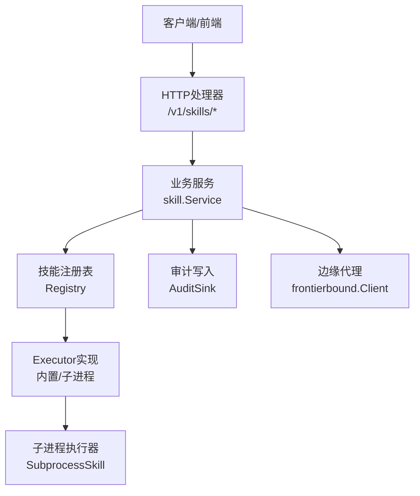
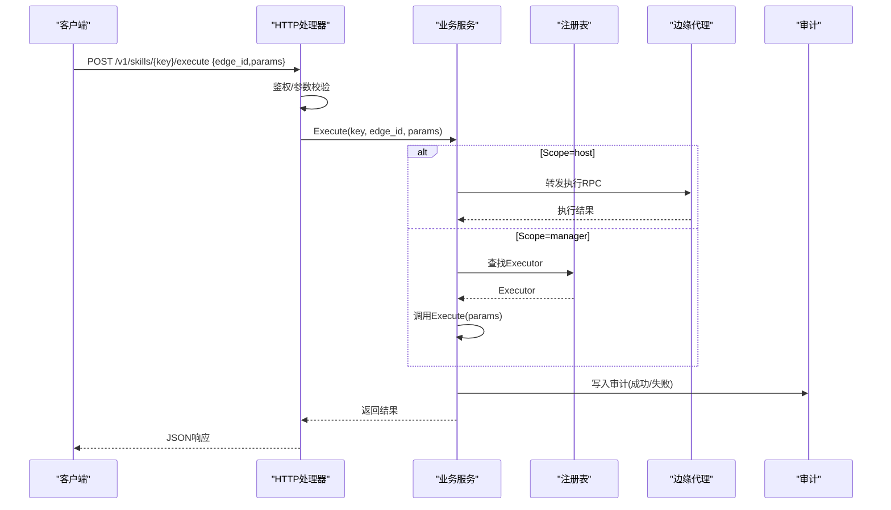
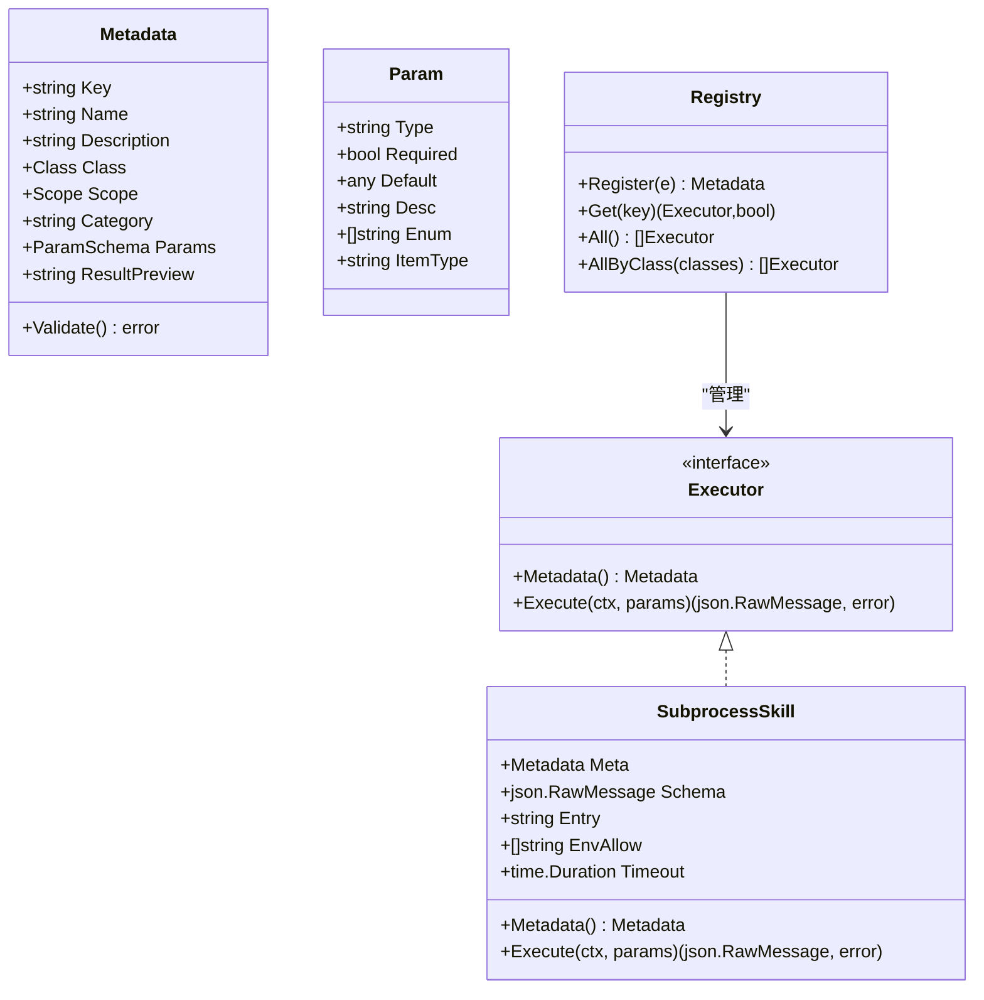
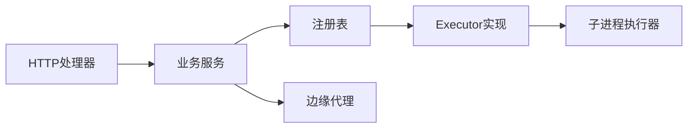

# 技能管理API

<cite>
**本文引用的文件**
- [internal/manager/server/skill/http.go](file://internal/manager/server/skill/http.go)
- [internal/manager/biz/skill/service.go](file://internal/manager/biz/skill/service.go)
- [internal/manager/biz/skill/audit.go](file://internal/manager/biz/skill/audit.go)
- [internal/skill/types.go](file://internal/skill/types.go)
- [internal/skill/loader.go](file://internal/skill/loader.go)
- [internal/skill/registry.go](file://internal/skill/registry.go)
- [internal/skill/subprocess.go](file://internal/skill/subprocess.go)
- [cmd/ongrid/main.go](file://cmd/ongrid/main.go)
- [web/src/api/skills.ts](file://web/src/api/skills.ts)
</cite>

## 目录
1. [简介](#简介)
2. [项目结构](#项目结构)
3. [核心组件](#核心组件)
4. [架构总览](#架构总览)
5. [详细组件分析](#详细组件分析)
6. [依赖关系分析](#依赖关系分析)
7. [性能与资源限制](#性能与资源限制)
8. [故障排查指南](#故障排查指南)
9. [结论](#结论)
10. [附录：开发集成示例与最佳实践](#附录开发集成示例与最佳实践)

## 简介
本文件为“技能管理”REST API的权威文档，覆盖技能的注册、配置、执行、监控等能力。重点包括：
- HTTP端点定义：URL模式、请求参数、响应格式、状态码
- 技能包管理与外部子进程技能加载
- 权限控制（安全/变更/危险三类）与审计日志
- 沙箱机制、资源隔离与安全限制
- 运维工具：调试、性能分析、错误诊断
- 开发集成示例与最佳实践

## 项目结构
技能框架由“管理器侧HTTP层 + 业务服务 + 技能注册表 + 子进程执行器 + 前端调用封装”组成。关键路径如下：
- HTTP路由与处理器：internal/manager/server/skill/http.go
- 业务服务与审计：internal/manager/biz/skill/service.go, audit.go
- 技能元数据与类型：internal/skill/types.go
- 外部技能包加载：internal/skill/loader.go
- 全局注册表：internal/skill/registry.go
- 子进程执行器：internal/skill/subprocess.go
- 启动装配与依赖注入：cmd/ongrid/main.go
- 前端API封装：web/src/api/skills.ts

图表来源
- [internal/manager/server/skill/http.go:1-163](file://internal/manager/server/skill/http.go#L1-L163)
- [internal/manager/biz/skill/service.go](file://internal/manager/biz/skill/service.go)
- [internal/skill/registry.go:1-127](file://internal/skill/registry.go#L1-L127)
- [internal/skill/subprocess.go:1-268](file://internal/skill/subprocess.go#L1-L268)
- [cmd/ongrid/main.go:1885-1894](file://cmd/ongrid/main.go#L1885-L1894)

章节来源
- [internal/manager/server/skill/http.go:1-163](file://internal/manager/server/skill/http.go#L1-L163)
- [cmd/ongrid/main.go:1885-1894](file://cmd/ongrid/main.go#L1885-L1894)

## 核心组件
- HTTP处理器：提供技能列表、详情、执行三个端点；统一鉴权与错误编码
- 业务服务：校验参数、权限类检查、调度到边缘或本地执行、记录审计
- 注册表：进程级技能目录，支持按权限类过滤
- 子进程执行器：以独立进程运行外部可执行，严格白名单环境变量与超时
- 前端封装：构造请求体并调用后端接口

章节来源
- [internal/manager/server/skill/http.go:1-163](file://internal/manager/server/skill/http.go#L1-L163)
- [internal/skill/registry.go:1-127](file://internal/skill/registry.go#L1-L127)
- [internal/skill/subprocess.go:1-268](file://internal/skill/subprocess.go#L1-L268)
- [web/src/api/skills.ts:282-306](file://web/src/api/skills.ts#L282-L306)

## 架构总览
下图展示一次“执行技能”的端到端流程：前端发起POST请求，HTTP处理器解析并鉴权，业务服务根据Scope决定在管理器或边缘执行，最终返回结果并写入审计。

图表来源
- [internal/manager/server/skill/http.go:41-111](file://internal/manager/server/skill/http.go#L41-L111)
- [internal/manager/biz/skill/service.go](file://internal/manager/biz/skill/service.go)
- [internal/skill/registry.go:31-74](file://internal/skill/registry.go#L31-L74)
- [cmd/ongrid/main.go:1885-1894](file://cmd/ongrid/main.go#L1885-L1894)

## 详细组件分析

### REST API：技能目录与执行
- 列出技能
  - URL: GET /v1/skills
  - 查询参数: category（可选）
  - 成功响应: { items: SkillSummary[], total: number }
  - 状态码: 200
- 获取技能详情
  - URL: GET /v1/skills/{key}
  - 成功响应: SkillSummary对象
  - 状态码: 200
- 执行技能
  - URL: POST /v1/skills/{key}/execute
  - 请求体: { edge_id?: number, params?: object }
    - 当Scope=host时，edge_id必填；Scope=manager时可省略
  - 成功响应: 执行结果JSON（由具体技能定义）
  - 状态码: 200/400/401/403/404/5xx

错误响应格式
- { error: string, code: string }
- code取值: unauthorized / forbidden / not-found / invalid / internal

鉴权与租户上下文
- 所有端点需通过JWT鉴权中间件
- 从上下文中提取用户ID与角色用于权限判定

章节来源
- [internal/manager/server/skill/http.go:41-111](file://internal/manager/server/skill/http.go#L41-L111)
- [internal/manager/server/skill/http.go:121-155](file://internal/manager/server/skill/http.go#L121-L155)

### 权限控制与分类
- 权限类
  - safe：只读无副作用
  - mutating：可逆修改
  - dangerous：不可逆或集群影响
- 作用域
  - host：在目标边缘执行，需要edge_id
  - manager：在管理器进程内执行，无需edge_id
- 策略
  - 基础框架仅标记Class；具体审批/签名/SOP策略在业务层实施

章节来源
- [internal/skill/types.go:35-61](file://internal/skill/types.go#L35-L61)
- [internal/skill/types.go:100-125](file://internal/skill/types.go#L100-L125)

### 技能包管理与外部子进程技能
- 外部技能包清单
  - 文件: skill.json（位于允许目录树中）
  - 字段: name/description/schema/entry/env_allow/timeout_seconds/class/category
- 加载规则
  - Loader扫描配置的白名单目录，递归发现skill.json
  - 校验name/key合法性、描述非空、入口绝对路径且位于允许根下
  - 重复Key跳过而非崩溃
- 执行约束
  - 默认超时30秒
  - 环境变量白名单注入（默认不继承PATH）
  - stdout/stderr大小上限，避免内存膨胀

章节来源
- [internal/skill/loader.go:13-53](file://internal/skill/loader.go#L13-L53)
- [internal/skill/loader.go:69-110](file://internal/skill/loader.go#L69-L110)
- [internal/skill/loader.go:176-254](file://internal/skill/loader.go#L176-L254)
- [internal/skill/subprocess.go:17-78](file://internal/skill/subprocess.go#L17-L78)
- [internal/skill/subprocess.go:112-172](file://internal/skill/subprocess.go#L112-L172)

### 执行流程与数据结构
- 元数据Metadata
  - key/name/description/class/scope/category/params/result_preview
- 参数Schema
  - ParamSchema声明式类型：string/int/float/bool/duration/enum/array
  - 支持RawSchemaProvider自定义JSON Schema
- 执行器Executor
  - Metadata()与Execute(ctx, params)两个方法

图表来源
- [internal/skill/types.go:63-125](file://internal/skill/types.go#L63-L125)
- [internal/skill/types.go:190-203](file://internal/skill/types.go#L190-L203)
- [internal/skill/subprocess.go:43-78](file://internal/skill/subprocess.go#L43-L78)
- [internal/skill/registry.go:21-74](file://internal/skill/registry.go#L21-L74)

章节来源
- [internal/skill/types.go:63-125](file://internal/skill/types.go#L63-L125)
- [internal/skill/types.go:190-203](file://internal/skill/types.go#L190-L203)
- [internal/skill/registry.go:1-127](file://internal/skill/registry.go#L1-L127)
- [internal/skill/subprocess.go:1-268](file://internal/skill/subprocess.go#L1-L268)

### 审计日志
- 审计落库：每次执行（成功/失败）均写入数据库表skill_executions
- 内容包含：调用者、技能key、scope、edge_id、入参摘要、结果摘要、耗时、错误信息
- 用途：合规审计、问题回溯、指标统计

章节来源
- [cmd/ongrid/main.go:1885-1894](file://cmd/ongrid/main.go#L1885-L1894)
- [internal/manager/biz/skill/audit.go](file://internal/manager/biz/skill/audit.go)

### 前端集成
- 前端API封装负责构造请求体，并在Scope=host时携带device_id/edge_id
- 提供本地化技能摘要显示

章节来源
- [web/src/api/skills.ts:282-306](file://web/src/api/skills.ts#L282-L306)

## 依赖关系分析
- HTTP处理器依赖业务服务，业务服务依赖注册表与边缘代理
- 子进程执行器作为Executor的一种实现，受Loader与注册表管理
- 启动阶段完成服务装配与路由注册

图表来源
- [internal/manager/server/skill/http.go:41-111](file://internal/manager/server/skill/http.go#L41-L111)
- [internal/skill/registry.go:31-74](file://internal/skill/registry.go#L31-L74)
- [internal/skill/subprocess.go:112-172](file://internal/skill/subprocess.go#L112-L172)

章节来源
- [internal/manager/server/skill/http.go:1-163](file://internal/manager/server/skill/http.go#L1-L163)
- [internal/skill/registry.go:1-127](file://internal/skill/registry.go#L1-L127)
- [internal/skill/subprocess.go:1-268](file://internal/skill/subprocess.go#L1-L268)

## 性能与资源限制
- 子进程输出限制
  - stdout最大16 MiB
  - stderr保留尾部4 KiB用于诊断
- 超时控制
  - 默认30秒，可在manifest中指定timeout_seconds
- 环境变量最小化
  - 仅白名单变量注入，默认不继承PATH
- 内存保护
  - cappedWriter防止异常输出撑爆内存

章节来源
- [internal/skill/subprocess.go:17-28](file://internal/skill/subprocess.go#L17-L28)
- [internal/skill/subprocess.go:213-238](file://internal/skill/subprocess.go#L213-L238)
- [internal/skill/loader.go:230-234](file://internal/skill/loader.go#L230-L234)

## 故障排查指南
- 常见错误码
  - unauthorized：未认证
  - forbidden：无权限
  - not-found：技能不存在
  - invalid：参数不合法或JSON无效
  - internal：内部错误
- 定位步骤
  - 查看审计记录skill_executions中的错误信息与stderr尾段
  - 确认技能Class与Scope是否匹配当前调用方权限
  - 检查外部技能manifest的entry路径是否在允许根目录下
  - 验证环境变量白名单是否包含所需密钥
- 调试建议
  - 使用GET /v1/skills与GET /v1/skills/{key}核对元数据
  - 对子进程技能，先手动执行entry脚本并观察stdout/stderr
  - 关注超时与输出大小限制

章节来源
- [internal/manager/server/skill/http.go:135-155](file://internal/manager/server/skill/http.go#L135-L155)
- [internal/skill/loader.go:176-254](file://internal/skill/loader.go#L176-L254)
- [internal/skill/subprocess.go:112-172](file://internal/skill/subprocess.go#L112-L172)

## 结论
技能管理API以统一的HTTP接口暴露技能目录与执行能力，结合严格的权限分类、作用域控制与审计追踪，形成可扩展、可观测、可治理的技能生态。外部子进程技能通过清单与白名单机制安全接入，配合资源限制与超时控制保障系统稳定性。

## 附录：开发集成示例与最佳实践

### 快速开始（前端）
- 列举技能：GET /v1/skills?category=network
- 获取详情：GET /v1/skills/probe_http
- 执行技能（host作用域）：POST /v1/skills/probe_http/execute { edge_id, params }

章节来源
- [web/src/api/skills.ts:295-306](file://web/src/api/skills.ts#L295-L306)
- [internal/manager/server/skill/http.go:41-111](file://internal/manager/server/skill/http.go#L41-L111)

### 编写外部子进程技能
- 目录结构
  - 在允许的目录树下放置skill.json与可执行entry
- manifest关键字段
  - name：lower_snake键名
  - description：面向人类与LLM的描述
  - entry：相对或绝对路径（必须落在允许根下）
  - env_allow：按需注入的环境变量名
  - timeout_seconds：执行超时
  - class：safe/mutating/dangerous
- 输入输出约定
  - stdin：JSON参数对象
  - stdout：JSON结果对象
  - 非零退出码视为错误，stderr会被截断保留

章节来源
- [internal/skill/loader.go:13-53](file://internal/skill/loader.go#L13-L53)
- [internal/skill/loader.go:176-254](file://internal/skill/loader.go#L176-L254)
- [internal/skill/subprocess.go:112-172](file://internal/skill/subprocess.go#L112-L172)

### 权限与审批建议
- 将只读探测类技能标记为safe
- 可逆修改标记为mutating，必要时引入人工审批
- 破坏性操作标记为dangerous，结合SOP与双重审批

章节来源
- [internal/skill/types.go:35-61](file://internal/skill/types.go#L35-L61)

### 监控与审计
- 通过skill_executions表进行事后审计与指标统计
- 结合系统健康与日志平台进行可视化

章节来源
- [cmd/ongrid/main.go:1885-1894](file://cmd/ongrid/main.go#L1885-L1894)
- [internal/manager/biz/skill/audit.go](file://internal/manager/biz/skill/audit.go)