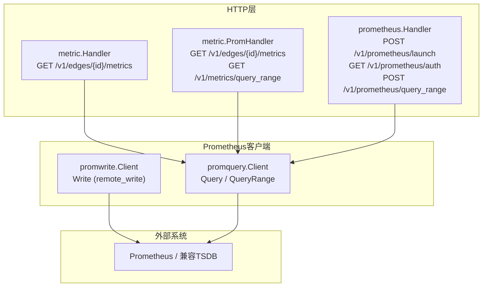
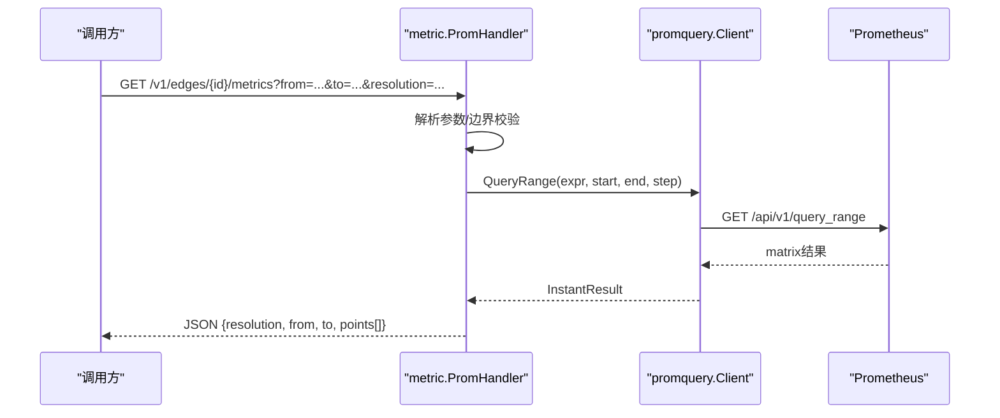
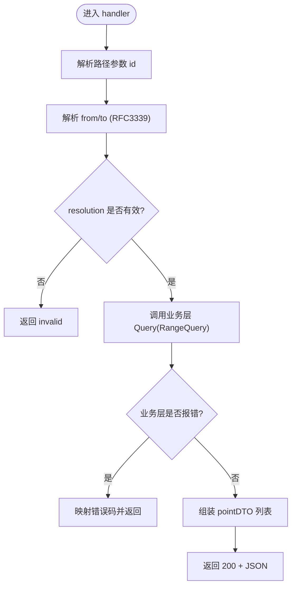
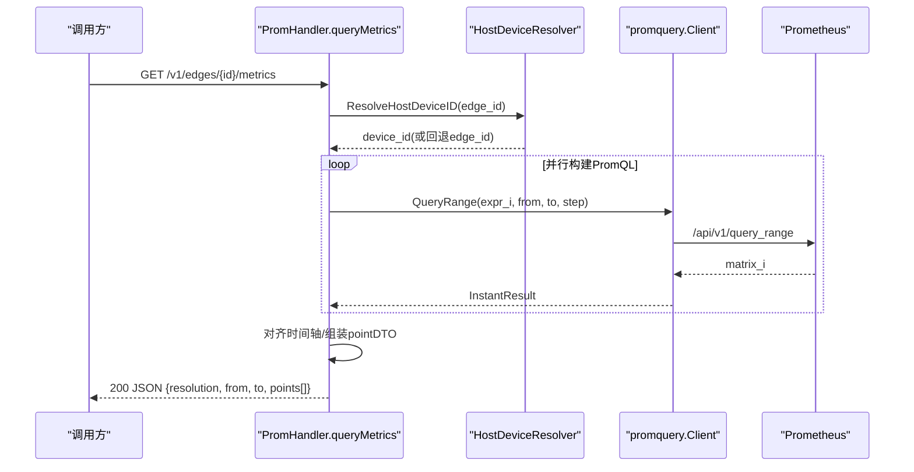
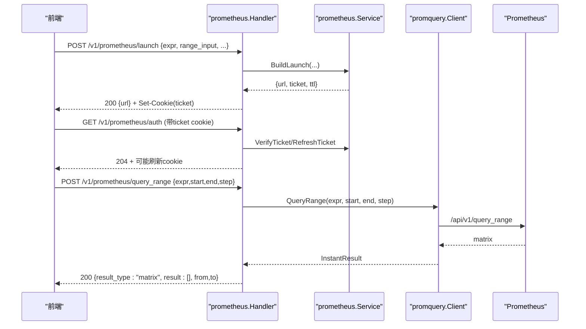

# 指标数据API

<cite>
**本文引用的文件**
- [internal/manager/server/metric/http.go](file://internal/manager/server/metric/http.go)
- [internal/manager/server/metric/prom_handler.go](file://internal/manager/server/metric/prom_handler.go)
- [internal/manager/server/prometheus/http.go](file://internal/manager/server/prometheus/http.go)
- [internal/pkg/promwrite/client.go](file://internal/pkg/promwrite/client.go)
- [internal/pkg/promquery/client.go](file://internal/pkg/promquery/client.go)
- [api/manager/metric/v1/metric.proto](file://api/manager/metric/v1/metric.proto)
- [cmd/ongrid/main.go](file://cmd/ongrid/main.go)
- [internal/manager/data/metric/store/provider.go](file://internal/manager/data/metric/store/provider.go)
</cite>

## 目录
1. [简介](#简介)
2. [项目结构](#项目结构)
3. [核心组件](#核心组件)
4. [架构总览](#架构总览)
5. [详细组件分析](#详细组件分析)
6. [依赖关系分析](#依赖关系分析)
7. [性能与优化](#性能与优化)
8. [故障排查指南](#故障排查指南)
9. [结论](#结论)
10. [附录：接口清单与示例](#附录接口清单与示例)

## 简介
本文件为“指标数据”相关REST API的权威文档，覆盖以下能力：
- 指标写入（Prometheus remote_write兼容）
- 指标查询（边缘设备时序点聚合查询、通用PromQL范围查询）
- Prometheus兼容接口（认证票据、受控查询透传）
- 标签模型与后端存储说明
- 数据保留策略与降采样规则
- 并发处理、缓存机制与性能调优建议
- 完整请求/响应格式、状态码与使用示例

## 项目结构
与指标数据API相关的代码主要分布在以下模块：
- HTTP路由与处理器：metric子域与prometheus子域
- Prometheus客户端：写端remote_write、读端query/query_range
- gRPC服务定义：MetricService（仅读取主机指标，写入走edge tunnel + Ingester）
- 启动装配：云侧Prometheus开关与解析器注入



图表来源
- [internal/manager/server/metric/http.go:39-41](file://internal/manager/server/metric/http.go#L39-L41)
- [internal/manager/server/metric/prom_handler.go:71-74](file://internal/manager/server/metric/prom_handler.go#L71-L74)
- [internal/manager/server/prometheus/http.go:56-63](file://internal/manager/server/prometheus/http.go#L56-L63)
- [internal/pkg/promquery/client.go:94-117](file://internal/pkg/promquery/client.go#L94-L117)
- [internal/pkg/promwrite/client.go:126-176](file://internal/pkg/promwrite/client.go#L126-L176)

章节来源
- [internal/manager/server/metric/http.go:1-43](file://internal/manager/server/metric/http.go#L1-L43)
- [internal/manager/server/metric/prom_handler.go:1-74](file://internal/manager/server/metric/prom_handler.go#L1-L74)
- [internal/manager/server/prometheus/http.go:1-63](file://internal/manager/server/prometheus/http.go#L1-L63)
- [internal/pkg/promquery/client.go:1-82](file://internal/pkg/promquery/client.go#L1-L82)
- [internal/pkg/promwrite/client.go:1-117](file://internal/pkg/promwrite/client.go#L1-L117)

## 核心组件
- metric.HTTP处理器：提供面向UI的标准化时序点查询接口，返回统一pointDTO形状。
- metric.PromHandler：基于PromQL实现高性能范围查询，支持通用query_range透传。
- prometheus.Handler：提供Prometheus兼容的认证票据与受控查询透传。
- promwrite.Client：Prometheus remote_write兼容写入客户端。
- promquery.Client：Prometheus query/query_range兼容查询客户端。
- MetricService(gRPC)：仅用于读取主机指标；写入路径由edge tunnel push_host_metrics + Ingester处理。

章节来源
- [internal/manager/server/metric/http.go:19-41](file://internal/manager/server/metric/http.go#L19-L41)
- [internal/manager/server/metric/prom_handler.go:25-74](file://internal/manager/server/metric/prom_handler.go#L25-L74)
- [internal/manager/server/prometheus/http.go:28-63](file://internal/manager/server/prometheus/http.go#L28-L63)
- [internal/pkg/promwrite/client.go:42-117](file://internal/pkg/promwrite/client.go#L42-L117)
- [internal/pkg/promquery/client.go:35-82](file://internal/pkg/promquery/client.go#L35-L82)
- [api/manager/metric/v1/metric.proto:9-17](file://api/manager/metric/v1/metric.proto#L9-L17)

## 架构总览
整体数据流分为两条主线：
- 写入：Edge采集 → 通过tunnel推送 → manager Ingester → promwrite.Client → Prometheus remote_write
- 读取：前端/工具 → Manager HTTP → PromHandler/prometheus.Handler → promquery.Client → Prometheus query_range



图表来源
- [internal/manager/server/metric/prom_handler.go:76-226](file://internal/manager/server/metric/prom_handler.go#L76-L226)
- [internal/pkg/promquery/client.go:104-117](file://internal/pkg/promquery/client.go#L104-L117)

章节来源
- [internal/manager/server/metric/prom_handler.go:71-226](file://internal/manager/server/metric/prom_handler.go#L71-L226)
- [internal/pkg/promquery/client.go:94-117](file://internal/pkg/promquery/client.go#L94-L117)

## 详细组件分析

### 组件A：metric.HTTP处理器（标准化时序点查询）
- 路由：GET /v1/edges/{id}/metrics
- 查询参数：
  - id：路径参数，正整数
  - from/to：RFC3339时间戳
  - resolution：auto|raw|5m|1h（默认auto）
- 响应体：包含resolution、from、to、points[]；每个pointDTO字段见下节
- 错误码：invalid、not-found、unauthorized、forbidden、edge-offline、not-wired-yet、internal



图表来源
- [internal/manager/server/metric/http.go:85-126](file://internal/manager/server/metric/http.go#L85-L126)
- [internal/manager/server/metric/http.go:226-257](file://internal/manager/server/metric/http.go#L226-L257)

章节来源
- [internal/manager/server/metric/http.go:34-41](file://internal/manager/server/metric/http.go#L34-L41)
- [internal/manager/server/metric/http.go:43-82](file://internal/manager/server/metric/http.go#L43-L82)
- [internal/manager/server/metric/http.go:85-126](file://internal/manager/server/metric/http.go#L85-L126)
- [internal/manager/server/metric/http.go:226-257](file://internal/manager/server/metric/http.go#L226-L257)

### 组件B：metric.PromHandler（PromQL驱动的高性能查询）
- 路由：
  - GET /v1/edges/{id}/metrics（PromQL实现）
  - GET /v1/metrics/query_range（通用PromQL范围查询透传）
- 关键行为：
  - 自动将edge_id解析为device_id（若可用），以匹配Prom中实际标签
  - 并发执行多个PromQL表达式，合并时间轴后生成统一pointDTO
  - 对query_range进行长度限制与step校验，透传matrix结果
- 错误码：invalid、not-wired-yet、internal等



图表来源
- [internal/manager/server/metric/prom_handler.go:76-226](file://internal/manager/server/metric/prom_handler.go#L76-L226)
- [internal/pkg/promquery/client.go:104-117](file://internal/pkg/promquery/client.go#L104-L117)

章节来源
- [internal/manager/server/metric/prom_handler.go:71-74](file://internal/manager/server/metric/prom_handler.go#L71-L74)
- [internal/manager/server/metric/prom_handler.go:76-226](file://internal/manager/server/metric/prom_handler.go#L76-L226)
- [internal/manager/server/metric/prom_handler.go:298-393](file://internal/manager/server/metric/prom_handler.go#L298-L393)

### 组件C：prometheus.Handler（Prometheus兼容接口）
- 路由：
  - POST /v1/prometheus/launch：签发临时访问票据，返回可访问的Prometheus URL
  - GET /v1/prometheus/auth：验证并刷新票据（滑动过期）
  - POST /v1/prometheus/query_range：受控的PromQL范围查询透传
- 安全：
  - launch需登录上下文；auth校验cookie；query_range需租户上下文
  - 表达式长度上限4KB，step必须为正数
- 响应：透传Prom矩阵结果，result_type固定为matrix



图表来源
- [internal/manager/server/prometheus/http.go:56-63](file://internal/manager/server/prometheus/http.go#L56-L63)
- [internal/manager/server/prometheus/http.go:76-107](file://internal/manager/server/prometheus/http.go#L76-L107)
- [internal/manager/server/prometheus/http.go:109-137](file://internal/manager/server/prometheus/http.go#L109-L137)
- [internal/manager/server/prometheus/http.go:166-243](file://internal/manager/server/prometheus/http.go#L166-L243)
- [internal/pkg/promquery/client.go:104-117](file://internal/pkg/promquery/client.go#L104-L117)

章节来源
- [internal/manager/server/prometheus/http.go:56-63](file://internal/manager/server/prometheus/http.go#L56-L63)
- [internal/manager/server/prometheus/http.go:76-107](file://internal/manager/server/prometheus/http.go#L76-L107)
- [internal/manager/server/prometheus/http.go:109-137](file://internal/manager/server/prometheus/http.go#L109-L137)
- [internal/manager/server/prometheus/http.go:166-243](file://internal/manager/server/prometheus/http.go#L166-L243)

### 组件D：指标写入（Prometheus remote_write兼容）
- 协议：application/x-protobuf + snappy压缩，X-Prometheus-Remote-Write-Version: 0.1.0
- 端点：由EndpointResolver动态解析，默认追加/api/v1/write
- 语义：每个Sample作为独立TimeSeries发送；空样本切片直接返回成功
- 超时：默认10s单次HTTP往返

章节来源
- [internal/pkg/promwrite/client.go:126-176](file://internal/pkg/promwrite/client.go#L126-L176)
- [internal/pkg/promwrite/client.go:80-117](file://internal/pkg/promwrite/client.go#L80-L117)

### 组件E：gRPC MetricService（仅读取）
- 服务：MetricService.QueryHostMetrics
- 粒度：RESOLUTION_AUTO/RAW/M5/H1，按窗口选择表
- 写入：不通过此service，由edge tunnel push_host_metrics + Ingester处理

章节来源
- [api/manager/metric/v1/metric.proto:9-17](file://api/manager/metric/v1/metric.proto#L9-L17)
- [api/manager/metric/v1/metric.proto:19-26](file://api/manager/metric/v1/metric.proto#L19-L26)

## 依赖关系分析
- HTTP层依赖：
  - metric.Handler → biz/metric（旧MySQL路径，已注释）
  - metric.PromHandler → promquery.Client + HostDeviceResolver
  - prometheus.Handler → promquery.Client + prometheus.Service
- 外部依赖：
  - promquery.Client → Prometheus /api/v1/query_range
  - promwrite.Client → Prometheus /api/v1/write
- 启动装配：
  - cmd/ongrid根据配置启用Prometheus功能，注入解析器与客户端

```mermaid
classDiagram
class MetricHandler {
+Register(router)
+queryMetrics(w,r)
}
class PromHandler {
+Register(router)
+queryMetrics(w,r)
+queryRange(w,r)
}
class PrometheusHandler {
+RegisterProtected(router)
+RegisterPublic(router)
+launch(w,r)
+auth(w,r)
+queryRange(w,r)
}
class PromQueryClient {
+Query(expr, ts)
+QueryRange(expr, start, end, step)
}
class PromWriteClient {
+Write(samples)
}
PromHandler --> PromQueryClient : "并发多表达式查询"
PrometheusHandler --> PromQueryClient : "受控透传"
MetricHandler ..> BizReader : "旧路径(已注释)"
PromWriteClient --> "Prometheus remote_write" : "POST /api/v1/write"
PromQueryClient --> "Prometheus query_range" : "GET /api/v1/query_range"
```

图表来源
- [internal/manager/server/metric/http.go:39-41](file://internal/manager/server/metric/http.go#L39-L41)
- [internal/manager/server/metric/prom_handler.go:71-74](file://internal/manager/server/metric/prom_handler.go#L71-L74)
- [internal/manager/server/prometheus/http.go:56-63](file://internal/manager/server/prometheus/http.go#L56-L63)
- [internal/pkg/promquery/client.go:94-117](file://internal/pkg/promquery/client.go#L94-L117)
- [internal/pkg/promwrite/client.go:126-176](file://internal/pkg/promwrite/client.go#L126-L176)

章节来源
- [cmd/ongrid/main.go:1067-1087](file://cmd/ongrid/main.go#L1067-L1087)
- [internal/manager/data/metric/store/provider.go:9-16](file://internal/manager/data/metric/store/provider.go#L9-L16)

## 性能与优化
- 并发查询：PromHandler对多个PromQL表达式并发执行，减少端到端延迟。
- 步长控制：resolution/step在合理范围内（≥5s且≤24h），避免过大查询集。
- 表达式长度限制：4KB上限，防止恶意或误用导致Prom过载。
- 超时保护：PromHandler与prometheus.Handler均设置30s上下文超时，避免挂起。
- 连接池与监控：Manager暴露HTTP请求计数与时延直方图、数据库连接池指标，便于容量规划。
- 标签模型：Prom侧使用device_id标签，避免跨边泄漏；当解析失败时回退edge_id以保证兼容性。
- 缓存机制：Prom客户端每次请求重新解析URL，配合上层~5s TTL缓存，兼顾热更新与稳定性。

章节来源
- [internal/manager/server/metric/prom_handler.go:162-177](file://internal/manager/server/metric/prom_handler.go#L162-L177)
- [internal/manager/server/metric/prom_handler.go:309-312](file://internal/manager/server/metric/prom_handler.go#L309-L312)
- [internal/manager/server/prometheus/http.go:219-222](file://internal/manager/server/prometheus/http.go#L219-L222)
- [internal/pkg/promquery/client.go:43-45](file://internal/pkg/promquery/client.go#L43-L45)
- [internal/pkg/promwrite/client.go:50-54](file://internal/pkg/promwrite/client.go#L50-L54)
- [internal/manager/server/metric/prom_handler.go:114-130](file://internal/manager/server/metric/prom_handler.go#L114-L130)
- [cmd/ongrid/main.go:1076-1083](file://cmd/ongrid/main.go#L1076-L1083)

## 故障排查指南
- 常见错误码与含义：
  - invalid：参数非法（如from/to格式错误、step<=0、expr为空或过长）
  - unauthorized：未登录或缺少必要上下文
  - forbidden：无权限访问
  - not-wired-yet：Prometheus未启用或未正确配置
  - internal：内部错误
- 诊断要点：
  - 检查Prometheus连通性与鉴权配置
  - 确认edge_id到device_id的映射是否存在
  - 关注PromHandler并发查询中的单系列失败（非致命，缺失点以null渲染）
  - 查看Manager自身指标（HTTP请求量、耗时、DB池等待计数）定位瓶颈

章节来源
- [internal/manager/server/metric/http.go:226-257](file://internal/manager/server/metric/http.go#L226-L257)
- [internal/manager/server/prometheus/http.go:266-288](file://internal/manager/server/prometheus/http.go#L266-L288)
- [internal/manager/server/metric/prom_handler.go:182-188](file://internal/manager/server/metric/prom_handler.go#L182-L188)

## 结论
本API体系围绕Prometheus生态构建，提供统一的指标写入与查询入口。通过PromHandler与prometheus.Handler的组合，既满足UI友好型时序点查询，又开放受控的PromQL能力。写入采用remote_write标准协议，确保与现有生态无缝集成。结合并发、限长、超时与监控，可在高吞吐场景下稳定运行。

## 附录：接口清单与示例

### 接口清单
- 指标查询（标准化）
  - GET /v1/edges/{id}/metrics
    - 参数：from(to RFC3339), to(RFC3339), resolution(auto|raw|5m|1h)
    - 响应：{resolution, from, to, points[]}
    - 状态码：200/400/401/403/404/503/500
- 指标查询（PromQL）
  - GET /v1/metrics/query_range
    - 参数：expr(PromQL), start/end(RFC3339), step(Go duration)
    - 响应：{resolution, from, to, matrix}
    - 状态码：200/400/503/500
- Prometheus兼容
  - POST /v1/prometheus/launch
    - 请求体：{expr, range_input, end_input, step_input}
    - 响应：{url} + Set-Cookie(ticket)
    - 状态码：200/401/400/500
  - GET /v1/prometheus/auth
    - Cookie：ongrid_prom_ticket
    - 响应：204（可能刷新cookie）
    - 状态码：204/401
  - POST /v1/prometheus/query_range
    - 请求体：{expr, start, end, step}
    - 响应：{result_type:"matrix", result:[], from, to}
    - 状态码：200/400/401/503/500
- 指标写入（remote_write）
  - POST {endpoint}/api/v1/write
    - 头部：Content-Type: application/x-protobuf; Content-Encoding: snappy; X-Prometheus-Remote-Write-Version: 0.1.0
    - 请求体：snappy压缩后的protobuf序列
    - 状态码：200/204成功；其他视为失败

### 请求/响应字段说明
- 标准化查询响应pointDTO字段：
  - ts：时间点
  - cpu.mem.load1/load5/load15.disk_used_pct：对象{avg?, max?}（原始采样avg==max）
  - net_rx_bps/net_tx_bps：可选uint64（缺失时为null）
- 通用query_range响应：
  - resolution：步长时间字符串
  - from/to：RFC3339
  - matrix：Prom原生矩阵数组

### 使用示例
- 标准化查询
  - GET /v1/edges/123/metrics?from=2024-01-01T00:00:00Z&to=2024-01-01T01:00:00Z&resolution=5m
- 通用PromQL查询
  - GET /v1/metrics/query_range?expr=node_cpu_seconds_total%7Bmode%3D%22idle%22%7D&start=2024-01-01T00:00:00Z&end=2024-01-01T01:00:00Z&step=5m
- Prometheus兼容流程
  - 先POST /v1/prometheus/launch获取url与cookie
  - 再GET /v1/prometheus/auth刷新票据
  - 最后POST /v1/prometheus/query_range执行查询

### 标签模型与数据保留
- 标签模型：Prom侧使用device_id标签；当无法解析时回退edge_id
- 数据保留与降采样：
  - 原始采样：约10s间隔
  - 5分钟聚合：M5
  - 1小时聚合：H1
  - AUTO策略：≤6h→RAW；≤7d→M5；>7d→H1

章节来源
- [internal/manager/server/metric/prom_handler.go:114-130](file://internal/manager/server/metric/prom_handler.go#L114-L130)
- [api/manager/metric/v1/metric.proto:19-26](file://api/manager/metric/v1/metric.proto#L19-L26)