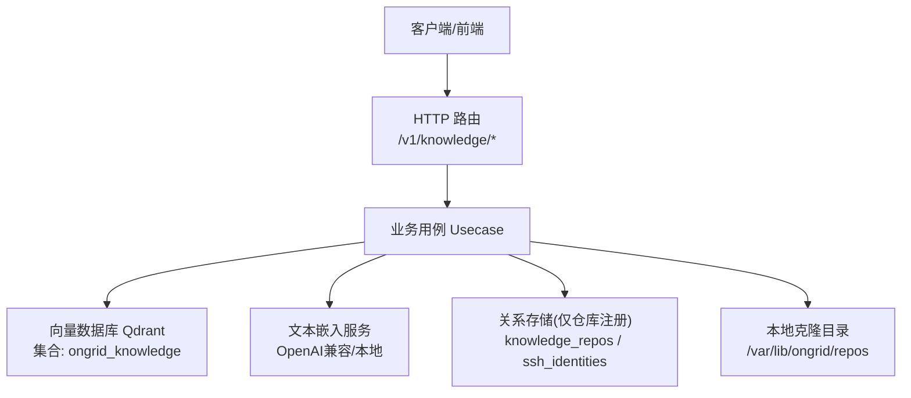
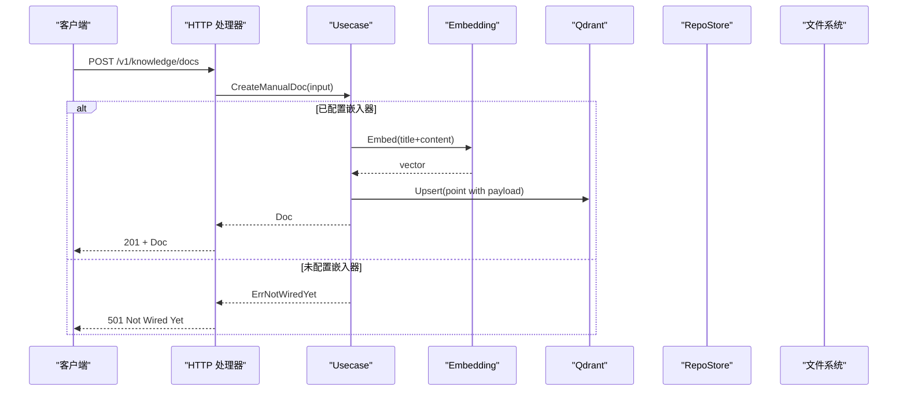
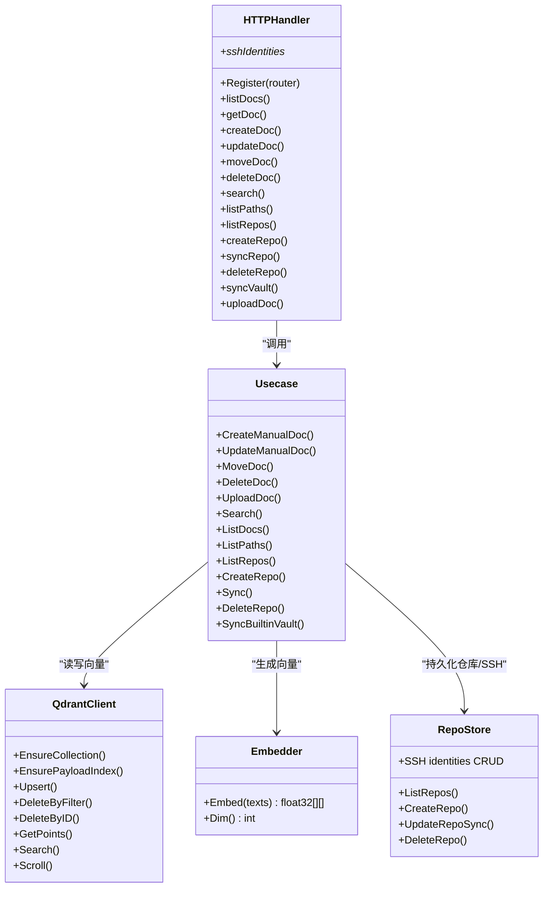

# 知识库API

<cite>
**本文引用的文件**
- [internal/manager/server/knowledge/http.go](file://internal/manager/server/knowledge/http.go)
- [internal/manager/biz/knowledge/usecase.go](file://internal/manager/biz/knowledge/usecase.go)
- [internal/manager/model/knowledge/model.go](file://internal/manager/model/knowledge/model.go)
- [web/src/api/knowledge.ts](file://web/src/api/knowledge.ts)
- [cmd/ongrid/main.go](file://cmd/ongrid/main.go)
</cite>

## 目录
1. [简介](#简介)
2. [项目结构](#项目结构)
3. [核心组件](#核心组件)
4. [架构总览](#架构总览)
5. [详细接口说明](#详细接口说明)
6. [依赖分析](#依赖分析)
7. [性能与实现要点](#性能与实现要点)
8. [故障排查指南](#故障排查指南)
9. [结论](#结论)
10. [附录：示例与安全配置](#附录示例与安全配置)

## 简介
本文件为“知识库管理”REST API的权威参考，覆盖知识文档的上传、编辑、搜索、版本（同步）管理、代码仓库集成、SSH密钥绑定等能力。同时阐述语义检索、路径/标签过滤、内置知识库同步等企业级特性，并给出向量索引、全文检索、缓存策略等技术实现说明及完整调用示例与安全配置建议。

## 项目结构
知识库功能位于后端 Manager 服务中，采用分层设计：
- HTTP 层：路由注册、鉴权中间件、请求/响应 DTO 转换、审计事件注入
- 业务层：文档生命周期、仓库同步、嵌入生成、去重与分页、搜索过滤
- 数据模型：仓库注册、SSH 身份、文档元信息
- 前端 SDK：TypeScript 客户端封装，统一参数序列化与错误处理
- 启动装配：嵌入器、Qdrant 客户端、默认集合与负载索引初始化

图表来源
- [internal/manager/server/knowledge/http.go:110-137](file://internal/manager/server/knowledge/http.go#L110-L137)
- [internal/manager/biz/knowledge/usecase.go:121-167](file://internal/manager/biz/knowledge/usecase.go#L121-L167)
- [cmd/ongrid/main.go:1354-1415](file://cmd/ongrid/main.go#L1354-L1415)

章节来源
- [internal/manager/server/knowledge/http.go:1-137](file://internal/manager/server/knowledge/http.go#L1-L137)
- [internal/manager/biz/knowledge/usecase.go:1-167](file://internal/manager/biz/knowledge/usecase.go#L1-L167)
- [cmd/ongrid/main.go:1354-1415](file://cmd/ongrid/main.go#L1354-L1415)

## 核心组件
- HTTP Handler
  - 负责路由注册、参数解析、DTO 映射、错误码映射、审计事件写入
  - 支持可选的基于对象的写权限中间件（如 knowledge:doc/write）
- 业务用例 Usecase
  - 文档 CRUD、上传分块、路径归一化、标签去重、列表去重、搜索过滤
  - 仓库同步（git clone/pull）、内置知识库同步（云端或嵌入式快照）
  - SSH 身份管理与匹配（用于私有仓库访问）
- 数据模型
  - Repository：仓库注册表
  - SSHIdentity：SSH 私钥、公钥、指纹、主机白名单、known_hosts
  - Doc：文档元信息（标题、内容、路径、标签、时间戳等）
- 前端 SDK
  - TypeScript 函数封装所有端点，统一参数序列化、错误提示、类型定义

章节来源
- [internal/manager/server/knowledge/http.go:42-137](file://internal/manager/server/knowledge/http.go#L42-L137)
- [internal/manager/biz/knowledge/usecase.go:169-800](file://internal/manager/biz/knowledge/usecase.go#L169-L800)
- [internal/manager/model/knowledge/model.go:40-162](file://internal/manager/model/knowledge/model.go#L40-L162)
- [web/src/api/knowledge.ts:62-247](file://web/src/api/knowledge.ts#L62-L247)

## 架构总览
知识库系统以 Qdrant 作为唯一的内容载体（向量+payload），MySQL/SQLite 仅保存仓库注册与 SSH 身份信息。文档通过手动创建、组织上传、仓库同步、内置知识库同步四种方式进入系统；搜索时先对查询进行嵌入，再在 Qdrant 执行带过滤条件的相似度检索。

图表来源
- [internal/manager/server/knowledge/http.go:267-286](file://internal/manager/server/knowledge/http.go#L267-L286)
- [internal/manager/biz/knowledge/usecase.go:184-217](file://internal/manager/biz/knowledge/usecase.go#L184-L217)
- [cmd/ongrid/main.go:1379-1415](file://cmd/ongrid/main.go#L1379-L1415)

## 详细接口说明
以下所有路径均以 /api/v1 为前缀（由网关/反向代理统一转发）。所有变更操作均受认证与可选 RBAC 中间件保护。

### 通用约定
- 成功响应体多为 { items, total } 或直接返回对象
- 错误响应为字符串消息，状态码遵循 REST 惯例
- ID 字段在 JSON 中以字符串形式传输，避免 JS Number 精度丢失

#### 文档管理
- GET /api/v1/knowledge/docs
  - 查询参数：source_type、repo_id、path、path_prefix、tag、limit
  - 响应：{ items: Doc[], total: number }
- GET /api/v1/knowledge/docs/{id}
  - 响应：Doc（包含 content）
- POST /api/v1/knowledge/docs
  - 请求体：{ title, title_en?, content, url?, path?, tags[]? }
  - 响应：Doc（201 Created）
- PATCH /api/v1/knowledge/docs/{id}
  - 请求体：{ title, title_en?, content, path?, tags[]? }
  - 响应：Doc（200 OK）
- PATCH /api/v1/knowledge/docs/{id}/move
  - 请求体：{ path }
  - 响应：Doc（不含 content，200 OK）
- DELETE /api/v1/knowledge/docs/{id}
  - 响应：204 No Content
- POST /api/v1/knowledge/upload
  - 表单字段：file（multipart）、title?、path?、tags?（逗号分隔）
  - 支持 .md/.txt/.pdf/.docx（PDF/DOCX 会提取纯文本）
  - 单文件大小上限：8 MiB
  - 响应：Doc（201 Created）
- GET /api/v1/knowledge/search
  - 查询参数：q、limit（1..50）、path、path_prefix、tag（可重复）
  - 响应：{ items: [{ doc: Doc, score: number }], total: number }
- GET /api/v1/knowledge/paths
  - 响应：{ items: [{ path, count }], total: number }

章节来源
- [internal/manager/server/knowledge/http.go:110-137](file://internal/manager/server/knowledge/http.go#L110-L137)
- [internal/manager/server/knowledge/http.go:214-475](file://internal/manager/server/knowledge/http.go#L214-L475)
- [web/src/api/knowledge.ts:62-132](file://web/src/api/knowledge.ts#L62-L132)

#### 代码仓库管理
- GET /api/v1/knowledge/repos
  - 响应：{ items: Repo[], total: number }
- POST /api/v1/knowledge/repos
  - 请求体：{ url, branch?, description? }
  - 响应：Repo（201 Created）
- POST /api/v1/knowledge/repos/{id}/sync
  - 触发 git clone/pull + 文件遍历 + 嵌入入库
  - 响应：Repo（200 OK）
- DELETE /api/v1/knowledge/repos/{id}
  - 响应：204 No Content

章节来源
- [internal/manager/server/knowledge/http.go:477-583](file://internal/manager/server/knowledge/http.go#L477-L583)
- [web/src/api/knowledge.ts:134-192](file://web/src/api/knowledge.ts#L134-L192)

#### 内置知识库同步
- POST /api/v1/knowledge/vault/sync
  - 从云端仓库或嵌入式快照同步平台内置知识库到 Qdrant
  - 响应：{ file_count: number, source: "cloud"|"embedded", synced_at: string }

章节来源
- [internal/manager/server/knowledge/http.go:544-564](file://internal/manager/server/knowledge/http.go#L544-L564)
- [web/src/api/knowledge.ts:146-157](file://web/src/api/knowledge.ts#L146-L157)

#### SSH 身份管理
- GET /api/v1/knowledge/ssh-identities
  - 响应：{ items: SSHIdentity[], total: number }
- POST /api/v1/knowledge/ssh-identities
  - 请求体：{ name, private_key, hosts[], known_hosts? }
  - 响应：SSHIdentity（不包含私钥）
- POST /api/v1/knowledge/ssh-identities/generate
  - 请求体：{ name, hosts[], known_hosts? }
  - 服务端生成 ed25519 密钥对，返回公钥与指纹
  - 响应：SSHIdentity
- PATCH /api/v1/knowledge/ssh-identities/{id}
  - 请求体：{ name, hosts[], known_hosts }
  - 响应：SSHIdentity
- DELETE /api/v1/knowledge/ssh-identities/{id}
  - 响应：204 No Content

章节来源
- [internal/manager/server/knowledge/http.go:129-137](file://internal/manager/server/knowledge/http.go#L129-L137)
- [web/src/api/knowledge.ts:194-247](file://web/src/api/knowledge.ts#L194-L247)

#### 数据模型与字段说明
- Doc
  - id（string）、source_type（manual|repo|url|vault|upload）、repo_id（string|null）、url、title、title_en、content、path、tags[]、created_at、updated_at
- Repo
  - id、url、branch、description、last_synced_at、last_sync_error、file_count、is_builtin、created_at、updated_at
- SSHIdentity
  - id、name、public_key、fingerprint、hosts[]、known_hosts、last_used_at、created_at、updated_at

章节来源
- [internal/manager/model/knowledge/model.go:40-162](file://internal/manager/model/knowledge/model.go#L40-L162)
- [web/src/api/knowledge.ts:10-56](file://web/src/api/knowledge.ts#L10-L56)

## 依赖分析
- HTTP 层依赖
  - 业务 Service 接口（ListDocs/GetDoc/CreateManualDoc/UpdateManualDoc/MoveDoc/UploadDoc/DeleteDoc/Search/ListPaths/Repos/Sync/VaultSync/SSHIdentities）
  - 可选 Casbin 风格鉴权中间件（write/delete 动作）
  - 审计中间件（SetAuditEvent）
- 业务层依赖
  - QdrantClient（集合/索引/插入/删除/滚动/搜索）
  - Embedding 提供者（OpenAI 兼容）
  - RepoStore（仓库注册与 SSH 身份持久化）
  - 文件系统（git clone/pull 工作目录）
- 启动装配
  - 初始化 Qdrant 集合与负载索引
  - 根据环境变量选择嵌入器与维度
  - 可选后台任务：内置知识库种子同步

图表来源
- [internal/manager/server/knowledge/http.go:42-137](file://internal/manager/server/knowledge/http.go#L42-L137)
- [internal/manager/biz/knowledge/usecase.go:121-167](file://internal/manager/biz/knowledge/usecase.go#L121-L167)
- [internal/manager/biz/knowledge/usecase.go:463-501](file://internal/manager/biz/knowledge/usecase.go#L463-L501)

章节来源
- [internal/manager/server/knowledge/http.go:42-137](file://internal/manager/server/knowledge/http.go#L42-L137)
- [internal/manager/biz/knowledge/usecase.go:121-167](file://internal/manager/biz/knowledge/usecase.go#L121-L167)

## 性能与实现要点
- 向量索引与负载索引
  - 集合名固定为 ongrid_knowledge
  - 自动确保 source_type、repo_id、path、path_prefixes、tags 等字段的 keyword 索引，提升过滤效率
- 列表与搜索的分页与去重
  - ListDocs 使用 Scroll 扫描并按 id_alias 去重，优先 head chunk，限制逻辑文档数量
  - Search 过取 top-K×5（上限 200）后按 parent_url/url/id 去重，保证最终 limit 条结果
- 上传与分块
  - 上传文件被切分为多个片段，每个片段独立嵌入与 upsert；首次片段拼接标题以提升相关性
  - 重新上传或更新上传文档时，先按 (source_type=upload, url) 清理旧片段，再全量重建
- 路径与标签
  - Path 规范化：去除首尾斜杠、合并连续斜杠、空串表示根
  - Tags 规范化：去空白、去重、保持首次出现顺序
- 内置知识库
  - 支持云端仓库同步与嵌入式快照回退；不占用用户可见的 Repos 列表
- 并发与资源
  - 单次上传大小限制 8 MiB，避免内存与嵌入成本过高
  - 批量嵌入与 upsert 使用批大小 32，平衡吞吐与延迟

章节来源
- [internal/manager/biz/knowledge/usecase.go:121-167](file://internal/manager/biz/knowledge/usecase.go#L121-L167)
- [internal/manager/biz/knowledge/usecase.go:275-318](file://internal/manager/biz/knowledge/usecase.go#L275-L318)
- [internal/manager/biz/knowledge/usecase.go:463-501](file://internal/manager/biz/knowledge/usecase.go#L463-L501)
- [internal/manager/biz/knowledge/usecase.go:732-800](file://internal/manager/biz/knowledge/usecase.go#L732-L800)
- [internal/manager/server/knowledge/http.go:288-353](file://internal/manager/server/knowledge/http.go#L288-L353)

## 故障排查指南
- 常见状态码
  - 200/201/204：正常
  - 400：参数无效（例如缺失必填字段、不支持的文件类型、超过大小限制）
  - 404：文档不存在
  - 500：服务器内部错误
  - 501：未配置嵌入器（写/搜索路径需要）
- 典型问题定位
  - 无法创建/更新/搜索：检查是否配置了嵌入器（API Key/BaseURL/Model/Dim）
  - 上传失败：确认文件格式与大小；PDF/DOCX 需含文本层
  - 仓库同步失败：检查 SSH 身份或网络可达性；查看 last_sync_error
  - 搜索结果异常：确认 path/path_prefix/tags 过滤条件是否正确
- 日志与审计
  - 关键写操作（创建/同步/删除仓库）会记录审计事件，便于追踪

章节来源
- [internal/manager/server/knowledge/http.go:602-611](file://internal/manager/server/knowledge/http.go#L602-L611)
- [internal/manager/server/knowledge/http.go:511-583](file://internal/manager/server/knowledge/http.go#L511-L583)
- [internal/manager/biz/knowledge/usecase.go:184-217](file://internal/manager/biz/knowledge/usecase.go#L184-L217)

## 结论
知识库 API 提供了完整的文档生命周期管理、多源聚合（手动/上传/仓库/内置）、语义检索与企业级特性（RBAC、审计、SSH 身份）。通过 Qdrant 向量索引与关键字负载索引的组合，兼顾召回质量与过滤精度。建议在生产环境启用嵌入器与 Qdrant，合理设置 limit 与过滤条件以获得最佳体验。

## 附录：示例与安全配置

### 调用示例（curl）
- 创建文档
  - curl -X POST /api/v1/knowledge/docs -H "Content-Type: application/json" -d '{"title":"...","content":"..."}'
- 上传文件
  - curl -X POST /api/v1/knowledge/upload -F "file=@doc.md" -F "tags=a,b"
- 搜索
  - curl "/api/v1/knowledge/search?q=...&limit=10&path_prefix=网络/"
- 同步仓库
  - curl -X POST /api/v1/knowledge/repos/123/sync
- 同步内置知识库
  - curl -X POST /api/v1/knowledge/vault/sync

### 安全配置建议
- 嵌入器配置
  - 环境变量：ONGRID_EMBEDDING_API_KEY、ONGRID_EMBEDDING_BASE_URL、ONGRID_EMBEDDING_MODEL、ONGRID_EMBEDDING_DIM、ONGRID_EMBEDDING_PROVIDER
- Qdrant 连接
  - 环境变量：ONGRID_QDRANT_URL（默认 http://qdrant:6333）
- 仓库克隆目录
  - 环境变量：ONGRID_KNOWLEDGE_REPO_DIR（默认 /var/lib/ongrid/repos）
- 内置知识库种子
  - 环境变量：ONGRID_BUILTIN_VAULT_SEED（off/- 关闭）
- 鉴权与授权
  - 所有写/删操作受认证与可选 RBAC 中间件保护（knowledge:doc/write、knowledge:repo/write 等）
- 审计
  - 仓库相关写操作自动记录审计事件（ActionRepoCreate/Sync/Delete）

章节来源
- [cmd/ongrid/main.go:1354-1415](file://cmd/ongrid/main.go#L1354-L1415)
- [internal/manager/server/knowledge/http.go:93-107](file://internal/manager/server/knowledge/http.go#L93-L107)
- [internal/manager/server/knowledge/http.go:511-583](file://internal/manager/server/knowledge/http.go#L511-L583)