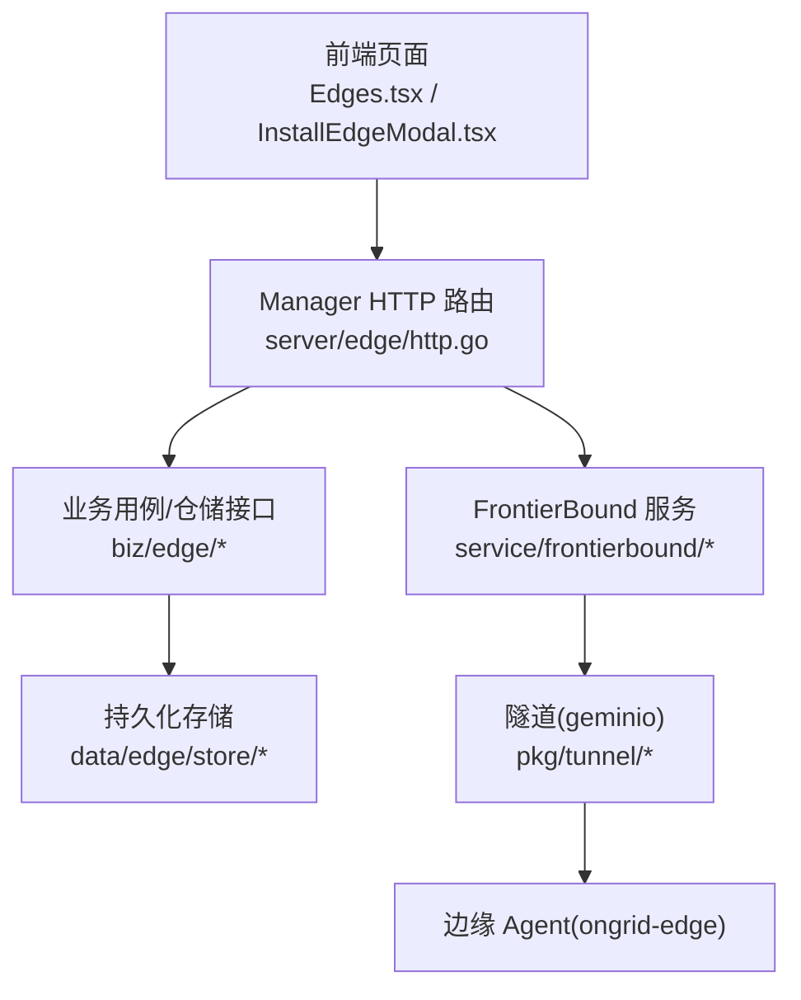
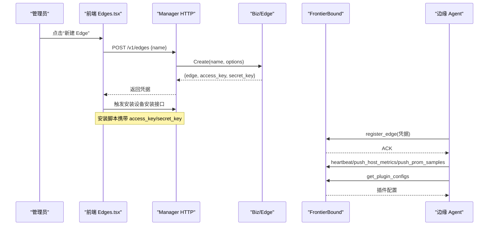
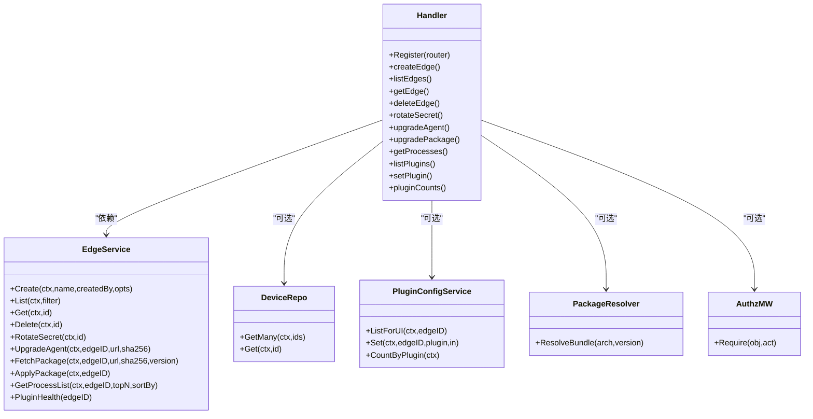

# 边缘节点API

<cite>
**本文引用的文件**
- [api/manager/edge/v1/edge.proto](file://api/manager/edge/v1/edge.proto)
- [internal/manager/server/edge/http.go](file://internal/manager/server/edge/http.go)
- [internal/manager/biz/edge/repo.go](file://internal/manager/biz/edge/repo.go)
- [cmd/ongrid/main.go](file://cmd/ongrid/main.go)
- [web/src/pages/Edges.tsx](file://web/src/pages/Edges.tsx)
- [web/src/components/InstallEdgeModal.tsx](file://web/src/components/InstallEdgeModal.tsx)
- [internal/manager/service/frontierbound/handlers.go](file://internal/manager/service/frontierbound/handlers.go)
- [internal/pkg/auth/middleware.go](file://internal/pkg/auth/middleware.go)
- [internal/pkg/auth/jwt.go](file://internal/pkg/auth/jwt.go)
- [internal/pkg/tunnel/types.go](file://internal/pkg/tunnel/types.go)
</cite>

## 目录
1. [简介](#简介)
2. [项目结构](#项目结构)
3. [核心组件](#核心组件)
4. [架构总览](#架构总览)
5. [详细接口说明](#详细接口说明)
6. [依赖关系分析](#依赖关系分析)
7. [性能与扩展性](#性能与扩展性)
8. [故障排查指南](#故障排查指南)
9. [结论](#结论)
10. [附录：集成示例与安全通信](#附录：集成示例与安全通信)

## 简介
本文件面向“边缘节点管理”的 REST API，覆盖以下能力：
- 节点注册、配置管理、健康检查、升级操作
- 安装包生成（整包升级）、插件配置同步、心跳检测
- 生命周期管理、资源监控、远程执行
- 批量操作、故障转移、负载均衡等高级特性说明
- 认证机制、安全通信协议与数据同步策略
- 完整集成示例与故障排查指南

说明：
- 控制面 Manager 提供 HTTP 路由；边缘 Agent 通过隧道（geminio）上报心跳、指标与插件状态。
- 所有公开 API 以 proto 为契约来源，REST 由手写 handler 实现。

## 项目结构
- API 契约定义位于 api/manager/edge/v1/edge.proto，定义了 EdgeService 的 RPC 消息类型与字段语义。
- Manager 侧 HTTP 路由在 internal/manager/server/edge/http.go 中注册，包含节点 CRUD、升级、进程列表、插件配置等端点。
- 业务层仓储接口在 internal/manager/biz/edge/repo.go 中定义，用于持久化 edge 记录与状态。
- 启动装配在 cmd/ongrid/main.go 中完成，包括 edge 处理器、权限中间件、bundle 解析器、frontierbound 服务安装等。
- 前端页面 web/src/pages/Edges.tsx 与 InstallEdgeModal.tsx 演示了创建节点、一键整包升级、触发 agent 升级等交互。

图表来源
- [internal/manager/server/edge/http.go:141-163](file://internal/manager/server/edge/http.go#L141-L163)
- [cmd/ongrid/main.go:793-808](file://cmd/ongrid/main.go#L793-L808)
- [internal/manager/service/frontierbound/handlers.go](file://internal/manager/service/frontierbound/handlers.go)
- [internal/pkg/tunnel/types.go](file://internal/pkg/tunnel/types.go)

章节来源
- [api/manager/edge/v1/edge.proto:1-121](file://api/manager/edge/v1/edge.proto#L1-L121)
- [internal/manager/server/edge/http.go:141-163](file://internal/manager/server/edge/http.go#L141-L163)
- [internal/manager/biz/edge/repo.go:40-62](file://internal/manager/biz/edge/repo.go#L40-L62)
- [cmd/ongrid/main.go:793-808](file://cmd/ongrid/main.go#L793-L808)

## 核心组件
- HTTP 处理器（server/edge/http.go）
  - 负责注册与管理 /v1/edges 系列路由，含创建、列表、详情、删除、密钥轮换、agent 升级、整包升级、进程列表、插件配置等。
  - 支持可选的包解析器（PackageResolver），用于整包升级时自动选择已烘焙的 bundle。
  - 支持可选的 Casbin 授权中间件，未注入时回退到管理员角色校验。
- 业务仓储接口（biz/edge/repo.go）
  - 定义 edge 的创建、查询、更新（状态、名称、设备关联、版本等）接口。
- 前端交互（web/src/pages/Edges.tsx, InstallEdgeModal.tsx）
  - 展示节点列表、在线状态、主机信息、插件启用情况，并提供一键整包升级与手动 URL+sha 升级入口。
  - 一键安装流程先调用创建节点接口获取凭据，再拼接安装命令并通过设备安装接口下发。

章节来源
- [internal/manager/server/edge/http.go:141-163](file://internal/manager/server/edge/http.go#L141-L163)
- [internal/manager/biz/edge/repo.go:40-62](file://internal/manager/biz/edge/repo.go#L40-L62)
- [web/src/pages/Edges.tsx:263-298](file://web/src/pages/Edges.tsx#L263-L298)
- [web/src/components/InstallEdgeModal.tsx:57-88](file://web/src/components/InstallEdgeModal.tsx#L57-L88)

## 架构总览
- 认证与租户上下文
  - 全局鉴权中间件从 JWT claims 填充 tenantctx，路由层据此进行角色或 RBAC 判断。
- 边缘节点生命周期
  - 创建节点 → 下发安装命令 → Agent 启动并 register_edge → 心跳与指标上报 → 插件配置推送 → 升级阶段（fetch_package + apply_package）。
- 插件配置同步
  - 通过 frontierbound 将变更实时推送到受影响的 edge。

图表来源
- [internal/manager/server/edge/http.go:141-163](file://internal/manager/server/edge/http.go#L141-L163)
- [cmd/ongrid/main.go:1189-1223](file://cmd/ongrid/main.go#L1189-L1223)
- [internal/manager/service/frontierbound/handlers.go](file://internal/manager/service/frontierbound/handlers.go)

## 详细接口说明

### 通用约定
- 基础路径：/api/v1
- 内容类型：application/json
- 错误响应体统一格式：{ "error": "...", "code": "..." }
- 鉴权：请求需携带有效 JWT，tenantctx 由中间件填充；写操作默认需要管理员或具备 edge:* 写权限。

章节来源
- [internal/manager/server/edge/http.go:304-319](file://internal/manager/server/edge/http.go#L304-L319)
- [internal/manager/server/edge/http.go:748-762](file://internal/manager/server/edge/http.go#L748-L762)

### 节点管理

#### 创建节点
- 方法路径：POST /api/v1/edges
- 权限：管理员或 edge:* 写
- 请求体
  - name: string（必填）
  - device_id: uint64（可选，立即关联设备）
  - task_name: string（可选，直接写入任务名）
- 响应体
  - id: uint64
  - name: string
  - access_key_id: string
  - secret_key: string（仅此次明文返回）
  - created_at: timestamp
- 状态码
  - 201 Created
  - 400 Bad Request（参数非法）
  - 401 Unauthorized（未登录）
  - 403 Forbidden（无权限）

章节来源
- [internal/manager/server/edge/http.go:396-430](file://internal/manager/server/edge/http.go#L396-L430)
- [internal/manager/server/edge/http.go:323-340](file://internal/manager/server/edge/http.go#L323-L340)

#### 列出节点
- 方法路径：GET /api/v1/edges
- 权限：任意已登录用户
- 查询参数
  - status: string（online/offline/all）
  - name: string（精准匹配）
  - hostname: string（精准匹配）
  - ip: string（精准匹配）
  - device_id: uint64（精准匹配）
  - limit: int（分页限制）
  - offset: int（分页偏移）
- 响应体
  - items: array（每项包含 id/name/status/roles/last_seen_at/access_key_id/agent_version/device_id/host_info）
  - total: int
- 状态码
  - 200 OK
  - 401 Unauthorized

章节来源
- [internal/manager/server/edge/http.go:432-492](file://internal/manager/server/edge/http.go#L432-L492)
- [internal/manager/server/edge/http.go:355-374](file://internal/manager/server/edge/http.go#L355-L374)

#### 获取节点详情
- 方法路径：GET /api/v1/edges/{id}
- 权限：任意已登录用户
- 路径参数
  - id: uint64
- 响应体
  - id/name/status/roles/access_key_id/last_seen_at/created_at/updated_at/agent_version/device_id/host_info
- 状态码
  - 200 OK
  - 401 Unauthorized
  - 404 Not Found

章节来源
- [internal/manager/server/edge/http.go:494-523](file://internal/manager/server/edge/http.go#L494-L523)

#### 删除节点
- 方法路径：DELETE /api/v1/edges/{id}
- 权限：管理员或 edge:* 删除
- 路径参数
  - id: uint64
- 响应体：无
- 状态码
  - 204 No Content
  - 401/403/404

章节来源
- [internal/manager/server/edge/http.go:525-536](file://internal/manager/server/edge/http.go#L525-L536)

#### 轮换密钥
- 方法路径：POST /api/v1/edges/{id}/rotate-secret
- 权限：管理员或 edge:* 写
- 路径参数
  - id: uint64
- 响应体
  - secret_key: string（新密钥，仅此次明文返回）
- 状态码
  - 200 OK
  - 401/403/404

章节来源
- [internal/manager/server/edge/http.go:538-550](file://internal/manager/server/edge/http.go#L538-L550)

### 节点升级

#### 触发 Agent 升级（URL+SHA）
- 方法路径：POST /api/v1/edges/{id}/upgrade
- 权限：管理员或 edge:* 写
- 请求体
  - url: string（二进制下载地址）
  - sha256: string（校验和）
- 响应体
  - staged_path: string（暂存路径）
  - bytes: int64（字节数）
- 状态码
  - 200 OK
  - 400 Bad Request（参数缺失或非法）
  - 401/403/404

章节来源
- [internal/manager/server/edge/http.go:566-590](file://internal/manager/server/edge/http.go#L566-L590)

#### 一键整包升级（内置 Bundle）
- 方法路径：POST /api/v1/edges/{id}/upgrade-package
- 权限：管理员或 edge:* 写
- 请求体（可选）
  - arch: string（如 linux-amd64，缺省使用 linux-amd64）
  - version: string（缺省使用 manager 当前版本）
- 行为
  - 若未配置包解析器，返回 503（降级为手动 URL+sha 模式）
  - 内部顺序执行 fetch_package（stage + verify）与 apply_package（信号退出）
- 响应体
  - version: string
  - staged_path: string
  - bytes: int64
  - manifest_files: int
  - applied: bool
  - apply_error: string（当 apply 失败时）
- 状态码
  - 200 OK（applied=true）
  - 202 Accepted（staged 成功但 apply 失败）
  - 503 Service Unavailable（未配置包解析器）
  - 400/401/403/404

章节来源
- [internal/manager/server/edge/http.go:602-669](file://internal/manager/server/edge/http.go#L602-L669)
- [cmd/ongrid/main.go:793-808](file://cmd/ongrid/main.go#L793-L808)

### 资源监控与远程执行

#### 进程列表
- 方法路径：GET /api/v1/edges/{id}/processes
- 权限：任意已登录用户
- 查询参数
  - top_n: uint32（默认 20，范围 1..200）
  - sort_by: string（mem 或 cpu，默认 mem）
- 响应体
  - items: array（pid/name/cmdline/cpu_pct/mem_pct/user）
  - sampled_at: int64
- 状态码
  - 200 OK
  - 401 Unauthorized

章节来源
- [internal/manager/server/edge/http.go:689-726](file://internal/manager/server/edge/http.go#L689-L726)

### 插件配置与同步

#### 列出插件配置与健康
- 方法路径：GET /api/v1/edges/{id}/plugins
- 权限：任意已登录用户
- 响应体
  - items: array（plugin_name/enabled/spec/health）
  - health 包含 state/last_error/restart_count/pid/started_at/updated_at/reported_at/targets[]
- 状态码
  - 200 OK
  - 404 Not Found（插件配置服务未接入）

章节来源
- [internal/manager/server/edge/http.go:167-222](file://internal/manager/server/edge/http.go#L167-L222)

#### 设置插件配置
- 方法路径：PUT /api/v1/edges/{id}/plugins/{name}
- 权限：管理员或 edge:plugin 写
- 请求体
  - spec: object（插件规格）
  - enabled: boolean
- 响应体
  - 返回更新后的行对象（包含 plugin_name/enabled/spec/health）
- 状态码
  - 200 OK
  - 400 Bad Request
  - 404 Not Found（插件配置服务未接入）

章节来源
- [internal/manager/server/edge/http.go:266-288](file://internal/manager/server/edge/http.go#L266-L288)

#### 插件计数（集成卡片）
- 方法路径：GET /api/v1/integrations/plugin-counts
- 权限：任意已登录用户
- 响应体
  - counts: map[string]int64（按插件统计启用数量）
- 状态码
  - 200 OK

章节来源
- [internal/manager/server/edge/http.go:290-302](file://internal/manager/server/edge/http.go#L290-L302)

### 心跳检测与健康
- 心跳与主机信息上报通过 FrontierBound 服务处理，edge 定期上报 heartbeat、push_host_metrics、push_prom_samples 等。
- 插件配置变更通过 get_plugin_configs 拉取或由 manager 主动推送。
- 这些能力不暴露为独立 HTTP 端点，而是通过隧道协议（geminio）实现。

章节来源
- [cmd/ongrid/main.go:1189-1223](file://cmd/ongrid/main.go#L1189-L1223)
- [internal/manager/service/frontierbound/handlers.go](file://internal/manager/service/frontierbound/handlers.go)

### 生命周期管理与安装
- 前端“一键安装”流程：
  - 先调用创建节点接口获取 access_key/secret_key
  - 拼接安装命令（buildInstallCommand）
  - 通过设备安装接口下发执行（POST /api/v1/devices/{id}/install-edge）
- 安装完成后，edge 启动并 register_edge，进入在线状态。

章节来源
- [web/src/components/InstallEdgeModal.tsx:57-88](file://web/src/components/InstallEdgeModal.tsx#L57-L88)
- [web/src/pages/Edges.tsx:263-298](file://web/src/pages/Edges.tsx#L263-L298)

## 依赖关系分析
- HTTP 处理器依赖：
  - EdgeService 接口（Create/List/Get/Delete/RotateSecret/UpgradeAgent/FetchPackage/ApplyPackage/GetProcessList/PluginHealth）
  - DeviceRepo（用于回填 host_info 与 roles）
  - PluginConfigService（插件配置读取与写入）
  - PackageResolver（整包升级时解析 bundle）
  - AuthzMW（可选，Casbin 授权中间件）
- 启动装配：
  - 在 main.go 中构造 edgeHandler，注入 authz、deviceRepo、pluginConfigUC，并可选注入 package resolver。
  - 安装 frontierbound 服务，注册 register_edge、heartbeat、push_*、get_plugin_configs 等方法。

图表来源
- [internal/manager/server/edge/http.go:38-109](file://internal/manager/server/edge/http.go#L38-L109)
- [internal/manager/server/edge/http.go:141-163](file://internal/manager/server/edge/http.go#L141-L163)
- [cmd/ongrid/main.go:793-808](file://cmd/ongrid/main.go#L793-L808)

章节来源
- [internal/manager/server/edge/http.go:38-109](file://internal/manager/server/edge/http.go#L38-L109)
- [cmd/ongrid/main.go:793-808](file://cmd/ongrid/main.go#L793-L808)

## 性能与扩展性
- 列表与详情会批量加载设备信息以减少 N+1 查询。
- 插件健康信息来自内存中的心跳聚合，避免额外 IO。
- 整包升级分两阶段（stage 与 apply），便于失败恢复与重试。
- 建议：
  - 对高频查询增加缓存（如设备角色与主机信息）
  - 对批量升级引入分批与灰度策略
  - 对插件配置推送采用增量与幂等设计

[本节为通用指导，无需代码引用]

## 故障排查指南
- 404 未注册路由
  - 确认 server 层是否注册对应路由（例如 install-edge 接口需在 server/installjob/http.go 注册）。
- 401/403 鉴权失败
  - 检查 JWT 是否有效、tenantctx 是否被填充、角色是否为 admin 或具备相应权限。
- 整包升级 503
  - 确认 manager 镜像内存在 edge-bundle 目录并已注入 PackageResolver。
- 插件配置 404
  - 确认 PluginConfigService 已注入，否则相关路由返回 404。
- 心跳/指标不上报
  - 检查 frontierbound 安装是否成功、broker 可见性与 ACK 是否存在 race。

章节来源
- [internal/manager/server/edge/http.go:167-170](file://internal/manager/server/edge/http.go#L167-L170)
- [internal/manager/server/edge/http.go:266-269](file://internal/manager/server/edge/http.go#L266-L269)
- [internal/manager/server/edge/http.go:608-610](file://internal/manager/server/edge/http.go#L608-L610)
- [cmd/ongrid/main.go:1189-1223](file://cmd/ongrid/main.go#L1189-L1223)

## 结论
本 API 围绕边缘节点的全生命周期展开，涵盖注册、配置、健康、升级、监控与远程执行。通过统一的鉴权与可选的 RBAC 中间件，结合 FrontierBound 的隧道能力，实现了云端与边缘的稳定协作。整包升级与插件配置同步提供了可观测与可控的运维体验。

[本节为总结，无需代码引用]

## 附录：集成示例与安全通信

### 集成示例（端到端）
- 创建节点并安装
  - 调用 POST /api/v1/edges 获取凭据
  - 拼接安装命令并调用设备安装接口下发
  - 等待 edge 上线（last_seen_at 更新）
- 一键整包升级
  - 调用 POST /api/v1/edges/{id}/upgrade-package
  - 根据返回的 applied 字段判断是否成功
- 查看插件健康
  - 调用 GET /api/v1/edges/{id}/plugins 查看运行状态与目标采集项

章节来源
- [web/src/components/InstallEdgeModal.tsx:57-88](file://web/src/components/InstallEdgeModal.tsx#L57-L88)
- [web/src/pages/Edges.tsx:263-298](file://web/src/pages/Edges.tsx#L263-L298)
- [internal/manager/server/edge/http.go:602-669](file://internal/manager/server/edge/http.go#L602-L669)
- [internal/manager/server/edge/http.go:167-222](file://internal/manager/server/edge/http.go#L167-L222)

### 认证机制与安全通信
- 认证
  - 基于 JWT 的鉴权中间件，从 claims 提取租户上下文（tenantctx）。
  - 写操作默认要求管理员或具备 edge:* 写权限；也可通过 Casbin 中间件进行细粒度授权。
- 安全通信
  - 边缘与云端通过 FrontierBound 建立隧道（geminio），register_edge 后开启心跳与指标上报通道。
  - 插件配置通过 get_plugin_configs 拉取，并在变更后由 manager 主动推送。
- 数据同步策略
  - 心跳与指标周期性上报；插件配置变更即时推送；升级过程分 stage 与 apply 两阶段，确保可回滚。

章节来源
- [internal/pkg/auth/middleware.go](file://internal/pkg/auth/middleware.go)
- [internal/pkg/auth/jwt.go](file://internal/pkg/auth/jwt.go)
- [cmd/ongrid/main.go:1189-1223](file://cmd/ongrid/main.go#L1189-L1223)
- [internal/manager/service/frontierbound/handlers.go](file://internal/manager/service/frontierbound/handlers.go)
- [internal/pkg/tunnel/types.go](file://internal/pkg/tunnel/types.go)