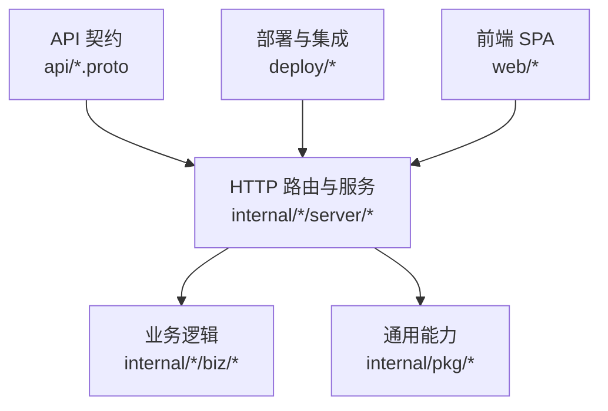
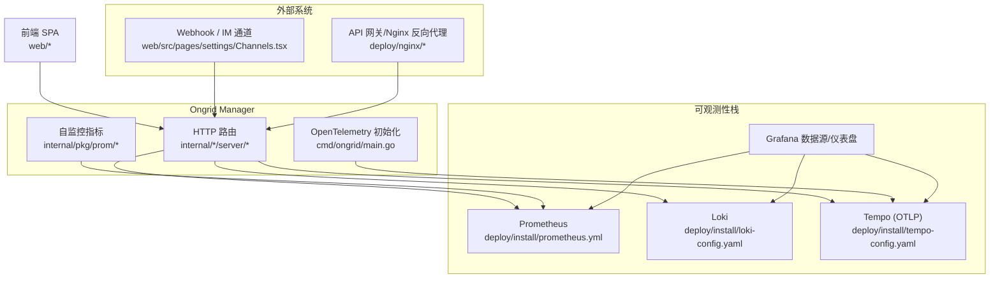
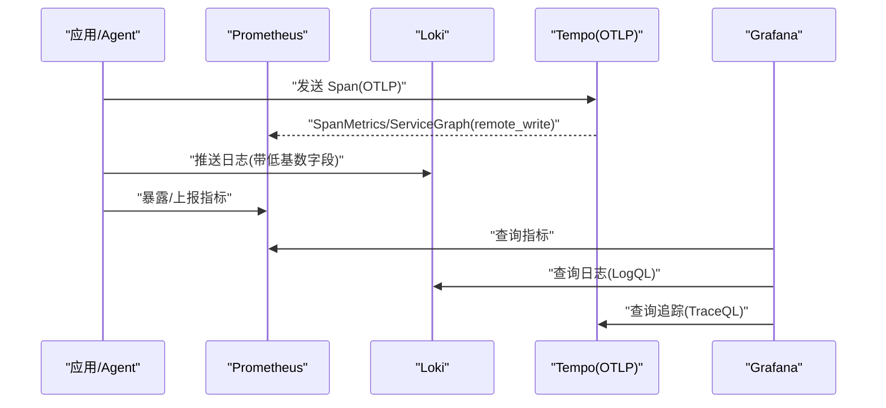
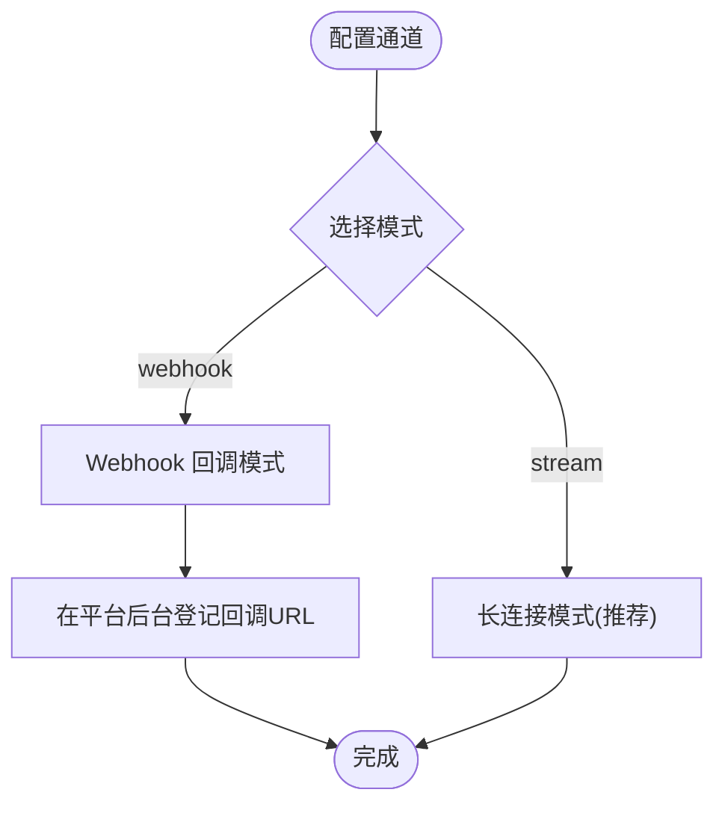
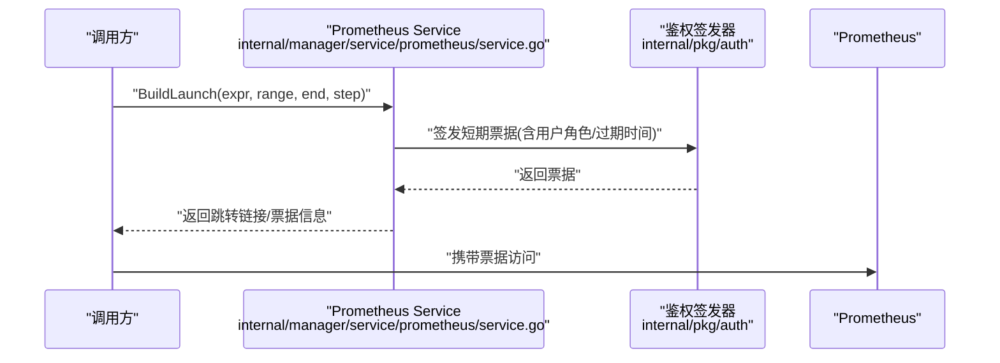
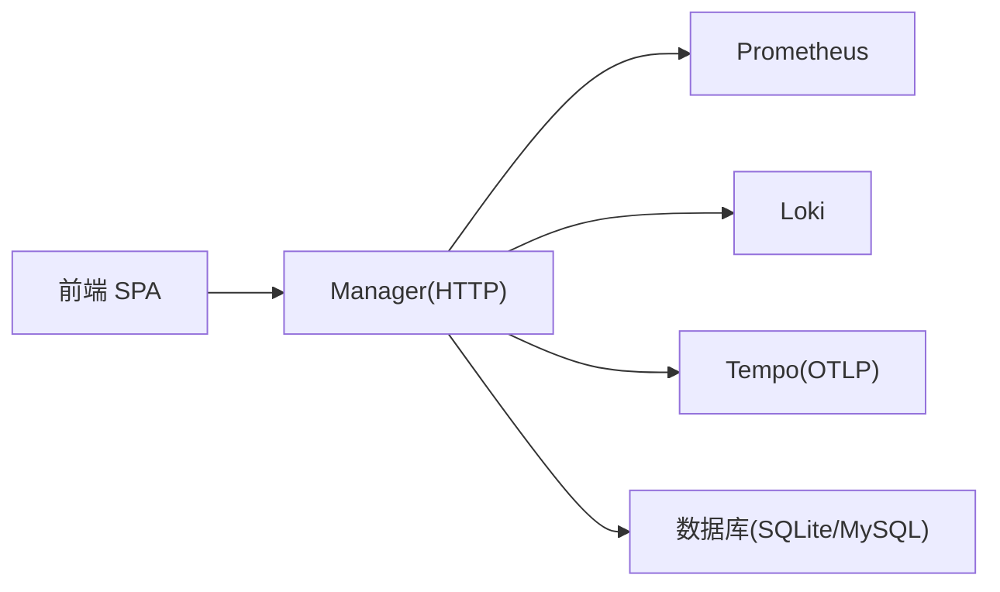

# SDK与集成

<cite>
**本文引用的文件**   
- [README.md](file://README.md)
- [api/README.md](file://api/README.md)
- [cmd/ongrid/main.go](file://cmd/ongrid/main.go)
- [internal/pkg/prom/manager_metrics.go](file://internal/pkg/prom/manager_metrics.go)
- [deploy/install/prometheus.yml](file://deploy/install/prometheus.yml)
- [deploy/install/loki-config.yaml](file://deploy/install/loki-config.yaml)
- [deploy/install/tempo-config.yaml](file://deploy/install/tempo-config.yaml)
- [web/src/pages/settings/Channels.tsx](file://web/src/pages/settings/Channels.tsx)
- [internal/manager/biz/imbridge/sender.go](file://internal/manager/biz/imbridge/sender.go)
- [internal/manager/service/prometheus/service.go](file://internal/manager/service/prometheus/service.go)
</cite>

## 目录
1. [简介](#简介)
2. [项目结构](#项目结构)
3. [核心组件](#核心组件)
4. [架构总览](#架构总览)
5. [详细组件分析](#详细组件分析)
6. [依赖关系分析](#依赖关系分析)
7. [性能考虑](#性能考虑)
8. [故障排查指南](#故障排查指南)
9. [结论](#结论)
10. [附录](#附录)

## 简介
本指南面向系统集成开发者，提供 Ongrid 的 SDK 与集成方案说明。仓库当前以 Go 后端为主，未提供官方 Go/Python/JavaScript 客户端库包；对外 API 通过 REST 路由实现，API 契约由 Protobuf 定义作为单一事实来源。文档将基于源码与部署配置，给出：
- 如何安装与运行（含一键脚本）
- 如何通过 HTTP 接口进行集成（REST）
- 可观测性栈（Prometheus、Loki、Tempo、Grafana）的内置集成方式
- Webhook、消息通道、反向代理与网关的配置要点
- 监控指标、日志收集与分布式追踪的接入方法
- 最佳实践与常见问题排查

## 项目结构
仓库采用“服务+插件”的分层组织：
- api：Protobuf 定义的公共 API 契约（Go 类型生成目标），REST 路由在 internal/*/server 中手写实现
- cmd：主程序入口（ongrid、ongrid-edge）
- internal：业务域（IAM、Manager、EdgeAgent）、通用工具包（prom、tracing、notify 等）
- deploy：容器化与 systemd 安装脚本、Nginx 反向代理示例、可观测性栈配置
- web：前端 SPA（React + TypeScript）

图表来源
- [api/README.md:1-41](file://api/README.md#L1-L41)
- [cmd/ongrid/main.go:158-241](file://cmd/ongrid/main.go#L158-L241)

章节来源
- [api/README.md:1-41](file://api/README.md#L1-L41)
- [cmd/ongrid/main.go:158-241](file://cmd/ongrid/main.go#L158-L241)

## 核心组件
- API 契约与生成
  - 所有公开 API 契约位于 api 目录，使用 buf 管理，Go 代码生成到 api/gen（不提交）。REST 路由在 internal/*/server 中手写实现，不使用 grpc-gateway。
- 主进程启动与可观测性初始化
  - 主入口负责加载配置、注册 Prometheus 自监控指标、初始化 OpenTelemetry 追踪并连接到 Tempo OTLP 接收端点。
- 可观测性栈
  - Prometheus：采集 ongrid-manager 自身指标，支持 remote_write（由 docker-compose 启用）
  - Loki：单节点文件系统后端，限制流基数与保留期，容忍时钟漂移
  - Tempo：OTLP 接收，spanmetrics 与 service-graph 生成器向 Prometheus remote_write
  - Grafana：数据源与仪表盘预置

章节来源
- [api/README.md:1-41](file://api/README.md#L1-L41)
- [cmd/ongrid/main.go:198-241](file://cmd/ongrid/main.go#L198-L241)
- [internal/pkg/prom/manager_metrics.go:1-31](file://internal/pkg/prom/manager_metrics.go#L1-L31)
- [internal/pkg/prom/manager_metrics.go:203-236](file://internal/pkg/prom/manager_metrics.go#L203-L236)
- [deploy/install/prometheus.yml:1-36](file://deploy/install/prometheus.yml#L1-L36)
- [deploy/install/loki-config.yaml:1-67](file://deploy/install/loki-config.yaml#L1-L67)
- [deploy/install/tempo-config.yaml:1-78](file://deploy/install/tempo-config.yaml#L1-L78)

## 架构总览
下图展示 Manager 与可观测性栈、前端及外部通道的交互关系。

图表来源
- [cmd/ongrid/main.go:198-241](file://cmd/ongrid/main.go#L198-L241)
- [internal/pkg/prom/manager_metrics.go:1-31](file://internal/pkg/prom/manager_metrics.go#L1-L31)
- [deploy/install/prometheus.yml:1-36](file://deploy/install/prometheus.yml#L1-L36)
- [deploy/install/loki-config.yaml:1-67](file://deploy/install/loki-config.yaml#L1-L67)
- [deploy/install/tempo-config.yaml:1-78](file://deploy/install/tempo-config.yaml#L1-L78)
- [web/src/pages/settings/Channels.tsx:384-612](file://web/src/pages/settings/Channels.tsx#L384-L612)

## 详细组件分析

### 安装与运行（SDK 获取与安装）
- 二进制安装
  - 提供一键安装脚本，支持 AMD64/ARM64，适用于 Ubuntu 22.04+/Debian 12+/RHEL/Rocky 9。
  - 中国大陆可使用镜像加速下载。
- 容器化与编排
  - 提供 docker-compose 与 systemd 安装脚本，包含 Nginx 反向代理与可观测性栈。
- “SDK”说明
  - 当前仓库未发布 Go/Python/JavaScript 官方客户端包。对外 API 为 REST，建议按 HTTP 协议直接调用。

章节来源
- [README.md:44-73](file://README.md#L44-L73)

### API 契约与调用方式（REST）
- 契约来源
  - 所有公开 API 契约以 Protobuf 定义为准，Go 类型生成后用于手写 REST 路由。
- 调用建议
  - 使用标准 HTTP 客户端发起请求，遵循各服务的 Request/Response 语义。
  - 认证与租户上下文由中间件处理，避免在请求体中携带 org_id。

章节来源
- [api/README.md:1-41](file://api/README.md#L1-L41)

### 连接管理与错误处理
- 连接管理
  - Manager 启动时初始化 OpenTelemetry 追踪，默认指向内部 Tempo OTLP HTTP 端点，可通过环境变量覆盖。
  - Prometheus 自监控指标在启动时注册，供外部采集。
- 错误处理
  - 统一错误码与包装（如无效参数、冲突、未就绪等），便于上层映射为 HTTP 状态码。
  - 对时序数据写入（如 Loki）有容错策略（例如时间戳宽容度），避免时钟漂移导致失败。

章节来源
- [cmd/ongrid/main.go:198-241](file://cmd/ongrid/main.go#L198-L241)
- [internal/pkg/prom/manager_metrics.go:1-31](file://internal/pkg/prom/manager_metrics.go#L1-L31)
- [deploy/install/loki-config.yaml:31-51](file://deploy/install/loki-config.yaml#L31-L51)

### 可观测性集成（Prometheus/Loki/Tempo/Grafana）
- Prometheus
  - 采集 ongrid-manager 指标，支持远程写入（由编排启用）。
- Loki
  - 单节点模式，限制全局流数与保留期，放宽未来样本容忍窗口以兼容时钟漂移。
- Tempo
  - 开启 OTLP gRPC/HTTP 接收，spanmetrics 与 service-graph 生成器向 Prometheus remote_write。
- Grafana
  - 预置数据源与仪表盘，可直接查看 manager 内部指标与 traces/logs。

图表来源
- [deploy/install/prometheus.yml:1-36](file://deploy/install/prometheus.yml#L1-L36)
- [deploy/install/loki-config.yaml:1-67](file://deploy/install/loki-config.yaml#L1-L67)
- [deploy/install/tempo-config.yaml:1-78](file://deploy/install/tempo-config.yaml#L1-L78)

章节来源
- [deploy/install/prometheus.yml:1-36](file://deploy/install/prometheus.yml#L1-L36)
- [deploy/install/loki-config.yaml:1-67](file://deploy/install/loki-config.yaml#L1-L67)
- [deploy/install/tempo-config.yaml:1-78](file://deploy/install/tempo-config.yaml#L1-L78)

### Webhook 与消息通道集成
- 通道模式
  - 支持 stream（平台主动拨号长连接，推荐）与 webhook（平台回调）两种模式。
- Webhook 回调地址
  - 当选择 webhook 模式时，需在平台后台登记回调 URL，格式为 /api/v1/im/{provider}/events。
- 发送抽象
  - 平台侧通过 Sender 接口屏蔽具体 IM 提供商差异，统一文本发送与编辑能力。

图表来源
- [web/src/pages/settings/Channels.tsx:384-612](file://web/src/pages/settings/Channels.tsx#L384-L612)
- [internal/manager/biz/imbridge/sender.go:1-25](file://internal/manager/biz/imbridge/sender.go#L1-L25)

章节来源
- [web/src/pages/settings/Channels.tsx:384-612](file://web/src/pages/settings/Channels.tsx#L384-L612)
- [internal/manager/biz/imbridge/sender.go:1-25](file://internal/manager/biz/imbridge/sender.go#L1-L25)

### 消息队列集成
- 现状
  - 仓库未提供内置消息队列连接器或专用 SDK。
- 建议方案
  - 通过 REST API 触发业务流程，或使用边缘 Agent 的插件机制（如自定义指标/日志/追踪插件）将事件导出至现有队列/总线。
  - 若需异步解耦，可在外部系统中消费 Ongrid 的日志与指标，结合告警规则驱动下游动作。

[本节为概念性说明，不涉及具体文件]

### 文件系统集成
- 现状
  - 仓库未提供专用的文件系统 SDK。
- 建议方案
  - 通过边缘 Agent 的文件读取技能或宿主文件访问能力，配合安全沙箱与审计，按需拉取/巡检文件。
  - 对于大规模文件同步，建议在外部系统中构建增量同步流程，利用 Ongrid 提供的设备/边缘管理能力进行调度。

[本节为概念性说明，不涉及具体文件]

### API 网关与反向代理
- 反向代理
  - 提供 Nginx 配置示例，用于统一入口、TLS 终止与鉴权转发。
- 网关建议
  - 在网关层统一鉴权、限流、审计与灰度策略；将 /api/v1/* 路由至 Ongrid Manager。
  - 如需与外部系统对接，可在网关层做协议转换与签名校验。

章节来源
- [deploy/nginx/nginx.conf](file://deploy/nginx/nginx.conf)

### 监控、日志与追踪集成配置
- 监控（Prometheus）
  - 启用 ongrid-manager 自监控指标采集；remote_write 由编排启用，以便跨环境汇聚。
- 日志（Loki）
  - 控制标签基数、保留期与未来样本宽容度，避免高基数与时间漂移问题。
- 追踪（Tempo）
  - 启用 OTLP 接收与 spanmetrics，向 Prometheus 输出衍生指标，便于统一评估。

章节来源
- [deploy/install/prometheus.yml:1-36](file://deploy/install/prometheus.yml#L1-L36)
- [deploy/install/loki-config.yaml:31-51](file://deploy/install/loki-config.yaml#L31-L51)
- [deploy/install/tempo-config.yaml:31-52](file://deploy/install/tempo-config.yaml#L31-L52)

### 代码级序列图：Prometheus 代理票据生成
该流程展示了从 Manager 内部生成临时票据以访问 Prometheus 的典型调用链。

图表来源
- [internal/manager/service/prometheus/service.go:1-55](file://internal/manager/service/prometheus/service.go#L1-L55)

章节来源
- [internal/manager/service/prometheus/service.go:1-55](file://internal/manager/service/prometheus/service.go#L1-L55)

## 依赖关系分析
- 组件耦合
  - Manager 通过 HTTP 路由聚合各业务域服务；可观测性能力通过 pkg 层复用（prom、tracing、logquery、tracequery 等）。
- 外部依赖
  - Prometheus/Loki/Tempo 作为独立服务，通过 HTTP/gRPC 与 Manager 交互。
  - 前端通过 REST 与 Manager 通信。
- 潜在环路与风险
  - 通过明确的服务边界与接口契约降低耦合；避免在业务层直接依赖底层存储细节。

图表来源
- [cmd/ongrid/main.go:198-241](file://cmd/ongrid/main.go#L198-L241)
- [deploy/install/prometheus.yml:1-36](file://deploy/install/prometheus.yml#L1-L36)
- [deploy/install/loki-config.yaml:1-67](file://deploy/install/loki-config.yaml#L1-L67)
- [deploy/install/tempo-config.yaml:1-78](file://deploy/install/tempo-config.yaml#L1-L78)

章节来源
- [cmd/ongrid/main.go:198-241](file://cmd/ongrid/main.go#L198-L241)

## 性能考虑
- 指标采集
  - 合理设置 scrape_interval，避免高频采样造成压力；对热点路径使用直方图分桶优化。
- 日志基数
  - 严格控制标签基数，避免流爆炸；高基数数据放入日志正文而非标签。
- 追踪开销
  - 调整采样率与块大小，平衡可观测性与存储成本；利用 spanmetrics 减少重复计算。
- 连接池
  - 关注数据库连接池等待计数与空闲连接，及时扩容或调优。

[本节为通用指导，不涉及具体文件]

## 故障排查指南
- 常见信号与处置
  - Loki 429：限制入站速率或提升 ingestion_rate/burst；检查 label 基数是否过高。
  - out-of-order/too far behind：确保每源唯一 stream 标签，校正时钟偏差。
  - 5xx/拒绝：检查 distributor/ingester 健康与 OOM 情况。
- 诊断要点
  - 确认 Manager 已正确初始化 tracing 与 metrics。
  - 核对反向代理与网关的路由、鉴权与超时设置。
  - 检查远端写入（remote_write）连通性与配额。

章节来源
- [deploy/install/loki-config.yaml:31-51](file://deploy/install/loki-config.yaml#L31-L51)
- [cmd/ongrid/main.go:198-241](file://cmd/ongrid/main.go#L198-L241)

## 结论
- 当前仓库未提供官方 Go/Python/JavaScript SDK，推荐使用 REST 接口进行集成。
- 内置可观测性栈开箱即用，结合 Nginx 反向代理与 Grafana 数据源，可实现端到端的监控、日志与追踪。
- 通过 Webhook/IM 通道与边缘 Agent 插件体系，可灵活扩展与第三方系统集成。
- 在生产环境中，应重点关注指标基数、日志标签、追踪采样与连接池容量，建立完善的告警与排障流程。

## 附录
- 快速开始
  - 参考 README 中的安装命令与架构选择。
- 参考配置
  - Prometheus/Loki/Tempo 配置文件可作为生产基线，按需调整保留期与限额。
- 开发约定
  - 新增 API 请在 api 目录维护 Protobuf 契约，并在 internal/*/server 中实现对应路由。

章节来源
- [README.md:44-73](file://README.md#L44-L73)
- [api/README.md:1-41](file://api/README.md#L1-L41)