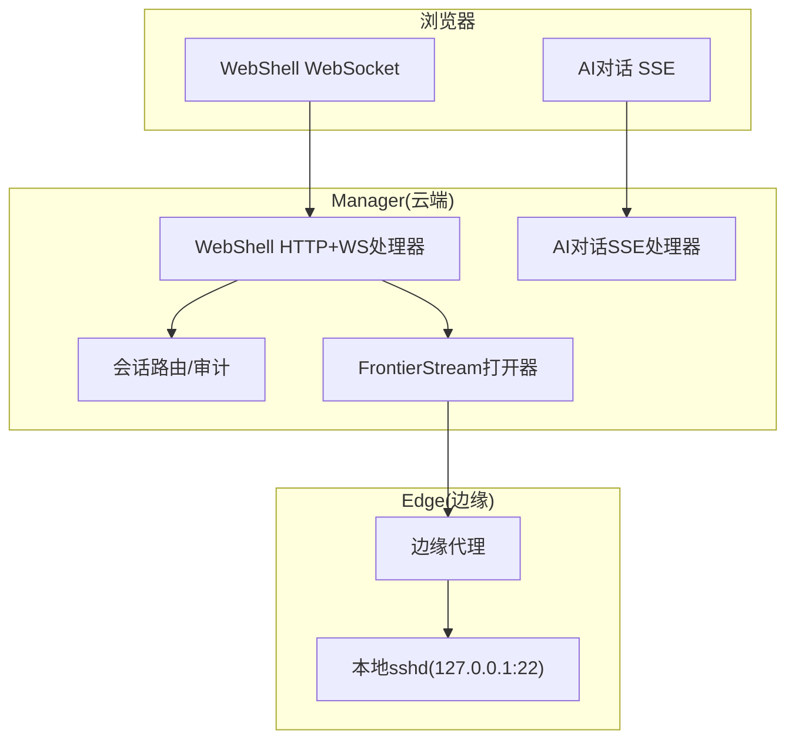
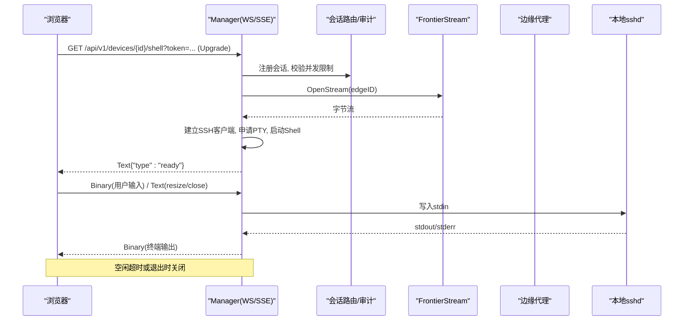
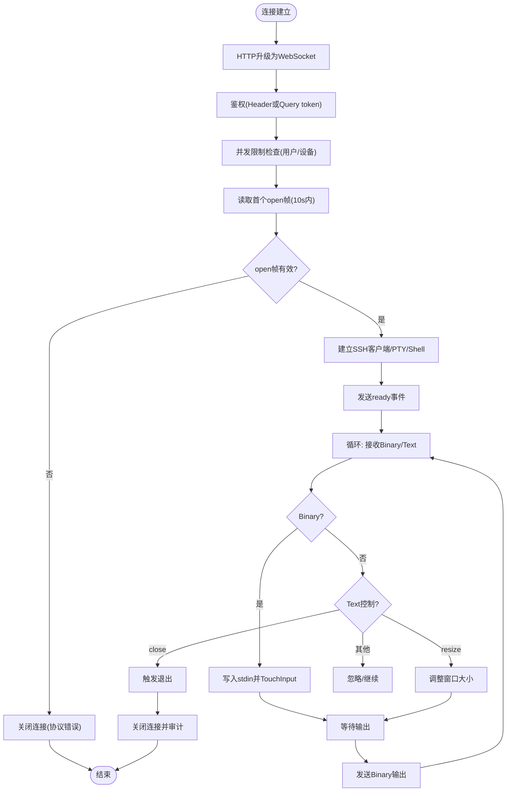
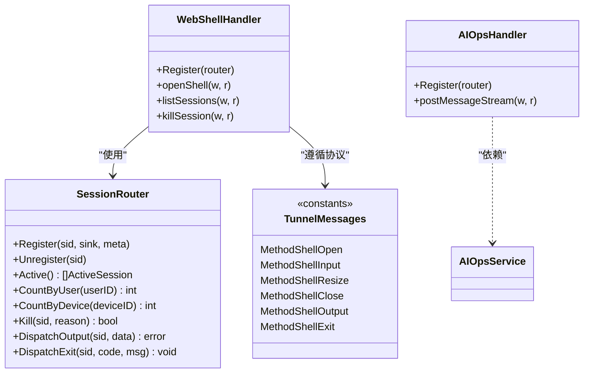

# WebSocket接口

<cite>
**本文引用的文件**   
- [internal/manager/server/webshell/http.go](file://internal/manager/server/webshell/http.go)
- [internal/manager/biz/webshell/router.go](file://internal/manager/biz/webshell/router.go)
- [web/src/api/webshell.ts](file://web/src/api/webshell.ts)
- [internal/pkg/tunnel/messages.go](file://internal/pkg/tunnel/messages.go)
- [internal/pkg/tunnel/types.go](file://internal/pkg/tunnel/types.go)
- [internal/manager/server/aiops/http.go](file://internal/manager/server/aiops/http.go)
- [web/src/api/chat.ts](file://web/src/api/chat.ts)
</cite>

## 目录
1. [简介](#简介)
2. [项目结构](#项目结构)
3. [核心组件](#核心组件)
4. [架构总览](#架构总览)
5. [详细组件分析](#详细组件分析)
6. [依赖关系分析](#依赖关系分析)
7. [性能与并发限制](#性能与并发限制)
8. [错误处理与重连策略](#错误处理与重连策略)
9. [安全性与权限控制](#安全性与权限控制)
10. [客户端集成示例](#客户端集成示例)
11. [调试工具使用指南](#调试工具使用指南)
12. [结论](#结论)

## 简介
本文件面向实时应用开发者，系统化梳理并文档化本项目中的WebSocket相关能力：WebShell终端会话、SSH隧道（边缘到云端的字节流通道）以及AI对话的实时推送。内容涵盖连接建立、消息格式、事件类型、认证方式、心跳机制、序列化格式、错误处理与重连策略、并发连接限制与资源管理、客户端集成示例、调试方法以及安全与性能最佳实践。

## 项目结构
与WebSocket相关的后端实现主要位于以下模块：
- WebShell HTTP+WebSocket端点：manager层HTTP处理器负责升级WebSocket、鉴权、并发限制、审计记录、PTY/Shell生命周期管理，并通过前端面边界（frontierbound）将字节流转发至边缘设备。
- SSH隧道协议定义：内部包定义了边缘与云端之间的RPC方法与消息体，包括WebSSH在边缘侧的会话控制帧。
- AI对话：采用SSE（Server-Sent Events）进行增量推送，非WebSocket；但作为“实时通信”的一部分一并说明。

图表来源
- [internal/manager/server/webshell/http.go:108-125](file://internal/manager/server/webshell/http.go#L108-L125)
- [internal/manager/biz/webshell/router.go:54-90](file://internal/manager/biz/webshell/router.go#L54-L90)
- [internal/pkg/tunnel/messages.go:43-80](file://internal/pkg/tunnel/messages.go#L43-L80)
- [internal/manager/server/aiops/http.go:129-154](file://internal/manager/server/aiops/http.go#L129-L154)

章节来源
- [internal/manager/server/webshell/http.go:108-125](file://internal/manager/server/webshell/http.go#L108-L125)
- [internal/manager/biz/webshell/router.go:54-90](file://internal/manager/biz/webshell/router.go#L54-L90)
- [internal/pkg/tunnel/messages.go:43-80](file://internal/pkg/tunnel/messages.go#L43-L80)
- [internal/manager/server/aiops/http.go:129-154](file://internal/manager/server/aiops/http.go#L129-L154)

## 核心组件
- WebShell WebSocket处理器：负责HTTP升级到WebSocket、鉴权、并发限制、审计、PTY/Shell创建、输入输出泵送、空闲超时关闭、管理员强制终止等。
- 会话路由与审计：维护活跃会话映射、统计输入输出字节数、提供列表与Kill能力。
- SSH隧道协议：定义边缘与云端之间用于WebSSH的RPC方法与消息体，如shell_open/shell_input/shell_resize/shell_close/shell_output/shell_exit。
- AI对话SSE处理器：提供会话CRUD、消息发送、SSE流式事件推送（assistant/tool_start/tool_end/approval_pending/done/error）。

章节来源
- [internal/manager/server/webshell/http.go:154-363](file://internal/manager/server/webshell/http.go#L154-L363)
- [internal/manager/biz/webshell/router.go:54-212](file://internal/manager/biz/webshell/router.go#L54-L212)
- [internal/pkg/tunnel/messages.go:43-152](file://internal/pkg/tunnel/messages.go#L43-L152)
- [internal/manager/server/aiops/http.go:370-583](file://internal/manager/server/aiops/http.go#L370-L583)

## 架构总览
WebShell通过HTTP请求升级WebSocket，随后以文本帧承载控制消息（open/resize/close），以二进制帧传输终端I/O数据。管理器在收到open后，通过frontierstream打开一条到边缘设备的字节流，并在该流上建立SSH客户端，分配PTY并启动Shell。边缘侧根据协议方法执行对应操作，并将stdout/stderr合并后的数据回推。

AI对话采用REST+SSE模式：POST /v1/chat/sessions/{id}/messages/stream返回text/event-stream，服务端按事件类型推送assistant/tool_start/tool_end/approval_pending/done/error等事件。

图表来源
- [internal/manager/server/webshell/http.go:154-363](file://internal/manager/server/webshell/http.go#L154-L363)
- [internal/manager/biz/webshell/router.go:54-90](file://internal/manager/biz/webshell/router.go#L54-L90)
- [internal/pkg/tunnel/messages.go:43-80](file://internal/pkg/tunnel/messages.go#L43-L80)

## 详细组件分析

### WebShell WebSocket接口
- 连接建立
  - 路径：GET /api/v1/devices/{device_id}/shell
  - 子协议：ongrid.shell.v1（可选协商）
  - 认证：Authorization: Bearer <jwt> 或 ?token=<jwt>
  - 首帧：必须为文本JSON open帧，包含cols/rows/term/ssh_user/ssh_pass等字段
- 控制消息（文本JSON）
  - open：首次建立会话，必填ssh_user/ssh_pass，cols/rows/term可选
  - resize：更新pty窗口大小
  - close：主动关闭会话
- 数据帧（二进制）
  - 浏览器→服务器：用户输入（stdin）
  - 服务器→浏览器：终端输出（stdout/stderr合并）
- 服务器控制事件（文本JSON）
  - ready：确认SSH会话已就绪
  - auth_error：认证失败或初始化错误
  - exit：会话结束，携带exit_code和可选message
- 并发与资源
  - 每用户最大会话数：5
  - 每设备最大会话数：5
  - 空闲超时：15分钟无输入自动关闭
- 审计与管理
  - 列表：GET /api/v1/webshell/sessions
  - 强制终止：DELETE /api/v1/webshell/sessions/{id}

图表来源
- [internal/manager/server/webshell/http.go:154-363](file://internal/manager/server/webshell/http.go#L154-L363)
- [internal/manager/server/webshell/http.go:399-432](file://internal/manager/server/webshell/http.go#L399-L432)
- [internal/manager/server/webshell/http.go:434-479](file://internal/manager/server/webshell/http.go#L434-L479)

章节来源
- [internal/manager/server/webshell/http.go:154-363](file://internal/manager/server/webshell/http.go#L154-L363)
- [internal/manager/server/webshell/http.go:399-432](file://internal/manager/server/webshell/http.go#L399-L432)
- [internal/manager/server/webshell/http.go:434-479](file://internal/manager/server/webshell/http.go#L434-L479)
- [web/src/api/webshell.ts:36-99](file://web/src/api/webshell.ts#L36-L99)

### SSH隧道协议（边缘↔云端）
- 方法常量（节选）
  - register_edge、heartbeat、push_host_metrics、get_host_load、get_process_list、execute_skill、plugin_configs_changed、write_database_metrics_secret
  - WebSSH：shell_open、shell_input、shell_resize、shell_close、shell_output、shell_exit
- 关键消息体（节选）
  - ShellOpenRequest/Response、ShellInputRequest/Response、ShellResizeRequest/Response、ShellCloseRequest/Response、ShellOutputRequest/Response、ShellExitRequest/Response
- 握手与会话
  - Meta：连接时附带access_key/secret_key
  - Heartbeat：周期性上报，含插件健康信息
- 注意
  - 当前MVP阶段tunnel body为JSON；未来可切换为protobuf二进制，保持调用方不变

章节来源
- [internal/pkg/tunnel/messages.go:17-80](file://internal/pkg/tunnel/messages.go#L17-L80)
- [internal/pkg/tunnel/messages.go:86-152](file://internal/pkg/tunnel/messages.go#L86-L152)
- [internal/pkg/tunnel/messages.go:210-320](file://internal/pkg/tunnel/messages.go#L210-L320)
- [internal/pkg/tunnel/types.go:8-120](file://internal/pkg/tunnel/types.go#L8-L120)

### AI对话（SSE实时推送）
- 接口
  - POST /v1/chat/sessions/{id}/messages/stream
  - 响应：text/event-stream，禁止缓存，禁用反向代理缓冲
- 事件类型
  - assistant：助手回复片段
  - tool_start：工具调用开始
  - tool_end：工具调用结束（success/error/timeout）
  - approval_pending：需要人工审批（如cloud_bash）
  - done：最终完成（包含usage/iterations等）
  - error：流式错误
- 客户端
  - 使用fetch + ReadableStream解析SSE帧，按event分发回调

章节来源
- [internal/manager/server/aiops/http.go:370-583](file://internal/manager/server/aiops/http.go#L370-L583)
- [web/src/api/chat.ts:245-359](file://web/src/api/chat.ts#L245-L359)

## 依赖关系分析
- WebShell处理器依赖：
  - 会话路由与审计（biz/webshell.Router）
  - FrontierStream打开器（Streamer接口）
  - 设备与边缘仓库（DeviceRepo/edge.Repo）
  - Casbin授权中间件（可选）
- SSH隧道协议被边缘与云端共同遵循，用于WebSSH及遥测、技能执行等。
- AI对话处理器依赖业务服务（AIOpsService）、LLM客户端（可选）、模型目录（可选）、代理清单（可选）。

图表来源
- [internal/manager/server/webshell/http.go:108-125](file://internal/manager/server/webshell/http.go#L108-L125)
- [internal/manager/biz/webshell/router.go:54-212](file://internal/manager/biz/webshell/router.go#L54-L212)
- [internal/pkg/tunnel/messages.go:43-80](file://internal/pkg/tunnel/messages.go#L43-L80)
- [internal/manager/server/aiops/http.go:129-154](file://internal/manager/server/aiops/http.go#L129-L154)

章节来源
- [internal/manager/server/webshell/http.go:108-125](file://internal/manager/server/webshell/http.go#L108-L125)
- [internal/manager/biz/webshell/router.go:54-212](file://internal/manager/biz/webshell/router.go#L54-L212)
- [internal/pkg/tunnel/messages.go:43-80](file://internal/pkg/tunnel/messages.go#L43-L80)
- [internal/manager/server/aiops/http.go:129-154](file://internal/manager/server/aiops/http.go#L129-L154)

## 性能与并发限制
- WebShell
  - 每用户最大并发会话：5
  - 每设备最大并发会话：5
  - 空闲超时：15分钟无输入自动关闭
  - 缓冲区：ReadBufferSize=4096，WriteBufferSize=16384
- SSH隧道
  - 心跳：heartbeat周期上报，含插件健康状态，便于检测长连接存活
- AI对话SSE
  - 支持立即flush，避免反向代理缓冲导致延迟
  - 工具调用可能耗时较长，服务端有独立超时配置

章节来源
- [internal/manager/server/webshell/http.go:83-104](file://internal/manager/server/webshell/http.go#L83-L104)
- [internal/manager/server/webshell/http.go:184-194](file://internal/manager/server/webshell/http.go#L184-L194)
- [internal/manager/server/webshell/http.go:399-432](file://internal/manager/server/webshell/http.go#L399-L432)
- [internal/pkg/tunnel/messages.go:273-320](file://internal/pkg/tunnel/messages.go#L273-L320)
- [internal/manager/server/aiops/http.go:423-429](file://internal/manager/server/aiops/http.go#L423-L429)

## 错误处理与重连策略
- WebShell
  - 首帧未达或格式错误：以协议错误关闭
  - SSH认证失败：返回auth_error事件，随后正常关闭
  - 断开/退出：统一走pumpDone通道，记录审计原因（idle/user/admin/ssh_auth_fail/ssh_exit/disconnect）
  - 建议客户端：捕获close事件后指数退避重连，重试前重新发送open帧
- SSH隧道
  - 心跳失败或网络异常：由底层geminio重试机制透明重连
- AI对话SSE
  - 流中error事件：客户端应停止渲染并提示错误
  - 连接中断：客户端需自行重连并拉取历史消息

章节来源
- [internal/manager/server/webshell/http.go:204-219](file://internal/manager/server/webshell/http.go#L204-L219)
- [internal/manager/server/webshell/http.go:286-296](file://internal/manager/server/webshell/http.go#L286-L296)
- [internal/manager/server/webshell/http.go:384-395](file://internal/manager/server/webshell/http.go#L384-L395)
- [internal/manager/server/webshell/http.go:434-479](file://internal/manager/server/webshell/http.go#L434-L479)
- [internal/manager/server/aiops/http.go:569-583](file://internal/manager/server/aiops/http.go#L569-L583)
- [web/src/api/chat.ts:245-359](file://web/src/api/chat.ts#L245-L359)

## 安全性与权限控制
- 认证
  - WebShell：Authorization: Bearer <jwt> 或 ?token=<jwt>
  - AI对话：Authorization: Bearer <jwt>
- 授权
  - WebShell：可选Casbin中间件，按resource/action校验（如device:shell exec/read/manage）
  - AI对话：所有路由均要求已认证调用者上下文
- 敏感数据处理
  - SSH密码仅用于一次拨号，成功后立即清零，不持久化
  - 审计记录不包含密码，仅记录元数据与流量统计

章节来源
- [web/src/api/webshell.ts:9-16](file://web/src/api/webshell.ts#L9-L16)
- [internal/manager/server/webshell/http.go:108-125](file://internal/manager/server/webshell/http.go#L108-L125)
- [internal/manager/server/aiops/http.go:279-301](file://internal/manager/server/aiops/http.go#L279-L301)
- [internal/manager/server/webshell/http.go:283](file://internal/manager/server/webshell/http.go#L283)

## 客户端集成示例

### WebShell（WebSocket）
- 连接参数
  - URL：/api/v1/devices/{device_id}/shell?token=<jwt>
  - 子协议：ongrid.shell.v1
  - binaryType：arraybuffer
- 首帧（open）
  - type: "open"
  - cols/rows/term：终端尺寸与类型
  - ssh_user/ssh_pass：必填
  - ssh_host：可选，默认127.0.0.1:22
- 控制帧（文本JSON）
  - resize：cols/rows
  - close：空对象
- 数据帧（二进制）
  - 浏览器→服务器：用户输入
  - 服务器→浏览器：终端输出
- 服务器事件（文本JSON）
  - ready/auth_error/exit

章节来源
- [web/src/api/webshell.ts:36-99](file://web/src/api/webshell.ts#L36-L99)
- [internal/manager/server/webshell/http.go:154-219](file://internal/manager/server/webshell/http.go#L154-L219)

### AI对话（SSE）
- 接口：POST /api/v1/chat/sessions/{id}/messages/stream
- 请求头：Accept=text/event-stream，Authorization: Bearer <jwt>
- 事件：assistant/tool_start/tool_end/approval_pending/done/error
- 客户端：使用ReadableStream逐帧解析，按event分发回调

章节来源
- [web/src/api/chat.ts:245-359](file://web/src/api/chat.ts#L245-L359)
- [internal/manager/server/aiops/http.go:370-583](file://internal/manager/server/aiops/http.go#L370-L583)

## 调试工具使用指南
- WebShell
  - 浏览器开发者工具Network面板查看WebSocket帧
  - 监听close事件，打印reason与code
  - 使用列表接口查看活跃会话与审计项
- AI对话SSE
  - 使用浏览器Network面板查看text/event-stream响应
  - 观察event/data行，定位tool_call与approval_pending事件
- 通用
  - 开启服务端日志，关注upgrade、auth_error、idle timeout、audit close等关键字

章节来源
- [internal/manager/server/webshell/http.go:490-573](file://internal/manager/server/webshell/http.go#L490-L573)
- [internal/manager/server/aiops/http.go:423-429](file://internal/manager/server/aiops/http.go#L423-L429)

## 结论
本项目实现了基于WebSocket的WebShell终端与基于SSE的AI对话两种实时通信模式。WebShell严格遵循文本控制帧与二进制数据帧分离的设计，具备完善的鉴权、授权、并发限制、审计与空闲回收机制；SSH隧道协议清晰定义了边缘与云端交互的消息集。AI对话通过SSE提供低延迟增量推送，配合工具调用与审批流程，满足复杂运维场景。建议在客户端实现稳健的重连与错误恢复策略，并结合监控与日志完善排障能力。