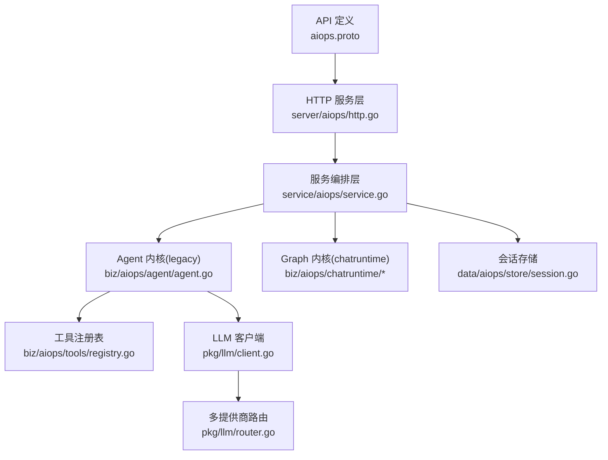
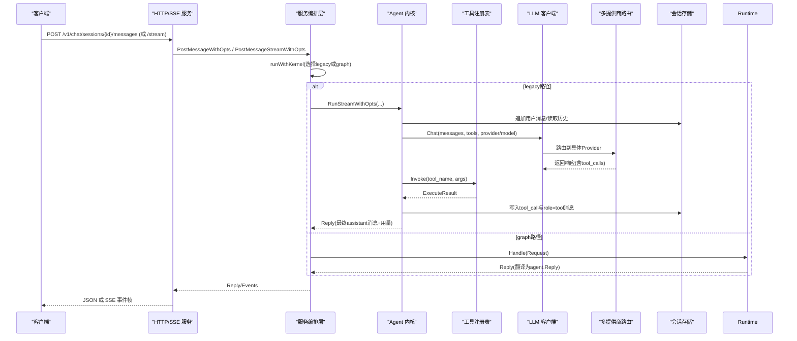
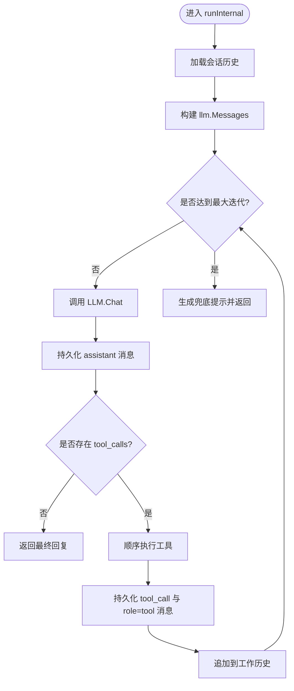
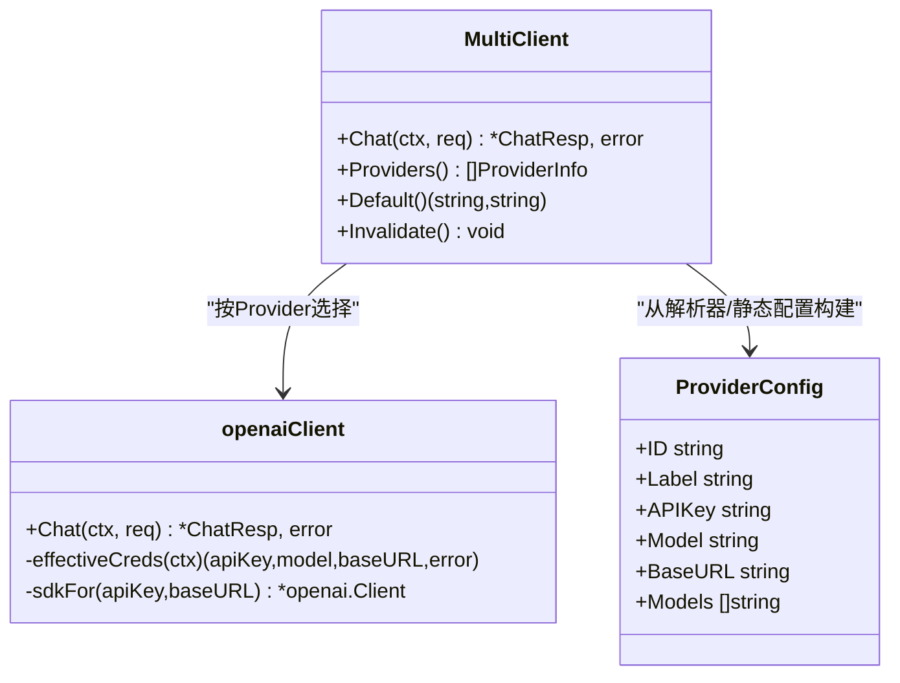
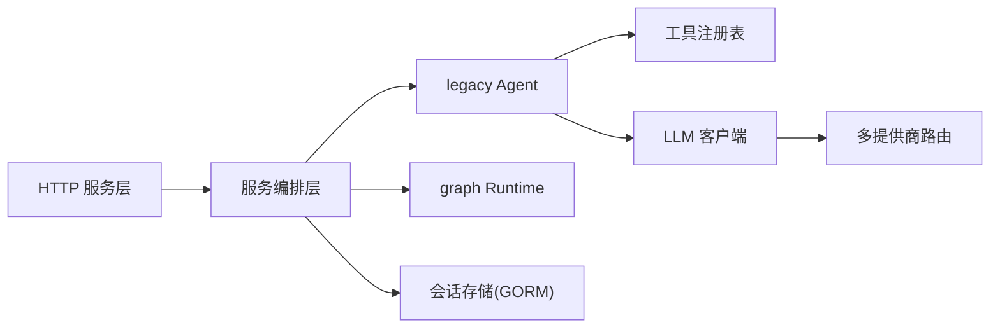

# AIOPS智能运维服务

<cite>
**本文引用的文件**   
- [aiops.proto](file://api/manager/aiops/v1/aiops.proto)
- [http.go](file://internal/manager/server/aiops/http.go)
- [service.go](file://internal/manager/service/aiops/service.go)
- [agent.go](file://internal/manager/biz/aiops/agent/agent.go)
- [registry.go](file://internal/manager/biz/aiops/tools/registry.go)
- [client.go](file://internal/pkg/llm/client.go)
- [router.go](file://internal/pkg/llm/router.go)
- [session.go](file://internal/manager/data/aiops/store/session.go)
</cite>

## 目录
1. [简介](#简介)
2. [项目结构](#项目结构)
3. [核心组件](#核心组件)
4. [架构总览](#架构总览)
5. [详细组件分析](#详细组件分析)
6. [依赖关系分析](#依赖关系分析)
7. [性能与可靠性](#性能与可靠性)
8. [客户端集成示例](#客户端集成示例)
9. [调试与监控指南](#调试与监控指南)
10. [结论](#结论)

## 简介
本文件面向AIOPS智能运维服务的开发者与运维人员，系统性梳理gRPC接口定义、HTTP/SSE流式交互、LLM多提供商路由、工具调用闭环、会话上下文与持久化、以及性能优化与排障要点。文档以代码仓库中的实际实现为依据，提供可落地的架构图、时序图与流程图，并给出客户端接入建议与最佳实践。

## 项目结构
AIOPS相关能力横跨API定义、HTTP服务层、业务编排（Agent/Graph内核）、工具注册与执行、LLM客户端与多提供商路由、以及会话数据持久化等层次。

图表来源
- [aiops.proto:1-170](file://api/manager/aiops/v1/aiops.proto#L1-L170)
- [http.go:1-154](file://internal/manager/server/aiops/http.go#L1-L154)
- [service.go:1-120](file://internal/manager/service/aiops/service.go#L1-L120)
- [agent.go:1-120](file://internal/manager/biz/aiops/agent/agent.go#L1-L120)
- [registry.go:1-120](file://internal/manager/biz/aiops/tools/registry.go#L1-L120)
- [client.go:1-120](file://internal/pkg/llm/client.go#L1-L120)
- [router.go:1-120](file://internal/pkg/llm/router.go#L1-L120)
- [session.go:1-120](file://internal/manager/data/aiops/store/session.go#L1-L120)

章节来源
- [aiops.proto:1-170](file://api/manager/aiops/v1/aiops.proto#L1-L170)
- [http.go:1-154](file://internal/manager/server/aiops/http.go#L1-L154)
- [service.go:1-120](file://internal/manager/service/aiops/service.go#L1-L120)
- [agent.go:1-120](file://internal/manager/biz/aiops/agent/agent.go#L1-L120)
- [registry.go:1-120](file://internal/manager/biz/aiops/tools/registry.go#L1-L120)
- [client.go:1-120](file://internal/pkg/llm/client.go#L1-L120)
- [router.go:1-120](file://internal/pkg/llm/router.go#L1-L120)
- [session.go:1-120](file://internal/manager/data/aiops/store/session.go#L1-L120)

## 核心组件
- gRPC 接口：AiopsService 暴露会话创建/列表、消息发送（阻塞与流式）、历史消息查询等能力。
- HTTP/SSE 服务：提供REST风格接口与SSE流式事件，兼容浏览器与网关环境。
- Agent 内核：legacy for-loop 与 graph 双内核；默认 legacy，可通过环境变量切换。
- 工具注册表：集中管理工具Schema与执行器，支持PromQL/LogQL/TraceQL、拓扑、告警、主机进程等。
- LLM 客户端：OpenAI兼容接口，内置预算控制、指标上报、Zhipu鉴权适配、BaseURL规范化。
- 多提供商路由：按Provider选择子客户端，支持动态配置刷新与回退策略。
- 会话存储：基于GORM的会话、消息、工具调用记录与聚合统计。

章节来源
- [aiops.proto:1-170](file://api/manager/aiops/v1/aiops.proto#L1-L170)
- [http.go:1-154](file://internal/manager/server/aiops/http.go#L1-L154)
- [service.go:1-120](file://internal/manager/service/aiops/service.go#L1-L120)
- [agent.go:1-120](file://internal/manager/biz/aiops/agent/agent.go#L1-L120)
- [registry.go:1-120](file://internal/manager/biz/aiops/tools/registry.go#L1-L120)
- [client.go:1-120](file://internal/pkg/llm/client.go#L1-L120)
- [router.go:1-120](file://internal/pkg/llm/router.go#L1-L120)
- [session.go:1-120](file://internal/manager/data/aiops/store/session.go#L1-L120)

## 架构总览
AIOPS整体采用“HTTP/SSE + gRPC”双通道对外暴露，内部通过服务编排层统一调度legacy/graph两种Agent内核，工具执行与观测数据访问由工具注册表抽象，LLM调用经多提供商路由分发至具体上游。

图表来源
- [http.go:339-449](file://internal/manager/server/aiops/http.go#L339-L449)
- [service.go:287-329](file://internal/manager/service/aiops/service.go#L287-L329)
- [agent.go:295-442](file://internal/manager/biz/aiops/agent/agent.go#L295-L442)
- [registry.go:369-383](file://internal/manager/biz/aiops/tools/registry.go#L369-L383)
- [client.go:345-448](file://internal/pkg/llm/client.go#L345-L448)
- [router.go:289-334](file://internal/pkg/llm/router.go#L289-L334)
- [session.go:157-230](file://internal/manager/data/aiops/store/session.go#L157-L230)

## 详细组件分析

### gRPC 接口定义（AiopsService）
- 会话管理
  - CreateChatSession：新建对话，scope限定可触达edge集合。
  - ListChatSessions：分页列出当前用户/组织有权限的会话。
- 消息通信
  - PostMessage：阻塞等待agent收敛，返回最终assistant消息、tool轨迹与token用量。
  - StreamMessage：server-streaming，逐token片段下发，适合SSE/WebSocket前端体验。
  - ListMessages：按游标分页获取会话历史（含tool调用）。
- 领域类型
  - ChatRole/ChatSession/ChatMessage/ToolCall/ToolResult/TokenUsage 等，对齐OpenAI语义。

章节来源
- [aiops.proto:1-170](file://api/manager/aiops/v1/aiops.proto#L1-L170)

### HTTP/SSE 服务层
- REST端点
  - POST/GET /v1/chat/sessions
  - POST/GET /v1/chat/sessions/{id}/messages
  - POST /v1/chat/sessions/{id}/stop
  - DELETE/PATCH /v1/chat/sessions/{id}
  - GET /v1/usage/today
  - GET /v1/aiops/models
  - POST /v1/aiops/query-translate
  - /v1/agents 系列
- SSE流式
  - POST /v1/chat/sessions/{id}/messages/stream
  - 事件类型：assistant、tool_start、tool_end、done、task_notification、approval_pending、error
  - 无Flusher时自动降级为阻塞JSON响应，便于开发环境与缓冲代理兼容。

章节来源
- [http.go:130-154](file://internal/manager/server/aiops/http.go#L130-L154)
- [http.go:339-449](file://internal/manager/server/aiops/http.go#L339-L449)
- [http.go:451-583](file://internal/manager/server/aiops/http.go#L451-L583)

### 服务编排层（Service）
- 双内核调度：legacy vs graph，默认legacy，可通过环境变量切换。
- 会话所有权校验：非所有者返回404避免泄露存在性；管理员可绕过。
- 运行期取消：将请求ctx解耦（WithoutCancel），但保留显式StopSession能力。
- 事件映射：graph事件翻译为legacy事件形状，保持SSE帧名一致。

章节来源
- [service.go:1-120](file://internal/manager/service/aiops/service.go#L1-L120)
- [service.go:287-329](file://internal/manager/service/aiops/service.go#L287-L329)
- [service.go:355-374](file://internal/manager/service/aiops/service.go#L355-L374)
- [service.go:387-420](file://internal/manager/service/aiops/service.go#L387-L420)
- [service.go:422-472](file://internal/manager/service/aiops/service.go#L422-L472)

### Agent 内核（legacy）
- 主循环：加载历史→追加用户消息→最多N轮LLM调用→若无tool_calls则结束，否则顺序执行工具并回喂结果。
- 上下文构建：按tool_call_id重排tool结果紧随assistant，保证严格provider不拒收。
- 安全门控：web_search开关、legacy mutating工具拒绝、最大迭代次数兜底友好提示。
- 流式事件：assistant/tool_start/tool_end/done等事件透传。

图表来源
- [agent.go:295-442](file://internal/manager/biz/aiops/agent/agent.go#L295-L442)
- [agent.go:697-800](file://internal/manager/biz/aiops/agent/agent.go#L697-L800)

章节来源
- [agent.go:1-120](file://internal/manager/biz/aiops/agent/agent.go#L1-L120)
- [agent.go:295-442](file://internal/manager/biz/aiops/agent/agent.go#L295-L442)
- [agent.go:697-800](file://internal/manager/biz/aiops/agent/agent.go#L697-L800)

### 工具注册表（Registry）
- 职责：维护工具Schema与执行器，向LLM暴露函数描述，接收模型tool_call后分派执行。
- 典型工具：主机负载/进程、PromQL/LogQL/TraceQL查询、拓扑/边缘设备、告警/事件、知识库检索、IM通知、页面托管等。
- 组合能力：当所有信号源就绪时注册关联型复合工具（如incident关联分析）。

章节来源
- [registry.go:1-120](file://internal/manager/biz/aiops/tools/registry.go#L1-L120)
- [registry.go:173-310](file://internal/manager/biz/aiops/tools/registry.go#L173-L310)
- [registry.go:355-383](file://internal/manager/biz/aiops/tools/registry.go#L355-L383)

### LLM 客户端与多提供商路由
- 客户端
  - OpenAI兼容接口，支持自定义BaseURL、超时、预算检查、指标上报。
  - Zhipu鉴权：自动替换Authorization为JWT签名。
  - BaseURL规范化：对裸地址自动补全/v1，兼容Ollama/LM Studio/vLLM等。
- 路由
  - MultiClient按Provider选择子客户端，支持动态ProvidersResolver刷新与TTL缓存。
  - 未指定Provider时回退到默认或构造时注入的fallback。
  - 指标标签不含敏感信息，状态分类包含timeout/rate_limited/error。

图表来源
- [router.go:61-129](file://internal/pkg/llm/router.go#L61-L129)
- [router.go:289-334](file://internal/pkg/llm/router.go#L289-L334)
- [client.go:189-286](file://internal/pkg/llm/client.go#L189-L286)
- [client.go:345-448](file://internal/pkg/llm/client.go#L345-L448)

章节来源
- [client.go:1-120](file://internal/pkg/llm/client.go#L1-L120)
- [client.go:288-321](file://internal/pkg/llm/client.go#L288-L321)
- [client.go:345-448](file://internal/pkg/llm/client.go#L345-L448)
- [router.go:1-120](file://internal/pkg/llm/router.go#L1-L120)
- [router.go:289-334](file://internal/pkg/llm/router.go#L289-L334)

### 会话与上下文持久化
- 会话CRUD：创建、关闭、删除、重命名、按用户/关联事件过滤列表。
- 消息与工具调用：追加消息、批量填充assistant的tool_calls、更新tool执行结果。
- Token用量聚合：按时间范围汇总prompt/completion/请求数。
- 上下文重建：ListMessages按created_at排序，limit>0时反转再批量hydrate tool_calls，确保回放一致性。

章节来源
- [session.go:30-125](file://internal/manager/data/aiops/store/session.go#L30-L125)
- [session.go:157-230](file://internal/manager/data/aiops/store/session.go#L157-L230)
- [session.go:244-285](file://internal/manager/data/aiops/store/session.go#L244-L285)

## 依赖关系分析
- HTTP层依赖服务编排层，服务编排层可选择legacy或graph内核。
- legacy内核依赖工具注册表与LLM客户端；graph内核通过运行时Handle完成相同职责。
- LLM客户端依赖多提供商路由；路由依赖Provider配置与可选的动态解析器。
- 工具注册表依赖边缘/设备/拓扑/告警/日志/追踪等子系统（通过窄接口注入）。
- 会话存储使用GORM，提供事务级删除与批量hydrate。

图表来源
- [http.go:130-154](file://internal/manager/server/aiops/http.go#L130-L154)
- [service.go:287-329](file://internal/manager/service/aiops/service.go#L287-L329)
- [agent.go:295-442](file://internal/manager/biz/aiops/agent/agent.go#L295-L442)
- [registry.go:355-383](file://internal/manager/biz/aiops/tools/registry.go#L355-L383)
- [client.go:345-448](file://internal/pkg/llm/client.go#L345-L448)
- [router.go:289-334](file://internal/pkg/llm/router.go#L289-L334)
- [session.go:157-230](file://internal/manager/data/aiops/store/session.go#L157-L230)

## 性能与可靠性
- 连接与SDK缓存
  - LLM客户端按(apiKey, baseURL)缓存底层SDK实例，减少重复初始化开销。
  - Resolver结果带TTL缓存，降低热路径DB往返。
- 超时与预算
  - 默认120s兜底超时，避免长尾卡死；预算检查在发网前估算prompt大小，失败快速返回。
- 流式与降级
  - SSE在无Flusher环境下自动降级为阻塞JSON，提升兼容性。
- 并发与取消
  - 会话turn与HTTP请求解耦，防止刷新中断；支持显式StopSession中断。
- 负载均衡与容错
  - 多提供商路由支持按Provider分流；错误分类区分timeout/rate_limited/error，便于上层重试与熔断策略。
- 存储优化
  - 批量hydrate tool_calls，避免N+1查询；删除走单事务，保证一致性。

[本节为通用指导，无需源码引用]

## 客户端集成示例
以下示例聚焦HTTP/SSE与gRPC两类客户端的典型流程与错误处理要点。为避免直接粘贴代码，仅给出关键步骤与参考路径。

- 连接建立
  - HTTP：POST /v1/chat/sessions 创建会话，保存session_id。
  - gRPC：调用 AiopsService.CreateChatSession，获取会话元数据。
  - 参考路径：
    - [http.go:279-301](file://internal/manager/server/aiops/http.go#L279-L301)
    - [aiops.proto:11-14](file://api/manager/aiops/v1/aiops.proto#L11-L14)

- 发送消息（阻塞）
  - HTTP：POST /v1/chat/sessions/{id}/messages，携带content/provider/model等选项。
  - gRPC：PostMessage，返回最终assistant消息与工具轨迹。
  - 参考路径：
    - [http.go:339-368](file://internal/manager/server/aiops/http.go#L339-L368)
    - [aiops.proto:19-21](file://api/manager/aiops/v1/aiops.proto#L19-L21)

- 发送消息（流式）
  - HTTP：POST /v1/chat/sessions/{id}/messages/stream，订阅assistant/tool_start/tool_end/done等事件。
  - gRPC：StreamMessage，服务端流式返回StreamChunk。
  - 参考路径：
    - [http.go:386-449](file://internal/manager/server/aiops/http.go#L386-L449)
    - [aiops.proto:23-25](file://api/manager/aiops/v1/aiops.proto#L23-L25)

- 错误处理
  - 认证失败：401（未登录/令牌无效）。
  - 资源不存在：404（会话不存在或非所有者）。
  - 参数非法：400（空内容、非法字段）。
  - 上游错误：根据状态码与事件error帧处理，必要时重试或降级。
  - 参考路径：
    - [http.go:339-368](file://internal/manager/server/aiops/http.go#L339-L368)
    - [http.go:386-449](file://internal/manager/server/aiops/http.go#L386-L449)

- 停止运行
  - POST /v1/chat/sessions/{id}/stop，用于Esc中断。
  - 参考路径：
    - [http.go:617-634](file://internal/manager/server/aiops/http.go#L617-L634)
    - [service.go:355-374](file://internal/manager/service/aiops/service.go#L355-L374)

## 调试与监控指南
- 日志与结构化输出
  - LLM层：记录model、user_id、tokens、duration、tool_calls数量等，不包含消息正文。
  - Agent层：记录会话、迭代次数、token用量、工具调用状态。
  - 参考路径：
    - [client.go:436-448](file://internal/pkg/llm/client.go#L436-L448)
    - [agent.go:425-442](file://internal/manager/biz/aiops/agent/agent.go#L425-L442)

- 指标与看板
  - 请求耗时、成功/错误/超时/限流计数、token总量（prompt/completion）。
  - 参考路径：
    - [client.go:391-424](file://internal/pkg/llm/client.go#L391-L424)
    - [router.go:326-334](file://internal/pkg/llm/router.go#L326-L334)

- 常见问题定位
  - “stream error”：多为BaseURL未带/v1导致404，客户端应检查normalize逻辑或配置。
  - “budget exceeded”：检查每日配额与估算逻辑，适当放宽或优化prompt长度。
  - “rate limited”：观察上游限流，增加重试退避或切换Provider。
  - “tool must follow tool_calls”：检查tool replay与tool消息配对，确认hydrate逻辑正常。
  - 参考路径：
    - [client.go:288-321](file://internal/pkg/llm/client.go#L288-L321)
    - [session.go:174-230](file://internal/manager/data/aiops/store/session.go#L174-L230)

## 结论
AIOPS智能运维服务通过清晰的层次划分与可扩展设计，实现了跨多种大模型提供商的统一接入、稳定的工具调用闭环、友好的流式交互体验与完善的会话上下文管理。结合预算控制、超时与错误分类、SSE降级与显式取消机制，系统在可用性与可观测性方面具备良好基础。建议在部署中合理配置Provider与模型、开启必要的工具集、完善监控告警，并在客户端侧做好重试与降级策略，以获得更稳健的生产体验。