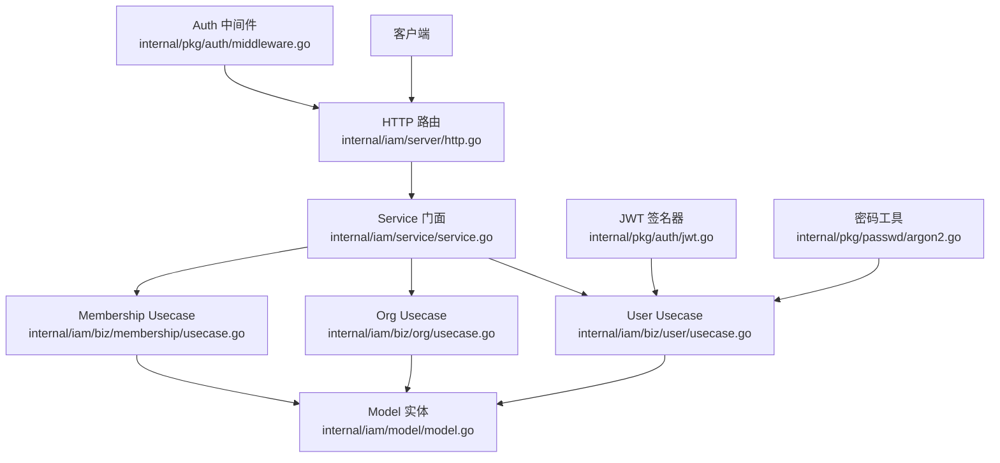
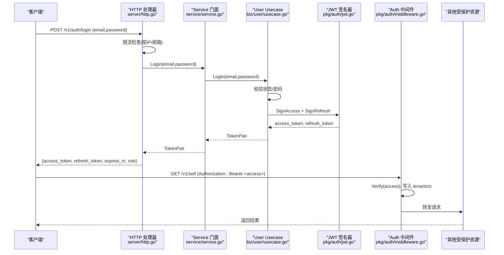
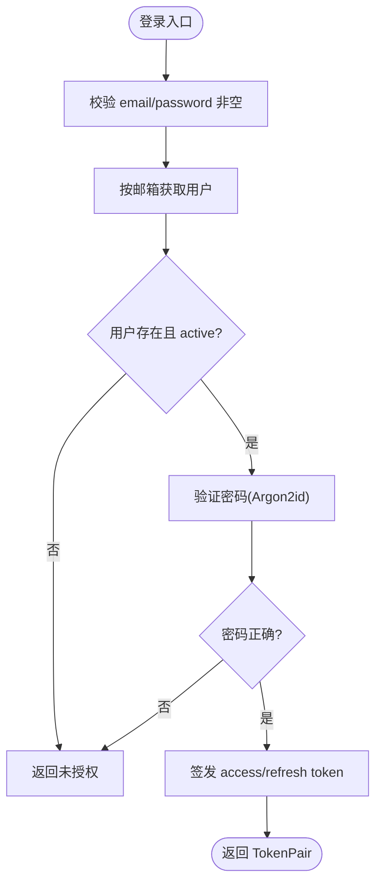
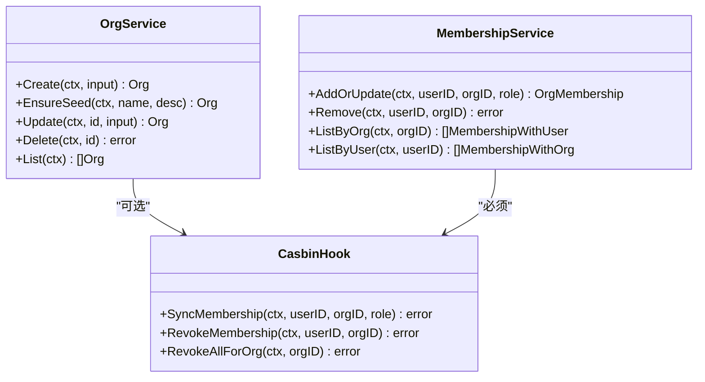
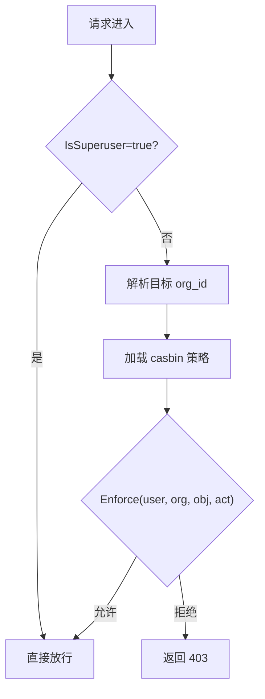
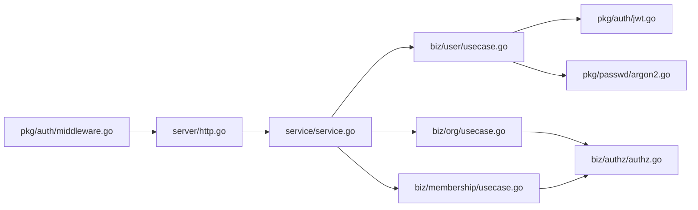

# IAM认证服务

<cite>
**本文引用的文件**   
- [api/iam/v1/iam.proto](file://api/iam/v1/iam.proto)
- [internal/iam/service/service.go](file://internal/iam/service/service.go)
- [internal/iam/server/http.go](file://internal/iam/server/http.go)
- [internal/iam/server/orgs.go](file://internal/iam/server/orgs.go)
- [internal/iam/biz/user/usecase.go](file://internal/iam/biz/user/usecase.go)
- [internal/iam/biz/org/usecase.go](file://internal/iam/biz/org/usecase.go)
- [internal/iam/biz/membership/usecase.go](file://internal/iam/biz/membership/usecase.go)
- [internal/iam/model/model.go](file://internal/iam/model/model.go)
- [internal/pkg/auth/jwt.go](file://internal/pkg/auth/jwt.go)
- [internal/pkg/auth/middleware.go](file://internal/pkg/auth/middleware.go)
- [internal/pkg/passwd/argon2.go](file://internal/pkg/passwd/argon2.go)
</cite>

## 目录
1. [简介](#简介)
2. [项目结构](#项目结构)
3. [核心组件](#核心组件)
4. [架构总览](#架构总览)
5. [详细组件分析](#详细组件分析)
6. [依赖关系分析](#依赖关系分析)
7. [性能与扩展性](#性能与扩展性)
8. [故障排查指南](#故障排查指南)
9. [结论](#结论)
10. [附录：API定义与客户端集成](#附录api定义与客户端集成)

## 简介
本文件面向开发者，系统化阐述 IAM 认证服务的职责、接口契约、数据模型与安全机制。重点覆盖：
- IamService 的 RPC 方法（Register、Login、Refresh、GetSelf、CreateOrg、ListOrgs、InviteMember、ListMembers、SwitchOrg）的请求/响应格式
- 用户注册登录流程与 JWT 令牌管理机制
- 多租户组织管理与成员体系（Membership）
- 角色体系与权限控制模型（系统级 role 与组织级 membership role）
- 安全考虑与最佳实践
- 各语言客户端集成示例与错误处理、重试策略建议

说明：
- 当前代码库实现了 HTTP API 层与业务逻辑层；gRPC proto 已定义 IamService 及其消息类型，但 HTTP 实现是实际运行入口。文档将同时给出 proto 契约与 HTTP 行为对照，便于跨语言客户端对接。

## 项目结构
IAM 相关代码位于 internal/iam 下，采用分层设计：
- server：HTTP 路由与中间件，负责鉴权、限流、审计事件注入
- service：对外暴露的统一门面，聚合 user/org/membership/authz 能力
- biz：领域用例（Usecase），封装业务规则与调用数据层
- model：持久化实体定义（users、orgs、org_memberships）
- pkg/auth：JWT 签发/校验与请求上下文注入中间件
- pkg/passwd：密码哈希与校验（Argon2id）

图表来源
- [internal/iam/server/http.go:152-183](file://internal/iam/server/http.go#L152-L183)
- [internal/iam/service/service.go:21-57](file://internal/iam/service/service.go#L21-L57)
- [internal/iam/biz/user/usecase.go:18-29](file://internal/iam/biz/user/usecase.go#L18-L29)
- [internal/iam/biz/org/usecase.go:49-59](file://internal/iam/biz/org/usecase.go#L49-L59)
- [internal/iam/biz/membership/usecase.go:33-42](file://internal/iam/biz/membership/usecase.go#L33-L42)
- [internal/iam/model/model.go:80-140](file://internal/iam/model/model.go#L80-L140)
- [internal/pkg/auth/middleware.go:21-53](file://internal/pkg/auth/middleware.go#L21-L53)
- [internal/pkg/auth/jwt.go:32-54](file://internal/pkg/auth/jwt.go#L32-L54)
- [internal/pkg/passwd/argon2.go:26-45](file://internal/pkg/passwd/argon2.go#L26-L45)

章节来源
- [internal/iam/server/http.go:152-183](file://internal/iam/server/http.go#L152-L183)
- [internal/iam/service/service.go:21-57](file://internal/iam/service/service.go#L21-L57)
- [internal/iam/biz/user/usecase.go:18-29](file://internal/iam/biz/user/usecase.go#L18-L29)
- [internal/iam/biz/org/usecase.go:49-59](file://internal/iam/biz/org/usecase.go#L49-L59)
- [internal/iam/biz/membership/usecase.go:33-42](file://internal/iam/biz/membership/usecase.go#L33-L42)
- [internal/iam/model/model.go:80-140](file://internal/iam/model/model.go#L80-L140)
- [internal/pkg/auth/middleware.go:21-53](file://internal/pkg/auth/middleware.go#L21-L53)
- [internal/pkg/auth/jwt.go:32-54](file://internal/pkg/auth/jwt.go#L32-L54)
- [internal/pkg/passwd/argon2.go:26-45](file://internal/pkg/passwd/argon2.go#L26-L45)

## 核心组件
- Service 门面：聚合 user/org/membership/authz 能力，提供 Register/Login/Refresh 等统一入口
- User Usecase：用户注册、登录、刷新、资料管理、密码重置、管理员引导创建
- Org Usecase：组织 CRUD、种子组织“默认组织”保障、层级移动防环检查
- Membership Usecase：成员增删改查，同步 casbin 策略
- Auth 中间件：从 Authorization 或查询参数提取 Bearer Token，校验并写入上下文
- JWT Signer：签发 access/refresh token，支持不同 TTL
- Password 工具：基于 Argon2id 的哈希与验证

章节来源
- [internal/iam/service/service.go:59-72](file://internal/iam/service/service.go#L59-L72)
- [internal/iam/biz/user/usecase.go:43-123](file://internal/iam/biz/user/usecase.go#L43-L123)
- [internal/iam/biz/org/usecase.go:77-131](file://internal/iam/biz/org/usecase.go#L77-L131)
- [internal/iam/biz/membership/usecase.go:44-83](file://internal/iam/biz/membership/usecase.go#L44-L83)
- [internal/pkg/auth/middleware.go:21-53](file://internal/pkg/auth/middleware.go#L21-L53)
- [internal/pkg/auth/jwt.go:56-79](file://internal/pkg/auth/jwt.go#L56-L79)
- [internal/pkg/passwd/argon2.go:26-45](file://internal/pkg/passwd/argon2.go#L26-L45)

## 架构总览
下图展示一次典型登录到访问受保护资源的完整链路，包括限流、审计、JWT 签发与上下文注入。

图表来源
- [internal/iam/server/http.go:221-269](file://internal/iam/server/http.go#L221-L269)
- [internal/iam/service/service.go:64-72](file://internal/iam/service/service.go#L64-L72)
- [internal/iam/biz/user/usecase.go:80-123](file://internal/iam/biz/user/usecase.go#L80-L123)
- [internal/pkg/auth/jwt.go:56-79](file://internal/pkg/auth/jwt.go#L56-L79)
- [internal/pkg/auth/middleware.go:21-53](file://internal/pkg/auth/middleware.go#L21-L53)

## 详细组件分析

### 用户与认证（User Usecase）
- 注册：校验邮箱唯一、密码非空、role 合法；使用 Argon2id 存储 pass_hash；返回用户信息（不含密码）
- 登录：校验用户存在且 active，验证密码；签发 access/refresh token 对
- 刷新：校验 refresh token 签名有效，重新签发新 token 对
- 资料更新：display_name/phone 长度限制
- 状态管理：active/disabled；删除最后一名管理员会被拒绝（由上层约束）
- 密码重置：管理员操作，强校验新密码非空

图表来源
- [internal/iam/biz/user/usecase.go:80-123](file://internal/iam/biz/user/usecase.go#L80-L123)
- [internal/pkg/passwd/argon2.go:50-78](file://internal/pkg/passwd/argon2.go#L50-L78)

章节来源
- [internal/iam/biz/user/usecase.go:43-123](file://internal/iam/biz/user/usecase.go#L43-L123)
- [internal/iam/biz/user/usecase.go:210-249](file://internal/iam/biz/user/usecase.go#L210-L249)
- [internal/pkg/passwd/argon2.go:26-45](file://internal/pkg/passwd/argon2.go#L26-L45)

### 组织与成员（Org & Membership）
- 组织：
  - 创建：若未指定父组织，自动挂入“默认组织”，保证树根唯一
  - 更新：支持提升为顶级或移动到某父组织之下，含环路检测
  - 删除：无子组织时才可删除，级联清理成员与 casbin 策略
- 成员：
  - 新增/变更：校验 role 合法性，持久化后同步 casbin g 策略
  - 移除：删除记录并撤销对应 casbin 策略
  - 列表：按 org 或 user 维度列出，附带关联对象快照

图表来源
- [internal/iam/biz/org/usecase.go:77-226](file://internal/iam/biz/org/usecase.go#L77-L226)
- [internal/iam/biz/membership/usecase.go:44-83](file://internal/iam/biz/membership/usecase.go#L44-L83)
- [internal/iam/biz/authz/authz.go:145-210](file://internal/iam/biz/authz/authz.go#L145-L210)

章节来源
- [internal/iam/biz/org/usecase.go:77-226](file://internal/iam/biz/org/usecase.go#L77-L226)
- [internal/iam/biz/membership/usecase.go:44-83](file://internal/iam/biz/membership/usecase.go#L44-L83)

### 权限控制模型（Role 与 Membership Role）
- 系统级角色（users.role）：admin、user、viewer
  - admin：具备平台管理能力（如用户/组织管理）
  - user：可使用全部功能（含 chat 全工具集），不可改平台配置/管理用户
  - viewer：只读，受限 chat
- 组织级成员角色（org_memberships.role）：org_admin、member、viewer
  - org_admin：可管理该组织及成员
  - member：可读/写资源，可执行特定动作（如设备 shell exec）
  - viewer：仅读
- 超级管理员（is_superuser）：绕过 casbin 快速路径，确保运维可管可控

图表来源
- [internal/iam/model/model.go:31-78](file://internal/iam/model/model.go#L31-L78)
- [internal/iam/biz/authz/authz.go:86-110](file://internal/iam/biz/authz/authz.go#L86-L110)
- [internal/pkg/auth/middleware.go:34-44](file://internal/pkg/auth/middleware.go#L34-L44)

章节来源
- [internal/iam/model/model.go:31-78](file://internal/iam/model/model.go#L31-L78)
- [internal/iam/biz/authz/authz.go:86-110](file://internal/iam/biz/authz/authz.go#L86-L110)
- [internal/pkg/auth/middleware.go:34-44](file://internal/pkg/auth/middleware.go#L34-L44)

### IamService RPC 方法与 HTTP 映射
以下表格汇总 proto 定义的 RPC 与 HTTP 端点、请求参数与响应字段。注意：proto 中部分字段在 HTTP 实现中可能以不同名称或结构返回，请以 HTTP 实现为准进行对接。

- Register
  - Proto：RegisterRequest{email,password} → RegisterResponse{user,personal_org,tokens}
  - HTTP：POST /v1/auth/register（需管理员鉴权）→ 返回用户DTO{id,email,role}
  - 说明：HTTP 层当前不返回 personal_org/tokens；如需等价能力，请使用管理员创建用户后再登录

- Login
  - Proto：LoginRequest{email,password} → LoginResponse{user,tokens,active_org}
  - HTTP：POST /v1/auth/login → 返回{access_token,refresh_token,expires_in,role}
  - 说明：HTTP 层返回简化字段；active_org 可通过后续 GetSelf/me 获取

- Refresh
  - Proto：RefreshRequest{refresh_token} → RefreshResponse{tokens}
  - HTTP：POST /v1/auth/refresh → 返回{access_token,refresh_token,expires_in,role}

- GetSelf
  - Proto：GetSelfRequest{} → GetSelfResponse{user, membershps[]}
  - HTTP：GET /v1/self → 返回用户DTO{id,email,role}
  - 增强版：GET /v1/me → 返回 meDTO{id,email,display_name,phone,role,status,memberships[]}

- CreateOrg
  - Proto：CreateOrgRequest{name,slug} → CreateOrgResponse{org,membership}
  - HTTP：POST /v1/orgs（需管理员）→ 返回 orgDTO{id,name,description,parent_id,created_at,updated_at}
  - 说明：HTTP 层未返回 slug/plan/is_personal；membership 通过后续成员接口管理

- ListOrgs
  - Proto：ListOrgsRequest{} → ListOrgsResponse{orgs[]}
  - HTTP：GET /v1/orgs（需鉴权）→ 返回{items:[orgDTO], total:int}

- InviteMember
  - Proto：InviteMemberRequest{email,role}（org_id 来自 URL path）→ InviteMemberResponse{membership,invite_token}
  - HTTP：POST /v1/orgs/{id}/members（需管理员）→ 返回{user_id,org_id,role}
  - 说明：HTTP 层未返回 invite_token；邀请链接能力可在上层扩展

- ListMembers
  - Proto：ListMembersRequest{page,page_size}（org_id 来自 URL path）→ ListMembersResponse{memberships[],total}
  - HTTP：GET /v1/orgs/{id}/members（需鉴权）→ 返回{items:[{user_id,email,display_name,role}], total:int}

- SwitchOrg
  - Proto：SwitchOrgRequest{refresh_token,target_org_id} → SwitchOrgResponse{tokens,active_org}
  - HTTP：当前未提供等价端点；可通过 Refresh 获得新 token 并在后续请求携带 X-Active-Org 头选择组织

章节来源
- [api/iam/v1/iam.proto:12-42](file://api/iam/v1/iam.proto#L12-L42)
- [api/iam/v1/iam.proto:84-171](file://api/iam/v1/iam.proto#L84-L171)
- [internal/iam/server/http.go:152-183](file://internal/iam/server/http.go#L152-L183)
- [internal/iam/server/orgs.go:176-206](file://internal/iam/server/orgs.go#L176-L206)
- [internal/iam/server/orgs.go:231-250](file://internal/iam/server/orgs.go#L231-L250)
- [internal/iam/server/orgs.go:305-335](file://internal/iam/server/orgs.go#L305-L335)
- [internal/iam/server/orgs.go:337-370](file://internal/iam/server/orgs.go#L337-L370)

## 依赖关系分析
- HTTP 层依赖 Service 门面，Service 再委派至各 Usecase
- User Usecase 依赖 JWT Signer 与密码工具
- Org/Membership Usecase 依赖数据层 Repo 与可选的 CasbinHook
- Auth 中间件依赖 JWT Signer，并将租户上下文注入请求

图表来源
- [internal/iam/server/http.go:152-183](file://internal/iam/server/http.go#L152-L183)
- [internal/iam/service/service.go:21-57](file://internal/iam/service/service.go#L21-L57)
- [internal/iam/biz/user/usecase.go:18-29](file://internal/iam/biz/user/usecase.go#L18-L29)
- [internal/iam/biz/org/usecase.go:49-59](file://internal/iam/biz/org/usecase.go#L49-L59)
- [internal/iam/biz/membership/usecase.go:33-42](file://internal/iam/biz/membership/usecase.go#L33-L42)
- [internal/pkg/auth/jwt.go:32-54](file://internal/pkg/auth/jwt.go#L32-L54)
- [internal/pkg/passwd/argon2.go:26-45](file://internal/pkg/passwd/argon2.go#L26-L45)
- [internal/pkg/auth/middleware.go:21-53](file://internal/pkg/auth/middleware.go#L21-L53)

章节来源
- [internal/iam/server/http.go:152-183](file://internal/iam/server/http.go#L152-L183)
- [internal/iam/service/service.go:21-57](file://internal/iam/service/service.go#L21-L57)
- [internal/iam/biz/user/usecase.go:18-29](file://internal/iam/biz/user/usecase.go#L18-L29)
- [internal/iam/biz/org/usecase.go:49-59](file://internal/iam/biz/org/usecase.go#L49-L59)
- [internal/iam/biz/membership/usecase.go:33-42](file://internal/iam/biz/membership/usecase.go#L33-L42)
- [internal/pkg/auth/jwt.go:32-54](file://internal/pkg/auth/jwt.go#L32-L54)
- [internal/pkg/passwd/argon2.go:26-45](file://internal/pkg/passwd/argon2.go#L26-L45)
- [internal/pkg/auth/middleware.go:21-53](file://internal/pkg/auth/middleware.go#L21-L53)

## 性能与扩展性
- 登录限流：按 IP 与邮箱双窗口限流，防止暴力破解与密码喷洒
- JWT 无状态：无需 DB 查询即可鉴权，适合水平扩展
- 策略同步：成员变更时增量同步 casbin 策略，避免全量重建
- 组织树维护：更新 parent 时做环路检测，防止非法拓扑

[本节为通用指导，不涉及具体文件分析]

## 故障排查指南
- 401 未授权
  - 检查 Authorization 头是否包含 Bearer token，或 WebSocket 是否使用 ?token=
  - 确认 token 未过期，必要时调用 Refresh
- 403 禁止访问
  - 检查用户是否为目标组织的成员，以及成员角色是否具备所需权限
  - 确认是否选择了正确的组织（X-Active-Org 或通过 SwitchOrg 切换）
- 429 尝试过多
  - 登录失败触发限流，等待窗口过期后重试
- 503 尚未接入
  - 当 org/membership/authz 服务未注入时，相关端点返回此状态码

章节来源
- [internal/iam/server/http.go:221-269](file://internal/iam/server/http.go#L221-L269)
- [internal/iam/server/orgs.go:166-172](file://internal/iam/server/orgs.go#L166-L172)
- [internal/pkg/auth/middleware.go:21-53](file://internal/pkg/auth/middleware.go#L21-L53)

## 结论
IAM 服务通过清晰的层次划分与无状态 JWT 鉴权，提供了可扩展的用户认证与多租户组织管理能力。结合严格的密码加密与登录限流，满足生产环境的安全要求。建议在客户端侧实现完善的令牌刷新与重试策略，并遵循最小权限原则进行组织与成员管理。

[本节为总结性内容，不涉及具体文件分析]

## 附录：API定义与客户端集成

### 关键数据结构（HTTP 层）
- 登录响应
  - access_token：字符串
  - refresh_token：字符串
  - expires_in：秒数（access token 剩余有效期）
  - role：用户系统级角色
- 用户信息（/v1/self 与 /v1/me）
  - /v1/self：{id,email,role}
  - /v1/me：{id,email,display_name,phone,role,status,memberships:[{org_id,org_name,role}]}
- 组织列表（/v1/orgs）
  - items:[{id,name,description,parent_id,created_at,updated_at}]
  - total：数量
- 成员列表（/v1/orgs/{id}/members）
  - items:[{user_id,email,display_name,role}]
  - total：数量

章节来源
- [internal/iam/server/http.go:204-217](file://internal/iam/server/http.go#L204-L217)
- [internal/iam/server/orgs.go:24-55](file://internal/iam/server/orgs.go#L24-L55)
- [internal/iam/server/orgs.go:176-206](file://internal/iam/server/orgs.go#L176-L206)
- [internal/iam/server/orgs.go:210-229](file://internal/iam/server/orgs.go#L210-L229)
- [internal/iam/server/orgs.go:305-335](file://internal/iam/server/orgs.go#L305-L335)

### 客户端集成要点
- 登录
  - 调用 POST /v1/auth/login，保存 access_token 与 refresh_token
  - 后续请求在 Authorization: Bearer <access_token> 中携带
- 刷新
  - 当 access_token 即将过期或收到 401 时，调用 POST /v1/auth/refresh 获取新的 token 对
  - 建议前端在本地缓存 refresh_token，并设置定时刷新策略
- 组织切换
  - 当前 HTTP 层未提供 SwitchOrg 等价端点；可在后续版本扩展
  - 在未显式指定组织时，鉴权中间件会遍历用户所属组织进行策略匹配
- 错误处理与重试
  - 401：优先尝试 Refresh；若仍失败，引导重新登录
  - 403：提示用户切换组织或联系管理员授予权限
  - 429：指数退避重试，尊重服务端限流窗口
  - 网络错误：带抖动与最大重试次数

章节来源
- [internal/iam/server/http.go:271-288](file://internal/iam/server/http.go#L271-L288)
- [internal/pkg/auth/middleware.go:21-53](file://internal/pkg/auth/middleware.go#L21-L53)

### 安全注意事项
- 密码存储：使用 Argon2id 算法，参数已在实现中固定，兼容 PHC 编码格式
- 令牌安全：access_token 短生命周期，refresh_token 长生命周期；两者均通过 HMAC-SHA256 签名
- 邀请链接安全性：proto 定义了 invite_token 字段，HTTP 层暂未返回；如需实现一次性邀请链接，应在后端生成短期 token 并与用户邮箱绑定，注册时校验并销毁
- 防暴力破解：登录接口内置 IP 与邮箱双维度的滑动窗口限流

章节来源
- [internal/pkg/passwd/argon2.go:26-45](file://internal/pkg/passwd/argon2.go#L26-L45)
- [internal/pkg/auth/jwt.go:56-79](file://internal/pkg/auth/jwt.go#L56-L79)
- [api/iam/v1/iam.proto:139-149](file://api/iam/v1/iam.proto#L139-L149)
- [internal/iam/server/http.go:26-114](file://internal/iam/server/http.go#L26-L114)