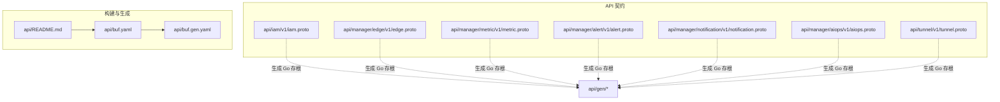
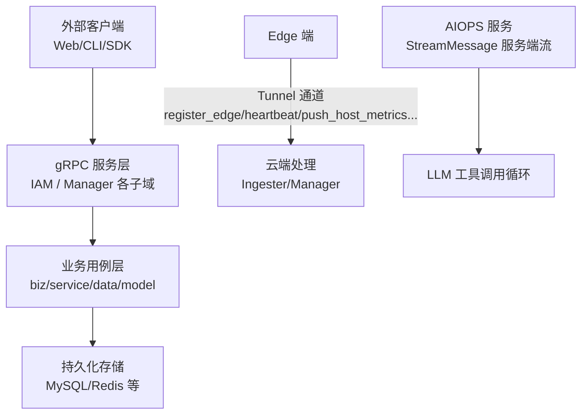
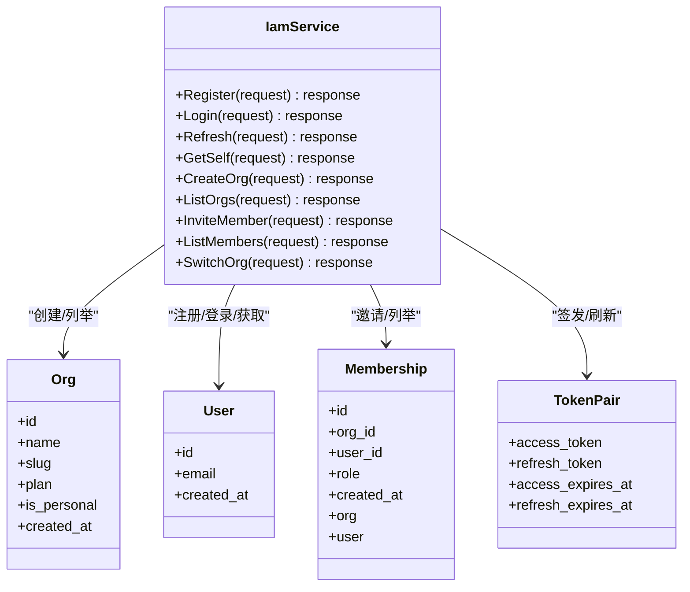
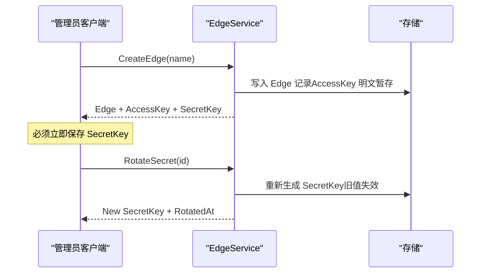
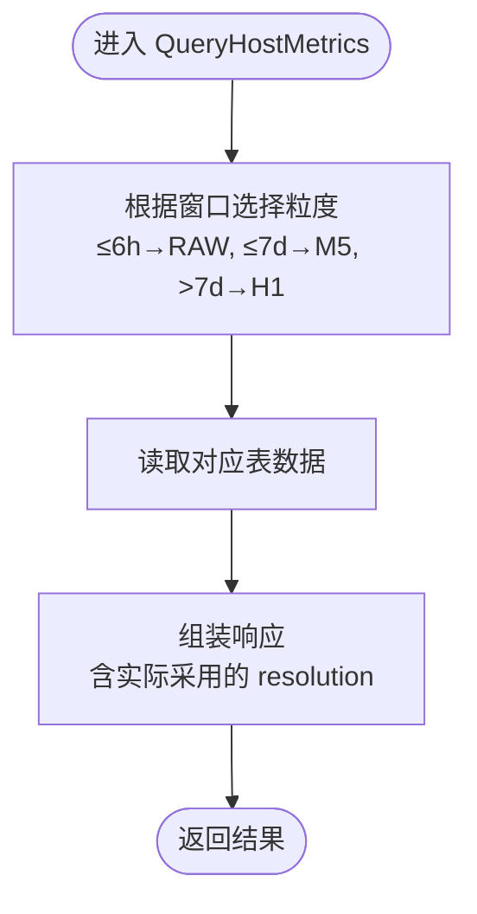
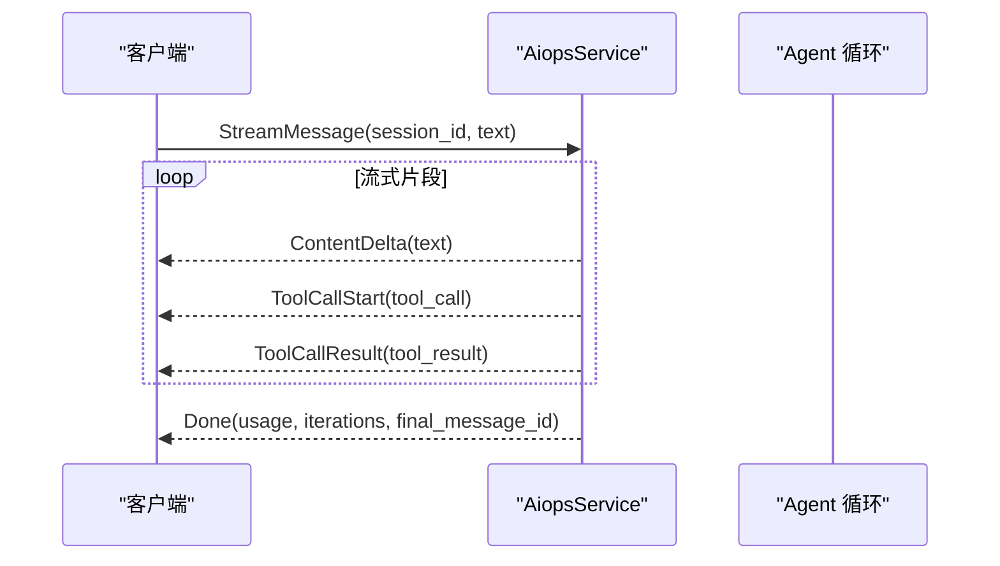
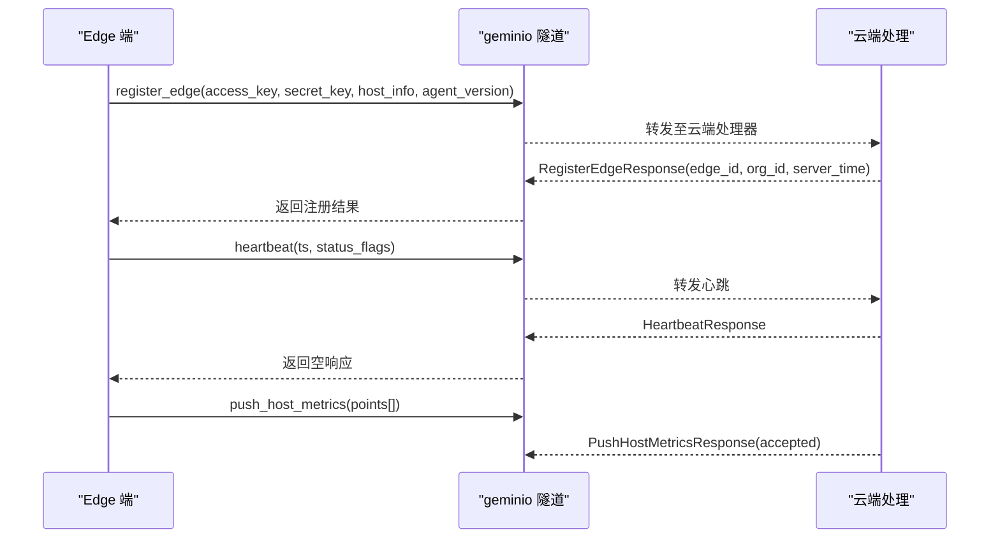
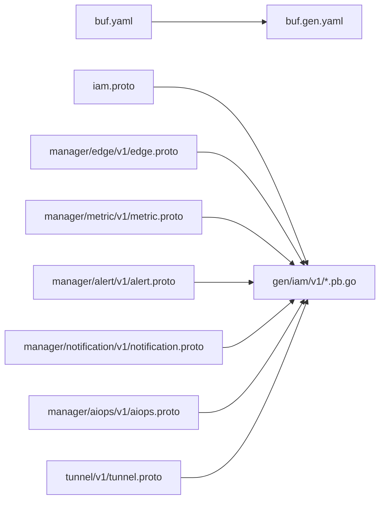

# gRPC服务

<cite>
**本文引用的文件**
- [api/README.md](file://api/README.md)
- [api/buf.yaml](file://api/buf.yaml)
- [api/buf.gen.yaml](file://api/buf.gen.yaml)
- [api/iam/v1/iam.proto](file://api/iam/v1/iam.proto)
- [api/manager/edge/v1/edge.proto](file://api/manager/edge/v1/edge.proto)
- [api/manager/metric/v1/metric.proto](file://api/manager/metric/v1/metric.proto)
- [api/manager/alert/v1/alert.proto](file://api/manager/alert/v1/alert.proto)
- [api/manager/notification/v1/notification.proto](file://api/manager/notification/v1/notification.proto)
- [api/manager/aiops/v1/aiops.proto](file://api/manager/aiops/v1/aiops.proto)
- [api/tunnel/v1/tunnel.proto](file://api/tunnel/v1/tunnel.proto)
</cite>

## 目录
1. [简介](#简介)
2. [项目结构](#项目结构)
3. [核心组件](#核心组件)
4. [架构总览](#架构总览)
5. [详细组件分析](#详细组件分析)
6. [依赖关系分析](#依赖关系分析)
7. [性能与可靠性](#性能与可靠性)
8. [安全与认证](#安全与认证)
9. [客户端代码生成与使用示例](#客户端代码生成与使用示例)
10. [故障排查指南](#故障排查指南)
11. [结论](#结论)

## 简介
本文件面向微服务开发者，系统化梳理仓库中的 gRPC 服务接口定义（proto），覆盖方法签名、消息类型与字段说明；阐述服务间通信协议、流式处理与双向通信模式；提供多语言客户端代码生成与使用指引；并给出错误码约定、重试策略、超时配置、性能调优建议、监控指标以及安全传输、TLS 配置与身份验证机制。

## 项目结构
API 契约以 proto 为单一事实来源，按业务域划分：
- IAM 服务：组织、用户与会话管理
- Manager 子域：边缘设备、指标、告警、通知、AIOPS
- Tunnel：边云隧道消息（非 gRPC，采用 geminio 通道）

图表来源
- [api/README.md:1-41](file://api/README.md#L1-L41)
- [api/buf.yaml:1-10](file://api/buf.yaml#L1-L10)
- [api/buf.gen.yaml:1-12](file://api/buf.gen.yaml#L1-L12)

章节来源
- [api/README.md:1-41](file://api/README.md#L1-L41)
- [api/buf.yaml:1-10](file://api/buf.yaml#L1-L10)
- [api/buf.gen.yaml:1-12](file://api/buf.gen.yaml#L1-L12)

## 核心组件
- IAM 服务：负责注册、登录、刷新令牌、获取当前用户信息、组织与成员管理、切换组织等。
- Edge 服务：管理 org 下的 edge 设备生命周期与密钥轮换。
- Metric 服务：查询主机时序指标，支持自动粒度选择。
- Alert 服务：事件列表、详情、确认与解决。
- Notification 服务：通知渠道的 CRUD 与测试。
- AIOPS 服务：对话会话管理与 Agent 驱动的消息发送，支持服务端流式返回。
- Tunnel 消息：边云双向通信载荷（非 gRPC），包含注册、心跳、指标上报、系统探测等。

章节来源
- [api/iam/v1/iam.proto:1-171](file://api/iam/v1/iam.proto#L1-L171)
- [api/manager/edge/v1/edge.proto:1-121](file://api/manager/edge/v1/edge.proto#L1-L121)
- [api/manager/metric/v1/metric.proto:1-55](file://api/manager/metric/v1/metric.proto#L1-L55)
- [api/manager/alert/v1/alert.proto:1-88](file://api/manager/alert/v1/alert.proto#L1-L88)
- [api/manager/notification/v1/notification.proto:1-91](file://api/manager/notification/v1/notification.proto#L1-L91)
- [api/manager/aiops/v1/aiops.proto:1-170](file://api/manager/aiops/v1/aiops.proto#L1-L170)
- [api/tunnel/v1/tunnel.proto:1-166](file://api/tunnel/v1/tunnel.proto#L1-L166)

## 架构总览
gRPC 服务由 Manager/IAM 进程对外暴露，Edge 通过 Tunnel 通道与云端交互。AIOPS 服务提供流式响应用于实时文本输出。

图表来源
- [api/manager/aiops/v1/aiops.proto:1-170](file://api/manager/aiops/v1/aiops.proto#L1-L170)
- [api/tunnel/v1/tunnel.proto:1-166](file://api/tunnel/v1/tunnel.proto#L1-L166)

## 详细组件分析

### IAM 服务（IamService）
- 职责：注册、登录、令牌刷新、获取当前用户、组织与成员管理、切换组织。
- 关键 RPC
  - Register(Login/Password) → User + PersonalOrg + TokenPair
  - Login(Email/Password) → User + TokenPair + ActiveOrg
  - Refresh(RefreshToken) → TokenPair
  - GetSelf() → User + Memberships
  - CreateOrg(Name, Slug) → Org + Membership(owner)
  - ListOrgs() → Org[]
  - InviteMember(org_id 来自 URL path) → Membership + InviteToken
  - ListMembers(org_id 来自 URL path) → Memberships + Total
  - SwitchOrg(RefreshToken, TargetOrgId) → TokenPair + ActiveOrg
- 领域模型
  - Org、User、Membership、TokenPair
- 约定
  - org_id/user_id 不从请求体传入，由 JWT claims 与 URL path 注入（见 README 约定）。

图表来源
- [api/iam/v1/iam.proto:1-171](file://api/iam/v1/iam.proto#L1-L171)

章节来源
- [api/iam/v1/iam.proto:1-171](file://api/iam/v1/iam.proto#L1-L171)
- [api/README.md:21-31](file://api/README.md#L21-L31)

### Edge 服务（EdgeService）
- 职责：在 org 下管理 edge 设备的注册、列表、详情、删除与密钥轮换。
- 关键 RPC
  - CreateEdge(name) → Edge + AccessKey + SecretKey（仅一次明文返回）
  - ListEdges(status_filter, page, page_size, name, hostname, ip) → Edges + Total + Page + PageSize
  - GetEdge(id) → Edge
  - DeleteEdge(id) → Empty
  - RotateSecret(id) → New SecretKey + RotatedAt
- 领域模型
  - EdgeStatus、HostInfo、Edge

图表来源
- [api/manager/edge/v1/edge.proto:1-121](file://api/manager/edge/v1/edge.proto#L1-L121)

章节来源
- [api/manager/edge/v1/edge.proto:1-121](file://api/manager/edge/v1/edge.proto#L1-L121)

### Metric 服务（MetricService）
- 职责：读取主机指标，粒度自动选择（RAW/M5/H1）。
- 关键 RPC
  - QueryHostMetrics(edge_id, from, to, resolution) → Resolution + Points[]
- 领域模型
  - Resolution、HostMetricPoint

图表来源
- [api/manager/metric/v1/metric.proto:1-55](file://api/manager/metric/v1/metric.proto#L1-L55)

章节来源
- [api/manager/metric/v1/metric.proto:1-55](file://api/manager/metric/v1/metric.proto#L1-L55)

### Alert 服务（AlertService）
- 职责：事件列表、详情、确认与解决。
- 关键 RPC
  - ListIncidents(status_filter, severity_filter, query, page, page_size) → Incidents + Total + Page + PageSize
  - GetIncident(id) → Incident
  - AcknowledgeIncident(id, note) → Incident
  - ResolveIncident(id, note) → Incident
- 领域模型
  - AlertSeverity、AlertIncidentStatus、AlertIncident

章节来源
- [api/manager/alert/v1/alert.proto:1-88](file://api/manager/alert/v1/alert.proto#L1-L88)

### Notification 服务（NotificationService）
- 职责：通知渠道的 CRUD 与测试。
- 关键 RPC
  - ListChannels(page, page_size) → Channels + Total + Page + PageSize
  - GetChannel(id) → Channel
  - CreateChannel(name, type, endpoint, enabled) → Channel
  - UpdateChannel(id, name, endpoint, enabled) → Channel
  - DeleteChannel(id) → Empty
  - TestChannel(id) → Accepted + Message
- 领域模型
  - NotificationChannelType、NotificationChannel

章节来源
- [api/manager/notification/v1/notification.proto:1-91](file://api/manager/notification/v1/notification.proto#L1-L91)

### AIOPS 服务（AiopsService）
- 职责：对话会话管理与 Agent 驱动的 tool-calling 循环，支持阻塞与流式两种模式。
- 关键 RPC
  - CreateChatSession(title, scope_edge_ids[]) → Session
  - ListChatSessions(page, page_size) → Sessions + Total + Page + PageSize
  - PostMessage(session_id, text) → Reply + ToolCalls + ToolResults + Usage + Iterations
  - StreamMessage(session_id, text) → stream StreamChunk
  - ListMessages(session_id, after_id, limit) → Messages
- 领域模型
  - ChatRole、ChatSession、ToolCall、ToolResult、ChatMessage、TokenUsage、StreamChunk（ContentDelta/ToolCallStart/ToolCallResult/Done）

图表来源
- [api/manager/aiops/v1/aiops.proto:1-170](file://api/manager/aiops/v1/aiops.proto#L1-L170)

章节来源
- [api/manager/aiops/v1/aiops.proto:1-170](file://api/manager/aiops/v1/aiops.proto#L1-L170)

### Tunnel 消息（非 gRPC）
- 说明：这些消息通过 geminio 隧道传输，MVP 阶段 JSON 编码，未来可切换为 proto 二进制。
- 方向与用途
  - edge → cloud：register_edge、heartbeat、push_host_metrics
  - cloud → edge：get_host_load、get_process_list、get_netstat
- 领域模型
  - HostInfo、HostMetricPoint、ProcessSortBy、ProcessInfo、ListeningSocket、EstablishedConnection

图表来源
- [api/tunnel/v1/tunnel.proto:1-166](file://api/tunnel/v1/tunnel.proto#L1-L166)

章节来源
- [api/tunnel/v1/tunnel.proto:1-166](file://api/tunnel/v1/tunnel.proto#L1-L166)

## 依赖关系分析
- 包命名与 go_package 约定：每个 service 的 messages 集中在一个 .proto 文件中，go_package 指向 api/gen/<path>/v1;<name>v1。
- 构建与生成：buf.yaml 启用 STANDARD lint 与 FILE breaking；buf.gen.yaml 生成 go 与 grpc/go 存根，要求实现未实现的服务器。
- 跨包引用：tunnel 刻意不 import manager 包，保持自包含与独立演进。

图表来源
- [api/buf.yaml:1-10](file://api/buf.yaml#L1-L10)
- [api/buf.gen.yaml:1-12](file://api/buf.gen.yaml#L1-L12)
- [api/README.md:21-31](file://api/README.md#L21-L31)

章节来源
- [api/README.md:1-41](file://api/README.md#L1-L41)
- [api/buf.yaml:1-10](file://api/buf.yaml#L1-L10)
- [api/buf.gen.yaml:1-12](file://api/buf.gen.yaml#L1-L12)

## 性能与可靠性
- 指标查询粒度选择：MetricService 按时间窗口自动选择 RAW/M5/H1，减少大窗口扫描成本。
- 批量上报：Tunnel push_host_metrics 支持批量点，服务端统计 accepted 条数便于观测吞吐。
- 流式输出：AIOPS StreamMessage 以 token-by-token 下发，降低首字节延迟，提升用户体验。
- 分页与过滤：Edge/List、Alert/List、Notification/List 均支持分页与过滤，避免一次性拉取大量数据。
- 连接与心跳：Tunnel heartbeat 周期性上报，便于快速发现离线节点。

[本节为通用指导，无需特定文件来源]

## 安全与认证
- 组织隔离：所有 RPC 的 org_id 不从请求体传入，由 JWT claims 与 URL path 注入，确保租户隔离。
- 令牌体系：IAM 提供 access_token 与 refresh_token，支持刷新与切换组织。
- 密钥安全：Edge SecretKey 仅在创建/旋转时明文返回一次，服务端仅存储哈希。
- TLS 与安全传输：生产环境建议启用 TLS；Prometheus 客户端示例展示了 TLS CA 与 Insecure 选项的使用方式（参考主进程初始化逻辑）。

章节来源
- [api/README.md:21-31](file://api/README.md#L21-L31)
- [api/iam/v1/iam.proto:1-171](file://api/iam/v1/iam.proto#L1-L171)
- [api/manager/edge/v1/edge.proto:1-121](file://api/manager/edge/v1/edge.proto#L1-L121)

## 客户端代码生成与使用示例
- 生成命令
  - 使用 buf 生成 Go 存根：make proto（详见 README）
  - 生成器配置：buf.gen.yaml 指定 go 与 grpc/go 插件，输出到 gen 目录
- 多语言支持
  - 可通过 buf 或 protoc 为 Python、Java 等语言生成客户端代码（需安装相应插件）
- 使用示例（概念性步骤）
  - 初始化 gRPC 连接（设置 TLS、超时、重试）
  - 构造请求对象（遵循 proto 字段名与类型）
  - 调用 RPC 并处理响应
  - 对流式 RPC（如 StreamMessage）逐块消费
- 注意事项
  - 严格遵循 README 约定的字段与组织隔离规则
  - 对敏感字段（SecretKey）进行最小化暴露与本地安全存储

章节来源
- [api/README.md:33-41](file://api/README.md#L33-L41)
- [api/buf.gen.yaml:1-12](file://api/buf.gen.yaml#L1-L12)

## 故障排查指南
- 常见问题定位
  - 认证失败：检查 JWT claims 中 org_id 是否正确注入；确认 access_token 是否过期并使用 refresh_token 刷新
  - 密钥问题：确认 Edge SecretKey 已正确保存且未被轮换；必要时调用 RotateSecret
  - 指标缺失：检查 Tunnel heartbeat 是否正常；确认 push_host_metrics 批次被接受（accepted 计数）
  - 流式中断：检查网络稳定性与服务端资源；合理设置客户端超时与重试
- 调试建议
  - 开启结构化日志与追踪（参考项目内 tracing/prom 集成思路）
  - 使用 Prometheus 与 Grafana 面板观察服务健康与吞吐

[本节为通用指导，无需特定文件来源]

## 结论
本项目以 proto 为中心定义 gRPC 服务契约，结合 buf 进行规范与生成，形成清晰的 API 边界与向后兼容保障。IAM 与 Manager 子域提供完整的控制面能力，AIOPS 支持流式交互，Tunnel 承载边云双向通信。建议在集成时严格遵循组织隔离与密钥安全约定，并结合流式与批量化特性优化性能与体验。

[本节为总结性内容，无需特定文件来源]