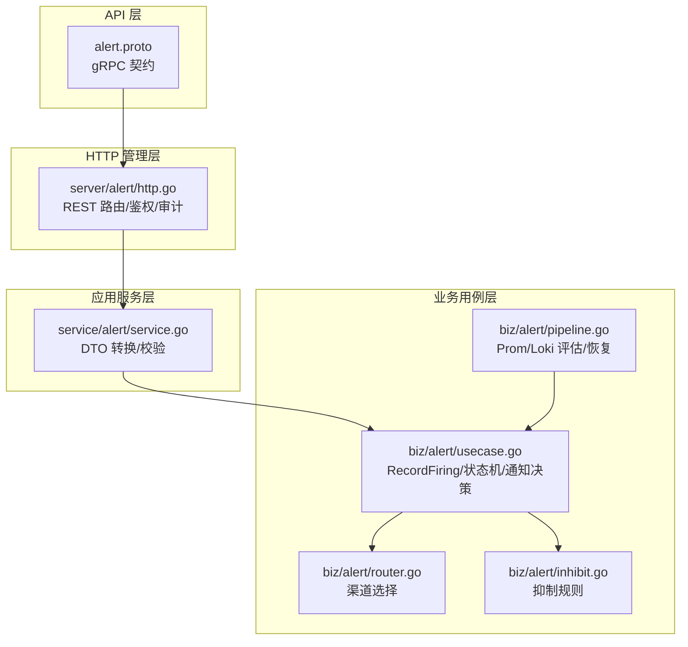
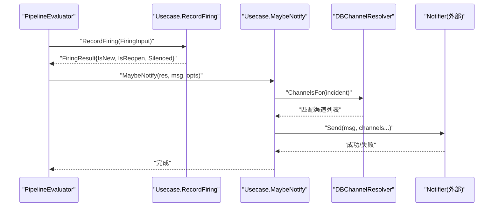
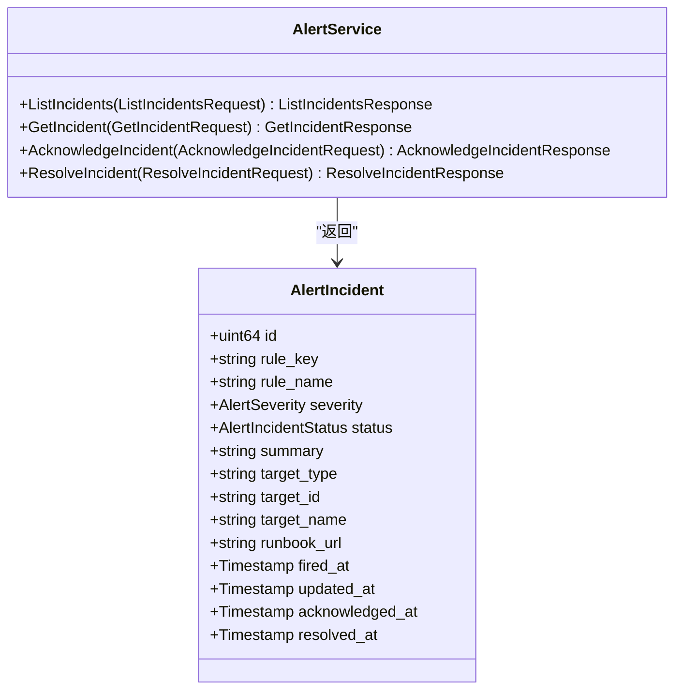
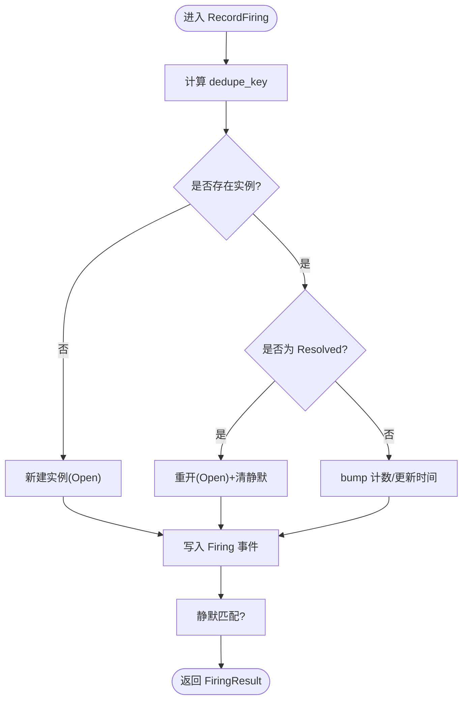
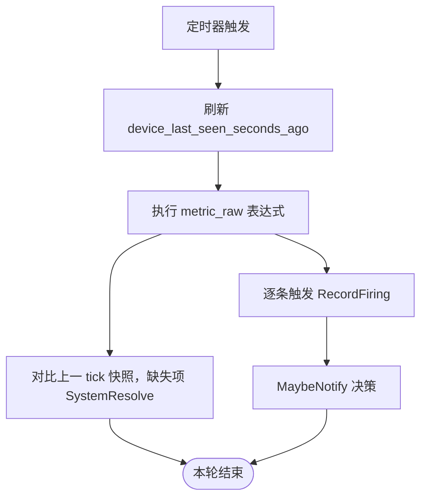
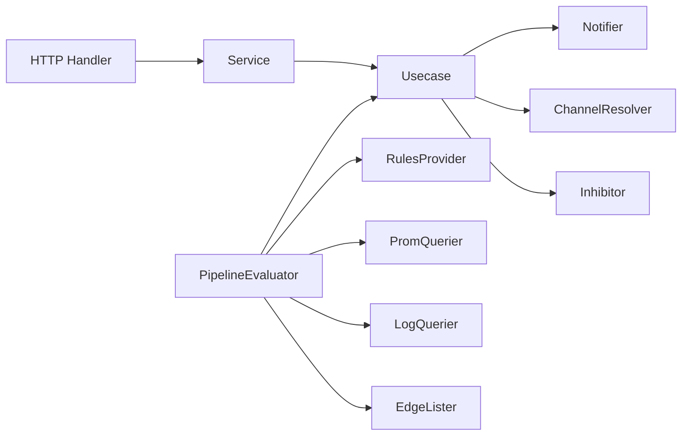

# 告警管理服务

<cite>
**本文引用的文件**   
- [alert.proto](file://api/manager/alert/v1/alert.proto)
- [service.go](file://internal/manager/service/alert/service.go)
- [http.go](file://internal/manager/server/alert/http.go)
- [usecase.go](file://internal/manager/biz/alert/usecase.go)
- [pipeline.go](file://internal/manager/biz/alert/pipeline.go)
- [router.go](file://internal/manager/biz/alert/router.go)
- [inhibit.go](file://internal/manager/biz/alert/inhibit.go)
</cite>

## 目录
1. [简介](#简介)
2. [项目结构](#项目结构)
3. [核心组件](#核心组件)
4. [架构总览](#架构总览)
5. [详细组件分析](#详细组件分析)
6. [依赖关系分析](#依赖关系分析)
7. [性能与容量规划](#性能与容量规划)
8. [故障排查指南](#故障排查指南)
9. [结论](#结论)
10. [附录：规则配置示例](#附录：规则配置示例)

## 简介
本文件面向“告警管理服务”，围绕 AlertService 的 RPC 接口、HTTP 管理面、业务用例（Usecase）、评估管线（Pipeline）、通知路由与抑制机制，系统阐述告警生命周期（触发、评估、抑制、恢复）以及聚合、去重、升级策略。文档同时提供告警规则配置要点与多渠道通知策略说明，并给出性能优化与容量规划建议。

## 项目结构
告警相关代码按分层组织：
- API 定义层：gRPC 服务契约（AlertService）
- HTTP 管理层：REST 接口与鉴权、审计
- 应用服务层（Service）：传输 DTO 与业务用例之间的适配与校验
- 业务用例层（Usecase）：核心领域逻辑（记录触发、状态变更、通知决策等）
- 评估管线（PipelineEvaluator）：定时轮询 Prom/Loki，驱动 metric_raw/log_* 等规则
- 通知路由与抑制：ChannelResolver、Inhibitor

图表来源
- [alert.proto:1-88](file://api/manager/alert/v1/alert.proto#L1-L88)
- [http.go:154-181](file://internal/manager/server/alert/http.go#L154-L181)
- [service.go:207-238](file://internal/manager/service/alert/service.go#L207-L238)
- [usecase.go:315-479](file://internal/manager/biz/alert/usecase.go#L315-L479)
- [router.go:31-111](file://internal/manager/biz/alert/router.go#L31-L111)
- [inhibit.go:25-74](file://internal/manager/biz/alert/inhibit.go#L25-L74)
- [pipeline.go:147-196](file://internal/manager/biz/alert/pipeline.go#L147-L196)

章节来源
- [alert.proto:1-88](file://api/manager/alert/v1/alert.proto#L1-L88)
- [http.go:154-181](file://internal/manager/server/alert/http.go#L154-L181)
- [service.go:207-238](file://internal/manager/service/alert/service.go#L207-L238)
- [usecase.go:315-479](file://internal/manager/biz/alert/usecase.go#L315-L479)
- [pipeline.go:147-196](file://internal/manager/biz/alert/pipeline.go#L147-L196)
- [router.go:31-111](file://internal/manager/biz/alert/router.go#L31-L111)
- [inhibit.go:25-74](file://internal/manager/biz/alert/inhibit.go#L25-L74)

## 核心组件
- gRPC AlertService：提供事件查询、确认、解决等能力（详见“API 定义”）。
- HTTP 管理面：提供告警实例、通知渠道、告警规则的 CRUD 与预览、测试投递等 REST 接口。
- Service 层：负责参数校验、DTO 转换、调用 Usecase 与 Repo。
- Usecase：实现 RecordFiring（去重/新建/重开）、Silence/Ack/Resolve 状态机、MaybeNotify（冷却/抑制/路由）、Delivery 记录等。
- PipelineEvaluator：定时轮询 Prom/Loki，执行 metric_raw/log_* 等规则，自动触发与恢复。
- ChannelResolver：基于全局过滤或规则级 pinning 选择通知渠道。
- Inhibitor：内置抑制规则（如 edge_offline 抑制同主机子告警）。

章节来源
- [alert.proto:9-14](file://api/manager/alert/v1/alert.proto#L9-L14)
- [http.go:154-181](file://internal/manager/server/alert/http.go#L154-L181)
- [service.go:207-238](file://internal/manager/service/alert/service.go#L207-L238)
- [usecase.go:315-479](file://internal/manager/biz/alert/usecase.go#L315-L479)
- [pipeline.go:147-196](file://internal/manager/biz/alert/pipeline.go#L147-L196)
- [router.go:31-111](file://internal/manager/biz/alert/router.go#L31-L111)
- [inhibit.go:25-74](file://internal/manager/biz/alert/inhibit.go#L25-L74)

## 架构总览
下图展示从评估到通知的关键路径：Pipeline 读取指标/日志 → 触发 RecordFiring → 可能触发通知 → 路由选择渠道 → 发送并记录投递结果。

图表来源
- [pipeline.go:254-380](file://internal/manager/biz/alert/pipeline.go#L254-L380)
- [usecase.go:315-479](file://internal/manager/biz/alert/usecase.go#L315-L479)
- [router.go:31-111](file://internal/manager/biz/alert/router.go#L31-L111)

## 详细组件分析

### gRPC AlertService 接口
- ListIncidents：分页查询告警实例，支持状态/严重级别/关键词过滤。
- GetIncident：按 ID 获取单个实例详情。
- AcknowledgeIncident：将实例置为已确认（可附备注）。
- ResolveIncident：将实例置为已解决（需备注）。

图表来源
- [alert.proto:9-88](file://api/manager/alert/v1/alert.proto#L9-L88)

章节来源
- [alert.proto:9-88](file://api/manager/alert/v1/alert.proto#L9-L88)

### HTTP 管理面（实例/渠道/规则）
- 实例：列表、详情、时间线、确认、解决、静默、手动触发 AI 调查。
- 渠道：列表、创建、更新、删除、测试投递。
- 规则：列表、详情、创建、更新、启用/禁用、删除、预览（试算）。

章节来源
- [http.go:154-181](file://internal/manager/server/alert/http.go#L154-L181)
- [http.go:254-555](file://internal/manager/server/alert/http.go#L254-L555)
- [http.go:557-700](file://internal/manager/server/alert/http.go#L557-L700)
- [http.go:701-800](file://internal/manager/server/alert/http.go#L701-L800)

### 应用服务层（Service）职责
- 入参校验（规则/渠道/实例操作）
- DTO 与模型互转
- 调用 Usecase 执行业务逻辑
- 错误码与边界处理（未连接、参数非法等）

章节来源
- [service.go:207-238](file://internal/manager/service/alert/service.go#L207-L238)
- [service.go:240-397](file://internal/manager/service/alert/service.go#L240-L397)
- [service.go:399-558](file://internal/manager/service/alert/service.go#L399-L558)
- [service.go:560-718](file://internal/manager/service/alert/service.go#L560-L718)
- [service.go:719-767](file://internal/manager/service/alert/service.go#L719-L767)

### 业务用例（Usecase）关键流程

#### 触发与去重（RecordFiring）
- 根据 dedupe_key 判断是否已有实例；不存在则新建，存在则 bump 计数与更新时间。
- 若原实例为已解决，则重开（reopen），清除静默标记。
- 写入 firing/reopened 事件，供时间线与度量统计使用。
- 可选：新实例触发 AI 调查与自动化工作流（非阻塞）。

图表来源
- [usecase.go:315-479](file://internal/manager/biz/alert/usecase.go#L315-L479)

章节来源
- [usecase.go:315-479](file://internal/manager/biz/alert/usecase.go#L315-L479)

#### 状态变更（确认/解决/静默）
- Ack：记录 Acknowledged 事件，更新状态。
- Resolve：校验备注，记录 Resolved 事件。
- Silence：解析 until（支持相对时长/RFC3339/unix），创建静默规则并记录 Silenced 事件。

章节来源
- [usecase.go:152-211](file://internal/manager/biz/alert/usecase.go#L152-L211)
- [usecase.go:223-251](file://internal/manager/biz/alert/usecase.go#L223-L251)

#### 通知决策（MaybeNotify）
- 冷却门控：基于 last_notified_at 与规则级「发送策略」（窗口+最小触发次数）决定是否跳过。
- 抑制门控：BuiltinInhibitor 对高优根因进行抑制。
- 路由选择：DBChannelResolver 依据全局过滤或规则级 pinning 选择渠道。
- 投递记录：RecordDelivery/FinishDelivery 持久化每次投递尝试与结果。

章节来源
- [usecase.go:501-573](file://internal/manager/biz/alert/usecase.go#L501-L573)
- [inhibit.go:25-74](file://internal/manager/biz/alert/inhibit.go#L25-L74)
- [router.go:31-111](file://internal/manager/biz/alert/router.go#L31-L111)

### 评估管线（PipelineEvaluator）
- 定时 tick（默认 5 分钟，可配），依次执行：
  - 刷新设备离线 gauge（device_last_seen_seconds_ago）
  - metric_raw：直接执行 PromQL 表达式，返回向量即“条件满足”，逐条触发；缺失项自动恢复
  - metric_anomaly / metric_forecast / metric_burn_rate / trace_*：按需执行
  - log_match / log_volume：通过 Loki range 查询
- 恢复机制：比较上一 tick 的 firing snapshot，当前缺失的 dedupe_key 对应实例将被系统自动 resolve。

图表来源
- [pipeline.go:147-196](file://internal/manager/biz/alert/pipeline.go#L147-L196)
- [pipeline.go:254-380](file://internal/manager/biz/alert/pipeline.go#L254-L380)

章节来源
- [pipeline.go:147-196](file://internal/manager/biz/alert/pipeline.go#L147-L196)
- [pipeline.go:254-380](file://internal/manager/biz/alert/pipeline.go#L254-L380)

### 通知路由与抑制
- 路由策略：
  - 规则级 pinning：优先命中指定 channel ids（仍受 enabled 控制）
  - 全局过滤：按 severity/scope_type 筛选
  - 无匹配时回退到环境变量配置的默认渠道名
- 抑制规则：
  - 主机维度：edge_offline 活跃时抑制该主机下多数 host:* 告警
  - 管道维度：prom_ingest_fail 活跃时抑制 pipeline:scrape_down:* 告警

章节来源
- [router.go:31-111](file://internal/manager/biz/alert/router.go#L31-L111)
- [inhibit.go:25-74](file://internal/manager/biz/alert/inhibit.go#L25-L74)

## 依赖关系分析
- HTTP Handler 依赖 Service 接口（Incident/Channel/Rule）
- Service 依赖 biz.Usecase 与 Repo（数据访问）
- Usecase 依赖 Notifier、ChannelResolver、Inhibitor、Investigator、WorkflowDispatcher（可选）
- PipelineEvaluator 依赖 RulesProvider、PromQuerier、LogQuerier、EdgeLister、Notifier、ChannelResolver、Inhibitor

图表来源
- [http.go:106-152](file://internal/manager/server/alert/http.go#L106-L152)
- [service.go:207-238](file://internal/manager/service/alert/service.go#L207-L238)
- [usecase.go:73-103](file://internal/manager/biz/alert/usecase.go#L73-L103)
- [pipeline.go:82-145](file://internal/manager/biz/alert/pipeline.go#L82-L145)

章节来源
- [http.go:106-152](file://internal/manager/server/alert/http.go#L106-L152)
- [service.go:207-238](file://internal/manager/service/alert/service.go#L207-L238)
- [usecase.go:73-103](file://internal/manager/biz/alert/usecase.go#L73-L103)
- [pipeline.go:82-145](file://internal/manager/biz/alert/pipeline.go#L82-L145)

## 性能与容量规划
- 评估间隔与冷却
  - 评估间隔（Interval）与通知冷却（Cooldown）可按规模调优；过小会放大下游压力，过大影响时效性。
- 规则数量与表达式复杂度
  - metric_raw 表达式应尽量简洁，避免全表扫描；合理设置 window/for/aggregator 以降低 Prom 负载。
- 去重键设计
  - 使用稳定的 label 组合构建 dedupe_key，避免高频抖动导致频繁重开/重发。
- 抑制与静默
  - 利用抑制规则减少风暴；对已知维护窗口使用静默，降低无效通知。
- 通知通道
  - 批量合并与重试退避由上层 Notifier 实现；建议为慢通道设置超时与限流。
- 存储与索引
  - 事件与投递记录持续增长，需关注数据库写入吞吐与查询延迟；必要时归档历史数据。

[本节为通用指导，不直接分析具体文件]

## 故障排查指南
- 常见错误
  - 未连接（ErrNotWiredYet）：Service/Usecase 未正确注入依赖，检查构造与装配。
  - 参数非法（ErrInvalid）：必填字段缺失、格式不正确（如 until 解析失败）。
  - 冲突（ErrConflict）：rule_key 重复。
  - 权限不足（ErrForbidden）：删除内置规则。
- 定位步骤
  - 查看实例时间线（events）确认触发/静默/投递结果。
  - 检查渠道测试响应（TestChannel）与上游返回信息。
  - 核对规则预览（PreviewRule）与 Prom/Loki 实际查询结果。
  - 观察抑制与冷却是否生效（silenced_by、repeat_suppressed 事件）。

章节来源
- [service.go:240-397](file://internal/manager/service/alert/service.go#L240-L397)
- [service.go:399-558](file://internal/manager/service/alert/service.go#L399-L558)
- [service.go:560-718](file://internal/manager/service/alert/service.go#L560-L718)
- [usecase.go:315-479](file://internal/manager/biz/alert/usecase.go#L315-L479)

## 结论
本服务以清晰的层次划分与可扩展的接口设计，实现了从规则评估、触发、去重、抑制、恢复到通知投递的完整闭环。通过规则级 pinning、全局过滤与内置抑制规则，兼顾灵活性与稳定性；结合冷却与静默机制，有效缓解告警风暴。建议在大规模场景下重点关注表达式复杂度、评估间隔与冷却策略，并结合抑制/静默策略提升整体可观测性与运维效率。

[本节为总结，不直接分析具体文件]

## 附录：规则配置示例
以下为常用规则类型的配置要点（字段含义参见各层 DTO/Model 定义）：
- 指标阈值（metric_threshold，UI 友好表单）
  - kind: metric_threshold
  - conditions[]: 包含 metric/operator/threshold/window/for/aggregator 等
  - severity: info/warning/critical
  - labels/runbook_url: 附加标签与处置手册链接
  - notify_channel_ids: 可选，规则级绑定通知渠道
  - notify_window_seconds/notify_min_fires: 发送策略（窗口内最少触发次数）
- 原始指标（metric_raw）
  - kind: metric_raw
  - spec: 包含 promql 表达式（由 UI 的 metric_threshold 编译而来）
- 日志匹配/日志量（log_match/log_volume）
  - kind: log_match 或 log_volume
  - spec: 包含 LogQL 查询与阈值/步长等
- 异常/预测/燃烧率（metric_anomaly/metric_forecast/metric_burn_rate）
  - kind: 对应类型
  - spec: 包含算法参数与窗口等

提示：
- 在创建/更新前可使用 PreviewRule 进行试算，验证表达式与阈值。
- 对于主机类规则，确保 label 中包含 device_id，以便正确关联目标。
- 多渠道通知可通过全局过滤或规则级 pinning 实现；测试投递用于快速验证链路。

章节来源
- [service.go:121-173](file://internal/manager/service/alert/service.go#L121-L173)
- [service.go:560-718](file://internal/manager/service/alert/service.go#L560-L718)
- [usecase.go:575-800](file://internal/manager/biz/alert/usecase.go#L575-L800)