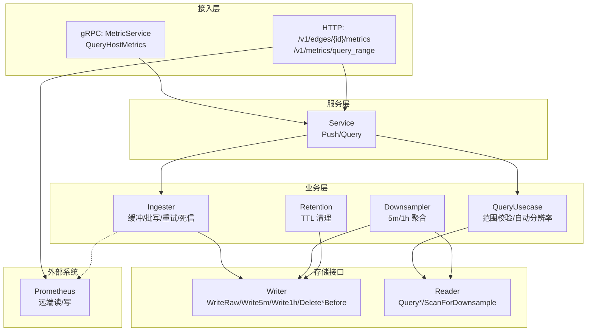
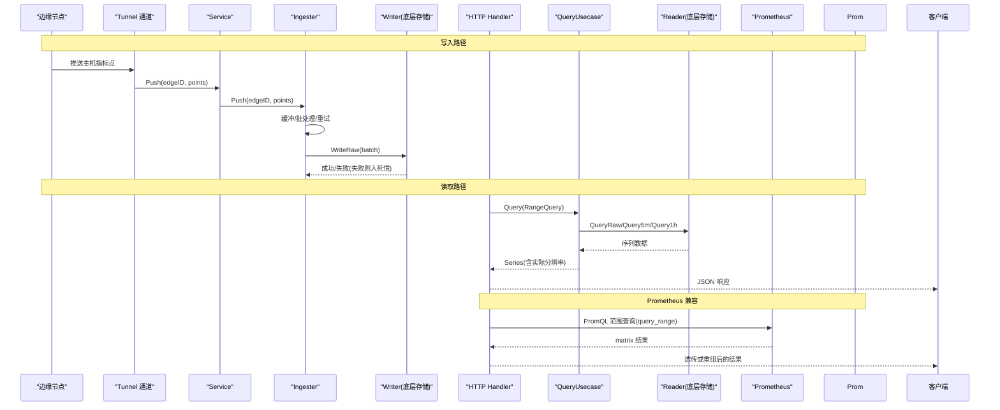
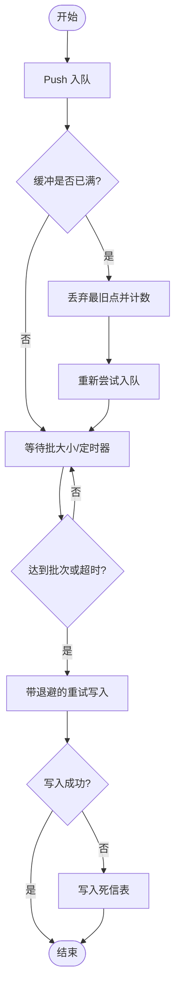
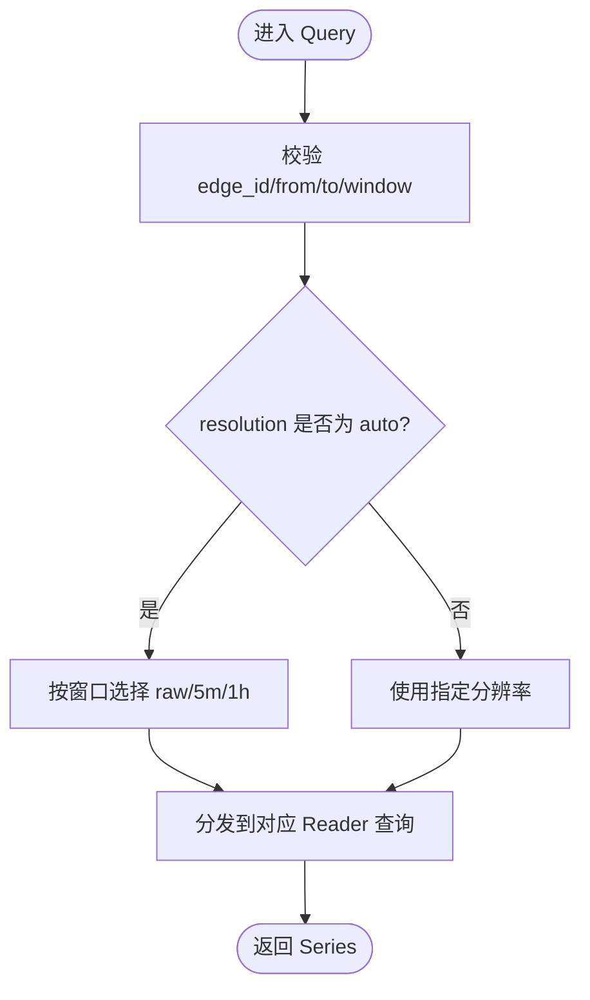
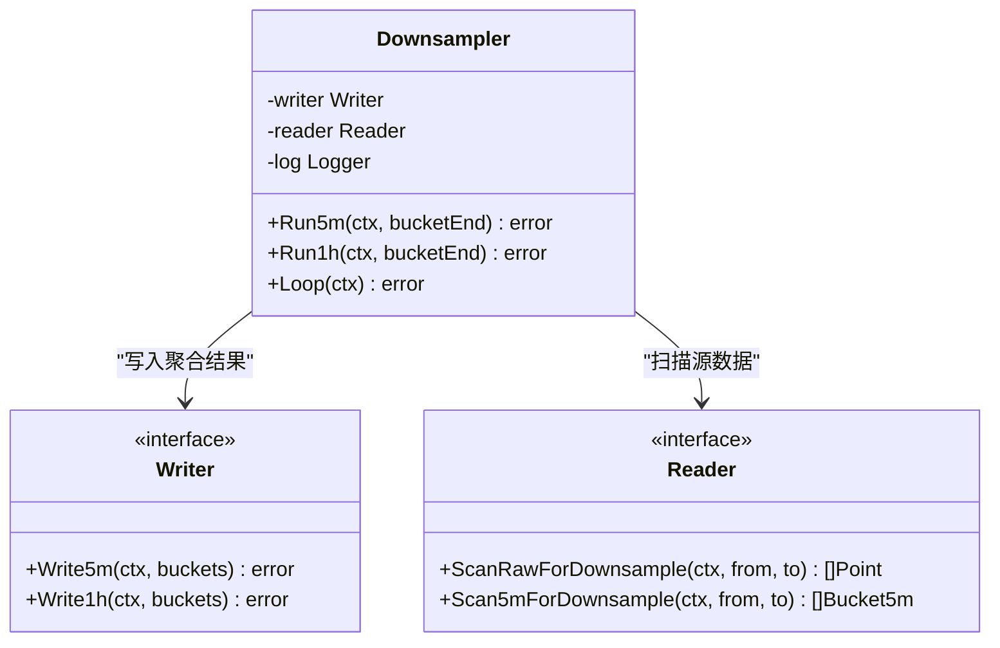
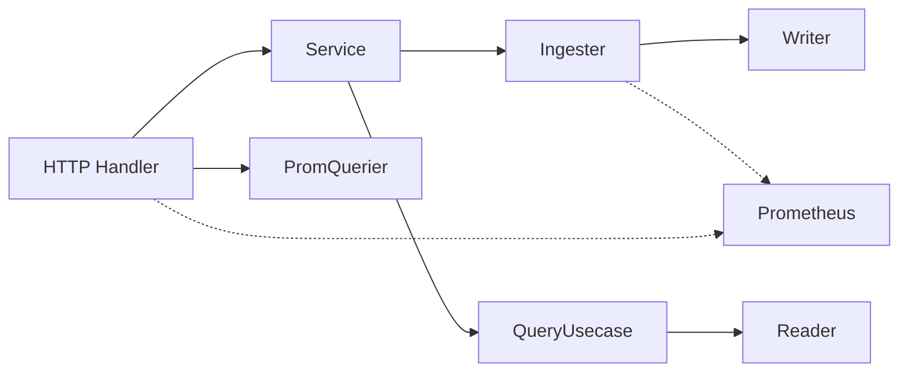

# 指标收集服务

<cite>
**本文引用的文件**   
- [metric.proto](file://api/manager/metric/v1/metric.proto)
- [doc.go](file://internal/manager/biz/metric/doc.go)
- [ingester.go](file://internal/manager/biz/metric/ingester.go)
- [query.go](file://internal/manager/biz/metric/query.go)
- [repo.go](file://internal/manager/biz/metric/repo.go)
- [downsample.go](file://internal/manager/biz/metric/downsample.go)
- [retention.go](file://internal/manager/biz/metric/retention.go)
- [service.go](file://internal/manager/service/metric/service.go)
- [http.go](file://internal/manager/server/metric/http.go)
- [prom_handler.go](file://internal/manager/server/metric/prom_handler.go)
- [main.go](file://cmd/ongrid/main.go)
</cite>

## 目录
1. [简介](#简介)
2. [项目结构](#项目结构)
3. [核心组件](#核心组件)
4. [架构总览](#架构总览)
5. [详细组件分析](#详细组件分析)
6. [依赖关系分析](#依赖关系分析)
7. [性能与容量规划](#性能与容量规划)
8. [故障排查指南](#故障排查指南)
9. [结论](#结论)
10. [附录](#附录)

## 简介
本文件面向“指标收集服务”的 MetricService 及其周边能力，覆盖以下主题：
- RPC/HTTP 接口：指标写入、查询、聚合等
- 时序数据模型与标签体系：点、桶、时间粒度、自动分辨率选择
- 存储与高并发写入：缓冲、批处理、重试与死信
- 降采样与归档：5m/1h 聚合、保留策略
- Prometheus 生态兼容：远端读写 API 支持、PromQL 透传
- 采集示例：Push 模式（Edge → Manager）与 Pull 模式（Manager → Prometheus）
- 性能调优与容量规划建议

## 项目结构
指标子域采用分层设计：server（HTTP/gRPC 路由）、service（薄封装）、biz（业务用例）、data（持久化接口）。关键路径如下：
- gRPC 定义：MetricService 仅暴露读取能力；写入通过 Edge Tunnel + Ingester 完成
- HTTP 读取：/v1/edges/{id}/metrics 与 /v1/metrics/query_range
- 写入路径：Edge 推送主机指标 → Service.Push → Ingester 缓冲/批写 → Writer
- 聚合与归档：Downsampler 定时生成 5m/1h 桶；Retention 定期清理过期数据

图表来源
- [metric.proto:12-17](file://api/manager/metric/v1/metric.proto#L12-L17)
- [prom_handler.go:71-74](file://internal/manager/server/metric/prom_handler.go#L71-L74)
- [service.go:18-48](file://internal/manager/service/metric/service.go#L18-L48)
- [ingester.go:15-50](file://internal/manager/biz/metric/ingester.go#L15-L50)
- [query.go:56-133](file://internal/manager/biz/metric/query.go#L56-L133)
- [downsample.go:15-34](file://internal/manager/biz/metric/downsample.go#L15-L34)
- [retention.go:12-45](file://internal/manager/biz/metric/retention.go#L12-L45)
- [repo.go:16-52](file://internal/manager/biz/metric/repo.go#L16-L52)

章节来源
- [doc.go:1-7](file://internal/manager/biz/metric/doc.go#L1-L7)

## 核心组件
- gRPC MetricService：提供 QueryHostMetrics，按窗口自动选择 raw/5m/1h 表返回时序点。写入不经过此服务。
- HTTP 读取：
  - /v1/edges/{id}/metrics：将 PromQL 矩阵结果重组为历史 pointDTO 形状，兼容前端面板
  - /v1/metrics/query_range：对 PromQL 做鉴权后的范围查询透传
- Service 层：统一入口，Push 委托给 Ingester，Query 委托给 QueryUsecase
- Ingester：非阻塞 Push，缓冲队列、批量落盘、指数退避重试、失败入死信
- QueryUsecase：参数校验、自动分辨率选择（≤6h→raw，≤7d→5m，>7d→1h），调用 Reader
- Downsampler：定时扫描 raw/5m 并聚合出 5m/1h 桶
- Retention：按 TTL 分批删除过期数据（raw 7d，5m 90d，1h 365d）
- Writer/Reader：存储无关接口，屏蔽底层实现细节

章节来源
- [metric.proto:12-17](file://api/manager/metric/v1/metric.proto#L12-L17)
- [prom_handler.go:71-74](file://internal/manager/server/metric/prom_handler.go#L71-L74)
- [service.go:18-48](file://internal/manager/service/metric/service.go#L18-L48)
- [ingester.go:15-50](file://internal/manager/biz/metric/ingester.go#L15-L50)
- [query.go:70-133](file://internal/manager/biz/metric/query.go#L70-L133)
- [downsample.go:15-34](file://internal/manager/biz/metric/downsample.go#L15-L34)
- [retention.go:22-45](file://internal/manager/biz/metric/retention.go#L22-L45)
- [repo.go:16-52](file://internal/manager/biz/metric/repo.go#L16-L52)

## 架构总览
下图展示从 Edge 到 Manager 的写入流，以及 Manager 对外提供的读取流与 Prometheus 集成。

图表来源
- [service.go:37-48](file://internal/manager/service/metric/service.go#L37-L48)
- [ingester.go:163-247](file://internal/manager/biz/metric/ingester.go#L163-L247)
- [query.go:70-133](file://internal/manager/biz/metric/query.go#L70-L133)
- [prom_handler.go:71-74](file://internal/manager/server/metric/prom_handler.go#L71-L74)
- [prom_handler.go:319-393](file://internal/manager/server/metric/prom_handler.go#L319-L393)

## 详细组件分析

### gRPC 接口：MetricService
- 方法
  - QueryHostMetrics(QueryHostMetricsRequest) → QueryHostMetricsResponse
- 请求字段
  - edge_id：目标边缘节点标识
  - from/to：时间区间（RFC3339 语义）
  - resolution：RESOLUTION_AUTO | RESOLUTION_RAW | RESOLUTION_M5 | RESOLUTION_H1
- 响应字段
  - edge_id
  - resolution：实际采用的粒度（即便请求 AUTO，也回显真实选择的表）
  - points：HostMetricPoint 列表
- HostMetricPoint 字段
  - ts、cpu_pct、mem_pct、load1/5/15、net_rx_bps/net_tx_bps、disk_used_pct

说明
- 写入不走此 service，遵循 ADR-004 的设计约束
- org_id 由 URL path 与 JWT claims 取（ADR-003）

章节来源
- [metric.proto:12-55](file://api/manager/metric/v1/metric.proto#L12-L55)

### HTTP 接口
- GET /v1/edges/{id}/metrics
  - 查询某 edge 在 [from,to] 区间的时序点
  - 支持 resolution=auto|raw|5m|1h（或具体步长如 15s/30s/1m/5m/30m/1h）
  - 内部通过 PromQL 并行查询并重组为历史 pointDTO 形状，保持前端兼容
- GET /v1/metrics/query_range
  - 鉴权后的 PromQL 透传接口，返回 matrix 原始结果，便于多维度面板

章节来源
- [http.go:38-41](file://internal/manager/server/metric/http.go#L38-L41)
- [prom_handler.go:71-74](file://internal/manager/server/metric/prom_handler.go#L71-L74)
- [prom_handler.go:76-226](file://internal/manager/server/metric/prom_handler.go#L76-L226)
- [prom_handler.go:319-393](file://internal/manager/server/metric/prom_handler.go#L319-L393)

### 写入路径：Service.Push → Ingester
- Service.Push 接收 Edge 推送的主机指标点，直接委托 Ingester
- Ingester
  - 非阻塞 Push：满缓冲时丢弃最旧点并计数
  - 批处理：达到 batchSz 或 flushAt 超时即触发 flush
  - 重试：100ms/500ms/2s 指数退避
  - 死信：全部重试失败后写入死信表，附带原因
  - 指标：ongrid_ingest_writes_total、ongrid_ingest_flush_failures_total、ongrid_ingest_dropped_total、ongrid_ingest_batch_size

图表来源
- [ingester.go:163-247](file://internal/manager/biz/metric/ingester.go#L163-L247)

章节来源
- [service.go:37-42](file://internal/manager/service/metric/service.go#L37-L42)
- [ingester.go:15-50](file://internal/manager/biz/metric/ingester.go#L15-L50)
- [ingester.go:120-161](file://internal/manager/biz/metric/ingester.go#L120-L161)
- [ingester.go:200-247](file://internal/manager/biz/metric/ingester.go#L200-L247)

### 查询路径：Service.Query → QueryUsecase
- 参数校验：edge_id 必填、from < to、窗口 ≤ 365 天
- 自动分辨率：
  - window ≤ 6h → raw
  - window ≤ 7d → 5m
  - 否则 → 1h
- 根据分辨率调用 Reader.QueryRaw/Query5m/Query1h，返回 Series（包含实际分辨率与对应数据）

图表来源
- [query.go:70-133](file://internal/manager/biz/metric/query.go#L70-L133)

章节来源
- [service.go:44-48](file://internal/manager/service/metric/service.go#L44-L48)
- [query.go:70-133](file://internal/manager/biz/metric/query.go#L70-L133)

### 降采样：Downsampler
- Run5m：扫描 raw 点，按 edge_id 分组计算 avg/max/sum，输出 Bucket5m
- Run1h：扫描 5m 桶，按 edge_id 分组计算平均/最大/求和，输出 Bucket1h
- Loop：对齐墙钟边界，每 5 分钟执行一次 5m 聚合，每小时执行一次 1h 聚合

图表来源
- [downsample.go:15-34](file://internal/manager/biz/metric/downsample.go#L15-L34)
- [downsample.go:41-80](file://internal/manager/biz/metric/downsample.go#L41-L80)
- [downsample.go:82-115](file://internal/manager/biz/metric/downsample.go#L82-L115)
- [repo.go:45-52](file://internal/manager/biz/metric/repo.go#L45-L52)

章节来源
- [downsample.go:117-274](file://internal/manager/biz/metric/downsample.go#L117-L274)

### 保留策略：Retention
- 默认 TTL：raw 7 天、5m 90 天、1h 365 天
- 每日 UTC 03:00 执行一次清理，按 limit 分批删除，直到无更多行可删
- 错误不影响其他层级继续执行

章节来源
- [retention.go:22-45](file://internal/manager/biz/metric/retention.go#L22-L45)
- [retention.go:47-93](file://internal/manager/biz/metric/retention.go#L47-L93)

### 与 Prometheus 生态的兼容性
- 远端写入（Push 模式）
  - Edge 侧采集主机指标，经 Tunnel 推送到 Manager
  - Manager 的 Ingester 负责缓冲、批写与重试；同时可将样本转发至云 Prometheus（当启用）
- 远端读取（Pull 模式）
  - HTTP 接口 /v1/metrics/query_range 作为鉴权后的 PromQL 透传
  - /v1/edges/{id}/metrics 基于 PromQL 并行查询并重组为历史 pointDTO 形状，兼容前端
- 配置与解析
  - 云端 Prometheus 客户端在运行时从系统设置中解析地址，支持环境变量兜底，UI 修改无需重启

章节来源
- [prom_handler.go:71-74](file://internal/manager/server/metric/prom_handler.go#L71-L74)
- [prom_handler.go:319-393](file://internal/manager/server/metric/prom_handler.go#L319-L393)
- [main.go:1067-1087](file://cmd/ongrid/main.go#L1067-L1087)

## 依赖关系分析
- 组件耦合
  - Service 仅依赖 biz.IngestService 与 biz.QueryUsecase，避免直连 data 层
  - Ingester 依赖 Writer 接口，屏蔽存储实现
  - QueryUsecase 依赖 Reader 接口，屏蔽存储实现
  - HTTP 处理器依赖 PromQuerier 与可选的 HostDeviceResolver
- 外部依赖
  - Prometheus 客户端用于远端读写与 PromQL 查询
  - 日志与监控指标通过 slog 与 prometheus 注册器暴露

图表来源
- [service.go:18-48](file://internal/manager/service/metric/service.go#L18-L48)
- [ingester.go:15-50](file://internal/manager/biz/metric/ingester.go#L15-L50)
- [query.go:56-68](file://internal/manager/biz/metric/query.go#L56-L68)
- [repo.go:16-52](file://internal/manager/biz/metric/repo.go#L16-L52)
- [prom_handler.go:25-63](file://internal/manager/server/metric/prom_handler.go#L25-L63)

章节来源
- [repo.go:16-52](file://internal/manager/biz/metric/repo.go#L16-L52)
- [prom_handler.go:25-63](file://internal/manager/server/metric/prom_handler.go#L25-L63)

## 性能与容量规划
- 写入吞吐
  - 调整 Ingester 的批大小与刷新间隔以平衡延迟与吞吐
  - 监控 ongrid_ingest_batch_size 与 ongrid_ingest_dropped_total，评估是否需要扩容缓冲或提升下游写入能力
- 查询性能
  - 合理设置 resolution 与 step，避免过大窗口导致过多数据拉取
  - 利用自动分辨率规则减少跨表扫描
- 降采样与归档
  - 5m/1h 聚合降低长期查询成本
  - 按 TTL 定期清理，控制磁盘增长
- Prometheus 集成
  - 限制 PromQL 表达式长度，避免大查询压垮后端
  - 合理设置 query_range 的 step，兼顾精度与负载

[本节为通用指导，不直接分析具体文件]

## 故障排查指南
- 写入失败
  - 关注 ongrid_ingest_flush_failures_total 与死信表记录，定位 write_error 或 ctx_cancel 原因
  - 检查 Writer 实现与底层存储状态
- 缓冲溢出
  - ongrid_ingest_dropped_total 上升表示缓冲不足，需增大缓冲或优化下游写入
- 查询为空
  - 确认 edge_id/device_id 标签映射是否正确（PromHandler 会优先用 device_id）
  - 检查 Prometheus 是否可用且已采集到相关指标
- 权限与鉴权
  - HTTP 接口受鉴权中间件保护，确保用户具备访问权限

章节来源
- [ingester.go:200-247](file://internal/manager/biz/metric/ingester.go#L200-L247)
- [prom_handler.go:109-131](file://internal/manager/server/metric/prom_handler.go#L109-L131)

## 结论
该指标收集服务通过清晰的层次划分与接口抽象，实现了高并发写入、高效查询与良好的可扩展性。结合自动分辨率、降采样与保留策略，能够在保证实时性的同时控制长期存储成本。与 Prometheus 生态的兼容使得现有工具链无缝对接，便于快速落地与运维。

[本节为总结，不直接分析具体文件]

## 附录

### 指标数据类型与标签体系
- 点类型（HostMetricPoint）
  - 时间戳与常用主机指标：CPU、内存、负载、网络收发、磁盘使用率
- 桶类型（Bucket5m/Bucket1h）
  - 按 edge_id 分组的聚合结果，包含平均值、最大值与计数器求和
- 标签体系
  - 写入 Prometheus 时使用 device_id 标签；HTTP 读取时若无法解析 device_id，则回退到 edge_id

章节来源
- [metric.proto:28-40](file://api/manager/metric/v1/metric.proto#L28-L40)
- [prom_handler.go:114-131](file://internal/manager/server/metric/prom_handler.go#L114-L131)

### 时间序列管理与自动分辨率
- 自动分辨率规则
  - ≤6h → raw；≤7d → 5m；>7d → 1h
- 查询返回实际使用的分辨率，便于前端自适应渲染

章节来源
- [query.go:122-133](file://internal/manager/biz/metric/query.go#L122-L133)
- [metric.proto:19-26](file://api/manager/metric/v1/metric.proto#L19-L26)

### 采集示例
- Push 模式（Edge → Manager）
  - Edge 通过 Tunnel 推送主机指标点
  - Manager 的 Service.Push 接收并交由 Ingester 异步批写
- Pull 模式（Manager → Prometheus）
  - 通过 /v1/metrics/query_range 发起 PromQL 范围查询
  - 或通过 /v1/edges/{id}/metrics 获取预定义的 host metrics 视图

章节来源
- [service.go:37-48](file://internal/manager/service/metric/service.go#L37-L48)
- [prom_handler.go:71-74](file://internal/manager/server/metric/prom_handler.go#L71-L74)
- [prom_handler.go:319-393](file://internal/manager/server/metric/prom_handler.go#L319-L393)