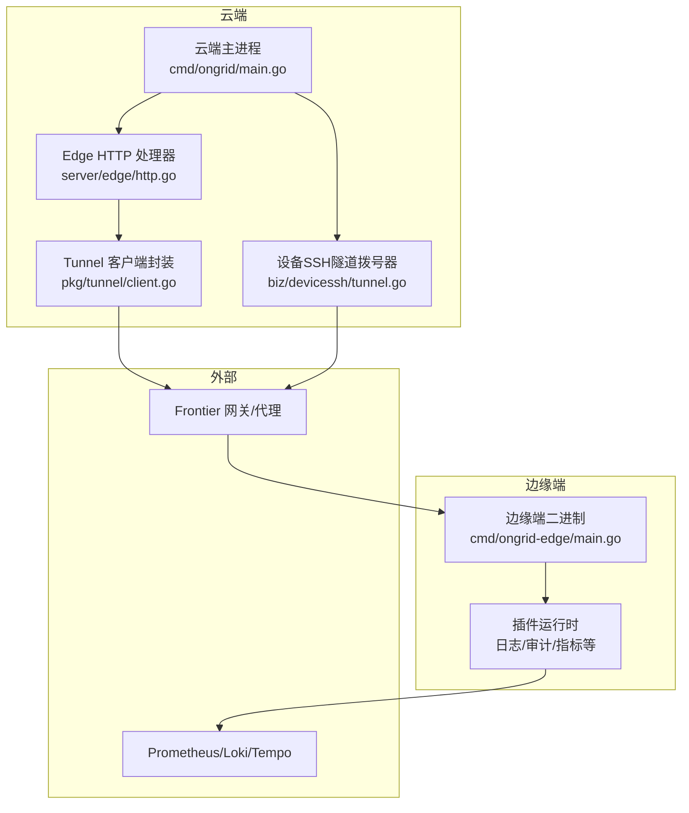
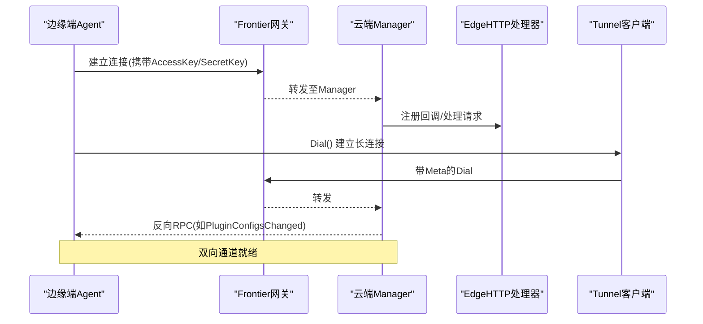
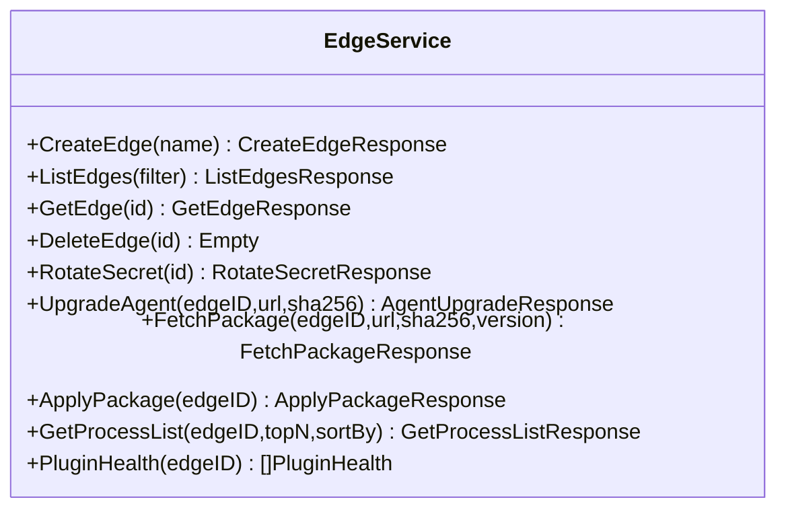
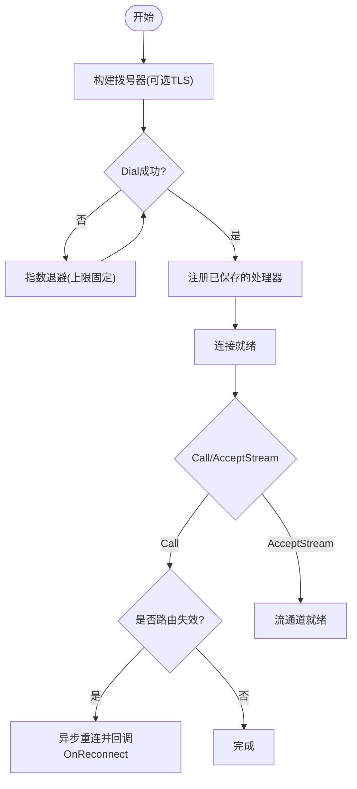
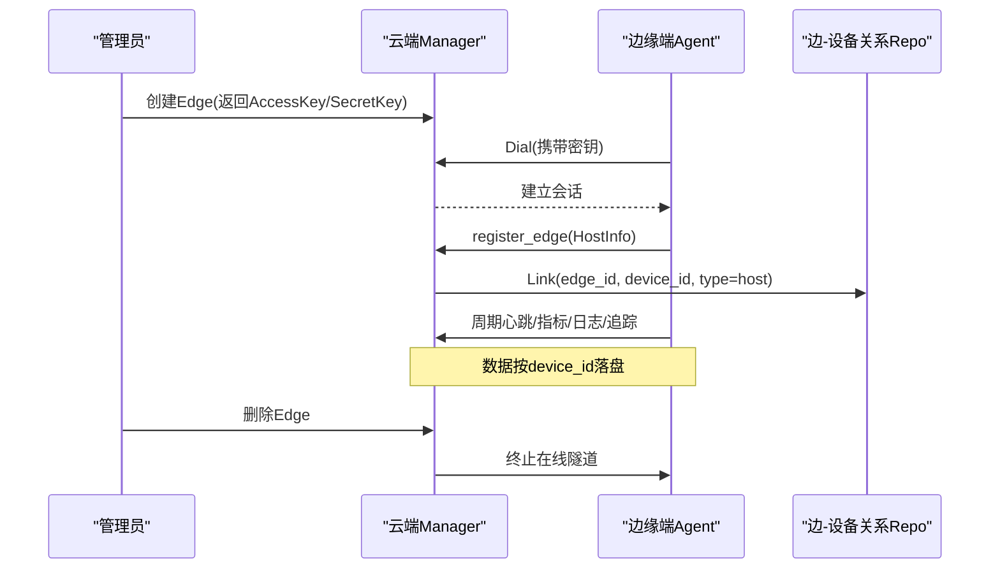
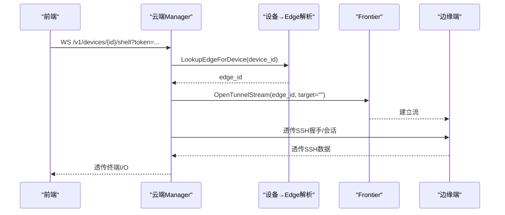
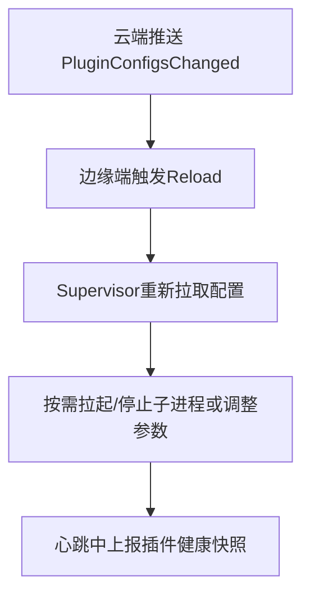

# 边缘设备管理服务

<cite>
**本文引用的文件**
- [edge.proto](file://api/manager/edge/v1/edge.proto)
- [http.go](file://internal/manager/server/edge/http.go)
- [client.go](file://internal/pkg/tunnel/client.go)
- [main.go（云端）](file://cmd/ongrid/main.go)
- [main.go（边缘端）](file://cmd/ongrid-edge/main.go)
- [tunnel.go（设备SSH隧道）](file://internal/manager/biz/devicessh/tunnel.go)
- [edge_device.go（边-设备关系）](file://internal/manager/biz/device/edge_device.go)
- [model.go（设备模型）](file://internal/manager/model/device/model.go)
</cite>

## 目录
1. [简介](#简介)
2. [项目结构](#项目结构)
3. [核心组件](#核心组件)
4. [架构总览](#架构总览)
5. [详细组件分析](#详细组件分析)
6. [依赖分析](#依赖分析)
7. [性能考虑](#性能考虑)
8. [故障排查指南](#故障排查指南)
9. [结论](#结论)
10. [附录](#附录)

## 简介
本文件面向“边缘设备管理服务”的开发者与运维人员，系统性说明 EdgeService 的管理面能力、云端与边缘节点的通信协议、双向流式通道、断线重连与数据同步机制、设备生命周期管理、接入示例（SDK 使用、配置与安全）、性能调优建议以及故障排查方法。文档严格基于仓库源码进行分析与归纳，确保可追溯与可落地。

## 项目结构
围绕边缘设备管理的关键代码分布在以下位置：
- API 定义：api/manager/edge/v1/edge.proto
- 云端 HTTP 服务与管理接口：internal/manager/server/edge/http.go
- 云端主进程编排与路由注册：cmd/ongrid/main.go
- 边缘端主进程与插件体系：cmd/ongrid-edge/main.go
- 云端到边缘的双向隧道客户端实现：internal/pkg/tunnel/client.go
- 通过边缘隧道访问设备的 SSH 通路：internal/manager/biz/devicessh/tunnel.go
- 边-设备关联关系与持久化契约：internal/manager/biz/device/edge_device.go, internal/manager/model/device/model.go

图表来源
- [main.go（云端）:1-42](file://cmd/ongrid/main.go#L1-L42)
- [http.go:130-163](file://internal/manager/server/edge/http.go#L130-L163)
- [client.go:23-37](file://internal/pkg/tunnel/client.go#L23-L37)
- [main.go（边缘端）:1-47](file://cmd/ongrid-edge/main.go#L1-L47)
- [tunnel.go（设备SSH隧道）:39-80](file://internal/manager/biz/devicessh/tunnel.go#L39-L80)

章节来源
- [main.go（云端）:1-42](file://cmd/ongrid/main.go#L1-L42)
- [http.go:130-163](file://internal/manager/server/edge/http.go#L130-L163)
- [client.go:23-37](file://internal/pkg/tunnel/client.go#L23-L37)
- [main.go（边缘端）:1-47](file://cmd/ongrid-edge/main.go#L1-L47)
- [tunnel.go（设备SSH隧道）:39-80](file://internal/manager/biz/devicessh/tunnel.go#L39-L80)

## 核心组件
- EdgeService（管理面）
  - 提供对组织下 Edge 设备的创建、列表、详情、删除、密钥轮换等管理能力；同时暴露远程升级、包升级、进程列表查询、插件运行态管理等扩展能力。
  - 相关定义见 proto 与服务层 HTTP 路由绑定。
- Tunnel 客户端（云端→边缘）
  - 基于 geminio 构建，负责建立长连接、自动重连、注册云端回调、调用云端 RPC、接受云端发起的流式通道。
- 边缘端 Agent
  - 启动时建立到云端的隧道，周期性上报心跳与采集数据，注册云端反向调用处理器（如插件配置变更通知），并支持远程升级流程。
- 设备 SSH 隧道
  - 云端通过设备 ID 解析出所属 Edge，再经由隧道打开目标端口（默认本地 22），在管理器侧完成 SSH 握手，从而实现对私有网络内设备的交互式访问。

章节来源
- [edge.proto:10-29](file://api/manager/edge/v1/edge.proto#L10-L29)
- [http.go:130-163](file://internal/manager/server/edge/http.go#L130-L163)
- [client.go:23-37](file://internal/pkg/tunnel/client.go#L23-L37)
- [main.go（边缘端）:89-110](file://cmd/ongrid-edge/main.go#L89-L110)
- [tunnel.go（设备SSH隧道）:108-147](file://internal/manager/biz/devicessh/tunnel.go#L108-L147)

## 架构总览
云端与边缘通过 Frontier 网关进行双向通信：
- 边缘端主动 Dial 云端，携带 AccessKey/SecretKey 元信息完成认证与会话建立。
- 云端可在已建立的会话上反向调用边缘注册的处理器（例如插件配置变更）。
- 云端也可通过 OpenTunnelStream 打开一条面向特定目标的字节流（用于 WebShell/SSH 转发）。

图表来源
- [client.go:66-141](file://internal/pkg/tunnel/client.go#L66-L141)
- [main.go（云端）:1-42](file://cmd/ongrid/main.go#L1-L42)
- [http.go:130-163](file://internal/manager/server/edge/http.go#L130-L163)

## 详细组件分析

### EdgeService 管理面接口
- 设备注册与密钥签发
  - 创建 Edge：返回 AccessKey/SecretKey（仅响应一次明文），服务端存储 SecretKey 的哈希。
  - 列表/详情：支持按在线状态、名称、主机名、IP 等过滤，返回最近可见时间与 HostInfo。
  - 删除：永久删除记录并终止在线隧道。
  - 密钥轮换：立即使旧 SecretKey 失效，返回新 SecretKey。
- 远程升级与包升级
  - 远程升级：下发 URL+SHA256，边缘端校验后落盘暂存。
  - 包升级：一键选择内置 bundle，分两步 fetch_package + apply_package，失败仍可重试应用。
- 进程列表与插件运行态
  - 进程列表：只读，支持 topN 与排序。
  - 插件运行态：列出插件配置与实时健康快照（状态、PID、重启次数、最后错误等）。

图表来源
- [edge.proto:10-29](file://api/manager/edge/v1/edge.proto#L10-L29)
- [http.go:130-163](file://internal/manager/server/edge/http.go#L130-L163)

章节来源
- [edge.proto:10-29](file://api/manager/edge/v1/edge.proto#L10-L29)
- [http.go:130-163](file://internal/manager/server/edge/http.go#L130-L163)

### 云端与边缘通信协议（Tunnel）
- 连接与认证
  - 边缘端 Dial 云端，携带 Meta{AccessKey, SecretKey}。
  - 支持可选 TLS CA 校验，最小 TLS 版本限制。
- 自动重连
  - 首次 Dial 指数退避（上限固定），后续由底层 RetryEnd 接管断开重连。
  - 当检测到路由失效（如云端重启导致路由表清空），Call 触发异步重连并回调 OnReconnect。
- 双向调用
  - 云端→边缘：RegisterHandler 注册处理器，云端通过 Call 或 AcceptStream 触发。
  - 边缘→云端：通过 Call 发起 RPC（如心跳、指标推送、升级阶段上报等）。
- 流式通道
  - AcceptStream 接收云端发起的字节流（用于 WebShell/SSH 转发）。

图表来源
- [client.go:66-141](file://internal/pkg/tunnel/client.go#L66-L141)
- [client.go:218-243](file://internal/pkg/tunnel/client.go#L218-L243)
- [client.go:258-331](file://internal/pkg/tunnel/client.go#L258-L331)
- [client.go:345-358](file://internal/pkg/tunnel/client.go#L345-L358)

章节来源
- [client.go:66-141](file://internal/pkg/tunnel/client.go#L66-L141)
- [client.go:218-243](file://internal/pkg/tunnel/client.go#L218-L243)
- [client.go:258-331](file://internal/pkg/tunnel/client.go#L258-L331)
- [client.go:345-358](file://internal/pkg/tunnel/client.go#L345-L358)

### 设备生命周期管理（注册→在线→心跳→注销）
- 注册与上线
  - 云端创建 Edge 并签发密钥；边缘端以密钥建立隧道；首次 register_edge 携带 HostInfo（含任务名等）。
  - 云端将 edge_id 与 device_id 通过 edge_devices 多对多关系进行关联（类型 host/discovered）。
- 心跳与数据同步
  - 边缘端周期性上报心跳与采集数据（指标/日志/追踪），云端根据 session.edge_id 反查 device_id 写入对应存储。
- 下线与注销
  - 删除 Edge 会终止在线隧道；长时间无心跳会被标记离线。

图表来源
- [http.go:396-430](file://internal/manager/server/edge/http.go#L396-L430)
- [edge_device.go（边-设备关系）:1-29](file://internal/manager/biz/device/edge_device.go#L1-L29)
- [model.go（设备模型）:255-277](file://internal/manager/model/device/model.go#L255-L277)
- [main.go（云端）:1-42](file://cmd/ongrid/main.go#L1-L42)

章节来源
- [http.go:396-430](file://internal/manager/server/edge/http.go#L396-L430)
- [edge_device.go（边-设备关系）:1-29](file://internal/manager/biz/device/edge_device.go#L1-L29)
- [model.go（设备模型）:255-277](file://internal/manager/model/device/model.go#L255-L277)
- [main.go（云端）:1-42](file://cmd/ongrid/main.go#L1-L42)

### 命令下发与文件传输（WebShell/SSH 隧道）
- WebShell/SSH 通道
  - 前端通过 WebSocket 子协议连接到 /v1/devices/{id}/shell 或 /shell-direct。
  - 云端根据设备 ID 解析出所属 Edge，OpenTunnelStream 打开目标（默认 127.0.0.1:22），在管理器侧完成 SSH 握手，边缘端作为纯透传。
- 文件传输
  - 通过 SFTP 走同一隧道通道（SFTP 建立在 SSH 之上），由管理器侧驱动，边缘端不持有 SSH 库。

图表来源
- [tunnel.go（设备SSH隧道）:182-202](file://internal/manager/biz/devicessh/tunnel.go#L182-L202)
- [tunnel.go（设备SSH隧道）:208-233](file://internal/manager/biz/devicessh/tunnel.go#L208-L233)
- [client.go:345-358](file://internal/pkg/tunnel/client.go#L345-L358)

章节来源
- [tunnel.go（设备SSH隧道）:182-233](file://internal/manager/biz/devicessh/tunnel.go#L182-L233)
- [client.go:345-358](file://internal/pkg/tunnel/client.go#L345-L358)

### 插件系统与配置热更新
- 插件注册与运行
  - 边缘端注册多个插件（日志、审计、指标、数据库导出、主机/进程指标等），由 Supervisor 统一管理生命周期。
- 配置拉取与热更新
  - 云端通过 MethodPluginConfigsChanged 推送变更，边缘端触发重新拉取并应用。
- 健康上报
  - 每次心跳附带插件健康快照（状态、PID、重启计数、最后错误等），云端聚合展示。

图表来源
- [main.go（边缘端）:298-305](file://cmd/ongrid-edge/main.go#L298-L305)
- [main.go（边缘端）:258-297](file://cmd/ongrid-edge/main.go#L258-L297)

章节来源
- [main.go（边缘端）:298-305](file://cmd/ongrid-edge/main.go#L298-L305)
- [main.go（边缘端）:258-297](file://cmd/ongrid-edge/main.go#L258-L297)

## 依赖分析
- 耦合与内聚
  - Edge HTTP 处理器依赖 EdgeService 与设备仓储，职责清晰；Tunnel 客户端独立封装底层 geminio，屏蔽重连细节。
  - 设备 SSH 隧道依赖设备→Edge 解析器与流开启器，边界明确。
- 关键依赖链
  - 云端主进程 → Edge HTTP 处理器 → EdgeService → Tunnel 客户端 → Frontier → 边缘端。
  - 边缘端 → 插件系统 → 指标/日志/追踪后端。
- 潜在循环与规避
  - 通过接口隔离与构造注入避免循环依赖；collector 与 biz 之间通过适配器桥接。

图表来源
- [main.go（云端）:1-42](file://cmd/ongrid/main.go#L1-L42)
- [http.go:130-163](file://internal/manager/server/edge/http.go#L130-L163)
- [client.go:23-37](file://internal/pkg/tunnel/client.go#L23-L37)
- [main.go（边缘端）:1-47](file://cmd/ongrid-edge/main.go#L1-L47)

章节来源
- [main.go（云端）:1-42](file://cmd/ongrid/main.go#L1-L42)
- [http.go:130-163](file://internal/manager/server/edge/http.go#L130-L163)
- [client.go:23-37](file://internal/pkg/tunnel/client.go#L23-L37)
- [main.go（边缘端）:1-47](file://cmd/ongrid-edge/main.go#L1-L47)

## 性能考虑
- 批量操作
  - 指标/日志/追踪采用批量化上报路径，减少往返开销；云端侧按 device_id 标签写入，利于聚合与查询。
- 缓存策略
  - 设备→Edge 映射与 HostInfo 在处理器层做轻量缓存/批量加载，降低重复查询。
- 资源限制
  - 进程列表查询限制 topN 上限；插件子进程受 Supervisor 管理，崩溃自动重启并上报健康。
- 连接与重连
  - 指数退避与最大退避上限避免风暴；路由失效快速重连，保证可用性。

[本节为通用指导，无需具体文件引用]

## 故障排查指南
- 无法连接云端
  - 检查 AccessKey/SecretKey 是否正确；关注 Dial 失败日志与退避行为；确认防火墙/TLS CA 配置。
- 频繁重连
  - 若出现“路由失效”类错误，通常是云端重启导致路由表清空，等待自动重连即可；必要时检查云端服务稳定性。
- 插件异常
  - 查看插件健康快照中的 LastError 与 RestartCount；确认插件二进制与工作目录权限；核对云端下发的插件配置。
- WebShell/SSH 无法连接
  - 确认设备已绑定 Edge；检查目标端口可达性（默认 22）；查看隧道打开与 SSH 握手阶段的错误信息。
- 指标/日志未入库
  - 确认心跳正常且包含插件健康；核查 device_id 标签一致性；检查云端 ingester 与下游存储状态。

章节来源
- [client.go:66-141](file://internal/pkg/tunnel/client.go#L66-L141)
- [client.go:258-331](file://internal/pkg/tunnel/client.go#L258-L331)
- [main.go（边缘端）:258-297](file://cmd/ongrid-edge/main.go#L258-L297)
- [tunnel.go（设备SSH隧道）:182-202](file://internal/manager/biz/devicessh/tunnel.go#L182-L202)

## 结论
本服务通过统一的 EdgeService 管理面与稳定的 Tunnel 双向通道，实现了边缘设备的注册、心跳、命令下发、文件传输与插件化管理。其设计强调解耦与可扩展性，具备完善的断线重连与健康上报机制，适合大规模边缘节点场景下的统一管控与观测。

[本节为总结，无需具体文件引用]

## 附录

### 设备接入示例（SDK 使用、配置与安全）
- 安装与初始化
  - 准备 AccessKey/SecretKey；设置云端地址与可选 TLS CA；启动 ongrid-edge 二进制。
- 环境变量与配置文件
  - 参考 systemd 环境模板与安装脚本，配置 CloudAddr、AccessKey、SecretKey、CollectorInterval 等。
- 安全认证
  - 连接时携带 AccessKey/SecretKey；云端仅存储 SecretKey 哈希；轮换密钥后立即生效。
- 常用操作
  - 通过管理面创建 Edge、查看列表/详情、轮换密钥、远程升级、查看进程列表与插件健康。

章节来源
- [main.go（边缘端）:74-96](file://cmd/ongrid-edge/main.go#L74-L96)
- [http.go:396-430](file://internal/manager/server/edge/http.go#L396-L430)
- [http.go:538-550](file://internal/manager/server/edge/http.go#L538-L550)
- [edge.proto:10-29](file://api/manager/edge/v1/edge.proto#L10-L29)