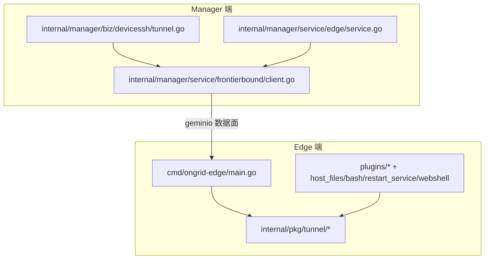
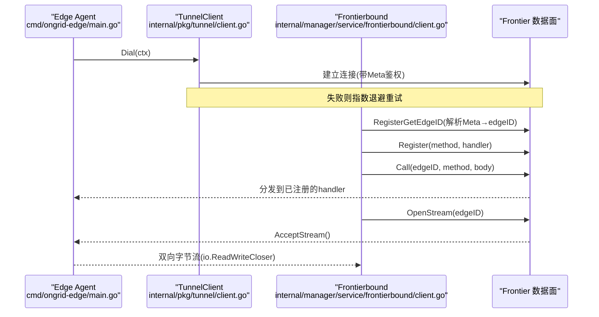
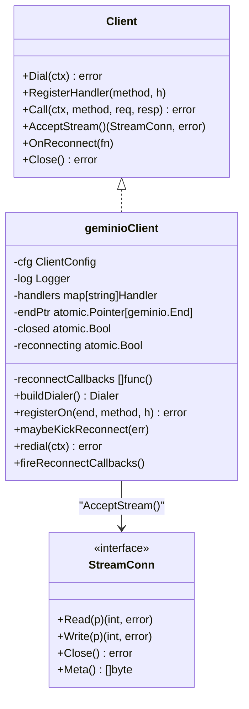
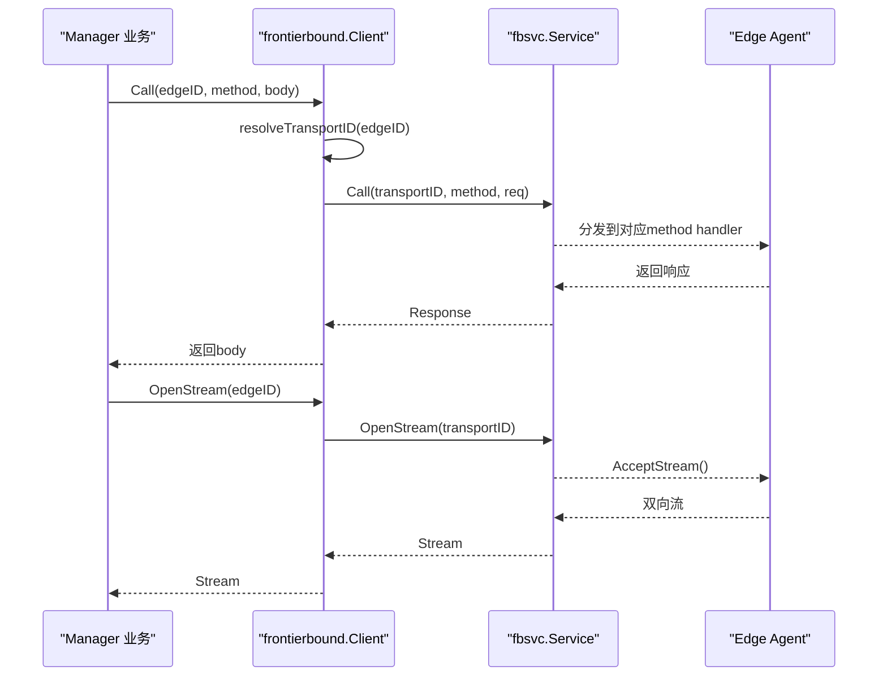
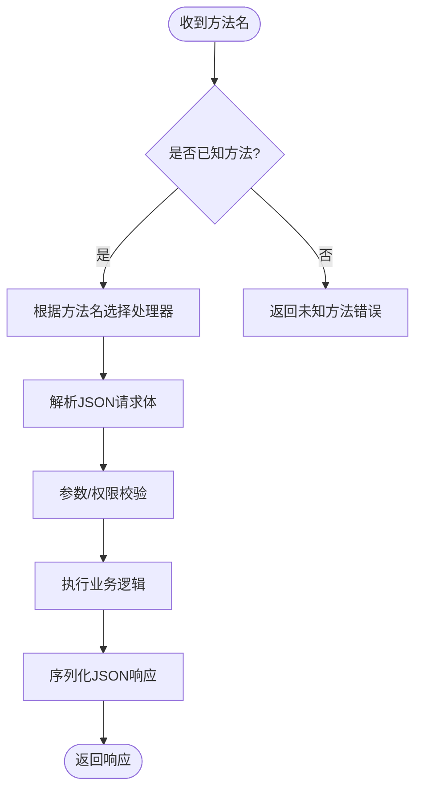
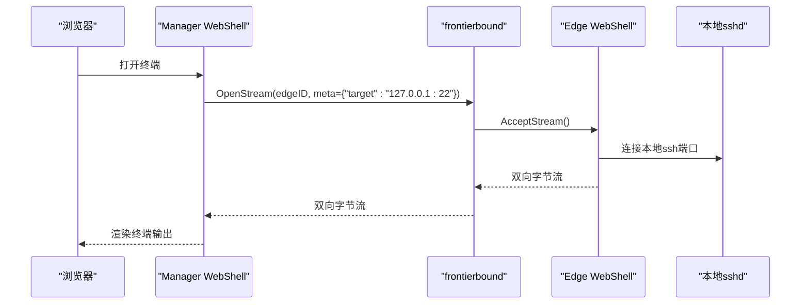
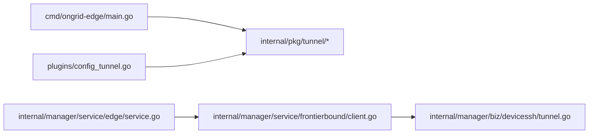

# 隧道通信服务

<cite>
**本文引用的文件列表**
- [tunnel.proto](file://api/tunnel/v1/tunnel.proto)
- [doc.go](file://internal/pkg/tunnel/doc.go)
- [client.go](file://internal/pkg/tunnel/client.go)
- [types.go](file://internal/pkg/tunnel/types.go)
- [messages.go](file://internal/pkg/tunnel/messages.go)
- [host_files.go](file://internal/pkg/tunnel/host_files.go)
- [config_tunnel.go](file://internal/edgeagent/plugins/config_tunnel.go)
- [main.go（边缘端）](file://cmd/ongrid-edge/main.go)
- [client.go（frontierbound）](file://internal/manager/service/frontierbound/client.go)
- [tunnel.go（设备SSH隧道）](file://internal/manager/biz/devicessh/tunnel.go)
- [service.go（边缘服务）](file://internal/manager/service/edge/service.go)
</cite>

## 目录
1. [简介](#简介)
2. [项目结构](#项目结构)
3. [核心组件](#核心组件)
4. [架构总览](#架构总览)
5. [详细组件分析](#详细组件分析)
6. [依赖关系分析](#依赖关系分析)
7. [性能与可靠性](#性能与可靠性)
8. [故障排查指南](#故障排查指南)
9. [结论](#结论)
10. [附录：RPC接口清单与客户端示例](#附录rpc接口清单与客户端示例)

## 简介
本文件面向“隧道通信服务”，聚焦于 edge 侧的 TunnelService（即 internal/pkg/tunnel.Client）及其在 manager 侧通过 frontierbound 适配层对远端 edge 的调用。文档覆盖以下目标：
- 全面说明 TunnelService 的所有 RPC 接口，包括注册、心跳、指标上报、进程/负载查询、WebSSH 双向流等
- 阐述双向流式通信机制、长连接维护与心跳检测
- 说明安全认证、访问控制与流量控制策略
- 提供隧道客户端开发示例（连接建立、消息收发、异常处理）
- 给出性能优化策略（连接复用、缓冲区管理、背压处理）
- 设计高可用与故障转移方案

## 项目结构
围绕隧道通信的关键代码分布在如下位置：
- API 定义：api/tunnel/v1/tunnel.proto（JSON 载荷协议定义）
- Edge 侧隧道客户端：internal/pkg/tunnel/*（Client、类型、消息体、方法名常量）
- Manager 侧前端适配：internal/manager/service/frontierbound/client.go（将 manager 的业务语义映射到 geminio 数据面）
- 边缘端主程序：cmd/ongrid-edge/main.go（初始化 tunnel client、注册 handler、运行插件与采集器）
- 设备 SSH 隧道：internal/manager/biz/devicessh/tunnel.go（基于隧道流实现 SSH 会话）
- 边缘服务：internal/manager/service/edge/service.go（注册/心跳等业务入口）

图表来源
- [main.go（边缘端）:89-148](file://cmd/ongrid-edge/main.go#L89-L148)
- [client.go（frontierbound）:128-242](file://internal/manager/service/frontierbound/client.go#L128-L242)
- [tunnel.go（设备SSH隧道）:182-233](file://internal/manager/biz/devicessh/tunnel.go#L182-L233)
- [service.go（边缘服务）:78-94](file://internal/manager/service/edge/service.go#L78-L94)

章节来源
- [doc.go:1-14](file://internal/pkg/tunnel/doc.go#L1-L14)
- [main.go（边缘端）:89-148](file://cmd/ongrid-edge/main.go#L89-L148)

## 核心组件
- TunnelService（Edge 侧 Client）
  - 负责与云端 broker（frontier）建立并维护长连接
  - 提供 Call（请求-响应）、RegisterHandler（云→边反向调用）、AcceptStream（双向字节流）、OnReconnect（重连回调）等能力
  - 内部使用 github.com/singchia/geminio 的 RetryEnd 自动重拨，封装 JSON 编解码与 slog 日志
- Frontierbound（Manager 侧适配）
  - 面向 manager 业务暴露统一 Client：Call/OpenStream/Register 等
  - 维护 edgeID ↔ transportID 的绑定，支持 OpenStream 打开到指定 edge 的双向流
- 消息与协议
  - api/tunnel/v1/tunnel.proto 定义了 wire 上的 JSON 字段；internal/pkg/tunnel/messages.go 以 Go struct 镜像这些形状，保持 edge 侧无 protobuf 依赖

章节来源
- [types.go:68-106](file://internal/pkg/tunnel/types.go#L68-L106)
- [client.go:23-60](file://internal/pkg/tunnel/client.go#L23-L60)
- [client.go（frontierbound）:49-90](file://internal/manager/service/frontierbound/client.go#L49-L90)
- [messages.go:1-14](file://internal/pkg/tunnel/messages.go#L1-L14)
- [tunnel.proto:1-12](file://api/tunnel/v1/tunnel.proto#L1-L12)

## 架构总览
整体采用“边端主动拨号 + 云端反向路由”的数据平面模型：
- Edge 通过 tunnel.Client.Dial 建立到 frontier 的长连接，携带 Meta（access_key/secret_key）进行认证
- Manager 通过 frontierbound.Client 与 frontier 交互，按 edgeID 路由到具体 edge
- 双向流用于 WebSSH 等场景：manager 发起 OpenStream，edge AcceptStream 后 io.Copy 转发本地 socket

图表来源
- [client.go:62-141](file://internal/pkg/tunnel/client.go#L62-L141)
- [client.go（frontierbound）:192-242](file://internal/manager/service/frontierbound/client.go#L192-L242)
- [main.go（边缘端）:89-148](file://cmd/ongrid-edge/main.go#L89-L148)

## 详细组件分析

### 组件一：TunnelService（Edge 侧）
职责
- 连接管理：Dial 指数退避、RetryEnd 透明重拨、Close 终止
- 反向注册：RegisterHandler 支持云→边方法级路由
- 请求-响应：Call 自动 JSON 编解码，错误分类与触发异步重连
- 双向流：AcceptStream 返回 StreamConn（Read/Write/Close/Meta）
- 重连钩子：OnReconnect 允许上层在重连成功后执行再注册等逻辑

关键实现要点
- buildDialer 支持明文 TCP 或 TLS（CA 校验），最小 TLS 版本为 1.2
- maybeKickReconnect 识别“路由失效”类错误，启动独立 goroutine 重拨，避免阻塞当前 RPC
- shouldReconnect 匹配特定错误文本（如 not found、mismatch clientID）
- registerOn 包装 Handler，将 Session{} 与方法名透传至业务 handler

图表来源
- [types.go:68-120](file://internal/pkg/tunnel/types.go#L68-L120)
- [client.go:39-60](file://internal/pkg/tunnel/client.go#L39-L60)
- [client.go:178-209](file://internal/pkg/tunnel/client.go#L178-L209)
- [client.go:218-243](file://internal/pkg/tunnel/client.go#L218-L243)
- [client.go:345-370](file://internal/pkg/tunnel/client.go#L345-L370)

章节来源
- [types.go:33-66](file://internal/pkg/tunnel/types.go#L33-L66)
- [client.go:62-141](file://internal/pkg/tunnel/client.go#L62-L141)
- [client.go:218-243](file://internal/pkg/tunnel/client.go#L218-L243)
- [client.go:258-331](file://internal/pkg/tunnel/client.go#L258-L331)
- [client.go:345-370](file://internal/pkg/tunnel/client.go#L345-L370)

### 组件二：Frontierbound（Manager 侧）
职责
- 对接 frontier 数据面，提供 manager 友好的 Call/OpenStream/Register 接口
- 维护 edgeID ↔ transportID 映射，确保业务层只感知稳定 edgeID
- 支持 RegisterGetEdgeID 将 Meta 中的 access_key/secret_key 解析为 edgeID
- 支持 OpenStream 打开到指定 edge 的双向流，供 WebSSH 等使用

关键实现要点
- New 建立与服务端的连接；NewDisabled 用于 e2e/降级模式
- Register 将 manager.Handler 包装为 geminio.RPC，提取 edgeID 并转发
- OpenStream 返回 geminio.Stream，满足 io.ReadWriteCloser，便于直接作为 net.Conn 使用

图表来源
- [client.go（frontierbound）:128-145](file://internal/manager/service/frontierbound/client.go#L128-L145)
- [client.go（frontierbound）:218-242](file://internal/manager/service/frontierbound/client.go#L218-L242)
- [client.go（frontierbound）:252-310](file://internal/manager/service/frontierbound/client.go#L252-L310)

章节来源
- [client.go（frontierbound）:60-90](file://internal/manager/service/frontierbound/client.go#L60-L90)
- [client.go（frontierbound）:169-200](file://internal/manager/service/frontierbound/client.go#L169-L200)
- [client.go（frontierbound）:218-242](file://internal/manager/service/frontierbound/client.go#L218-L242)

### 组件三：消息与协议（tunnel.proto 与 messages.go）
- 协议形态：MVP 阶段使用 JSON 编码，字段名与 proto json_name 保持一致
- 方法名常量：MethodRegisterEdge、MethodHeartbeat、MethodPushHostMetrics、MethodExecuteSkill、MethodShellOpen 等
- 数据结构：HostInfo、PluginHealthWire、PromSample、AgentUpgradeRequest 等

图表来源
- [messages.go:17-80](file://internal/pkg/tunnel/messages.go#L17-L80)
- [tunnel.proto:44-166](file://api/tunnel/v1/tunnel.proto#L44-L166)

章节来源
- [messages.go:1-14](file://internal/pkg/tunnel/messages.go#L1-L14)
- [messages.go:17-80](file://internal/pkg/tunnel/messages.go#L17-L80)
- [tunnel.proto:1-12](file://api/tunnel/v1/tunnel.proto#L1-L12)

### 组件四：WebSSH 双向流路径
- Manager 通过 frontierbound.OpenStream 打开到 edge 的流，并在 Meta 中携带目标描述（例如 {"target":"127.0.0.1:22"}）
- Edge 侧 AcceptStream 后，根据 Meta 决定转发到本地 sshd 或其他 socket
- 该路径不要求 edge 具备 SSH 库，仅做字节转发

图表来源
- [tunnel.go（设备SSH隧道）:182-233](file://internal/manager/biz/devicessh/tunnel.go#L182-L233)
- [client.go（frontierbound）:218-242](file://internal/manager/service/frontierbound/client.go#L218-L242)
- [types.go:81-106](file://internal/pkg/tunnel/types.go#L81-L106)

章节来源
- [tunnel.go（设备SSH隧道）:182-233](file://internal/manager/biz/devicessh/tunnel.go#L182-L233)
- [types.go:81-106](file://internal/pkg/tunnel/types.go#L81-L106)

## 依赖关系分析
- Edge 侧
  - cmd/ongrid-edge/main.go 初始化 tunnel.Client，注册各类 handler（host_files、bash、restart_service、webshell），并通过 agent 周期发送心跳与指标
  - plugins/config_tunnel.go 通过 tunnel RPC 拉取插件配置，失败回退到环境变量快照
- Manager 侧
  - frontierbound.Client 封装 fbsvc.Service，提供 manager 业务所需的 Call/OpenStream/Register 等
  - devicessh.tunnel 通过 frontierbound 打开流，完成 SSH 握手与会话

图表来源
- [main.go（边缘端）:89-148](file://cmd/ongrid-edge/main.go#L89-L148)
- [config_tunnel.go:1-34](file://internal/edgeagent/plugins/config_tunnel.go#L1-L34)
- [client.go（frontierbound）:128-242](file://internal/manager/service/frontierbound/client.go#L128-L242)
- [tunnel.go（设备SSH隧道）:182-233](file://internal/manager/biz/devicessh/tunnel.go#L182-L233)
- [service.go（边缘服务）:78-94](file://internal/manager/service/edge/service.go#L78-L94)

章节来源
- [main.go（边缘端）:89-148](file://cmd/ongrid-edge/main.go#L89-L148)
- [config_tunnel.go:1-34](file://internal/edgeagent/plugins/config_tunnel.go#L1-L34)
- [client.go（frontierbound）:128-242](file://internal/manager/service/frontierbound/client.go#L128-L242)
- [tunnel.go（设备SSH隧道）:182-233](file://internal/manager/biz/devicessh/tunnel.go#L182-L233)
- [service.go（边缘服务）:78-94](file://internal/manager/service/edge/service.go#L78-L94)

## 性能与可靠性
- 连接复用与自动重连
  - Edge 侧使用 RetryEnd 维持长连接，断线自动重拨；指数退避上限 60s，避免风暴
  - Call 遇到“路由失效”错误时，触发一次异步重连，避免阻塞当前调用
- 心跳与存活检测
  - 周期性 heartbeat 上报，包含插件健康状态，便于云端快速发现异常
- 背压与缓冲
  - 双向流基于 net.Conn/io.ReadWriteCloser，建议上层实现合理缓冲与超时，避免内存膨胀
  - 指标推送批量聚合（push_host_metrics/push_prom_samples），减少 RPC 次数
- 资源隔离与限流
  - 插件子系统可结合 Supervisor 与 ConfigFetcher 动态启停，降低峰值压力
  - 对敏感操作（如 restart_service、bash）启用沙箱与命令白名单，限制系统影响面

[本节为通用指导，无需源码引用]

## 故障排查指南
- 连接失败
  - 检查 ServerAddr/CloudAddr、TLS CA 配置是否正确
  - 关注 dial 失败的告警与退避日志
- 认证失败
  - 确认 AccessKey/SecretKey 与云端一致；认证失败表现为连接被服务端关闭
- 路由失效
  - 当出现“not found/mismatch clientID”类错误，会触发自动重连；若持续失败，检查云端路由表与 broker 状态
- 双向流异常
  - 检查 Meta 目标描述是否符合预期（如 target 格式）
  - 确认 edge 侧能连通本地目标 socket（如 sshd）

章节来源
- [client.go:143-176](file://internal/pkg/tunnel/client.go#L143-L176)
- [client.go:258-331](file://internal/pkg/tunnel/client.go#L258-L331)

## 结论
TunnelService 提供了稳定、可扩展的边云双向通信能力：以 JSON 为 MVP 传输格式，借助 geminio 的长连接与自动重拨，配合 manager 侧 frontierbound 的 edgeID 路由与双向流，支撑了 WebSSH、技能执行、指标上报等多种场景。通过心跳、插件健康、重连回调与沙箱策略，系统在可用性、安全性与可观测性方面形成闭环。后续可在 Phase 2 引入二进制 proto 以提升吞吐与兼容性。

[本节为总结，无需源码引用]

## 附录：RPC接口清单与客户端示例

### RPC 接口清单（节选）
- register_edge（边→云）
  - 用途：首次注册/重连，上报 HostInfo、agent_version
  - 参考：[messages.go:258-270](file://internal/pkg/tunnel/messages.go#L258-L270)、[tunnel.proto:44-60](file://api/tunnel/v1/tunnel.proto#L44-L60)
- heartbeat（边→云）
  - 用途：周期性心跳，附带插件健康
  - 参考：[messages.go:276-320](file://internal/pkg/tunnel/messages.go#L276-L320)、[tunnel.proto:63-73](file://api/tunnel/v1/tunnel.proto#L63-L73)
- push_host_metrics（边→云）
  - 用途：批量主机指标点
  - 参考：[messages.go:326-349](file://internal/pkg/tunnel/messages.go#L326-L349)、[tunnel.proto:75-87](file://api/tunnel/v1/tunnel.proto#L75-L87)
- push_prom_samples（边→云）
  - 用途：Prometheus 样本批量上报
  - 参考：[messages.go:355-377](file://internal/pkg/tunnel/messages.go#L355-L377)、[tunnel.proto:75-87](file://api/tunnel/v1/tunnel.proto#L75-L87)
- get_host_load（云→边）
  - 用途：实时主机负载快照
  - 参考：[messages.go:383-401](file://internal/pkg/tunnel/messages.go#L383-L401)、[tunnel.proto:89-103](file://api/tunnel/v1/tunnel.proto#L89-L103)
- get_process_list（云→边）
  - 用途：Top N 进程列表
  - 参考：[messages.go:408-433](file://internal/pkg/tunnel/messages.go#L408-L433)、[tunnel.proto:105-134](file://api/tunnel/v1/tunnel.proto#L105-L134)
- execute_skill（云→边）
  - 用途：统一技能调度入口
  - 参考：[messages.go:194-207](file://internal/pkg/tunnel/messages.go#L194-L207)
- shell_open/shell_input/shell_resize/shell_close/shell_output/shell_exit（云↔边）
  - 用途：WebSSH 会话控制与数据通道
  - 参考：[messages.go:86-152](file://internal/pkg/tunnel/messages.go#L86-L152)
- get_plugin_configs / plugin_configs_changed（云↔边）
  - 用途：插件配置拉取与变更通知
  - 参考：[messages.go:154-186](file://internal/pkg/tunnel/messages.go#L154-L186)
- write_database_metrics_secret(s)（云→边）
  - 用途：写入数据库导出器凭据文件
  - 参考：[messages.go:169-192](file://internal/pkg/tunnel/messages.go#L169-L192)
- agent_upgrade / fetch_package / apply_package（云→边）
  - 用途：边缘代理升级流程
  - 参考：[messages.go:439-502](file://internal/pkg/tunnel/messages.go#L439-L502)

章节来源
- [messages.go:17-80](file://internal/pkg/tunnel/messages.go#L17-L80)
- [messages.go:86-152](file://internal/pkg/tunnel/messages.go#L86-L152)
- [messages.go:154-192](file://internal/pkg/tunnel/messages.go#L154-L192)
- [messages.go:258-349](file://internal/pkg/tunnel/messages.go#L258-L349)
- [messages.go:355-433](file://internal/pkg/tunnel/messages.go#L355-L433)
- [messages.go:439-502](file://internal/pkg/tunnel/messages.go#L439-L502)
- [tunnel.proto:44-166](file://api/tunnel/v1/tunnel.proto#L44-L166)

### 客户端开发示例（概念步骤）
- 连接建立
  - 构造 ClientConfig（ServerAddr/AccessKey/SecretKey/TLS CA）
  - 调用 Dial(ctx)，等待成功或 ctx 取消
- 注册云→边处理器
  - RegisterHandler(method, handler)，支持在线注册与重连后自动重新注册
- 调用云→边方法
  - Call(ctx, method, req, &resp)，注意处理网络错误与远程错误
- 双向流
  - AcceptStream() 获取 StreamConn，读取/写入字节，必要时解析 Meta
- 重连回调
  - OnReconnect(fn) 注册回调，在重连成功后执行必要再注册或状态恢复
- 异常处理
  - 区分网络错误、认证错误、路由失效错误；对后者触发自动重连
- 资源清理
  - Close() 终止连接并停止重连

章节来源
- [types.go:68-106](file://internal/pkg/tunnel/types.go#L68-L106)
- [client.go:62-141](file://internal/pkg/tunnel/client.go#L62-L141)
- [client.go:178-209](file://internal/pkg/tunnel/client.go#L178-L209)
- [client.go:218-243](file://internal/pkg/tunnel/client.go#L218-L243)
- [client.go:245-256](file://internal/pkg/tunnel/client.go#L245-L256)
- [client.go:345-370](file://internal/pkg/tunnel/client.go#L345-L370)