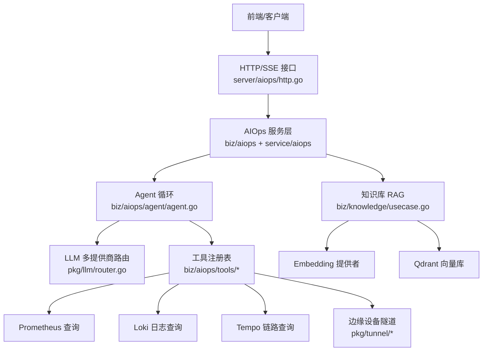
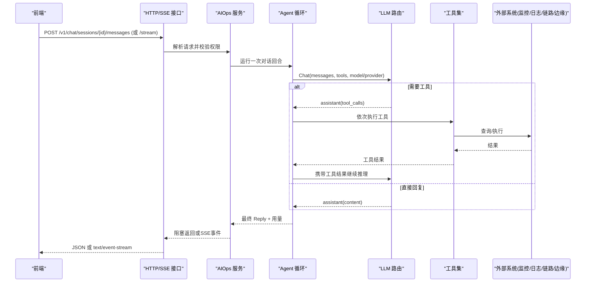
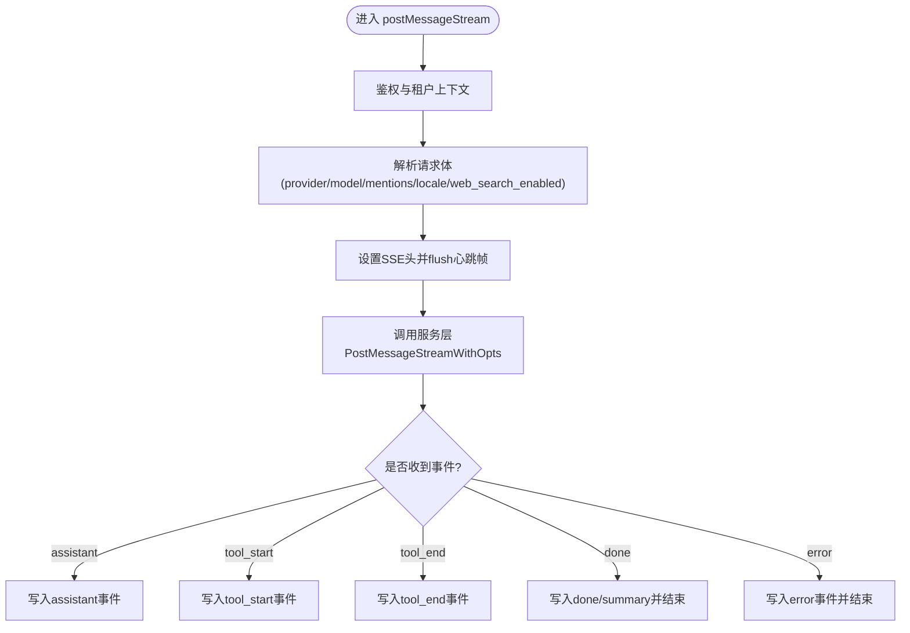
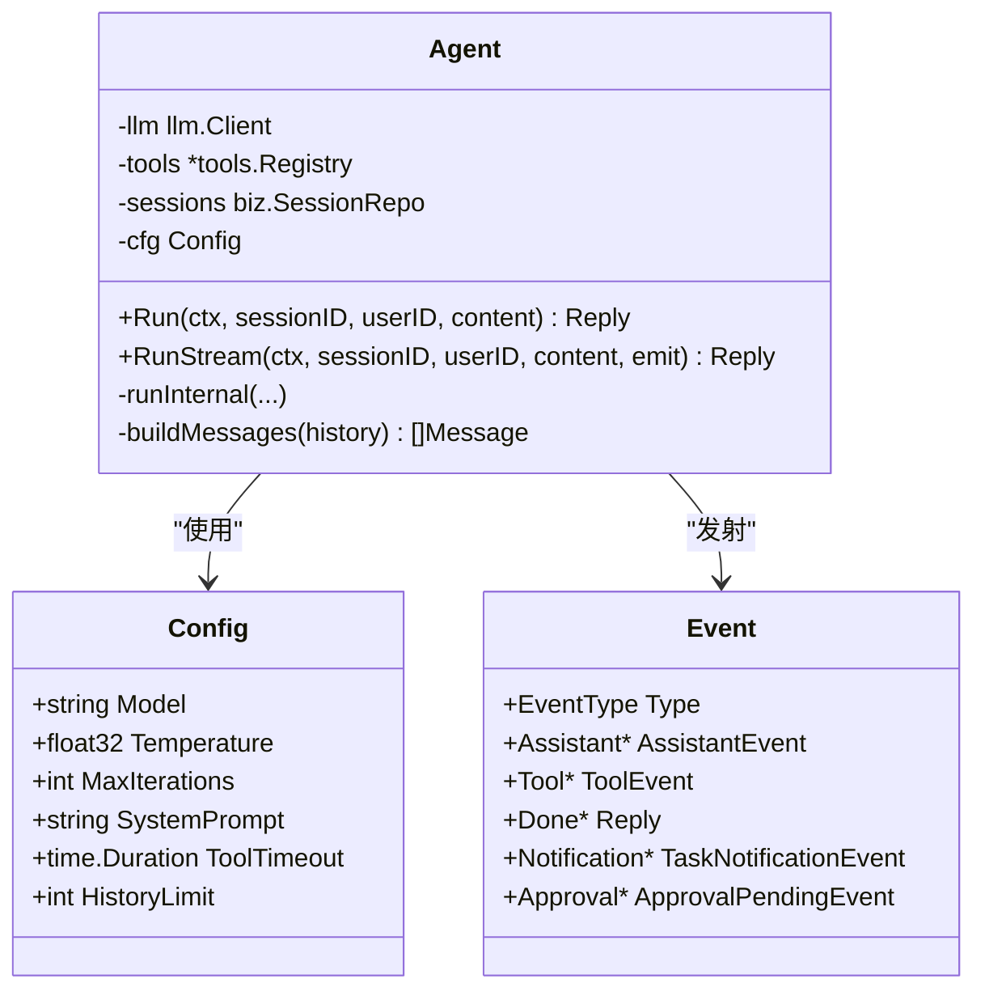
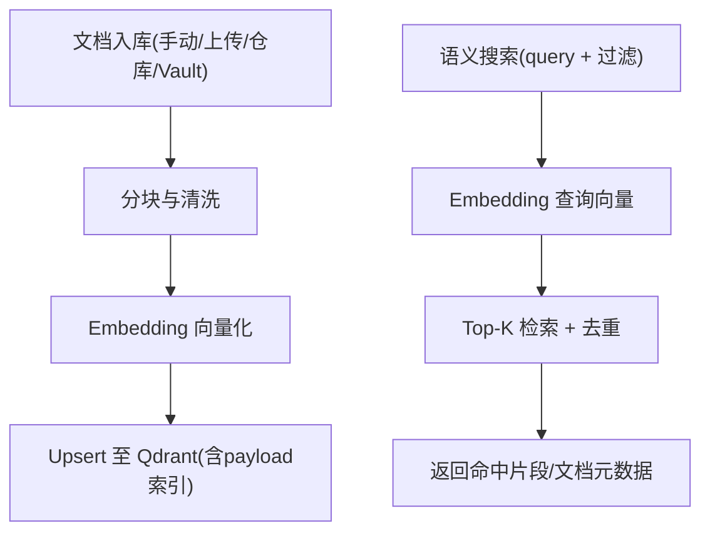
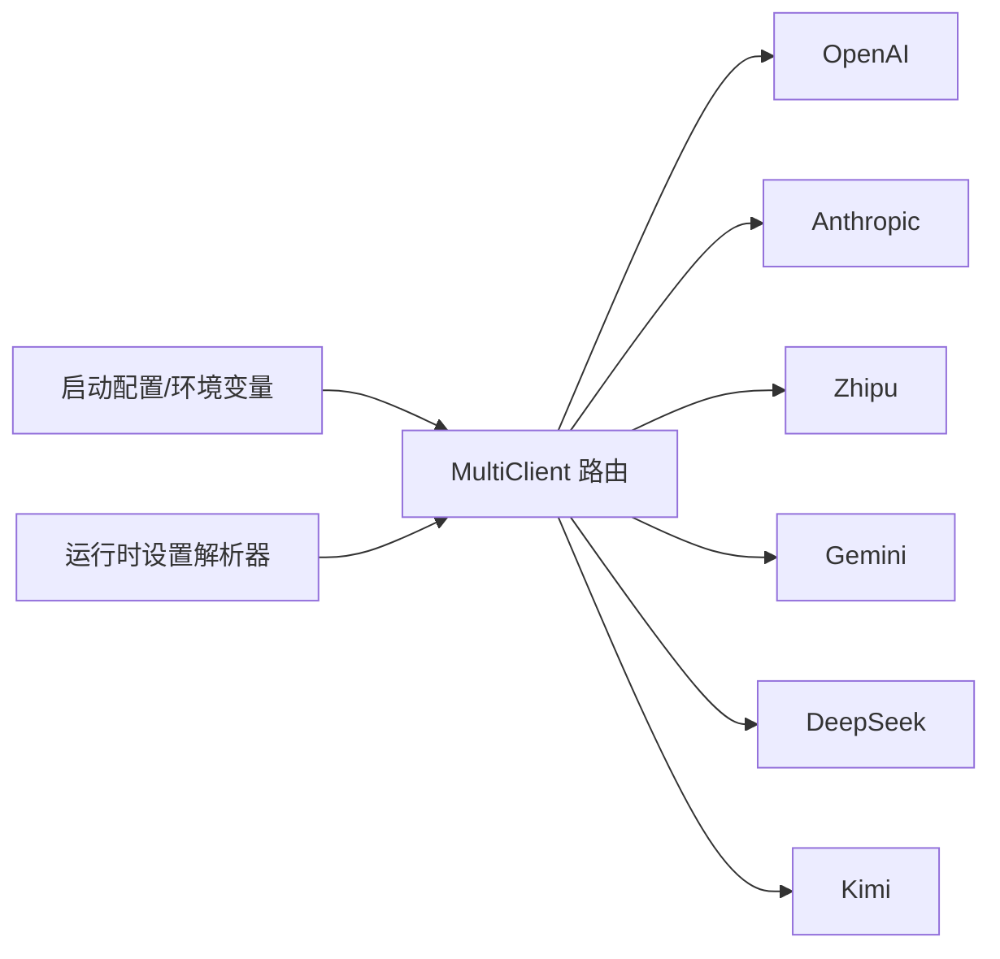
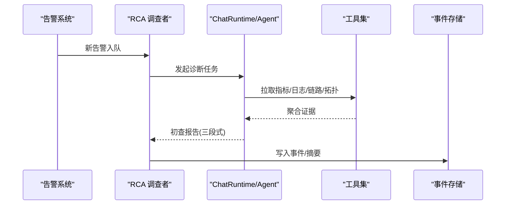
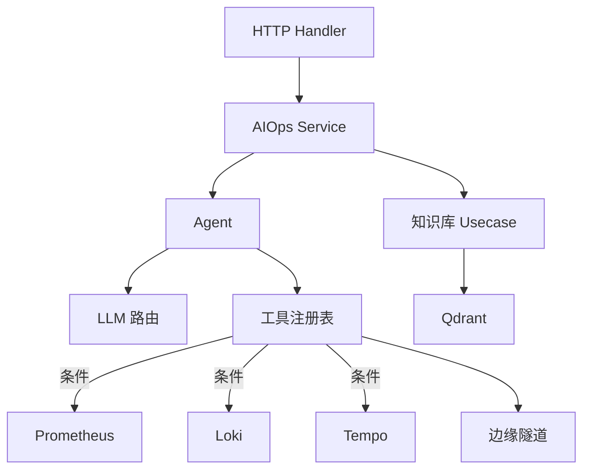

# AIOPS智能运维API

<cite>
**本文引用的文件**   
- [aiops.proto](file://api/manager/aiops/v1/aiops.proto)
- [http.go](file://internal/manager/server/aiops/http.go)
- [agent.go](file://internal/manager/biz/aiops/agent/agent.go)
- [main.go](file://cmd/ongrid/main.go)
- [investigator.go](file://internal/manager/biz/aiops/investigator/investigator.go)
- [usecase.go](file://internal/manager/biz/knowledge/usecase.go)
- [chat.ts](file://web/src/api/chat.ts)
- [ChatThread.tsx](file://web/src/pages/ChatThread.tsx)
</cite>

## 目录
1. [简介](#简介)
2. [项目结构](#项目结构)
3. [核心组件](#核心组件)
4. [架构总览](#架构总览)
5. [详细组件分析](#详细组件分析)
6. [依赖关系分析](#依赖关系分析)
7. [性能与可观测性](#性能与可观测性)
8. [故障排查指南](#故障排查指南)
9. [结论](#结论)
10. [附录：API定义与示例](#附录api定义与示例)

## 简介
本文件面向开发者与运维工程师，系统化梳理 AIOPS 智能运维 API 的设计与实现，覆盖以下能力：
- 基于 LLM 的对话式智能问答、RCA 根因分析与修复建议生成
- 聊天会话管理、消息发送与 SSE 流式响应
- 知识库检索增强（RAG）：文档上传、索引构建、语义搜索
- LLM 模型选择与多提供商路由配置
- AI 工具调用集成：Bash 执行、文件操作、系统信息查询等
- 典型运维场景与最佳实践

## 项目结构
AIOPS 相关代码主要分布在如下层次：
- API 契约层：gRPC proto 定义
- HTTP 服务层：REST 路由、SSE 流式事件、DTO 映射
- 业务编排层：Agent 循环、会话与消息持久化、工具注册与调度
- 基础设施层：LLM 多提供商路由、向量库 Qdrant、日志/指标/链路查询客户端
- 前端集成：会话创建、消息发送、SSE 消费、模型选择器

图表来源
- [http.go:1-154](file://internal/manager/server/aiops/http.go#L1-L154)
- [agent.go:1-120](file://internal/manager/biz/aiops/agent/agent.go#L1-L120)
- [main.go:543-604](file://cmd/ongrid/main.go#L543-L604)
- [usecase.go:1-167](file://internal/manager/biz/knowledge/usecase.go#L1-L167)

章节来源
- [http.go:1-154](file://internal/manager/server/aiops/http.go#L1-L154)
- [agent.go:1-120](file://internal/manager/biz/aiops/agent/agent.go#L1-L120)
- [main.go:543-604](file://cmd/ongrid/main.go#L543-L604)
- [usecase.go:1-167](file://internal/manager/biz/knowledge/usecase.go#L1-L167)

## 核心组件
- gRPC 契约与服务：AiopsService 提供会话与消息的 RPC 接口，用于内部或跨语言集成。
- HTTP 服务与 SSE：对外暴露 REST 接口，支持阻塞式与流式两种消息交互模式。
- Agent 循环：驱动 LLM 进行多轮 tool-calling，维护会话历史、工具执行与结果回灌。
- 工具注册表：将 Prometheus/Loki/Trace/Edge/Bash/文件/告警/拓扑等能力封装为 LLM 可调用的工具。
- 知识库 RAG：文档入库、分块、向量化、过滤检索，支撑问答与 RCA 增强。
- LLM 路由：按 provider/model 动态选择后端，支持运行时刷新与默认值策略。
- 前端集成：会话创建、消息发送、SSE 事件处理、模型选择器与 @ 提及增强。

章节来源
- [aiops.proto:1-170](file://api/manager/aiops/v1/aiops.proto#L1-L170)
- [http.go:130-154](file://internal/manager/server/aiops/http.go#L130-L154)
- [agent.go:226-265](file://internal/manager/biz/aiops/agent/agent.go#L226-L265)
- [main.go:1276-1336](file://cmd/ongrid/main.go#L1276-L1336)
- [usecase.go:121-167](file://internal/manager/biz/knowledge/usecase.go#L121-L167)
- [chat.ts:147-158](file://web/src/api/chat.ts#L147-L158)
- [ChatThread.tsx:241-275](file://web/src/pages/ChatThread.tsx#L241-L275)

## 架构总览
AIOPS 采用“HTTP/gRPC 接入 → 服务编排 → Agent 循环 → 工具/外部系统”的分层架构。Agent 通过工具注册表访问监控、日志、链路、边缘设备与文件系统；同时结合知识库 RAG 提升回答质量。LLM 路由支持多提供商与模型切换，满足成本与性能权衡。

图表来源
- [http.go:339-449](file://internal/manager/server/aiops/http.go#L339-L449)
- [agent.go:295-442](file://internal/manager/biz/aiops/agent/agent.go#L295-L442)
- [main.go:1276-1336](file://cmd/ongrid/main.go#L1276-L1336)

## 详细组件分析

### 聊天与会话管理（HTTP/SSE）
- 会话生命周期：创建、列表、重命名、关闭/删除、停止运行中会话。
- 消息发送：阻塞式返回最终答复与工具轨迹；SSE 流式下发 assistant/tool/done 等事件。
- 权限与归属：非所有者/管理员访问返回 404，避免泄露存在性信息。
- 模型选择：/v1/aiops/models 返回可用 provider 与默认值，供前端渲染选择器。

图表来源
- [http.go:386-449](file://internal/manager/server/aiops/http.go#L386-L449)
- [http.go:451-567](file://internal/manager/server/aiops/http.go#L451-L567)

章节来源
- [http.go:130-154](file://internal/manager/server/aiops/http.go#L130-L154)
- [http.go:339-449](file://internal/manager/server/aiops/http.go#L339-L449)
- [http.go:745-782](file://internal/manager/server/aiops/http.go#L745-L782)

### Agent 循环与工具调用
- 循环控制：最多 MaxIterations 轮，每轮调用 LLM，若无 tool_calls 则终止；否则顺序执行工具并将结果回灌。
- 事件发射：assistant/tool_start/tool_end/done 等事件，便于 UI 增量渲染。
- 安全策略：对写操作工具在 legacy kernel 下拒绝执行；web_search 默认关闭，需显式开启。
- 历史重建：从持久化消息恢复 assistant+tool_calls 序列，保证严格 provider 的兼容性。

图表来源
- [agent.go:226-265](file://internal/manager/biz/aiops/agent/agent.go#L226-L265)
- [agent.go:62-154](file://internal/manager/biz/aiops/agent/agent.go#L62-L154)
- [agent.go:295-442](file://internal/manager/biz/aiops/agent/agent.go#L295-L442)
- [agent.go:697-800](file://internal/manager/biz/aiops/agent/agent.go#L697-L800)

章节来源
- [agent.go:295-442](file://internal/manager/biz/aiops/agent/agent.go#L295-L442)
- [agent.go:697-800](file://internal/manager/biz/aiops/agent/agent.go#L697-L800)

### 知识库检索增强（RAG）
- 文档来源：手动粘贴、组织上传、Git 仓库同步、内置 Vault。
- 索引构建：文本分块 → Embedding → Upsert 到 Qdrant，建立 payload 索引以支持路径/标签过滤。
- 语义搜索：按 query 向量 Top-K 检索，支持 path/path_prefix/tags 过滤与去重。
- 代码浏览：当 knowledge 具备 CodeBrowser 能力时，注册源码读取/列表/grep 工具。

图表来源
- [usecase.go:121-167](file://internal/manager/biz/knowledge/usecase.go#L121-L167)
- [usecase.go:732-800](file://internal/manager/biz/knowledge/usecase.go#L732-L800)

章节来源
- [usecase.go:121-167](file://internal/manager/biz/knowledge/usecase.go#L121-L167)
- [usecase.go:732-800](file://internal/manager/biz/knowledge/usecase.go#L732-L800)

### LLM 模型选择与路由
- 多提供商：OpenAI、Anthropic、Zhipu、Gemini、DeepSeek、Kimi 等，按配置注入。
- 默认与运行时：支持默认 provider/model，运行时可从设置解析器刷新，未配置的 provider 不会出现在选择器。
- 内核选择：legacy 与 graph 两种 agent 内核，可通过环境变量切换；graph 内核具备更强的 SOP 审核与回调链。

图表来源
- [main.go:543-604](file://cmd/ongrid/main.go#L543-L604)
- [main.go:3356-3395](file://cmd/ongrid/main.go#L3356-L3395)
- [main.go:1325-1361](file://cmd/ongrid/main.go#L1325-L1361)

章节来源
- [main.go:543-604](file://cmd/ongrid/main.go#L543-L604)
- [main.go:3356-3395](file://cmd/ongrid/main.go#L3356-L3395)
- [main.go:1325-1361](file://cmd/ongrid/main.go#L1325-L1361)

### AI 工具调用集成（Bash/文件/系统信息）
- Bash 执行：通过边缘隧道调用设备端命令，受策略与沙箱限制，默认只读策略。
- 文件操作：主机文件读取/列表/搜索等工具，配合设备解析器定位目标节点。
- 系统信息：进程、负载、网络探针、日志/指标/链路查询等工具按需注册。
- 审批与安全：敏感写操作在 graph 内核下经 ReviewGate 双重签名；legacy 内核对写工具拒执。

章节来源
- [agent.go:208-225](file://internal/manager/biz/aiops/agent/agent.go#L208-L225)
- [agent.go:471-582](file://internal/manager/biz/aiops/agent/agent.go#L471-L582)
- [main.go:2120-2140](file://cmd/ongrid/main.go#L2120-L2140)

### 智能问答与 RCA 根因分析
- 智能问答：Agent 循环结合工具与知识库，给出结构化解答与可操作步骤。
- RCA 调查：后台调查者根据告警关联数据，调用工具收集证据，输出定性、可能根因与排障步骤。
- 事件通知：SSE 支持 task_notification 与 approval_pending 事件，便于前端展示进度与审批卡片。

图表来源
- [investigator.go:62-85](file://internal/manager/biz/aiops/investigator/investigator.go#L62-L85)
- [investigator.go:87-124](file://internal/manager/biz/aiops/investigator/investigator.go#L87-L124)
- [http.go:451-567](file://internal/manager/server/aiops/http.go#L451-L567)

章节来源
- [investigator.go:62-85](file://internal/manager/biz/aiops/investigator/investigator.go#L62-L85)
- [investigator.go:87-124](file://internal/manager/biz/aiops/investigator/investigator.go#L87-L124)
- [http.go:451-567](file://internal/manager/server/aiops/http.go#L451-L567)

### 前端集成要点
- 会话创建：首次发送时懒创建会话，标题取自首条用户消息前若干字符。
- 消息发送：postMessage 阻塞式；streamMessage 使用 SSE 接收 assistant/tool/done 事件。
- 模型选择：/v1/aiops/models 返回 providers 与 default，前端据此渲染下拉框。
- @ 提及：输入框支持 @ 弹出面板，服务端将引用对象内联为 Markdown 提示词。

章节来源
- [chat.ts:147-158](file://web/src/api/chat.ts#L147-L158)
- [chat.ts:245-278](file://web/src/api/chat.ts#L245-L278)
- [ChatThread.tsx:241-275](file://web/src/pages/ChatThread.tsx#L241-L275)

## 依赖关系分析
- 服务耦合：HTTP handler 仅依赖 AIOpsService 接口，便于测试替换；Agent 依赖 LLM 客户端、工具注册表与会话仓储。
- 条件注册：Prom/Log/Trace 查询工具仅在对应 URL 配置时注册；知识检索工具在 knowledge 初始化后注册。
- 内核切换：legacy 与 graph 内核由环境变量决定，graph 内核具备更完善的审计与审批链。
- 外部依赖：Qdrant 向量库、各 LLM 提供商 API、边缘设备隧道、Grafana/Prometheus/Loki/Tempo 等。

图表来源
- [http.go:130-154](file://internal/manager/server/aiops/http.go#L130-L154)
- [main.go:1276-1336](file://cmd/ongrid/main.go#L1276-L1336)
- [usecase.go:121-167](file://internal/manager/biz/knowledge/usecase.go#L121-L167)

章节来源
- [http.go:130-154](file://internal/manager/server/aiops/http.go#L130-L154)
- [main.go:1276-1336](file://cmd/ongrid/main.go#L1276-L1336)
- [usecase.go:121-167](file://internal/manager/biz/knowledge/usecase.go#L121-L167)

## 性能与可观测性
- Token 用量：每次 Agent 轮次累计 prompt/completion/total tokens，并在 done 事件中返回。
- 预算控制：支持每日 token 限额检查（Graph 层回调），超限提前终止。
- 超时与限流：工具调用带 per-call timeout；SSE 连接可被中断释放资源。
- 可观测性：日志记录关键阶段（会话、迭代次数、token 用量），便于问题定位。

章节来源
- [agent.go:371-442](file://internal/manager/biz/aiops/agent/agent.go#L371-L442)
- [http.go:684-704](file://internal/manager/server/aiops/http.go#L684-L704)

## 故障排查指南
- 无 LLM 提供商：/v1/aiops/models 返回空目录，前端隐藏选择器；确认启动配置或运行时设置已注入有效 provider。
- SSE 无法流式：代理缓冲导致延迟，确保响应头包含 no-cache 与禁用缓冲；必要时降级为阻塞 JSON。
- 工具不可用：Prom/Log/Trace 工具仅在对应 URL 配置时注册；检查配置项与连通性。
- 写操作被拒：legacy 内核拒绝写工具；启用 graph 内核以获得 SOP 审核与审批流程。
- 知识库为空：未配置 Embedding 或 Qdrant 集合不存在；检查 embedding 维度与环境变量。

章节来源
- [http.go:745-782](file://internal/manager/server/aiops/http.go#L745-L782)
- [http.go:386-449](file://internal/manager/server/aiops/http.go#L386-L449)
- [agent.go:208-225](file://internal/manager/biz/aiops/agent/agent.go#L208-L225)
- [usecase.go:121-167](file://internal/manager/biz/knowledge/usecase.go#L121-L167)

## 结论
AIOPS 智能运维 API 以 Agent 为核心，将 LLM 的多轮推理与丰富的运维工具、知识库检索相结合，形成“问即所得、查即能修”的闭环体验。通过多提供商路由、SSE 流式与严格的工具治理，兼顾了灵活性、实时性与安全性。建议在生产环境启用 graph 内核、合理配置预算与超时，并结合知识库持续沉淀排障经验。

## 附录：API定义与示例

### gRPC 服务定义（摘要）
- AiopsService
  - CreateChatSession / ListChatSessions / PostMessage / StreamMessage / ListMessages
- 领域类型
  - ChatSession / ChatMessage / ToolCall / ToolResult / TokenUsage
- 流式片段
  - StreamChunk: content_delta | tool_call_start | tool_call_result | done

章节来源
- [aiops.proto:1-170](file://api/manager/aiops/v1/aiops.proto#L1-L170)

### HTTP 路由（摘要）
- POST /v1/chat/sessions
- GET /v1/chat/sessions
- POST /v1/chat/sessions/{id}/messages
- POST /v1/chat/sessions/{id}/messages/stream
- GET /v1/chat/sessions/{id}/messages
- DELETE /v1/chat/sessions/{id}
- PATCH /v1/chat/sessions/{id}
- GET /v1/usage/today
- GET /v1/aiops/mentions/search
- GET /v1/aiops/models
- POST /v1/aiops/query-translate
- GET /v1/agents
- GET /v1/agents/{name}
- POST /v1/agents/custom
- PATCH /v1/agents/custom/{name}
- DELETE /v1/agents/custom/{name}
- DELETE /v1/agents/{name}

章节来源
- [http.go:130-154](file://internal/manager/server/aiops/http.go#L130-L154)

### SSE 事件类型（摘要）
- assistant：助手文本片段
- tool_start：工具开始执行
- tool_end：工具结束（success/error/timeout）
- done：会话收敛完成（含用量与迭代次数）
- error：终端错误
- task_notification：后台子任务通知
- approval_pending：待审批卡

章节来源
- [http.go:451-567](file://internal/manager/server/aiops/http.go#L451-L567)

### 前端调用示例（路径）
- 会话创建与消息发送：[chat.ts:147-158](file://web/src/api/chat.ts#L147-L158)
- SSE 流式消费：[chat.ts:245-278](file://web/src/api/chat.ts#L245-L278)
- 页面渲染与事件合并：[ChatThread.tsx:241-275](file://web/src/pages/ChatThread.tsx#L241-L275)