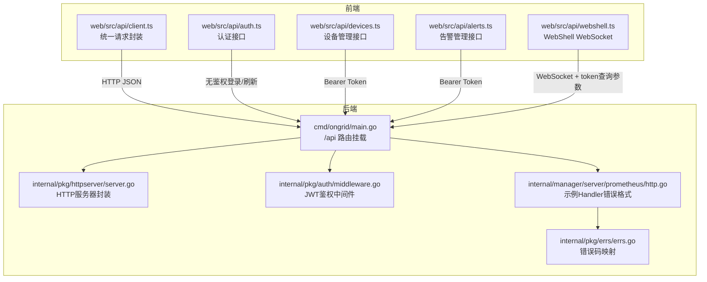
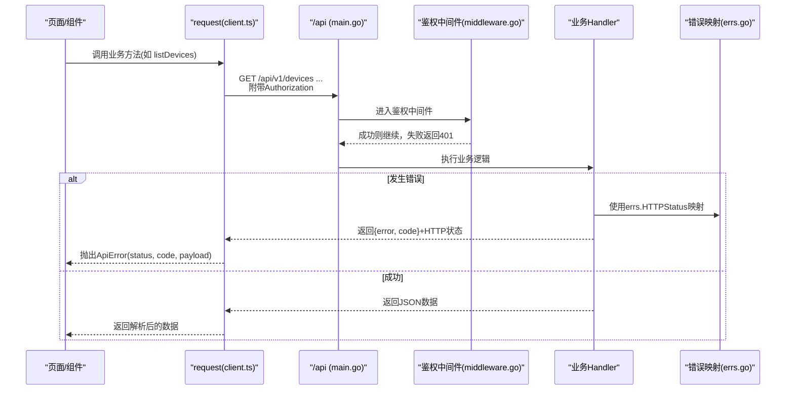
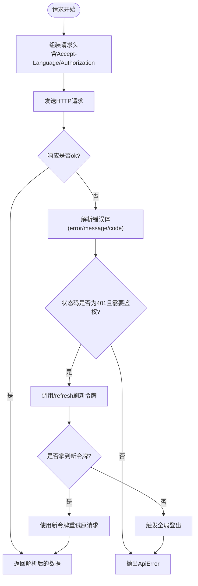
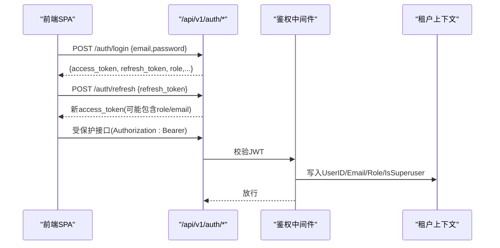
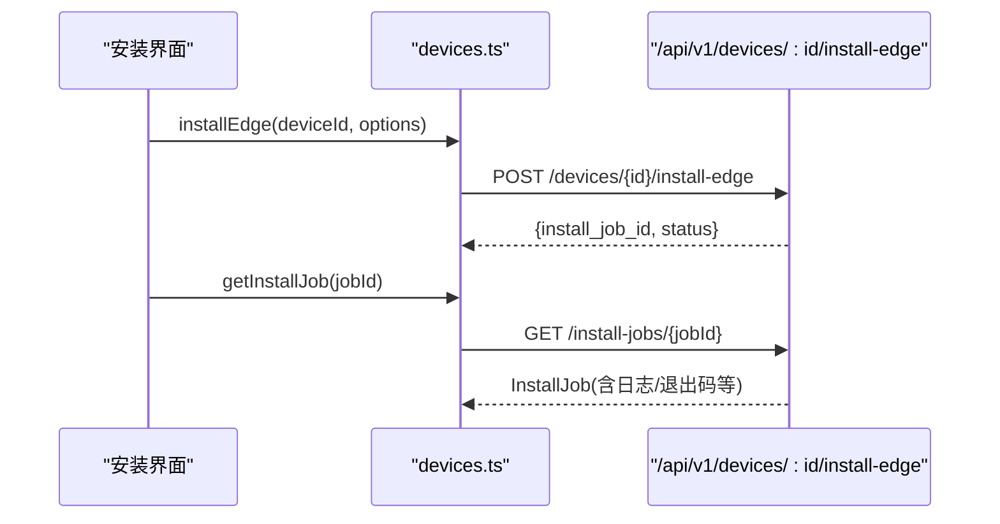
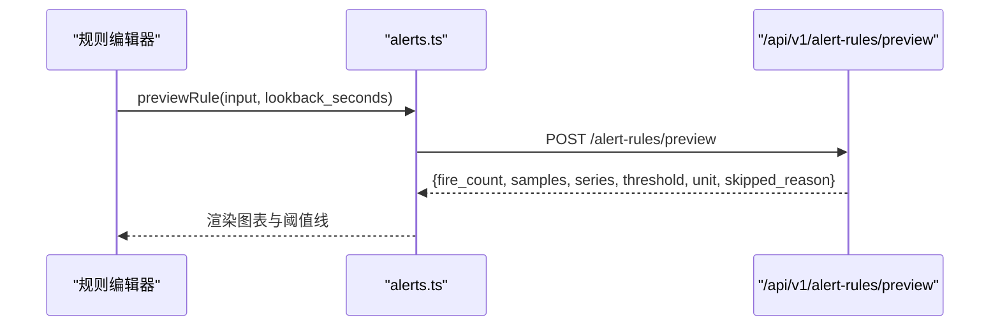
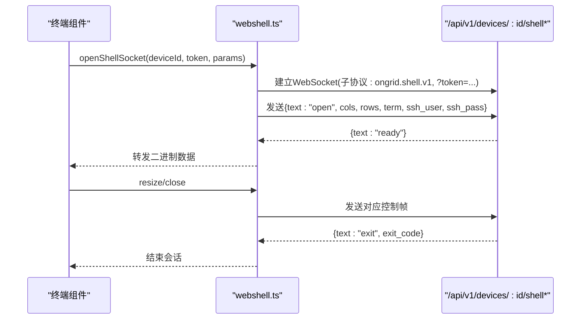
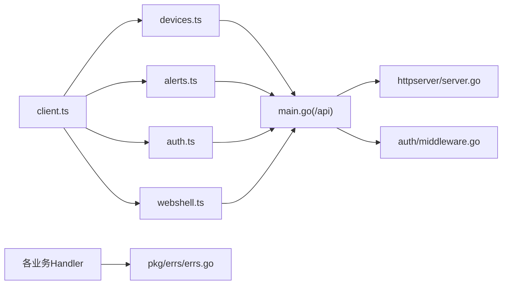

# API集成层

<cite>
**本文引用的文件**   
- [web/src/api/client.ts](file://web/src/api/client.ts)
- [web/src/api/auth.ts](file://web/src/api/auth.ts)
- [web/src/api/devices.ts](file://web/src/api/devices.ts)
- [web/src/api/alerts.ts](file://web/src/api/alerts.ts)
- [web/src/api/webshell.ts](file://web/src/api/webshell.ts)
- [internal/pkg/auth/middleware.go](file://internal/pkg/auth/middleware.go)
- [internal/pkg/httpserver/server.go](file://internal/pkg/httpserver/server.go)
- [cmd/ongrid/main.go](file://cmd/ongrid/main.go)
- [internal/manager/server/prometheus/http.go](file://internal/manager/server/prometheus/http.go)
- [internal/pkg/errs/errs.go](file://internal/pkg/errs/errs.go)
</cite>

## 目录
1. [简介](#简介)
2. [项目结构](#项目结构)
3. [核心组件](#核心组件)
4. [架构总览](#架构总览)
5. [详细组件分析](#详细组件分析)
6. [依赖关系分析](#依赖关系分析)
7. [性能与可靠性考虑](#性能与可靠性考虑)
8. [故障排查指南](#故障排查指南)
9. [结论](#结论)
10. [附录：新接口集成规范与最佳实践](#附录新接口集成规范与最佳实践)

## 简介
本文件面向开发者，系统化梳理前端API集成层的实现与规范，覆盖HTTP客户端封装、请求拦截器、响应与错误统一处理、认证授权流程、设备管理、告警管理等业务模块的API定义与用法，以及实时通信（WebSocket）连接管理与消息协议。同时说明API版本控制策略、向后兼容性与调试/Mock建议，帮助快速、稳定地集成新接口。

## 项目结构
- 前端API层位于 web/src/api，按领域拆分（auth、devices、alerts、webshell等），统一通过 client.ts 中的 request 函数发起HTTP请求。
- 后端HTTP服务由 internal/pkg/httpserver 提供带优雅关闭能力的包装；路由挂载在 cmd/ongrid/main.go 中 /api 前缀下。
- 鉴权中间件位于 internal/pkg/auth/middleware.go，负责JWT校验并将租户上下文注入请求上下文。
- 错误码映射集中在 internal/pkg/errs/errs.go，Handler侧使用 errs.HTTPStatus 将领域错误映射为HTTP状态码。

图示来源
- [web/src/api/client.ts:1-163](file://web/src/api/client.ts#L1-L163)
- [web/src/api/auth.ts:1-30](file://web/src/api/auth.ts#L1-L30)
- [web/src/api/devices.ts:1-490](file://web/src/api/devices.ts#L1-L490)
- [web/src/api/alerts.ts:1-516](file://web/src/api/alerts.ts#L1-L516)
- [web/src/api/webshell.ts:29-103](file://web/src/api/webshell.ts#L29-L103)
- [cmd/ongrid/main.go:2352-2380](file://cmd/ongrid/main.go#L2352-L2380)
- [internal/pkg/httpserver/server.go:1-60](file://internal/pkg/httpserver/server.go#L1-L60)
- [internal/pkg/auth/middleware.go:1-68](file://internal/pkg/auth/middleware.go#L1-L68)
- [internal/manager/server/prometheus/http.go:224-288](file://internal/manager/server/prometheus/http.go#L224-L288)
- [internal/pkg/errs/errs.go:1-54](file://internal/pkg/errs/errs.go#L1-L54)

章节来源
- [web/src/api/client.ts:1-163](file://web/src/api/client.ts#L1-L163)
- [cmd/ongrid/main.go:2352-2380](file://cmd/ongrid/main.go#L2352-L2380)
- [internal/pkg/httpserver/server.go:1-60](file://internal/pkg/httpserver/server.go#L1-L60)
- [internal/pkg/auth/middleware.go:1-68](file://internal/pkg/auth/middleware.go#L1-L68)
- [internal/manager/server/prometheus/http.go:224-288](file://internal/manager/server/prometheus/http.go#L224-L288)
- [internal/pkg/errs/errs.go:1-54](file://internal/pkg/errs/errs.go#L1-L54)

## 核心组件
- HTTP客户端封装（client.ts）
  - 统一BASE路径为 /api/v1，自动附加Accept-Language、Authorization头。
  - 支持FormData与JSON两种Body编码；网络异常统一抛出ApiError。
  - 401自动触发refreshAccessToken，成功后重试一次；失败则强制登出。
  - 支持AbortSignal取消请求。
- 认证接口（auth.ts）
  - 提供登录、刷新、获取当前用户信息接口；登录/刷新走noAuth模式。
- 设备管理（devices.ts）
  - 设备CRUD、角色更新、软删除/恢复、SSH凭据管理、一键安装Edge任务、SFTP/文件系统操作、下载URL与二进制读取。
- 告警管理（alerts.ts）
  - 事件列表/详情、确认/解决/静默、规则CRUD与预览、通知渠道CRUD与测试、运行时信息。
- WebShell（webshell.ts）
  - 基于WebSocket建立会话，子协议为 ongrid.shell.v1，通过查询参数token完成鉴权。

章节来源
- [web/src/api/client.ts:1-163](file://web/src/api/client.ts#L1-L163)
- [web/src/api/auth.ts:1-30](file://web/src/api/auth.ts#L1-L30)
- [web/src/api/devices.ts:1-490](file://web/src/api/devices.ts#L1-L490)
- [web/src/api/alerts.ts:1-516](file://web/src/api/alerts.ts#L1-L516)
- [web/src/api/webshell.ts:29-103](file://web/src/api/webshell.ts#L29-L103)

## 架构总览
- 版本控制：所有REST接口以 /api/v1 为根路径，便于后续演进与兼容性治理。
- 鉴权模型：
  - REST：Authorization: Bearer <JWT>。
  - WebSocket：通过 ?token= 传递JWT（浏览器原生WS限制）。
  - 服务端中间件解析并校验JWT，写入租户上下文供下游使用。
- 错误模型：
  - 服务端统一返回 { error, code } 的JSON体，code取自errs映射。
  - 前端统一捕获并抛出 ApiError，携带 status、code、payload。

图示来源
- [web/src/api/client.ts:27-115](file://web/src/api/client.ts#L27-L115)
- [cmd/ongrid/main.go:2352-2380](file://cmd/ongrid/main.go#L2352-L2380)
- [internal/pkg/auth/middleware.go:21-53](file://internal/pkg/auth/middleware.go#L21-L53)
- [internal/manager/server/prometheus/http.go:266-288](file://internal/manager/server/prometheus/http.go#L266-L288)
- [internal/pkg/errs/errs.go:28-54](file://internal/pkg/errs/errs.go#L28-L54)

## 详细组件分析

### HTTP客户端与错误处理（client.ts）
- 功能要点
  - BASE=/api/v1，自动拼接相对路径。
  - 默认设置 Accept-Language，用于AI相关端点输出语言一致性。
  - 非 noAuth 请求自动附加 Authorization: Bearer。
  - Body序列化：JSON或FormData（上传场景）。
  - 错误处理：对非JSON文本体进行截断展示；401时尝试刷新令牌并重试一次；刷新失败则登出。
- 关键流程（401刷新与重试）

图示来源
- [web/src/api/client.ts:27-115](file://web/src/api/client.ts#L27-L115)
- [web/src/api/client.ts:117-163](file://web/src/api/client.ts#L117-L163)

章节来源
- [web/src/api/client.ts:1-163](file://web/src/api/client.ts#L1-L163)

### 认证与授权（auth.ts + middleware.go）
- 前端
  - login(email, password)、refresh(refresh_token)、getSelf()。
  - 登录/刷新使用 noAuth=true，避免循环鉴权。
- 后端
  - 中间件从 Authorization 或 ?token= 提取JWT，校验后写入租户上下文。
  - 旧版token兼容：若缺少IsSuperuser字段，回退到Role=="admin"判定。

图示来源
- [web/src/api/auth.ts:1-30](file://web/src/api/auth.ts#L1-L30)
- [internal/pkg/auth/middleware.go:21-53](file://internal/pkg/auth/middleware.go#L21-L53)

章节来源
- [web/src/api/auth.ts:1-30](file://web/src/api/auth.ts#L1-L30)
- [internal/pkg/auth/middleware.go:1-68](file://internal/pkg/auth/middleware.go#L1-L68)

### 设备管理API（devices.ts）
- 能力概览
  - 设备CRUD、角色更新、软删除/恢复。
  - SSH凭据管理（密码/密钥）。
  - 一键安装Edge任务（创建/查询/取消，按device或edge维度）。
  - SFTP/文件系统操作（list/stat/mkdir/write/rmdir/rm/rename/chmod/upload/download）。
- 典型调用序列（安装Edge）

图示来源
- [web/src/api/devices.ts:281-356](file://web/src/api/devices.ts#L281-L356)

章节来源
- [web/src/api/devices.ts:1-490](file://web/src/api/devices.ts#L1-L490)

### 告警管理API（alerts.ts）
- 能力概览
  - 事件：列表/详情、确认/解决/静默、事件审计。
  - 规则：列表/详情/创建/更新/启用/删除、预览（只读评估）。
  - 通知渠道：CRUD与测试。
  - 运行时信息：评估周期、冷却时间等。
- 规则预览流程（POST /alert-rules/preview）

图示来源
- [web/src/api/alerts.ts:450-455](file://web/src/api/alerts.ts#L450-L455)

章节来源
- [web/src/api/alerts.ts:1-516](file://web/src/api/alerts.ts#L1-L516)

### 实时通信：WebShell（webshell.ts）
- 连接建立
  - 子协议：ongrid.shell.v1。
  - 鉴权：通过 ?token= 传入JWT（兼容浏览器原生WS无法设置Header的限制）。
  - URL构造：根据当前页面协议选择ws/wss，或通过baseUrl指定。
- 消息协议
  - 客户端→服务端：open/resize/close（文本帧）。
  - 服务端→客户端：ready/auth_error/exit（文本帧），其余为二进制流（终端I/O）。
- 典型交互

图示来源
- [web/src/api/webshell.ts:29-103](file://web/src/api/webshell.ts#L29-L103)
- [internal/pkg/auth/middleware.go:55-67](file://internal/pkg/auth/middleware.go#L55-L67)

章节来源
- [web/src/api/webshell.ts:29-103](file://web/src/api/webshell.ts#L29-L103)
- [internal/pkg/auth/middleware.go:1-68](file://internal/pkg/auth/middleware.go#L1-L68)

## 依赖关系分析
- 前端API模块均依赖 client.ts 的 request 函数，形成单一入口，降低重复代码与不一致风险。
- 后端路由集中于 main.go 的 /api 分组，公共接口与受保护接口分别注册。
- 鉴权中间件独立于业务，保证跨域一致的安全策略。
- 错误处理集中化：errs.go 定义语义化错误，Handler统一映射为HTTP状态码与JSON错误体。

图示来源
- [web/src/api/client.ts:1-163](file://web/src/api/client.ts#L1-L163)
- [web/src/api/devices.ts:1-490](file://web/src/api/devices.ts#L1-L490)
- [web/src/api/alerts.ts:1-516](file://web/src/api/alerts.ts#L1-L516)
- [web/src/api/auth.ts:1-30](file://web/src/api/auth.ts#L1-L30)
- [web/src/api/webshell.ts:29-103](file://web/src/api/webshell.ts#L29-L103)
- [cmd/ongrid/main.go:2352-2380](file://cmd/ongrid/main.go#L2352-L2380)
- [internal/pkg/httpserver/server.go:1-60](file://internal/pkg/httpserver/server.go#L1-L60)
- [internal/pkg/auth/middleware.go:1-68](file://internal/pkg/auth/middleware.go#L1-L68)
- [internal/pkg/errs/errs.go:1-54](file://internal/pkg/errs/errs.go#L1-L54)

章节来源
- [cmd/ongrid/main.go:2352-2380](file://cmd/ongrid/main.go#L2352-L2380)
- [internal/pkg/httpserver/server.go:1-60](file://internal/pkg/httpserver/server.go#L1-L60)
- [internal/pkg/auth/middleware.go:1-68](file://internal/pkg/auth/middleware.go#L1-L68)
- [internal/pkg/errs/errs.go:1-54](file://internal/pkg/errs/errs.go#L1-L54)

## 性能与可靠性考虑
- 请求去重与并发刷新：refreshInFlight 保证同一时刻仅一次刷新请求，避免风暴。
- 超时与取消：支持 AbortSignal，便于页面卸载或切换时及时释放资源。
- 大对象与二进制：文件下载直接走fetch并返回Blob，避免二次序列化开销。
- 幂等性：GET/HEAD等幂等请求可安全重试；写操作需结合业务幂等键或唯一约束。
- 限流与防抖：登录等敏感路径在后端通过 ErrTooManyAttempts 映射为429，前端应配合退避重试。

[本节为通用指导，不直接分析具体文件]

## 故障排查指南
- 常见错误码与含义
  - unauthorized：未携带或无效JWT。
  - forbidden：权限不足或租户不匹配。
  - invalid：参数校验失败或上游查询表达式错误。
  - not-wired-yet：功能尚未接入。
  - too many attempts：短窗口内请求过多（如登录）。
  - service unavailable：边缘节点离线。
- 定位步骤
  - 检查浏览器Network面板的请求头是否包含正确的Authorization。
  - 查看响应体中的 error 与 code 字段，对照上述含义。
  - 对于401，确认本地是否存在有效的refresh_token，并观察是否触发自动刷新。
  - WebSocket连接失败时，确认URL中是否附带token，以及子协议是否正确。
- 参考实现
  - 错误体结构与映射：见 prometheus handler 的错误封装与 errCode 分支。
  - 错误码映射表：见 errs.HTTPStatus。

章节来源
- [internal/manager/server/prometheus/http.go:266-288](file://internal/manager/server/prometheus/http.go#L266-L288)
- [internal/pkg/errs/errs.go:28-54](file://internal/pkg/errs/errs.go#L28-L54)

## 结论
本API集成层通过统一的HTTP客户端、明确的鉴权与错误模型、清晰的领域API划分，实现了前后端解耦与高内聚。版本前缀 /api/v1 为未来演进预留空间；WebSocket采用子协议与查询参数鉴权兼顾了安全性与浏览器限制。遵循本文档的集成规范与最佳实践，可显著提升新接口的开发效率与稳定性。

[本节为总结性内容，不直接分析具体文件]

## 附录：新接口集成规范与最佳实践
- 命名与版本
  - 所有REST路径以 /api/v1 开头，新增接口不得破坏现有契约。
  - 如需变更，优先采用向后兼容方式（新增字段可选、新增枚举值可忽略）。
- 鉴权与上下文
  - REST：必须携带 Authorization: Bearer。
  - WebSocket：通过 ?token= 传递JWT，并在服务端中间件校验。
  - 服务端需在鉴权通过后向上下文注入租户信息，供下游使用。
- 请求与响应
  - 请求体：优先JSON；上传使用FormData。
  - 响应体：成功返回业务数据；失败返回 { error, code }，code来自errs映射。
  - 分页：统一使用 page/page_size 或 limit/offset 约定（参见现有接口风格）。
- 错误处理
  - 前端：统一抛出 ApiError，携带 status、code、payload；对401自动刷新并重试一次。
  - 后端：使用 errs.HTTPStatus 映射领域错误，保持HTTP语义清晰。
- 实时通信
  - 子协议：为每个长连接定义明确子协议（如 ongrid.shell.v1）。
  - 首帧：握手完成后立即发送控制帧（如 open），服务端返回 ready 表示就绪。
  - 心跳与重连：建议在业务层实现心跳检测与指数退避重连。
- 调试与Mock
  - 本地开发：利用Vite代理将 /api/v1 指向本地后端；WebSocket根据页面协议自动选择ws/wss。
  - Mock数据：可在前端测试环境使用MSW或服务端开关返回固定数据，确保UI联调不受后端影响。
  - 日志与追踪：开启浏览器控制台与Network日志，关注错误码与响应体；必要时增加请求ID以便链路追踪。
- 新接口清单模板（建议）
  - 方法：GET/POST/PUT/PATCH/DELETE
  - 路径：/api/v1/<domain>/<resource>[/{id}]
  - 鉴权：是否需要Bearer或公开
  - 请求体：字段名、类型、必填、示例
  - 响应体：成功结构、分页约定
  - 错误码：可能的code与含义
  - 备注：幂等性、限流、缓存策略

[本节为通用规范，不直接分析具体文件]