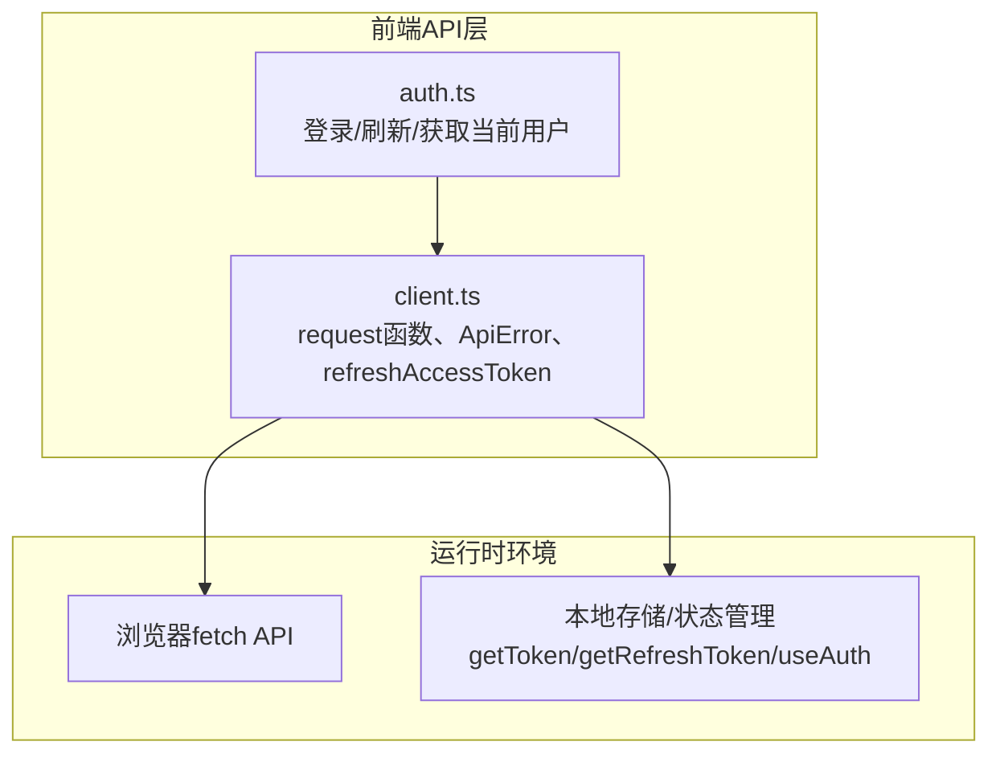
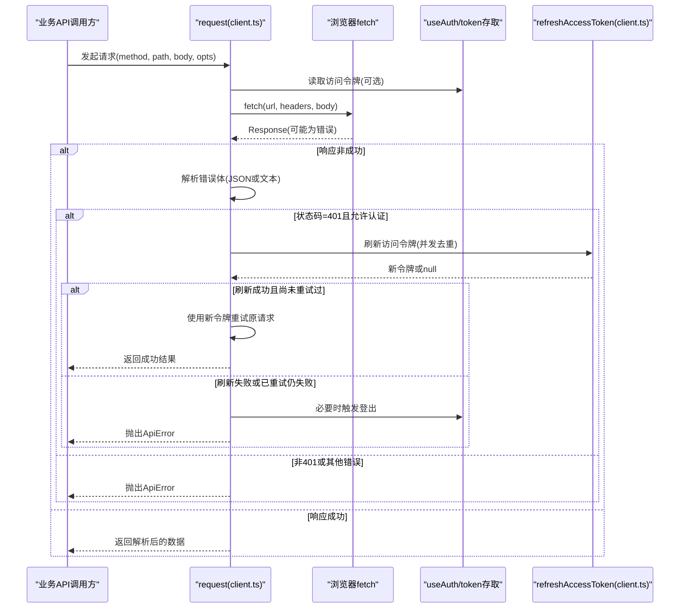
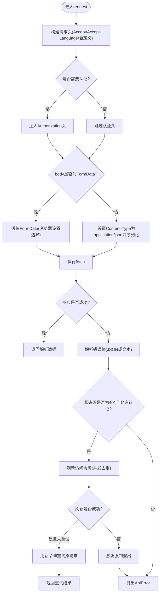
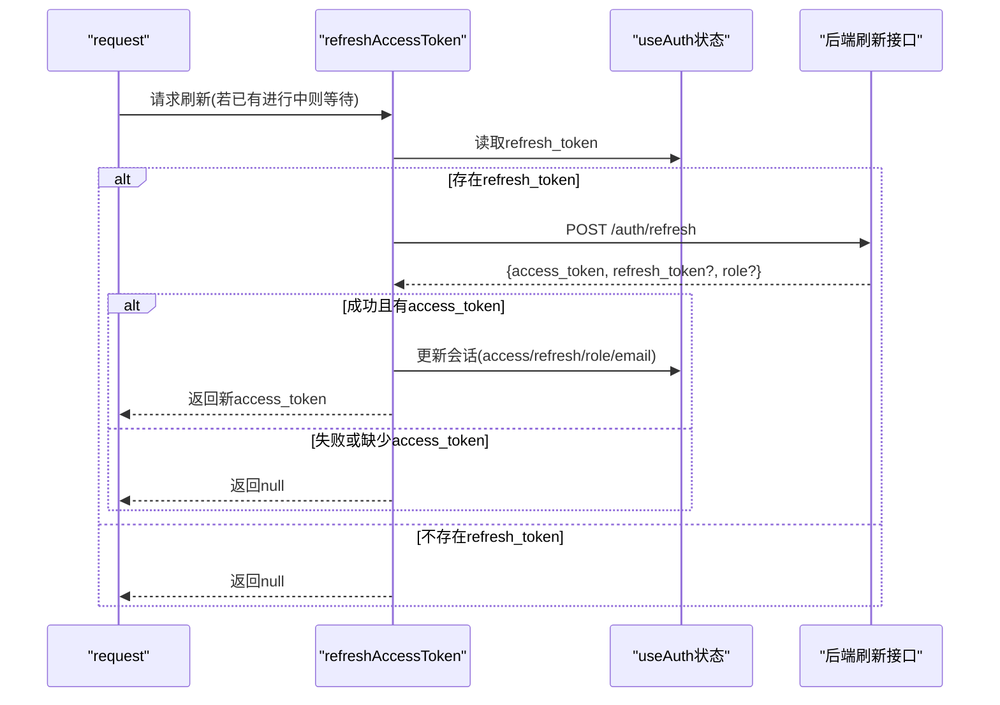
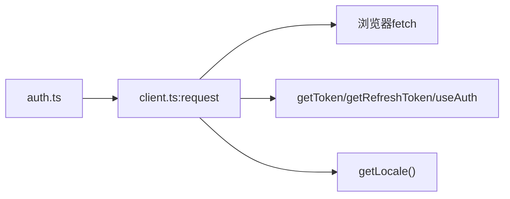

# HTTP客户端封装

<cite>
**本文引用的文件**   
- [web/src/api/client.ts](file://web/src/api/client.ts)
- [web/src/api/auth.ts](file://web/src/api/auth.ts)
</cite>

## 目录
1. [简介](#简介)
2. [项目结构](#项目结构)
3. [核心组件](#核心组件)
4. [架构总览](#架构总览)
5. [详细组件分析](#详细组件分析)
6. [依赖关系分析](#依赖关系分析)
7. [性能与并发特性](#性能与并发特性)
8. [故障排查指南](#故障排查指南)
9. [结论](#结论)
10. [附录：API调用示例与最佳实践](#附录api调用示例与最佳实践)

## 简介
本文件面向前端开发者，系统化梳理并文档化本项目中的HTTP客户端封装。重点覆盖以下方面：
- ApiError异常类的设计与错误处理机制（状态码、错误代码、负载信息）
- request函数的核心实现（请求头管理、认证令牌自动注入、Content-Type智能设置、FormData支持）
- 响应处理的完整流程（JSON解析、文本响应处理、错误响应格式化）
- 401未授权状态的自动刷新机制（refreshAccessToken的并发控制与重试逻辑）
- 完整的API调用示例与最佳实践指南

## 项目结构
HTTP客户端位于前端模块 web/src/api 下，核心实现集中在 client.ts，认证相关API在 auth.ts 中通过统一request进行调用。

图表来源
- [web/src/api/client.ts:27-115](file://web/src/api/client.ts#L27-L115)
- [web/src/api/auth.ts:19-29](file://web/src/api/auth.ts#L19-L29)

章节来源
- [web/src/api/client.ts:1-163](file://web/src/api/client.ts#L1-L163)
- [web/src/api/auth.ts:1-30](file://web/src/api/auth.ts#L1-L30)

## 核心组件
- ApiError：统一的API异常类型，携带HTTP状态码、业务错误码和原始负载，便于上层UI精准展示与分类处理。
- request：通用HTTP请求封装，负责请求头组装、认证令牌注入、Content-Type智能设置、FormData透传、响应体解析与错误格式化，以及401自动刷新与重试。
- refreshAccessToken：401场景下的访问令牌刷新器，具备并发去重与失败兜底能力。

章节来源
- [web/src/api/client.ts:4-15](file://web/src/api/client.ts#L4-L15)
- [web/src/api/client.ts:27-115](file://web/src/api/client.ts#L27-L115)
- [web/src/api/client.ts:117-162](file://web/src/api/client.ts#L117-L162)

## 架构总览
下图展示了从业务API到网络层的调用链路与关键分支（如401刷新与重试）。

图表来源
- [web/src/api/client.ts:27-115](file://web/src/api/client.ts#L27-L115)
- [web/src/api/client.ts:117-162](file://web/src/api/client.ts#L117-L162)

## 详细组件分析

### ApiError异常类
- 设计目标
  - 将HTTP状态码、服务端错误码与原始负载结构化暴露给上层，便于UI分层提示与埋点统计。
- 字段说明
  - status：HTTP状态码；当网络异常时为0。
  - code：服务端返回的业务错误码（若存在）。
  - payload：原始响应体（对象或字符串），用于调试或二次渲染。
- 使用建议
  - 捕获后根据status区分网络错误与服务端错误。
  - 结合code进行业务级路由（如权限不足、参数校验失败等）。
  - 仅在需要时展示payload，避免泄露敏感信息。

章节来源
- [web/src/api/client.ts:4-15](file://web/src/api/client.ts#L4-L15)

### request函数核心实现
- 请求头管理
  - 默认Accept为application/json，并附带Accept-Language以匹配后端AI输出语言策略。
  - 支持opts.headers合并，允许覆盖默认行为。
- 认证令牌自动注入
  - 当opts.noAuth为false时，自动从token存储读取访问令牌并注入Authorization头。
- Content-Type智能设置与FormData支持
  - 当body为FormData时，不设置Content-Type，交由浏览器自动设置multipart/form-data及boundary。
  - 否则设置为application/json并对body进行序列化。
- URL拼接规则
  - 若path以http开头则直接使用；否则基于BASE前缀拼接，确保路径规范化。
- 响应处理流程
  - 优先按content-type判断：application/json则尝试JSON解析，失败回退为null；否则读取文本响应。
  - 错误响应格式化：
    - 若响应体为对象，优先取error或message作为消息，code作为业务错误码。
    - 若响应体为文本，截取前200字符并附加HTTP状态码，便于UI展示可操作信息。
  - 成功响应直接返回解析后的数据。
- 401未授权自动刷新与重试
  - 仅对非noAuth请求生效。
  - 刷新成功后且本次尚未重试过，则以新令牌重试原请求一次。
  - 刷新失败时触发强制登出；即使重试仍返回401，视为其他服务端问题，不再登出。

图表来源
- [web/src/api/client.ts:27-115](file://web/src/api/client.ts#L27-L115)

章节来源
- [web/src/api/client.ts:27-115](file://web/src/api/client.ts#L27-L115)

### refreshAccessToken并发控制与重试逻辑
- 并发控制
  - 使用全局Promise变量记录正在进行的刷新任务，后续并发调用直接复用同一Promise，避免重复刷新风暴。
- 刷新流程
  - 读取刷新令牌，若无则直接返回空。
  - 调用后端刷新接口，成功则更新会话（包含access_token、refresh_token、role、email等）。
  - 失败或无有效access_token时返回空。
- 重试策略
  - 仅在首次遇到401且刷新成功时进行一次重试；防止无限循环。
  - 刷新失败才触发强制登出；重试后仍401视为服务端问题，保留错误上下文以便诊断。

图表来源
- [web/src/api/client.ts:117-162](file://web/src/api/client.ts#L117-L162)

章节来源
- [web/src/api/client.ts:117-162](file://web/src/api/client.ts#L117-L162)

## 依赖关系分析
- 内部依赖
  - request依赖本地认证状态与国际化语言设置，用于注入Authorization与Accept-Language。
  - refreshAccessToken依赖刷新令牌与useAuth状态更新。
- 外部依赖
  - 浏览器原生fetch API完成网络通信。
- 耦合与内聚
  - 所有对外API均通过request统一封装，提升内聚性；认证细节被隐藏，降低耦合度。

图表来源
- [web/src/api/client.ts:1-3](file://web/src/api/client.ts#L1-L3)
- [web/src/api/auth.ts:1-30](file://web/src/api/auth.ts#L1-L30)

章节来源
- [web/src/api/client.ts:1-3](file://web/src/api/client.ts#L1-L3)
- [web/src/api/auth.ts:1-30](file://web/src/api/auth.ts#L1-L30)

## 性能与并发特性
- 并发刷新去重：通过共享Promise避免多次并发刷新造成资源浪费与竞态。
- 最小化重试：仅在401且刷新成功时重试一次，避免雪崩与死循环。
- 响应体解析容错：JSON解析失败回退为null，文本响应截断过长内容，减少内存占用与渲染压力。
- 表单上传优化：FormData由浏览器自动设置边界，避免手动拼接带来的额外开销与错误风险。

[本节为通用指导，无需源码引用]

## 故障排查指南
- 网络错误
  - 现象：抛出ApiError且status为0。
  - 排查：检查网络连通性、跨域配置、AbortSignal是否正确取消。
- 401未授权
  - 现象：自动刷新后仍401或触发强制登出。
  - 排查：确认refresh_token是否存在且有效；检查后端刷新接口与角色/权限变更；观察是否因业务侧策略导致仍返回401。
- 响应体解析异常
  - 现象：期望JSON但收到文本或空体。
  - 排查：核对后端Content-Type与实际返回体；必要时在上层做兼容处理。
- 表单上传失败
  - 现象：后端无法解析multipart数据。
  - 排查：确认传入的是FormData实例，不要手动设置Content-Type。

章节来源
- [web/src/api/client.ts:62-115](file://web/src/api/client.ts#L62-L115)
- [web/src/api/client.ts:117-162](file://web/src/api/client.ts#L117-L162)

## 结论
该HTTP客户端封装以request为核心，提供一致的请求/响应处理与健壮的错误模型。通过401自动刷新与单次重试机制，显著提升了用户体验与系统鲁棒性。配合ApiError的结构化错误信息，上层可快速定位与呈现问题。

[本节为总结性内容，无需源码引用]

## 附录：API调用示例与最佳实践

- 基本GET请求
  - 使用request('GET', '/auth/self')获取当前用户信息。
  - 参考：[web/src/api/auth.ts:27-29](file://web/src/api/auth.ts#L27-L29)

- 登录与刷新
  - 登录：POST /auth/login，需显式关闭认证注入(noAuth: true)。
  - 刷新：POST /auth/refresh，同样关闭认证注入。
  - 参考：[web/src/api/auth.ts:19-25](file://web/src/api/auth.ts#L19-L25)

- 上传文件
  - 构造FormData实例并直接传入request，不要设置Content-Type。
  - 参考：[web/src/api/client.ts:48-57](file://web/src/api/client.ts#L48-L57)

- 自定义请求头
  - 通过opts.headers合并自定义头，注意避免覆盖必要头（如Accept-Language）。
  - 参考：[web/src/api/client.ts:33-41](file://web/src/api/client.ts#L33-L41)

- 取消请求
  - 传入AbortSignal以支持取消。
  - 参考：[web/src/api/client.ts:62-67](file://web/src/api/client.ts#L62-L67)

- 错误处理最佳实践
  - 捕获ApiError，依据status与code进行分类提示。
  - 仅在必要时展示payload，避免泄露敏感信息。
  - 参考：[web/src/api/client.ts:82-112](file://web/src/api/client.ts#L82-L112)

- 401刷新注意事项
  - 刷新失败会触发强制登出；重试后仍401不会登出，应提示具体错误。
  - 参考：[web/src/api/client.ts:97-110](file://web/src/api/client.ts#L97-L110)

章节来源
- [web/src/api/auth.ts:19-29](file://web/src/api/auth.ts#L19-L29)
- [web/src/api/client.ts:33-57](file://web/src/api/client.ts#L33-L57)
- [web/src/api/client.ts:62-112](file://web/src/api/client.ts#L62-L112)