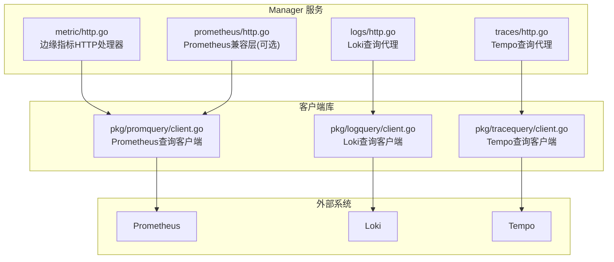
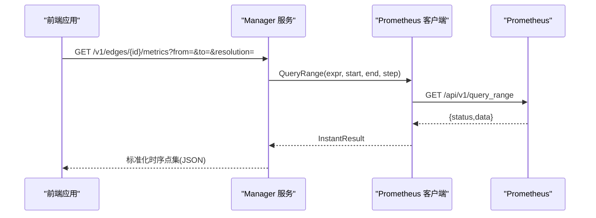
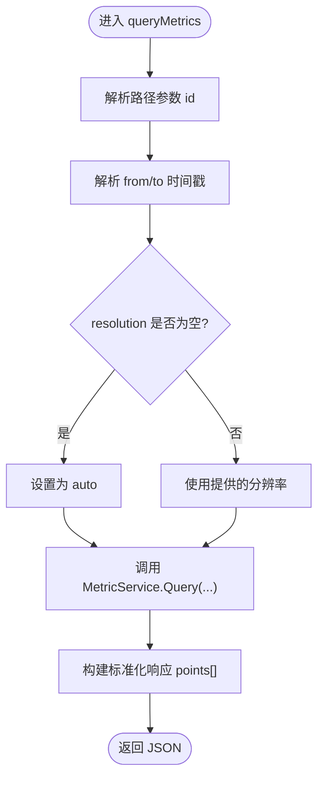
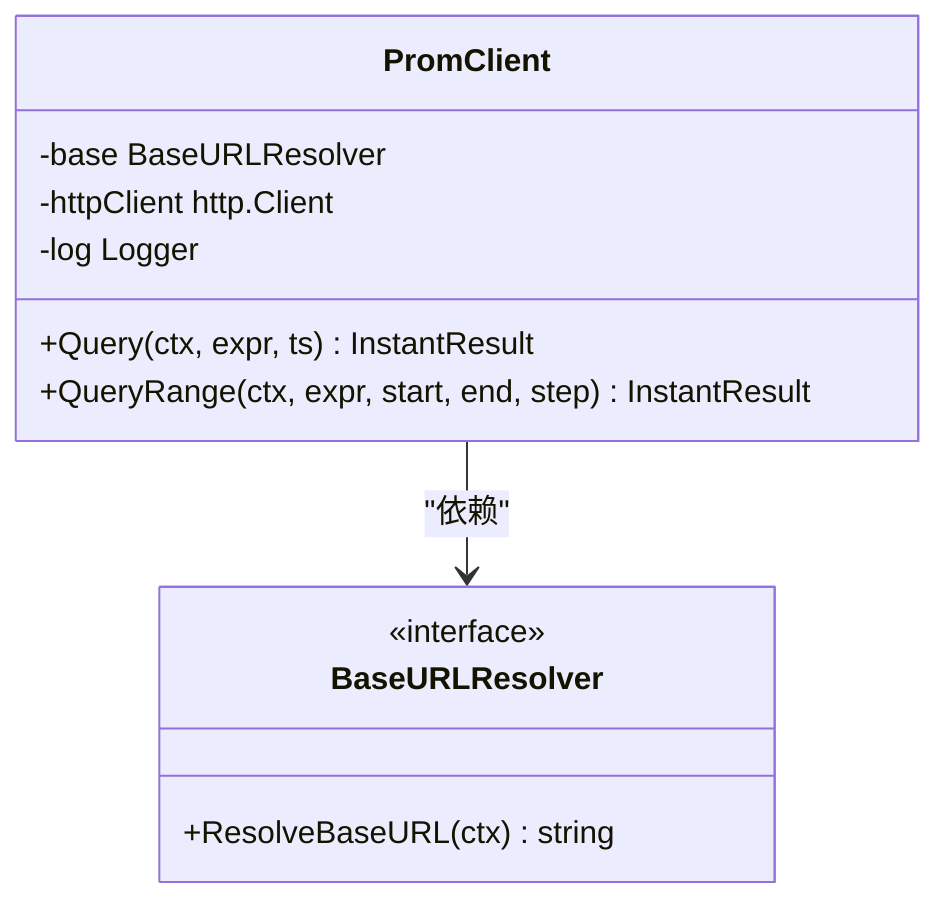
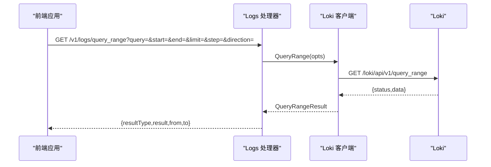
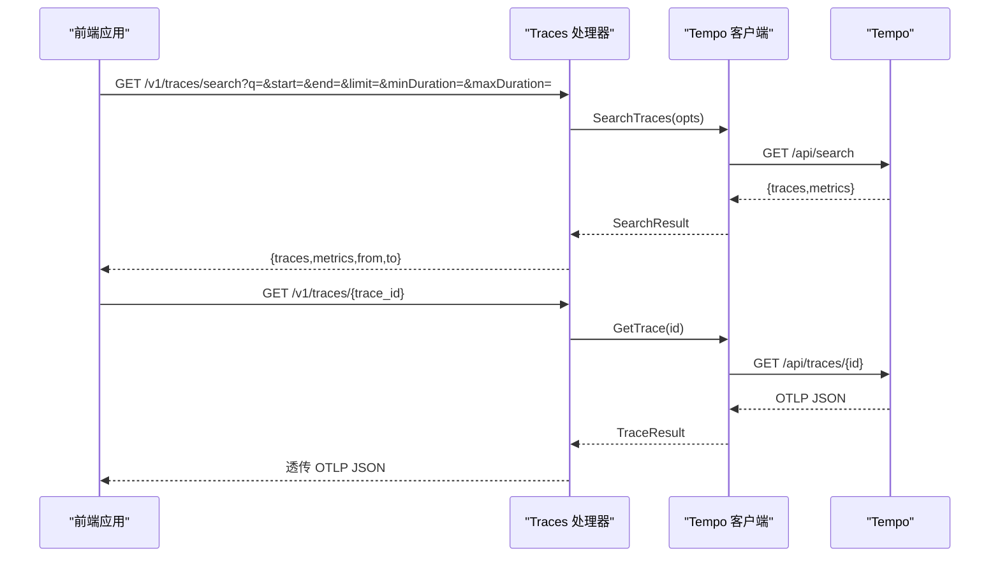
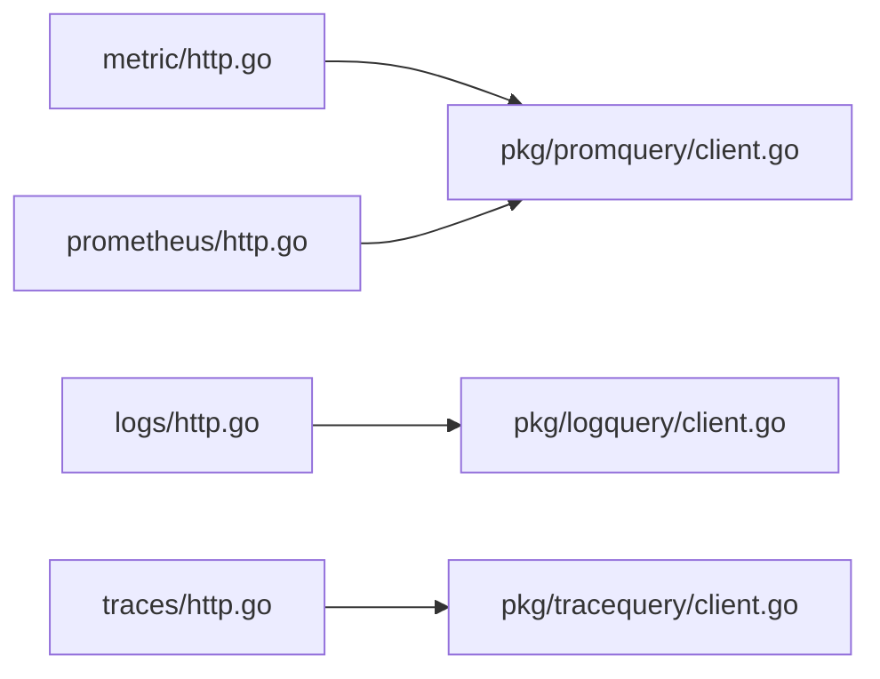

# 可观测性API

<cite>
**本文引用的文件**
- [internal/manager/server/metric/http.go](file://internal/manager/server/metric/http.go)
- [internal/manager/server/logs/http.go](file://internal/manager/server/logs/http.go)
- [internal/manager/server/traces/http.go](file://internal/manager/server/traces/http.go)
- [internal/pkg/promquery/client.go](file://internal/pkg/promquery/client.go)
- [internal/pkg/logquery/client.go](file://internal/pkg/logquery/client.go)
- [internal/pkg/tracequery/client.go](file://internal/pkg/tracequery/client.go)
- [internal/manager/server/prometheus/http.go](file://internal/manager/server/prometheus/http.go)
- [internal/pkg/grafana/client.go](file://internal/pkg/grafana/client.go)
</cite>

## 目录
1. [简介](#简介)
2. [项目结构](#项目结构)
3. [核心组件](#核心组件)
4. [架构总览](#架构总览)
5. [详细组件分析](#详细组件分析)
6. [依赖关系分析](#依赖关系分析)
7. [性能与优化建议](#性能与优化建议)
8. [故障排查指南](#故障排查指南)
9. [结论](#结论)
10. [附录：查询示例与最佳实践](#附录：查询示例与最佳实践)

## 简介
本文件面向使用 Ongrid 可观测性能力的用户与集成方，系统化说明以下能力：
- 指标数据查询接口：Prometheus 查询语言支持与边缘设备时序数据获取
- 日志聚合查询接口：Loki 日志检索、过滤条件与全文搜索
- 分布式追踪查询方法：TraceID 查找、Span 分析与性能瓶颈定位
- Grafana 仪表板集成接口：图表嵌入与动态参数传递（概念性说明）
- 实时监控数据的 WebSocket 推送接口（概念性说明）
并提供完整的查询示例与性能优化技巧。

## 项目结构
可观测性相关 HTTP 路由位于 manager 服务中，分别对应 metrics、logs、traces 三个子域；底层通过独立的 client 包对接 Prometheus、Loki、Tempo 的查询 API。

图示来源
- [internal/manager/server/metric/http.go:1-258](file://internal/manager/server/metric/http.go#L1-L258)
- [internal/manager/server/logs/http.go:1-200](file://internal/manager/server/logs/http.go#L1-L200)
- [internal/manager/server/traces/http.go:1-229](file://internal/manager/server/traces/http.go#L1-L229)
- [internal/manager/server/prometheus/http.go](file://internal/manager/server/prometheus/http.go)
- [internal/pkg/promquery/client.go:1-168](file://internal/pkg/promquery/client.go#L1-L168)
- [internal/pkg/logquery/client.go:1-280](file://internal/pkg/logquery/client.go#L1-L280)
- [internal/pkg/tracequery/client.go:1-253](file://internal/pkg/tracequery/client.go#L1-L253)

章节来源
- [internal/manager/server/metric/http.go:1-258](file://internal/manager/server/metric/http.go#L1-L258)
- [internal/manager/server/logs/http.go:1-200](file://internal/manager/server/logs/http.go#L1-L200)
- [internal/manager/server/traces/http.go:1-229](file://internal/manager/server/traces/http.go#L1-L229)
- [internal/pkg/promquery/client.go:1-168](file://internal/pkg/promquery/client.go#L1-L168)
- [internal/pkg/logquery/client.go:1-280](file://internal/pkg/logquery/client.go#L1-L280)
- [internal/pkg/tracequery/client.go:1-253](file://internal/pkg/tracequery/client.go#L1-L253)

## 核心组件
- 指标查询处理器：提供按边缘设备维度拉取时序点集的 REST 接口，支持自动/原始/5分钟/1小时分辨率聚合。
- Loki 查询代理：将 LogQL 查询、标签名与值枚举等能力以安全边界暴露给前端。
- Tempo 查询代理：提供 TraceQL/标签筛选、TraceID 详情与标签值枚举。
- 查询客户端库：封装对 Prometheus/Loki/Tempo 的 HTTP 调用、超时与错误处理、结果解包。

章节来源
- [internal/manager/server/metric/http.go:1-258](file://internal/manager/server/metric/http.go#L1-L258)
- [internal/manager/server/logs/http.go:1-200](file://internal/manager/server/logs/http.go#L1-L200)
- [internal/manager/server/traces/http.go:1-229](file://internal/manager/server/traces/http.go#L1-L229)
- [internal/pkg/promquery/client.go:1-168](file://internal/pkg/promquery/client.go#L1-L168)
- [internal/pkg/logquery/client.go:1-280](file://internal/pkg/logquery/client.go#L1-L280)
- [internal/pkg/tracequery/client.go:1-253](file://internal/pkg/tracequery/client.go#L1-L253)

## 架构总览
整体采用“统一入口 + 后端代理”的模式：前端仅与 Manager 的可观测性 HTTP 端点交互，由 Manager 转发到 Prometheus/Loki/Tempo 的查询 API，并做鉴权、限流与错误归一化。

图示来源
- [internal/manager/server/metric/http.go:85-126](file://internal/manager/server/metric/http.go#L85-L126)
- [internal/pkg/promquery/client.go:103-117](file://internal/pkg/promquery/client.go#L103-L117)

## 详细组件分析

### 指标数据查询接口（边缘设备时序）
- 路由与方法
  - GET /v1/edges/{id}/metrics
  - 查询参数
    - from/to：RFC3339 时间戳
    - resolution：auto|raw|5m|1h（默认 auto）
- 响应结构
  - resolution：实际使用的分辨率
  - from/to：请求时间窗
  - points：时序点数组，包含 CPU/Mem/Load/Net/Disk 等字段，按分辨率返回 avg/max 或原始值
- 错误码
  - invalid：参数不合法
  - not-found：设备不存在
  - edge-offline：设备离线
  - internal：内部错误

图示来源
- [internal/manager/server/metric/http.go:85-126](file://internal/manager/server/metric/http.go#L85-L126)
- [internal/manager/server/metric/http.go:128-183](file://internal/manager/server/metric/http.go#L128-L183)

章节来源
- [internal/manager/server/metric/http.go:1-258](file://internal/manager/server/metric/http.go#L1-L258)

### Prometheus 查询语言支持（通用 PromQL）
- 客户端能力
  - 瞬时查询：Query(expr, ts)
  - 范围查询：QueryRange(expr, start, end, step)
- 特性
  - 支持静态 BaseURL 与动态 BaseURLResolver
  - 统一错误包装与状态码处理
  - 限制响应体大小，避免内存膨胀
- 典型用法
  - 在业务侧构造 PromQL 表达式，传入时间窗口与步长，获得矩阵/向量/标量原始 JSON 片段

图示来源
- [internal/pkg/promquery/client.go:1-168](file://internal/pkg/promquery/client.go#L1-L168)

章节来源
- [internal/pkg/promquery/client.go:1-168](file://internal/pkg/promquery/client.go#L1-L168)
- [internal/manager/server/prometheus/http.go](file://internal/manager/server/prometheus/http.go)

### 日志聚合查询接口（Loki）
- 路由与方法
  - GET /v1/logs/query_range：执行 LogQL 查询
    - 参数：start/end（RFC3339 或 Unix 时间）、limit（1..5000）、step（正数时长）、direction（forward|backward）
  - GET /v1/logs/labels：列出标签键
  - GET /v1/logs/labels/{name}/values：列出某标签的值
- 行为
  - 当后端未启用时返回 503
  - 统一超时与错误包装
  - 单租户场景下注入 X-Scope-OrgID

图示来源
- [internal/manager/server/logs/http.go:64-124](file://internal/manager/server/logs/http.go#L64-L124)
- [internal/pkg/logquery/client.go:124-171](file://internal/pkg/logquery/client.go#L124-L171)

章节来源
- [internal/manager/server/logs/http.go:1-200](file://internal/manager/server/logs/http.go#L1-L200)
- [internal/pkg/logquery/client.go:1-280](file://internal/pkg/logquery/client.go#L1-L280)

### 分布式追踪查询接口（Tempo）
- 路由与方法
  - GET /v1/traces/search：TraceQL 或标签筛选
    - 参数：q（TraceQL）、service/operation（非 TraceQL 模式）、start/end、limit（1..1000）、minDuration/maxDuration
  - GET /v1/traces/tags/{tag}/values：枚举标签值
  - GET /v1/traces/{trace_id}：获取完整 Trace（OTLP JSON）
- 行为
  - 当后端未启用时返回 503
  - 统一超时与错误包装
  - 支持 legacy tags 与 TraceQL 两种模式

图示来源
- [internal/manager/server/traces/http.go:66-152](file://internal/manager/server/traces/http.go#L66-L152)
- [internal/pkg/tracequery/client.go:112-157](file://internal/pkg/tracequery/client.go#L112-L157)
- [internal/pkg/tracequery/client.go:188-201](file://internal/pkg/tracequery/client.go#L188-L201)

章节来源
- [internal/manager/server/traces/http.go:1-229](file://internal/manager/server/traces/http.go#L1-L229)
- [internal/pkg/tracequery/client.go:1-253](file://internal/pkg/tracequery/client.go#L1-L253)

### Grafana 仪表板集成接口（概念性说明）
- 目标
  - 通过后端客户端与 Grafana 交互，实现图表嵌入与动态变量传递
- 常见做法
  - 使用 Grafana 的 Dashboard URI 模板与变量占位符，结合后端生成的 URL 进行内嵌展示
  - 通过后端缓存/代理方式访问 Grafana 的查询 API，完成权限控制与审计
- 注意
  - 本节为概念性说明，具体实现需参考 Grafana 官方文档与现有 Grafana 客户端代码

[本节为概念性内容，不涉及具体源码分析]

### 实时监控数据的 WebSocket 推送接口（概念性说明）
- 目标
  - 提供实时事件/告警/链路更新的 WebSocket 通道
- 常见做法
  - 基于 SSE 或 WebSocket 建立持久连接，服务端按需推送增量数据
  - 前端维护重连与去抖逻辑
- 注意
  - 本节为概念性说明，当前仓库中未发现专门的监控推送 WebSocket 路由定义

[本节为概念性内容，不涉及具体源码分析]

## 依赖关系分析
- 低耦合高内聚
  - 每个信号类型（指标/日志/追踪）拥有独立 Handler 与 Client 包，职责清晰
- 外部依赖
  - Prometheus/Loki/Tempo 的查询 API 作为外部系统
- 可能的循环依赖
  - 当前结构未见循环导入；Handler 仅依赖窄接口，Client 仅负责 HTTP 通信

图示来源
- [internal/manager/server/metric/http.go:1-258](file://internal/manager/server/metric/http.go#L1-L258)
- [internal/manager/server/logs/http.go:1-200](file://internal/manager/server/logs/http.go#L1-L200)
- [internal/manager/server/traces/http.go:1-229](file://internal/manager/server/traces/http.go#L1-L229)
- [internal/manager/server/prometheus/http.go](file://internal/manager/server/prometheus/http.go)
- [internal/pkg/promquery/client.go:1-168](file://internal/pkg/promquery/client.go#L1-L168)
- [internal/pkg/logquery/client.go:1-280](file://internal/pkg/logquery/client.go#L1-L280)
- [internal/pkg/tracequery/client.go:1-253](file://internal/pkg/tracequery/client.go#L1-L253)

章节来源
- [internal/manager/server/metric/http.go:1-258](file://internal/manager/server/metric/http.go#L1-L258)
- [internal/manager/server/logs/http.go:1-200](file://internal/manager/server/logs/http.go#L1-L200)
- [internal/manager/server/traces/http.go:1-229](file://internal/manager/server/traces/http.go#L1-L229)
- [internal/pkg/promquery/client.go:1-168](file://internal/pkg/promquery/client.go#L1-L168)
- [internal/pkg/logquery/client.go:1-280](file://internal/pkg/logquery/client.go#L1-L280)
- [internal/pkg/tracequery/client.go:1-253](file://internal/pkg/tracequery/client.go#L1-L253)

## 性能与优化建议
- 时间窗口与步长
  - 尽量缩小 from/to 范围；合理设置 step，避免过细粒度导致数据量过大
- 限制返回条数
  - 日志与追踪查询均有限制参数，建议根据 UI 展示需求设置上限
- 分辨率选择
  - 历史长周期优先使用 5m/1h 聚合，减少前端渲染压力
- 超时与重试
  - 客户端已内置默认超时，必要时可在上层增加幂等重试与退避策略
- 资源保护
  - 客户端对响应体做了大小限制，防止异常大响应导致 OOM

[本节为通用指导，不涉及具体源码分析]

## 故障排查指南
- 常见错误码与含义
  - invalid：参数校验失败（如时间格式、limit 范围）
  - not-found：资源不存在（如设备 ID）
  - unauthorized/forbidden：鉴权失败（由上游中间件处理）
  - edge-offline：设备离线
  - internal：内部错误
- 快速定位
  - 检查 from/to 是否 RFC3339 或有效 Unix 时间
  - 确认 limit/direction/minDuration/maxDuration 是否在允许范围
  - 查看后端日志中的 non-200 警告信息，定位下游服务问题

章节来源
- [internal/manager/server/metric/http.go:226-258](file://internal/manager/server/metric/http.go#L226-L258)
- [internal/manager/server/logs/http.go:191-200](file://internal/manager/server/logs/http.go#L191-L200)
- [internal/manager/server/traces/http.go:220-229](file://internal/manager/server/traces/http.go#L220-L229)
- [internal/pkg/promquery/client.go:143-167](file://internal/pkg/promquery/client.go#L143-L167)
- [internal/pkg/logquery/client.go:264-272](file://internal/pkg/logquery/client.go#L264-L272)
- [internal/pkg/tracequery/client.go:232-243](file://internal/pkg/tracequery/client.go#L232-L243)

## 结论
Ongrid 的可观测性 API 以统一的 Manager 入口对外暴露指标、日志、追踪三类查询能力，并通过专用客户端库屏蔽底层差异。该设计便于扩展新的数据源、统一鉴权与错误处理，并为前端提供稳定一致的契约。建议在接入时遵循时间窗口与限制参数的最佳实践，以获得更优的性能与稳定性。

[本节为总结性内容，不涉及具体源码分析]

## 附录：查询示例与最佳实践

- 指标查询（边缘设备）
  - 请求：GET /v1/edges/{id}/metrics?from=2026-07-01T00:00:00Z&to=2026-07-01T01:00:00Z&resolution=5m
  - 要点：resolution 建议使用 5m/1h 用于长周期；raw 适合短窗口诊断
  - 参考：[internal/manager/server/metric/http.go:39-41](file://internal/manager/server/metric/http.go#L39-L41)

- Prometheus PromQL 查询
  - 瞬时查询：Query(expr, ts)
  - 范围查询：QueryRange(expr, start, end, step)
  - 参考：[internal/pkg/promquery/client.go:94-117](file://internal/pkg/promquery/client.go#L94-L117)

- Loki 日志查询
  - 请求：GET /v1/logs/query_range?query={job="app"} |~ "error"&start=...&end=...&limit=1000&direction=backward
  - 标签枚举：GET /v1/logs/labels 与 GET /v1/logs/labels/{name}/values
  - 参考：[internal/manager/server/logs/http.go:52-55](file://internal/manager/server/logs/http.go#L52-L55)

- Tempo 追踪查询
  - TraceQL 搜索：GET /v1/traces/search?q={ resource.service.name = "web" && duration > 200ms }&start=...&end=...&limit=100
  - 标签筛选：GET /v1/traces/search?service=web&operation=getUser&start=...&end=...
  - Trace 详情：GET /v1/traces/{trace_id}
  - 参考：[internal/manager/server/traces/http.go:53-57](file://internal/manager/server/traces/http.go#L53-L57)

- Grafana 集成（概念性）
  - 使用带变量的 Dashboard URL 进行内嵌展示，结合后端生成动态参数
  - 参考：[internal/pkg/grafana/client.go](file://internal/pkg/grafana/client.go)

- WebSocket 推送（概念性）
  - 如需实时推送，建议在前端建立 WS/SSE 连接，服务端按需推送增量数据
  - 参考：[web/src/api/webshell.ts:55-103](file://web/src/api/webshell.ts#L55-L103)