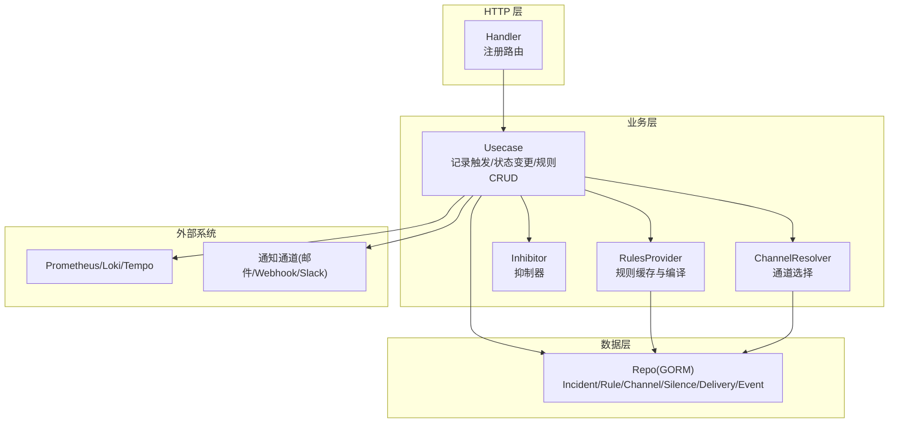
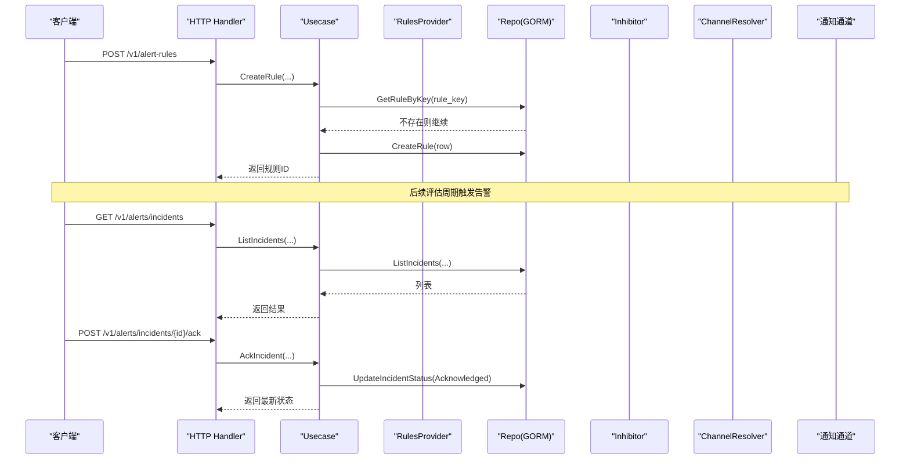
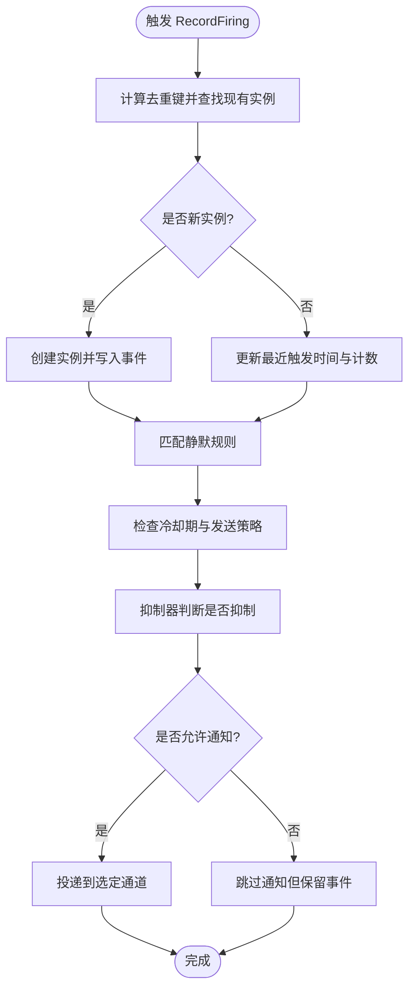
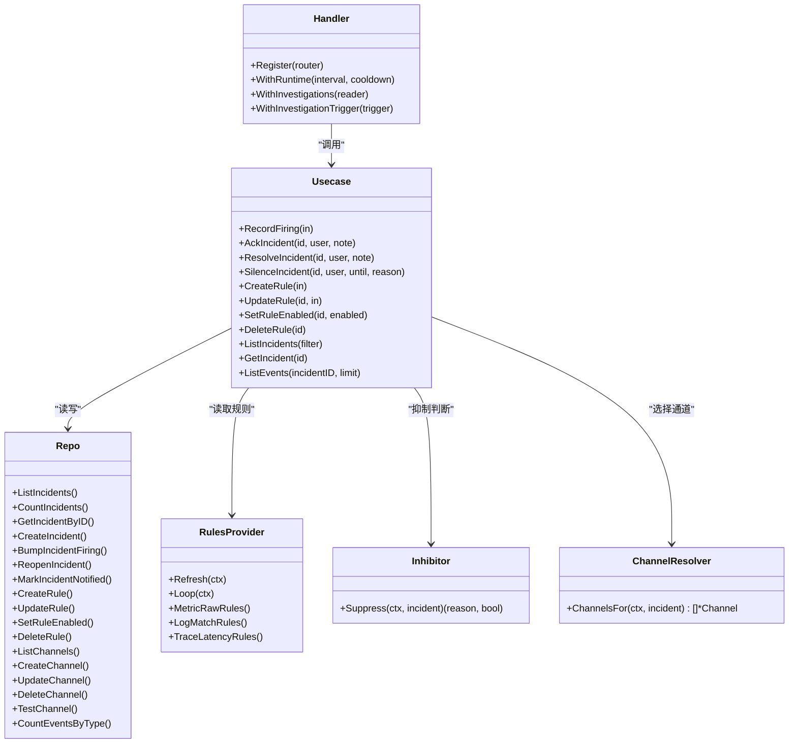
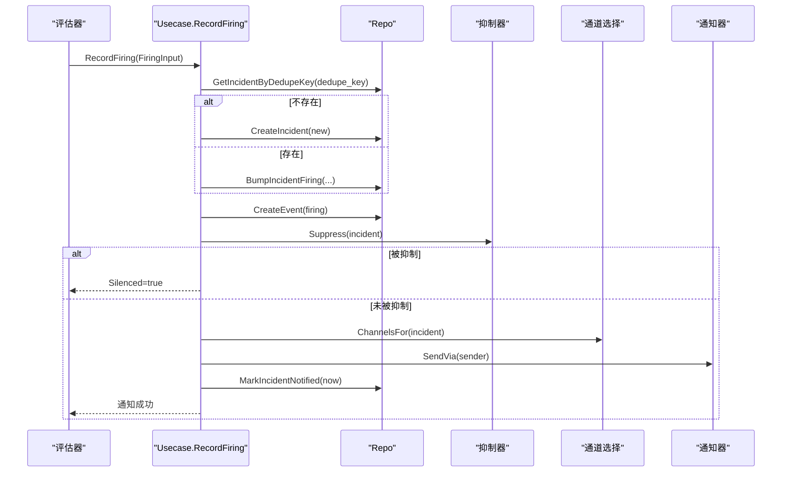

# 告警管理API

<cite>
**本文引用的文件**   
- [alert.proto](file://api/manager/alert/v1/alert.proto)
- [http.go](file://internal/manager/server/alert/http.go)
- [usecase.go](file://internal/manager/biz/alert/usecase.go)
- [repo.go](file://internal/manager/data/alert/store/repo.go)
- [rules.go](file://internal/manager/biz/alert/rules.go)
- [inhibit.go](file://internal/manager/biz/alert/inhibit.go)
- [router.go](file://internal/manager/biz/alert/router.go)
</cite>

## 目录
1. [简介](#简介)
2. [项目结构](#项目结构)
3. [核心组件](#核心组件)
4. [架构总览](#架构总览)
5. [详细组件分析](#详细组件分析)
6. [依赖关系分析](#依赖关系分析)
7. [性能与可扩展性](#性能与可扩展性)
8. [故障排查指南](#故障排查指南)
9. [结论](#结论)
10. [附录：规则定义示例与处理工作流](#附录：规则定义示例与处理工作流)

## 简介
本文件面向“告警管理”能力，提供完整的 API 文档与实现说明，覆盖以下范围：
- 告警规则的 CRUD、启用/禁用、预览
- 告警实例（事件）的查询、详情、状态变更（确认、解决、静默）
- 通知渠道的配置与管理（创建、更新、删除、测试）
- 抑制与去重机制（内置抑制、冷却期、发送策略）
- 统计与分析数据接口（运行时信息、事件计数等）
- 完整规则定义示例与端到端告警处理工作流

## 项目结构
告警模块采用分层设计：HTTP 层暴露 RESTful 接口；业务层编排流程；数据层通过 GORM 访问存储。同时包含规则编译与缓存、通知路由、抑制器、以及可选的 AI 调查与工作流触发。

图表来源
- [http.go:154-181](file://internal/manager/server/alert/http.go#L154-L181)
- [usecase.go:73-103](file://internal/manager/biz/alert/usecase.go#L73-L103)
- [rules.go:305-479](file://internal/manager/biz/alert/rules.go#L305-L479)
- [inhibit.go:25-74](file://internal/manager/biz/alert/inhibit.go#L25-L74)
- [router.go:31-111](file://internal/manager/biz/alert/router.go#L31-L111)
- [repo.go:16-23](file://internal/manager/data/alert/store/repo.go#L16-L23)

章节来源
- [http.go:154-181](file://internal/manager/server/alert/http.go#L154-L181)
- [usecase.go:73-103](file://internal/manager/biz/alert/usecase.go#L73-L103)
- [rules.go:305-479](file://internal/manager/biz/alert/rules.go#L305-L479)
- [inhibit.go:25-74](file://internal/manager/biz/alert/inhibit.go#L25-L74)
- [router.go:31-111](file://internal/manager/biz/alert/router.go#L31-L111)
- [repo.go:16-23](file://internal/manager/data/alert/store/repo.go#L16-L23)

## 核心组件
- HTTP Handler：统一注册告警相关 REST 路由，负责鉴权、参数解析、审计日志注入与响应封装。
- 业务 Usecase：实现告警生命周期（触发、去重、静默、冷却）、规则 CRUD、通知投递与重试、AI 调查与工作流触发。
- 规则提供者：从数据库加载已启用规则，按类型编译为可执行规则快照，周期性刷新。
- 抑制器：基于活跃告警进行抑制（如 edge_offline 抑制主机级告警）。
- 通道解析器：根据规则级别钉选或全局过滤决定目标通知通道。
- 数据仓库 Repo：基于 GORM 的持久化操作，包括 Incident、Rule、Channel、Silence、Delivery、Event 等。

章节来源
- [http.go:106-181](file://internal/manager/server/alert/http.go#L106-L181)
- [usecase.go:73-103](file://internal/manager/biz/alert/usecase.go#L73-L103)
- [rules.go:193-215](file://internal/manager/biz/alert/rules.go#L193-L215)
- [inhibit.go:25-74](file://internal/manager/biz/alert/inhibit.go#L25-L74)
- [router.go:31-111](file://internal/manager/biz/alert/router.go#L31-L111)
- [repo.go:16-23](file://internal/manager/data/alert/store/repo.go#L16-L23)

## 架构总览
下图展示一次“创建告警规则并触发告警”的端到端调用链，涵盖规则校验、存储、评估、抑制、通道选择与通知投递。

图表来源
- [http.go:735-759](file://internal/manager/server/alert/http.go#L735-L759)
- [usecase.go:627-646](file://internal/manager/biz/alert/usecase.go#L627-L646)
- [repo.go:448-453](file://internal/manager/data/alert/store/repo.go#L448-L453)
- [http.go:458-462](file://internal/manager/server/alert/http.go#L458-L462)
- [repo.go:147-173](file://internal/manager/data/alert/store/repo.go#L147-L173)

## 详细组件分析

### 告警规则 API（CRUD、启用/禁用、预览）
- 列出规则：GET /v1/alert-rules?scope=...
- 获取规则：GET /v1/alert-rules/{id}
- 创建规则：POST /v1/alert-rules
- 更新规则：PUT /v1/alert-rules/{id}
- 启用/禁用：POST /v1/alert-rules/{id}/enabled
- 删除规则：DELETE /v1/alert-rules/{id}
- 规则预览：POST /v1/alert-rules/preview

请求体关键字段（节选）
- rule_key: 唯一键（小写下划线）
- kind: 规则类型（metric_raw/metric_anomaly/metric_forecast/log_match/log_volume/trace_latency/trace_error_rate 等）
- name/scope_type/join_mode/severity/enabled
- conditions/spec: 各类型的条件或表达式
- labels/runbook_url/notify_channel_ids
- send-policy: notify_window_seconds + notify_min_fires（二者同为零表示禁用，均大于零表示启用）

权限控制
- 读取：需要登录用户
- 写入（创建/更新/启用/禁用/删除/预览）：需要管理员

错误码与约束
- rule_key 重复：冲突
- 字段缺失或非法：无效参数
- 内置规则不可删除：禁止操作

章节来源
- [http.go:701-800](file://internal/manager/server/alert/http.go#L701-L800)
- [usecase.go:575-800](file://internal/manager/biz/alert/usecase.go#L575-L800)
- [repo.go:568-627](file://internal/manager/data/alert/store/repo.go#L568-L627)

### 告警实例 API（列表、详情、事件、状态变更）
- 列表：GET /v1/alerts/incidents?status=&severity=&query=&page=&page_size=
- 详情：GET /v1/alerts/incidents/{id}
- 事件：GET /v1/alerts/incidents/{id}/events?limit=
- 确认：POST /v1/alerts/incidents/{id}/ack {note}
- 解决：POST /v1/alerts/incidents/{id}/resolve {note}
- 静默：POST /v1/alerts/incidents/{id}/silence {until, reason}
- 运行态信息：GET /v1/alerts/runtime-info

状态机要点
- open → acknowledged/resolved/silenced
- resolved 再次触发会 reopen 回 open
- silenced_until 过期后自动恢复

章节来源
- [http.go:254-301](file://internal/manager/server/alert/http.go#L254-L301)
- [http.go:470-523](file://internal/manager/server/alert/http.go#L470-L523)
- [usecase.go:125-251](file://internal/manager/biz/alert/usecase.go#L125-L251)
- [repo.go:25-75](file://internal/manager/data/alert/store/repo.go#L25-L75)

### 通知渠道 API（配置、测试）
- 列表：GET /v1/notification-channels?page=&page_size=
- 详情：GET /v1/notification-channels/{id}
- 创建：POST /v1/notification-channels
- 更新：PUT /v1/notification-channels/{id}
- 删除：DELETE /v1/notification-channels/{id}
- 测试：POST /v1/notification-channels/{id}/test

支持类型
- 邮件、Webhook、Slack 等（由具体 Sender 实现驱动）

权限控制
- 仅管理员可创建/更新/删除/测试

章节来源
- [http.go:557-699](file://internal/manager/server/alert/http.go#L557-L699)
- [repo.go:629-739](file://internal/manager/data/alert/store/repo.go#L629-L739)

### 抑制与去重机制
- 去重键：默认基于 scope/device/rule 组合，也可自定义 dedupe_key
- 冷却期：MarkNotified 记录最近通知时间，避免频繁重复通知
- 发送策略：在窗口内达到最小触发次数才通知（notify_window_seconds + notify_min_fires）
- 抑制器：当更高优先级告警处于活跃时抑制子告警（例如 edge_offline 抑制主机级告警）

图表来源
- [usecase.go:315-479](file://internal/manager/biz/alert/usecase.go#L315-L479)
- [inhibit.go:44-74](file://internal/manager/biz/alert/inhibit.go#L44-L74)
- [repo.go:231-246](file://internal/manager/data/alert/store/repo.go#L231-L246)

章节来源
- [usecase.go:315-479](file://internal/manager/biz/alert/usecase.go#L315-L479)
- [inhibit.go:44-74](file://internal/manager/biz/alert/inhibit.go#L44-L74)
- [repo.go:231-246](file://internal/manager/data/alert/store/repo.go#L231-L246)

### 通道选择与钉选
- 规则级钉选：若规则指定 notify_channel_ids，则优先使用这些通道（忽略全局过滤）
- 全局过滤：按通道配置的最低严重级别与作用域筛选
- 无匹配时的回退：使用环境变量中预置的默认通道名

章节来源
- [router.go:65-111](file://internal/manager/biz/alert/router.go#L65-L111)
- [usecase.go:575-800](file://internal/manager/biz/alert/usecase.go#L575-L800)

### 统计与分析数据
- 事件计数：按事件类型、严重级别、规则键聚合计数（用于指标与报表）
- 运行时信息：评估间隔与通知冷却期等元数据（GET /v1/alerts/runtime-info）

章节来源
- [repo.go:354-374](file://internal/manager/data/alert/store/repo.go#L354-L374)
- [http.go:128-136](file://internal/manager/server/alert/http.go#L128-L136)

## 依赖关系分析
- HTTP Handler 依赖业务接口（IncidentService/ChannelService/RuleService），不直接访问数据层
- Usecase 依赖 Repo 与可选的外部能力（Notifier、Investigator、WorkflowDispatcher）
- RulesProvider 周期性从 Repo 加载规则并编译为只读快照
- ChannelResolver 依赖 Repo 的通道列表与可选的规则查找函数
- Inhibitor 依赖 Repo 的实例查询以判定活跃告警

图表来源
- [http.go:106-181](file://internal/manager/server/alert/http.go#L106-L181)
- [usecase.go:73-103](file://internal/manager/biz/alert/usecase.go#L73-L103)
- [repo.go:16-23](file://internal/manager/data/alert/store/repo.go#L16-L23)
- [rules.go:305-479](file://internal/manager/biz/alert/rules.go#L305-L479)
- [inhibit.go:25-74](file://internal/manager/biz/alert/inhibit.go#L25-L74)
- [router.go:31-111](file://internal/manager/biz/alert/router.go#L31-L111)

章节来源
- [http.go:106-181](file://internal/manager/server/alert/http.go#L106-L181)
- [usecase.go:73-103](file://internal/manager/biz/alert/usecase.go#L73-L103)
- [repo.go:16-23](file://internal/manager/data/alert/store/repo.go#L16-L23)
- [rules.go:305-479](file://internal/manager/biz/alert/rules.go#L305-L479)
- [inhibit.go:25-74](file://internal/manager/biz/alert/inhibit.go#L25-L74)
- [router.go:31-111](file://internal/manager/biz/alert/router.go#L31-L111)

## 性能与可扩展性
- 规则缓存：CachedRulesProvider 定期刷新并以原子指针交换快照，避免并发竞争
- 去重与冷却：通过 dedupe_key 与 last_notified_at 降低重复通知压力
- 抑制器：在通知前快速短路，减少不必要的投递
- 分页与计数分离：列表与总数分别查询，保证 UI 徽章与分页一致性
- 扩展点：Notifier、Investigator、WorkflowDispatcher 均为可选注入，可按需开启 AI 调查与自动化工作流

[本节为通用指导，无需源码引用]

## 故障排查指南
- 规则创建失败
  - 检查 rule_key 是否重复、kind 是否受支持、scope_type 是否与 kind 兼容
  - 发送策略必须成对设置（窗口与阈值同为 0 或均 > 0）
- 告警未通知
  - 检查是否被静默（silenced_until 未过期）
  - 检查冷却期与发送策略是否满足
  - 检查抑制器是否命中（如 edge_offline）
  - 检查通道是否启用且匹配严重级别与作用域
- 无法删除通道
  - 若有规则钉选了该通道，需先解除钉选
- 事件计数异常
  - 确认事件写入成功路径与指标递增逻辑一致

章节来源
- [usecase.go:627-704](file://internal/manager/biz/alert/usecase.go#L627-L704)
- [usecase.go:315-479](file://internal/manager/biz/alert/usecase.go#L315-L479)
- [inhibit.go:44-74](file://internal/manager/biz/alert/inhibit.go#L44-L74)
- [repo.go:741-775](file://internal/manager/data/alert/store/repo.go#L741-L775)

## 结论
本告警管理 API 提供了从规则定义、实例管理到通知投递的完整闭环，并通过抑制、去重与发送策略保障稳定性与可运维性。结合可选的 AI 调查与工作流触发，可实现从发现到处置的自动化闭环。

[本节为总结，无需源码引用]

## 附录：规则定义示例与处理工作流

### 规则定义示例（JSON 片段）
以下为常见规则类型的请求体示例（字段参考 HTTP 层与业务层定义）：

- metric_raw（PromQL 表达式）
{
  "rule_key": "host_cpu_high",
  "kind": "metric_raw",
  "name": "主机CPU过高",
  "scope_type": "host",
  "join_mode": "all",
  "severity": "warning",
  "enabled": true,
  "spec": {
    "expr": "cpu_pct > 90"
  },
  "labels": {"team": "ops"},
  "runbook_url": "https://wiki.example.com/cpu-high",
  "notify_channel_ids": [1, 2],
  "notify_window_seconds": 300,
  "notify_min_fires": 3
}

- log_match（日志匹配）
{
  "rule_key": "log_auth_fail",
  "kind": "log_match",
  "name": "认证失败激增",
  "scope_type": "global",
  "severity": "critical",
  "enabled": true,
  "spec": {
    "stream_selector": "{app=\"auth\"}",
    "line_filter": "Failed password",
    "window": "5m",
    "operator": ">=",
    "threshold": 100
  }
}

- trace_latency（延迟超标）
{
  "rule_key": "trace_latency_p99",
  "kind": "trace_latency",
  "name": "P99延迟过高",
  "scope_type": "global",
  "severity": "warning",
  "enabled": true,
  "spec": {
    "service": "order-service",
    "operation": "Checkout",
    "quantile": "0.99",
    "window": "5m",
    "threshold_ms": 500
  }
}

- metric_burn_rate（SLO 燃烧率）
{
  "rule_key": "slo_error_budget_burn",
  "kind": "metric_burn_rate",
  "name": "错误预算燃烧过快",
  "scope_type": "global",
  "severity": "critical",
  "enabled": true,
  "spec": {
    "sli": "sum(rate(success_total[$window])) / sum(rate(total_requests[$window]))",
    "slo": 99.9,
    "burns": [
      {"window": "5m", "multiplier": 14.4},
      {"window": "1h", "multiplier": 6},
      {"window": "6h", "multiplier": 3}
    ]
  }
}

章节来源
- [http.go:208-235](file://internal/manager/server/alert/http.go#L208-L235)
- [usecase.go:575-800](file://internal/manager/biz/alert/usecase.go#L575-L800)
- [rules.go:485-701](file://internal/manager/biz/alert/rules.go#L485-L701)

### 告警处理工作流（端到端）
- 触发：评估器产生 FiringInput，调用 RecordFiring
- 去重：按 dedupe_key 合并或新建实例
- 静默/抑制：匹配静默规则与抑制器
- 冷却/发送策略：决定是否通知
- 通道选择：规则钉选优先，否则按全局过滤
- 投递与重试：记录投递行，失败重试
- 事件与指标：写入事件表并递增指标
- 可选：AI 调查与工作流触发

图表来源
- [usecase.go:315-479](file://internal/manager/biz/alert/usecase.go#L315-L479)
- [inhibit.go:44-74](file://internal/manager/biz/alert/inhibit.go#L44-L74)
- [router.go:65-111](file://internal/manager/biz/alert/router.go#L65-L111)
- [repo.go:347-352](file://internal/manager/data/alert/store/repo.go#L347-L352)
- [repo.go:231-246](file://internal/manager/data/alert/store/repo.go#L231-L246)