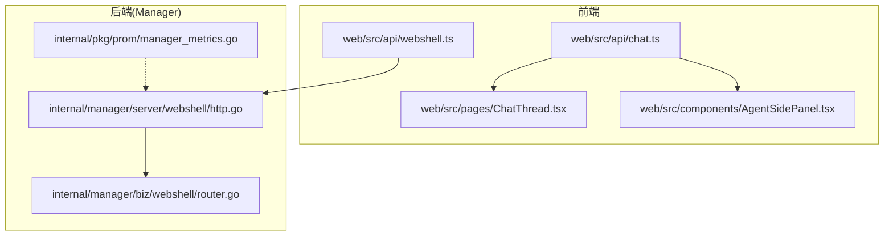
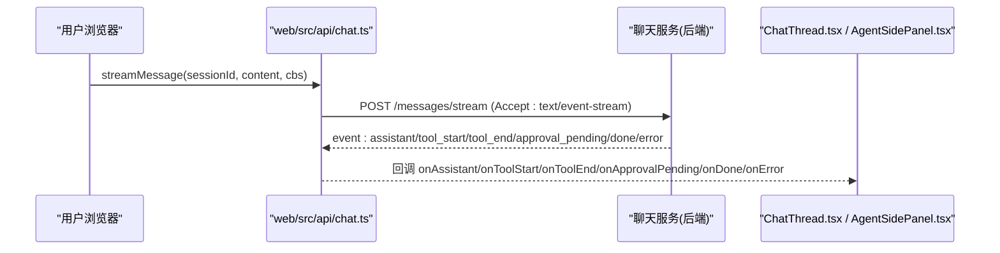
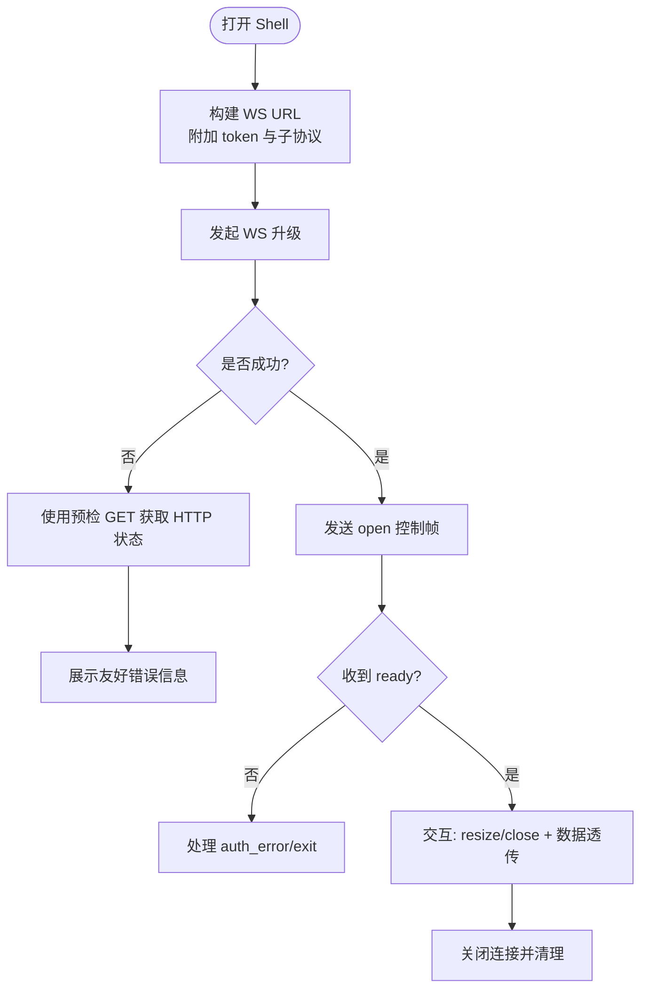
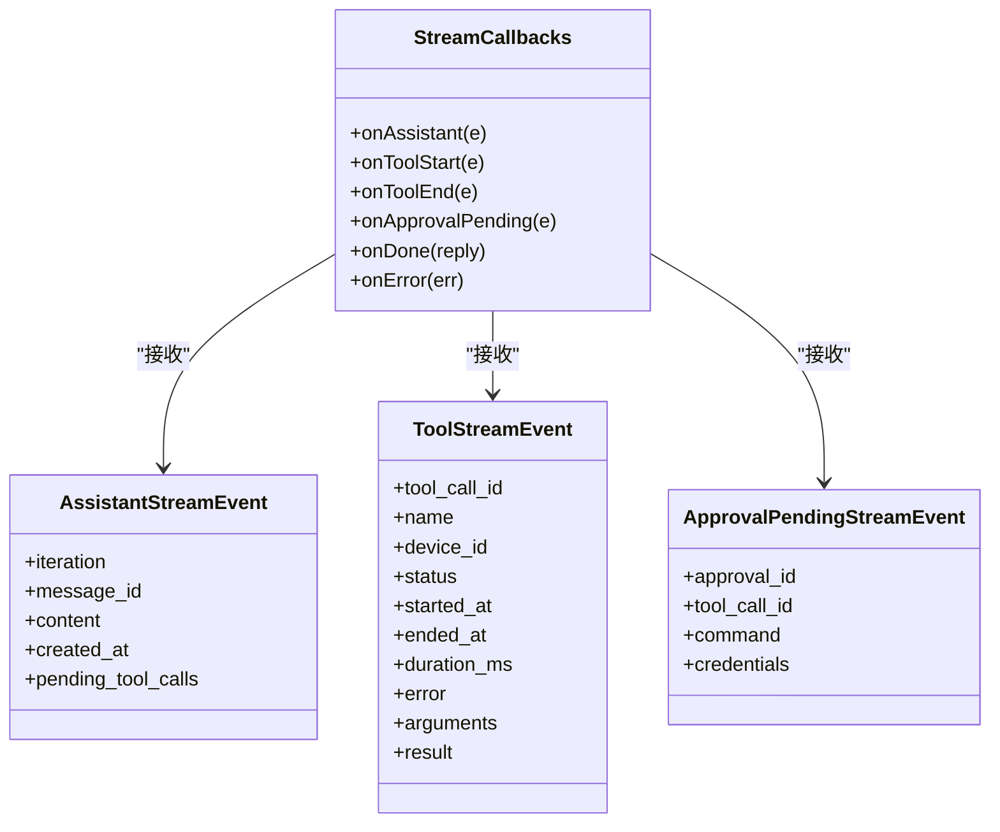
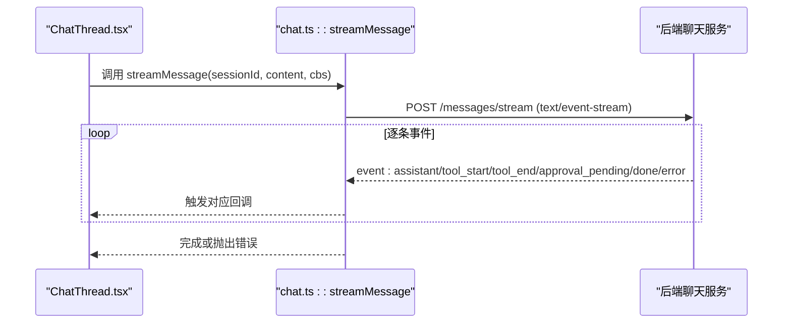
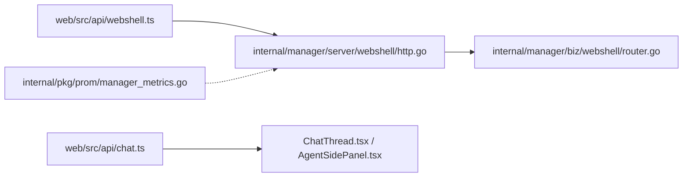

# 实时通信

<cite>
**本文引用的文件**   
- [web/src/api/webshell.ts](file://web/src/api/webshell.ts)
- [internal/manager/server/webshell/http.go](file://internal/manager/server/webshell/http.go)
- [internal/manager/biz/webshell/router.go](file://internal/manager/biz/webshell/router.go)
- [web/src/api/chat.ts](file://web/src/api/chat.ts)
- [web/src/pages/ChatThread.tsx](file://web/src/pages/ChatThread.tsx)
- [web/src/components/AgentSidePanel.tsx](file://web/src/components/AgentSidePanel.tsx)
- [internal/pkg/prom/manager_metrics.go](file://internal/pkg/prom/manager_metrics.go)
</cite>

## 目录
1. [简介](#简介)
2. [项目结构](#项目结构)
3. [核心组件](#核心组件)
4. [架构总览](#架构总览)
5. [详细组件分析](#详细组件分析)
6. [依赖分析](#依赖分析)
7. [性能考虑](#性能考虑)
8. [故障排查指南](#故障排查指南)
9. [结论](#结论)
10. [附录](#附录)

## 简介
本文件聚焦于系统中的“实时通信”能力，覆盖以下主题：
- WebSocket 连接管理：建立、心跳检测、断线重连与错误恢复（以 WebShell 为例）
- 事件驱动的消息推送：SSE 流式消息的事件类型、消息格式与订阅发布模式（以 AI 助手对话为例）
- SSE 的使用场景与实现方法
- 实时数据的本地缓存策略与状态同步机制
- 调试工具与测试方法
- 典型集成示例：实时日志查看、设备状态监控、协作编辑等

## 项目结构
与实时通信直接相关的代码主要分布在前端 API 层与后端管理器中：
- 前端
  - web/src/api/webshell.ts：WebSocket 工厂、控制帧类型定义、会话审计接口封装
  - web/src/api/chat.ts：SSE 客户端实现、事件类型与回调契约
  - web/src/pages/ChatThread.tsx、web/src/components/AgentSidePanel.tsx：SSE 消费端 UI 集成
- 后端
  - internal/manager/server/webshell/http.go：WebShell HTTP/WebSocket 处理器
  - internal/manager/biz/webshell/router.go：会话路由与 Sink 转发
  - internal/pkg/prom/manager_metrics.go：HTTP 请求指标暴露（可用于观测实时通道质量）



**图表来源** 
- [web/src/api/webshell.ts:1-190](file://web/src/api/webshell.ts#L1-L190)
- [internal/manager/server/webshell/http.go](file://internal/manager/server/webshell/http.go)
- [internal/manager/biz/webshell/router.go](file://internal/manager/biz/webshell/router.go)
- [web/src/api/chat.ts:1-359](file://web/src/api/chat.ts#L1-L359)
- [web/src/pages/ChatThread.tsx:241-439](file://web/src/pages/ChatThread.tsx#L241-L439)
- [web/src/components/AgentSidePanel.tsx:46-94](file://web/src/components/AgentSidePanel.tsx#L46-L94)
- [internal/pkg/prom/manager_metrics.go:203-236](file://internal/pkg/prom/manager_metrics.go#L203-L236)

**章节来源**
- [web/src/api/webshell.ts:1-190](file://web/src/api/webshell.ts#L1-L190)
- [web/src/api/chat.ts:1-359](file://web/src/api/chat.ts#L1-L359)
- [web/src/pages/ChatThread.tsx:241-439](file://web/src/pages/ChatThread.tsx#L241-L439)
- [web/src/components/AgentSidePanel.tsx:46-94](file://web/src/components/AgentSidePanel.tsx#L46-L94)
- [internal/manager/server/webshell/http.go](file://internal/manager/server/webshell/http.go)
- [internal/manager/biz/webshell/router.go](file://internal/manager/biz/webshell/router.go)
- [internal/pkg/prom/manager_metrics.go:203-236](file://internal/pkg/prom/manager_metrics.go#L203-L236)

## 核心组件
- WebSocket 通道（WebShell）
  - 用于浏览器到设备的交互式终端会话，采用文本帧控制 + 二进制数据透传。
  - 提供预检接口，便于在升级前获取 HTTP 状态码，提升用户体验。
- SSE 通道（AI 助手对话）
  - 基于 HTTP 长连接的 Server-Sent Events，服务端持续推送 assistant/tool/approval/done/error 等事件。
  - 前端通过 ReadableStream 分片解析，按事件类型分发到回调。
- 指标与可观测性
  - 通过 Prometheus 指标暴露 HTTP 请求量与延迟，辅助定位实时通道瓶颈。

**章节来源**
- [web/src/api/webshell.ts:1-190](file://web/src/api/webshell.ts#L1-L190)
- [web/src/api/chat.ts:1-359](file://web/src/api/chat.ts#L1-L359)
- [internal/pkg/prom/manager_metrics.go:203-236](file://internal/pkg/prom/manager_metrics.go#L203-L236)

## 架构总览
下图展示了两种实时通道的端到端流程：WebSocket 用于双向交互（WebShell），SSE 用于单向流式推送（AI 助手）。

```mermaid
sequenceDiagram
participant U as "用户浏览器"
participant WAPI as "web/src/api/webshell.ts"
participant WH as "internal/manager/server/webshell/http.go"
participant WR as "internal/manager/biz/webshell/router.go"
participant E as "边缘设备/SSH"
U->>WAPI : 调用 openShellSocket()
WAPI-->>U : 返回 WebSocket 实例
U->>WH : 发起 WS 升级(携带 token)
WH->>WR : 注册会话并创建 Sink
WR-->>U : 回推 ready/auth_error/exit 等控制帧
U->>WR : 发送 open/resize/close 控制帧
WR<->E : 透传终端 I/O 字节流
```

**图表来源** 
- [web/src/api/webshell.ts:36-99](file://web/src/api/webshell.ts#L36-L99)
- [internal/manager/server/webshell/http.go](file://internal/manager/server/webshell/http.go)
- [internal/manager/biz/webshell/router.go](file://internal/manager/biz/webshell/router.go)



**图表来源** 
- [web/src/api/chat.ts:245-316](file://web/src/api/chat.ts#L245-L316)
- [web/src/pages/ChatThread.tsx:241-439](file://web/src/pages/ChatThread.tsx#L241-L439)
- [web/src/components/AgentSidePanel.tsx:46-94](file://web/src/components/AgentSidePanel.tsx#L46-L94)

## 详细组件分析

### WebSocket 连接管理（WebShell）
- 连接建立
  - 前端构造 URL，自动选择 ws/wss；将 JWT 作为查询参数传递；协商子协议名称以便服务端稳定记录。
  - 首次文本帧为 open，包含终端行列、用户名密码等；随后 resize/close 控制帧由 UI 生命周期驱动。
- 心跳检测
  - 当前实现未内置显式心跳；可通过浏览器侧 ping/pong 或应用层定时探测增强健壮性。
- 断线重连
  - 建议在前端维护指数退避重连策略，结合预检接口快速判断 429/503/403 等错误。
- 错误恢复
  - 收到 auth_error/exit 后应清理资源并提示用户；对网络异常进行重试与降级展示。



**图表来源** 
- [web/src/api/webshell.ts:36-99](file://web/src/api/webshell.ts#L36-L99)
- [web/src/api/webshell.ts:157-184](file://web/src/api/webshell.ts#L157-L184)

**章节来源**
- [web/src/api/webshell.ts:1-190](file://web/src/api/webshell.ts#L1-L190)
- [internal/manager/server/webshell/http.go](file://internal/manager/server/webshell/http.go)
- [internal/manager/biz/webshell/router.go](file://internal/manager/biz/webshell/router.go)

### SSE 事件驱动消息推送（AI 助手）
- 事件类型
  - assistant：增量文本内容
  - tool_start / tool_end：工具调用开始/结束
  - approval_pending：需要人工审批的阻塞型工具
  - done：整轮完成，附带最终回复与用量
  - error：传输或解析错误
- 消息格式规范
  - 标准 SSE 帧，event/data 字段；data 为 JSON 对象，具体结构见前端类型定义。
- 订阅发布模式
  - 前端通过 streamMessage 建立订阅，按事件类型分发到回调；页面组件监听回调更新 UI。



**图表来源** 
- [web/src/api/chat.ts:200-243](file://web/src/api/chat.ts#L200-L243)



**图表来源** 
- [web/src/api/chat.ts:245-316](file://web/src/api/chat.ts#L245-L316)
- [web/src/pages/ChatThread.tsx:241-439](file://web/src/pages/ChatThread.tsx#L241-L439)

**章节来源**
- [web/src/api/chat.ts:1-359](file://web/src/api/chat.ts#L1-L359)
- [web/src/pages/ChatThread.tsx:241-439](file://web/src/pages/ChatThread.tsx#L241-L439)
- [web/src/components/AgentSidePanel.tsx:46-94](file://web/src/components/AgentSidePanel.tsx#L46-L94)

### SSE 的使用场景与实现要点
- 适用场景
  - 长耗时任务进度反馈（如 AI 助手多步推理、工具执行）
  - 实时日志/告警流式展示
  - 协作编辑中的增量变更推送
- 实现要点
  - 服务端需设置正确的 Content-Type 与 Transfer-Encoding: chunked
  - 客户端使用 ReadableStream 分块读取，按空行分割帧，解析 event/data
  - 支持 AbortSignal 取消，避免资源泄漏

**章节来源**
- [web/src/api/chat.ts:245-316](file://web/src/api/chat.ts#L245-L316)

### 实时数据的本地缓存策略与状态同步
- 本地缓存
  - 会话历史、消息列表、工具卡片等可在内存中缓存，减少重复请求
  - 对于长列表，可采用虚拟滚动与分页加载
- 状态同步
  - 以服务端权威为准，SSE 增量更新时按 message_id 去重合并
  - 对离线场景，提供“重新拉取”入口，确保一致性

[本节为通用实践说明，不直接分析具体文件]

### 调试工具与测试方法
- 前端调试
  - 浏览器开发者工具 Network 面板查看 SSE/WS 握手与帧
  - 针对 WebShell，使用预检接口快速获取 HTTP 状态码
- 后端观测
  - 通过 Prometheus 指标观察 HTTP 请求总量与延迟分布，识别热点路径
- 单元测试
  - 针对 SSE 解析与事件分发编写用例，覆盖未知事件与异常帧

**章节来源**
- [web/src/api/webshell.ts:157-184](file://web/src/api/webshell.ts#L157-L184)
- [internal/pkg/prom/manager_metrics.go:203-236](file://internal/pkg/prom/manager_metrics.go#L203-L236)

### 完整集成示例
- 实时日志查看
  - 使用 SSE 流式拉取日志片段，前端按时间戳追加渲染，支持过滤与高亮
- 设备状态监控
  - 通过 SSE 推送设备健康指标变化，结合本地缓存与阈值告警
- 协作编辑
  - 基于 SSE 推送操作序列，客户端以操作合并策略保证最终一致性

[本节为概念性示例，不直接分析具体文件]

## 依赖分析
- 组件耦合
  - 前端 API 层仅依赖浏览器原生 WebSocket/Fetch API，低耦合
  - 后端 WebShell 通过 router 将会话映射到 Sink，解耦了 HTTP 与业务逻辑
- 外部依赖
  - Prometheus 指标采集用于观测 HTTP 实时通道质量



**图表来源** 
- [web/src/api/webshell.ts:1-190](file://web/src/api/webshell.ts#L1-L190)
- [internal/manager/server/webshell/http.go](file://internal/manager/server/webshell/http.go)
- [internal/manager/biz/webshell/router.go](file://internal/manager/biz/webshell/router.go)
- [web/src/api/chat.ts:1-359](file://web/src/api/chat.ts#L1-L359)
- [web/src/pages/ChatThread.tsx:241-439](file://web/src/pages/ChatThread.tsx#L241-L439)
- [web/src/components/AgentSidePanel.tsx:46-94](file://web/src/components/AgentSidePanel.tsx#L46-L94)
- [internal/pkg/prom/manager_metrics.go:203-236](file://internal/pkg/prom/manager_metrics.go#L203-L236)

**章节来源**
- [web/src/api/webshell.ts:1-190](file://web/src/api/webshell.ts#L1-L190)
- [web/src/api/chat.ts:1-359](file://web/src/api/chat.ts#L1-L359)
- [internal/manager/server/webshell/http.go](file://internal/manager/server/webshell/http.go)
- [internal/manager/biz/webshell/router.go](file://internal/manager/biz/webshell/router.go)
- [internal/pkg/prom/manager_metrics.go:203-236](file://internal/pkg/prom/manager_metrics.go#L203-L236)

## 性能考虑
- 合理设置 SSE 帧大小与频率，避免过大帧导致前端解码压力
- WebSocket 二进制数据尽量批量传输，减少帧数量
- 利用 Prometheus 指标监控请求延迟与错误率，定位热点路径
- 前端对长列表采用分页与虚拟滚动，降低渲染开销

[本节为通用指导，不直接分析具体文件]

## 故障排查指南
- WebShell 无法升级
  - 使用预检接口检查 HTTP 状态码，区分鉴权失败、限流与服务不可用
- SSE 中断
  - 检查网络连通性与代理配置；确认服务端正确发送 event/data 并以空行分隔
- 指标异常
  - 查看 HTTP 请求总量与延迟直方图，定位慢接口与错误峰值

**章节来源**
- [web/src/api/webshell.ts:157-184](file://web/src/api/webshell.ts#L157-L184)
- [web/src/api/chat.ts:245-316](file://web/src/api/chat.ts#L245-L316)
- [internal/pkg/prom/manager_metrics.go:203-236](file://internal/pkg/prom/manager_metrics.go#L203-L236)

## 结论
本项目实现了两类实时通信能力：基于 WebSocket 的双向交互（WebShell）与基于 SSE 的单向流式推送（AI 助手）。前端通过类型化 API 与事件回调简化了集成复杂度，后端通过清晰的会话路由与 Sink 转发提升了可扩展性。配合 Prometheus 指标与预检接口，可有效保障实时通道的稳定性与可观测性。

[本节为总结性内容，不直接分析具体文件]

## 附录
- 术语
  - SSE：Server-Sent Events，服务器向客户端单向推送文本事件
  - WS：WebSocket，全双工通信协议
  - Sink：会话级输出通道，负责将数据写入下游连接

[本节为补充说明，不直接分析具体文件]