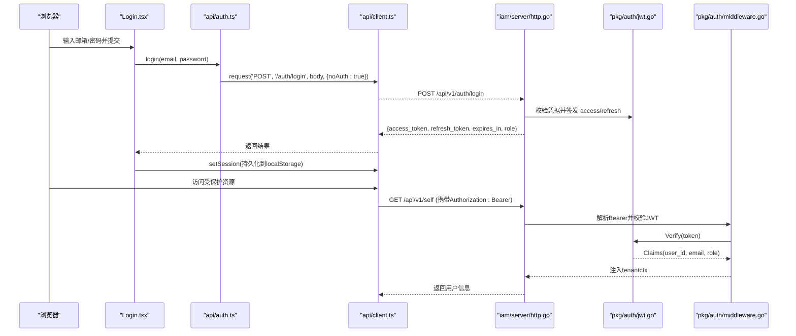
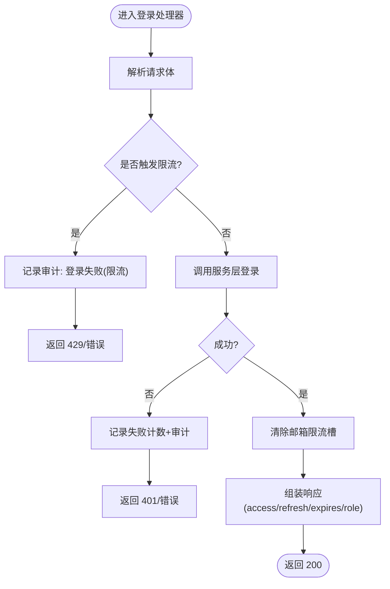
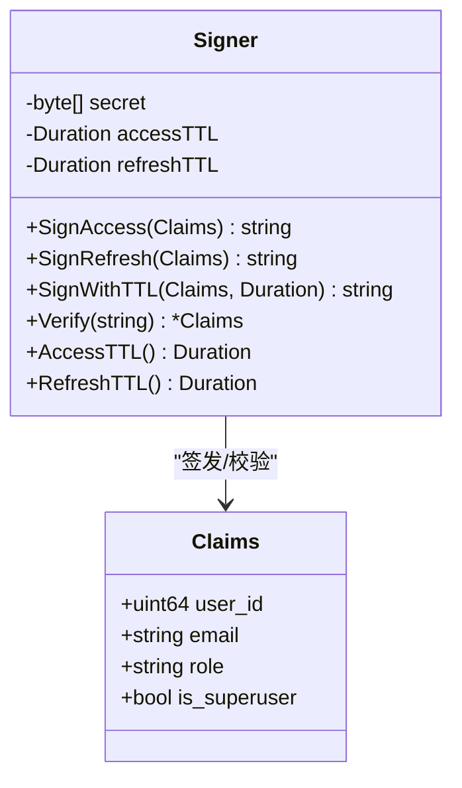
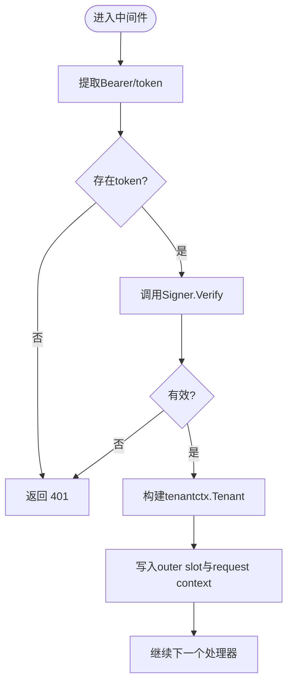
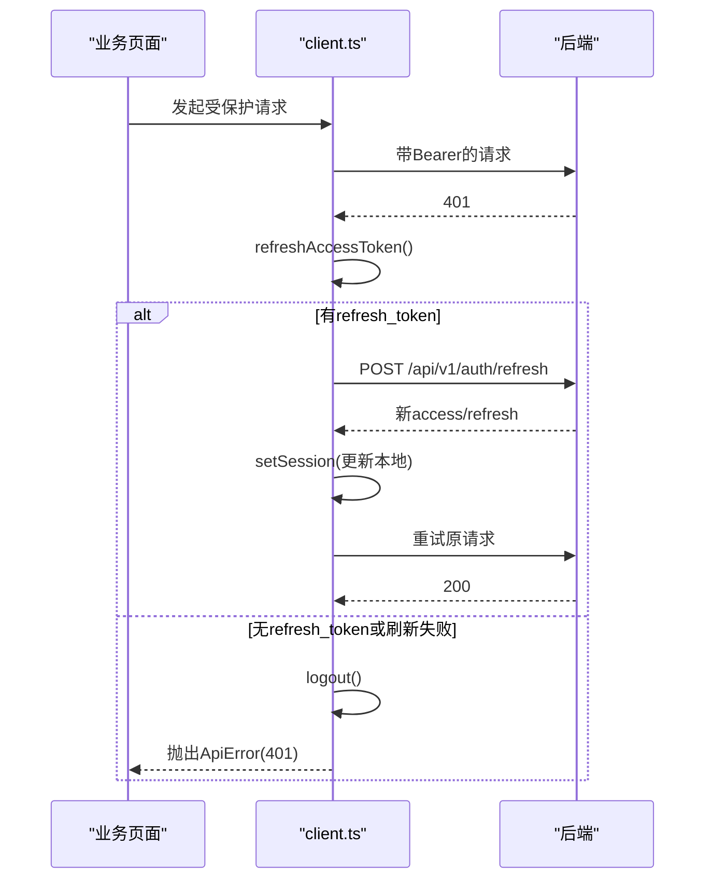
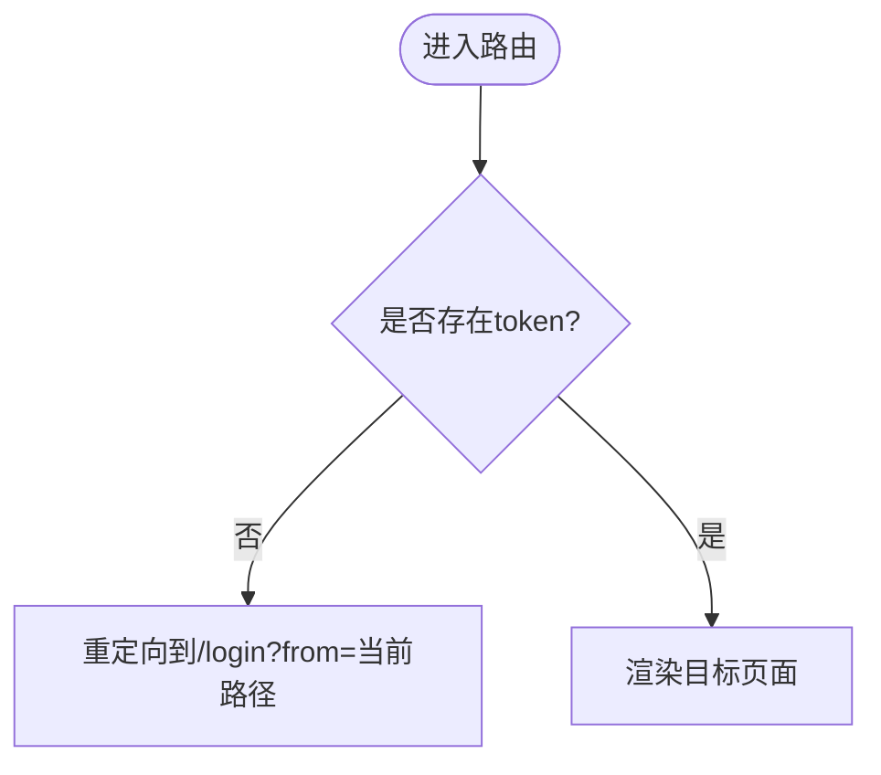
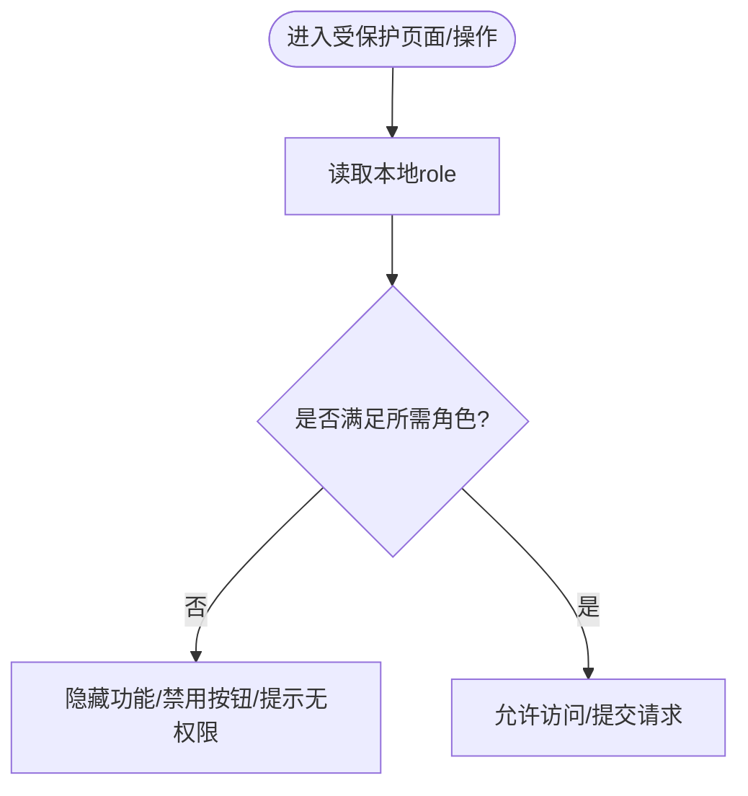
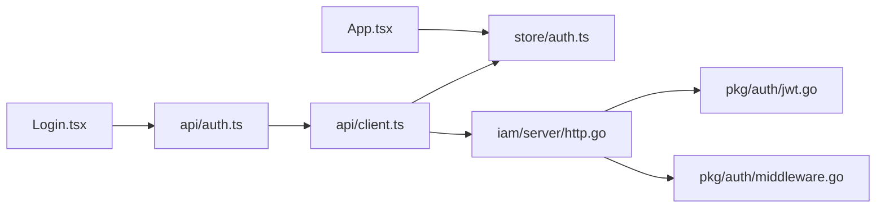

# 认证授权API

<cite>
**本文引用的文件**
- [internal/iam/server/http.go](file://internal/iam/server/http.go)
- [internal/pkg/auth/jwt.go](file://internal/pkg/auth/jwt.go)
- [internal/pkg/auth/middleware.go](file://internal/pkg/auth/middleware.go)
- [web/src/api/client.ts](file://web/src/api/client.ts)
- [web/src/api/auth.ts](file://web/src/api/auth.ts)
- [web/src/store/auth.ts](file://web/src/store/auth.ts)
- [web/src/pages/Login.tsx](file://web/src/pages/Login.tsx)
- [web/src/App.tsx](file://web/src/App.tsx)
- [tests/e2e/auth_login_test.go](file://tests/e2e/auth_login_test.go)
- [tests/e2e/auth_refresh_test.go](file://tests/e2e/auth_refresh_test.go)
- [tests/e2e/auth_rbac_test.go](file://tests/e2e/auth_rbac_test.go)
</cite>

## 目录
1. [简介](#简介)
2. [项目结构](#项目结构)
3. [核心组件](#核心组件)
4. [架构总览](#架构总览)
5. [详细组件分析](#详细组件分析)
6. [依赖关系分析](#依赖关系分析)
7. [性能与安全性考虑](#性能与安全性考虑)
8. [故障排查指南](#故障排查指南)
9. [结论](#结论)
10. [附录：扩展接口规范](#附录扩展接口规范)

## 简介
本文件面向开发者，系统化阐述 Ongrid 的认证与授权机制，覆盖以下主题：
- 用户登录、登出、令牌刷新等认证相关接口的使用方法
- JWT access_token 与 refresh_token 的获取、存储与管理生命周期
- RBAC 权限控制在前端的实现方式（角色检查与权限验证）
- 会话状态管理与自动重定向逻辑
- 完整的认证流程示例（登录表单集成、权限守卫、错误处理）
- 自定义认证扩展的接口规范与最佳实践

## 项目结构
认证授权涉及后端 IAM 服务、通用鉴权中间件与前端请求拦截器、路由守卫及本地会话存储。关键位置如下：
- 后端认证入口与处理器：IAM HTTP 层
- JWT 签发与校验：通用 auth 包
- 前端 API 客户端：统一请求封装与自动刷新
- 前端会话存储：持久化 token 与角色信息
- 前端路由守卫：未登录跳转登录页
- E2E 测试：覆盖登录、刷新、RBAC 行为

```mermaid
graph TB
subgraph "前端"
A["Login.tsx<br/>登录表单"]
B["client.ts<br/>请求拦截器"]
C["auth.ts<br/>认证API封装"]
D["store/auth.ts<br/>本地会话存储"]
E["App.tsx<br/>路由守卫"]
end
subgraph "后端"
F["iam/server/http.go<br/>登录/刷新/自我信息"]
G["pkg/auth/jwt.go<br/>JWT签发/校验"]
H["pkg/auth/middleware.go<br/>Bearer解析/上下文注入"]
end
A --> C
C --> B
B --> F
D < --> B
E --> D
F --> G
F --> H
```

图表来源
- [web/src/pages/Login.tsx:1-134](file://web/src/pages/Login.tsx#L1-L134)
- [web/src/api/client.ts:1-163](file://web/src/api/client.ts#L1-L163)
- [web/src/api/auth.ts:1-30](file://web/src/api/auth.ts#L1-L30)
- [web/src/store/auth.ts:1-50](file://web/src/store/auth.ts#L1-L50)
- [web/src/App.tsx:69-82](file://web/src/App.tsx#L69-L82)
- [internal/iam/server/http.go:151-183](file://internal/iam/server/http.go#L151-L183)
- [internal/pkg/auth/jwt.go:1-100](file://internal/pkg/auth/jwt.go#L1-L100)
- [internal/pkg/auth/middleware.go:1-68](file://internal/pkg/auth/middleware.go#L1-L68)

章节来源
- [web/src/pages/Login.tsx:1-134](file://web/src/pages/Login.tsx#L1-L134)
- [web/src/api/client.ts:1-163](file://web/src/api/client.ts#L1-L163)
- [web/src/api/auth.ts:1-30](file://web/src/api/auth.ts#L1-L30)
- [web/src/store/auth.ts:1-50](file://web/src/store/auth.ts#L1-L50)
- [web/src/App.tsx:69-82](file://web/src/App.tsx#L69-L82)
- [internal/iam/server/http.go:151-183](file://internal/iam/server/http.go#L151-L183)
- [internal/pkg/auth/jwt.go:1-100](file://internal/pkg/auth/jwt.go#L1-L100)
- [internal/pkg/auth/middleware.go:1-68](file://internal/pkg/auth/middleware.go#L1-L68)

## 核心组件
- 认证处理器（登录/刷新/自我信息）
  - 提供 /v1/auth/login、/v1/auth/refresh、/v1/self 等端点
  - 登录成功后返回 access_token、refresh_token、expires_in、role
- JWT 签发与校验
  - HS256 签名；access 短 TTL，refresh 长 TTL
  - Claims 包含 user_id、email、role、is_superuser 等
- 认证中间件
  - 从 Authorization: Bearer 或 ?token= 提取 JWT
  - 校验后写入 tenantctx，供后续鉴权使用
- 前端请求拦截器
  - 自动附加 Bearer token
  - 401 时触发 refresh，成功后重试原请求
  - refresh 失败则清理本地会话并抛出错误
- 前端会话存储
  - 使用 localStorage 持久化 access_token、refresh_token、role、email
- 路由守卫
  - RequireAuth：无 token 时跳转到 /login
  - PublicOnly：已登录访问 /login 时重定向到首页

章节来源
- [internal/iam/server/http.go:221-288](file://internal/iam/server/http.go#L221-L288)
- [internal/pkg/auth/jwt.go:32-100](file://internal/pkg/auth/jwt.go#L32-L100)
- [internal/pkg/auth/middleware.go:10-53](file://internal/pkg/auth/middleware.go#L10-L53)
- [web/src/api/client.ts:27-115](file://web/src/api/client.ts#L27-L115)
- [web/src/store/auth.ts:20-41](file://web/src/store/auth.ts#L20-L41)
- [web/src/App.tsx:69-82](file://web/src/App.tsx#L69-L82)

## 架构总览
下图展示了从浏览器发起登录到服务端签发 JWT，再到受保护资源访问的完整链路。



图表来源
- [web/src/pages/Login.tsx:19-43](file://web/src/pages/Login.tsx#L19-L43)
- [web/src/api/auth.ts:19-29](file://web/src/api/auth.ts#L19-L29)
- [web/src/api/client.ts:27-115](file://web/src/api/client.ts#L27-L115)
- [internal/iam/server/http.go:221-269](file://internal/iam/server/http.go#L221-L269)
- [internal/pkg/auth/jwt.go:81-99](file://internal/pkg/auth/jwt.go#L81-L99)
- [internal/pkg/auth/middleware.go:21-53](file://internal/pkg/auth/middleware.go#L21-L53)

## 详细组件分析

### 认证处理器（登录/刷新/自我信息）
- 登录
  - 输入：email、password
  - 输出：access_token、refresh_token、expires_in、role
  - 防暴力破解：基于 IP 与邮箱的滑动窗口限流
  - 审计：失败登录记录审计事件
- 刷新
  - 输入：refresh_token
  - 输出：新的 access_token、refresh_token、expires_in、role
- 自我信息
  - 需有效 JWT；返回当前用户的 id、email、role



图表来源
- [internal/iam/server/http.go:221-269](file://internal/iam/server/http.go#L221-L269)

章节来源
- [internal/iam/server/http.go:221-288](file://internal/iam/server/http.go#L221-L288)

### JWT 签发与校验
- 签发
  - SignAccess：短 TTL 的 access_token
  - SignRefresh：长 TTL 的 refresh_token
  - 支持自定义 TTL 的内部票据
- 校验
  - Verify：仅做签名与声明校验，不查库
  - 非法签名、过期、格式错误均返回错误
- Claims
  - 包含 user_id、email、role、is_superuser 以及标准 exp/iat/sub 等



图表来源
- [internal/pkg/auth/jwt.go:24-100](file://internal/pkg/auth/jwt.go#L24-L100)

章节来源
- [internal/pkg/auth/jwt.go:1-100](file://internal/pkg/auth/jwt.go#L1-L100)

### 认证中间件（Bearer 解析与上下文注入）
- 读取 Authorization: Bearer 或 ?token=（WebSocket 兼容）
- 校验 JWT，失败直接 401
- 将 tenantctx.Tenant 写入请求上下文，供后续鉴权使用
- 兼容旧 token：Role=="admin" 作为超级用户回退



图表来源
- [internal/pkg/auth/middleware.go:21-53](file://internal/pkg/auth/middleware.go#L21-L53)

章节来源
- [internal/pkg/auth/middleware.go:1-68](file://internal/pkg/auth/middleware.go#L1-L68)

### 前端请求拦截器与自动刷新
- 默认在请求头附加 Authorization: Bearer
- 当收到 401 且非 noAuth 请求：
  - 串行化 refresh 请求，避免并发重复刷新
  - 刷新成功后更新本地会话并重试原请求
  - 刷新失败则清理本地会话并抛出错误
- 支持 WebSocket 场景通过 ?token= 传递



图表来源
- [web/src/api/client.ts:97-162](file://web/src/api/client.ts#L97-L162)

章节来源
- [web/src/api/client.ts:1-163](file://web/src/api/client.ts#L1-L163)

### 前端会话存储与路由守卫
- 会话存储
  - 使用 zustand + persist 将 token、refresh_token、role、email 持久化到 localStorage
  - 提供 setSession、logout、getToken、getRefreshToken 等方法
- 路由守卫
  - RequireAuth：无 token 时跳转到 /login，并保留来源路径
  - PublicOnly：已登录访问 /login 时重定向到首页



图表来源
- [web/src/App.tsx:69-82](file://web/src/App.tsx#L69-L82)
- [web/src/store/auth.ts:20-41](file://web/src/store/auth.ts#L20-L41)

章节来源
- [web/src/store/auth.ts:1-50](file://web/src/store/auth.ts#L1-L50)
- [web/src/App.tsx:69-82](file://web/src/App.tsx#L69-L82)

### RBAC 权限控制（前端视角）
- 前端根据 role 进行可见性与操作按钮控制（例如 admin/user/viewer）
- 后端对敏感操作进行角色校验（如 requireAdmin），非管理员返回 403
- E2E 用例覆盖了三种角色的典型行为差异



章节来源
- [tests/e2e/auth_rbac_test.go:22-111](file://tests/e2e/auth_rbac_test.go#L22-L111)
- [internal/iam/server/http.go:397-408](file://internal/iam/server/http.go#L397-L408)

## 依赖关系分析
- 前端依赖
  - Login.tsx 调用 api/auth.ts
  - api/auth.ts 基于 api/client.ts 的 request 封装
  - client.ts 依赖 store/auth.ts 的 getToken/getRefreshToken/setSession
  - App.tsx 的路由守卫依赖 store/auth.ts 的 token 状态
- 后端依赖
  - iam/server/http.go 调用 pkg/auth/jwt.go 进行签发/校验
  - 受保护路由经 pkg/auth/middleware.go 注入 tenantctx



图表来源
- [web/src/pages/Login.tsx:1-134](file://web/src/pages/Login.tsx#L1-L134)
- [web/src/api/auth.ts:1-30](file://web/src/api/auth.ts#L1-L30)
- [web/src/api/client.ts:1-163](file://web/src/api/client.ts#L1-L163)
- [web/src/store/auth.ts:1-50](file://web/src/store/auth.ts#L1-L50)
- [web/src/App.tsx:69-82](file://web/src/App.tsx#L69-L82)
- [internal/iam/server/http.go:151-183](file://internal/iam/server/http.go#L151-L183)
- [internal/pkg/auth/jwt.go:1-100](file://internal/pkg/auth/jwt.go#L1-L100)
- [internal/pkg/auth/middleware.go:1-68](file://internal/pkg/auth/middleware.go#L1-L68)

章节来源
- [web/src/pages/Login.tsx:1-134](file://web/src/pages/Login.tsx#L1-L134)
- [web/src/api/auth.ts:1-30](file://web/src/api/auth.ts#L1-L30)
- [web/src/api/client.ts:1-163](file://web/src/api/client.ts#L1-L163)
- [web/src/store/auth.ts:1-50](file://web/src/store/auth.ts#L1-L50)
- [web/src/App.tsx:69-82](file://web/src/App.tsx#L69-L82)
- [internal/iam/server/http.go:151-183](file://internal/iam/server/http.go#L151-L183)
- [internal/pkg/auth/jwt.go:1-100](file://internal/pkg/auth/jwt.go#L1-L100)
- [internal/pkg/auth/middleware.go:1-68](file://internal/pkg/auth/middleware.go#L1-L68)

## 性能与安全性考虑
- 登录限流
  - 基于 IP 与邮箱的双维度限流，防止暴力破解与密码喷洒
- Token 策略
  - access_token 短 TTL，refresh_token 长 TTL，降低泄露风险
  - 前端仅在需要时刷新，避免频繁网络开销
- 安全传输
  - 生产环境建议 HTTPS，确保 Bearer token 不被窃听
- 兼容性
  - 中间件兼容旧 token 的 Role=="admin" 回退，平滑升级

[本节为通用指导，无需代码引用]

## 故障排查指南
- 401 未认证
  - 检查 Authorization 头是否正确携带 Bearer token
  - 确认 token 未过期；若过期，前端应自动刷新
  - 若 refresh 失败，会清理本地会话并强制登出
- 403 无权限
  - 检查当前用户 role 是否具备所需权限
  - 查看后端 requireAdmin 等角色校验逻辑
- 刷新失败
  - 确认 refresh_token 存在且有效
  - 检查 /api/v1/auth/refresh 接口是否正常
- 登录失败
  - 检查邮箱/密码是否正确
  - 关注限流告警（短时间内多次失败会被限流）

章节来源
- [web/src/api/client.ts:97-115](file://web/src/api/client.ts#L97-L115)
- [internal/iam/server/http.go:221-269](file://internal/iam/server/http.go#L221-L269)
- [internal/iam/server/http.go:397-408](file://internal/iam/server/http.go#L397-L408)

## 结论
Ongrid 的认证授权体系以 JWT 为核心，结合前后端协作实现了安全的会话管理、自动刷新与清晰的权限边界。前端通过统一的请求拦截器与路由守卫简化了开发者的接入成本，后端通过中间件与角色校验保证了资源的访问安全。E2E 测试覆盖了登录、刷新与 RBAC 的关键路径，有助于保障系统稳定性。

[本节为总结性内容，无需代码引用]

## 附录：扩展接口规范
- 新增认证端点
  - 遵循现有 JSON 请求/响应约定
  - 如需引入第三方认证，可在 IAM 服务层增加对应 UseCase，并在 http.go 中注册路由
- 自定义 JWT Claims
  - 在 Claims 结构中扩展字段，并确保在签发与校验处保持一致
  - 注意向后兼容：旧 token 缺失新字段时应给出合理回退
- 前端扩展
  - 在 store/auth.ts 中扩展 Session 类型与持久化字段
  - 在 client.ts 中按需调整刷新策略与错误处理
  - 在路由守卫中按角色控制页面可见性

[本节为接口规范说明，无需代码引用]