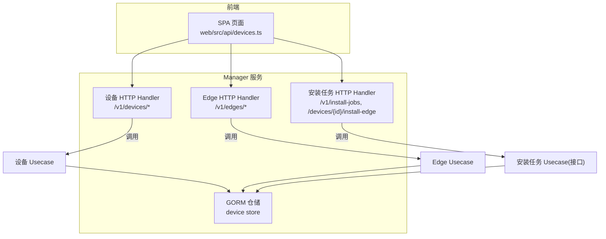
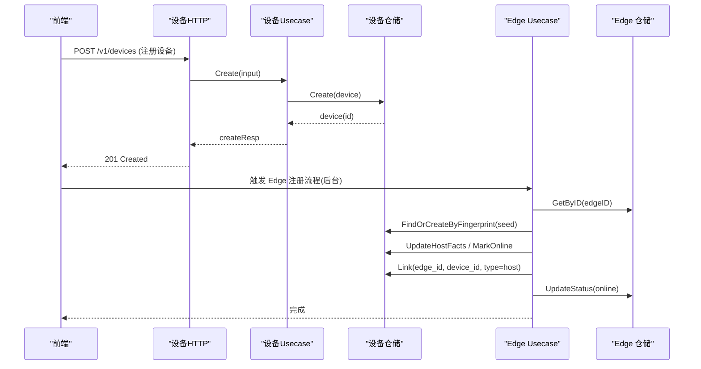
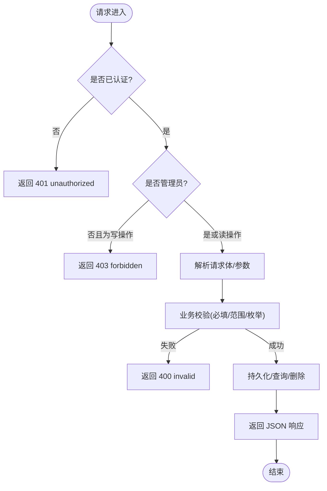
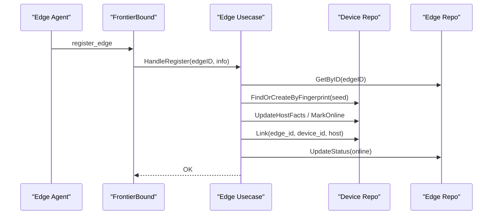
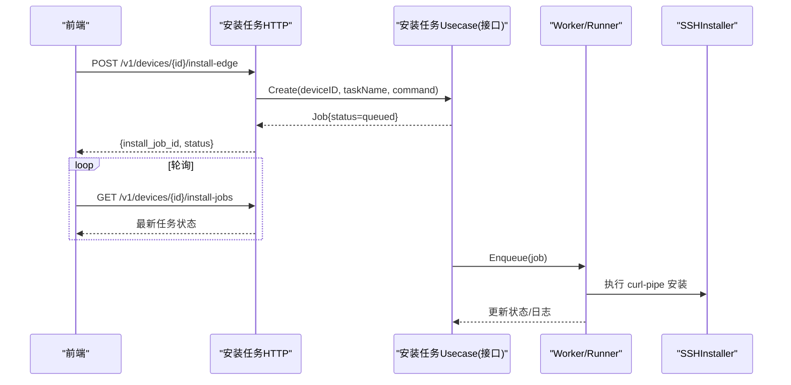
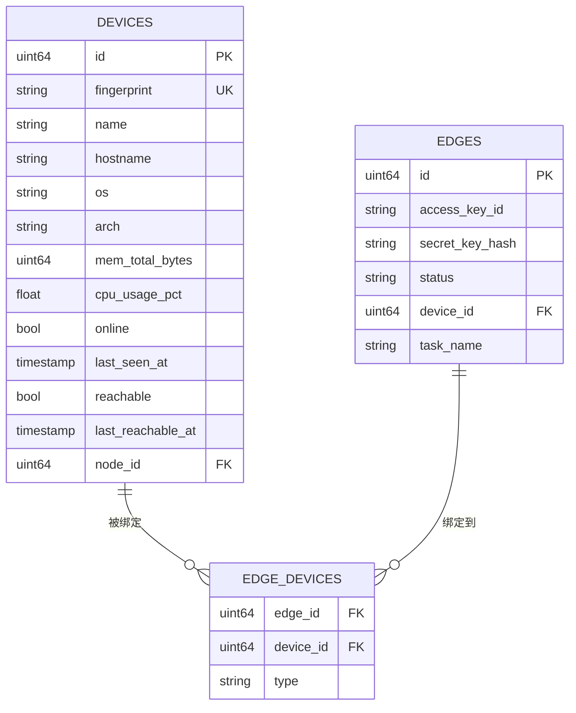
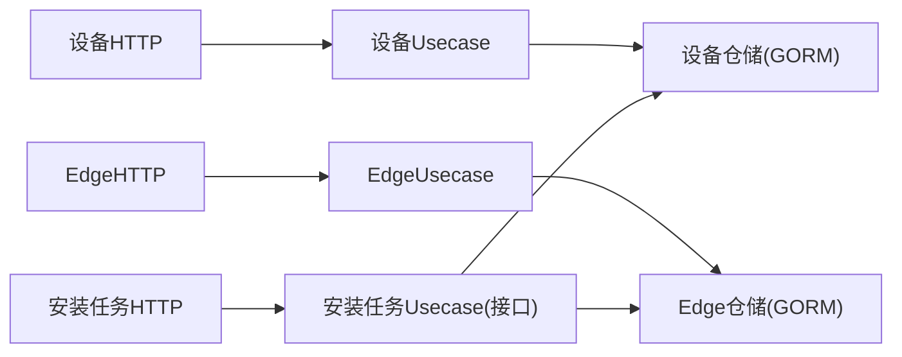

# 设备管理API

<cite>
**本文引用的文件**
- [internal/manager/server/device/http.go](file://internal/manager/server/device/http.go)
- [internal/manager/biz/device/usecase.go](file://internal/manager/biz/device/usecase.go)
- [internal/manager/data/device/store/device.go](file://internal/manager/data/device/store/device.go)
- [internal/manager/server/edge/http.go](file://internal/manager/server/edge/http.go)
- [internal/manager/biz/edge/usecase.go](file://internal/manager/biz/edge/usecase.go)
- [internal/manager/server/installjob/http.go](file://internal/manager/server/installjob/http.go)
- [cmd/ongrid/main.go](file://cmd/ongrid/main.go)
- [web/src/api/devices.ts](file://web/src/api/devices.ts)
</cite>

## 目录
1. [简介](#简介)
2. [项目结构](#项目结构)
3. [核心组件](#核心组件)
4. [架构总览](#架构总览)
5. [详细组件分析](#详细组件分析)
6. [依赖关系分析](#依赖关系分析)
7. [性能与扩展性](#性能与扩展性)
8. [故障排查指南](#故障排查指南)
9. [结论](#结论)
10. [附录：CRUD 示例与最佳实践](#附录crud-示例与最佳实践)

## 简介
本文件面向“设备管理”相关 API，覆盖以下能力：
- 设备的增删改查（注册、编辑、软删除/恢复、角色与 SSH 凭据管理）
- 边缘设备生命周期（创建 Edge、安装/升级、插件配置、进程查看）
- 设备拓扑关联（设备与拓扑节点映射、边端与设备绑定）
- 批量操作与异步任务（一键安装 Edge 的异步 Job 机制）
- 监控数据与可达性（在线状态、Ping 可达性、最近一次连接时间）
- 告警通知（通过插件与集成能力在 Edge 侧采集并上报）

## 项目结构
设备管理相关代码位于 manager 子域，采用“server → biz → data”分层：
- server：HTTP 路由与 DTO 映射
- biz：用例编排与领域规则
- data：GORM 仓储实现（MySQL/SQLite 通用）

图表来源
- [internal/manager/server/device/http.go:61-75](file://internal/manager/server/device/http.go#L61-L75)
- [internal/manager/server/edge/http.go:141-163](file://internal/manager/server/edge/http.go#L141-L163)
- [internal/manager/server/installjob/http.go:151-158](file://internal/manager/server/installjob/http.go#L151-L158)
- [internal/manager/data/device/store/device.go:21-27](file://internal/manager/data/device/store/device.go#L21-L27)

章节来源
- [internal/manager/server/device/http.go:61-75](file://internal/manager/server/device/http.go#L61-L75)
- [internal/manager/server/edge/http.go:141-163](file://internal/manager/server/edge/http.go#L141-L163)
- [internal/manager/server/installjob/http.go:151-158](file://internal/manager/server/installjob/http.go#L151-L158)
- [internal/manager/data/device/store/device.go:21-27](file://internal/manager/data/device/store/device.go#L21-L27)

## 核心组件
- 设备 HTTP 层：提供设备 CRUD、SSH 凭据管理、设备-边端关联查询等。
- 设备业务层：负责校验、编排、持久化与可达性更新。
- 设备仓储层：基于 GORM 的 MySQL/SQLite 实现，支持软删除、批量查询、可达性回填等。
- Edge HTTP 层：提供 Edge 生命周期、远程升级、插件配置、进程列表等。
- Edge 业务层：处理注册、心跳、离线、密钥轮换、默认插件初始化、设备指纹与拓扑镜像。
- 安装任务 HTTP 层：提供一键安装 Edge 的异步任务入口与进度查询。

章节来源
- [internal/manager/server/device/http.go:30-75](file://internal/manager/server/device/http.go#L30-L75)
- [internal/manager/biz/device/usecase.go:126-146](file://internal/manager/biz/device/usecase.go#L126-L146)
- [internal/manager/data/device/store/device.go:21-27](file://internal/manager/data/device/store/device.go#L21-L27)
- [internal/manager/server/edge/http.go:85-110](file://internal/manager/server/edge/http.go#L85-L110)
- [internal/manager/biz/edge/usecase.go:41-85](file://internal/manager/biz/edge/usecase.go#L41-L85)
- [internal/manager/server/installjob/http.go:126-158](file://internal/manager/server/installjob/http.go#L126-L158)

## 架构总览
设备与 Edge 的关系由“设备表 + 边端表 + 关联表”共同维护；Edge 首次注册时根据主机指纹 Upsert 设备行，并建立 M:N 关联。

图表来源
- [internal/manager/server/device/http.go:293-338](file://internal/manager/server/device/http.go#L293-L338)
- [internal/manager/biz/device/usecase.go:54-124](file://internal/manager/biz/device/usecase.go#L54-L124)
- [internal/manager/data/device/store/device.go:35-52](file://internal/manager/data/device/store/device.go#L35-L52)
- [internal/manager/biz/edge/usecase.go:347-480](file://internal/manager/biz/edge/usecase.go#L347-L480)

## 详细组件分析

### 设备管理 API（/v1/devices）
- 路由清单
  - POST /v1/devices：管理员注册新设备（含 SSH 凭据）
  - GET /v1/devices：列出设备（支持按名称/主机名/角色/在线状态分页）
  - GET /v1/devices/{id}：获取设备详情
  - PATCH /v1/devices/{id}：更新展示字段与 SSH 凭据（合并语义）
  - PATCH /v1/devices/{id}/roles：更新设备角色位集
  - DELETE /v1/devices/{id}?hard=true：软删除（默认）或硬删除
  - POST /v1/devices/{id}/restore：恢复软删除
  - GET /v1/devices/{id}/edges：查询该设备绑定的边端
  - PUT /v1/devices/{id}/ssh-credentials：设置 SSH 凭据
  - GET /v1/devices/{id}/ssh-info：读取 SSH 信息（明文回显密码/私钥）
  - DELETE /v1/devices/{id}/ssh-credentials：清空指定凭据字段

- 权限控制
  - 写类接口需管理员角色；读类接口需已认证用户。

- 关键行为
  - 软删除：deleted_at 标记，默认查询不返回；include_deleted=true 可包含已删除行。
  - SSH 凭据：明文回显用于内部运维场景；支持 password/key 两种模式。
  - 可达性：reachable/last_reachable_at 由定时 Ping 任务写入，与 edge.online 解耦。

图表来源
- [internal/manager/server/device/http.go:77-91](file://internal/manager/server/device/http.go#L77-L91)
- [internal/manager/server/device/http.go:215-284](file://internal/manager/server/device/http.go#L215-L284)
- [internal/manager/server/device/http.go:370-456](file://internal/manager/server/device/http.go#L370-L456)

章节来源
- [internal/manager/server/device/http.go:61-75](file://internal/manager/server/device/http.go#L61-L75)
- [internal/manager/server/device/http.go:215-284](file://internal/manager/server/device/http.go#L215-L284)
- [internal/manager/server/device/http.go:370-456](file://internal/manager/server/device/http.go#L370-L456)
- [internal/manager/biz/device/usecase.go:187-211](file://internal/manager/biz/device/usecase.go#L187-L211)
- [internal/manager/biz/device/usecase.go:228-292](file://internal/manager/biz/device/usecase.go#L228-L292)
- [internal/manager/data/device/store/device.go:320-356](file://internal/manager/data/device/store/device.go#L320-L356)

### 边缘设备管理 API（/v1/edges）
- 路由清单
  - POST /v1/edges：创建 Edge（可选立即绑定设备与任务名）
  - GET /v1/edges：列出 Edge（支持 name/hostname/ip/device_id 过滤）
  - GET /v1/edges/{id}：Edge 详情（附带 host_info 与 roles）
  - DELETE /v1/edges/{id}：删除 Edge（同时置设备 offline）
  - POST /v1/edges/{id}/rotate-secret：轮换 SecretKey
  - POST /v1/edges/{id}/upgrade：远程升级 Agent（URL+SHA256）
  - POST /v1/edges/{id}/upgrade-package：一键升级（自动解析包）
  - GET /v1/edges/{id}/processes：查看进程列表
  - GET /v1/edges/{id}/plugins：插件配置与运行健康
  - PUT /v1/edges/{id}/plugins/{name}：设置插件配置
  - GET /v1/integrations/plugin-counts：统计各插件启用数量

- 注册与上线
  - HandleRegister：根据主机指纹 Upsert 设备、更新 Host Facts、建立 edge_devices(host) 关联、同步 Edge.DeviceID、更新 online/last_seen_at、必要时回填 Edge.name 与 task_name。
  - HandleHeartbeat：刷新 Edge 与 Device 的 last_seen_at。
  - HandleOffline：关闭隧道后标记 Edge 与 Device 离线。

图表来源
- [internal/manager/biz/edge/usecase.go:347-480](file://internal/manager/biz/edge/usecase.go#L347-L480)
- [internal/manager/biz/edge/usecase.go:537-556](file://internal/manager/biz/edge/usecase.go#L537-L556)
- [internal/manager/biz/edge/usecase.go:564-578](file://internal/manager/biz/edge/usecase.go#L564-L578)

章节来源
- [internal/manager/server/edge/http.go:141-163](file://internal/manager/server/edge/http.go#L141-L163)
- [internal/manager/biz/edge/usecase.go:149-222](file://internal/manager/biz/edge/usecase.go#L149-L222)
- [internal/manager/biz/edge/usecase.go:347-480](file://internal/manager/biz/edge/usecase.go#L347-L480)

### 安装任务与一键安装（/v1/install-jobs, /devices/{id}/install-edge）
- 路由清单
  - POST /v1/devices/{id}/install-edge：为设备启动一键安装 Edge 的异步任务
  - GET /v1/install-jobs/{id}：查询任务详情
  - GET /v1/devices/{id}/install-jobs?limit=N：按设备维度查询任务历史
  - GET /v1/edges/{id}/install-jobs?limit=N：按 Edge 维度查询任务历史
  - GET /v1/edges/{id}/install-jobs/latest：取最近一次任务
  - POST /v1/install-jobs/{id}:cancel：取消任务

- 任务状态
  - queued / running / success / failed / cancelled / timeout

- 关键行为
  - 凭据策略：从设备行读取 SSH 凭据（请求体中的 ssh_pass/ssh_key_pem 当前 v1 未使用）。
  - 任务名：task_name 可选，若为空则下游走 no-op 路径。
  - 日志输出：log_output 仅包含 install.sh 输出，不含任何凭据。

图表来源
- [internal/manager/server/installjob/http.go:151-158](file://internal/manager/server/installjob/http.go#L151-L158)
- [internal/manager/server/installjob/http.go:369-399](file://internal/manager/server/installjob/http.go#L369-L399)
- [web/src/api/devices.ts:234-283](file://web/src/api/devices.ts#L234-L283)

章节来源
- [internal/manager/server/installjob/http.go:126-158](file://internal/manager/server/installjob/http.go#L126-L158)
- [internal/manager/server/installjob/http.go:369-399](file://internal/manager/server/installjob/http.go#L369-L399)
- [web/src/api/devices.ts:234-283](file://web/src/api/devices.ts#L234-L283)

### 设备拓扑关系
- 设备与拓扑节点映射
  - 设备行包含 node_id 指向 topology.nodes。
  - Edge 注册时，若设备尚未关联节点，会尝试 EnsureNodeForDevice 并回填 node_id。
- 设备-边端绑定
  - 通过 edge_devices 表维护 M:N 关系，type=host 表示物理主机绑定。
  - 设备侧提供 GET /v1/devices/{id}/edges 查询绑定边端。

图表来源
- [internal/manager/biz/edge/usecase.go:425-436](file://internal/manager/biz/edge/usecase.go#L425-L436)
- [internal/manager/biz/edge/usecase.go:437-446](file://internal/manager/biz/edge/usecase.go#L437-L446)
- [internal/manager/server/device/http.go:515-545](file://internal/manager/server/device/http.go#L515-L545)

章节来源
- [internal/manager/biz/edge/usecase.go:425-436](file://internal/manager/biz/edge/usecase.go#L425-L436)
- [internal/manager/server/device/http.go:515-545](file://internal/manager/server/device/http.go#L515-L545)

### 监控数据与可达性
- 在线状态
  - Edge 心跳与注册均会刷新 Edge 与 Device 的 last_seen_at，并标记 online。
- 可达性
  - 定时任务对设备 ssh_host 进行 Ping，结果写入 devices.reachable/last_reachable_at。
  - 设备列表支持 include_deleted 与 online 过滤。

章节来源
- [internal/manager/biz/edge/usecase.go:537-556](file://internal/manager/biz/edge/usecase.go#L537-L556)
- [internal/manager/biz/device/usecase.go:242-292](file://internal/manager/biz/device/usecase.go#L242-L292)
- [internal/manager/data/device/store/device.go:233-248](file://internal/manager/data/device/store/device.go#L233-L248)

### 告警与通知
- 插件与集成
  - Edge 侧插件（logs/traces/metrics/hostmetrics/procmetrics）可在创建 Edge 时默认启用。
  - 通过 /v1/edges/{id}/plugins 查看与配置插件；/v1/integrations/plugin-counts 统计启用情况。
- 通知渠道
  - 平台提供通知通道配置（如 Webhook），用于告警事件分发（具体路由不在本节展开）。

章节来源
- [internal/manager/biz/edge/usecase.go:242-263](file://internal/manager/biz/edge/usecase.go#L242-L263)
- [internal/manager/server/edge/http.go:167-222](file://internal/manager/server/edge/http.go#L167-L222)
- [internal/manager/server/edge/http.go:290-302](file://internal/manager/server/edge/http.go#L290-L302)

## 依赖关系分析
- 耦合与内聚
  - server 层薄封装，主要做 DTO 映射与鉴权；biz 层承载校验与编排；data 层专注 SQL。
- 外部依赖
  - GORM 作为 ORM 抽象 MySQL/SQLite。
  - chi 作为 HTTP 路由框架。
  - tenantctx 注入租户上下文，用于鉴权。
- 潜在循环依赖
  - Edge biz 通过 NodeMirror 接口与拓扑解耦，避免直接导入拓扑模块。

图表来源
- [internal/manager/server/device/http.go:30-44](file://internal/manager/server/device/http.go#L30-L44)
- [internal/manager/server/edge/http.go:85-110](file://internal/manager/server/edge/http.go#L85-L110)
- [internal/manager/server/installjob/http.go:126-139](file://internal/manager/server/installjob/http.go#L126-L139)
- [internal/manager/data/device/store/device.go:21-27](file://internal/manager/data/device/store/device.go#L21-L27)

章节来源
- [internal/manager/server/device/http.go:30-44](file://internal/manager/server/device/http.go#L30-L44)
- [internal/manager/server/edge/http.go:85-110](file://internal/manager/server/edge/http.go#L85-L110)
- [internal/manager/server/installjob/http.go:126-139](file://internal/manager/server/installjob/http.go#L126-L139)
- [internal/manager/data/device/store/device.go:21-27](file://internal/manager/data/device/store/device.go#L21-L27)

## 性能与扩展性
- 列表分页与限流
  - 设备与安装任务列表均支持 limit/offset，安装任务列表限制最大 100。
- 批量加载
  - Edge 列表详情中批量加载设备信息，减少 N+1 查询。
- 可达性扫描
  - 定时 Ping 任务只拉取必要列，单台回填失败不影响整轮。
- 可扩展点
  - 安装任务 Usecase 以接口形式暴露，便于替换真实实现。
  - Edge 插件配置与计数接口可横向扩展更多插件类型。

[本节为通用指导，无需源码引用]

## 故障排查指南
- 404 问题
  - 检查路由是否正确注册（例如一键安装 Edge 的路由需在 main 中装配）。
- 401/403 问题
  - 确认请求携带有效租户上下文与管理员角色（写类接口）。
- 400 问题
  - 检查必填字段（如 name、ssh_host、ssh_user、auth_kind 与对应凭据）、端口范围、角色枚举。
- 500 问题
  - 关注仓储层错误（如唯一约束冲突、记录不存在）与网络超时。

章节来源
- [internal/manager/server/device/http.go:77-91](file://internal/manager/server/device/http.go#L77-L91)
- [internal/manager/server/device/http.go:215-284](file://internal/manager/server/device/http.go#L215-L284)
- [internal/manager/server/installjob/http.go:187-212](file://internal/manager/server/installjob/http.go#L187-L212)
- [internal/manager/data/device/store/device.go:35-52](file://internal/manager/data/device/store/device.go#L35-L52)

## 结论
设备管理 API 围绕“设备 + Edge + 安装任务”三大资源构建，采用清晰的分层与接口化设计，既满足日常运维的 CRUD 需求，也支撑一键安装、远程升级、插件管理等复杂场景。通过设备-边端 M:N 绑定与拓扑节点映射，形成完整的设备拓扑视图；结合可达性与心跳机制，提供稳定的在线状态与监控基础。

[本节为总结，无需源码引用]

## 附录：CRUD 示例与最佳实践

- 设备注册（POST /v1/devices）
  - 请求体关键字段：name、ssh_host、ssh_port、ssh_user、ssh_auth_kind（password|key）、ssh_password 或 ssh_key。
  - 参考：[internal/manager/server/device/http.go:293-338](file://internal/manager/server/device/http.go#L293-L338)

- 设备列表（GET /v1/devices）
  - 支持查询参数：hostname、name、roles、online、limit、offset、include_deleted。
  - 参考：[internal/manager/server/device/http.go:215-284](file://internal/manager/server/device/http.go#L215-L284)

- 更新设备与 SSH 凭据（PATCH /v1/devices/{id}）
  - 合并语义：未提供的字段不会覆盖现有值；空字符串代表清空（仅对部分字段生效）。
  - 参考：[internal/manager/server/device/http.go:370-456](file://internal/manager/server/device/http.go#L370-L456)

- 软删除与恢复（DELETE /v1/devices/{id}?hard=true；POST /v1/devices/{id}/restore）
  - 软删除可通过 include_deleted=true 查看；恢复后 deleted_at 清除。
  - 参考：[internal/manager/server/device/http.go:476-513](file://internal/manager/server/device/http.go#L476-L513)

- 一键安装 Edge（POST /v1/devices/{id}/install-edge）
  - 请求体：task_name（可选）、command（可选）、ssh_pass/ssh_key_pem（当前 v1 未使用）。
  - 返回：install_job_id、status=queued。
  - 参考：[internal/manager/server/installjob/http.go:369-399](file://internal/manager/server/installjob/http.go#L369-L399)、[web/src/api/devices.ts:234-283](file://web/src/api/devices.ts#L234-L283)

- 查询安装任务（GET /v1/devices/{id}/install-jobs；GET /v1/edges/{id}/install-jobs）
  - 支持 limit（默认 20，最大 100）。
  - 参考：[internal/manager/server/installjob/http.go:245-303](file://internal/manager/server/installjob/http.go#L245-L303)

- 取消任务（POST /v1/install-jobs/{id}:cancel）
  - 幂等：重复取消返回已有任务状态。
  - 参考：[internal/manager/server/installjob/http.go:407-432](file://internal/manager/server/installjob/http.go#L407-L432)

- 最佳实践
  - 凭据安全：尽量使用 key 模式；定期轮换密码或密钥。
  - 角色管理：为设备分配合理角色，便于筛选与 AI 工具路由。
  - 任务命名：通过 task_name 区分不同监控任务，便于审计与定位。
  - 拓扑关联：确保设备 node_id 正确映射，利于拓扑分析与故障爆炸半径计算。
  - 可达性：开启 Ping 可达性检测，结合 online 状态综合判断设备健康。

章节来源
- [internal/manager/server/device/http.go:293-338](file://internal/manager/server/device/http.go#L293-L338)
- [internal/manager/server/device/http.go:215-284](file://internal/manager/server/device/http.go#L215-L284)
- [internal/manager/server/device/http.go:370-456](file://internal/manager/server/device/http.go#L370-L456)
- [internal/manager/server/device/http.go:476-513](file://internal/manager/server/device/http.go#L476-L513)
- [internal/manager/server/installjob/http.go:369-399](file://internal/manager/server/installjob/http.go#L369-L399)
- [internal/manager/server/installjob/http.go:245-303](file://internal/manager/server/installjob/http.go#L245-L303)
- [internal/manager/server/installjob/http.go:407-432](file://internal/manager/server/installjob/http.go#L407-L432)
- [web/src/api/devices.ts:234-283](file://web/src/api/devices.ts#L234-L283)