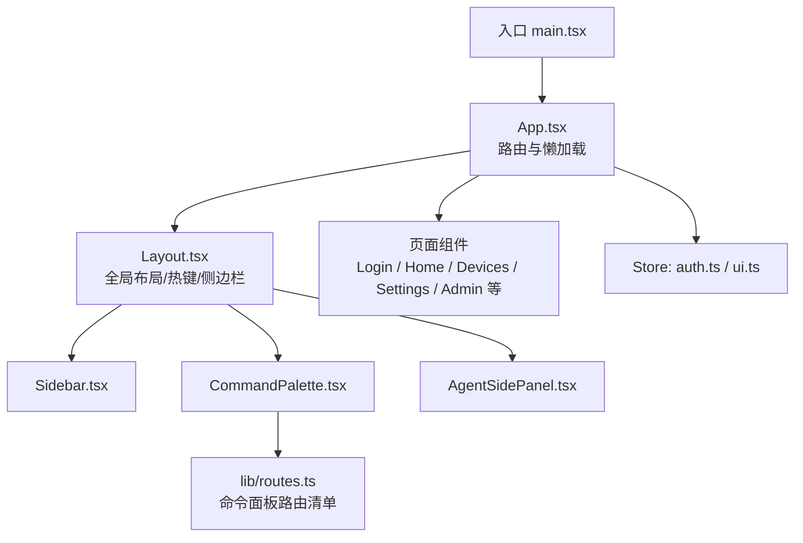
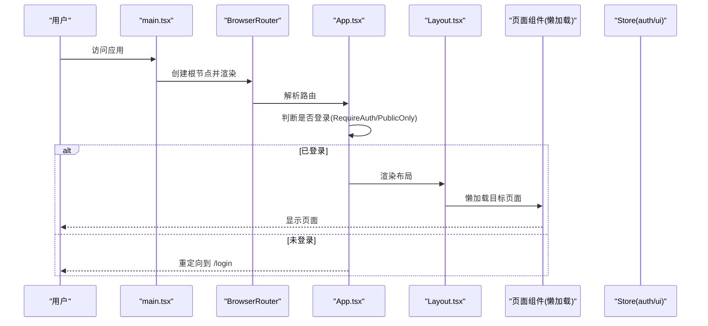
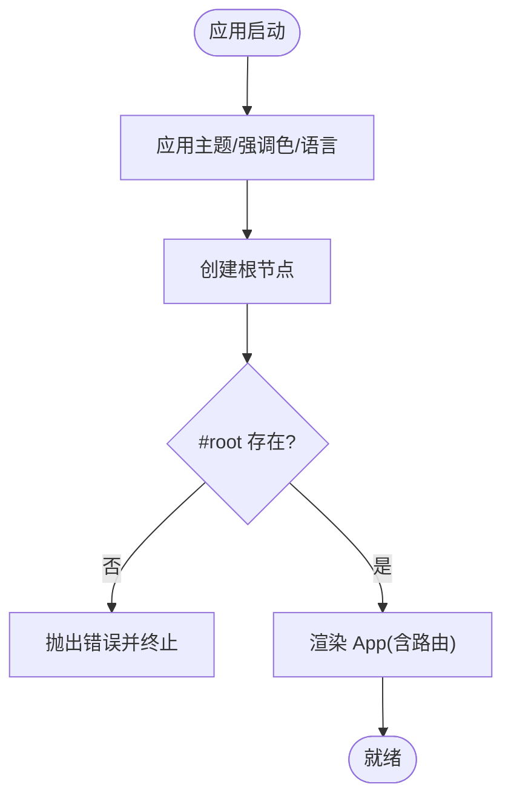
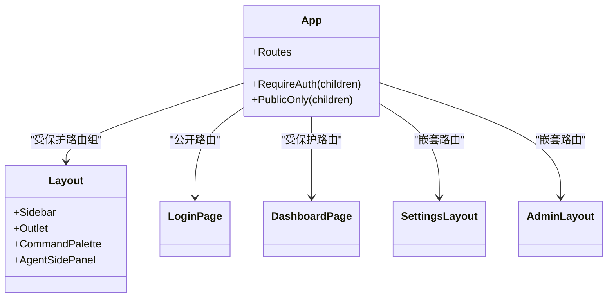
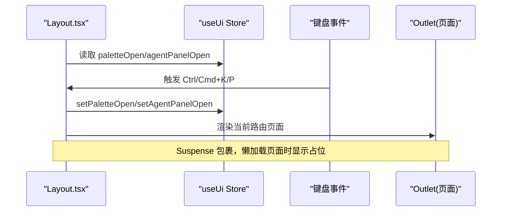
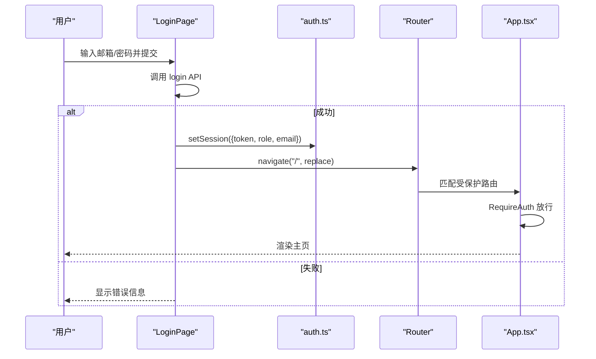
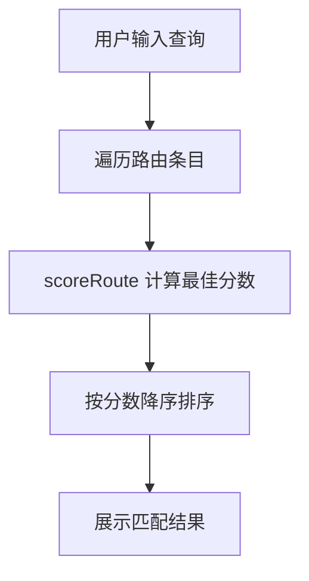
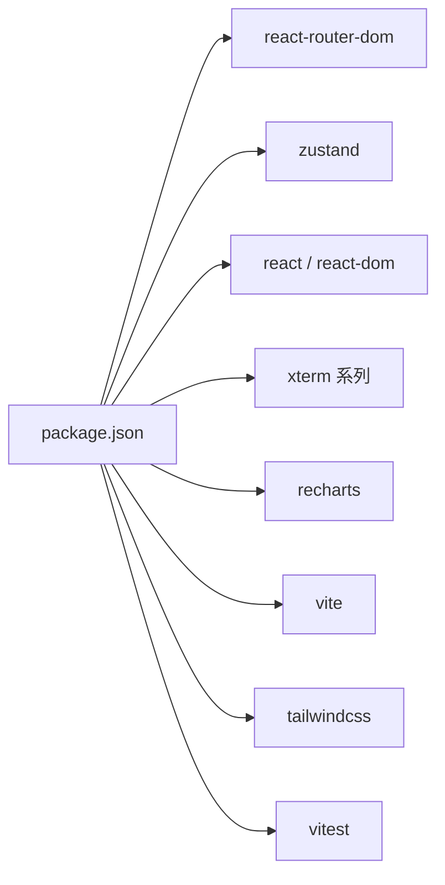

# React架构设计

<cite>
**本文引用的文件**
- [web/src/main.tsx](file://web/src/main.tsx)
- [web/src/App.tsx](file://web/src/App.tsx)
- [web/src/components/Layout.tsx](file://web/src/components/Layout.tsx)
- [web/src/pages/Login.tsx](file://web/src/pages/Login.tsx)
- [web/src/store/auth.ts](file://web/src/store/auth.ts)
- [web/src/store/ui.ts](file://web/src/store/ui.ts)
- [web/src/lib/routes.ts](file://web/src/lib/routes.ts)
- [web/package.json](file://web/package.json)
</cite>

## 目录
1. [简介](#简介)
2. [项目结构](#项目结构)
3. [核心组件](#核心组件)
4. [架构总览](#架构总览)
5. [详细组件分析](#详细组件分析)
6. [依赖关系分析](#依赖关系分析)
7. [性能考虑](#性能考虑)
8. [故障排查指南](#故障排查指南)
9. [结论](#结论)
10. [附录](#附录)

## 简介
本文件面向前端开发者，系统化梳理基于 React 18 的前端应用架构与最佳实践。内容覆盖应用启动流程、路由配置与懒加载机制、组件层次结构设计（Layout 布局、页面组织与嵌套路由）、代码分割策略与性能优化（动态导入与预加载思路）、错误边界与全局异常捕获方案，以及组件复用模式与扩展指导。文档以仓库实际实现为依据，辅以可视化图示帮助理解。

## 项目结构
前端工程位于 web 子目录，采用 Vite + TypeScript + React 18 技术栈，使用 react-router-dom 进行路由管理，Zustand 作为轻量状态管理库，Tailwind CSS 负责样式。整体结构遵循“按功能域划分”的目录组织方式：pages 存放页面级组件，components 存放可复用 UI 与业务组件，store 存放跨组件状态，lib 存放工具与常量（如路由清单），api 封装后端接口调用。

图表来源
- [web/src/main.tsx:1-26](file://web/src/main.tsx#L1-L26)
- [web/src/App.tsx:1-234](file://web/src/App.tsx#L1-L234)
- [web/src/components/Layout.tsx:1-70](file://web/src/components/Layout.tsx#L1-L70)
- [web/src/lib/routes.ts:1-111](file://web/src/lib/routes.ts#L1-L111)

章节来源
- [web/src/main.tsx:1-26](file://web/src/main.tsx#L1-L26)
- [web/src/App.tsx:1-234](file://web/src/App.tsx#L1-L234)
- [web/src/components/Layout.tsx:1-70](file://web/src/components/Layout.tsx#L1-L70)
- [web/src/lib/routes.ts:1-111](file://web/src/lib/routes.ts#L1-L111)

## 核心组件
- 应用入口与初始化
  - 在入口中完成主题、语言等一次性 DOM 写入，随后创建根容器并渲染 App。
  - 使用 StrictMode 与 BrowserRouter 包裹应用，确保开发期严格检查与浏览器路由能力。
- 路由与权限控制
  - App 集中定义所有路由，使用 lazy 实现按需加载；通过 RequireAuth/PublicOnly 高阶组件实现登录态校验与跳转。
  - 提供大量历史路径重定向，保证书签与外部链接兼容。
- 布局与全局交互
  - Layout 承载侧边栏、主内容区（Outlet）与全局悬浮面板（命令面板、AI 助手面板）。
  - 注册全局快捷键（⌘K/⌘P）打开对应面板，并在首次挂载时启动未读告警计数轮询。
- 登录流程
  - Login 页面提交后调用认证 API，成功后将会话持久化到 Zustand store，并重定向至首页。
- 状态管理
  - auth：维护 token、角色、邮箱等会话信息，支持持久化与登出清理。
  - ui：管理侧边栏折叠、命令面板与 AI 助手面板开关，仅持久化结构性状态。

章节来源
- [web/src/main.tsx:1-26](file://web/src/main.tsx#L1-L26)
- [web/src/App.tsx:1-234](file://web/src/App.tsx#L1-L234)
- [web/src/components/Layout.tsx:1-70](file://web/src/components/Layout.tsx#L1-L70)
- [web/src/pages/Login.tsx:1-134](file://web/src/pages/Login.tsx#L1-L134)
- [web/src/store/auth.ts:1-50](file://web/src/store/auth.ts#L1-L50)
- [web/src/store/ui.ts:1-39](file://web/src/store/ui.ts#L1-L39)

## 架构总览
下图展示从入口到页面渲染的关键链路，包括路由守卫、懒加载与布局组合。

图表来源
- [web/src/main.tsx:1-26](file://web/src/main.tsx#L1-L26)
- [web/src/App.tsx:1-234](file://web/src/App.tsx#L1-L234)
- [web/src/components/Layout.tsx:1-70](file://web/src/components/Layout.tsx#L1-L70)

## 详细组件分析

### 应用启动流程
- 启动前准备
  - 应用主题、强调色与语言在首屏绘制前写入 DOM，避免闪烁。
- 根容器与渲染
  - 使用 createRoot 创建根节点，StrictMode 下渲染 BrowserRouter 与 App。
- 关键约束
  - 若 #root 缺失则抛出错误，便于快速定位构建或部署问题。

图表来源
- [web/src/main.tsx:1-26](file://web/src/main.tsx#L1-L26)

章节来源
- [web/src/main.tsx:1-26](file://web/src/main.tsx#L1-L26)

### 路由配置与懒加载机制
- 路由组织
  - 所有路由集中在 App 中声明，包含公共布局路由组与独立全屏视图（如产物查看页）。
  - 大量旧路径通过 Navigate 重定向到新路径，保障兼容性。
- 懒加载
  - 页面组件统一通过 lazy(() => import(...)) 动态导入，配合 Suspense 提供加载占位。
- 权限控制
  - RequireAuth：无 token 时跳转到 /login，并携带 from 以便登录后回跳。
  - PublicOnly：已登录时从公开页面重定向到首页。
- 嵌套路由
  - 设置与管理模块通过嵌套 Route 组织，例如 /settings/* 与 /admin/*。

图表来源
- [web/src/App.tsx:1-234](file://web/src/App.tsx#L1-L234)
- [web/src/components/Layout.tsx:1-70](file://web/src/components/Layout.tsx#L1-L70)

章节来源
- [web/src/App.tsx:1-234](file://web/src/App.tsx#L1-L234)

### 布局组件与全局交互
- 布局职责
  - 左侧导航（Sidebar）、主内容区（Outlet）、全局悬浮面板（命令面板、AI 助手面板）。
  - 首次挂载时启动未读事件徽章轮询，卸载时停止。
- 全局快捷键
  - ⌘K 切换 AI 助手面板，⌘P 打开命令面板；输入框可自行拦截处理。
- 懒加载占位
  - 对 Outlet 使用 Suspense，fallback 为轻量文本提示，避免 i18n 订阅开销。

图表来源
- [web/src/components/Layout.tsx:1-70](file://web/src/components/Layout.tsx#L1-L70)
- [web/src/store/ui.ts:1-39](file://web/src/store/ui.ts#L1-L39)

章节来源
- [web/src/components/Layout.tsx:1-70](file://web/src/components/Layout.tsx#L1-L70)
- [web/src/store/ui.ts:1-39](file://web/src/store/ui.ts#L1-L39)

### 登录流程与鉴权
- 登录表单
  - 收集邮箱与密码，提交后调用认证接口，成功则将 access_token、refresh_token、role、email 写入 auth store，并跳转到首页。
  - 失败时根据响应码与消息展示友好提示。
- 鉴权守卫
  - RequireAuth 在路由层拦截未登录访问，PublicOnly 防止重复登录进入系统。

图表来源
- [web/src/pages/Login.tsx:1-134](file://web/src/pages/Login.tsx#L1-L134)
- [web/src/store/auth.ts:1-50](file://web/src/store/auth.ts#L1-L50)
- [web/src/App.tsx:1-234](file://web/src/App.tsx#L1-L234)

章节来源
- [web/src/pages/Login.tsx:1-134](file://web/src/pages/Login.tsx#L1-L134)
- [web/src/store/auth.ts:1-50](file://web/src/store/auth.ts#L1-L50)
- [web/src/App.tsx:1-234](file://web/src/App.tsx#L1-L234)

### 命令面板与路由检索
- 路由清单
  - lib/routes.ts 维护应用内可导航的路由条目，包含多语言标签、关键词与分组，供命令面板模糊搜索。
- 模糊匹配
  - 自定义 scoreRoute/fuzzyMatchScore 算法，优先连续匹配与词边界匹配，兼顾中英文与拼音缩写。

图表来源
- [web/src/lib/routes.ts:1-111](file://web/src/lib/routes.ts#L1-L111)

章节来源
- [web/src/lib/routes.ts:1-111](file://web/src/lib/routes.ts#L1-L111)

## 依赖关系分析
- 运行时依赖
  - react/react-dom：React 18 运行时。
  - react-router-dom：客户端路由与导航。
  - zustand：轻量状态管理，结合 persist 中间件实现本地持久化。
  - xterm 系列：终端组件用于 WebShell。
  - recharts/dagre/xyflow：图表与流程图可视化。
- 构建与开发
  - vite：开发与打包。
  - tailwindcss/postcss/autoprefixer：样式体系。
  - vitest/msw：测试与 Mock。

图表来源
- [web/package.json:1-53](file://web/package.json#L1-L53)

章节来源
- [web/package.json:1-53](file://web/package.json#L1-L53)

## 性能考虑
- 代码分割与懒加载
  - 页面级组件全部通过 lazy 动态导入，减少首屏体积；配合 Suspense 提供加载反馈。
- 预加载策略建议
  - 对高频访问页面可使用 <link rel="prefetch"> 或框架级预取策略，在空闲时拉取资源。
  - 对热点路由可在鼠标悬停或进入父级菜单时提前触发 import()。
- 状态持久化
  - auth 与 ui 使用 zustand/persist 将必要状态落盘，避免重复请求与提升用户体验。
- 首屏优化
  - 在入口阶段执行少量 DOM 写入（主题/语言），避免二次重绘。
  - 布局中的 Suspense fallback 保持轻量，避免引入复杂订阅。

[本节为通用性能建议，不直接分析具体文件]

## 故障排查指南
- 常见问题
  - 缺少 #root 元素：入口会抛出错误，检查 HTML 模板是否正确注入根节点。
  - 登录后仍停留在登录页：确认 RequireAuth 逻辑与 token 持久化是否正常。
  - 命令面板无法搜索：检查 routes.ts 的条目与关键词是否完整。
- 调试建议
  - 使用浏览器开发者工具观察网络请求与路由变化。
  - 在关键分支添加日志输出，确认状态变更与副作用执行顺序。
- 错误处理现状与建议
  - 登录错误已在页面层区分 401 与其他错误并给出提示。
  - 建议在应用顶层增加 ErrorBoundary 与全局异常捕获，统一兜底体验与上报。

章节来源
- [web/src/main.tsx:1-26](file://web/src/main.tsx#L1-L26)
- [web/src/pages/Login.tsx:1-134](file://web/src/pages/Login.tsx#L1-L134)
- [web/src/App.tsx:1-234](file://web/src/App.tsx#L1-L234)
- [web/src/lib/routes.ts:1-111](file://web/src/lib/routes.ts#L1-L111)

## 结论
本项目采用清晰的入口-路由-布局-页面分层，结合 lazy 与 Suspense 实现细粒度代码分割；通过 Zustand 管理跨组件状态并持久化关键数据；在路由层集中实现鉴权与兼容重定向。整体架构具备良好的可扩展性与可维护性。后续可在错误边界、全局异常上报、路由预取与缓存等方面进一步增强健壮性与性能。

[本节为总结性内容，不直接分析具体文件]

## 附录
- 术语
  - 懒加载：仅在需要时加载组件代码，降低首屏体积。
  - 代码分割：将应用拆分为多个包，按需加载。
  - 预加载：在空闲时提前获取可能需要的资源。
- 扩展指引
  - 新增页面：在 App 中注册路由并使用 lazy 动态导入；如需受保护，放入 Layout 路由组。
  - 新增设置项：在 SettingsLayout 下新增子路由，并在命令面板清单中添加条目。
  - 新增全局状态：在 store 中定义 slice，并通过 persist 控制持久化范围。

[本节为概念性说明，不直接分析具体文件]