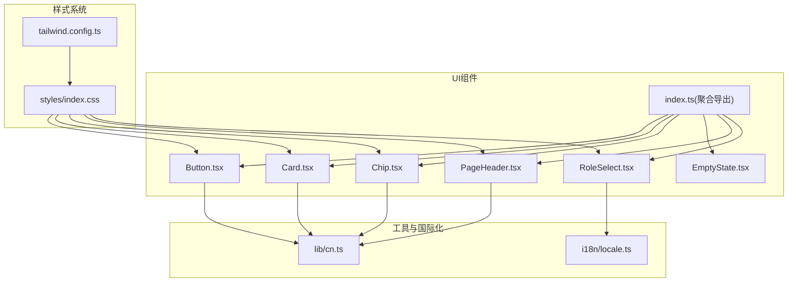
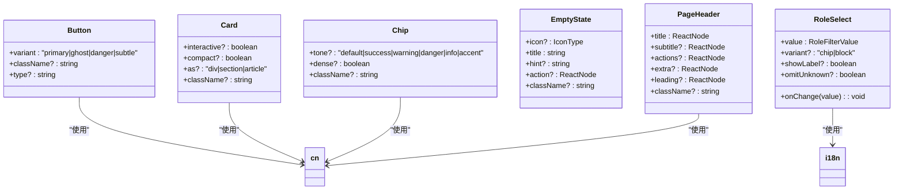
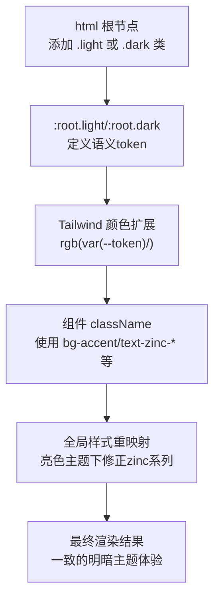
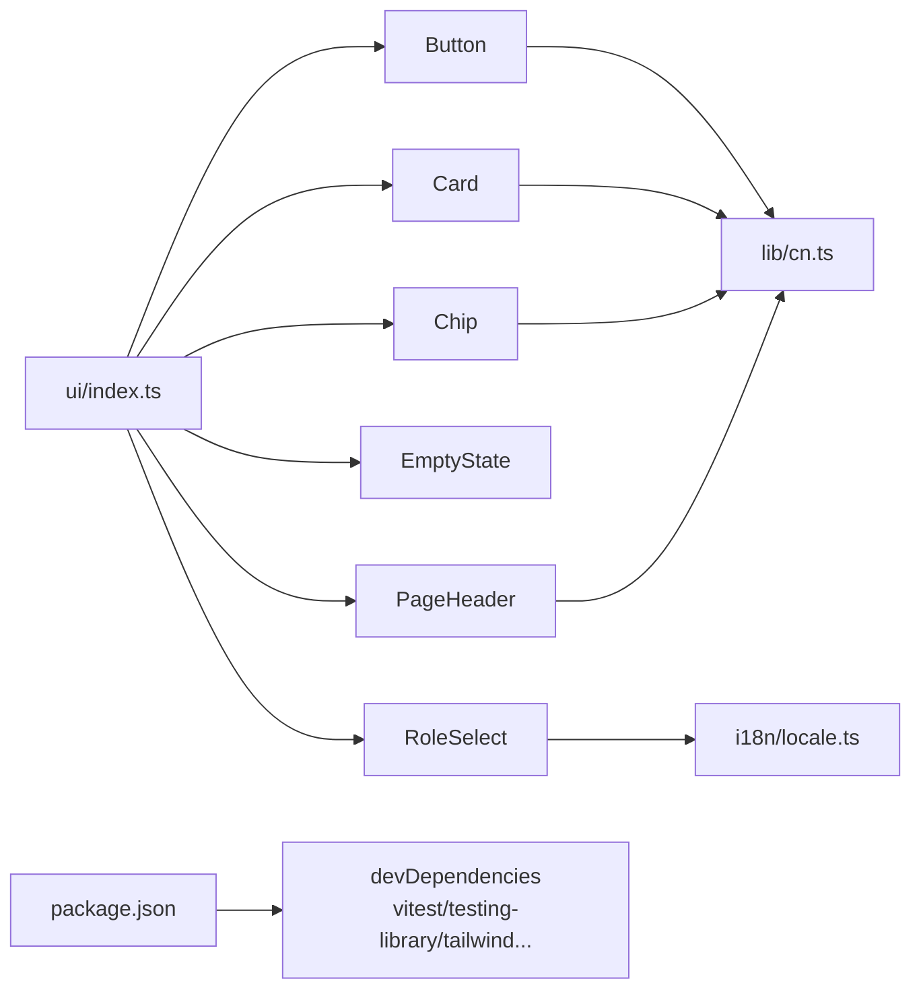

# UI组件库

<cite>
**本文引用的文件**   
- [web/src/components/ui/Button.tsx](file://web/src/components/ui/Button.tsx)
- [web/src/components/ui/Card.tsx](file://web/src/components/ui/Card.tsx)
- [web/src/components/ui/Chip.tsx](file://web/src/components/ui/Chip.tsx)
- [web/src/components/ui/EmptyState.tsx](file://web/src/components/ui/EmptyState.tsx)
- [web/src/components/ui/PageHeader.tsx](file://web/src/components/ui/PageHeader.tsx)
- [web/src/components/ui/RoleSelect.tsx](file://web/src/components/ui/RoleSelect.tsx)
- [web/src/components/ui/index.ts](file://web/src/components/ui/index.ts)
- [web/tailwind.config.ts](file://web/tailwind.config.ts)
- [web/src/styles/index.css](file://web/src/styles/index.css)
- [web/package.json](file://web/package.json)
- [web/src/i18n/locale.ts](file://web/src/i18n/locale.ts)
- [web/src/lib/cn.ts](file://web/src/lib/cn.ts)
</cite>

## 目录
1. [简介](#简介)
2. [项目结构](#项目结构)
3. [核心组件](#核心组件)
4. [架构总览](#架构总览)
5. [详细组件分析](#详细组件分析)
6. [依赖分析](#依赖分析)
7. [性能考虑](#性能考虑)
8. [故障排查指南](#故障排查指南)
9. [结论](#结论)
10. [附录](#附录)

## 简介
本文件面向UI开发者，系统化梳理前端UI组件库的设计与实现规范。内容覆盖：
- 基础组件（Button、Card、Modal等）的使用方法与属性配置
- 样式系统：TailwindCSS集成、主题定制与响应式策略
- 可访问性与国际化适配
- 组件组合模式与高级用法示例
- 测试策略与开发调试指南
- 组件扩展与自定义的最佳实践

## 项目结构
UI组件位于 web/src/components/ui，统一通过 barrel 导出；样式由 Tailwind 与全局 CSS 共同驱动；国际化通过 i18n 模块注入。

图表来源
- [web/src/components/ui/index.ts:1-10](file://web/src/components/ui/index.ts#L1-L10)
- [web/src/components/ui/Button.tsx:1-43](file://web/src/components/ui/Button.tsx#L1-L43)
- [web/src/components/ui/Card.tsx:1-36](file://web/src/components/ui/Card.tsx#L1-L36)
- [web/src/components/ui/Chip.tsx:1-37](file://web/src/components/ui/Chip.tsx#L1-L37)
- [web/src/components/ui/EmptyState.tsx:1-33](file://web/src/components/ui/EmptyState.tsx#L1-L33)
- [web/src/components/ui/PageHeader.tsx:1-41](file://web/src/components/ui/PageHeader.tsx#L1-L41)
- [web/src/components/ui/RoleSelect.tsx:1-87](file://web/src/components/ui/RoleSelect.tsx#L1-L87)
- [web/tailwind.config.ts:1-43](file://web/tailwind.config.ts#L1-L43)
- [web/src/styles/index.css:1-672](file://web/src/styles/index.css#L1-L672)
- [web/src/lib/cn.ts](file://web/src/lib/cn.ts)
- [web/src/i18n/locale.ts](file://web/src/i18n/locale.ts)

章节来源
- [web/src/components/ui/index.ts:1-10](file://web/src/components/ui/index.ts#L1-L10)
- [web/tailwind.config.ts:1-43](file://web/tailwind.config.ts#L1-L43)
- [web/src/styles/index.css:1-672](file://web/src/styles/index.css#L1-L672)

## 核心组件
- Button：提供 primary / ghost / danger / subtle 四种变体，默认尺寸固定，保证按钮组视觉一致性。
- Card：统一卡片容器，支持交互态与紧凑模式，作为页面信息块的基础载体。
- Chip：行内标签/状态标记，支持多种语义色 tone。
- EmptyState：空列表占位，包含图标、标题、提示与可选操作。
- PageHeader：页面头部统一布局，支持标题、副标题、右侧动作区与额外区域。
- RoleSelect：设备角色筛选下拉，内置多语言文案与“未分类”选项控制。

章节来源
- [web/src/components/ui/Button.tsx:1-43](file://web/src/components/ui/Button.tsx#L1-L43)
- [web/src/components/ui/Card.tsx:1-36](file://web/src/components/ui/Card.tsx#L1-L36)
- [web/src/components/ui/Chip.tsx:1-37](file://web/src/components/ui/Chip.tsx#L1-L37)
- [web/src/components/ui/EmptyState.tsx:1-33](file://web/src/components/ui/EmptyState.tsx#L1-L33)
- [web/src/components/ui/PageHeader.tsx:1-41](file://web/src/components/ui/PageHeader.tsx#L1-L41)
- [web/src/components/ui/RoleSelect.tsx:1-87](file://web/src/components/ui/RoleSelect.tsx#L1-L87)

## 架构总览
组件层通过统一的类名拼接工具 cn 与 Tailwind 语义化颜色变量协作，配合全局 CSS 完成暗/亮主题切换与细节优化。

图表来源
- [web/src/components/ui/Button.tsx:1-43](file://web/src/components/ui/Button.tsx#L1-L43)
- [web/src/components/ui/Card.tsx:1-36](file://web/src/components/ui/Card.tsx#L1-L36)
- [web/src/components/ui/Chip.tsx:1-37](file://web/src/components/ui/Chip.tsx#L1-L37)
- [web/src/components/ui/EmptyState.tsx:1-33](file://web/src/components/ui/EmptyState.tsx#L1-L33)
- [web/src/components/ui/PageHeader.tsx:1-41](file://web/src/components/ui/PageHeader.tsx#L1-L41)
- [web/src/components/ui/RoleSelect.tsx:1-87](file://web/src/components/ui/RoleSelect.tsx#L1-L87)
- [web/src/lib/cn.ts](file://web/src/lib/cn.ts)
- [web/src/i18n/locale.ts](file://web/src/i18n/locale.ts)

## 详细组件分析

### Button 组件
- 设计要点
  - 变体：primary（强调）、ghost（次要）、danger（危险）、subtle（弱化）。
  - 尺寸固定，确保按钮组对齐一致。
  - 通过 className 透传以支持外部覆盖。
- 关键属性
  - variant：字符串枚举，决定配色与交互态。
  - type：原生 button 类型，默认 button。
  - className：追加类名。
- 使用建议
  - 主操作使用 primary，删除/破坏性操作使用 danger，刷新/次要操作使用 ghost。
  - 需要浅色背景上的高对比按钮时使用 subtle。

章节来源
- [web/src/components/ui/Button.tsx:1-43](file://web/src/components/ui/Button.tsx#L1-L43)

### Card 组件
- 设计要点
  - 统一圆角、边框与背景，提供 hover 交互态。
  - compact 模式用于密集数据行。
  - as 支持渲染为 div/section/article，提升语义。
- 关键属性
  - interactive：是否启用 hover 增强。
  - compact：是否使用紧凑间距。
  - as：根元素标签。
  - className：追加类名。
- 使用建议
  - 列表项、信息块、面板均使用 Card 包裹，保持视觉一致性。

章节来源
- [web/src/components/ui/Card.tsx:1-36](file://web/src/components/ui/Card.tsx#L1-L36)

### Chip 组件
- 设计要点
  - 行内小标签，支持 default/success/warning/danger/info/accent 语义色。
  - dense 模式用于极密场景。
- 关键属性
  - tone：语义色。
  - dense：是否紧凑。
  - className：追加类名。
- 使用建议
  - 状态、标签、计数等轻量信息优先使用 Chip。

章节来源
- [web/src/components/ui/Chip.tsx:1-37](file://web/src/components/ui/Chip.tsx#L1-L37)

### EmptyState 组件
- 设计要点
  - 垂直居中展示图标、标题、提示与可选操作。
  - 适用于所有可能为空的数据列表页。
- 关键属性
  - icon：图标组件引用。
  - title：主标题。
  - hint：辅助说明。
  - action：操作节点（如按钮）。
  - className：自定义容器样式。
- 使用建议
  - 无数据时立即呈现，引导用户执行下一步操作。

章节来源
- [web/src/components/ui/EmptyState.tsx:1-33](file://web/src/components/ui/EmptyState.tsx#L1-L33)

### PageHeader 组件
- 设计要点
  - 统一页面头部布局，支持 leading、标题、副标题、actions 与 extra 插槽。
  - 结合全局 app-header 样式实现粘性玻璃效果。
- 关键属性
  - title、subtitle、actions、extra、leading、className。
- 使用建议
  - 列表页顶部统一使用该组件，保持导航与操作区一致性。

章节来源
- [web/src/components/ui/PageHeader.tsx:1-41](file://web/src/components/ui/PageHeader.tsx#L1-L41)

### RoleSelect 组件
- 设计要点
  - 设备角色筛选下拉，内置“所有角色”和“未分类”选项。
  - 支持 chip/block 两种形态，适配工具栏与表单列布局。
  - 通过 useI18n 提供中英文文案。
- 关键属性
  - value、onChange、variant、showLabel、omitUnknown、className。
- 使用建议
  - 在 Monitor/Edges/Logs/Traces 等页面复用，统一过滤语义。

章节来源
- [web/src/components/ui/RoleSelect.tsx:1-87](file://web/src/components/ui/RoleSelect.tsx#L1-L87)
- [web/src/i18n/locale.ts](file://web/src/i18n/locale.ts)

### Modal 组件（业务级）
- 说明
  - 仓库中存在业务级 Modal 组件，用于通用弹窗场景。其具体实现与 API 请参考对应文件。
- 参考路径
  - [web/src/components/Modal.tsx](file://web/src/components/Modal.tsx)

章节来源
- [web/src/components/Modal.tsx](file://web/src/components/Modal.tsx)

## 架构总览（样式与主题）
- Tailwind 配置
  - 定义字体族、动画与基于 CSS 变量的语义色映射。
  - darkMode 采用 class 策略，便于在 html 上切换 light/dark。
- 全局样式
  - 定义 :root.dark 与 :root.light 两套语义 token。
  - 针对大量历史 zinc-* 类名进行“亮色主题重映射”，保证跨主题一致性。
  - 提供 focus-visible、滚动条、Markdown 渲染、打印输出等增强样式。

图表来源
- [web/tailwind.config.ts:1-43](file://web/tailwind.config.ts#L1-L43)
- [web/src/styles/index.css:1-672](file://web/src/styles/index.css#L1-L672)

章节来源
- [web/tailwind.config.ts:1-43](file://web/tailwind.config.ts#L1-L43)
- [web/src/styles/index.css:1-672](file://web/src/styles/index.css#L1-L672)

## 依赖分析
- 组件间耦合
  - ui 子目录组件仅依赖公共工具 cn 与 i18n，彼此解耦，通过 index.ts 聚合导出。
- 外部依赖
  - React、Tailwind、Vitest、Testing Library 等在前端构建与测试中发挥作用。
- 潜在循环依赖
  - 当前组件均为纯展示型，无直接相互 import，风险较低。

图表来源
- [web/src/components/ui/index.ts:1-10](file://web/src/components/ui/index.ts#L1-L10)
- [web/package.json:1-53](file://web/package.json#L1-L53)
- [web/src/lib/cn.ts](file://web/src/lib/cn.ts)
- [web/src/i18n/locale.ts](file://web/src/i18n/locale.ts)

章节来源
- [web/src/components/ui/index.ts:1-10](file://web/src/components/ui/index.ts#L1-L10)
- [web/package.json:1-53](file://web/package.json#L1-L53)

## 性能考虑
- 类名合并
  - 使用 cn 减少重复与冲突，避免不必要的重排。
- 主题切换
  - 通过 class 切换主题，避免频繁 DOM 操作；全局重映射规则已优化亮色主题下的对比度与可读性。
- 渲染成本
  - 组件均为轻量函数组件，无复杂计算；列表页建议使用虚拟滚动或分页加载大数据集。

[本节为通用指导，不直接分析具体文件]

## 故障排查指南
- 主题不一致
  - 检查 html 根节点是否正确设置 .light/.dark 类；确认全局样式是否被第三方样式覆盖。
- 亮色主题对比度异常
  - 确认是否使用了硬编码的 zinc-* 类名；必要时按全局重映射规则调整或使用语义 token。
- 焦点可见性缺失
  - 输入控件默认隐藏 outline，如需键盘导航反馈，请为按钮/链接保留 outline 或使用 focus-visible。
- 打印输出异常
  - 报告打印区域需使用 report-print-area 包裹，确保颜色与分页行为符合预期。

章节来源
- [web/src/styles/index.css:1-672](file://web/src/styles/index.css#L1-L672)

## 结论
本UI组件库以“语义化Token + Tailwind + 全局重映射”为核心，提供一套稳定、可维护、可拓展的前端基础组件。通过统一的导出入口与清晰的属性约定，降低了页面级组件的样式漂移风险，并兼顾了可访问性与国际化需求。

[本节为总结性内容，不直接分析具体文件]

## 附录

### 组件API速查表
- Button
  - 属性：variant、type、className
  - 用途：主操作、次要操作、危险操作、弱化操作
- Card
  - 属性：interactive、compact、as、className
  - 用途：信息块、列表项、面板容器
- Chip
  - 属性：tone、dense、className
  - 用途：标签、状态、计数
- EmptyState
  - 属性：icon、title、hint、action、className
  - 用途：空列表占位与引导
- PageHeader
  - 属性：title、subtitle、actions、extra、leading、className
  - 用途：页面头部统一布局
- RoleSelect
  - 属性：value、onChange、variant、showLabel、omitUnknown、className
  - 用途：设备角色筛选

章节来源
- [web/src/components/ui/Button.tsx:1-43](file://web/src/components/ui/Button.tsx#L1-L43)
- [web/src/components/ui/Card.tsx:1-36](file://web/src/components/ui/Card.tsx#L1-L36)
- [web/src/components/ui/Chip.tsx:1-37](file://web/src/components/ui/Chip.tsx#L1-L37)
- [web/src/components/ui/EmptyState.tsx:1-33](file://web/src/components/ui/EmptyState.tsx#L1-L33)
- [web/src/components/ui/PageHeader.tsx:1-41](file://web/src/components/ui/PageHeader.tsx#L1-L41)
- [web/src/components/ui/RoleSelect.tsx:1-87](file://web/src/components/ui/RoleSelect.tsx#L1-L87)

### 主题与样式定制指南
- 新增语义色
  - 在 tailwind.config.ts 的 theme.extend.colors 中扩展新 token，并在 styles/index.css 的 :root.* 中定义对应 RGB。
- 覆盖默认样式
  - 通过 className 透传覆盖；谨慎使用 !important，优先提高选择器优先级。
- 亮色主题兼容
  - 若引入新的 zinc-* 或深色语义类，请在 styles/index.css 中补充亮色重映射规则。

章节来源
- [web/tailwind.config.ts:1-43](file://web/tailwind.config.ts#L1-L43)
- [web/src/styles/index.css:1-672](file://web/src/styles/index.css#L1-L672)

### 可访问性与国际化
- 可访问性
  - 为交互元素提供合适的 aria-* 属性；确保焦点可见性与键盘可达性。
- 国际化
  - 使用 useI18n 提供的 tr 方法获取多语文案；新增词条需在 i18n 资源中维护。

章节来源
- [web/src/i18n/locale.ts](file://web/src/i18n/locale.ts)
- [web/src/components/ui/RoleSelect.tsx:1-87](file://web/src/components/ui/RoleSelect.tsx#L1-L87)

### 组合模式与高级用法
- 列表页骨架
  - PageHeader + Card 列表 + EmptyState 兜底 + RoleSelect 筛选
- 操作区
  - PageHeader.actions 中放置 Button 组合，区分 primary/ghost/danger
- 状态展示
  - 使用 Chip 显示状态/标签，结合 tone 表达语义

章节来源
- [web/src/components/ui/PageHeader.tsx:1-41](file://web/src/components/ui/PageHeader.tsx#L1-L41)
- [web/src/components/ui/Card.tsx:1-36](file://web/src/components/ui/Card.tsx#L1-L36)
- [web/src/components/ui/Chip.tsx:1-37](file://web/src/components/ui/Chip.tsx#L1-L37)
- [web/src/components/ui/EmptyState.tsx:1-33](file://web/src/components/ui/EmptyState.tsx#L1-L33)
- [web/src/components/ui/Button.tsx:1-43](file://web/src/components/ui/Button.tsx#L1-L43)
- [web/src/components/ui/RoleSelect.tsx:1-87](file://web/src/components/ui/RoleSelect.tsx#L1-L87)

### 测试策略与开发调试
- 单元测试
  - 使用 Vitest + @testing-library/react 对组件进行快照与交互断言。
- Mock 与数据
  - 使用 msw 模拟后端接口，隔离网络依赖。
- 运行命令
  - 开发：npm run dev
  - 构建：npm run build
  - 测试：npm run test / npm run test:watch
  - 类型检查：npm run typecheck

章节来源
- [web/package.json:1-53](file://web/package.json#L1-L53)