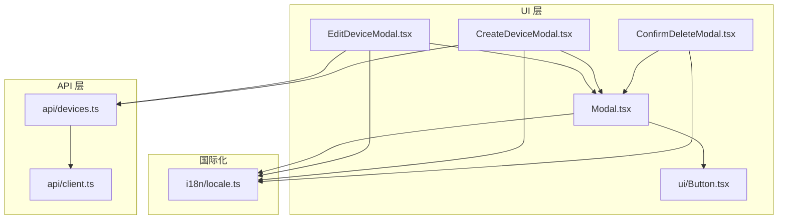
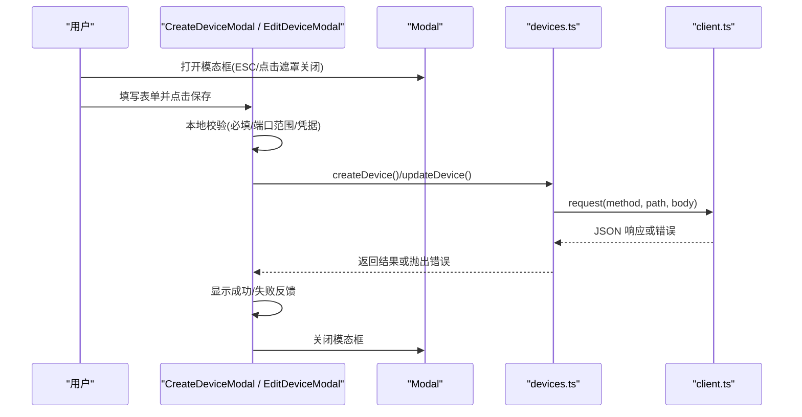
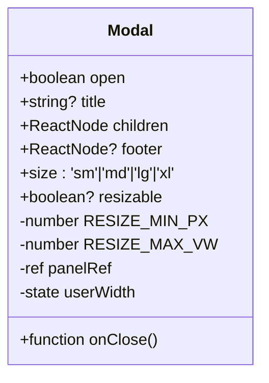
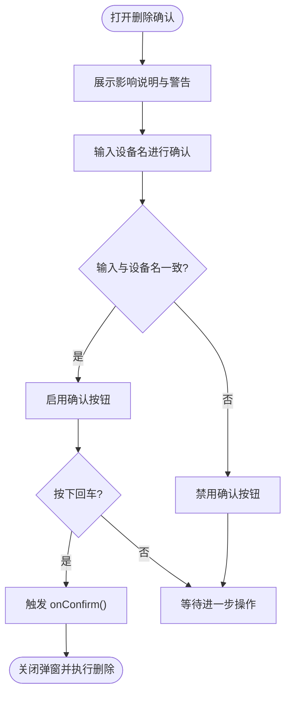
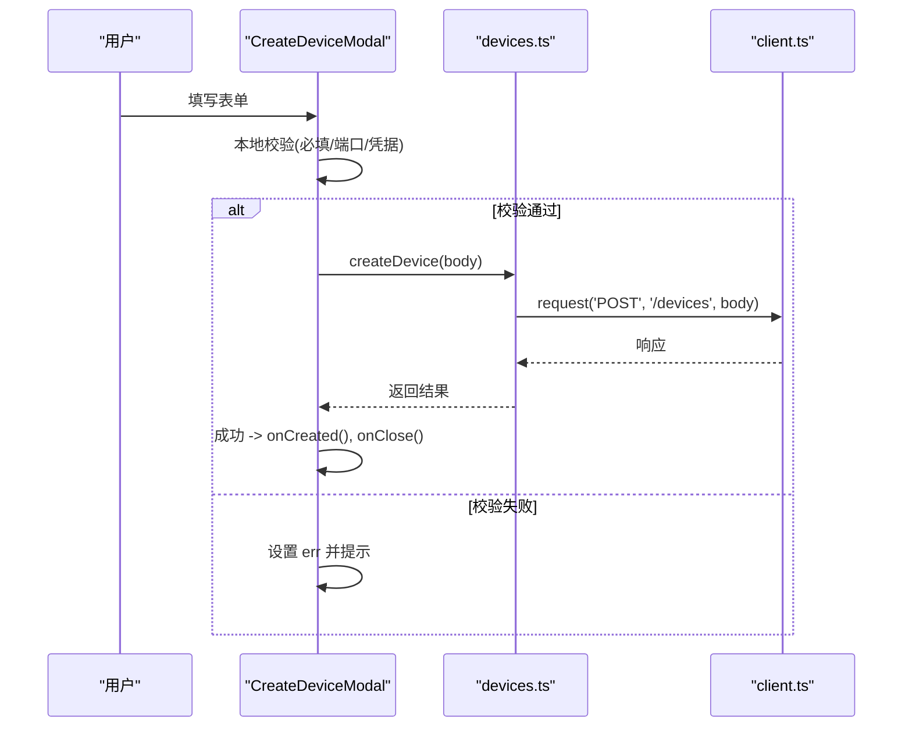
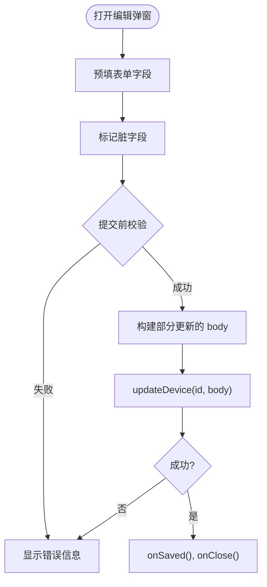
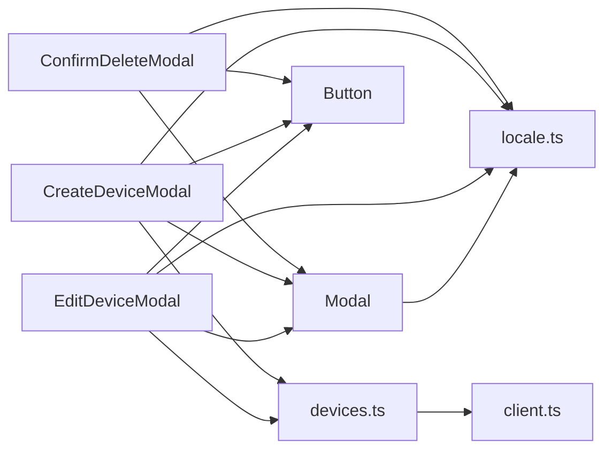

# 交互组件

<cite>
**本文引用的文件**
- [Modal.tsx](file://web/src/components/Modal.tsx)
- [ConfirmDeleteModal.tsx](file://web/src/components/ConfirmDeleteModal.tsx)
- [CreateDeviceModal.tsx](file://web/src/components/CreateDeviceModal.tsx)
- [EditDeviceModal.tsx](file://web/src/components/EditDeviceModal.tsx)
- [Button.tsx](file://web/src/components/ui/Button.tsx)
- [locale.ts](file://web/src/i18n/locale.ts)
- [devices.ts](file://web/src/api/devices.ts)
- [client.ts](file://web/src/api/client.ts)
</cite>

## 目录
1. [简介](#简介)
2. [项目结构](#项目结构)
3. [核心组件](#核心组件)
4. [架构总览](#架构总览)
5. [详细组件分析](#详细组件分析)
6. [依赖关系分析](#依赖关系分析)
7. [性能与可访问性](#性能与可访问性)
8. [故障排查指南](#故障排查指南)
9. [结论](#结论)
10. [附录：自定义交互组件开发指南](#附录自定义交互组件开发指南)

## 简介
本文件聚焦于前端交互组件 Modal、ConfirmDeleteModal、CreateDeviceModal、EditDeviceModal 的实现与使用，覆盖模态框生命周期管理、状态控制、事件处理、表单验证、数据绑定、用户反馈、复杂交互场景（多步骤、动态加载、异步操作）、键盘导航与焦点管理、可访问性支持以及动画与过渡效果。文末提供面向开发者的自定义交互组件开发指南。

## 项目结构
以下图示展示与交互组件相关的核心文件及其职责边界：

图表来源
- [Modal.tsx:1-133](file://web/src/components/Modal.tsx#L1-L133)
- [ConfirmDeleteModal.tsx:1-87](file://web/src/components/ConfirmDeleteModal.tsx#L1-L87)
- [CreateDeviceModal.tsx:1-274](file://web/src/components/CreateDeviceModal.tsx#L1-L274)
- [EditDeviceModal.tsx:1-320](file://web/src/components/EditDeviceModal.tsx#L1-L320)
- [Button.tsx:1-43](file://web/src/components/ui/Button.tsx#L1-L43)
- [locale.ts:1-102](file://web/src/i18n/locale.ts#L1-L102)
- [devices.ts:1-490](file://web/src/api/devices.ts#L1-L490)
- [client.ts:43-80](file://web/src/api/client.ts#L43-L80)

章节来源
- [Modal.tsx:1-133](file://web/src/components/Modal.tsx#L1-L133)
- [ConfirmDeleteModal.tsx:1-87](file://web/src/components/ConfirmDeleteModal.tsx#L1-L87)
- [CreateDeviceModal.tsx:1-274](file://web/src/components/CreateDeviceModal.tsx#L1-L274)
- [EditDeviceModal.tsx:1-320](file://web/src/components/EditDeviceModal.tsx#L1-L320)
- [Button.tsx:1-43](file://web/src/components/ui/Button.tsx#L1-L43)
- [locale.ts:1-102](file://web/src/i18n/locale.ts#L1-L102)
- [devices.ts:1-490](file://web/src/api/devices.ts#L1-L490)
- [client.ts:43-80](file://web/src/api/client.ts#L43-L80)

## 核心组件
- Modal：基础对话框容器，负责遮罩、标题栏、内容区、底部操作区、ESC 关闭、滚动锁定、可选拖拽调宽、Aria 属性与可访问性。
- ConfirmDeleteModal：删除确认弹窗，要求输入设备名以二次确认，阻止误删。
- CreateDeviceModal：新增设备表单，包含基本信息与 SSH 凭据配置，提交后调用后端创建接口。
- EditDeviceModal：编辑设备表单，基于脏字段追踪仅提交变更字段，支持密码/私钥切换与留空保持现有值。

章节来源
- [Modal.tsx:1-133](file://web/src/components/Modal.tsx#L1-L133)
- [ConfirmDeleteModal.tsx:1-87](file://web/src/components/ConfirmDeleteModal.tsx#L1-L87)
- [CreateDeviceModal.tsx:1-274](file://web/src/components/CreateDeviceModal.tsx#L1-L274)
- [EditDeviceModal.tsx:1-320](file://web/src/components/EditDeviceModal.tsx#L1-L320)

## 架构总览
下图展示了从用户操作到 API 请求的完整时序，涵盖创建与编辑设备的典型流程。

图表来源
- [CreateDeviceModal.tsx:53-102](file://web/src/components/CreateDeviceModal.tsx#L53-L102)
- [EditDeviceModal.tsx:73-120](file://web/src/components/EditDeviceModal.tsx#L73-L120)
- [devices.ts:114-145](file://web/src/api/devices.ts#L114-L145)
- [client.ts:43-80](file://web/src/api/client.ts#L43-L80)

## 详细组件分析

### Modal 组件
- 生命周期与状态
  - open 为受控属性；当 open 变化时，挂载/卸载键盘监听与 body 滚动锁定。
  - 内部维护 userWidth 用于记录用户拖拽后的宽度，未拖拽时遵循 size 预设。
- 事件处理
  - ESC 键关闭；点击遮罩关闭；右上角关闭按钮触发 onClose。
  - 可选 resizable：左右边缘拖拽调整宽度，限制最小像素与最大视口比例。
- 可访问性与焦点
  - 根节点 role="dialog"、aria-modal="true"、aria-label 由 title 或默认值提供。
  - 关闭按钮具备 aria-label 与可访问提示。
- 动画与过渡
  - 面板类名含动画相关样式，配合 Tailwind 实现缩放/阴影等视觉过渡。
- 布局与滚动
  - 内容区域 max-h-[90vh] 且 flex-1 自适应，保证长内容可滚动且不溢出视口。

图表来源
- [Modal.tsx:12-31](file://web/src/components/Modal.tsx#L12-L31)
- [Modal.tsx:27-44](file://web/src/components/Modal.tsx#L27-L44)
- [Modal.tsx:48-66](file://web/src/components/Modal.tsx#L48-L66)
- [Modal.tsx:68-131](file://web/src/components/Modal.tsx#L68-L131)

章节来源
- [Modal.tsx:1-133](file://web/src/components/Modal.tsx#L1-L133)

### ConfirmDeleteModal 组件
- 交互语义
  - 要求输入与目标设备名一致的文本方可启用“确认删除”，防止误操作。
  - 在删除进行中禁用按钮，避免重复提交。
- 状态与事件
  - 打开时清空确认文本；Enter 键在匹配时触发 onConfirm。
  - 通过 Modal 的 footer 渲染取消与确认按钮。
- 可访问性
  - 输入框 autoFocus，便于键盘用户快速定位。
  - 文案通过 i18n 工具 tr 进行双语切换。

图表来源
- [ConfirmDeleteModal.tsx:24-86](file://web/src/components/ConfirmDeleteModal.tsx#L24-L86)

章节来源
- [ConfirmDeleteModal.tsx:1-87](file://web/src/components/ConfirmDeleteModal.tsx#L1-L87)

### CreateDeviceModal 组件
- 表单结构与数据绑定
  - 基本信息：名称、描述、主机名。
  - SSH 连接：主机、端口、用户、认证方式（密码/私钥）、凭据。
  - 所有字段均为受控组件，onChange 更新对应 state。
- 校验规则
  - 必填项：名称、SSH 主机、SSH 用户、凭据（根据认证方式）。
  - 端口范围：1-65535 的数字校验。
- 提交逻辑
  - 组装 CreateDeviceInput，按认证方式填充 ssh_password 或 ssh_key。
  - 调用 createDevice 成功后回调 onCreated 并关闭弹窗；失败则设置 err。
- 用户体验
  - 提交中禁用按钮并显示“保存中…”。
  - 打开时重置所有字段，避免上次凭据泄露。
  - 错误信息以 alert 区域呈现。

图表来源
- [CreateDeviceModal.tsx:53-102](file://web/src/components/CreateDeviceModal.tsx#L53-L102)
- [devices.ts:114-116](file://web/src/api/devices.ts#L114-L116)
- [client.ts:43-80](file://web/src/api/client.ts#L43-L80)

章节来源
- [CreateDeviceModal.tsx:1-274](file://web/src/components/CreateDeviceModal.tsx#L1-L274)
- [devices.ts:84-116](file://web/src/api/devices.ts#L84-L116)
- [client.ts:43-80](file://web/src/api/client.ts#L43-L80)

### EditDeviceModal 组件
- 脏字段追踪
  - 使用 dirty 标记已修改字段，仅在提交时合并到 UpdateDeviceInput。
  - 无脏字段时“保存”按钮禁用，提示无需更改。
- 表单预填与重置
  - 打开时从 device 预填表单；切换设备时重置 dirty 与错误状态。
- 凭据处理
  - 留空表示“保持现有凭据”，非空表示替换为新值。
  - 切换认证方式时清空 credential，避免误写字段。
- 校验与提交
  - 对 dirty 的 name/ssh_host/ssh_user 做非空校验；端口范围校验同创建。
  - 调用 updateDevice 成功后回调 onSaved 并关闭弹窗。

图表来源
- [EditDeviceModal.tsx:31-71](file://web/src/components/EditDeviceModal.tsx#L31-L71)
- [EditDeviceModal.tsx:73-120](file://web/src/components/EditDeviceModal.tsx#L73-L120)
- [devices.ts:127-145](file://web/src/api/devices.ts#L127-L145)

章节来源
- [EditDeviceModal.tsx:1-320](file://web/src/components/EditDeviceModal.tsx#L1-L320)
- [devices.ts:127-145](file://web/src/api/devices.ts#L127-L145)

## 依赖关系分析
- 组件耦合
  - Modal 作为基础容器被三个业务弹窗复用，职责单一、内聚度高。
  - Button 提供统一风格与禁用态，降低各弹窗的样式复杂度。
- 外部依赖
  - devices.ts 封装了设备相关的 REST 接口，包括增删改查与安装任务、SFTP 等扩展能力。
  - client.ts 统一处理鉴权头、JSON 序列化、错误包装与网络异常。
- 潜在循环依赖
  - 当前组件与 API 层单向依赖，未见循环引用。

图表来源
- [ConfirmDeleteModal.tsx:1-87](file://web/src/components/ConfirmDeleteModal.tsx#L1-L87)
- [CreateDeviceModal.tsx:1-274](file://web/src/components/CreateDeviceModal.tsx#L1-L274)
- [EditDeviceModal.tsx:1-320](file://web/src/components/EditDeviceModal.tsx#L1-L320)
- [Modal.tsx:1-133](file://web/src/components/Modal.tsx#L1-L133)
- [Button.tsx:1-43](file://web/src/components/ui/Button.tsx#L1-L43)
- [locale.ts:1-102](file://web/src/i18n/locale.ts#L1-L102)
- [devices.ts:1-490](file://web/src/api/devices.ts#L1-L490)
- [client.ts:43-80](file://web/src/api/client.ts#L43-L80)

章节来源
- [ConfirmDeleteModal.tsx:1-87](file://web/src/components/ConfirmDeleteModal.tsx#L1-L87)
- [CreateDeviceModal.tsx:1-274](file://web/src/components/CreateDeviceModal.tsx#L1-L274)
- [EditDeviceModal.tsx:1-320](file://web/src/components/EditDeviceModal.tsx#L1-L320)
- [Modal.tsx:1-133](file://web/src/components/Modal.tsx#L1-L133)
- [Button.tsx:1-43](file://web/src/components/ui/Button.tsx#L1-L43)
- [locale.ts:1-102](file://web/src/i18n/locale.ts#L1-L102)
- [devices.ts:1-490](file://web/src/api/devices.ts#L1-L490)
- [client.ts:43-80](file://web/src/api/client.ts#L43-L80)

## 性能与可访问性
- 性能
  - Modal 使用 ref 与局部状态控制宽度，避免不必要的重绘；body 滚动锁定仅在 open 时生效。
  - 表单提交采用一次性校验与提交，减少多次渲染开销。
  - 大表单内容区域使用 overflow-y-auto 与 max-h 约束，避免超长内容导致布局抖动。
- 可访问性
  - Modal 根节点设置 role="dialog"、aria-modal="true"、aria-label，确保屏幕阅读器正确识别。
  - 关闭按钮提供 aria-label，提升键盘与读屏体验。
  - 输入框 autoFocus 与 Enter 快捷操作提升键盘效率。
  - 错误信息区域使用 role="alert"，辅助技术可及时播报。

章节来源
- [Modal.tsx:68-131](file://web/src/components/Modal.tsx#L68-L131)
- [CreateDeviceModal.tsx:232-240](file://web/src/components/CreateDeviceModal.tsx#L232-L240)
- [EditDeviceModal.tsx:277-284](file://web/src/components/EditDeviceModal.tsx#L277-L284)

## 故障排查指南
- 常见问题
  - 表单无法提交：检查必填项与端口范围校验是否通过；确认凭据字段是否按认证方式正确填充。
  - 保存失败：查看错误信息区域；确认网络与鉴权是否正常；检查后端返回的错误消息。
  - 删除确认无效：确认输入的设备名是否与目标一致；注意大小写与空格差异。
- 调试建议
  - 在提交前后打印 body 与错误对象，确认 payload 是否符合后端契约。
  - 使用浏览器开发者工具观察 network 请求，确认 Content-Type 与 Authorization 头是否正确。
  - 对于敏感字段（密码/私钥），避免在控制台输出明文。

章节来源
- [CreateDeviceModal.tsx:53-102](file://web/src/components/CreateDeviceModal.tsx#L53-L102)
- [EditDeviceModal.tsx:73-120](file://web/src/components/EditDeviceModal.tsx#L73-L120)
- [client.ts:43-80](file://web/src/api/client.ts#L43-L80)

## 结论
Modal 提供了稳定、可访问的基础对话框能力；ConfirmDeleteModal、CreateDeviceModal、EditDeviceModal 在其之上实现了安全的删除确认与完整的设备 CRUD 交互。组件间职责清晰、依赖明确，具备良好的可扩展性与可维护性。通过统一的 i18n 与 Button 组件，界面风格与国际化保持一致。

## 附录：自定义交互组件开发指南
- 设计原则
  - 受控模式：open、value 等关键状态由父组件控制，子组件只暴露回调（如 onClose、onConfirm、onSaved）。
  - 单一职责：Modal 专注容器与可访问性，业务弹窗专注表单与交互。
  - 可组合：通过 props 注入 footer、children、size、resizable 等，提高复用性。
- 生命周期管理
  - 在 open 变化时清理副作用（如键盘监听、滚动锁定）；在关闭时重置内部状态，避免数据泄漏。
- 状态控制与事件处理
  - 使用 useState 管理本地状态；将用户输入与提交动作解耦，先校验再提交。
  - 提供明确的反馈（loading、错误提示、成功回调）。
- 表单验证与数据绑定
  - 受控输入 + onChange 同步更新；提交前集中校验，错误信息就近展示。
  - 对敏感字段（密码/私钥）谨慎处理，避免回显与日志泄露。
- 复杂交互场景
  - 多步骤表单：通过 step 状态与条件渲染组织内容，逐步推进。
  - 动态内容加载：在打开时按需拉取数据，结合 loading 与错误处理。
  - 异步操作：提交期间禁用按钮，finally 中恢复状态，确保 UI 一致性。
- 键盘导航与焦点管理
  - 打开时 autoFocus 首个可交互元素；支持 ESC 关闭；必要时实现 Tab 焦点环。
- 可访问性支持
  - 为对话框设置 role、aria-modal、aria-label；为按钮与输入提供清晰的 aria-label 与提示。
  - 错误信息使用 role="alert"，确保读屏器及时播报。
- 动画与过渡
  - 使用 CSS 过渡类名实现淡入/缩放/位移；避免过度动画影响性能与可用性。
- 示例参考路径
  - 基础容器与可访问性：[Modal.tsx](file://web/src/components/Modal.tsx)
  - 删除确认交互：[ConfirmDeleteModal.tsx](file://web/src/components/ConfirmDeleteModal.tsx)
  - 创建设备表单：[CreateDeviceModal.tsx](file://web/src/components/CreateDeviceModal.tsx)
  - 编辑设备表单与脏字段追踪：[EditDeviceModal.tsx](file://web/src/components/EditDeviceModal.tsx)
  - 按钮样式与变体：[Button.tsx](file://web/src/components/ui/Button.tsx)
  - 国际化方案：[locale.ts](file://web/src/i18n/locale.ts)
  - 设备 API 契约：[devices.ts](file://web/src/api/devices.ts)
  - 请求封装与错误处理：[client.ts](file://web/src/api/client.ts)