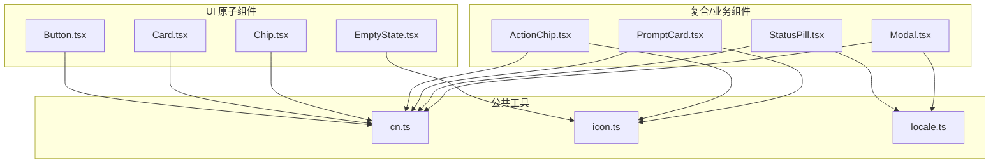
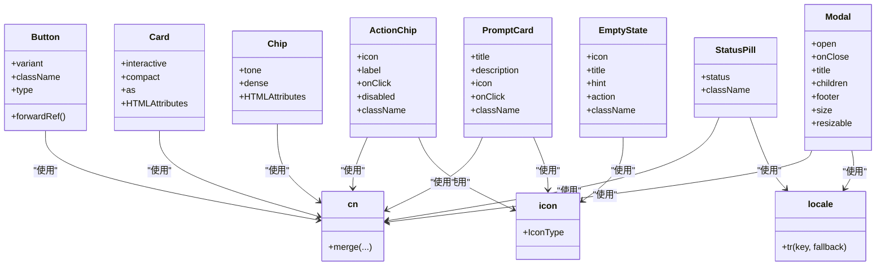
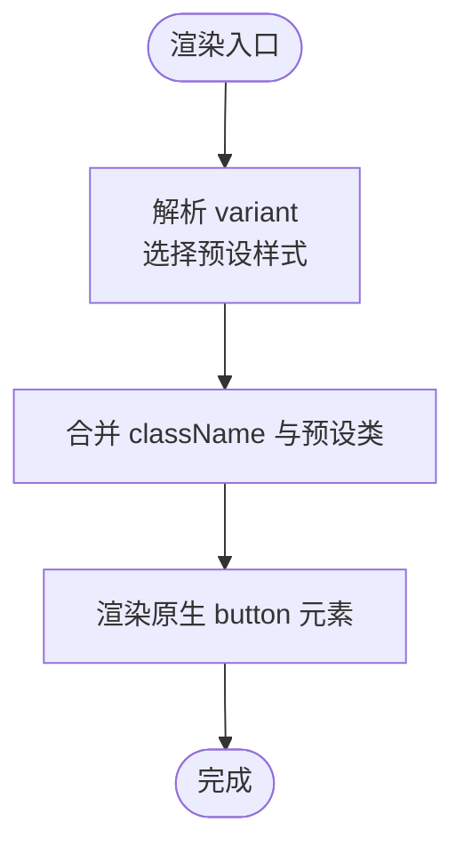
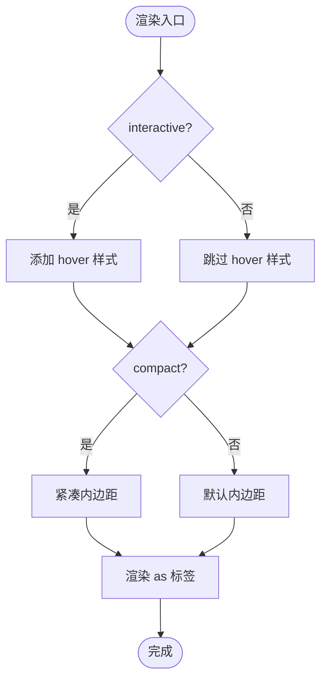
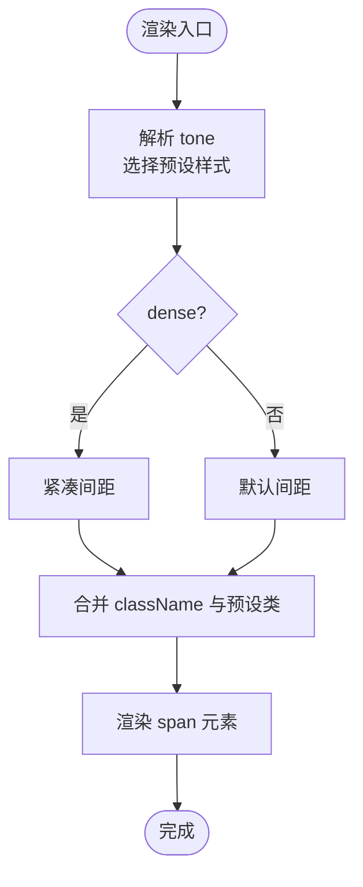
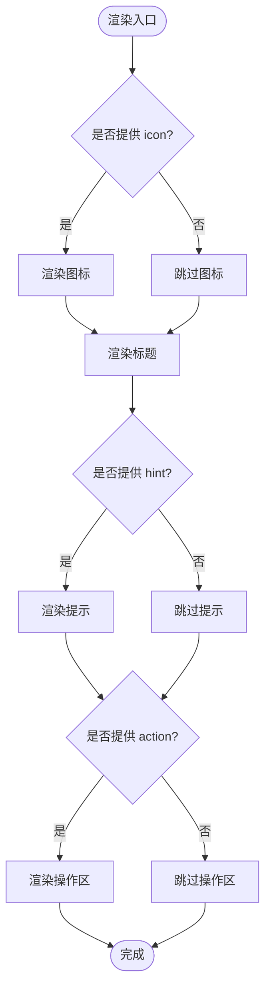
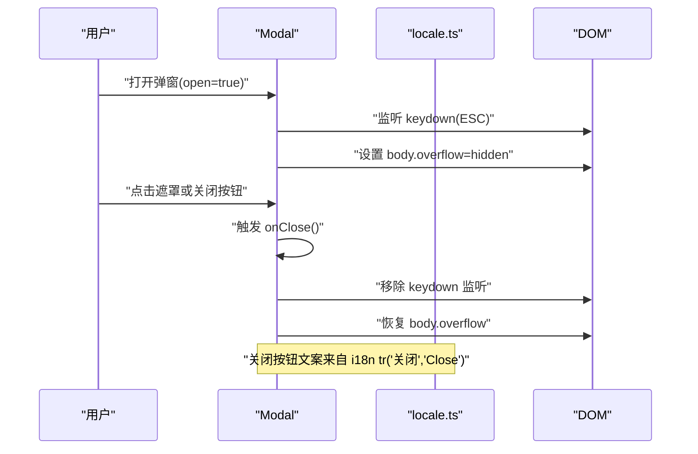
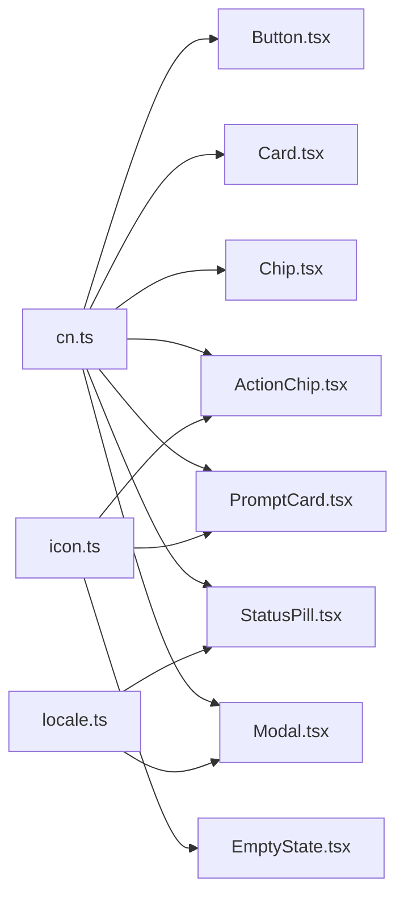

# 基础组件

<cite>
**本文引用的文件**   
- [Button.tsx](file://web/src/components/ui/Button.tsx)
- [Card.tsx](file://web/src/components/ui/Card.tsx)
- [Chip.tsx](file://web/src/components/ui/Chip.tsx)
- [EmptyState.tsx](file://web/src/components/ui/EmptyState.tsx)
- [ActionChip.tsx](file://web/src/components/ActionChip.tsx)
- [PromptCard.tsx](file://web/src/components/PromptCard.tsx)
- [StatusPill.tsx](file://web/src/components/StatusPill.tsx)
- [Modal.tsx](file://web/src/components/Modal.tsx)
- [cn.ts](file://web/src/lib/cn.ts)
- [icon.ts](file://web/src/lib/icon.ts)
- [locale.ts](file://web/src/i18n/locale.ts)
</cite>

## 目录
1. [简介](#简介)
2. [项目结构](#项目结构)
3. [核心组件](#核心组件)
4. [架构总览](#架构总览)
5. [详细组件分析](#详细组件分析)
6. [依赖分析](#依赖分析)
7. [性能考虑](#性能考虑)
8. [故障排查指南](#故障排查指南)
9. [结论](#结论)
10. [附录](#附录)

## 简介
本文件面向开发者，系统化梳理并文档化基础 UI 组件：Button、Card、Chip、EmptyState。同时补充与这些组件密切相关的 ActionChip、PromptCard、StatusPill、Modal 等辅助组件，帮助你在实际业务中组合使用、定制样式、实现可访问性与国际化适配，并提供测试策略与性能优化建议。

## 项目结构
基础组件位于 web 前端工程内，采用“按功能域组织”的方式：
- ui 子目录存放通用原子级组件（Button、Card、Chip、EmptyState）
- 根 components 目录放置业务相关或复合组件（如 ActionChip、PromptCard、StatusPill、Modal）
- 公共工具库包括 cn 类名合并、图标类型定义、i18n 文本桥接

图表来源
- [Button.tsx:1-43](file://web/src/components/ui/Button.tsx#L1-L43)
- [Card.tsx:1-36](file://web/src/components/ui/Card.tsx#L1-L36)
- [Chip.tsx:1-37](file://web/src/components/ui/Chip.tsx#L1-L37)
- [EmptyState.tsx:1-33](file://web/src/components/ui/EmptyState.tsx#L1-L33)
- [ActionChip.tsx:1-32](file://web/src/components/ActionChip.tsx#L1-L32)
- [PromptCard.tsx:1-34](file://web/src/components/PromptCard.tsx#L1-L34)
- [StatusPill.tsx:1-38](file://web/src/components/StatusPill.tsx#L1-L38)
- [Modal.tsx:1-133](file://web/src/components/Modal.tsx#L1-L133)
- [cn.ts](file://web/src/lib/cn.ts)
- [icon.ts](file://web/src/lib/icon.ts)
- [locale.ts](file://web/src/i18n/locale.ts)

章节来源
- [Button.tsx:1-43](file://web/src/components/ui/Button.tsx#L1-L43)
- [Card.tsx:1-36](file://web/src/components/ui/Card.tsx#L1-L36)
- [Chip.tsx:1-37](file://web/src/components/ui/Chip.tsx#L1-L37)
- [EmptyState.tsx:1-33](file://web/src/components/ui/EmptyState.tsx#L1-L33)
- [ActionChip.tsx:1-32](file://web/src/components/ActionChip.tsx#L1-L32)
- [PromptCard.tsx:1-34](file://web/src/components/PromptCard.tsx#L1-L34)
- [StatusPill.tsx:1-38](file://web/src/components/StatusPill.tsx#L1-L38)
- [Modal.tsx:1-133](file://web/src/components/Modal.tsx#L1-L133)
- [cn.ts](file://web/src/lib/cn.ts)
- [icon.ts](file://web/src/lib/icon.ts)
- [locale.ts](file://web/src/i18n/locale.ts)

## 核心组件
本节聚焦 Button、Card、Chip、EmptyState 四个基础组件的设计理念、Props、事件处理、样式定制与响应式行为。

- Button
  - 设计理念：提供 primary、ghost、danger、subtle 四种视觉变体，统一尺寸与过渡动效，确保按钮组一致性。
  - Props：variant、className、type 及原生 button 属性透传；支持 ref 转发。
  - 事件：透传所有原生事件（onClick、onKeyDown 等）。
  - 样式：通过 cn 合并 Tailwind 类名；disabled 态有透明度降级。
  - 可访问性：作为原生 button，具备默认键盘交互与语义。
  - 示例路径参考：[Button.tsx:1-43](file://web/src/components/ui/Button.tsx#L1-L43)

- Card
  - 设计理念：统一的卡片容器，支持 interactive 与 compact 两种模式，hover 反馈增强可感知性。
  - Props：interactive、compact、as（div/section/article）、className 及 HTMLAttributes。
  - 事件：透传所有 HTMLAttributes 事件。
  - 样式：圆角、边框、背景半透明；interactive 时 hover 加深边框与背景。
  - 可访问性：可通过 as 指定语义标签；配合 aria-* 使用。
  - 示例路径参考：[Card.tsx:1-36](file://web/src/components/ui/Card.tsx#L1-L36)

- Chip
  - 设计理念：轻量标签/元数据展示，tone 提供语义色（success/warning/danger/info/accent），dense 控制紧凑度。
  - Props：tone、dense、className 及 HTMLAttributes。
  - 事件：透传所有 HTMLAttributes 事件。
  - 样式：小字号、圆角、低饱和背景+高对比文字。
  - 可访问性：作为 span 展示信息，必要时可加 role="status" 或 aria-label。
  - 示例路径参考：[Chip.tsx:1-37](file://web/src/components/ui/Chip.tsx#L1-L37)

- EmptyState
  - 设计理念：列表为空时的占位提示，包含可选图标、标题、提示文案与操作区。
  - Props：icon、title、hint、action、className。
  - 事件：action 由调用方传入（通常为 Button 或链接）。
  - 样式：垂直居中、固定高度、层级化的字体大小与颜色。
  - 可访问性：标题与提示为普通文本，action 建议使用可聚焦元素。
  - 示例路径参考：[EmptyState.tsx:1-33](file://web/src/components/ui/EmptyState.tsx#L1-L33)

章节来源
- [Button.tsx:1-43](file://web/src/components/ui/Button.tsx#L1-L43)
- [Card.tsx:1-36](file://web/src/components/ui/Card.tsx#L1-L36)
- [Chip.tsx:1-37](file://web/src/components/ui/Chip.tsx#L1-L37)
- [EmptyState.tsx:1-33](file://web/src/components/ui/EmptyState.tsx#L1-L33)

## 架构总览
下图展示了基础组件与其依赖的公共工具之间的关系，以及与其他复合组件的组合方式。

图表来源
- [Button.tsx:1-43](file://web/src/components/ui/Button.tsx#L1-L43)
- [Card.tsx:1-36](file://web/src/components/ui/Card.tsx#L1-L36)
- [Chip.tsx:1-37](file://web/src/components/ui/Chip.tsx#L1-L37)
- [EmptyState.tsx:1-33](file://web/src/components/ui/EmptyState.tsx#L1-L33)
- [ActionChip.tsx:1-32](file://web/src/components/ActionChip.tsx#L1-L32)
- [PromptCard.tsx:1-34](file://web/src/components/PromptCard.tsx#L1-L34)
- [StatusPill.tsx:1-38](file://web/src/components/StatusPill.tsx#L1-L38)
- [Modal.tsx:1-133](file://web/src/components/Modal.tsx#L1-L133)
- [cn.ts](file://web/src/lib/cn.ts)
- [icon.ts](file://web/src/lib/icon.ts)
- [locale.ts](file://web/src/i18n/locale.ts)

## 详细组件分析

### Button 组件
- 设计要点
  - 变体：primary（主操作）、ghost（次要/刷新）、danger（危险操作）、subtle（弱化强调）。
  - 尺寸：固定 text-xs 与内边距，保证按钮组对齐一致。
  - 状态：disabled 自动降低不透明度。
- Props 说明
  - variant: 'primary' | 'ghost' | 'danger' | 'subtle'，默认 'ghost'
  - type: 透传原生 button type，默认 'button'
  - className: 自定义类名覆盖
  - 其他：透传所有 ButtonHTMLAttributes
- 事件处理
  - 支持 onClick、onKeyDown 等原生事件
- 样式定制
  - 通过 cn 合并 Tailwind 类名，推荐在 className 中追加覆盖
- 可访问性
  - 原生 button 自带焦点管理与语义
- 使用示例路径
  - [Button.tsx:1-43](file://web/src/components/ui/Button.tsx#L1-L43)

图表来源
- [Button.tsx:1-43](file://web/src/components/ui/Button.tsx#L1-L43)

章节来源
- [Button.tsx:1-43](file://web/src/components/ui/Button.tsx#L1-L43)

### Card 组件
- 设计要点
  - 统一卡片表面，支持 interactive 与 compact 两种模式
  - hover 时边框与背景加深，提升可点击暗示
- Props 说明
  - interactive: boolean，是否启用 hover 交互样式
  - compact: boolean，是否使用紧凑内边距
  - as: 'div' | 'section' | 'article'，语义标签
  - className: 自定义类名
  - 其他：透传所有 HTMLAttributes
- 事件处理
  - 透传所有 HTMLAttributes 事件
- 样式定制
  - 通过 cn 合并 Tailwind 类名
- 可访问性
  - 使用 as 指定语义标签；可结合 aria-* 描述
- 使用示例路径
  - [Card.tsx:1-36](file://web/src/components/ui/Card.tsx#L1-L36)

图表来源
- [Card.tsx:1-36](file://web/src/components/ui/Card.tsx#L1-L36)

章节来源
- [Card.tsx:1-36](file://web/src/components/ui/Card.tsx#L1-L36)

### Chip 组件
- 设计要点
  - 用于行内元数据（标签、角色、计数等）
  - tone 提供语义色，dense 控制紧凑度
- Props 说明
  - tone: 'default' | 'success' | 'warning' | 'danger' | 'info' | 'accent'，默认 'default'
  - dense: boolean，是否更紧凑
  - className: 自定义类名
  - 其他：透传所有 HTMLAttributes
- 事件处理
  - 透传所有 HTMLAttributes 事件
- 样式定制
  - 通过 cn 合并 Tailwind 类名
- 可访问性
  - 作为 span 展示信息，必要时增加 role 或 aria-label
- 使用示例路径
  - [Chip.tsx:1-37](file://web/src/components/ui/Chip.tsx#L1-L37)

图表来源
- [Chip.tsx:1-37](file://web/src/components/ui/Chip.tsx#L1-L37)

章节来源
- [Chip.tsx:1-37](file://web/src/components/ui/Chip.tsx#L1-L37)

### EmptyState 组件
- 设计要点
  - 垂直居中的空状态占位，支持可选图标、标题、提示与操作区
- Props 说明
  - icon: 图标组件类型
  - title: 必填标题
  - hint: 可选提示文案
  - action: 可选操作区（通常传入 Button）
  - className: 自定义类名
- 事件处理
  - 由 action 承载交互逻辑
- 样式定制
  - 默认固定高度与层级化排版，可在 className 中覆盖
- 可访问性
  - 标题与提示为普通文本；action 建议使用可聚焦元素
- 使用示例路径
  - [EmptyState.tsx:1-33](file://web/src/components/ui/EmptyState.tsx#L1-L33)

图表来源
- [EmptyState.tsx:1-33](file://web/src/components/ui/EmptyState.tsx#L1-L33)

章节来源
- [EmptyState.tsx:1-33](file://web/src/components/ui/EmptyState.tsx#L1-L33)

### 关联组件：ActionChip、PromptCard、StatusPill、Modal
- ActionChip
  - 带图标的可点击胶囊按钮，支持 disabled 与 aria-label
  - 示例路径：[ActionChip.tsx:1-32](file://web/src/components/ActionChip.tsx#L1-L32)
- PromptCard
  - 可点击卡片，含标题、描述与可选图标，hover 反馈
  - 示例路径：[PromptCard.tsx:1-34](file://web/src/components/PromptCard.tsx#L1-L34)
- StatusPill
  - 状态指示器，在线/离线/未知三种状态，内置 i18n 文本
  - 示例路径：[StatusPill.tsx:1-38](file://web/src/components/StatusPill.tsx#L1-L38)
- Modal
  - 对话框，支持 ESC 关闭、body 滚动锁定、可拖拽调宽、多尺寸
  - 示例路径：[Modal.tsx:1-133](file://web/src/components/Modal.tsx#L1-L133)

图表来源
- [Modal.tsx:1-133](file://web/src/components/Modal.tsx#L1-L133)
- [locale.ts](file://web/src/i18n/locale.ts)

章节来源
- [ActionChip.tsx:1-32](file://web/src/components/ActionChip.tsx#L1-L32)
- [PromptCard.tsx:1-34](file://web/src/components/PromptCard.tsx#L1-L34)
- [StatusPill.tsx:1-38](file://web/src/components/StatusPill.tsx#L1-L38)
- [Modal.tsx:1-133](file://web/src/components/Modal.tsx#L1-L133)

## 依赖分析
- 内部依赖
  - cn.ts：类名合并工具，被 Button、Card、Chip、ActionChip、PromptCard、StatusPill、Modal 广泛使用
  - icon.ts：图标类型定义，被 EmptyState、ActionChip、PromptCard 使用
  - locale.ts：i18n 文本桥接，被 StatusPill、Modal 使用
- 外部依赖
  - Tailwind CSS：样式系统
  - lucide-react：图标库（Modal 中使用 X 图标）

图表来源
- [cn.ts](file://web/src/lib/cn.ts)
- [icon.ts](file://web/src/lib/icon.ts)
- [locale.ts](file://web/src/i18n/locale.ts)
- [Button.tsx:1-43](file://web/src/components/ui/Button.tsx#L1-L43)
- [Card.tsx:1-36](file://web/src/components/ui/Card.tsx#L1-L36)
- [Chip.tsx:1-37](file://web/src/components/ui/Chip.tsx#L1-L37)
- [EmptyState.tsx:1-33](file://web/src/components/ui/EmptyState.tsx#L1-L33)
- [ActionChip.tsx:1-32](file://web/src/components/ActionChip.tsx#L1-L32)
- [PromptCard.tsx:1-34](file://web/src/components/PromptCard.tsx#L1-L34)
- [StatusPill.tsx:1-38](file://web/src/components/StatusPill.tsx#L1-L38)
- [Modal.tsx:1-133](file://web/src/components/Modal.tsx#L1-L133)

章节来源
- [cn.ts](file://web/src/lib/cn.ts)
- [icon.ts](file://web/src/lib/icon.ts)
- [locale.ts](file://web/src/i18n/locale.ts)
- [Button.tsx:1-43](file://web/src/components/ui/Button.tsx#L1-L43)
- [Card.tsx:1-36](file://web/src/components/ui/Card.tsx#L1-L36)
- [Chip.tsx:1-37](file://web/src/components/ui/Chip.tsx#L1-L37)
- [EmptyState.tsx:1-33](file://web/src/components/ui/EmptyState.tsx#L1-L33)
- [ActionChip.tsx:1-32](file://web/src/components/ActionChip.tsx#L1-L32)
- [PromptCard.tsx:1-34](file://web/src/components/PromptCard.tsx#L1-L34)
- [StatusPill.tsx:1-38](file://web/src/components/StatusPill.tsx#L1-L38)
- [Modal.tsx:1-133](file://web/src/components/Modal.tsx#L1-L133)

## 性能考虑
- 避免不必要的重渲染
  - 将事件处理器与复杂对象稳定化（useCallback/useMemo）以减少子组件更新
- 合理使用样式
  - 尽量复用预设变体与 tone，减少动态类名拼接带来的计算开销
- 大列表场景
  - 对大量 Chip/StatusPill 进行虚拟滚动或分页加载
- Modal 交互
  - 仅在 open 时挂载内容，避免隐藏状态下仍参与渲染
- 图标与资源
  - 按需引入图标，避免全局打包过多未用图标

## 故障排查指南
- 样式未生效
  - 检查 cn 是否正确合并类名；确认 Tailwind 配置已包含所需主题变量
- 可访问性问题
  - 确保可交互组件具备合适的 role/aria-*；Modal 需保持 aria-modal 与 ESC 关闭
- 国际化缺失
  - 检查 locale.ts 是否包含对应键值；确保 tr 调用参数正确
- 事件未触发
  - 确认事件冒泡未被阻止；检查父级是否拦截了 pointer/mouse 事件

章节来源
- [Modal.tsx:1-133](file://web/src/components/Modal.tsx#L1-L133)
- [StatusPill.tsx:1-38](file://web/src/components/StatusPill.tsx#L1-L38)
- [locale.ts](file://web/src/i18n/locale.ts)

## 结论
Button、Card、Chip、EmptyState 构成了一套简洁、一致且可扩展的基础 UI 体系。通过统一的样式策略（Tailwind + cn）、完善的 Props 设计与可访问性支持，它们能够灵活组合以满足多样化业务需求。配合 ActionChip、PromptCard、StatusPill、Modal 等复合组件，可快速构建高质量的前端界面。

## 附录
- 最佳实践
  - 优先使用预设变体与 tone，必要时通过 className 微调
  - 为可交互元素提供明确的 aria-label 与键盘可达性
  - 在长内容场景中优先使用 Modal 的可滚动区域与尺寸控制
- 扩展与自定义
  - 新增变体：在组件内维护映射表并在渲染时合并
  - 主题定制：基于 Tailwind 变量扩展颜色与尺寸
  - 国际化：封装 tr 调用，集中管理文案键值