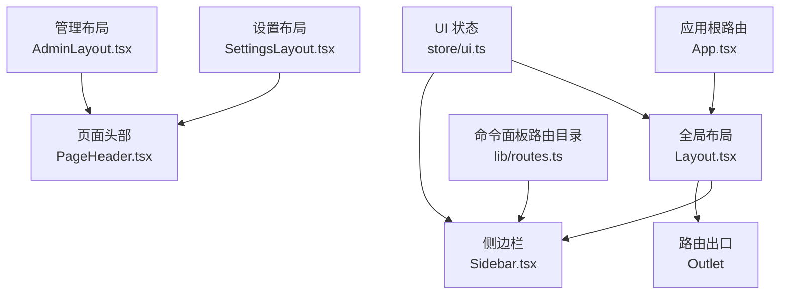
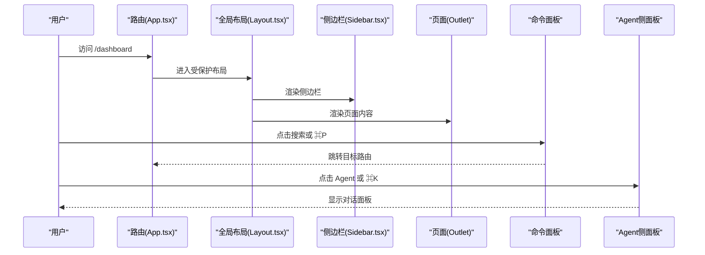
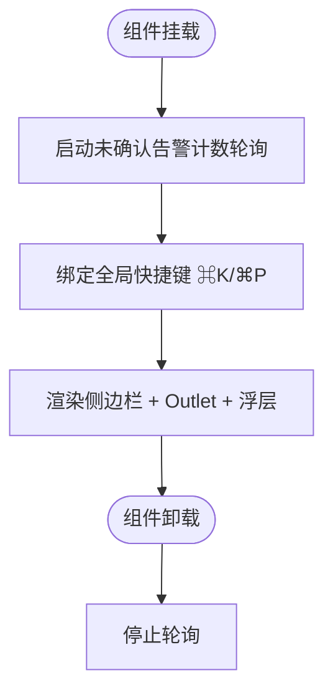
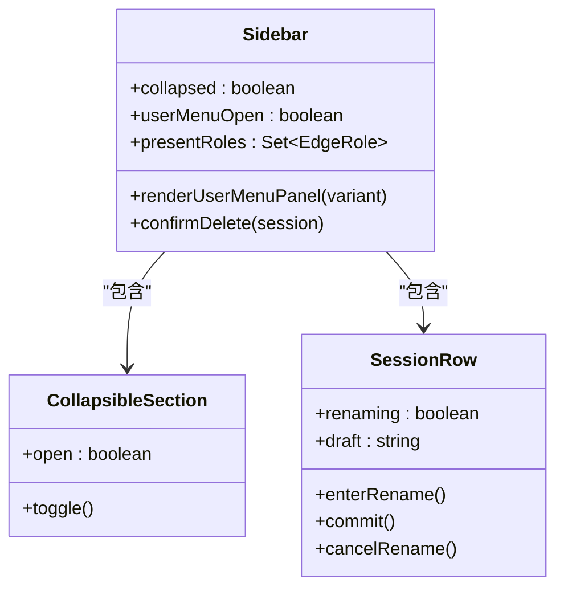
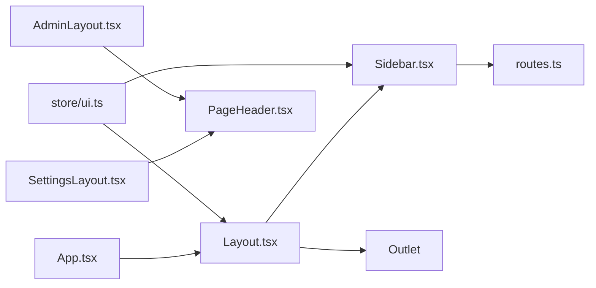

# 布局组件

<cite>
**本文引用的文件**   
- [Layout.tsx](file://web/src/components/Layout.tsx)
- [Sidebar.tsx](file://web/src/components/Sidebar.tsx)
- [PageHeader.tsx](file://web/src/components/ui/PageHeader.tsx)
- [AdminLayout.tsx](file://web/src/pages/AdminLayout.tsx)
- [SettingsLayout.tsx](file://web/src/pages/SettingsLayout.tsx)
- [App.tsx](file://web/src/App.tsx)
- [ui.ts](file://web/src/store/ui.ts)
- [routes.ts](file://web/src/lib/routes.ts)
</cite>

## 目录
1. [简介](#简介)
2. [项目结构](#项目结构)
3. [核心组件](#核心组件)
4. [架构总览](#架构总览)
5. [详细组件分析](#详细组件分析)
6. [依赖关系分析](#依赖关系分析)
7. [性能与可访问性](#性能与可访问性)
8. [主题定制与样式覆盖](#主题定制与样式覆盖)
9. [与路由系统集成](#与路由系统集成)
10. [常见问题排查](#常见问题排查)
11. [结论](#结论)

## 简介
本文件面向前端开发者，系统化梳理页面布局体系：包括全局布局容器、侧边栏导航、页面头部、设置与管理子布局等。重点说明各组件的职责边界、嵌套关系、响应式适配策略、快捷键与命令面板集成、以及主题与国际化支持。同时提供基于现有代码的“模板化”使用方式与最佳实践，帮助快速搭建复杂页面布局。

## 项目结构
布局相关的前端代码主要分布在以下位置：
- 全局布局与侧边栏：web/src/components/Layout.tsx、web/src/components/Sidebar.tsx
- 页面头部通用组件：web/src/components/ui/PageHeader.tsx
- 二级布局（设置/管理）：web/src/pages/SettingsLayout.tsx、web/src/pages/AdminLayout.tsx
- 路由入口与挂载点：web/src/App.tsx
- UI 状态（侧边栏折叠、命令面板、Agent 侧面板开关）：web/src/store/ui.ts
- 命令面板路由目录与模糊匹配：web/src/lib/routes.ts

图表来源
- [App.tsx:84-234](file://web/src/App.tsx#L84-L234)
- [Layout.tsx:1-70](file://web/src/components/Layout.tsx#L1-L70)
- [Sidebar.tsx:1-800](file://web/src/components/Sidebar.tsx#L1-L800)
- [SettingsLayout.tsx:1-189](file://web/src/pages/SettingsLayout.tsx#L1-L189)
- [AdminLayout.tsx:1-147](file://web/src/pages/AdminLayout.tsx#L1-L147)
- [PageHeader.tsx:1-41](file://web/src/components/ui/PageHeader.tsx#L1-L41)
- [ui.ts:1-39](file://web/src/store/ui.ts#L1-L39)
- [routes.ts:1-111](file://web/src/lib/routes.ts#L1-L111)

章节来源
- [App.tsx:84-234](file://web/src/App.tsx#L84-L234)
- [Layout.tsx:1-70](file://web/src/components/Layout.tsx#L1-L70)
- [Sidebar.tsx:1-800](file://web/src/components/Sidebar.tsx#L1-L800)
- [SettingsLayout.tsx:1-189](file://web/src/pages/SettingsLayout.tsx#L1-L189)
- [AdminLayout.tsx:1-147](file://web/src/pages/AdminLayout.tsx#L1-L147)
- [PageHeader.tsx:1-41](file://web/src/components/ui/PageHeader.tsx#L1-L41)
- [ui.ts:1-39](file://web/src/store/ui.ts#L1-L39)
- [routes.ts:1-111](file://web/src/lib/routes.ts#L1-L111)

## 核心组件
- 全局布局 Layout
  - 职责：承载全屏布局容器、侧边栏、主内容区（Outlet）、命令面板与 Agent 侧面板；注册全局快捷键；启动未确认告警计数轮询。
  - 关键行为：通过 Zustand store 控制侧边栏折叠、命令面板与 Agent 面板开关；Suspense 包裹 Outlet 以显示加载占位。
- 侧边栏 Sidebar
  - 职责：品牌标识、用户菜单、搜索入口（打开命令面板）、分组导航、会话列表、管理员入口等；支持展开/收起两种形态。
  - 关键行为：根据设备角色动态渲染设备子项；持久化分组折叠状态；展示未确认告警角标；语言与主题切换。
- 页面头部 PageHeader
  - 职责：统一页面标题行，支持副标题、右侧操作区、额外区域与前置信息槽位。
  - 适用场景：列表页、详情页顶部标题区。
- 设置布局 SettingsLayout
  - 职责：左侧 Rail 导航 + 右侧内容区的设置页骨架；权限校验与局部 Suspense 优化体验。
- 管理布局 AdminLayout
  - 职责：平台治理（用户/组织/审计）的 Rail 导航骨架；权限校验与空态提示。
- UI 状态 store/ui
  - 职责：集中管理侧边栏折叠、命令面板与 Agent 面板开关；仅持久化侧边栏折叠状态。
- 命令面板路由目录 routes.ts
  - 职责：集中维护应用内路由清单与模糊匹配评分算法，供命令面板检索。

章节来源
- [Layout.tsx:1-70](file://web/src/components/Layout.tsx#L1-L70)
- [Sidebar.tsx:1-800](file://web/src/components/Sidebar.tsx#L1-L800)
- [PageHeader.tsx:1-41](file://web/src/components/ui/PageHeader.tsx#L1-L41)
- [SettingsLayout.tsx:1-189](file://web/src/pages/SettingsLayout.tsx#L1-L189)
- [AdminLayout.tsx:1-147](file://web/src/pages/AdminLayout.tsx#L1-L147)
- [ui.ts:1-39](file://web/src/store/ui.ts#L1-L39)
- [routes.ts:1-111](file://web/src/lib/routes.ts#L1-L111)

## 架构总览
整体采用“全局布局 + 子布局 + 页面组件”的分层模式：
- 顶层 App 通过 React Router 定义路由树，受保护的节点包裹 RequireAuth，并挂载全局 Layout。
- Layout 负责全局 Shell（侧边栏、命令面板、Agent 面板），并通过 Outlet 渲染具体页面。
- 设置与管理模块各自拥有独立布局（SettingsLayout、AdminLayout），复用 PageHeader 与统一的栅格/滚动策略。
- 侧边栏与命令面板共享路由目录，保证导航一致性。

图表来源
- [App.tsx:84-234](file://web/src/App.tsx#L84-L234)
- [Layout.tsx:1-70](file://web/src/components/Layout.tsx#L1-L70)
- [Sidebar.tsx:1-800](file://web/src/components/Sidebar.tsx#L1-L800)
- [routes.ts:1-111](file://web/src/lib/routes.ts#L1-L111)

## 详细组件分析

### 全局布局 Layout
- 结构要点
  - 全屏 flex 容器，背景与文本颜色由 Tailwind 类控制。
  - 左侧 Sidebar，中间 Outlet 作为路由内容区，右侧悬浮命令面板与 Agent 面板。
  - 使用 Suspense 包裹 Outlet，提供轻量 Loading 占位。
- 交互与副作用
  - 首次挂载时启动未确认告警计数轮询，卸载时停止。
  - 全局键盘监听：⌘K 切换 Agent 面板，⌘P 打开命令面板。
- 数据流
  - 通过 useUi 读取/更新 paletteOpen、agentPanelOpen、sidebarCollapsed。
- 扩展建议
  - 如需新增全局浮层（如通知中心），可在同层级挂载，保持 z-index 层次清晰。

图表来源
- [Layout.tsx:1-70](file://web/src/components/Layout.tsx#L1-L70)
- [ui.ts:1-39](file://web/src/store/ui.ts#L1-L39)

章节来源
- [Layout.tsx:1-70](file://web/src/components/Layout.tsx#L1-L70)
- [ui.ts:1-39](file://web/src/store/ui.ts#L1-L39)

### 侧边栏 Sidebar
- 结构要点
  - 双形态：展开（宽列）与收起（图标条）。
  - 顶部品牌区、用户信息与菜单、搜索按钮（触发命令面板）、分组导航、会话列表、管理员入口。
- 导航与权限
  - 顶级入口与分组导航使用 NavLink 高亮当前路由。
  - 管理员专属入口仅在 isAdmin 为真时显示。
- 动态内容
  - 设备分组根据实际存在的 EdgeRole 动态渲染服务器/存储/数据库/网络等子项。
  - 会话列表支持重命名、删除，并在删除后自动跳转到默认聊天入口。
- 交互细节
  - 分组折叠状态持久化到 localStorage。
  - 未确认告警数量在“告警”项上以红点/角标呈现。
  - 用户菜单支持语言切换、主题切换、退出登录。
- 响应式
  - 收起模式下保留核心入口与用户头像，节省空间。

图表来源
- [Sidebar.tsx:1-800](file://web/src/components/Sidebar.tsx#L1-L800)

章节来源
- [Sidebar.tsx:1-800](file://web/src/components/Sidebar.tsx#L1-L800)

### 页面头部 PageHeader
- 属性
  - title：主标题（支持任意节点）
  - subtitle：副标题
  - actions：右侧操作区（刷新、新建等）
  - extra：标题行下方的附加区域（如筛选栏）
  - leading：标题上方的前置信息（如面包屑）
  - className：自定义类名
- 使用建议
  - 所有列表页/详情页顶部统一使用该组件，确保视觉一致性与可维护性。
  - 将高频操作放入 actions，低频或辅助信息放入 extra。

章节来源
- [PageHeader.tsx:1-41](file://web/src/components/ui/PageHeader.tsx#L1-L41)

### 设置布局 SettingsLayout
- 结构
  - 左侧 Rail 导航（移动端横向滚动，桌面端纵向列表）。
  - 右侧内容区，最大宽度限制，内部 Suspense 包裹 Outlet，避免整壳闪烁。
- 权限
  - 非管理员直接返回空态提示，避免渲染无意义的配置界面。
- 路由
  - 通过嵌套路由挂载多个设置子页（健康、升级、集成、LLM、凭证、通知、渠道、偏好、关于等）。

章节来源
- [SettingsLayout.tsx:1-189](file://web/src/pages/SettingsLayout.tsx#L1-L189)

### 管理布局 AdminLayout
- 结构
  - 与 SettingsLayout 类似，但聚焦平台治理（用户、组织、审计日志）。
  - 同样具备权限校验与局部 Suspense 优化。
- 路由
  - 通过嵌套路由挂载 admin/users、admin/orgs、admin/audit 等页面。

章节来源
- [AdminLayout.tsx:1-147](file://web/src/pages/AdminLayout.tsx#L1-L147)

### 命令面板与路由目录
- 路由目录
  - 集中维护应用内路由清单，包含路径、标签、关键词与分组。
  - 标签按当前语言动态解析，关键词支持拼音/同义词以提升模糊匹配效果。
- 匹配算法
  - 子序列匹配加分策略：连续匹配与词边界匹配得分更高，短结果优先。
- 集成点
  - 侧边栏搜索按钮与全局快捷键均可打开命令面板，统一走同一套路由目录与匹配逻辑。

章节来源
- [routes.ts:1-111](file://web/src/lib/routes.ts#L1-L111)
- [Sidebar.tsx:1-800](file://web/src/components/Sidebar.tsx#L1-L800)

## 依赖关系分析
- 组件耦合
  - Layout 依赖 Sidebar、CommandPalette、AgentSidePanel 与路由 Outlet。
  - Sidebar 依赖路由、i18n、主题、权限、会话与事件总线。
  - SettingsLayout/AdminLayout 复用 PageHeader 与统一的栅格/滚动策略。
- 外部依赖
  - React Router：路由与导航。
  - Zustand：UI 状态管理与持久化。
  - Tailwind CSS：原子化样式与响应式断点。
  - lucide-react：图标库。
- 潜在循环
  - 未发现循环依赖；路由目录与侧边栏解耦，避免引入完整侧边栏图。

图表来源
- [App.tsx:84-234](file://web/src/App.tsx#L84-L234)
- [Layout.tsx:1-70](file://web/src/components/Layout.tsx#L1-L70)
- [Sidebar.tsx:1-800](file://web/src/components/Sidebar.tsx#L1-L800)
- [SettingsLayout.tsx:1-189](file://web/src/pages/SettingsLayout.tsx#L1-L189)
- [AdminLayout.tsx:1-147](file://web/src/pages/AdminLayout.tsx#L1-L147)
- [PageHeader.tsx:1-41](file://web/src/components/ui/PageHeader.tsx#L1-L41)
- [ui.ts:1-39](file://web/src/store/ui.ts#L1-L39)
- [routes.ts:1-111](file://web/src/lib/routes.ts#L1-L111)

章节来源
- [App.tsx:84-234](file://web/src/App.tsx#L84-L234)
- [Layout.tsx:1-70](file://web/src/components/Layout.tsx#L1-L70)
- [Sidebar.tsx:1-800](file://web/src/components/Sidebar.tsx#L1-L800)
- [SettingsLayout.tsx:1-189](file://web/src/pages/SettingsLayout.tsx#L1-L189)
- [AdminLayout.tsx:1-147](file://web/src/pages/AdminLayout.tsx#L1-L147)
- [PageHeader.tsx:1-41](file://web/src/components/ui/PageHeader.tsx#L1-L41)
- [ui.ts:1-39](file://web/src/store/ui.ts#L1-L39)
- [routes.ts:1-111](file://web/src/lib/routes.ts#L1-L111)

## 性能与可访问性
- 性能
  - 懒加载：页面级组件通过 lazy 导入，减少首屏体积。
  - 局部 Suspense：设置/管理布局内部包裹 Suspense，避免整壳闪烁。
  - 轻量 Loading：全局 Loading 不使用 i18n Hook，避免首屏频繁订阅导致的闪烁。
- 可访问性
  - 侧边栏与用户菜单提供 aria-* 属性与键盘事件处理（Esc 关闭）。
  - 链接与按钮具备语义化 role 与 aria-label。
- 建议
  - 对长列表（如会话列表）考虑虚拟滚动。
  - 对图片/图标资源进行预加载与缓存策略优化。

[本节为通用指导，不直接分析具体文件]

## 主题定制与样式覆盖
- 主题切换
  - 侧边栏用户菜单支持系统/深色/浅色三种模式，切换即时生效。
- 样式基础
  - 使用 Tailwind 原子类构建布局与配色，暗色基调为主。
- 覆盖方案
  - 通过 className 向 PageHeader 传入自定义类名，调整间距、边框或背景。
  - 在应用级样式文件中追加 Tailwind 自定义变量或覆盖默认色板，实现品牌化。
- 注意事项
  - 避免在组件内硬编码颜色值，尽量使用设计令牌或 Tailwind 变量，便于全局替换。

章节来源
- [Sidebar.tsx:1-800](file://web/src/components/Sidebar.tsx#L1-L800)
- [PageHeader.tsx:1-41](file://web/src/components/ui/PageHeader.tsx#L1-L41)

## 与路由系统集成
- 路由挂载
  - App.tsx 中通过 Routes 定义路由树，受保护路由包裹 RequireAuth，并挂载 Layout。
  - 设置与管理模块使用嵌套路由，分别挂载各自的布局与叶子页面。
- 导航一致性
  - 侧边栏与命令面板共用 routes.ts 中的路由目录，保证导航与检索的一致性。
- 历史兼容
  - 多处旧路由通过 Navigate 重定向到新路径，保障书签与外链可用。
- 示例模板（基于现有代码的路径组织）
  - 在 Layout 下新增页面：在 App.tsx 中添加 Route path 与对应懒加载页面。
  - 在设置/管理中新增子页：在 SettingsLayout/AdminLayout 的嵌套路由中添加 path 与元素。
  - 在侧边栏添加入口：在 Sidebar 对应分组中添加导航项，并在 routes.ts 补充条目以便命令面板检索。

章节来源
- [App.tsx:84-234](file://web/src/App.tsx#L84-L234)
- [SettingsLayout.tsx:1-189](file://web/src/pages/SettingsLayout.tsx#L1-L189)
- [AdminLayout.tsx:1-147](file://web/src/pages/AdminLayout.tsx#L1-L147)
- [routes.ts:1-111](file://web/src/lib/routes.ts#L1-L111)
- [Sidebar.tsx:1-800](file://web/src/components/Sidebar.tsx#L1-L800)

## 常见问题排查
- 侧边栏折叠状态丢失
  - 检查 persist 配置是否启用，确认 name 与 storage 配置正确。
- 命令面板无法打开
  - 确认全局快捷键监听已绑定，且未在其他输入框中被 preventDefault 拦截。
- 设置/管理页空白
  - 检查权限判断分支，确认当前用户具备相应权限。
- 会话删除后仍停留在原页面
  - 确认删除成功后执行了路由跳转至默认聊天入口。
- 告警角标不更新
  - 确认全局布局已在挂载时启动轮询，且在卸载时停止。

章节来源
- [ui.ts:1-39](file://web/src/store/ui.ts#L1-L39)
- [Layout.tsx:1-70](file://web/src/components/Layout.tsx#L1-L70)
- [Sidebar.tsx:1-800](file://web/src/components/Sidebar.tsx#L1-L800)
- [SettingsLayout.tsx:1-189](file://web/src/pages/SettingsLayout.tsx#L1-L189)
- [AdminLayout.tsx:1-147](file://web/src/pages/AdminLayout.tsx#L1-L147)

## 结论
本项目布局体系以 Layout 为核心，结合 Sidebar、PageHeader 与二级布局（SettingsLayout、AdminLayout），形成清晰的分层与职责划分。通过集中化的路由目录与命令面板，实现了导航与检索的一致性；借助 Zustand 与 Suspense 提升了交互体验与性能。遵循本文档的结构与最佳实践，可高效扩展新的页面与布局变体，并保持风格与行为的一致。