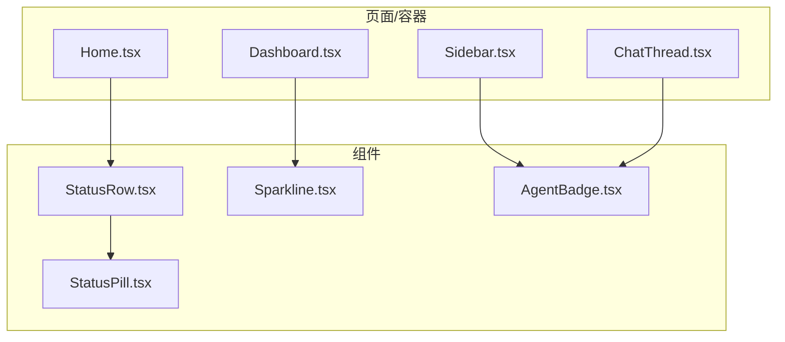
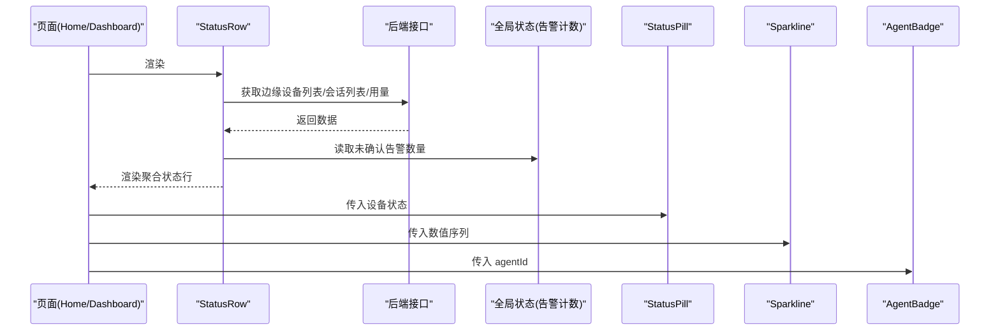
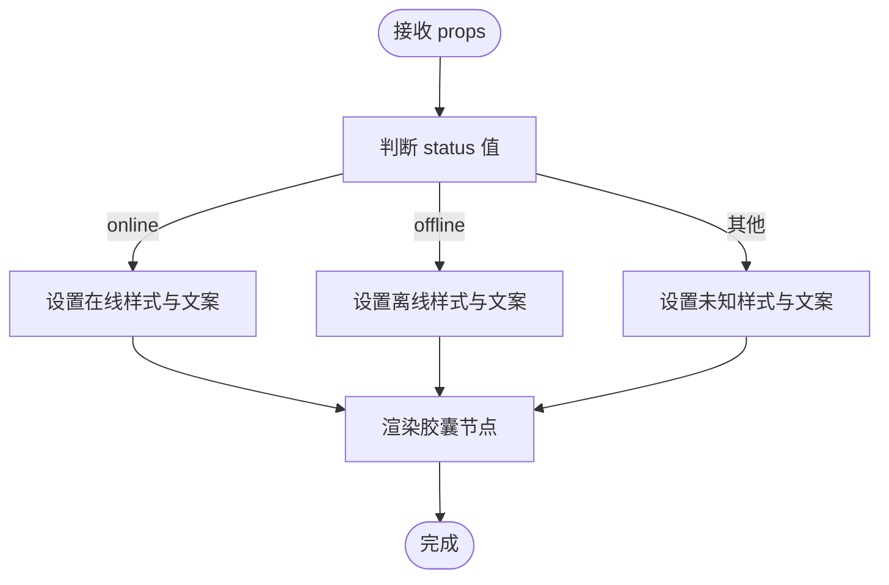
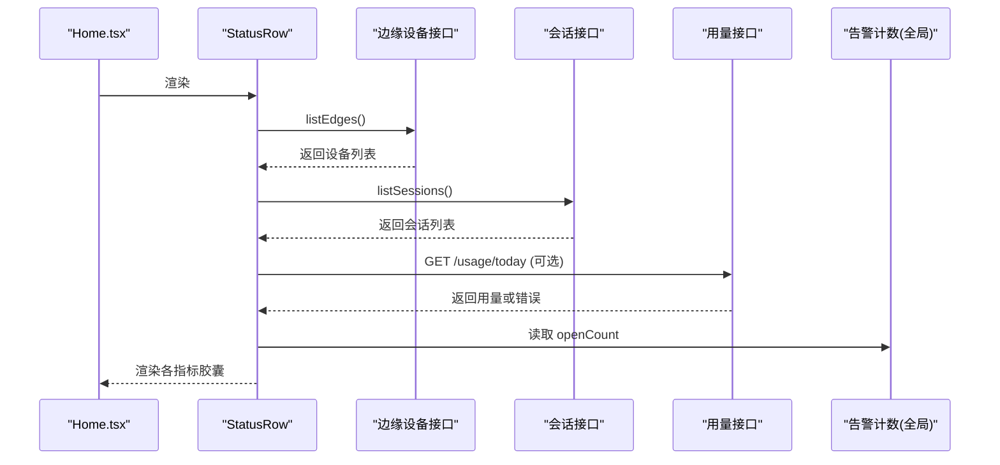
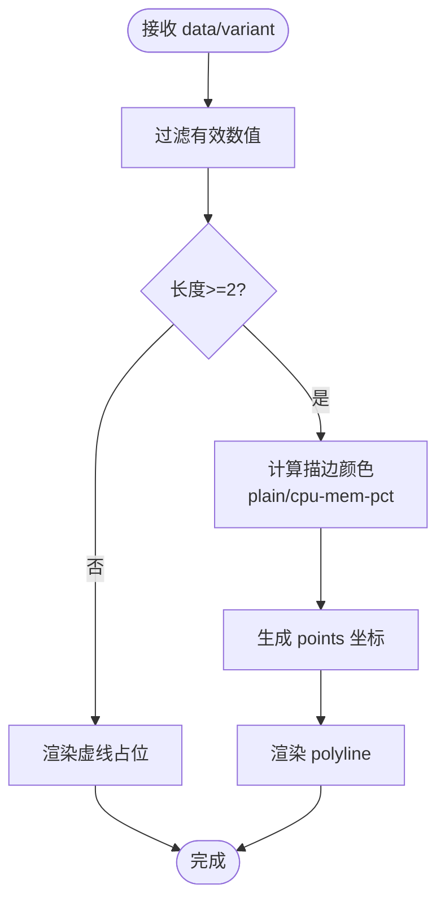
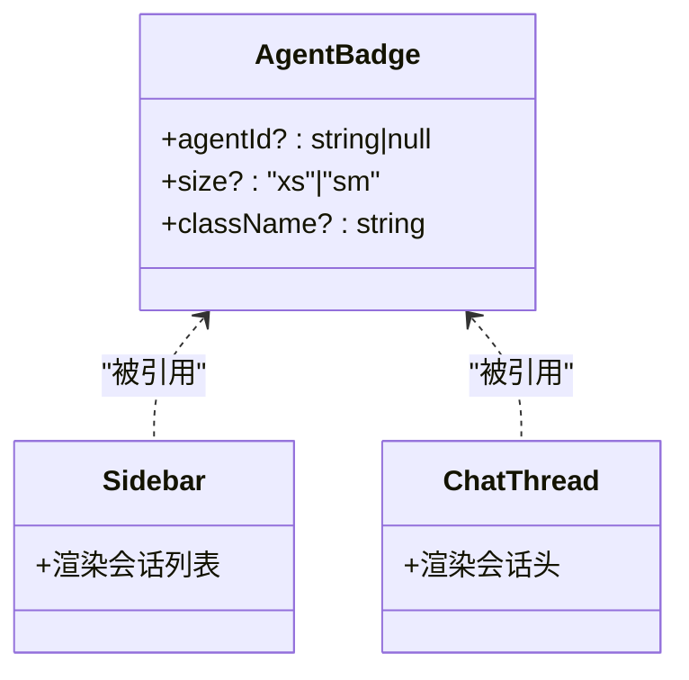
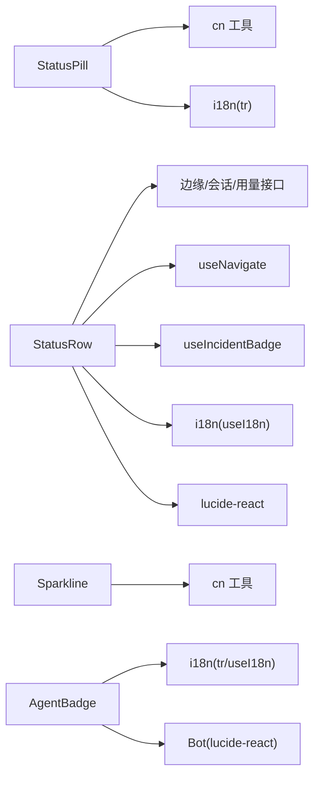

# 数据展示组件

<cite>
**本文引用的文件**   
- [StatusPill.tsx](file://web/src/components/StatusPill.tsx)
- [StatusRow.tsx](file://web/src/components/StatusRow.tsx)
- [Sparkline.tsx](file://web/src/components/Sparkline.tsx)
- [AgentBadge.tsx](file://web/src/components/AgentBadge.tsx)
- [Home.tsx](file://web/src/pages/Home.tsx)
- [Dashboard.tsx](file://web/src/pages/Dashboard.tsx)
- [Sidebar.tsx](file://web/src/components/Sidebar.tsx)
- [ChatThread.tsx](file://web/src/pages/ChatThread.tsx)
</cite>

## 目录
1. [简介](#简介)
2. [项目结构](#项目结构)
3. [核心组件](#核心组件)
4. [架构总览](#架构总览)
5. [详细组件分析](#详细组件分析)
6. [依赖关系分析](#依赖关系分析)
7. [性能考量](#性能考量)
8. [故障排查指南](#故障排查指南)
9. [结论](#结论)
10. [附录](#附录)

## 简介
本文件面向开发者，系统化梳理与数据可视化相关的四个前端组件：状态指示器 StatusPill、聚合状态行 StatusRow、轻量趋势图 Sparkline、以及会话角色标签 AgentBadge。文档覆盖设计目标、数据结构、渲染策略、实时更新机制、主题定制方案、大数据量优化策略，并提供复杂场景（表格、趋势图、实时指标）的集成示例与最佳实践。

## 项目结构
这些组件位于 web 前端源码中，分别承担“状态标签”、“聚合状态行”、“迷你折线图”和“角色徽章”的职责，并在多个页面中被复用。

图表来源
- [StatusPill.tsx:1-38](file://web/src/components/StatusPill.tsx#L1-L38)
- [StatusRow.tsx:1-248](file://web/src/components/StatusRow.tsx#L1-L248)
- [Sparkline.tsx:1-118](file://web/src/components/Sparkline.tsx#L1-L118)
- [AgentBadge.tsx:1-71](file://web/src/components/AgentBadge.tsx#L1-L71)
- [Home.tsx:21](file://web/src/pages/Home.tsx#L21)
- [Dashboard.tsx:15](file://web/src/pages/Dashboard.tsx#L15)
- [Sidebar.tsx:36](file://web/src/components/Sidebar.tsx#L36)
- [ChatThread.tsx:4](file://web/src/pages/ChatThread.tsx#L4)

章节来源
- [StatusPill.tsx:1-38](file://web/src/components/StatusPill.tsx#L1-L38)
- [StatusRow.tsx:1-248](file://web/src/components/StatusRow.tsx#L1-L248)
- [Sparkline.tsx:1-118](file://web/src/components/Sparkline.tsx#L1-L118)
- [AgentBadge.tsx:1-71](file://web/src/components/AgentBadge.tsx#L1-L71)
- [Home.tsx:21](file://web/src/pages/Home.tsx#L21)
- [Dashboard.tsx:15](file://web/src/pages/Dashboard.tsx#L15)
- [Sidebar.tsx:36](file://web/src/components/Sidebar.tsx#L36)
- [ChatThread.tsx:4](file://web/src/pages/ChatThread.tsx#L4)

## 核心组件
- StatusPill：用于显示设备或资源的在线/离线/未知状态，具备动画点与多语言文案。
- StatusRow：聚合展示在线设备数、离线设备数、未确认告警数、本周会话数、今日 token 用量等关键指标，支持定时刷新与错误降级。
- Sparkline：无坐标轴的轻量 SVG 折线图，适合在卡片或表格行内展示趋势，内置 CPU/内存百分比变体逻辑。
- AgentBadge：展示会话绑定的智能体角色，提供尺寸与国际化支持。

章节来源
- [StatusPill.tsx:1-38](file://web/src/components/StatusPill.tsx#L1-L38)
- [StatusRow.tsx:1-248](file://web/src/components/StatusRow.tsx#L1-L248)
- [Sparkline.tsx:1-118](file://web/src/components/Sparkline.tsx#L1-L118)
- [AgentBadge.tsx:1-71](file://web/src/components/AgentBadge.tsx#L1-L71)

## 架构总览
从调用方到组件的数据流向如下：页面负责拉取数据并传入 props；组件内部仅做格式化与渲染；对于需要实时更新的组件（如 StatusRow），通过定时器轮询接口并更新本地状态。

图表来源
- [StatusRow.tsx:65-121](file://web/src/components/StatusRow.tsx#L65-L121)
- [StatusPill.tsx:9-36](file://web/src/components/StatusPill.tsx#L9-L36)
- [Sparkline.tsx:26-117](file://web/src/components/Sparkline.tsx#L26-L117)
- [AgentBadge.tsx:41-70](file://web/src/components/AgentBadge.tsx#L41-L70)

## 详细组件分析

### StatusPill 状态胶囊
- 功能要点
  - 根据 status 值渲染“在线/离线/未知”三种视觉态，带圆点与边框环。
  - 在线态包含脉冲动画，增强实时感。
  - 使用 i18n 工具进行文案切换。
- 输入输出
  - 输入：status 字符串、可选 className。
  - 输出：一个可复用的状态胶囊节点。
- 样式与主题
  - 基于 Tailwind 语义化颜色类，适配暗色主题。
  - 可通过 className 覆盖默认样式。
- 复杂度与性能
  - 纯函数式渲染，无副作用，时间复杂度 O(1)。
- 使用建议
  - 适用于表格列、详情页头部、列表项右侧等位置。
  - 若需自定义文案或颜色，可在上层封装一层映射。

图表来源
- [StatusPill.tsx:9-36](file://web/src/components/StatusPill.tsx#L9-L36)

章节来源
- [StatusPill.tsx:1-38](file://web/src/components/StatusPill.tsx#L1-L38)

### StatusRow 聚合状态行
- 功能要点
  - 聚合展示：在线设备数、离线设备数、未确认告警数、本周会话数、今日 token 用量。
  - 定时轮询（约 30 秒）刷新数据，失败时降级为错误态或隐藏不可用模块。
  - 首次渲染提供骨架占位，避免布局抖动。
- 数据流
  - 拉取边缘设备列表，计算在线/离线数量。
  - 拉取会话列表，统计本周会话数。
  - 可选拉取今日用量接口，失败则隐藏该模块。
  - 从全局状态读取未确认告警数量。
- 交互
  - 点击对应胶囊跳转到相应页面（如 /edges、/alerts）。
- 复杂度与性能
  - 每次 tick 执行三次请求，注意网络抖动与节流；当前实现简单稳定。
  - 使用 useMemo/useEffect 控制副作用，避免重复订阅。
- 扩展性
  - 新增指标可按 PillState 模式扩展，保持统一渲染逻辑。

图表来源
- [StatusRow.tsx:65-121](file://web/src/components/StatusRow.tsx#L65-L121)
- [StatusRow.tsx:123-212](file://web/src/components/StatusRow.tsx#L123-L212)
- [Home.tsx:21](file://web/src/pages/Home.tsx#L21)

章节来源
- [StatusRow.tsx:1-248](file://web/src/components/StatusRow.tsx#L1-L248)
- [Home.tsx:21](file://web/src/pages/Home.tsx#L21)

### Sparkline 迷你折线图
- 功能要点
  - 无轴轻量 SVG 折线，适合 KPI 卡片与表格行内展示。
  - 支持两种变体：plain（中性色）与 cpu-mem-pct（按阈值与趋势着色）。
  - 自动清理无效数据（非数字、NaN、null/undefined）。
- 算法细节
  - 当 variant 为 cpu-mem-pct 且最大值 > 80 时，线条红色表示高负载。
  - 否则比较首尾四分位均值差，若显著上升则琥珀色提示上升趋势。
  - 点数不足 2 时渲染虚线占位。
- 复杂度与性能
  - 使用 useMemo 缓存清洗后的数据与描边样式，避免重复计算。
  - 纯 SVG 渲染，开销极低，适合大量实例同时存在。
- 使用建议
  - 在表格行内展示 CPU/内存/延迟等时序指标。
  - 结合父级组件的虚拟滚动或分页，进一步降低 DOM 压力。

图表来源
- [Sparkline.tsx:34-58](file://web/src/components/Sparkline.tsx#L34-L58)
- [Sparkline.tsx:60-117](file://web/src/components/Sparkline.tsx#L60-L117)

章节来源
- [Sparkline.tsx:1-118](file://web/src/components/Sparkline.tsx#L1-L118)
- [Dashboard.tsx:15](file://web/src/pages/Dashboard.tsx#L15)

### AgentBadge 角色徽章
- 功能要点
  - 将 agentId 映射为中文显示名，未知 id 回退到原始 id。
  - 固定 indigo 色系，区分“已绑定角色”的会话。
  - 提供 xs/sm 两种尺寸。
- 使用场景
  - 侧边栏会话列表、聊天线程头部、Agents 页面等。
- 国际化
  - 使用 i18n 工具进行文案切换，title 提供详细说明。

图表来源
- [AgentBadge.tsx:41-70](file://web/src/components/AgentBadge.tsx#L41-L70)
- [Sidebar.tsx:36](file://web/src/components/Sidebar.tsx#L36)
- [ChatThread.tsx:4](file://web/src/pages/ChatThread.tsx#L4)

章节来源
- [AgentBadge.tsx:1-71](file://web/src/components/AgentBadge.tsx#L1-L71)
- [Sidebar.tsx:36](file://web/src/components/Sidebar.tsx#L36)
- [ChatThread.tsx:4](file://web/src/pages/ChatThread.tsx#L4)

## 依赖关系分析
- 组件间耦合
  - StatusRow 组合了多个数据源与全局状态，属于“聚合型”组件；其内部还包含一个小型 Pill 按钮用于导航。
  - StatusPill、Sparkline、AgentBadge 均为“展示型”组件，低耦合、高内聚。
- 外部依赖
  - 图标库 lucide-react（在 StatusRow、AgentBadge 中使用）。
  - Tailwind CSS 语义化类（所有组件均依赖）。
  - i18n 工具 tr/useI18n（StatusPill、StatusRow、AgentBadge 使用）。
  - 路由 useNavigate（StatusRow 使用）。
  - 全局状态 useIncidentBadge（StatusRow 使用）。

图表来源
- [StatusPill.tsx:1-38](file://web/src/components/StatusPill.tsx#L1-L38)
- [StatusRow.tsx:1-248](file://web/src/components/StatusRow.tsx#L1-L248)
- [Sparkline.tsx:1-118](file://web/src/components/Sparkline.tsx#L1-L118)
- [AgentBadge.tsx:1-71](file://web/src/components/AgentBadge.tsx#L1-L71)

章节来源
- [StatusPill.tsx:1-38](file://web/src/components/StatusPill.tsx#L1-L38)
- [StatusRow.tsx:1-248](file://web/src/components/StatusRow.tsx#L1-L248)
- [Sparkline.tsx:1-118](file://web/src/components/Sparkline.tsx#L1-L118)
- [AgentBadge.tsx:1-71](file://web/src/components/AgentBadge.tsx#L1-L71)

## 性能考量
- 渲染成本
  - Sparkline 采用纯 SVG 与 useMemo 缓存，适合在表格行内大量复用。
  - StatusPill 与 AgentBadge 为极轻量的展示组件，几乎无额外开销。
- 更新频率
  - StatusRow 使用 setInterval 轮询，间隔约 30 秒；建议在弱网环境下考虑指数退避或合并请求。
- 大数据量策略
  - 表格+Sparkline：配合虚拟滚动（如 react-window）减少 DOM 节点数量。
  - 批量渲染：对长列表分片渲染或使用 requestIdleCallback。
  - 数据裁剪：仅在可视区域内加载最新 N 个点，历史数据按需懒加载。
- 样式与主题
  - 全部基于 Tailwind 语义化类，天然适配暗色主题；如需品牌色，可在外层包裹自定义 className 覆盖。

[本节为通用指导，不直接分析具体文件]

## 故障排查指南
- StatusRow 指标不更新
  - 检查网络请求是否成功，关注 edges/sessions/usage 三个接口的错误分支。
  - 确认定时器未被提前清理（组件卸载时会清除）。
- Sparkline 不显示曲线
  - 确认传入 data 至少包含两个有效数值；否则仅显示虚线占位。
  - 检查 variant 是否为 cpu-mem-pct 且数值范围合理。
- AgentBadge 不显示
  - 当 agentId 为空时不会渲染任何内容，这是预期行为。
- 主题不一致
  - 组件依赖 Tailwind 语义化类，确保构建链正确引入 tailwind.config 与样式入口。

章节来源
- [StatusRow.tsx:65-121](file://web/src/components/StatusRow.tsx#L65-L121)
- [Sparkline.tsx:60-81](file://web/src/components/Sparkline.tsx#L60-L81)
- [AgentBadge.tsx:51-53](file://web/src/components/AgentBadge.tsx#L51-L53)

## 结论
这四个组件构成了系统内高频使用的数据展示基础能力：状态指示、聚合概览、趋势可视化与角色标识。它们以“低耦合、高复用、易扩展”为原则，结合 i18n、Tailwind 与轻量 SVG，既满足日常监控需求，又具备良好的主题与性能扩展空间。

[本节为总结性内容，不直接分析具体文件]

## 附录

### 使用示例（路径指引）
- 在首页聚合状态行中使用 StatusRow：
  - [Home.tsx:21](file://web/src/pages/Home.tsx#L21)
- 在仪表盘卡片中使用 Sparkline：
  - [Dashboard.tsx:15](file://web/src/pages/Dashboard.tsx#L15)
- 在侧边栏会话列表与聊天线程中使用 AgentBadge：
  - [Sidebar.tsx:36](file://web/src/components/Sidebar.tsx#L36)
  - [ChatThread.tsx:4](file://web/src/pages/ChatThread.tsx#L4)

### 自定义开发指导
- 新增状态类型
  - 在 StatusPill 的上层维护状态到文案/颜色的映射表，避免修改组件本身。
- 新增指标
  - 在 StatusRow 中按 PillState 模式追加新的 pill 条目，遵循统一的 tone 与导航约定。
- 新增图表变体
  - 在 Sparkline 的 variant 分支中添加新规则，并确保 stroke 计算与无障碍属性保持一致。
- 新增角色
  - 在 AgentBadge 的中英文映射表中添加新 agentId 与显示名，保持 title 提示完整。

[本节为通用指导，不直接分析具体文件]