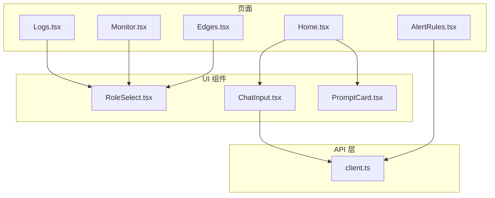
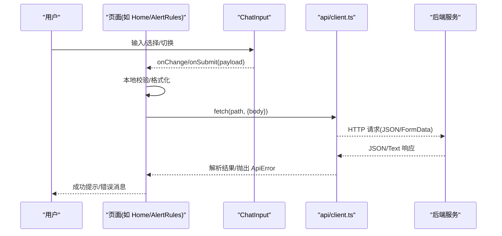
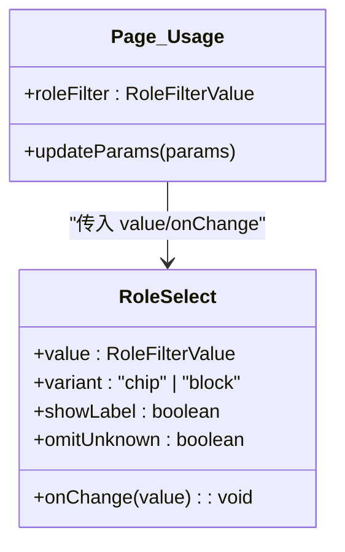
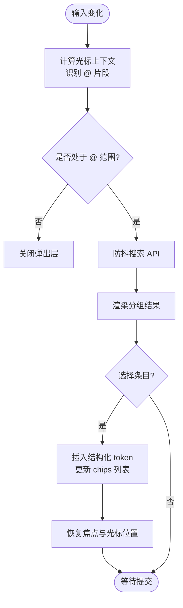
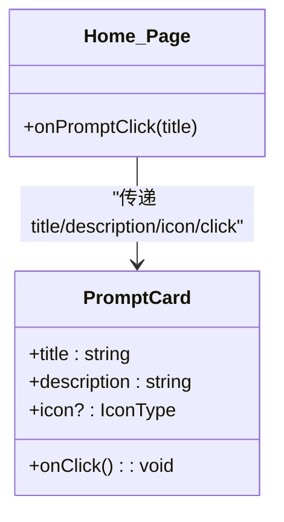
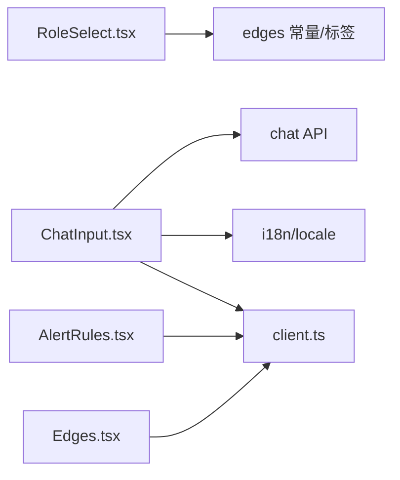

# 表单组件

<cite>
**本文引用的文件**   
- [ChatInput.tsx](file://web/src/components/ChatInput.tsx)
- [PromptCard.tsx](file://web/src/components/PromptCard.tsx)
- [RoleSelect.tsx](file://web/src/components/ui/RoleSelect.tsx)
- [index.ts](file://web/src/components/ui/index.ts)
- [client.ts](file://web/src/api/client.ts)
- [AlertRules.tsx](file://web/src/pages/AlertRules.tsx)
- [Home.tsx](file://web/src/pages/Home.tsx)
- [Logs.tsx](file://web/src/pages/Logs.tsx)
- [Monitor.tsx](file://web/src/pages/Monitor.tsx)
- [Edges.tsx](file://web/src/pages/Edges.tsx)
</cite>

## 目录
1. [简介](#简介)
2. [项目结构](#项目结构)
3. [核心组件](#核心组件)
4. [架构总览](#架构总览)
5. [详细组件分析](#详细组件分析)
6. [依赖关系分析](#依赖关系分析)
7. [性能与体验优化](#性能与体验优化)
8. [故障排查指南](#故障排查指南)
9. [结论](#结论)
10. [附录：开发规范与最佳实践](#附录开发规范与最佳实践)

## 简介
本文件聚焦于前端表单相关组件的设计与实现，围绕 RoleSelect、ChatInput、PromptCard 三个关键组件展开，系统阐述数据绑定、验证规则、错误处理机制，以及复杂表单场景（动态表单、条件显示、批量操作）的处理方式。同时给出组合使用与高级配置示例、提交与序列化方案、API 集成路径、可访问性与用户体验优化建议，并总结面向开发者的自定义表单组件规范与最佳实践。

## 项目结构
- 组件位于 web/src/components 与 web/src/components/ui 下，页面在 web/src/pages 中组合使用这些组件。
- API 封装集中在 web/src/api 下，统一负责请求头、鉴权、序列化与错误包装。
- 多语言文案通过 i18n 工具提供，所有用户可见文本均支持国际化。

图表来源
- [RoleSelect.tsx:1-87](file://web/src/components/ui/RoleSelect.tsx#L1-L87)
- [ChatInput.tsx:1-776](file://web/src/components/ChatInput.tsx#L1-L776)
- [PromptCard.tsx:1-34](file://web/src/components/PromptCard.tsx#L1-L34)
- [client.ts:43-80](file://web/src/api/client.ts#L43-L80)
- [Home.tsx:18-20](file://web/src/pages/Home.tsx#L18-L20)
- [Logs.tsx:21](file://web/src/pages/Logs.tsx#L21)
- [Monitor.tsx:24](file://web/src/pages/Monitor.tsx#L24)
- [AlertRules.tsx:678-760](file://web/src/pages/AlertRules.tsx#L678-L760)
- [Edges.tsx:1-34](file://web/src/pages/Edges.tsx#L1-L34)

章节来源
- [index.ts:1-10](file://web/src/components/ui/index.ts#L1-L10)

## 核心组件
- RoleSelect：用于按设备角色过滤的轻量下拉控件，支持“全部角色”和“未分类”两个合成选项，并提供 chip 与 block 两种布局变体。
- ChatInput：聊天输入框，支持 @ 提及搜索、模型选择、联网开关、自动高度增长、键盘导航与无障碍标签。
- PromptCard：提示卡片，作为快捷入口或引导项，点击触发上层动作。

章节来源
- [RoleSelect.tsx:1-87](file://web/src/components/ui/RoleSelect.tsx#L1-L87)
- [ChatInput.tsx:1-776](file://web/src/components/ChatInput.tsx#L1-L776)
- [PromptCard.tsx:1-34](file://web/src/components/PromptCard.tsx#L1-L34)

## 架构总览
表单数据流遵循“受控组件 + 页面状态管理 + API 调用 + 错误反馈”的模式：
- 页面维护表单状态（useState），将值与回调传递给子组件。
- 组件内部进行交互逻辑（如 @ 提及、键盘事件、动态渲染）。
- 提交时由页面执行校验、序列化为 API 所需结构，调用 api/client 发起请求。
- 错误通过 ApiError 包装并在 UI 展示。

图表来源
- [ChatInput.tsx:251-311](file://web/src/components/ChatInput.tsx#L251-L311)
- [client.ts:43-80](file://web/src/api/client.ts#L43-L80)
- [AlertRules.tsx:740-760](file://web/src/pages/AlertRules.tsx#L740-L760)

## 详细组件分析

### RoleSelect 组件
- 设计要点
  - 值域为联合类型，包含空串“全部角色”、字符串“unknown”表示“未分类”，以及枚举角色值。
  - 提供 chip 与 block 两种变体，适配工具栏与表单列布局。
  - 可选隐藏“未分类”选项，适用于下游查询无法表达“无角色”的场景。
- 数据绑定
  - 受控模式：value 与 onChange 由父页面传入，组件不持有内部状态。
- 验证与错误
  - 组件本身不做业务校验；上游页面根据 value 决定查询参数。
- 可访问性
  - 使用 label/select 语义化元素，便于屏幕阅读器识别。
- 使用示例
  - 在 Logs、Monitor 等页面作为筛选器使用。

图表来源
- [RoleSelect.tsx:21-86](file://web/src/components/ui/RoleSelect.tsx#L21-L86)
- [Logs.tsx:681](file://web/src/pages/Logs.tsx#L681)
- [Monitor.tsx:570](file://web/src/pages/Monitor.tsx#L570)

章节来源
- [RoleSelect.tsx:1-87](file://web/src/components/ui/RoleSelect.tsx#L1-L87)
- [index.ts:9](file://web/src/components/ui/index.ts#L9)
- [Logs.tsx:21](file://web/src/pages/Logs.tsx#L21)
- [Monitor.tsx:24](file://web/src/pages/Monitor.tsx#L24)

### ChatInput 组件
- 功能概览
  - 支持受控与非受控两种模式（controlled vs internal state）。
  - @ 提及：实时搜索平台对象（设备、事件、规则、日志文件），支持键盘导航与去重插入。
  - 模型选择：下拉列表展示可用模型，支持自动翻转避免遮挡。
  - 联网开关：控制是否向 LLM 暴露 web_search 技能。
  - 自动高度增长：根据内容自适应行高，限制最大行数。
  - 无障碍：为输入框、按钮、弹出列表设置 aria-* 属性。
- 数据绑定
  - value/onChange 双向绑定；当 controlled 未定义时使用内部状态。
  - 提交载荷 SubmitPayload 包含 text 与 mentions 结构化数组。
- 验证与错误
  - 提交前对空白内容进行短路；网络异常通过 api/client 抛出的 ApiError 向上冒泡。
- 复杂交互
  - 提及搜索防抖、滚动条点击检测避免误关闭弹出层、智能定位（上/下）弹出面板。
- 组合使用
  - 在 Home、ChatThread、Skills 等页面复用，配合页面级会话与模型选择状态。

图表来源
- [ChatInput.tsx:158-206](file://web/src/components/ChatInput.tsx#L158-L206)
- [ChatInput.tsx:221-245](file://web/src/components/ChatInput.tsx#L221-L245)
- [ChatInput.tsx:251-311](file://web/src/components/ChatInput.tsx#L251-L311)

章节来源
- [ChatInput.tsx:1-776](file://web/src/components/ChatInput.tsx#L1-L776)
- [Home.tsx:18-20](file://web/src/pages/Home.tsx#L18-L20)
- [Home.tsx:258](file://web/src/pages/Home.tsx#L258)
- [Home.tsx:307](file://web/src/pages/Home.tsx#L307)

### PromptCard 组件
- 设计要点
  - 纯展示型按钮卡片，承载标题、描述与图标，点击触发上层回调。
  - 常用于首页快捷入口或引导式任务。
- 数据绑定
  - 无内部状态，仅接收 props 与 onClick。
- 可访问性
  - 使用 button 语义与 aria-label，确保键盘与读屏可达。
- 组合使用
  - 在 Home 页面以网格形式呈现多个 PromptCard，点击后跳转到相应流程或预填充输入。

图表来源
- [PromptCard.tsx:12-33](file://web/src/components/PromptCard.tsx#L12-L33)
- [Home.tsx:307](file://web/src/pages/Home.tsx#L307)

章节来源
- [PromptCard.tsx:1-34](file://web/src/components/PromptCard.tsx#L1-L34)
- [Home.tsx:307](file://web/src/pages/Home.tsx#L307)

## 依赖关系分析
- RoleSelect 依赖 edges 模块的角色常量与标签映射，保证选项与后端一致。
- ChatInput 依赖 chat API 进行 @ 提及搜索与模型列表获取，依赖 i18n 提供多语言文案。
- 页面（如 AlertRules、Edges）组合 RoleSelect 与业务表单，完成动态字段与条件渲染。
- 所有 API 调用统一经 client.ts 处理，自动注入 Authorization 头、JSON 序列化与错误包装。

图表来源
- [RoleSelect.tsx:9-12](file://web/src/components/ui/RoleSelect.tsx#L9-L12)
- [ChatInput.tsx:27-33](file://web/src/components/ChatInput.tsx#L27-L33)
- [client.ts:43-80](file://web/src/api/client.ts#L43-L80)
- [AlertRules.tsx:740-760](file://web/src/pages/AlertRules.tsx#L740-L760)
- [Edges.tsx:1-34](file://web/src/pages/Edges.tsx#L1-L34)

章节来源
- [client.ts:43-80](file://web/src/api/client.ts#L43-L80)

## 性能与体验优化
- 输入与搜索
  - ChatInput 的 @ 搜索采用防抖，减少频繁请求；最大行数限制避免过度增长。
- 渲染与定位
  - 提及列表与模型下拉具备智能翻转，避免被视口边缘裁剪。
- 交互细节
  - 滚动条点击检测避免误关弹出层；Enter/Shift+Enter/Ctrl+Enter 行为明确，提升键盘效率。
- 可访问性
  - 为输入框、按钮、列表设置 aria-label、aria-expanded、aria-selected 等属性，增强读屏可用性。

[本节为通用指导，不直接分析具体文件]

## 故障排查指南
- 网络与鉴权
  - 检查 client.ts 是否正确注入 Authorization 头；确认 BASE 地址与路径拼接。
- 表单校验失败
  - 参考 AlertRules 中的本地校验逻辑（如 rule_key 正则、必填字段），在提交前尽早拦截。
- 错误展示
  - 捕获 ApiError 并转换为可读消息；对于非 JSON 响应，client.ts 会回退为文本。
- 状态不同步
  - 受控组件需确保 value 与 onChange 同步；非受控模式注意内部状态重置时机。

章节来源
- [client.ts:43-80](file://web/src/api/client.ts#L43-L80)
- [AlertRules.tsx:740-760](file://web/src/pages/AlertRules.tsx#L740-L760)

## 结论
RoleSelect、ChatInput、PromptCard 构成了平台内常用表单与交互的基础设施。它们遵循受控组件与清晰的数据流约定，结合统一的 API 封装与错误处理，能够在复杂场景中稳定工作。通过合理的验证、可访问性与性能优化，能够显著提升用户体验与可维护性。

[本节为总结，不直接分析具体文件]

## 附录：开发规范与最佳实践
- 数据绑定
  - 优先使用受控组件（value + onChange），保持单一数据源；必要时提供非受控模式但需明确生命周期。
- 验证规则
  - 前端做快速校验（格式、必填、范围），后端做权威校验；错误信息应可国际化且对用户友好。
- 错误处理
  - 统一通过 ApiError 包装；区分网络错误、业务错误与未知错误，提供重试与降级策略。
- 复杂表单
  - 动态字段：基于 kind/scope 等字段条件渲染；批量操作：提供全选/反选、批量删除/启用等能力。
- 组合与扩展
  - 将通用控件抽象为独立组件（如 RoleSelect），通过 props 暴露变体与行为；页面只关注业务编排。
- 可访问性
  - 使用原生语义元素（label、select、button、listbox）；为交互元素提供 aria-* 属性与键盘导航。
- 性能
  - 搜索防抖、虚拟列表（大数据量）、按需加载与缓存；避免不必要的重渲染。
- 提交与序列化
  - 使用 client.ts 统一序列化；对 FormData 与 JSON 分别处理；确保 Content-Type 正确。
- 测试与回归
  - 为关键交互编写单元测试与端到端用例；覆盖边界条件与错误分支。

[本节为通用指导，不直接分析具体文件]