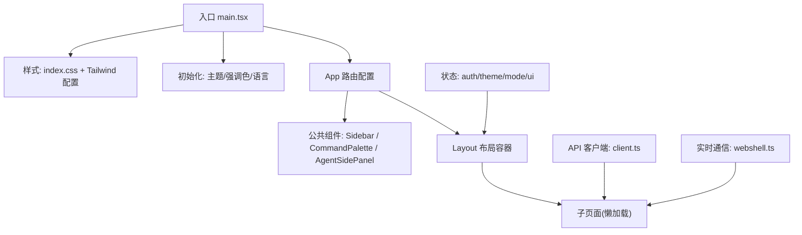
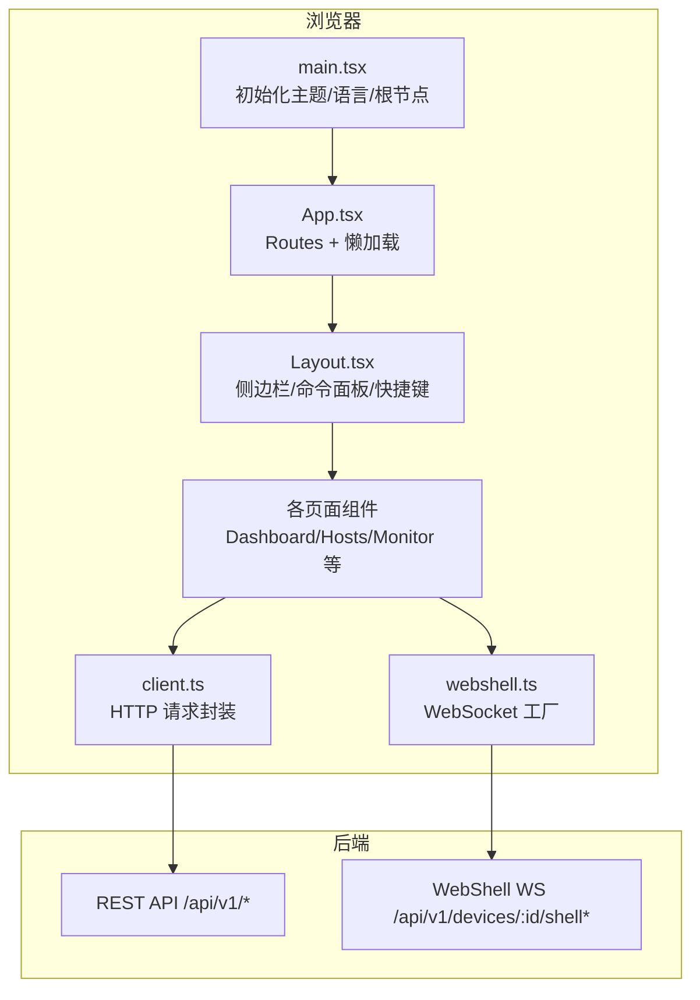
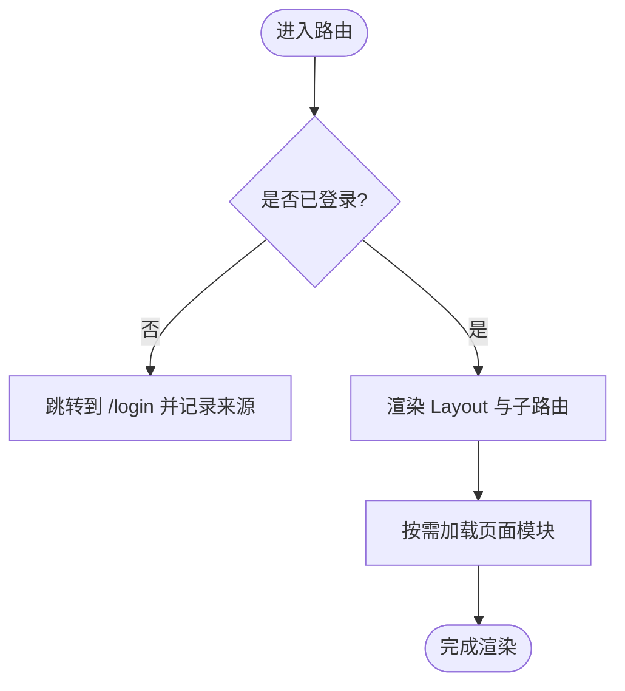
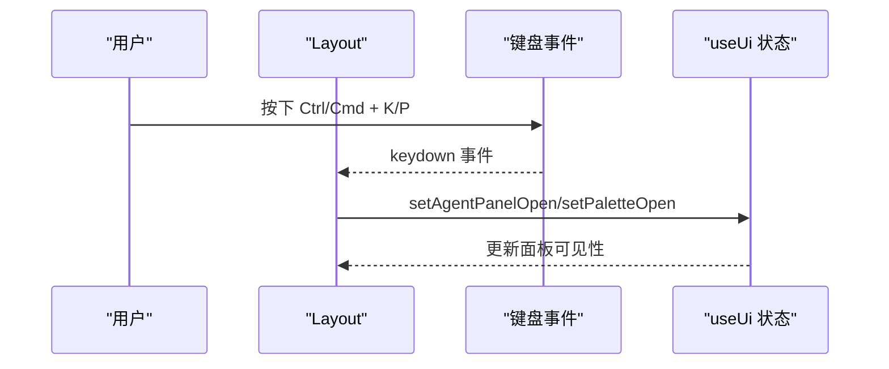
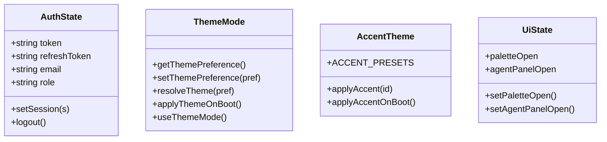
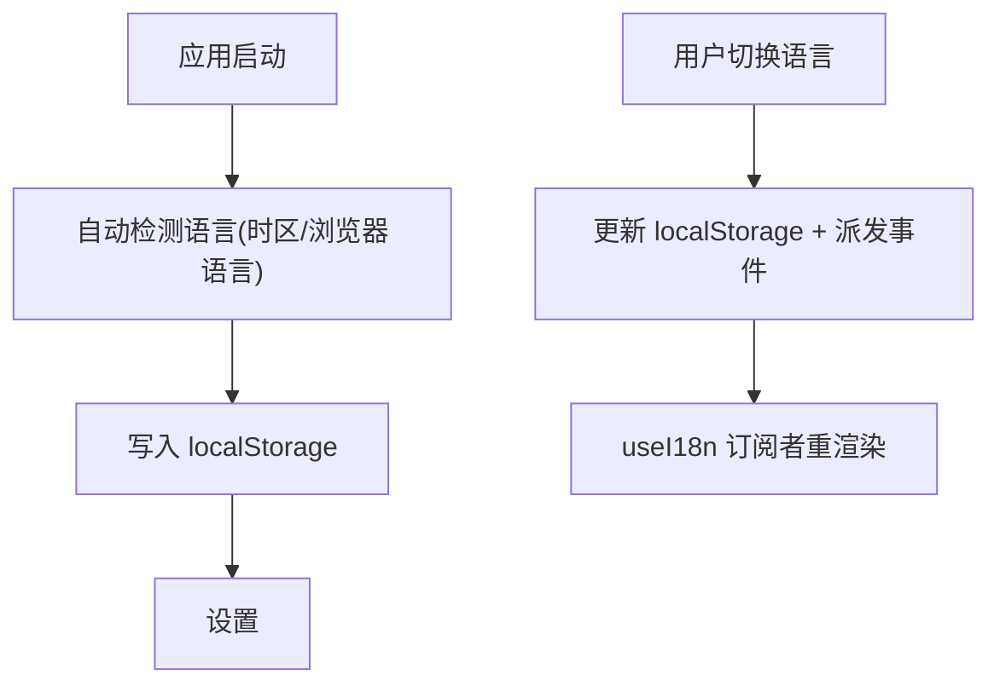
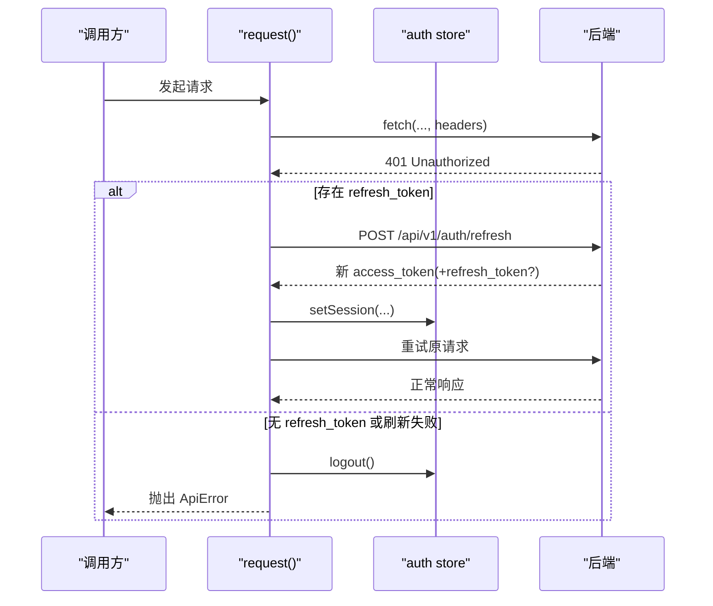
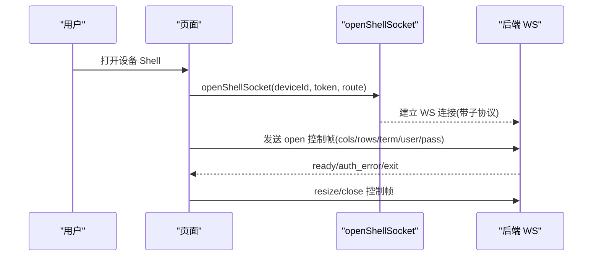
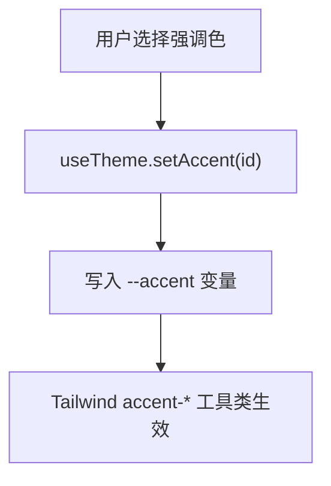
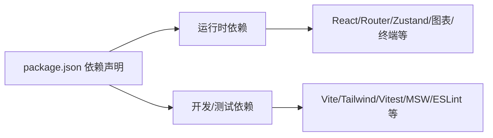

# 前端应用

<cite>
**本文引用的文件**
- [web/package.json](file://web/package.json)
- [web/src/main.tsx](file://web/src/main.tsx)
- [web/src/App.tsx](file://web/src/App.tsx)
- [web/src/components/Layout.tsx](file://web/src/components/Layout.tsx)
- [web/src/store/auth.ts](file://web/src/store/auth.ts)
- [web/src/store/theme.ts](file://web/src/store/theme.ts)
- [web/src/store/mode.ts](file://web/src/store/mode.ts)
- [web/src/i18n/locale.ts](file://web/src/i18n/locale.ts)
- [web/src/api/client.ts](file://web/src/api/client.ts)
- [web/src/api/webshell.ts](file://web/src/api/webshell.ts)
- [web/tailwind.config.ts](file://web/tailwind.config.ts)
</cite>

## 目录
1. [简介](#简介)
2. [项目结构](#项目结构)
3. [核心组件](#核心组件)
4. [架构总览](#架构总览)
5. [详细组件分析](#详细组件分析)
6. [依赖分析](#依赖分析)
7. [性能考虑](#性能考虑)
8. [故障排查指南](#故障排查指南)
9. [结论](#结论)
10. [附录](#附录)

## 简介
本文件面向前端开发者，系统化梳理基于 React 18 与 TypeScript 的前端工程：组件化模式、状态管理策略、页面路由设计、API 集成层与错误处理、UI 组件库与主题定制、国际化方案、实时通信（WebSocket）实现以及性能优化策略。文档同时提供开发规范与调试建议，帮助团队高效协作与维护。

## 项目结构
前端位于 web/ 目录，采用 Vite + React 18 + TypeScript 构建，使用 Tailwind CSS 进行样式与主题扩展，Zustand 作为全局状态管理，react-router-dom 负责路由，Vitest 与 MSW 用于测试与接口模拟。

图表来源
- [web/src/main.tsx:1-26](file://web/src/main.tsx#L1-L26)
- [web/src/App.tsx:1-234](file://web/src/App.tsx#L1-L234)
- [web/src/components/Layout.tsx:1-70](file://web/src/components/Layout.tsx#L1-L70)
- [web/tailwind.config.ts:1-43](file://web/tailwind.config.ts#L1-L43)

章节来源
- [web/package.json:1-53](file://web/package.json#L1-L53)
- [web/src/main.tsx:1-26](file://web/src/main.tsx#L1-L26)
- [web/src/App.tsx:1-234](file://web/src/App.tsx#L1-L234)
- [web/src/components/Layout.tsx:1-70](file://web/src/components/Layout.tsx#L1-L70)
- [web/tailwind.config.ts:1-43](file://web/tailwind.config.ts#L1-L43)

## 核心组件
- 应用入口与启动顺序
  - 在首次渲染前同步应用持久化的主题、强调色与语言，避免首屏闪烁。
  - 使用 BrowserRouter 包裹 App，启用基于浏览器的路由。
- 路由与权限控制
  - 通过 RequireAuth 与 PublicOnly 高阶组件保护受保护路由与公开路由。
  - 大量页面使用 lazy 动态导入，配合 Suspense 实现代码分割与按需加载。
- 布局与全局交互
  - Layout 承载侧边栏、命令面板、Agent 侧边栏，并注册全局快捷键（如打开命令面板）。
  - 在已认证挂载时自动开始未读事件计数轮询。
- 状态管理
  - 认证态：token、刷新令牌、用户角色与邮箱，支持持久化到 localStorage。
  - 主题与强调色：支持系统/明/暗三种模式与品牌强调色预设，均持久化。
  - UI 状态：命令面板、Agent 面板开关等。
- API 集成层
  - 统一 request 封装：自动注入 Accept-Language、Authorization；JSON/Form 数据序列化；网络异常包装为 ApiError。
  - 401 自动刷新：并发安全的 refreshAccessToken，失败则强制登出。
- 实时通信
  - WebShell WebSocket 工厂：根据当前协议选择 ws/wss，携带 token 查询参数，协商自定义子协议。
  - 预检机制：对 WS 路径发起 GET 探测，将升级阶段的 HTTP 状态转换为可展示的错误信息。

章节来源
- [web/src/main.tsx:1-26](file://web/src/main.tsx#L1-L26)
- [web/src/App.tsx:1-234](file://web/src/App.tsx#L1-L234)
- [web/src/components/Layout.tsx:1-70](file://web/src/components/Layout.tsx#L1-L70)
- [web/src/store/auth.ts:1-50](file://web/src/store/auth.ts#L1-L50)
- [web/src/store/theme.ts:1-98](file://web/src/store/theme.ts#L1-L98)
- [web/src/store/mode.ts:1-98](file://web/src/store/mode.ts#L1-L98)
- [web/src/i18n/locale.ts:1-102](file://web/src/i18n/locale.ts#L1-L102)
- [web/src/api/client.ts:1-163](file://web/src/api/client.ts#L1-L163)
- [web/src/api/webshell.ts:1-190](file://web/src/api/webshell.ts#L1-L190)

## 架构总览
下图展示了从浏览器到后端的关键链路：SPA 入口 → 路由与布局 → 业务页面 → API 客户端/WS 客户端 → 后端服务。

图表来源
- [web/src/main.tsx:1-26](file://web/src/main.tsx#L1-L26)
- [web/src/App.tsx:1-234](file://web/src/App.tsx#L1-L234)
- [web/src/components/Layout.tsx:1-70](file://web/src/components/Layout.tsx#L1-L70)
- [web/src/api/client.ts:1-163](file://web/src/api/client.ts#L1-L163)
- [web/src/api/webshell.ts:1-190](file://web/src/api/webshell.ts#L1-L190)

## 详细组件分析

### 路由与权限控制
- 路由组织
  - 登录页独立于布局；其余页面统一由 Layout 包裹。
  - 大量页面使用 lazy 动态导入，结合 Suspense 实现按路由拆分。
  - 旧路由重定向到新路径，保证书签兼容。
- 权限守卫
  - RequireAuth：无 token 跳转登录，保留来源路径。
  - PublicOnly：已登录访问登录页时重定向至首页。

图表来源
- [web/src/App.tsx:69-82](file://web/src/App.tsx#L69-L82)
- [web/src/App.tsx:84-234](file://web/src/App.tsx#L84-L234)

章节来源
- [web/src/App.tsx:1-234](file://web/src/App.tsx#L1-L234)

### 布局与全局交互
- 布局职责
  - 左侧导航、主内容区、顶部命令面板与 Agent 侧边栏。
  - 全局快捷键：Ctrl/Cmd+K 打开 Agent 面板，Ctrl/Cmd+P 打开命令面板。
  - 已认证后启动未读事件计数轮询，卸载时停止。
- 懒加载占位
  - 使用 Suspense fallback 显示“加载中”，避免首屏闪烁。

图表来源
- [web/src/components/Layout.tsx:1-70](file://web/src/components/Layout.tsx#L1-L70)

章节来源
- [web/src/components/Layout.tsx:1-70](file://web/src/components/Layout.tsx#L1-L70)

### 状态管理策略
- 认证状态（auth）
  - 字段：token、refreshToken、email、role。
  - 操作：setSession、logout。
  - 持久化：localStorage，键名 ongrid.auth。
- 主题偏好（mode）
  - 三档：system/light/dark，优先读取本地存储，其次匹配系统偏好。
  - 通过 data-theme 与 class 切换，兼容 Tailwind dark: 工具类。
  - 监听系统主题变化，保持 system 模式下的联动。
- 强调色（theme）
  - 预设强调色集合，写入 CSS 变量 --accent，供 Tailwind accent-* 使用。
  - 启动时直接读取 localStorage 提前写入，避免首帧闪白。
- UI 状态（ui）
  - 命令面板与 Agent 面板的开关状态。

图表来源
- [web/src/store/auth.ts:1-50](file://web/src/store/auth.ts#L1-L50)
- [web/src/store/mode.ts:1-98](file://web/src/store/mode.ts#L1-L98)
- [web/src/store/theme.ts:1-98](file://web/src/store/theme.ts#L1-L98)

章节来源
- [web/src/store/auth.ts:1-50](file://web/src/store/auth.ts#L1-L50)
- [web/src/store/mode.ts:1-98](file://web/src/store/mode.ts#L1-L98)
- [web/src/store/theme.ts:1-98](file://web/src/store/theme.ts#L1-L98)

### 国际化（i18n）
- 设计要点
  - 内联双语字符串 tr('中文', 'English')，零维护成本，便于检索缺失翻译。
  - 自动检测：优先以时区为主信号，其次浏览器语言；默认 zh-CN。
  - 切换后触发 window 事件，useI18n 订阅并重渲染。
  - 设置 document.documentElement.lang，辅助屏幕阅读器与浏览器断词。
- 使用方式
  - 非 React 路径使用 tr 函数；React 组件使用 useI18n 返回的 tr/toggleLocale。

图表来源
- [web/src/i18n/locale.ts:1-102](file://web/src/i18n/locale.ts#L1-L102)
- [web/src/main.tsx:10-14](file://web/src/main.tsx#L10-L14)

章节来源
- [web/src/i18n/locale.ts:1-102](file://web/src/i18n/locale.ts#L1-L102)
- [web/src/main.tsx:10-14](file://web/src/main.tsx#L10-L14)

### API 集成层与错误处理
- 请求封装
  - 自动注入 Accept-Language 与 Authorization（Bearer）。
  - 支持 FormData 与 JSON 两种载荷；URL 拼接基础路径。
  - 解析响应体：application/json 走 JSON，否则文本。
- 错误模型
  - ApiError 包含 status、code、payload，便于上层统一处理。
- 401 刷新流程
  - 并发安全：仅允许一次刷新请求，其他请求等待结果。
  - 刷新成功：更新 token 与可选的 refresh_token、role，重试原请求。
  - 刷新失败：调用 logout 强制登出。

图表来源
- [web/src/api/client.ts:1-163](file://web/src/api/client.ts#L1-L163)

章节来源
- [web/src/api/client.ts:1-163](file://web/src/api/client.ts#L1-L163)

### 实时通信（WebSocket）
- WebShell 连接
  - 自动推导 ws/wss；通过 ?token= 传递鉴权；协商子协议 ongrid.shell.v1。
  - 二进制流使用 arraybuffer；首帧发送 open 控制消息建立会话。
- 预检与错误提示
  - 对 WS 路径发起 GET 预检，获取 429/503/403 等状态码与文本消息，提升用户体验。
- 审计与终止
  - 列出与会话终止接口，供管理员查看与主动断开。

图表来源
- [web/src/api/webshell.ts:1-190](file://web/src/api/webshell.ts#L1-L190)

章节来源
- [web/src/api/webshell.ts:1-190](file://web/src/api/webshell.ts#L1-L190)

### UI 组件库与主题定制
- 主题系统
  - Tailwind 通过 CSS 变量映射颜色体系，支持透明值与 alpha 通道。
  - 强调色通过 --accent 变量驱动 accent/accent-fg 等工具类。
  - 深色模式通过 .dark/.light 与 data-theme 双轨兼容。
- 字体与动画
  - 扩展 sans/mono 字体族；定义轻量动画关键帧。
- 使用建议
  - 新增颜色应优先通过 CSS 变量注入，避免硬编码。
  - 强调色变更通过主题 store 的 setAccent 触发，无需组件级重渲染。

图表来源
- [web/src/store/theme.ts:57-98](file://web/src/store/theme.ts#L57-L98)
- [web/tailwind.config.ts:1-43](file://web/tailwind.config.ts#L1-L43)

章节来源
- [web/src/store/theme.ts:1-98](file://web/src/store/theme.ts#L1-L98)
- [web/tailwind.config.ts:1-43](file://web/tailwind.config.ts#L1-L43)

## 依赖分析
- 运行时依赖
  - React 18、react-dom、react-router-dom、zustand、recharts、@xyflow/react、xterm 系列、lucide-react、react-markdown 等。
- 开发与测试
  - Vite、TypeScript、ESLint、TailwindCSS、PostCSS、Autoprefixer、Vitest、MSW、jsdom、Testing Library。
- 构建脚本
  - dev/build/preview/lint/test/typecheck 等标准命令。

图表来源
- [web/package.json:1-53](file://web/package.json#L1-L53)

章节来源
- [web/package.json:1-53](file://web/package.json#L1-L53)

## 性能考虑
- 代码分割与懒加载
  - 路由级 lazy 加载，减少首屏体积；Suspense 提供加载占位。
- 缓存机制
  - 认证与主题偏好持久化到 localStorage，避免重复初始化与闪烁。
  - 可结合 Service Worker 或浏览器缓存策略对静态资源进行缓存（需额外配置）。
- 渲染优化
  - 使用 Zustand 细粒度订阅，避免不必要的全局重渲染。
  - 列表与大数据量场景建议使用虚拟滚动或分页加载。
- 网络优化
  - 合并请求、去抖/节流搜索输入、错误重试与退避策略。
  - 大文件上传使用分片与进度反馈。
- 监控与度量
  - 通过埋点与性能指标（FCP/LCP/CLS）持续评估优化效果。

[本节为通用指导，不直接分析具体文件]

## 故障排查指南
- 常见网络问题
  - 401 未授权：检查 token 是否存在且有效；确认刷新逻辑是否执行；必要时强制登出重新登录。
  - 跨域/代理：开发环境确保 Vite 代理正确；生产环境确认 Nginx 反向代理与 HTTPS/WSS 一致。
- WebSocket 连接失败
  - 预检失败：查看 probeShellPreflight 返回的状态码与消息，定位 429/503/403 原因。
  - 子协议不匹配：确认客户端与服务端子协议一致。
  - 证书与协议：HTTPS 页面必须使用 wss；自签证书需正确处理。
- 主题/语言异常
  - 首屏闪烁：确认 main.tsx 中在 createRoot 之前已应用主题与语言。
  - 语言未切换：检查 window 事件是否被正确订阅与分发。
- 调试技巧
  - 使用浏览器 Network 面板观察请求头（Authorization/Accept-Language）。
  - 使用 Console 打印 ApiError 的 code/payload 快速定位后端错误语义。
  - 使用 Vitest + MSW 模拟后端，隔离外部依赖进行单元测试。

章节来源
- [web/src/api/client.ts:1-163](file://web/src/api/client.ts#L1-L163)
- [web/src/api/webshell.ts:1-190](file://web/src/api/webshell.ts#L1-L190)
- [web/src/main.tsx:10-14](file://web/src/main.tsx#L10-L14)

## 结论
本项目采用清晰的模块化与分层设计：路由与布局解耦、状态管理集中且持久化、API 层统一封装与健壮的错误处理、WebSocket 能力完备并具备预检与审计能力。配合 Tailwind 主题系统与 i18n 内联方案，既保证了开发效率也兼顾了可维护性与用户体验。建议在后续迭代中继续完善性能监控与自动化测试覆盖，持续提升稳定性与交付质量。

## 附录
- 开发规范建议
  - 组件命名与目录：按功能域划分，页面与通用组件分离。
  - 类型优先：所有对外接口与状态使用明确的 TypeScript 类型。
  - 错误处理：统一使用 ApiError，并在 UI 层给出可操作的提示。
  - 国际化：新增文案一律使用 tr('中文', 'English')，避免遗漏英文。
  - 主题：新增颜色通过 CSS 变量注入，遵循 accent 与语义色约定。
  - 测试：关键逻辑编写单测，复杂交互使用 MSW 模拟后端。
- 常用命令
  - 开发：npm run dev
  - 构建：npm run build
  - 预览：npm run preview
  - 类型检查：npm run typecheck
  - 测试：npm run test / npm run test:watch
  - 代码检查：npm run lint

[本节为通用指导，不直接分析具体文件]