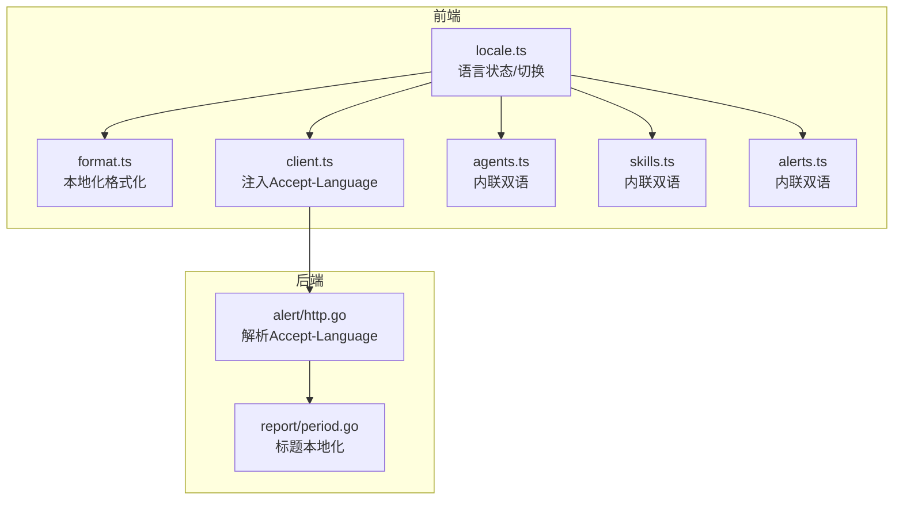
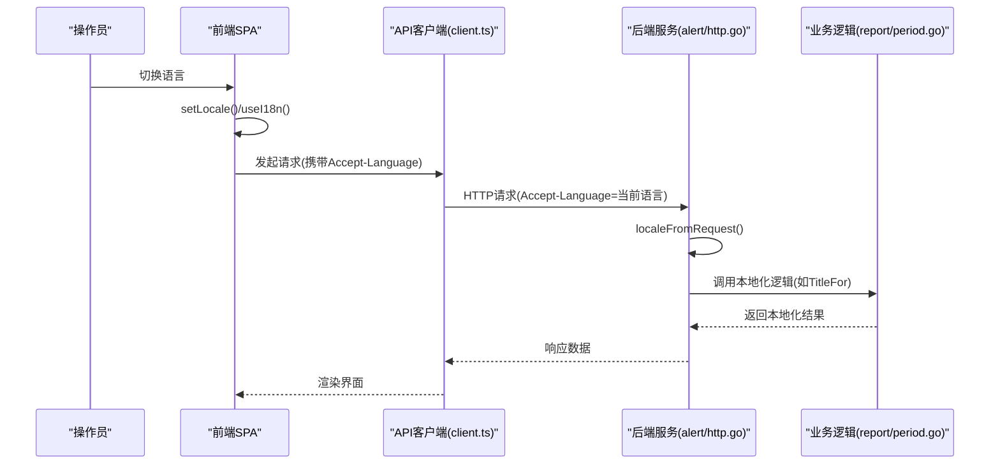
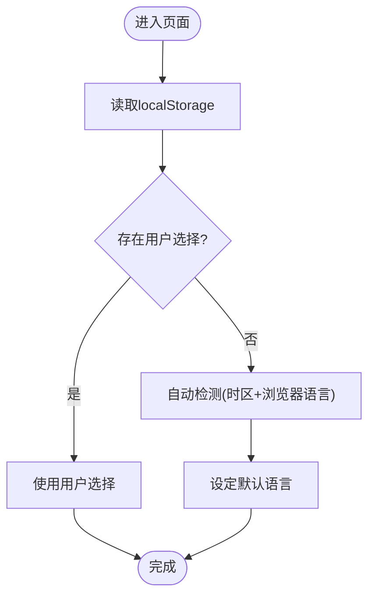
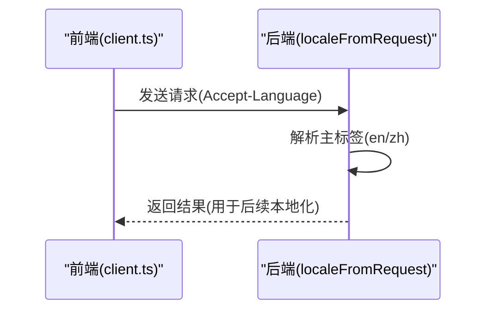
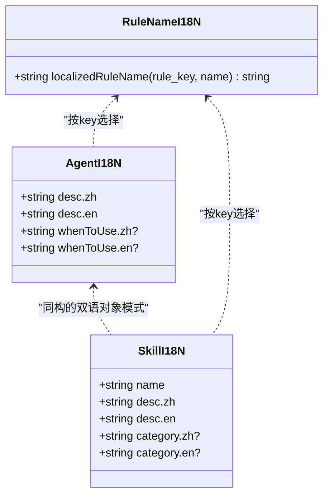
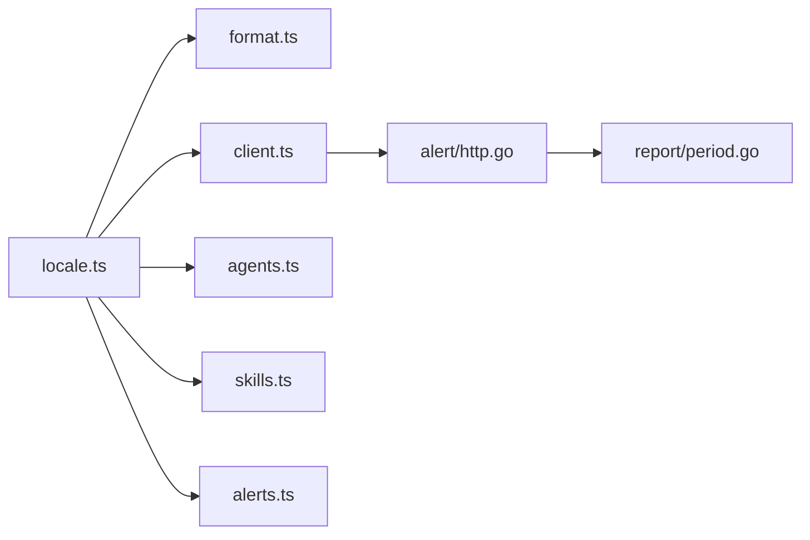

# 国际化支持

<cite>
**本文引用的文件**   
- [web/src/i18n/locale.ts](file://web/src/i18n/locale.ts)
- [web/src/lib/format.ts](file://web/src/lib/format.ts)
- [web/src/api/client.ts](file://web/src/api/client.ts)
- [internal/manager/server/alert/http.go](file://internal/manager/server/alert/http.go)
- [internal/manager/biz/report/period.go](file://internal/manager/biz/report/period.go)
- [web/src/api/agents.ts](file://web/src/api/agents.ts)
- [web/src/api/skills.ts](file://web/src/api/skills.ts)
- [web/src/api/alerts.ts](file://web/src/api/alerts.ts)
- [web/tailwind.config.ts](file://web/tailwind.config.ts)
- [web/src/styles/index.css](file://web/src/styles/index.css)
</cite>

## 目录
1. [简介](#简介)
2. [项目结构](#项目结构)
3. [核心组件](#核心组件)
4. [架构总览](#架构总览)
5. [详细组件分析](#详细组件分析)
6. [依赖关系分析](#依赖关系分析)
7. [性能与可维护性](#性能与可维护性)
8. [故障排查指南](#故障排查指南)
9. [结论](#结论)
10. [附录：新增语言集成步骤与翻译工作流](#附录新增语言集成步骤与翻译工作流)

## 简介
本文件系统化梳理前端与后端的国际化（i18n）实现，覆盖多语言切换机制、语言包组织与命名规范、本地化格式化（日期/时间/数字）、RTL 支持与字体适配方案，并给出新增语言的集成步骤与最佳实践。该项目的 i18n 采用“内联双语字符串 + 运行时选择”的模式，结合浏览器 API 进行本地化格式化，并通过 HTTP 头将用户偏好传递给后端，使 AI 生成内容与 UI 语言保持一致。

## 项目结构
- 前端
  - 语言状态与切换：位于 web/src/i18n/locale.ts，提供 getLocale/setLocale/useI18n/tr 等能力，使用 localStorage 持久化，并通过自定义事件驱动 React 重渲染。
  - 本地化格式化：位于 web/src/lib/format.ts，封装相对时间、完整时间、字节数、数字等格式化工具，统一映射到 Intl API。
  - API 客户端：位于 web/src/api/client.ts，在请求中注入 Accept-Language 头，用于后端识别操作员的 UI 语言。
  - 业务侧内联双语：如 agents、skills、alerts 等模块以键值对形式维护中英双语文案，按当前 locale 动态选择。
- 后端
  - 从请求解析语言：internal/manager/server/alert/http.go 中的 localeFromRequest 读取 Accept-Language，返回 en/zh 主标签。
  - 报告标题本地化：internal/manager/biz/report/period.go 根据传入 locale 拼接中文或英文标题片段。
- 样式与字体
  - Tailwind 配置定义 sans/mono 字体族；全局样式通过 html.lang 与主题类控制显示行为。

**图表来源** 
- [web/src/i18n/locale.ts:1-102](file://web/src/i18n/locale.ts#L1-L102)
- [web/src/lib/format.ts:1-64](file://web/src/lib/format.ts#L1-L64)
- [web/src/api/client.ts:1-46](file://web/src/api/client.ts#L1-L46)
- [internal/manager/server/alert/http.go:964-988](file://internal/manager/server/alert/http.go#L964-L988)
- [internal/manager/biz/report/period.go:72-101](file://internal/manager/biz/report/period.go#L72-L101)
- [web/src/api/agents.ts:39-62](file://web/src/api/agents.ts#L39-L62)
- [web/src/api/skills.ts:56-82](file://web/src/api/skills.ts#L56-L82)
- [web/src/api/alerts.ts:214-344](file://web/src/api/alerts.ts#L214-L344)

**章节来源**
- [web/src/i18n/locale.ts:1-102](file://web/src/i18n/locale.ts#L1-L102)
- [web/src/lib/format.ts:1-64](file://web/src/lib/format.ts#L1-L64)
- [web/src/api/client.ts:1-46](file://web/src/api/client.ts#L1-L46)
- [internal/manager/server/alert/http.go:964-988](file://internal/manager/server/alert/http.go#L964-L988)
- [internal/manager/biz/report/period.go:72-101](file://internal/manager/biz/report/period.go#L72-L101)
- [web/src/api/agents.ts:39-62](file://web/src/api/agents.ts#L39-L62)
- [web/src/api/skills.ts:56-82](file://web/src/api/skills.ts#L56-L82)
- [web/src/api/alerts.ts:214-344](file://web/src/api/alerts.ts#L214-L344)

## 核心组件
- 语言状态与切换
  - 获取当前语言：getLocale() 优先读取用户显式设置，否则基于时区与浏览器语言自动检测。
  - 设置语言：setLocale() 写入 localStorage，触发 window 自定义事件，并同步 <html lang>。
  - React Hook：useI18n() 订阅语言变化，提供 tr/toggleLocale/setLocale。
  - 非 React 路径：tr(zh, en) 直接返回对应语言文本。
- 本地化格式化
  - relativeTime/clockTime/fullDateTime/formatBytes/formatNumber 等工具函数统一调用 Intl API，依据应用语言而非系统语言输出。
- 前后端语言联动
  - 前端请求携带 Accept-Language，后端解析为 en/zh 主标签，用于 AI 输出与报告标题等。

**章节来源**
- [web/src/i18n/locale.ts:1-102](file://web/src/i18n/locale.ts#L1-L102)
- [web/src/lib/format.ts:1-64](file://web/src/lib/format.ts#L1-L64)
- [web/src/api/client.ts:1-46](file://web/src/api/client.ts#L1-L46)
- [internal/manager/server/alert/http.go:964-988](file://internal/manager/server/alert/http.go#L964-L988)

## 架构总览
下图展示一次带语言感知的典型请求流程：前端根据当前语言构造请求头，后端解析并用于生成内容。

**图表来源** 
- [web/src/api/client.ts:1-46](file://web/src/api/client.ts#L1-L46)
- [internal/manager/server/alert/http.go:964-988](file://internal/manager/server/alert/http.go#L964-L988)
- [internal/manager/biz/report/period.go:72-101](file://internal/manager/biz/report/period.go#L72-L101)

## 详细组件分析

### 语言状态与切换（locale.ts）
- 设计要点
  - 默认策略：首次访问根据时区与浏览器语言自动推断 zh-CN 或 en-US。
  - 持久化：localStorage 存储用户选择，优先级最高。
  - 响应式：通过 window 自定义事件通知 useI18n 消费者刷新。
  - 无障碍：同步 <html lang>，利于屏幕阅读器与连字符处理。
- 复杂度
  - 时间/空间均为 O(1)，无额外内存占用。
- 错误处理
  - 在非浏览器环境回退到 zh-CN，避免运行时报错。

**图表来源** 
- [web/src/i18n/locale.ts:1-102](file://web/src/i18n/locale.ts#L1-L102)

**章节来源**
- [web/src/i18n/locale.ts:1-102](file://web/src/i18n/locale.ts#L1-L102)

### 本地化格式化（format.ts）
- 设计要点
  - 统一映射应用语言到 Intl BCP-47 标签，确保英文用户在中文系统下仍获得英文日期格式。
  - 提供相对时间、时钟时间、完整时间、字节数、数字等常用格式化方法。
- 复杂度
  - 各函数均为 O(1)，仅涉及基础计算与 Intl 调用。
- 注意事项
  - 空值/非法输入统一返回占位符，避免异常。

**章节来源**
- [web/src/lib/format.ts:1-64](file://web/src/lib/format.ts#L1-L64)

### 前后端语言联动（client.ts + alert/http.go）
- 前端
  - 在请求头中注入 Accept-Language，值为当前语言（如 zh-CN/en-US）。
- 后端
  - 解析 Accept-Language，提取主标签 en/zh，忽略区域与权重。
  - 未设置或未知时返回空串，由上层默认语言兜底。

**图表来源** 
- [web/src/api/client.ts:1-46](file://web/src/api/client.ts#L1-L46)
- [internal/manager/server/alert/http.go:964-988](file://internal/manager/server/alert/http.go#L964-L988)

**章节来源**
- [web/src/api/client.ts:1-46](file://web/src/api/client.ts#L1-L46)
- [internal/manager/server/alert/http.go:964-988](file://internal/manager/server/alert/http.go#L964-L988)

### 内联双语文案组织（agents/skills/alerts）
- 组织方式
  - 以键值对象集中管理内置项的中英双语描述，键为技术标识（如 agent/skill key），值为包含 zh/en 的映射。
  - 名称字段保持英文（便于路由与 schema），描述/分类等可读字段按当前语言选择。
- 使用模式
  - 在渲染层根据当前语言选择对应文案，保证一致性。
- 命名规范建议
  - 键名使用小写下划线（如 host_bash），语义清晰且稳定。
  - 文案对象统一包含 zh/en 两个字段，缺失任一语言时应回退到英文。

**图表来源** 
- [web/src/api/agents.ts:39-62](file://web/src/api/agents.ts#L39-L62)
- [web/src/api/skills.ts:56-82](file://web/src/api/skills.ts#L56-L82)
- [web/src/api/alerts.ts:214-344](file://web/src/api/alerts.ts#L214-L344)

**章节来源**
- [web/src/api/agents.ts:39-62](file://web/src/api/agents.ts#L39-L62)
- [web/src/api/skills.ts:56-82](file://web/src/api/skills.ts#L56-L82)
- [web/src/api/alerts.ts:214-344](file://web/src/api/alerts.ts#L214-L344)

### 报告标题本地化（report/period.go）
- 设计要点
  - 根据传入 locale 决定中文或英文标题片段，日期部分保持 ISO 风格，避免歧义。
- 扩展性
  - 新增语言只需在 TitleFor 分支中添加新语言判断与文案。

**章节来源**
- [internal/manager/biz/report/period.go:72-101](file://internal/manager/biz/report/period.go#L72-L101)

### RTL 支持与字体适配
- RTL 支持
  - 当前代码库未发现针对 RTL 布局的专门实现。若需支持 RTL，可在语言切换时同步设置 document.documentElement.dir，并在样式中提供镜像布局规则。
- 字体适配
  - Tailwind 配置定义了 sans/mono 字体族，全局样式使用 theme('fontFamily.sans')。
  - 如需为特定语言加载专用字体，可通过动态插入 link 或在 CSS 中按 :lang 选择器切换 font-family。

**章节来源**
- [web/tailwind.config.ts:1-43](file://web/tailwind.config.ts#L1-L43)
- [web/src/styles/index.css:359-362](file://web/src/styles/index.css#L359-L362)

## 依赖关系分析
- 前端
  - locale.ts 被 format.ts、client.ts 及各业务模块引用，作为语言状态的唯一事实源。
  - client.ts 依赖 locale.ts 注入 Accept-Language。
  - format.ts 依赖 locale.ts 映射 Intl 标签。
- 后端
  - alert/http.go 解析 Accept-Language，供需要本地化的业务使用。
  - report/period.go 接收 locale 参数，执行本地化拼接。

**图表来源** 
- [web/src/i18n/locale.ts:1-102](file://web/src/i18n/locale.ts#L1-L102)
- [web/src/lib/format.ts:1-64](file://web/src/lib/format.ts#L1-L64)
- [web/src/api/client.ts:1-46](file://web/src/api/client.ts#L1-L46)
- [web/src/api/agents.ts:39-62](file://web/src/api/agents.ts#L39-L62)
- [web/src/api/skills.ts:56-82](file://web/src/api/skills.ts#L56-L82)
- [web/src/api/alerts.ts:214-344](file://web/src/api/alerts.ts#L214-L344)
- [internal/manager/server/alert/http.go:964-988](file://internal/manager/server/alert/http.go#L964-L988)
- [internal/manager/biz/report/period.go:72-101](file://internal/manager/biz/report/period.go#L72-L101)

**章节来源**
- [web/src/i18n/locale.ts:1-102](file://web/src/i18n/locale.ts#L1-L102)
- [web/src/lib/format.ts:1-64](file://web/src/lib/format.ts#L1-L64)
- [web/src/api/client.ts:1-46](file://web/src/api/client.ts#L1-L46)
- [web/src/api/agents.ts:39-62](file://web/src/api/agents.ts#L39-L62)
- [web/src/api/skills.ts:56-82](file://web/src/api/skills.ts#L56-L82)
- [web/src/api/alerts.ts:214-344](file://web/src/api/alerts.ts#L214-L344)
- [internal/manager/server/alert/http.go:964-988](file://internal/manager/server/alert/http.go#L964-L988)
- [internal/manager/biz/report/period.go:72-101](file://internal/manager/biz/report/period.go#L72-L101)

## 性能与可维护性
- 性能
  - 语言切换为 O(1) 操作，仅更新 localStorage 与触发一次事件。
  - 格式化函数均为轻量级，Intl 调用开销可控。
- 可维护性
  - 内联双语模式零维护成本，易于审查是否遗漏英文。
  - 建议在新增语言前评估内联模式的扩展性，必要时引入集中式字典与构建期校验。

[本节为通用指导，不直接分析具体文件]

## 故障排查指南
- 现象：切换语言后界面未刷新
  - 检查是否正确调用 setLocale 并触发自定义事件；确认 useI18n 已订阅事件。
- 现象：后端生成的内容语言与 UI 不一致
  - 确认前端请求是否携带 Accept-Language；检查后端 localeFromRequest 是否能正确解析。
- 现象：日期/数字格式不符合预期
  - 确认 format.ts 使用的 intlLocale 映射是否正确；检查浏览器是否支持相应 Intl 功能。
- 现象：新增语言后部分文案未生效
  - 检查内联双语对象是否补齐新语言字段；确认渲染层是否按新语言分支选择。

**章节来源**
- [web/src/i18n/locale.ts:1-102](file://web/src/i18n/locale.ts#L1-L102)
- [web/src/api/client.ts:1-46](file://web/src/api/client.ts#L1-L46)
- [internal/manager/server/alert/http.go:964-988](file://internal/manager/server/alert/http.go#L964-L988)
- [web/src/lib/format.ts:1-64](file://web/src/lib/format.ts#L1-L64)

## 结论
本项目采用简洁高效的“内联双语 + 运行时选择”的国际化方案，结合 Intl API 与 Accept-Language 头实现端到端的多语言体验。其优势在于低维护成本与高可追溯性；在扩展更多语言时，建议评估引入集中式字典与构建期校验以提升一致性与可测试性。

[本节为总结性内容，不直接分析具体文件]

## 附录：新增语言集成步骤与翻译工作流
- 前端
  - 在 locale.ts 中扩展 Locale 类型与自动检测逻辑（如新增 ja-JP）。
  - 在 format.ts 的 intlLocale 映射中增加新语言到 BCP-47 的映射。
  - 在各业务模块的内联双语对象中为新语言添加字段，并确保渲染层按新语言选择。
  - 可选：在 HTML 根节点根据语言设置 dir="rtl"（如适用）与 lang 属性。
- 后端
  - 在 alert/http.go 的 localeFromRequest 中增加对新语言主标签的识别。
  - 在 report/period.go 的 TitleFor 等业务逻辑中增加新语言分支。
- 字体与样式
  - 如需专用字体，可在 tailwind.config.ts 或 styles/index.css 中按 :lang 选择器切换字体族。
- 翻译工作流建议
  - 以键为单位维护双语/多语条目，新增语言时补齐所有键。
  - 建立自动化脚本扫描缺失条目，防止遗漏。
  - 在 PR 中要求至少两种语言对照审阅，确保术语一致。

[本节为通用指导，不直接分析具体文件]