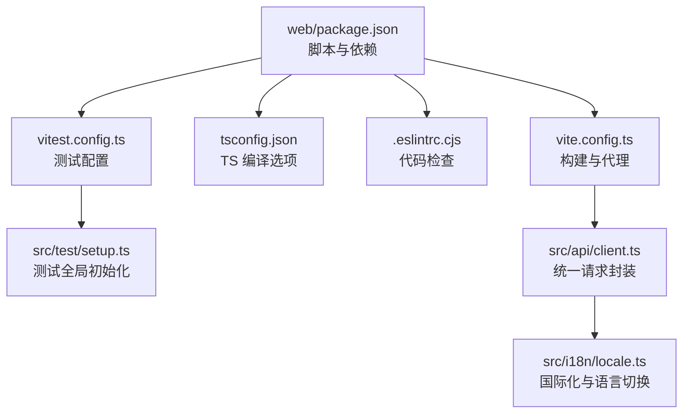
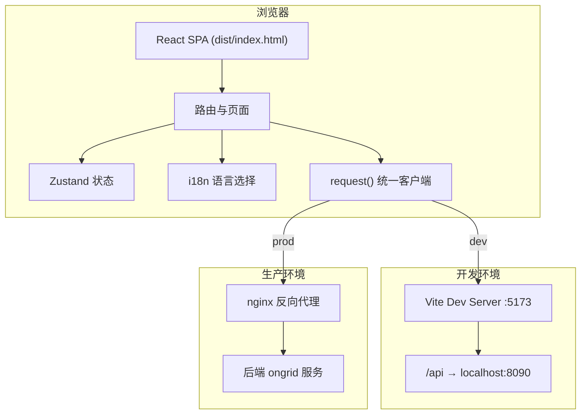
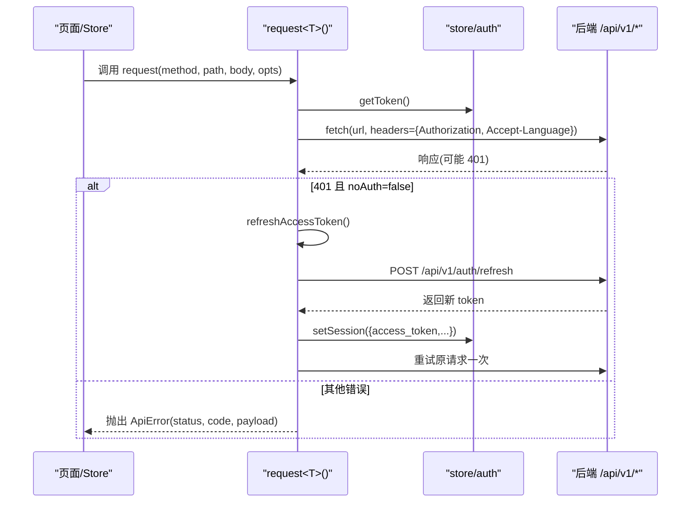
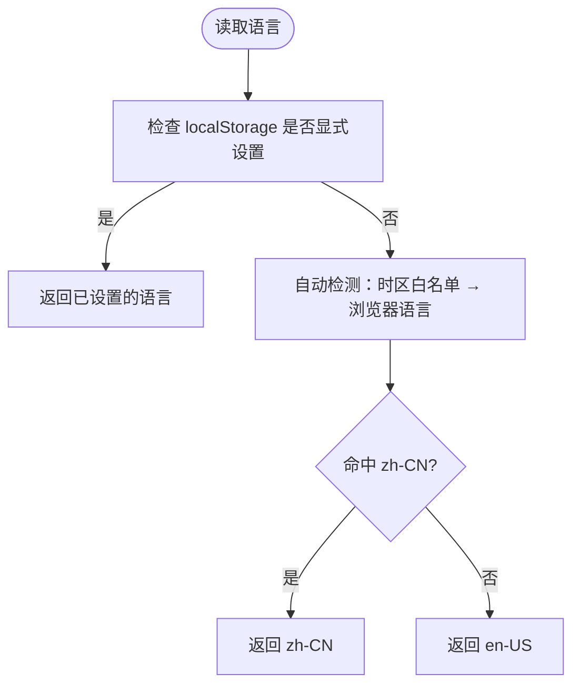
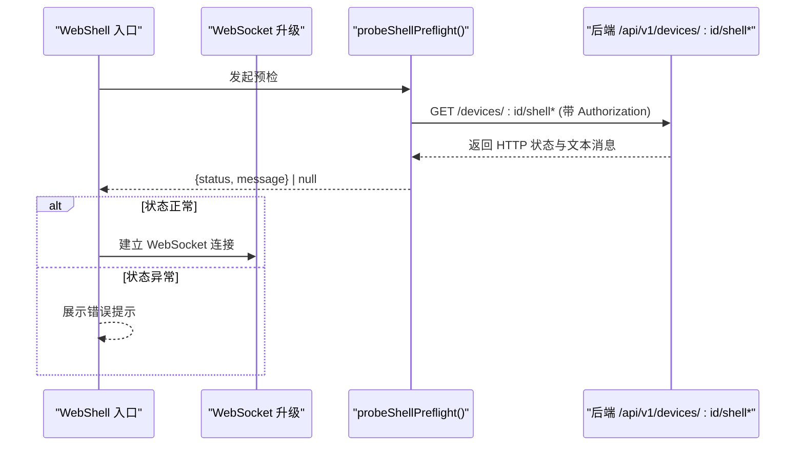
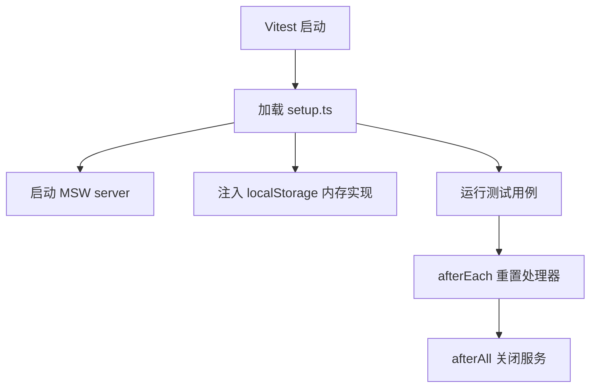
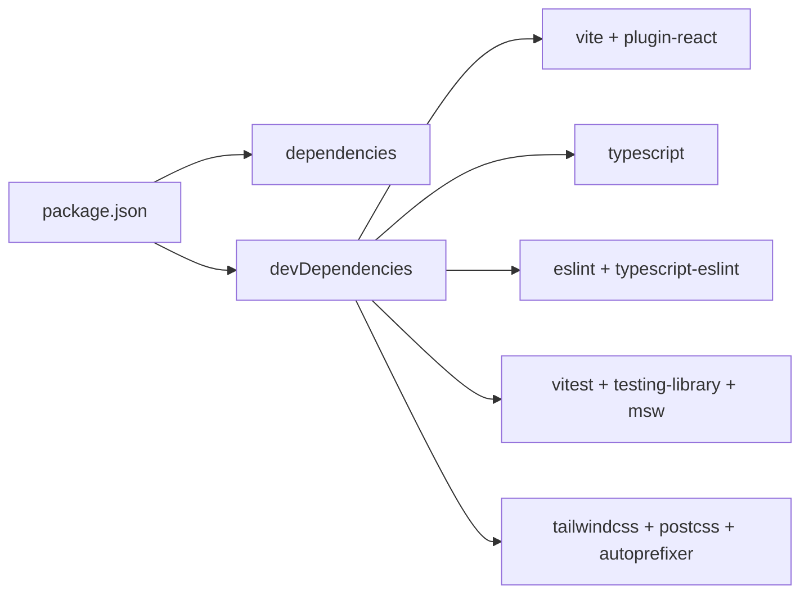

# 开发指南

<cite>
**本文引用的文件**
- [web/package.json](file://web/package.json)
- [web/vite.config.ts](file://web/vite.config.ts)
- [web/tsconfig.json](file://web/tsconfig.json)
- [web/.eslintrc.cjs](file://web/.eslintrc.cjs)
- [web/vitest.config.ts](file://web/vitest.config.ts)
- [web/README.md](file://web/README.md)
- [CONTRIBUTING.md](file://CONTRIBUTING.md)
- [web/src/test/setup.ts](file://web/src/test/setup.ts)
- [web/src/api/client.ts](file://web/src/api/client.ts)
- [web/src/i18n/locale.ts](file://web/src/i18n/locale.ts)
- [web/src/api/webshell.ts](file://web/src/api/webshell.ts)
- [docs/project/frontend-backend-contract.md](file://docs/project/frontend-backend-contract.md)
</cite>

## 目录
1. [简介](#简介)
2. [项目结构](#项目结构)
3. [核心组件](#核心组件)
4. [架构总览](#架构总览)
5. [详细组件分析](#详细组件分析)
6. [依赖分析](#依赖分析)
7. [性能考虑](#性能考虑)
8. [故障排查指南](#故障排查指南)
9. [结论](#结论)
10. [附录](#附录)

## 简介
本指南面向新加入的前端开发者，聚焦于前端开发环境搭建、工具链配置（Vite、TypeScript、ESLint）、开发工作流与代码规范（Git 分支管理、提交规范、代码审查）、测试（Vitest + React Testing Library + MSW）、性能监控与错误追踪集成方案、调试技巧与常见问题排查。文档同时给出前后端交互契约要点，帮助快速理解 SPA 如何与后端通信。

## 项目结构
前端位于 web/ 目录，采用 Vite + React + TypeScript 技术栈，构建产物为静态 dist/，由 nginx 提供 SPA 回退。关键配置文件如下：
- package.json：脚本命令、依赖声明
- vite.config.ts：Vite 插件、别名、构建优化、本地代理
- tsconfig.json：TypeScript 编译选项与路径映射
- .eslintrc.cjs：ESLint 规则与忽略模式
- vitest.config.ts：测试环境与全局 setup

图表来源
- [web/package.json:1-53](file://web/package.json#L1-L53)
- [web/vite.config.ts:1-64](file://web/vite.config.ts#L1-L64)
- [web/tsconfig.json:1-29](file://web/tsconfig.json#L1-L29)
- [web/.eslintrc.cjs:1-19](file://web/.eslintrc.cjs#L1-L19)
- [web/vitest.config.ts:1-18](file://web/vitest.config.ts#L1-L18)
- [web/src/test/setup.ts:1-29](file://web/src/test/setup.ts#L1-L29)
- [web/src/api/client.ts:1-163](file://web/src/api/client.ts#L1-L163)
- [web/src/i18n/locale.ts:1-102](file://web/src/i18n/locale.ts#L1-L102)

章节来源
- [web/README.md:1-75](file://web/README.md#L1-L75)
- [web/package.json:1-53](file://web/package.json#L1-L53)
- [web/vite.config.ts:1-64](file://web/vite.config.ts#L1-L64)
- [web/tsconfig.json:1-29](file://web/tsconfig.json#L1-L29)
- [web/.eslintrc.cjs:1-19](file://web/.eslintrc.cjs#L1-L19)
- [web/vitest.config.ts:1-18](file://web/vitest.config.ts#L1-L18)

## 核心组件
- 构建与开发服务器（Vite）
  - 启用 React 插件、@ 路径别名指向 src
  - 构建目标 es2020，输出到 dist，关闭 sourcemap
  - 通过 manualChunks 将重依赖拆分为 vendor-charts 与 vendor-xterm，并过滤 modulePreload 列表以减少登录页预加载体积
  - 本地开发端口 5173，/api 代理至 http://localhost:8090
- TypeScript 编译
  - strict 模式开启，moduleResolution=bundler，noEmit=true（仅类型检查）
  - baseUrl 与 paths 支持 @/* 映射
- ESLint 检查
  - 基于 recommended 扩展，启用 react-hooks 与 react-refresh
  - 忽略 dist、node_modules、构建配置等
  - 对未使用变量与 any 类型发出警告
- 测试框架（Vitest）
  - 继承 vite.config.ts 配置，保持 @ 别名与 React 插件一致
  - 使用 jsdom 环境，全局 setup 文件注入 MSW 服务
  - 禁用 CSS 解析以加速测试执行
- 统一请求客户端
  - request<T>() 封装 fetch，自动注入 Accept-Language、Authorization
  - 处理 FormData 与 JSON 序列化，统一错误对象 ApiError
  - 401 自动刷新 access_token，并发保护与重试一次；refresh 失败才登出
- 国际化（i18n）
  - 单文件 inline 双语 tr('中文','English') 模式
  - getLocale()/setLocale() 读写 localStorage，useI18n() Hook 响应式更新
  - 自动检测：优先 localStorage，其次时区白名单，再浏览器语言，默认 en-US

章节来源
- [web/vite.config.ts:1-64](file://web/vite.config.ts#L1-L64)
- [web/tsconfig.json:1-29](file://web/tsconfig.json#L1-L29)
- [web/.eslintrc.cjs:1-19](file://web/.eslintrc.cjs#L1-L19)
- [web/vitest.config.ts:1-18](file://web/vitest.config.ts#L1-L18)
- [web/src/api/client.ts:1-163](file://web/src/api/client.ts#L1-L163)
- [web/src/i18n/locale.ts:1-102](file://web/src/i18n/locale.ts#L1-L102)

## 架构总览
前端 SPA 通过 Vite 构建为静态资源，生产环境由 nginx 提供并回退 index.html；开发环境通过 Vite server 的 proxy 将 /api 转发到本地 manager。所有 API 调用均经过统一 client.ts，携带语言与鉴权信息，并在 401 时自动刷新令牌。

图表来源
- [web/vite.config.ts:54-62](file://web/vite.config.ts#L54-L62)
- [web/src/api/client.ts:24-46](file://web/src/api/client.ts#L24-L46)
- [web/src/i18n/locale.ts:56-72](file://web/src/i18n/locale.ts#L56-L72)
- [web/README.md:27-34](file://web/README.md#L27-L34)

## 详细组件分析

### 统一请求客户端（client.ts）
- 职责
  - 统一 Base URL、Accept-Language、Authorization 注入
  - 处理 FormData 与 JSON 序列化
  - 统一错误对象 ApiError，包含 status、code、payload
  - 401 自动刷新 access_token，并发保护 refreshInFlight，成功后重试一次
  - AbortSignal 透传，AbortError 直接抛出
- 数据流
  - 请求头注入 → fetch 发起 → 解析响应体 → 非 ok 进入错误处理 → 401 触发 refreshAccessToken → 成功则重试原请求 → 失败则登出或抛错

图表来源
- [web/src/api/client.ts:27-115](file://web/src/api/client.ts#L27-L115)
- [web/src/api/client.ts:117-163](file://web/src/api/client.ts#L117-L163)

章节来源
- [web/src/api/client.ts:1-163](file://web/src/api/client.ts#L1-163)

### 国际化模块（locale.ts）
- 职责
  - 提供 getLocale()/setLocale() 同步读写 localStorage
  - useI18n() Hook 订阅 locale-change 事件，驱动组件重渲染
  - 自动检测策略：localStorage → 时区白名单 → 浏览器语言 → en-US
- 与后端联动
  - 每个请求自动注入 Accept-Language，后端 LLM 相关端点据此决定输出语言

图表来源
- [web/src/i18n/locale.ts:36-65](file://web/src/i18n/locale.ts#L36-L65)
- [web/src/i18n/locale.ts:67-72](file://web/src/i18n/locale.ts#L67-L72)

章节来源
- [web/src/i18n/locale.ts:1-102](file://web/src/i18n/locale.ts#L1-102)

### WebShell 预检流程（webshell.ts）
- 背景
  - WebSocket 升级无法在 JS 中获取 HTTP 状态码，因此先发起 GET 探测同一路径，以便在升级前暴露 429/503/403 等状态
- 流程
  - 构造设备 ID 与路由后缀（/shell 或 /shell-direct）
  - 发起 GET 请求，带上 Authorization 头
  - 解析文本消息并返回 {status, message}；网络异常返回 null

图表来源
- [web/src/api/webshell.ts:146-189](file://web/src/api/webshell.ts#L146-L189)

章节来源
- [web/src/api/webshell.ts:146-189](file://web/src/api/webshell.ts#L146-L189)

### 测试基础设施（Vitest + MSW）
- 配置
  - vitest.config.ts 合并 vite.config.ts，启用 globals、jsdom、setupFiles、禁用 CSS
- 全局初始化
  - setup.ts 引入 jest-dom、MSW server
  - 兼容 Node 22+ 实验性 localStorage，提供内存实现兜底
  - beforeAll 启动 MSW，afterEach 重置处理器，afterAll 关闭服务
- 约定
  - 任何未处理的 fetch 都会报错，避免测试静默挂起

图表来源
- [web/vitest.config.ts:1-18](file://web/vitest.config.ts#L1-L18)
- [web/src/test/setup.ts:1-29](file://web/src/test/setup.ts#L1-L29)

章节来源
- [web/vitest.config.ts:1-18](file://web/vitest.config.ts#L1-L18)
- [web/src/test/setup.ts:1-29](file://web/src/test/setup.ts#L1-L29)

### 前后端交互契约（摘要）
- 基础约定
  - 所有请求相对路径 /api/v1/*，BASE 定义在 client.ts
  - 鉴权：Authorization: Bearer <jwt>，401 自动刷新
  - 国际化：Accept-Language 随请求发送
- SSE 聊天流
  - 事件帧包括 assistant、tool_start、tool_end、approval_pending、done、error
  - 前端通过 streamMessage 消费，Esc 可显式停止 turn
- WebSSH 与反向隧道
  - 前端不直接操作隧道，感知的是“命令下发 → 结果呈现”的端到端体验
- 跨域与代理
  - 开发环境 Vite proxy，生产环境 nginx 反代，无 CORS 配置

章节来源
- [docs/project/frontend-backend-contract.md:1-436](file://docs/project/frontend-backend-contract.md#L1-L436)
- [web/src/api/client.ts:24-46](file://web/src/api/client.ts#L24-L46)

## 依赖分析
- 运行时依赖
  - React 18、react-router-dom、zustand、recharts、xterm、lucide-react、react-markdown
- 开发依赖
  - Vite 5、@vitejs/plugin-react、TypeScript 5、Tailwind CSS 3、PostCSS、Autoprefixer
  - ESLint 8、@typescript-eslint、eslint-plugin-react-hooks、eslint-plugin-react-refresh
  - Vitest 1、@testing-library/react、msw、jsdom
- 脚本命令
  - dev/build/preview/lint/test/test:watch/typecheck

图表来源
- [web/package.json:1-53](file://web/package.json#L1-L53)

章节来源
- [web/package.json:1-53](file://web/package.json#L1-L53)

## 性能考虑
- 构建体积优化
  - manualChunks 将 recharts/d3/victory 归入 vendor-charts，xterm 归入 vendor-xterm
  - modulePreload 过滤掉大型 chunk，避免登录页预加载
- 构建目标
  - target=es2020，减少兼容性开销
- 开发体验
  - HMR 与热更新提升迭代效率
- 建议
  - 谨慎拆分更多 chunk，避免破坏有副作用库的初始化顺序
  - 按需懒加载重型页面（如 Monitor、DeviceShell），减少首屏体积

章节来源
- [web/vite.config.ts:13-52](file://web/vite.config.ts#L13-L52)

## 故障排查指南
- 本地开发无法访问后端接口
  - 确认 Vite server.proxy 配置与后端服务端口一致（默认 8090）
  - 检查浏览器 Network 面板，确认 /api 请求被正确代理
- 401 频繁出现或循环刷新
  - 检查 refresh_token 是否存在且有效
  - 确认 refresh 接口返回结构与字段名符合预期
  - 若刷新后仍 401，通常是权限问题而非会话过期，应展示业务错误而非强制登出
- WebSocket 连接立即断开
  - 使用 probeShellPreflight 进行预检，查看返回的 HTTP 状态与消息
  - 常见原因：限流（429）、服务不可用（503）、鉴权失败（403）
- 测试环境 localStorage 报错
  - setup.ts 已注入内存实现兜底，确保 Node 版本兼容
  - 若仍报错，检查是否在测试中直接访问了原生 localStorage
- 国际化未生效
  - 确认 getLocale() 返回值与 setLocale() 是否正确写入 localStorage
  - 确认组件使用了 useI18n() 或 tr()，并在语言切换后触发重渲染

章节来源
- [web/vite.config.ts:54-62](file://web/vite.config.ts#L54-L62)
- [web/src/api/client.ts:97-115](file://web/src/api/client.ts#L97-L115)
- [web/src/api/webshell.ts:146-189](file://web/src/api/webshell.ts#L146-L189)
- [web/src/test/setup.ts:5-22](file://web/src/test/setup.ts#L5-L22)
- [web/src/i18n/locale.ts:56-72](file://web/src/i18n/locale.ts#L56-L72)

## 结论
本项目前端采用轻量、清晰的工程化方案：Vite 构建、TypeScript 严格模式、ESLint 规范、Vitest 测试与 MSW 模拟、统一的请求客户端与国际化机制。配合 Git 分支管理与贡献规范，可有效保障协作质量与交付稳定性。建议在新增功能时遵循现有目录与命名约定，复用 ui 组件与 store 模式，完善测试覆盖，并通过 lint 与 typecheck 保证代码质量。

## 附录

### 快速上手与环境搭建
- 前置要求
  - Go、Node.js + pnpm、Docker + Docker Compose、uv、make、git
- 首次运行
  - 克隆仓库
  - 启动依赖服务（deploy/docker-compose）
  - 后端构建（make build）
  - 前端安装与开发（cd web && npm install && npm run dev）
- 构建与预览
  - npm run build 生成 dist/
  - npm run preview 本地预览构建产物

章节来源
- [repowiki/site/getting-started/local-dev/index.html:1525-1543](file://repowiki/site/getting-started/local-dev/index.html#L1525-L1543)
- [web/README.md:16-34](file://web/README.md#L16-L34)

### 开发工作流与代码规范
- 分支管理
  - main 受保护，所有变更通过 PR；从 main 拉取 topic 分支（例如 fix/tunnel-logs）
- 提交规范
  - Conventional Commits：feat(scope): …、fix(scope): …、docs(scope): …、chore(scope): …
- 代码审查
  - 维护者会进行评审，需耐心并及时响应反馈
- 自检清单
  - 运行 go test ./... 与 npm run build（若改动 UI）
  - 链接提交邮箱到 GitHub 账户，确保贡献者统计准确

章节来源
- [CONTRIBUTING.md:1-61](file://CONTRIBUTING.md#L1-L61)

### 单元测试与集成测试编写方法
- 单元测试
  - 使用 Vitest + React Testing Library，组件测试无需启动后端
  - 通过 MSW 拦截 fetch/SSE，提供稳定响应
  - 在 src/test/setup.ts 中完成全局初始化与清理
- 集成测试
  - 结合 E2E 目录与后端真链路，验证端到端流程
- 最佳实践
  - 为每个被测组件/模块提供同名单元测试
  - 使用 fixtures 共享数据，避免重复构造
  - 对未处理的 fetch 主动报错，避免静默失败

章节来源
- [web/vitest.config.ts:1-18](file://web/vitest.config.ts#L1-L18)
- [web/src/test/setup.ts:1-29](file://web/src/test/setup.ts#L1-L29)
- [docs/project/frontend-backend-contract.md:392-401](file://docs/project/frontend-backend-contract.md#L392-L401)

### 性能监控与错误追踪集成方案
- 现状
  - 当前前端未内置第三方错误追踪 SDK；错误主要通过 ApiError 与 UI 提示展示
- 建议方案
  - 在 request<T>() 的错误分支中上报错误（捕获 status、code、payload、URL、用户角色）
  - 可选接入 Sentry/Rum 等方案，按租户隔离上报
  - 对 SSE 错误与 WebSocket 预检失败进行专项上报
  - 结合后端 metrics 与日志系统（Prometheus/Loki/Tempo）进行关联分析

[本节为通用建议，不直接分析具体源码文件]

### 开发调试技巧
- 使用浏览器开发者工具
  - Network：查看请求头（Authorization、Accept-Language）、响应体与状态码
  - Console：捕获 ApiError 堆栈与自定义 toast 提示
  - Application：检查 localStorage 中的 oongrid-locale 与认证信息
- 本地代理
  - 确认 vite.config.ts 的 server.proxy 与后端端口一致
- 断点与日志
  - 在 request<T>() 与 refreshAccessToken() 处添加断点，观察 401 刷新流程
  - 在 i18n 模块中打印 getLocale() 与 setLocale() 行为

章节来源
- [web/vite.config.ts:54-62](file://web/vite.config.ts#L54-L62)
- [web/src/api/client.ts:97-115](file://web/src/api/client.ts#L97-L115)
- [web/src/i18n/locale.ts:56-72](file://web/src/i18n/locale.ts#L56-L72)