# UI状态管理

<cite>
**本文引用的文件**   
- [web/src/store/ui.ts](file://web/src/store/ui.ts)
- [web/src/components/Layout.tsx](file://web/src/components/Layout.tsx)
- [web/src/components/Sidebar.tsx](file://web/src/components/Sidebar.tsx)
- [web/src/components/CommandPalette.tsx](file://web/src/components/CommandPalette.tsx)
- [web/src/components/AgentSidePanel.tsx](file://web/src/components/AgentSidePanel.tsx)
- [web/src/components/Modal.tsx](file://web/src/components/Modal.tsx)
- [web/src/App.tsx](file://web/src/App.tsx)
- [web/src/main.tsx](file://web/src/main.tsx)
- [web/src/store/auth.ts](file://web/src/store/auth.ts)
- [web/src/store/theme.ts](file://web/src/store/theme.ts)
- [web/src/store/mode.ts](file://web/src/store/mode.ts)
</cite>

## 目录
1. [引言](#引言)
2. [项目结构](#项目结构)
3. [核心组件与状态](#核心组件与状态)
4. [架构总览](#架构总览)
5. [详细组件分析](#详细组件分析)
6. [依赖关系分析](#依赖关系分析)
7. [性能与内存优化](#性能与内存优化)
8. [故障排查指南](#故障排查指南)
9. [结论](#结论)
10. [附录：最佳实践与模式](#附录最佳实践与模式)

## 引言
本文件聚焦于前端UI状态管理的整体设计与实现，覆盖侧边栏展开/折叠、命令面板、助理侧边面板、模态框、页面导航与主题等通用UI状态。文档从设计模式、状态共享与通信机制、生命周期与内存优化、响应式布局与设备适配、复杂场景使用模式与最佳实践、竞态条件处理与用户体验优化等方面进行全面阐述，并辅以代码级图示帮助理解。

## 项目结构
UI状态主要分布在以下位置：
- 全局UI状态（Zustand store）：位于 web/src/store/ui.ts
- 全局布局与快捷键：位于 web/src/components/Layout.tsx
- 侧边栏导航与用户菜单：位于 web/src/components/Sidebar.tsx
- 命令面板（⌘P）：位于 web/src/components/CommandPalette.tsx
- 助理侧边面板（⌘K）：位于 web/src/components/AgentSidePanel.tsx
- 通用模态框：位于 web/src/components/Modal.tsx
- 路由与认证守卫：位于 web/src/App.tsx
- 应用启动与首屏样式注入：位于 web/src/main.tsx
- 主题与强调色持久化：位于 web/src/store/theme.ts、web/src/store/mode.ts
- 认证状态：位于 web/src/store/auth.ts

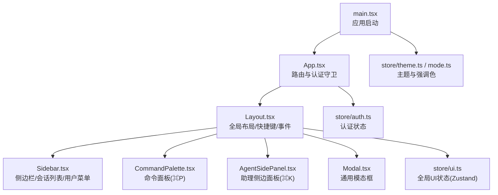

**图表来源**
- [web/src/main.tsx:1-26](file://web/src/main.tsx#L1-L26)
- [web/src/App.tsx:84-234](file://web/src/App.tsx#L84-L234)
- [web/src/components/Layout.tsx:1-70](file://web/src/components/Layout.tsx#L1-L70)
- [web/src/components/Sidebar.tsx:53-507](file://web/src/components/Sidebar.tsx#L53-L507)
- [web/src/components/CommandPalette.tsx:26-225](file://web/src/components/CommandPalette.tsx#L26-L225)
- [web/src/components/AgentSidePanel.tsx:27-250](file://web/src/components/AgentSidePanel.tsx#L27-L250)
- [web/src/components/Modal.tsx:27-133](file://web/src/components/Modal.tsx#L27-L133)
- [web/src/store/ui.ts:19-38](file://web/src/store/ui.ts#L19-L38)
- [web/src/store/auth.ts:20-41](file://web/src/store/auth.ts#L20-L41)
- [web/src/store/theme.ts:57-98](file://web/src/store/theme.ts#L57-L98)
- [web/src/store/mode.ts:57-98](file://web/src/store/mode.ts#L57-L98)

**章节来源**
- [web/src/main.tsx:1-26](file://web/src/main.tsx#L1-L26)
- [web/src/App.tsx:84-234](file://web/src/App.tsx#L84-L234)

## 核心组件与状态
- 全局UI状态（useUi）
  - 侧边栏折叠状态 sidebarCollapsed（持久化）
  - 命令面板开关 paletteOpen（非持久化）
  - 助理侧边面板开关 agentPanelOpen（非持久化）
  - 提供 toggle/set 方法供各组件订阅与更新
- 布局与快捷键（Layout）
  - 监听全局键盘事件，统一打开/关闭命令面板与助理侧边面板
  - 在首次挂载时启动未确认告警计数轮询
- 侧边栏（Sidebar）
  - 读取 useUi 控制展开/折叠
  - 提供搜索按钮触发命令面板
  - 展示会话列表、用户菜单、主题切换等
- 命令面板（CommandPalette）
  - 模糊匹配路由与会话，支持键盘导航与回车跳转
- 助理侧边面板（AgentSidePanel）
  - 轻量聊天界面，首次发送消息时懒创建会话，关闭后重置本地状态
- 模态框（Modal）
  - 通用弹窗容器，支持ESC关闭、body滚动锁定、可选拖拽调宽
- 主题与强调色（theme.ts / mode.ts）
  - 通过CSS变量与data属性驱动主题与强调色，启动前同步写入避免闪烁
- 认证（auth.ts）
  - 登录态与权限信息持久化，用于路由守卫与侧边栏显示

**章节来源**
- [web/src/store/ui.ts:19-38](file://web/src/store/ui.ts#L19-L38)
- [web/src/components/Layout.tsx:10-56](file://web/src/components/Layout.tsx#L10-L56)
- [web/src/components/Sidebar.tsx:53-151](file://web/src/components/Sidebar.tsx#L53-L151)
- [web/src/components/CommandPalette.tsx:26-133](file://web/src/components/CommandPalette.tsx#L26-L133)
- [web/src/components/AgentSidePanel.tsx:27-140](file://web/src/components/AgentSidePanel.tsx#L27-L140)
- [web/src/components/Modal.tsx:27-133](file://web/src/components/Modal.tsx#L27-L133)
- [web/src/store/theme.ts:57-98](file://web/src/store/theme.ts#L57-L98)
- [web/src/store/mode.ts:57-98](file://web/src/store/mode.ts#L57-L98)
- [web/src/store/auth.ts:20-41](file://web/src/store/auth.ts#L20-L41)

## 架构总览
UI状态采用“集中式全局状态 + 局部交互状态”的混合模式：
- 全局状态（Zustand）：跨组件共享的UI开关与布局偏好，具备持久化能力
- 局部状态（useState/useRef）：组件内短期交互（如输入、动画、焦点）
- 事件总线与API：通过API调用刷新相关状态（如会话列表），或通过自定义事件联动（如设备变更）

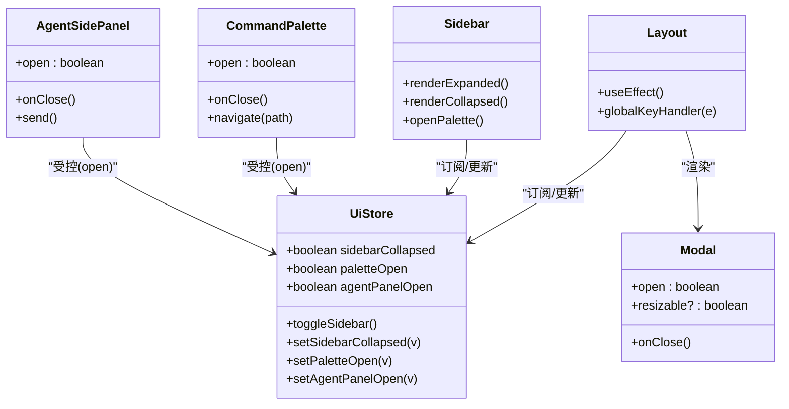

**图表来源**
- [web/src/store/ui.ts:19-38](file://web/src/store/ui.ts#L19-L38)
- [web/src/components/Layout.tsx:21-56](file://web/src/components/Layout.tsx#L21-L56)
- [web/src/components/Sidebar.tsx:53-151](file://web/src/components/Sidebar.tsx#L53-L151)
- [web/src/components/CommandPalette.tsx:26-133](file://web/src/components/CommandPalette.tsx#L26-L133)
- [web/src/components/AgentSidePanel.tsx:27-140](file://web/src/components/AgentSidePanel.tsx#L27-L140)
- [web/src/components/Modal.tsx:27-133](file://web/src/components/Modal.tsx#L27-L133)

## 详细组件分析

### 全局UI状态（useUi）
- 职责
  - 维护侧边栏折叠、命令面板、助理侧边面板三个布尔开关
  - 提供setter方法供任意组件更新
  - 仅持久化 sidebarCollapsed，其余为瞬时状态
- 关键点
  - 使用 zustand/persist 将结构型状态落盘，避免重载后丢失
  - partialize 策略确保只持久化必要字段，减少存储体积
- 复杂度
  - 时间O(1)，空间O(1)

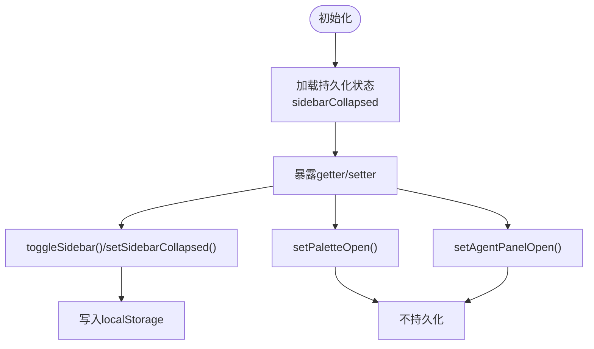

**图表来源**
- [web/src/store/ui.ts:19-38](file://web/src/store/ui.ts#L19-L38)

**章节来源**
- [web/src/store/ui.ts:19-38](file://web/src/store/ui.ts#L19-L38)

### 布局与全局快捷键（Layout）
- 职责
  - 绑定全局键盘事件：Ctrl/Cmd+K 打开助理侧边面板；Ctrl/Cmd+P 打开命令面板
  - 在首次挂载时启动未确认告警计数轮询，卸载时停止
- 关键点
  - 通过 useUi.getState() 直接读取最新状态，避免闭包陈旧值
  - 使用 window 事件监听，保证无焦点也能捕获快捷键
- 复杂度
  - 事件监听O(1)，每次按键处理O(1)

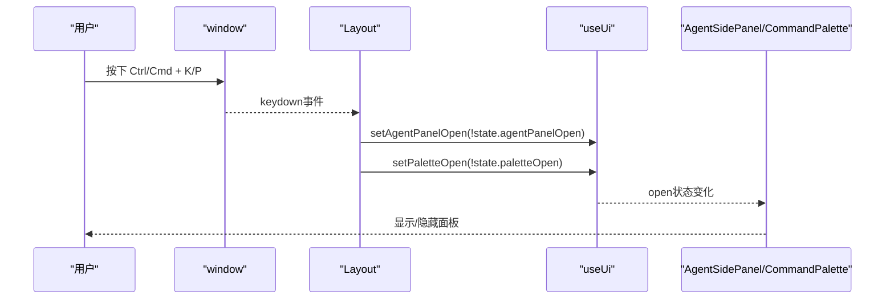

**图表来源**
- [web/src/components/Layout.tsx:30-44](file://web/src/components/Layout.tsx#L30-L44)
- [web/src/store/ui.ts:19-38](file://web/src/store/ui.ts#L19-L38)
- [web/src/components/AgentSidePanel.tsx:27-71](file://web/src/components/AgentSidePanel.tsx#L27-L71)
- [web/src/components/CommandPalette.tsx:26-64](file://web/src/components/CommandPalette.tsx#L26-L64)

**章节来源**
- [web/src/components/Layout.tsx:10-56](file://web/src/components/Layout.tsx#L10-L56)

### 侧边栏（Sidebar）
- 职责
  - 根据 useUi.sidebarCollapsed 渲染展开/折叠两种形态
  - 提供搜索入口触发命令面板
  - 展示会话列表、用户菜单、主题切换等
- 关键点
  - 使用 onDevicesChanged 事件监听设备变化，动态呈现角色分组
  - 会话删除后若当前正在查看该会话，自动跳转到首页
- 复杂度
  - 列表渲染O(n)，事件订阅O(1)

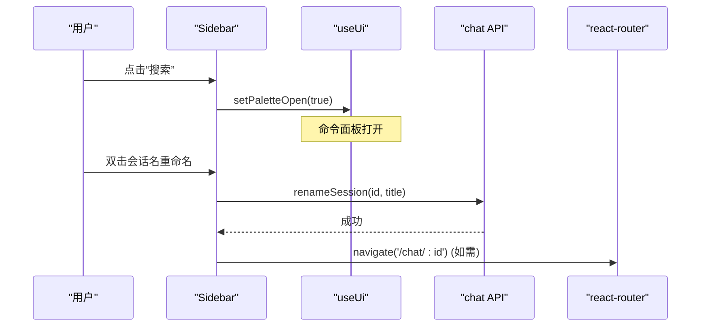

**图表来源**
- [web/src/components/Sidebar.tsx:53-151](file://web/src/components/Sidebar.tsx#L53-L151)
- [web/src/components/Sidebar.tsx:106-121](file://web/src/components/Sidebar.tsx#L106-L121)
- [web/src/components/CommandPalette.tsx:26-133](file://web/src/components/CommandPalette.tsx#L26-L133)

**章节来源**
- [web/src/components/Sidebar.tsx:53-507](file://web/src/components/Sidebar.tsx#L53-L507)

### 命令面板（CommandPalette）
- 职责
  - 模糊匹配路由与会话，提供键盘导航与回车跳转
  - 打开时预取最近会话，关闭时释放资源
- 关键点
  - 结果集扁平化（路由优先，会话次之），activeIndex随结果集变化保持有效
  - 打开时锁定body滚动，提升沉浸体验
- 复杂度
  - 评分排序O(m log m)，m为候选项数量

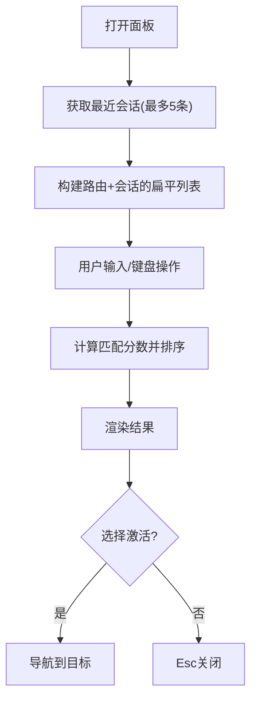

**图表来源**
- [web/src/components/CommandPalette.tsx:26-133](file://web/src/components/CommandPalette.tsx#L26-L133)

**章节来源**
- [web/src/components/CommandPalette.tsx:26-225](file://web/src/components/CommandPalette.tsx#L26-L225)

### 助理侧边面板（AgentSidePanel）
- 职责
  - 轻量聊天界面，支持Enter发送、Shift+Enter换行、Esc关闭
  - 首次发送消息时懒创建会话，关闭后重置本地状态
- 关键点
  - 乐观更新：先插入用户消息与pending助手消息，成功后替换内容
  - 错误路径：失败时将错误信息以Markdown形式回显
- 复杂度
  - 消息列表渲染O(n)，网络请求异步

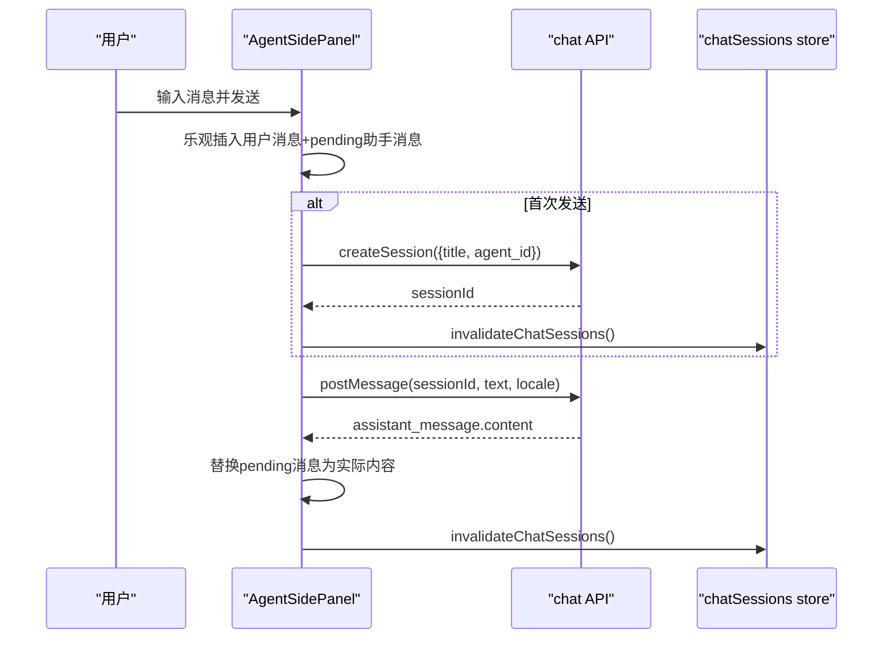

**图表来源**
- [web/src/components/AgentSidePanel.tsx:80-127](file://web/src/components/AgentSidePanel.tsx#L80-L127)
- [web/src/components/AgentSidePanel.tsx:27-71](file://web/src/components/AgentSidePanel.tsx#L27-L71)

**章节来源**
- [web/src/components/AgentSidePanel.tsx:27-250](file://web/src/components/AgentSidePanel.tsx#L27-L250)

### 通用模态框（Modal）
- 职责
  - 提供可复用的对话框容器，支持ESC关闭、body滚动锁定、可选拖拽调宽
- 关键点
  - 打开时设置 body.overflow=hidden，关闭时恢复
  - 拖拽边界限制最小宽度与最大视口比例，避免排版崩坏
- 复杂度
  - 拖拽事件处理O(1)

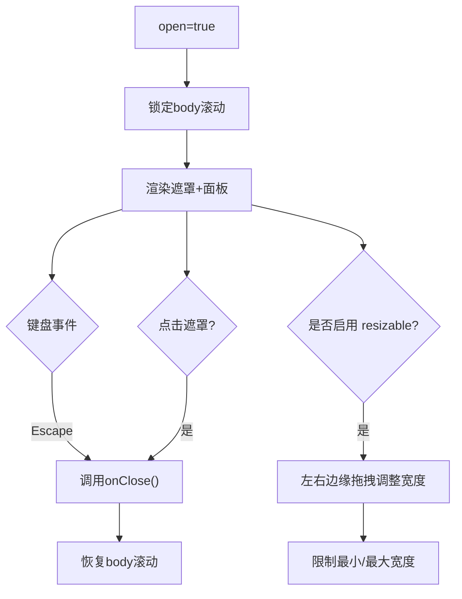

**图表来源**
- [web/src/components/Modal.tsx:33-66](file://web/src/components/Modal.tsx#L33-L66)
- [web/src/components/Modal.tsx:68-133](file://web/src/components/Modal.tsx#L68-L133)

**章节来源**
- [web/src/components/Modal.tsx:27-133](file://web/src/components/Modal.tsx#L27-L133)

### 主题与强调色（theme.ts / mode.ts）
- 职责
  - 主题偏好（system/light/dark）与强调色（accent）持久化与即时生效
- 关键点
  - main.tsx 启动时同步写入 CSS 变量与 data 属性，避免首屏闪烁
  - system 模式监听系统主题变化，实时跟随
- 复杂度
  - 启动阶段O(1)，事件监听O(1)

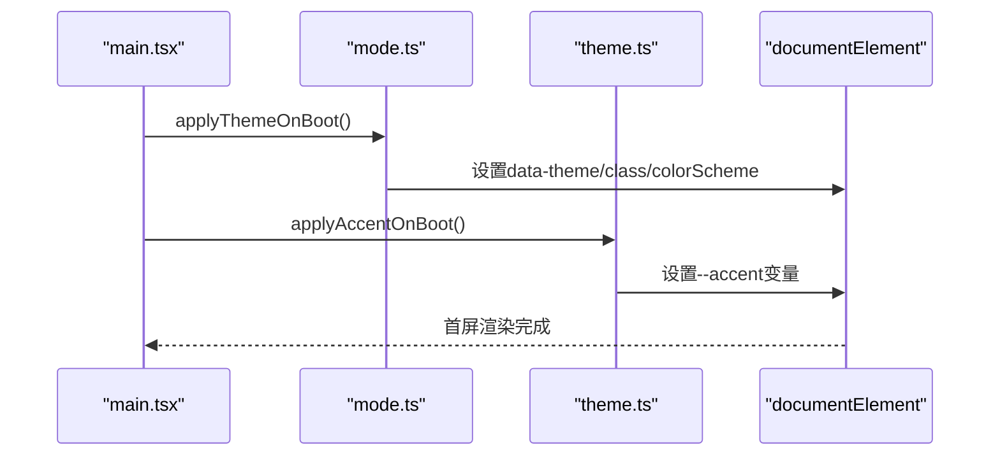

**图表来源**
- [web/src/main.tsx:10-14](file://web/src/main.tsx#L10-L14)
- [web/src/store/mode.ts:57-69](file://web/src/store/mode.ts#L57-L69)
- [web/src/store/theme.ts:88-97](file://web/src/store/theme.ts#L88-L97)

**章节来源**
- [web/src/store/theme.ts:57-98](file://web/src/store/theme.ts#L57-L98)
- [web/src/store/mode.ts:57-98](file://web/src/store/mode.ts#L57-L98)
- [web/src/main.tsx:10-14](file://web/src/main.tsx#L10-L14)

### 认证与路由守卫（auth.ts / App.tsx）
- 职责
  - 认证状态持久化，路由层根据token进行访问控制
- 关键点
  - RequireAuth 检查 token，未登录重定向至登录页并携带来源路径
  - PublicOnly 防止已登录用户重复进入登录页
- 复杂度
  - 守卫判断O(1)

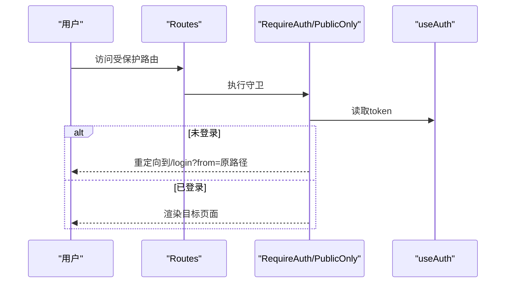

**图表来源**
- [web/src/App.tsx:69-82](file://web/src/App.tsx#L69-L82)
- [web/src/store/auth.ts:20-41](file://web/src/store/auth.ts#L20-L41)

**章节来源**
- [web/src/App.tsx:69-82](file://web/src/App.tsx#L69-L82)
- [web/src/store/auth.ts:20-41](file://web/src/store/auth.ts#L20-L41)

## 依赖关系分析
- 组件对状态的依赖
  - Layout、Sidebar 依赖 useUi 控制全局UI开关
  - CommandPalette、AgentSidePanel 由 useUi 的 open 状态受控
  - Modal 作为通用容器被多处复用
- 外部依赖
  - react-router-dom 负责导航与路由守卫
  - zustand/persist 负责状态持久化
  - lucide-react 图标库
  - i18n 国际化

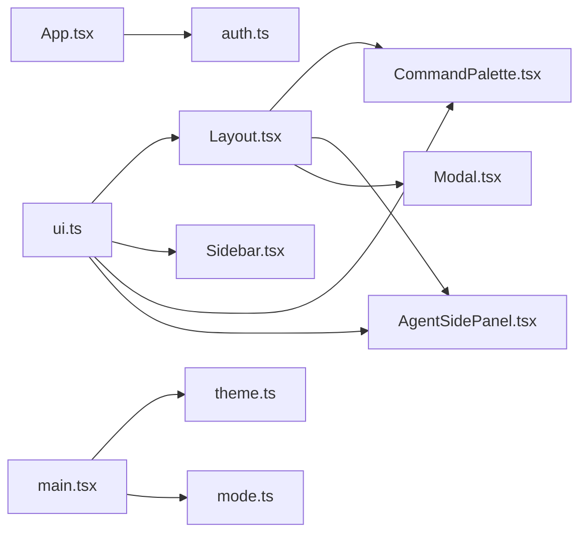

**图表来源**
- [web/src/store/ui.ts:19-38](file://web/src/store/ui.ts#L19-L38)
- [web/src/components/Layout.tsx:1-70](file://web/src/components/Layout.tsx#L1-L70)
- [web/src/components/Sidebar.tsx:53-151](file://web/src/components/Sidebar.tsx#L53-L151)
- [web/src/components/CommandPalette.tsx:26-133](file://web/src/components/CommandPalette.tsx#L26-L133)
- [web/src/components/AgentSidePanel.tsx:27-140](file://web/src/components/AgentSidePanel.tsx#L27-L140)
- [web/src/components/Modal.tsx:27-133](file://web/src/components/Modal.tsx#L27-L133)
- [web/src/App.tsx:69-82](file://web/src/App.tsx#L69-L82)
- [web/src/main.tsx:10-14](file://web/src/main.tsx#L10-L14)

**章节来源**
- [web/src/store/ui.ts:19-38](file://web/src/store/ui.ts#L19-L38)
- [web/src/components/Layout.tsx:1-70](file://web/src/components/Layout.tsx#L1-L70)
- [web/src/components/Sidebar.tsx:53-151](file://web/src/components/Sidebar.tsx#L53-L151)
- [web/src/components/CommandPalette.tsx:26-133](file://web/src/components/CommandPalette.tsx#L26-L133)
- [web/src/components/AgentSidePanel.tsx:27-140](file://web/src/components/AgentSidePanel.tsx#L27-L140)
- [web/src/components/Modal.tsx:27-133](file://web/src/components/Modal.tsx#L27-L133)
- [web/src/App.tsx:69-82](file://web/src/App.tsx#L69-L82)
- [web/src/main.tsx:10-14](file://web/src/main.tsx#L10-L14)

## 性能与内存优化
- 状态持久化粒度控制
  - 仅持久化必要的结构型状态（如侧边栏折叠），避免持久化瞬时UI状态，减小存储体积与I/O开销
- 首屏样式同步注入
  - 在 React 渲染前同步写入主题与强调色，避免首屏闪烁与二次重绘
- 事件监听清理
  - 所有 window/document 事件监听均在 useEffect 返回函数中移除，防止内存泄漏
- 列表与计算优化
  - 命令面板结果集使用 useMemo 缓存，仅在输入或数据变化时重新计算
- 懒加载与按需渲染
  - 助理侧边面板在关闭后延迟重置状态，配合过渡动画避免中间态闪烁
- 路由懒加载
  - 页面组件通过 lazy 导入，降低初始包体与首屏渲染压力

[本节为通用性能建议，无需特定文件引用]

## 故障排查指南
- 快捷键无效
  - 检查全局 keydown 监听是否正确注册与清理
  - 确认组件是否在 Layout 子树内，且未被其他输入控件拦截
- 面板无法关闭
  - 检查 ESC 事件是否被阻止冒泡
  - 确认遮罩点击回调是否生效
- 主题/强调色未生效
  - 确认 main.tsx 启动阶段是否调用 applyThemeOnBoot/applyAccentOnBoot
  - 检查 localStorage 中是否存在损坏数据导致解析失败
- 会话列表不同步
  - 确认删除/重命名后是否调用 invalidateChatSessions 刷新
  - 检查 onDevicesChanged 事件是否触发相应刷新逻辑

**章节来源**
- [web/src/components/Layout.tsx:30-44](file://web/src/components/Layout.tsx#L30-L44)
- [web/src/components/CommandPalette.tsx:57-64](file://web/src/components/CommandPalette.tsx#L57-L64)
- [web/src/components/AgentSidePanel.tsx:61-71](file://web/src/components/AgentSidePanel.tsx#L61-L71)
- [web/src/components/Modal.tsx:33-44](file://web/src/components/Modal.tsx#L33-L44)
- [web/src/main.tsx:10-14](file://web/src/main.tsx#L10-L14)
- [web/src/store/theme.ts:88-97](file://web/src/store/theme.ts#L88-L97)
- [web/src/store/mode.ts:57-69](file://web/src/store/mode.ts#L57-L69)

## 结论
本项目采用集中式全局状态与局部交互状态相结合的UI状态管理模式，借助 Zustand 的持久化能力与 React 的事件模型，实现了侧边栏、命令面板、助理侧边面板、模态框等通用UI状态的高效管理与复用。通过首屏样式同步注入、事件监听清理、列表计算缓存等手段，兼顾了性能与用户体验。后续可在更复杂的交互场景中引入状态机与事务性更新，进一步提升状态一致性与可测试性。

[本节为总结性内容，无需特定文件引用]

## 附录：最佳实践与模式
- 状态分层
  - 全局UI状态（持久化）：侧边栏折叠、主题偏好
  - 瞬时UI状态（非持久化）：命令面板、助理侧边面板、模态框开关
  - 业务数据状态：会话列表、告警计数等
- 状态共享与通信
  - 使用 zustand 订阅与更新，避免prop drilling
  - 通过事件总线（如 onDevicesChanged）跨模块联动
- 生命周期与内存优化
  - 所有事件监听在卸载时清理
  - 大列表与复杂计算使用 useMemo/useCallback 优化
- 响应式布局与设备适配
  - 基于 Tailwind 的 dark/light 类与 CSS 变量驱动主题
  - 模态框与面板考虑移动端交互（触摸、滚动锁定）
- 复杂场景模式
  - 乐观更新：先更新UI，再处理网络请求，失败回滚
  - 懒创建：首次交互时才创建资源（如会话）
- 竞态条件与用户体验
  - 使用取消标记（cancelled）避免过时响应覆盖新状态
  - 输入防抖与节流：在高频输入场景下减少不必要的计算与请求
  - 错误回退：失败时保留用户输入，允许重试

[本节为通用最佳实践，无需特定文件引用]