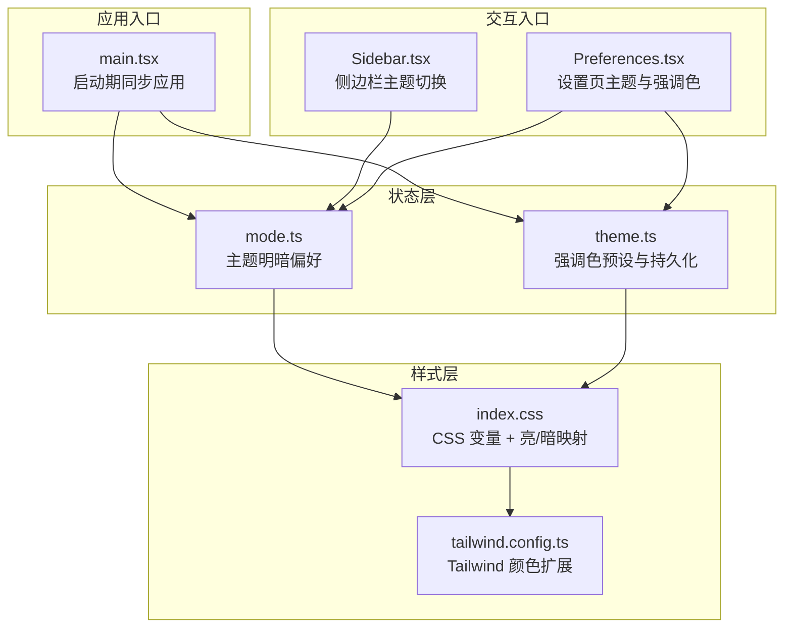
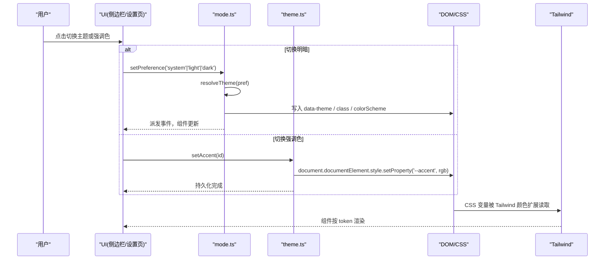
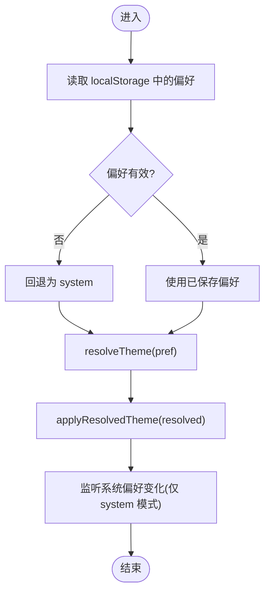
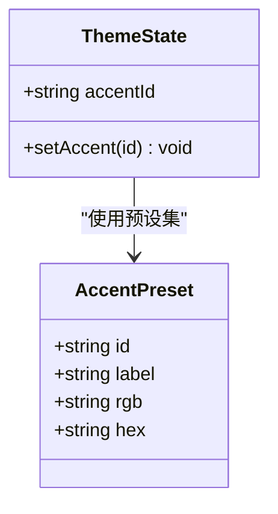
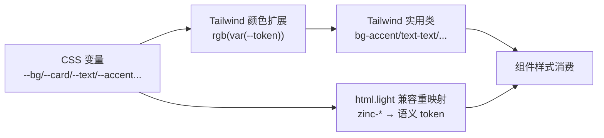
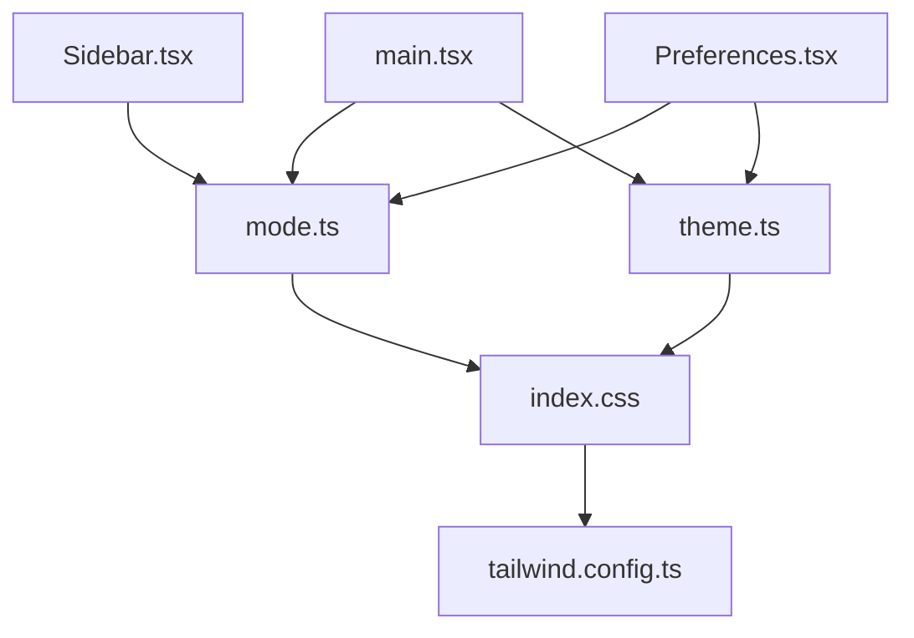

# 主题状态管理

<cite>
**本文引用的文件**
- [web/src/store/mode.ts](file://web/src/store/mode.ts)
- [web/src/store/theme.ts](file://web/src/store/theme.ts)
- [web/tailwind.config.ts](file://web/tailwind.config.ts)
- [web/src/styles/index.css](file://web/src/styles/index.css)
- [web/src/main.tsx](file://web/src/main.tsx)
- [web/src/components/Sidebar.tsx](file://web/src/components/Sidebar.tsx)
- [web/src/pages/settings/Preferences.tsx](file://web/src/pages/settings/Preferences.tsx)
</cite>

## 目录
1. [简介](#简介)
2. [项目结构](#项目结构)
3. [核心组件](#核心组件)
4. [架构总览](#架构总览)
5. [详细组件分析](#详细组件分析)
6. [依赖关系分析](#依赖关系分析)
7. [性能考虑](#性能考虑)
8. [故障排查指南](#故障排查指南)
9. [结论](#结论)
10. [附录](#附录)

## 简介
本文件系统化梳理 Ongrid Web 前端“主题状态管理”的架构与实现，覆盖深色/浅色模式的状态定义、切换逻辑、持久化机制、用户偏好设置入口、样式应用与动态切换原理，以及与 CSS 变量和 TailwindCSS 的集成方式。同时提供主题定制与扩展指南，以及兼容性检查与回退策略说明，帮助开发者快速理解并安全地演进主题系统。

## 项目结构
主题相关代码主要分布在以下位置：
- 状态层：mode.ts（主题明暗）、theme.ts（强调色）
- 样式层：index.css（语义化设计令牌与亮/暗主题映射）、tailwind.config.ts（Tailwind 颜色扩展）
- 启动期初始化：main.tsx（首屏前同步应用主题与语言）
- 交互入口：Sidebar.tsx（侧边栏用户菜单中的主题切换）、Preferences.tsx（设置页的主题与强调色面板）

图表来源
- [web/src/store/mode.ts:1-98](file://web/src/store/mode.ts#L1-L98)
- [web/src/store/theme.ts:1-98](file://web/src/store/theme.ts#L1-L98)
- [web/src/styles/index.css:1-672](file://web/src/styles/index.css#L1-L672)
- [web/tailwind.config.ts:1-43](file://web/tailwind.config.ts#L1-L43)
- [web/src/main.tsx:1-26](file://web/src/main.tsx#L1-L26)
- [web/src/components/Sidebar.tsx:1-800](file://web/src/components/Sidebar.tsx#L1-L800)
- [web/src/pages/settings/Preferences.tsx:1-176](file://web/src/pages/settings/Preferences.tsx#L1-L176)

章节来源
- [web/src/store/mode.ts:1-98](file://web/src/store/mode.ts#L1-L98)
- [web/src/store/theme.ts:1-98](file://web/src/store/theme.ts#L1-L98)
- [web/tailwind.config.ts:1-43](file://web/tailwind.config.ts#L1-L43)
- [web/src/styles/index.css:1-672](file://web/src/styles/index.css#L1-L672)
- [web/src/main.tsx:1-26](file://web/src/main.tsx#L1-L26)
- [web/src/components/Sidebar.tsx:1-800](file://web/src/components/Sidebar.tsx#L1-L800)
- [web/src/pages/settings/Preferences.tsx:1-176](file://web/src/pages/settings/Preferences.tsx#L1-L176)

## 核心组件
- 主题明暗状态（mode.ts）
  - 支持三档偏好：跟随系统 / 浅色 / 深色
  - 通过 localStorage 持久化；在系统偏好变化时自动响应
  - 将解析后的主题写入 DOM：data-theme、class（theme-dark/theme-light/dark/light）、colorScheme
- 强调色状态（theme.ts）
  - 基于品牌渐变色预设，选择后写入 CSS 变量 --accent
  - 使用 zustand + persist 中间件持久化到 localStorage
  - 提供启动期同步函数避免首帧闪烁
- 样式与 Tailwind 集成（index.css + tailwind.config.ts）
  - 以 :root.dark/:root.light 下声明语义化 CSS 变量作为设计令牌
  - Tailwind 通过 rgb(var(--token)) 扩展颜色，使组件无需感知明暗
  - 大量 html.light 规则对历史硬编码的 zinc-* 进行兼容重映射
- 应用入口（main.tsx）
  - 在 React 挂载前调用 applyThemeOnBoot() 与 applyAccentOnBoot()，确保首屏即正确主题
- 交互入口（Sidebar.tsx、Preferences.tsx）
  - 侧边栏用户菜单提供主题循环切换
  - 设置页提供主题与强调色的可视化选择与预览

章节来源
- [web/src/store/mode.ts:1-98](file://web/src/store/mode.ts#L1-L98)
- [web/src/store/theme.ts:1-98](file://web/src/store/theme.ts#L1-L98)
- [web/tailwind.config.ts:1-43](file://web/tailwind.config.ts#L1-L43)
- [web/src/styles/index.css:1-672](file://web/src/styles/index.css#L1-L672)
- [web/src/main.tsx:1-26](file://web/src/main.tsx#L1-L26)
- [web/src/components/Sidebar.tsx:1-800](file://web/src/components/Sidebar.tsx#L1-L800)
- [web/src/pages/settings/Preferences.tsx:1-176](file://web/src/pages/settings/Preferences.tsx#L1-L176)

## 架构总览
主题系统采用“状态层 → DOM 标记 → CSS 变量 → Tailwind 颜色扩展 → 组件消费”的分层架构。状态层负责读取/写入偏好与解析最终主题；DOM 标记驱动 CSS 变量生效；Tailwind 通过配置将语义化 token 暴露为实用类；组件仅消费这些类名，无需关心明暗细节。

图表来源
- [web/src/store/mode.ts:1-98](file://web/src/store/mode.ts#L1-L98)
- [web/src/store/theme.ts:1-98](file://web/src/store/theme.ts#L1-L98)
- [web/tailwind.config.ts:1-43](file://web/tailwind.config.ts#L1-L43)
- [web/src/styles/index.css:1-672](file://web/src/styles/index.css#L1-L672)
- [web/src/components/Sidebar.tsx:1-800](file://web/src/components/Sidebar.tsx#L1-L800)
- [web/src/pages/settings/Preferences.tsx:1-176](file://web/src/pages/settings/Preferences.tsx#L1-L176)

## 详细组件分析

### 主题明暗状态（mode.ts）
- 偏好模型
  - ThemePreference: 'system' | 'light' | 'dark'
  - ResolvedTheme: 'light' | 'dark'
- 关键能力
  - getThemePreference(): 从 localStorage 读取并校验偏好值
  - resolveTheme(pref): 若为 system，则依据 matchMedia('(prefers-color-scheme: dark)') 解析
  - applyResolvedTheme(theme): 写入 data-theme、class（theme-dark/theme-light/dark/light）、colorScheme
  - setThemePreference(pref): 持久化 + 应用 + 派发自定义事件
  - applyThemeOnBoot(): 启动期同步应用，并监听系统偏好变化
  - useThemeMode(): React Hook，返回 preference/resolved/setPreference/cycle
- 复杂度与性能
  - 操作均为 O(1)，localStorage 读写与 DOM 属性/类名切换开销极低
  - 首次渲染前执行，避免闪烁
- 错误处理与回退
  - 未启用 localStorage 或 matchMedia 不可用时，回退到默认值（system→dark）
  - 事件监听器在组件卸载时移除，避免内存泄漏

图表来源
- [web/src/store/mode.ts:1-98](file://web/src/store/mode.ts#L1-L98)

章节来源
- [web/src/store/mode.ts:1-98](file://web/src/store/mode.ts#L1-L98)

### 强调色状态（theme.ts）
- 预设模型
  - AccentPreset: id/label/rgb/hex，标签支持 i18n
  - ACCENT_PRESETS: 多套品牌色预设
- 关键能力
  - useTheme: zustand store，包含 accentId 与 setAccent
  - applyAccent(id): 将对应 RGB 写入 --accent
  - applyAccentOnBoot(): 启动期直接读取 localStorage 并应用，避免首帧闪烁
- 持久化
  - 使用 zustand/persist 中间件，存储键名为 ongrid.theme
- 兼容性
  - 若传入的 id 不在预设中，applyAccent 会静默忽略，防止旧数据导致异常

图表来源
- [web/src/store/theme.ts:1-98](file://web/src/store/theme.ts#L1-L98)

章节来源
- [web/src/store/theme.ts:1-98](file://web/src/store/theme.ts#L1-L98)

### 样式与 Tailwind 集成（index.css + tailwind.config.ts）
- 设计令牌
  - :root.dark 与 :root.light 下定义一组语义化 CSS 变量（如 --bg/--card/--text/--accent 等）
  - Tailwind 通过 rgb(var(--token)/<alpha-value>) 扩展颜色，使组件直接使用 bg-accent/text-text 等类名
- 亮模式兼容重映射
  - 针对历史大量使用的 zinc-* 工具类，在 html.light 下重写背景/文字/边框/阴影等，保证视觉一致性
  - 对半透明变体、hover/focus 态、列表分隔线等进行精细化适配
- 第三方库适配
  - react-flow 控件与迷你地图在暗/亮模式下分别提供覆盖样式，保证对比度与可读性
- 打印优化
  - @media print 下强制白底黑字，保留强调色，提升报告导出可读性

图表来源
- [web/tailwind.config.ts:1-43](file://web/tailwind.config.ts#L1-L43)
- [web/src/styles/index.css:1-672](file://web/src/styles/index.css#L1-L672)

章节来源
- [web/tailwind.config.ts:1-43](file://web/tailwind.config.ts#L1-L43)
- [web/src/styles/index.css:1-672](file://web/src/styles/index.css#L1-L672)

### 应用入口与启动期同步（main.tsx）
- 在 React 根节点渲染之前，依次调用 applyThemeOnBoot() 与 applyAccentOnBoot()，确保首屏无闪烁
- 同时设置文档语言，配合 i18n 工作流

章节来源
- [web/src/main.tsx:1-26](file://web/src/main.tsx#L1-L26)

### 交互入口（Sidebar.tsx、Preferences.tsx）
- 侧边栏用户菜单
  - 提供“主题”项，点击循环切换 system → light → dark
  - 图标随当前 resolved 主题变化（太阳/月亮/显示器）
- 设置页
  - 主题三选一（跟随系统/浅色/深色）
  - 强调色选择器展示预设色板与实时预览（按钮/标签/进度条等）

章节来源
- [web/src/components/Sidebar.tsx:1-800](file://web/src/components/Sidebar.tsx#L1-L800)
- [web/src/pages/settings/Preferences.tsx:1-176](file://web/src/pages/settings/Preferences.tsx#L1-L176)

## 依赖关系分析
- 模块耦合
  - mode.ts 与 theme.ts 相互独立，分别负责明暗与强调色
  - main.tsx 在启动期同时依赖两者
  - Sidebar.tsx 与 Preferences.tsx 消费两个 store 提供的 API
  - index.css 与 tailwind.config.ts 构成样式基础设施，被所有组件间接消费
- 外部依赖
  - localStorage：偏好持久化
  - window.matchMedia：系统主题检测
  - zustand + persist：强调色状态持久化
- 潜在循环依赖
  - 当前未见循环引用；状态层不反向依赖 UI 层

图表来源
- [web/src/main.tsx:1-26](file://web/src/main.tsx#L1-L26)
- [web/src/store/mode.ts:1-98](file://web/src/store/mode.ts#L1-L98)
- [web/src/store/theme.ts:1-98](file://web/src/store/theme.ts#L1-L98)
- [web/src/components/Sidebar.tsx:1-800](file://web/src/components/Sidebar.tsx#L1-L800)
- [web/src/pages/settings/Preferences.tsx:1-176](file://web/src/pages/settings/Preferences.tsx#L1-L176)
- [web/src/styles/index.css:1-672](file://web/src/styles/index.css#L1-L672)
- [web/tailwind.config.ts:1-43](file://web/tailwind.config.ts#L1-L43)

章节来源
- [web/src/main.tsx:1-26](file://web/src/main.tsx#L1-L26)
- [web/src/store/mode.ts:1-98](file://web/src/store/mode.ts#L1-L98)
- [web/src/store/theme.ts:1-98](file://web/src/store/theme.ts#L1-L98)
- [web/src/components/Sidebar.tsx:1-800](file://web/src/components/Sidebar.tsx#L1-L800)
- [web/src/pages/settings/Preferences.tsx:1-176](file://web/src/pages/settings/Preferences.tsx#L1-L176)
- [web/src/styles/index.css:1-672](file://web/src/styles/index.css#L1-L672)
- [web/tailwind.config.ts:1-43](file://web/tailwind.config.ts#L1-L43)

## 性能考虑
- 首屏无闪烁
  - 在 React 挂载前同步应用主题与强调色，避免一次错误的默认渲染
- 最小 DOM 变更
  - 主题切换仅修改少量 DOM 属性与类名，成本极低
- 事件监听
  - 仅在需要时注册 matchMedia 监听，并在合适时机移除
- 组件重渲染
  - 强调色通过 CSS 变量全局生效，无需触发组件级重渲染
- 可访问性与动画
  - 尊重 prefers-reduced-motion，减少不必要的动画开销

[本节为通用指导，不涉及具体文件分析]

## 故障排查指南
- 主题未生效或出现闪烁
  - 确认 main.tsx 是否在渲染前调用了 applyThemeOnBoot() 与 applyAccentOnBoot()
  - 检查浏览器控制台是否有 localStorage 读取异常（JSON 解析失败会被捕获并回退）
- 系统主题切换无效
  - 确认当前偏好是否为 system；只有 system 模式才会响应 matchMedia 变化
  - 检查浏览器是否支持 matchMedia
- 强调色未更新
  - 确认选择的 id 是否存在于预设集合中；未知 id 会被忽略
  - 检查 --accent 变量是否被正确写入 documentElement
- 亮模式显示异常（残留深色 token）
  - 检查 html.light 下的兼容重映射规则是否覆盖了所用类名
  - 对于新增的 zinc-* 用法，建议在 index.css 中补充对应的 html.light 映射

章节来源
- [web/src/main.tsx:1-26](file://web/src/main.tsx#L1-L26)
- [web/src/store/mode.ts:1-98](file://web/src/store/mode.ts#L1-L98)
- [web/src/store/theme.ts:1-98](file://web/src/store/theme.ts#L1-L98)
- [web/src/styles/index.css:1-672](file://web/src/styles/index.css#L1-L672)

## 结论
该主题系统以“状态层 + CSS 变量 + Tailwind 扩展”为核心，实现了低耦合、高性能且易扩展的主题管理能力。通过启动期同步、系统偏好联动、持久化与完善的兼容重映射，既保证了用户体验，也为后续主题定制与扩展提供了清晰路径。

[本节为总结性内容，不涉及具体文件分析]

## 附录

### 主题定制与扩展指南
- 新增强调色预设
  - 在 theme.ts 的预设列表中增加新条目（id/zh/en/rgb/hex），即可在设置页与侧边栏自动可用
  - 如需自定义输入，可在现有基础上扩展，但需评估品牌一致性
- 新增主题模式
  - 在 mode.ts 中扩展 ThemePreference 类型与应用逻辑，并在 UI 处同步更新选项
  - 注意在 index.css 中为新模式定义完整的语义 token 与必要重映射
- 新增语义 token
  - 在 index.css 的 :root.dark/:root.light 中新增 token，并在 tailwind.config.ts 中扩展对应颜色
  - 在组件中使用新的 Tailwind 颜色类名，避免硬编码颜色
- 第三方库适配
  - 参考 react-flow 的覆盖方式，在 index.css 中为特定库提供暗/亮两套样式

章节来源
- [web/src/store/theme.ts:1-98](file://web/src/store/theme.ts#L1-L98)
- [web/src/store/mode.ts:1-98](file://web/src/store/mode.ts#L1-L98)
- [web/tailwind.config.ts:1-43](file://web/tailwind.config.ts#L1-L43)
- [web/src/styles/index.css:1-672](file://web/src/styles/index.css#L1-L672)

### 兼容性检查与回退机制
- localStorage 不可用
  - 主题与强调色均具备容错逻辑，回退到默认值
- matchMedia 不可用
  - 系统主题回退为 dark，避免无法解析导致的异常
- 过时或非法的强调色 id
  - applyAccent 会忽略未知 id，保持 CSS 默认值稳定
- 历史 zinc-* 遗留
  - 通过 html.light 的重映射规则尽量保持视觉一致；新增用法建议逐步迁移至语义 token

章节来源
- [web/src/store/mode.ts:1-98](file://web/src/store/mode.ts#L1-L98)
- [web/src/store/theme.ts:1-98](file://web/src/store/theme.ts#L1-L98)
- [web/src/styles/index.css:1-672](file://web/src/styles/index.css#L1-L672)