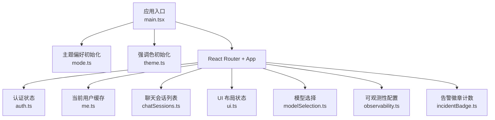
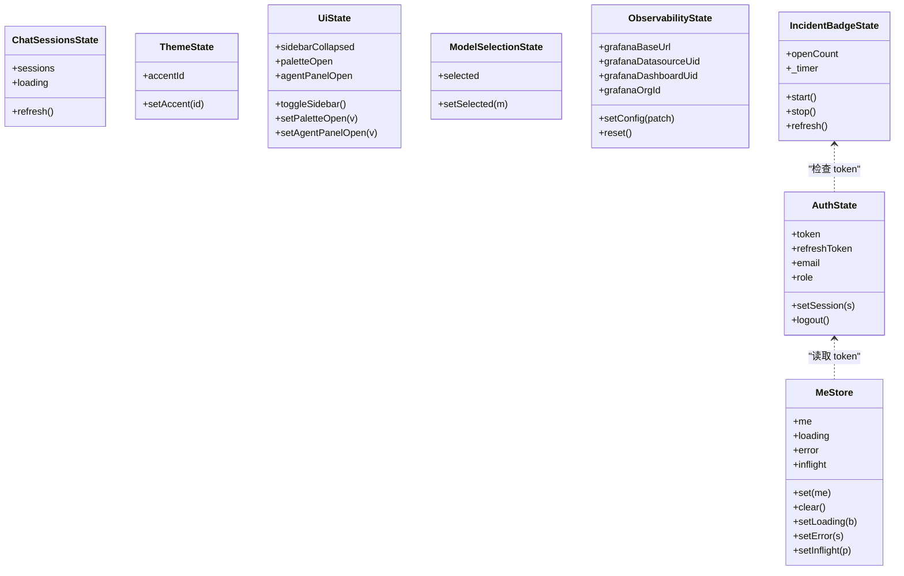
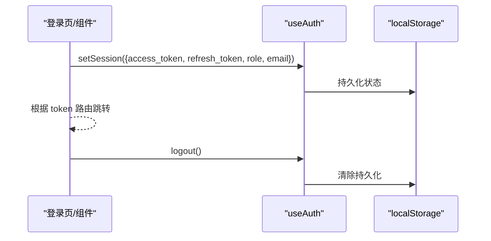
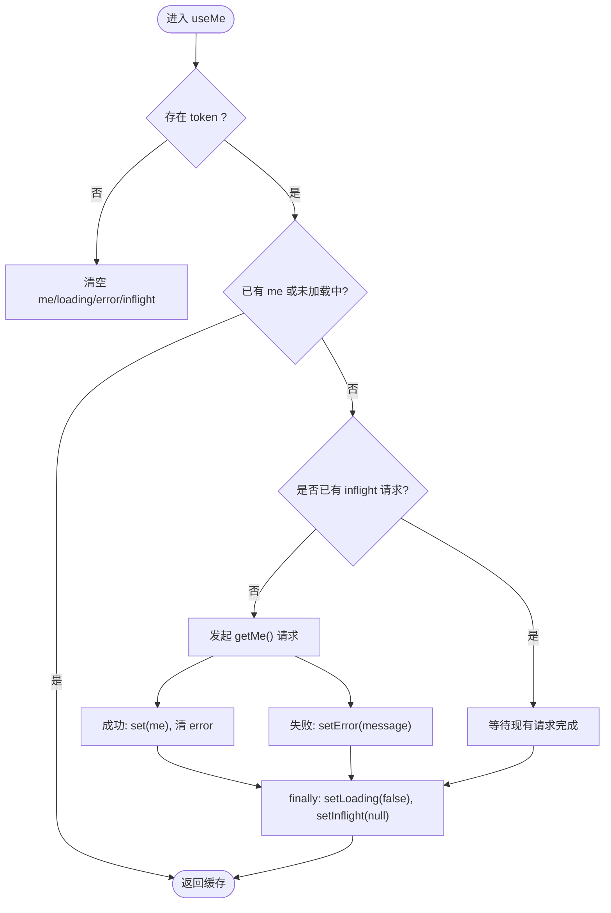
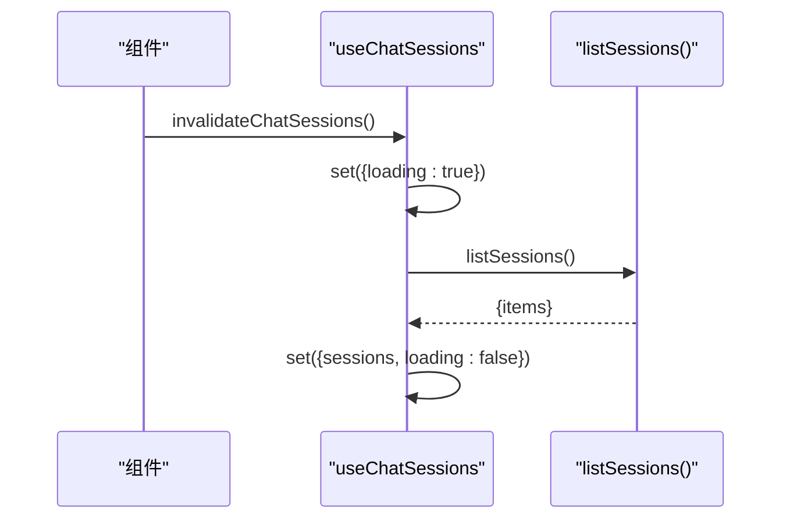
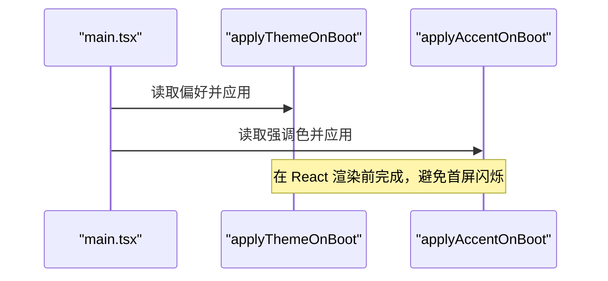
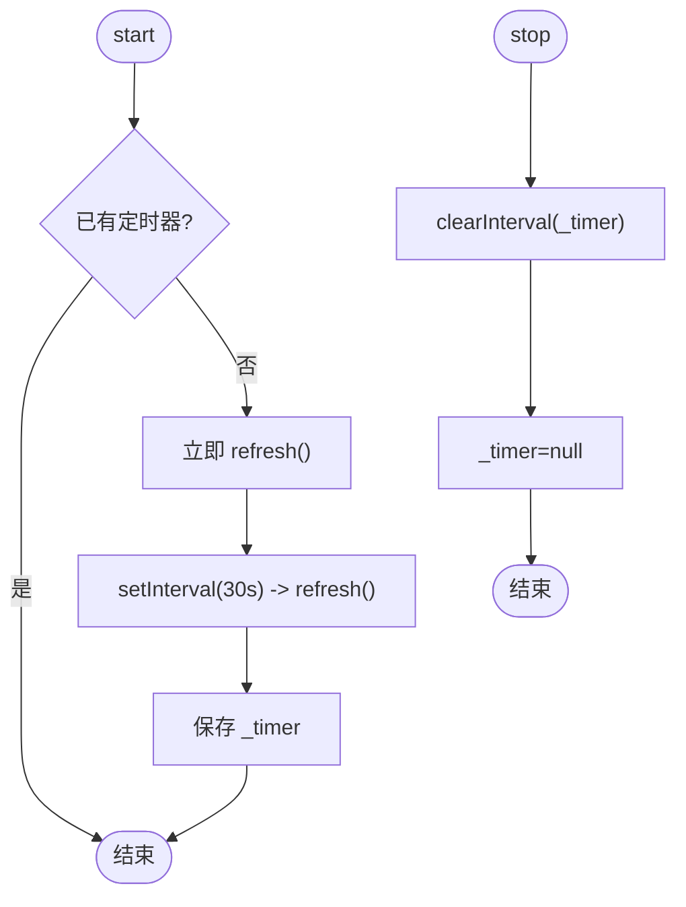
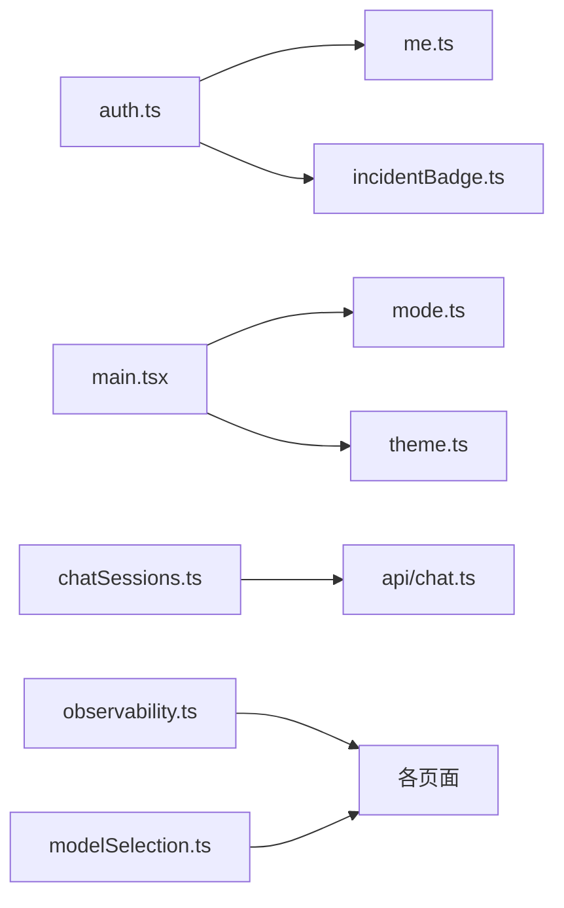

# 状态管理

<cite>
**本文引用的文件**
- [web/src/store/auth.ts](file://web/src/store/auth.ts)
- [web/src/store/chatSessions.ts](file://web/src/store/chatSessions.ts)
- [web/src/store/theme.ts](file://web/src/store/theme.ts)
- [web/src/store/me.ts](file://web/src/store/me.ts)
- [web/src/store/ui.ts](file://web/src/store/ui.ts)
- [web/src/store/mode.ts](file://web/src/store/mode.ts)
- [web/src/store/modelSelection.ts](file://web/src/store/modelSelection.ts)
- [web/src/store/observability.ts](file://web/src/store/observability.ts)
- [web/src/store/incidentBadge.ts](file://web/src/store/incidentBadge.ts)
- [web/src/main.tsx](file://web/src/main.tsx)
- [web/package.json](file://web/package.json)
</cite>

## 目录
1. [简介](#简介)
2. [项目结构](#项目结构)
3. [核心组件](#核心组件)
4. [架构总览](#架构总览)
5. [详细组件分析](#详细组件分析)
6. [依赖分析](#依赖分析)
7. [性能考虑](#性能考虑)
8. [故障排查指南](#故障排查指南)
9. [结论](#结论)
10. [附录](#附录)

## 简介
本文件面向开发者，系统化梳理前端基于 Zustand 的状态管理方案。内容涵盖 store 模块划分与组织策略、用户认证状态、聊天会话状态、主题设置等核心状态的设计与实现；阐述持久化机制与数据同步策略；总结更新最佳实践与性能优化技巧；提供调试与开发辅助方法；并给出扩展与自定义 store 的开发指南。

## 项目结构
前端状态集中在 web/src/store 目录下，按领域拆分多个独立 store：
- 认证与会话：auth.ts、me.ts
- 聊天与会话列表：chatSessions.ts
- 主题与外观：theme.ts、mode.ts
- UI 布局与交互：ui.ts
- 模型选择（聊天）：modelSelection.ts
- 可观测性配置（Grafana 深链）：observability.ts
- 告警徽章计数：incidentBadge.ts

应用启动时，在入口 main.tsx 中优先执行主题与强调色的初始化，确保首屏无闪烁。

图表来源
- [web/src/main.tsx:1-26](file://web/src/main.tsx#L1-L26)
- [web/src/store/mode.ts:1-98](file://web/src/store/mode.ts#L1-L98)
- [web/src/store/theme.ts:1-98](file://web/src/store/theme.ts#L1-L98)
- [web/src/store/auth.ts:1-50](file://web/src/store/auth.ts#L1-L50)
- [web/src/store/me.ts:1-114](file://web/src/store/me.ts#L1-L114)
- [web/src/store/chatSessions.ts:1-34](file://web/src/store/chatSessions.ts#L1-L34)
- [web/src/store/ui.ts:1-39](file://web/src/store/ui.ts#L1-L39)
- [web/src/store/modelSelection.ts:1-32](file://web/src/store/modelSelection.ts#L1-L32)
- [web/src/store/observability.ts:1-43](file://web/src/store/observability.ts#L1-L43)
- [web/src/store/incidentBadge.ts:1-59](file://web/src/store/incidentBadge.ts#L1-L59)

章节来源
- [web/src/main.tsx:1-26](file://web/src/main.tsx#L1-L26)
- [web/package.json:1-53](file://web/package.json#L1-L53)

## 核心组件
- 认证状态（auth.ts）
  - 职责：维护登录令牌、刷新令牌、邮箱与角色；提供 setSession/logout；通过 persist 中间件将状态持久化到 localStorage。
  - 关键 API：useAuth、getToken、getRefreshToken。
- 当前用户缓存（me.ts）
  - 职责：轻量内存缓存 /v1/me，支持单飞请求去重、错误处理、自动清理；提供 useMe/usePermissions hook。
  - 特点：不持久化，随 token 变化自动拉取或清空。
- 聊天会话列表（chatSessions.ts）
  - 职责：侧边栏会话列表单一事实来源；提供 refresh 与 invalidateChatSessions 触发全局刷新。
- 主题与强调色（mode.ts、theme.ts）
  - mode.ts：系统/亮/暗三档偏好，localStorage + matchMedia 监听，data-theme 与 dark/light class 双写，避免 Tailwind dark: 失效。
  - theme.ts：强调色预设与 --accent CSS 变量写入，persist 到 localStorage，并提供 applyAccentOnBoot 避免首帧闪烁。
- UI 布局（ui.ts）
  - 职责：侧边栏折叠、命令面板、Agent 侧面板开关；partialize 仅持久化 sidebarCollapsed。
- 模型选择（modelSelection.ts）
  - 职责：跨页面共享的聊天模型选择，persist 到 localStorage；null 表示未显式选择，由调用方回退到目录默认。
- 可观测性配置（observability.ts）
  - 职责：Grafana 根 URL、数据源 UID、仪表板 UID、组织 ID 的用户级配置，persist 到 localStorage。
- 告警徽章计数（incidentBadge.ts）
  - 职责：每 30s 轮询未确认告警数量，供多处渲染；无 token 时停止轮询避免 401 风暴。

章节来源
- [web/src/store/auth.ts:1-50](file://web/src/store/auth.ts#L1-L50)
- [web/src/store/me.ts:1-114](file://web/src/store/me.ts#L1-L114)
- [web/src/store/chatSessions.ts:1-34](file://web/src/store/chatSessions.ts#L1-L34)
- [web/src/store/mode.ts:1-98](file://web/src/store/mode.ts#L1-L98)
- [web/src/store/theme.ts:1-98](file://web/src/store/theme.ts#L1-L98)
- [web/src/store/ui.ts:1-39](file://web/src/store/ui.ts#L1-L39)
- [web/src/store/modelSelection.ts:1-32](file://web/src/store/modelSelection.ts#L1-L32)
- [web/src/store/observability.ts:1-43](file://web/src/store/observability.ts#L1-L43)
- [web/src/store/incidentBadge.ts:1-59](file://web/src/store/incidentBadge.ts#L1-L59)

## 架构总览
整体采用“多 store 分域”的 Zustand 架构：每个业务域一个 store，使用 createJSONStorage 与 persist 中间件进行本地持久化；对需要网络同步的状态，store 内封装异步刷新方法，并在组件层按需触发。

图表来源
- [web/src/store/auth.ts:1-50](file://web/src/store/auth.ts#L1-L50)
- [web/src/store/me.ts:1-114](file://web/src/store/me.ts#L1-L114)
- [web/src/store/chatSessions.ts:1-34](file://web/src/store/chatSessions.ts#L1-L34)
- [web/src/store/theme.ts:1-98](file://web/src/store/theme.ts#L1-L98)
- [web/src/store/ui.ts:1-39](file://web/src/store/ui.ts#L1-L39)
- [web/src/store/modelSelection.ts:1-32](file://web/src/store/modelSelection.ts#L1-L32)
- [web/src/store/observability.ts:1-43](file://web/src/store/observability.ts#L1-L43)
- [web/src/store/incidentBadge.ts:1-59](file://web/src/store/incidentBadge.ts#L1-L59)

## 详细组件分析

### 认证状态（auth.ts）
- 设计要点
  - 使用 persist 中间件将 token、refreshToken、email、role 持久化到 localStorage，键名为 ongrid.auth。
  - 提供 setSession/logout 原子更新，保证状态一致性。
  - 暴露 getToken/getRefreshToken 便捷函数，便于非 React 上下文访问。
- 典型流程（登录/登出）

图表来源
- [web/src/store/auth.ts:1-50](file://web/src/store/auth.ts#L1-L50)

章节来源
- [web/src/store/auth.ts:1-50](file://web/src/store/auth.ts#L1-L50)

### 当前用户缓存（me.ts）
- 设计要点
  - 内存缓存 + 单飞请求：并发多次挂载只发一次请求，避免重复网络开销。
  - 错误处理：捕获 ApiError 并记录 error 字段，同时保持 loading 状态正确归位。
  - 生命周期联动：当 auth.token 为空时自动清空 me；有 token 且未加载时自动拉取。
- 流程图

图表来源
- [web/src/store/me.ts:1-114](file://web/src/store/me.ts#L1-L114)

章节来源
- [web/src/store/me.ts:1-114](file://web/src/store/me.ts#L1-L114)

### 聊天会话列表（chatSessions.ts）
- 设计要点
  - 单一事实来源：侧边栏会话列表统一从该 store 读取。
  - 刷新策略：提供 refresh 方法，内部先置 loading=true，成功后写入 sessions，异常则恢复 loading=false。
  - 全局失效：invalidateChatSessions 可从任意位置触发刷新，借助 React 批量更新避免多余重渲染。
- 时序图

图表来源
- [web/src/store/chatSessions.ts:1-34](file://web/src/store/chatSessions.ts#L1-L34)

章节来源
- [web/src/store/chatSessions.ts:1-34](file://web/src/store/chatSessions.ts#L1-L34)

### 主题与强调色（mode.ts、theme.ts）
- 模式切换（mode.ts）
  - 三档偏好 system/light/dark，优先在 React 挂载前写入 DOM（applyThemeOnBoot），避免闪烁。
  - 同时维护 data-theme 与 .dark/.light 类名，兼容 Tailwind 的 dark: 工具类。
  - 监听系统主题变化，system 模式下实时跟随。
- 强调色（theme.ts）
  - 预设强调色集合，通过写入 --accent CSS 变量驱动全局配色。
  - 首次渲染前直接读取 localStorage 并应用，避免一帧白屏。
- 启动时序

图表来源
- [web/src/main.tsx:1-26](file://web/src/main.tsx#L1-L26)
- [web/src/store/mode.ts:1-98](file://web/src/store/mode.ts#L1-L98)
- [web/src/store/theme.ts:1-98](file://web/src/store/theme.ts#L1-L98)

章节来源
- [web/src/store/mode.ts:1-98](file://web/src/store/mode.ts#L1-L98)
- [web/src/store/theme.ts:1-98](file://web/src/store/theme.ts#L1-L98)
- [web/src/main.tsx:1-26](file://web/src/main.tsx#L1-L26)

### UI 布局（ui.ts）
- 设计要点
  - 仅持久化 sidebarCollapsed，其他临时覆盖态（命令面板、Agent 面板）不持久化。
  - 提供 toggle/set 方法，方便全局热键与按钮统一控制。
- 建议
  - 新增 UI 状态时明确是否应持久化，避免污染 localStorage。

章节来源
- [web/src/store/ui.ts:1-39](file://web/src/store/ui.ts#L1-L39)

### 模型选择（modelSelection.ts）
- 设计要点
  - 跨 Home 与 ChatThread 共享用户选择的模型，persist 到 localStorage。
  - selected 为 null 时表示未显式选择，调用方可回退到目录默认值，保证默认值始终来自服务端配置。
- 建议
  - 在创建新会话时读取 selected，若为 null 则使用目录默认。

章节来源
- [web/src/store/modelSelection.ts:1-32](file://web/src/store/modelSelection.ts#L1-L32)

### 可观测性配置（observability.ts）
- 设计要点
  - 存储 Grafana 相关用户级配置（根 URL、数据源 UID、仪表板 UID、组织 ID）。
  - 提供 setConfig/reset 方法，支持增量更新与一键重置。
- 注意
  - 当前 grafanaBaseUrl 同时从系统设置与本 store 读取并降级，后续建议统一到系统设置。

章节来源
- [web/src/store/observability.ts:1-43](file://web/src/store/observability.ts#L1-L43)

### 告警徽章计数（incidentBadge.ts）
- 设计要点
  - 每 30s 轮询 open 状态的 incidents 总数，供多处渲染。
  - 无 token 时停止轮询，避免 401 风暴。
  - 提供 start/stop/refresh 接口，便于测试与 HMR 场景复位。
- 流程图

图表来源
- [web/src/store/incidentBadge.ts:1-59](file://web/src/store/incidentBadge.ts#L1-L59)

章节来源
- [web/src/store/incidentBadge.ts:1-59](file://web/src/store/incidentBadge.ts#L1-L59)

## 依赖分析
- 外部依赖
  - zustand：状态库核心（create、persist、createJSONStorage）。
- 内部依赖关系
  - incidentBadge 依赖 auth 的 token 判断是否轮询。
  - me 依赖 auth 的 token 生命周期以决定是否拉取/清空。
  - theme/mode 在应用启动阶段被 main.tsx 调用，影响首屏渲染。
  - chatSessions 依赖 API 层获取会话列表。
  - observability 与 modelSelection 主要作为配置型状态被各页面消费。

图表来源
- [web/src/store/auth.ts:1-50](file://web/src/store/auth.ts#L1-L50)
- [web/src/store/me.ts:1-114](file://web/src/store/me.ts#L1-L114)
- [web/src/store/incidentBadge.ts:1-59](file://web/src/store/incidentBadge.ts#L1-L59)
- [web/src/store/chatSessions.ts:1-34](file://web/src/store/chatSessions.ts#L1-L34)
- [web/src/store/observability.ts:1-43](file://web/src/store/observability.ts#L1-L43)
- [web/src/store/modelSelection.ts:1-32](file://web/src/store/modelSelection.ts#L1-L32)
- [web/src/main.tsx:1-26](file://web/src/main.tsx#L1-L26)

章节来源
- [web/package.json:1-53](file://web/package.json#L1-L53)

## 性能考虑
- 最小订阅
  - 在组件中使用 useXxx((s) => s.field) 精确订阅字段，避免整树重渲染。
- 批量更新
  - 同一事件循环内的多次 set 会被 React 批处理合并，减少重渲染次数。
- 单飞请求
  - me.ts 的 inflight 机制避免并发重复请求，降低服务器压力。
- 延迟持久化
  - 对频繁变更的状态（如面板开关）不要持久化，使用 partialize 仅持久化必要字段。
- 首屏优化
  - 在 React 挂载前应用主题与强调色，避免闪烁。
- 轮询节流
  - 告警徽章轮询间隔合理（30s），并在无 token 时停止，避免无效请求。

[本节为通用指导，无需源码引用]

## 故障排查指南
- 主题/强调色未生效
  - 检查 main.tsx 是否在 React 渲染前调用了 applyThemeOnBoot 与 applyAccentOnBoot。
  - 检查 localStorage 中对应 key 是否存在且格式正确。
- 登录后权限闪烁
  - 使用 usePermissions 提供的 role 回退逻辑，避免 /v1/me 未返回时的空白。
- 聊天会话列表不同步
  - 在创建会话或发送首条消息后调用 invalidateChatSessions 触发刷新。
- 徽章计数不更新
  - 确认已调用 start，且在登录状态下；检查网络请求是否被拦截。
- 模型选择丢失
  - 确认 selected 是否为 null，若为 null 则由调用方回退到目录默认。

章节来源
- [web/src/main.tsx:1-26](file://web/src/main.tsx#L1-L26)
- [web/src/store/me.ts:1-114](file://web/src/store/me.ts#L1-L114)
- [web/src/store/chatSessions.ts:1-34](file://web/src/store/chatSessions.ts#L1-L34)
- [web/src/store/incidentBadge.ts:1-59](file://web/src/store/incidentBadge.ts#L1-L59)
- [web/src/store/modelSelection.ts:1-32](file://web/src/store/modelSelection.ts#L1-L32)

## 结论
本项目采用清晰的分域 store 架构，结合 Zustand 的 persist 中间件实现了必要的本地持久化；对需要网络同步的状态，在 store 内封装刷新方法并通过全局失效函数触发更新；在主题与强调色方面，通过启动期直接操作 DOM 避免首屏闪烁；通过单飞请求、最小订阅与合理的轮询策略保障性能。整体方案简洁、可扩展、易维护。

[本节为总结，无需源码引用]

## 附录

### 状态持久化与数据同步策略
- 持久化范围
  - 认证信息、主题偏好、强调色、UI 结构态、模型选择、可观测性配置均持久化到 localStorage。
  - 临时 UI 态（命令面板、Agent 面板）不持久化，使用 partialize 过滤。
- 同步策略
  - 会话列表：组件主动调用 invalidateChatSessions 触发刷新。
  - 当前用户：useMe 在 token 变化时自动拉取或清空。
  - 徽章计数：定时轮询，无 token 时停止。
- 启动顺序
  - main.tsx 先应用主题与强调色，再渲染 React 应用，确保首屏一致。

章节来源
- [web/src/store/ui.ts:1-39](file://web/src/store/ui.ts#L1-L39)
- [web/src/store/chatSessions.ts:1-34](file://web/src/store/chatSessions.ts#L1-L34)
- [web/src/store/me.ts:1-114](file://web/src/store/me.ts#L1-L114)
- [web/src/store/incidentBadge.ts:1-59](file://web/src/store/incidentBadge.ts#L1-L59)
- [web/src/main.tsx:1-26](file://web/src/main.tsx#L1-L26)

### 状态更新最佳实践
- 使用 createJSONStorage 与 persist 中间件，确保 JSON 序列化安全。
- 将副作用（DOM 写入、事件监听）与状态更新分离，必要时在 setter 中组合。
- 对外暴露原子方法（如 setSession、logout、refresh），避免组件直接修改内部字段。
- 对高频变更状态，谨慎持久化或使用 partialize 缩小持久化范围。

章节来源
- [web/src/store/auth.ts:1-50](file://web/src/store/auth.ts#L1-L50)
- [web/src/store/ui.ts:1-39](file://web/src/store/ui.ts#L1-L39)
- [web/src/store/theme.ts:1-98](file://web/src/store/theme.ts#L1-L98)

### 性能优化技巧
- 精确订阅：useXxx((s) => s.field)。
- 单飞请求：me.ts 的 inflight 机制。
- 批处理：同事件循环内多次 set 合并。
- 启动期优化：主题与强调色在 React 渲染前应用。
- 轮询控制：无 token 时停止轮询。

章节来源
- [web/src/store/me.ts:1-114](file://web/src/store/me.ts#L1-L114)
- [web/src/store/incidentBadge.ts:1-59](file://web/src/store/incidentBadge.ts#L1-L59)
- [web/src/main.tsx:1-26](file://web/src/main.tsx#L1-L26)

### 状态调试与开发辅助
- 浏览器 DevTools
  - 使用浏览器开发者工具的 Application/Storage 查看 localStorage 中的 ongrid.* 键值。
- 运行时自检
  - 通过 useXxx.getState() 在非 React 上下文中读取状态，便于日志打印与断点调试。
- 测试友好
  - incidentBadge 暴露 _timer 以便测试与 HMR 复位；me 提供 clear/setLoading/setError 等方法便于模拟。

章节来源
- [web/src/store/incidentBadge.ts:1-59](file://web/src/store/incidentBadge.ts#L1-L59)
- [web/src/store/me.ts:1-114](file://web/src/store/me.ts#L1-L114)

### 扩展与自定义 Store 指南
- 新建 store 步骤
  - 在 web/src/store 下新建文件，定义 State 类型与 actions。
  - 使用 create<State>() 创建 store；如需持久化，包裹 persist(createJSONStorage(() => localStorage))。
  - 导出 useXxx 钩子与可选的全局刷新/失效函数。
- 命名约定
  - 持久化 key 使用 ongrid.<domain> 前缀，避免冲突。
  - 方法命名语义化（如 setSession、refresh、reset）。
- 与现有模块协作
  - 需要鉴权时读取 useAuth.getState().token。
  - 需要触发全局刷新时，提供 invalidateXxx 函数供组件调用。
- 示例参考路径
  - 认证持久化：[web/src/store/auth.ts:1-50](file://web/src/store/auth.ts#L1-L50)
  - 局部持久化（partialize）：[web/src/store/ui.ts:1-39](file://web/src/store/ui.ts#L1-L39)
  - 启动期应用：[web/src/main.tsx:1-26](file://web/src/main.tsx#L1-L26)

章节来源
- [web/src/store/auth.ts:1-50](file://web/src/store/auth.ts#L1-L50)
- [web/src/store/ui.ts:1-39](file://web/src/store/ui.ts#L1-L39)
- [web/src/main.tsx:1-26](file://web/src/main.tsx#L1-L26)