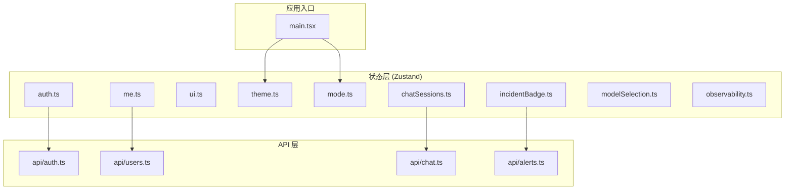
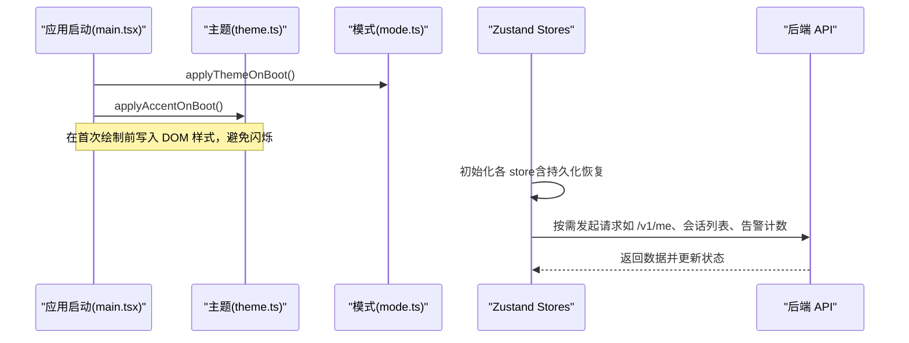
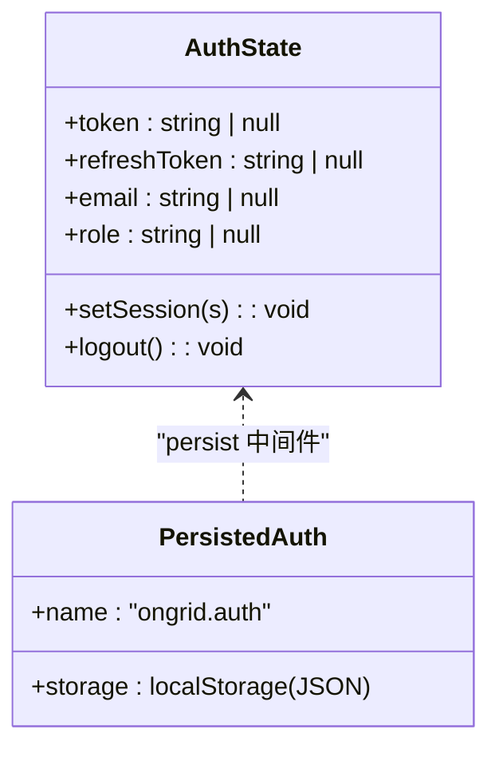
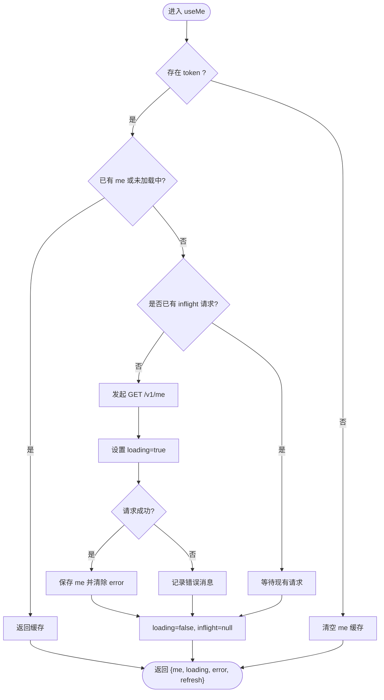
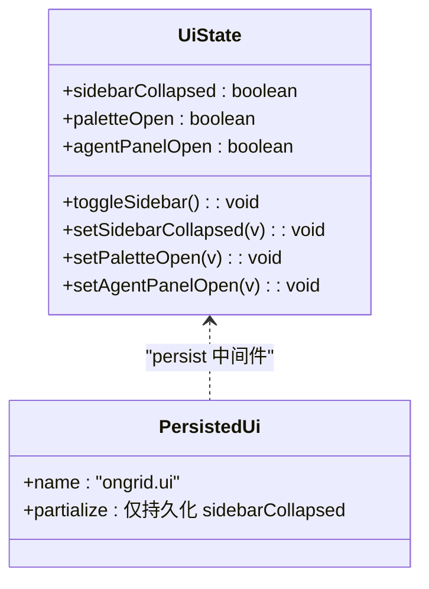
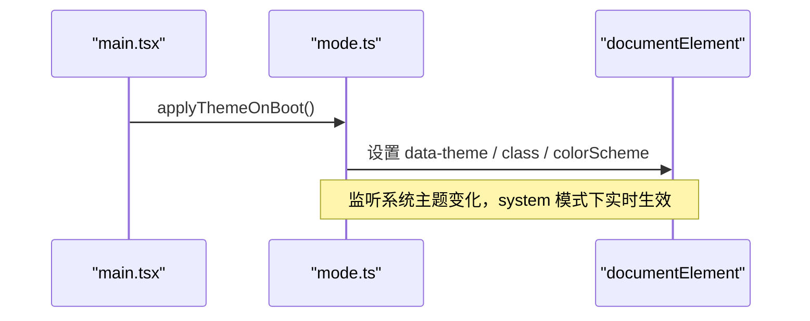
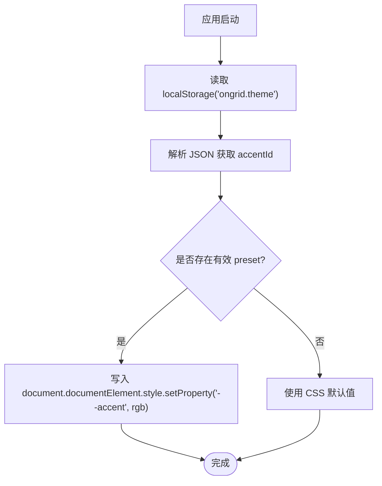
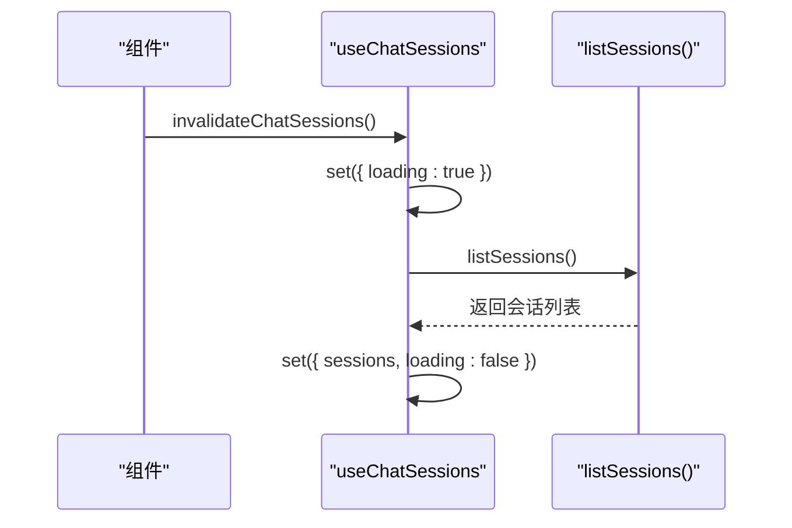
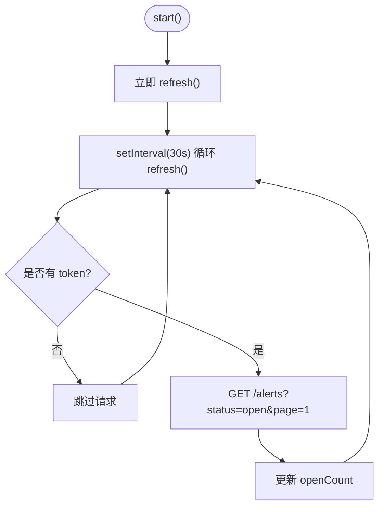
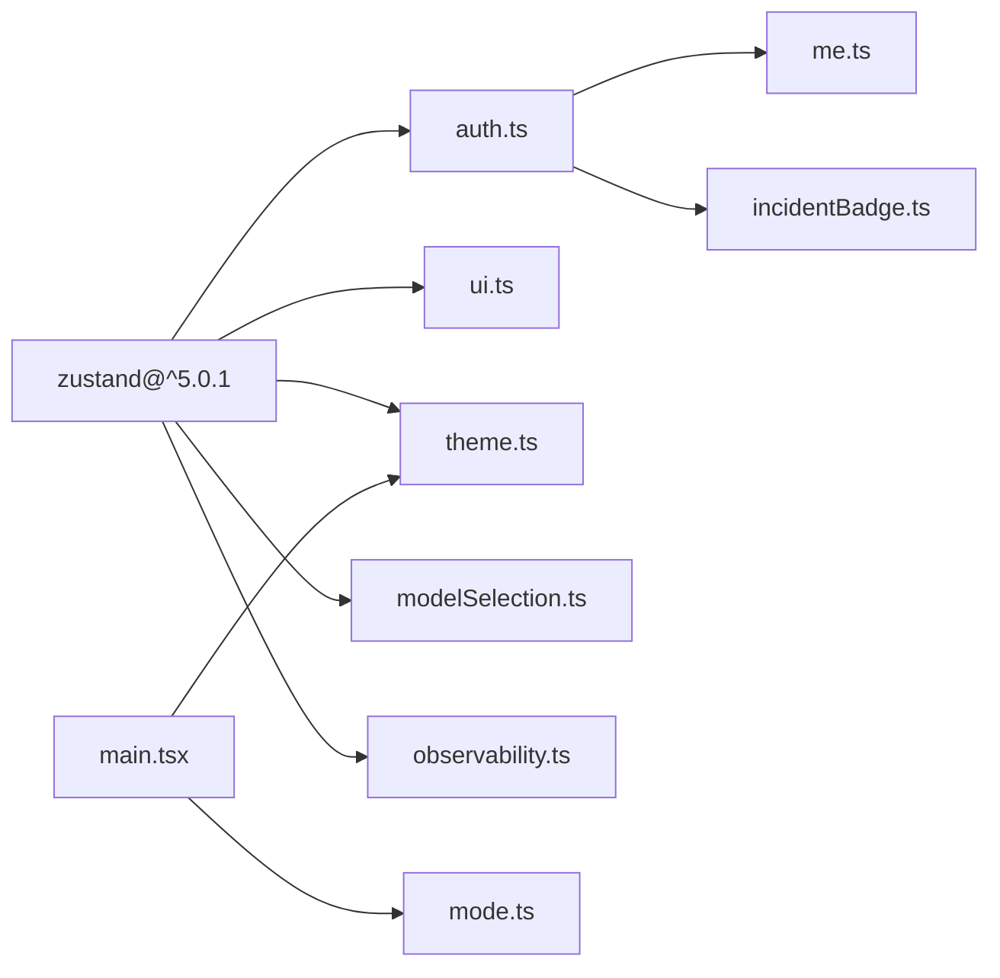

# 状态管理模式

<cite>
**本文引用的文件**
- [web/src/store/auth.ts](file://web/src/store/auth.ts)
- [web/src/store/me.ts](file://web/src/store/me.ts)
- [web/src/store/ui.ts](file://web/src/store/ui.ts)
- [web/src/store/theme.ts](file://web/src/store/theme.ts)
- [web/src/store/mode.ts](file://web/src/store/mode.ts)
- [web/src/store/chatSessions.ts](file://web/src/store/chatSessions.ts)
- [web/src/store/incidentBadge.ts](file://web/src/store/incidentBadge.ts)
- [web/src/store/modelSelection.ts](file://web/src/store/modelSelection.ts)
- [web/src/store/observability.ts](file://web/src/store/observability.ts)
- [web/src/main.tsx](file://web/src/main.tsx)
- [web/package.json](file://web/package.json)
</cite>

## 目录
1. [简介](#简介)
2. [项目结构](#项目结构)
3. [核心组件](#核心组件)
4. [架构总览](#架构总览)
5. [详细组件分析](#详细组件分析)
6. [依赖关系分析](#依赖关系分析)
7. [性能考量](#性能考量)
8. [故障排查指南](#故障排查指南)
9. [结论](#结论)
10. [附录](#附录)

## 简介
本文件系统化梳理 OnGrid 前端在 Zustand 上的状态管理模式与架构原则，覆盖 store 模块化设计、命名规范、选择器使用技巧、中间件实践、调试与开发辅助、测试策略、Mock 数据管理以及状态迁移与版本兼容等主题。目标是帮助开发者以一致的方式扩展与维护全局状态，兼顾可读性、可测性与性能。

## 项目结构
OnGrid 前端将全局状态按领域拆分为独立的 store 模块，统一位于 web/src/store 下；每个 store 聚焦单一职责（认证、用户信息、UI 布局、主题、聊天会话、告警徽章、模型选择、可观测性配置等），并通过 React Hook 暴露给组件消费。应用启动时，main.tsx 会同步应用持久化的主题与强调色，避免首屏闪烁。

图表来源
- [web/src/main.tsx:1-26](file://web/src/main.tsx#L1-L26)
- [web/src/store/auth.ts:1-50](file://web/src/store/auth.ts#L1-L50)
- [web/src/store/me.ts:1-114](file://web/src/store/me.ts#L1-L114)
- [web/src/store/ui.ts:1-39](file://web/src/store/ui.ts#L1-L39)
- [web/src/store/theme.ts:1-98](file://web/src/store/theme.ts#L1-L98)
- [web/src/store/mode.ts:1-98](file://web/src/store/mode.ts#L1-L98)
- [web/src/store/chatSessions.ts:1-34](file://web/src/store/chatSessions.ts#L1-L34)
- [web/src/store/incidentBadge.ts:1-59](file://web/src/store/incidentBadge.ts#L1-L59)
- [web/src/store/modelSelection.ts:1-32](file://web/src/store/modelSelection.ts#L1-L32)
- [web/src/store/observability.ts:1-43](file://web/src/store/observability.ts#L1-L43)

章节来源
- [web/src/main.tsx:1-26](file://web/src/main.tsx#L1-L26)
- [web/package.json:1-53](file://web/package.json#L1-L53)

## 核心组件
- 认证状态（auth）：维护 token、刷新令牌、角色与邮箱，提供设置会话与登出方法，并持久化到 localStorage。
- 当前用户信息（me）：缓存 /v1/me 响应，支持单飞请求去重、加载态与错误态，并在 token 变化时自动清理或拉取。
- UI 状态（ui）：侧边栏折叠、命令面板与 Agent 侧面板开关，部分字段持久化，部分仅内存态。
- 主题偏好（mode）：系统/亮/暗三档，通过 data-theme 与 class 切换，支持系统主题跟随。
- 强调色（theme）：品牌强调色预设，写入 CSS 自定义属性，持久化且首屏前应用。
- 聊天会话（chatSessions）：侧边栏会话列表的单一事实源，提供刷新与失效接口。
- 告警徽章（incidentBadge）：未确认告警计数轮询，受认证状态控制，避免无 token 时的 401 风暴。
- 模型选择（modelSelection）：跨页面共享的聊天模型选择，默认 null 以便回退到服务端默认。
- 可观测性（observability）：Grafana 深度链接相关配置，持久化并提供重置能力。

章节来源
- [web/src/store/auth.ts:1-50](file://web/src/store/auth.ts#L1-L50)
- [web/src/store/me.ts:1-114](file://web/src/store/me.ts#L1-L114)
- [web/src/store/ui.ts:1-39](file://web/src/store/ui.ts#L1-L39)
- [web/src/store/theme.ts:1-98](file://web/src/store/theme.ts#L1-L98)
- [web/src/store/mode.ts:1-98](file://web/src/store/mode.ts#L1-L98)
- [web/src/store/chatSessions.ts:1-34](file://web/src/store/chatSessions.ts#L1-L34)
- [web/src/store/incidentBadge.ts:1-59](file://web/src/store/incidentBadge.ts#L1-L59)
- [web/src/store/modelSelection.ts:1-32](file://web/src/store/modelSelection.ts#L1-L32)
- [web/src/store/observability.ts:1-43](file://web/src/store/observability.ts#L1-L43)

## 架构总览
整体采用“领域驱动 + 最小持久化”的原则：
- 每个 store 只负责一个业务域的状态与副作用。
- 需要跨会话保留的设置（如主题、强调色、UI 布局、模型选择、可观测性配置）使用 persist 中间件持久化到 localStorage。
- 运行时态（如 loading、error、inflight、定时器句柄）保持内存态，避免污染持久存储。
- 对网络请求进行封装与去重（如 me 的单飞），减少重复请求与竞态。
- 应用启动阶段在 React 渲染之前同步应用主题与强调色，避免首屏闪烁。

图表来源
- [web/src/main.tsx:1-26](file://web/src/main.tsx#L1-L26)
- [web/src/store/theme.ts:1-98](file://web/src/store/theme.ts#L1-L98)
- [web/src/store/mode.ts:1-98](file://web/src/store/mode.ts#L1-L98)
- [web/src/store/me.ts:1-114](file://web/src/store/me.ts#L1-L114)
- [web/src/store/chatSessions.ts:1-34](file://web/src/store/chatSessions.ts#L1-L34)
- [web/src/store/incidentBadge.ts:1-59](file://web/src/store/incidentBadge.ts#L1-L59)

## 详细组件分析

### 认证状态（auth）
- 职责：维护登录态、令牌与角色信息，提供 setSession 与 logout。
- 持久化：使用 persist 中间件将认证信息保存到 localStorage，键名为 ongrid.auth。
- 导出工具：提供 getToken 与 getRefreshToken 便捷读取。

图表来源
- [web/src/store/auth.ts:1-50](file://web/src/store/auth.ts#L1-L50)

章节来源
- [web/src/store/auth.ts:1-50](file://web/src/store/auth.ts#L1-L50)

### 当前用户信息（me）
- 职责：缓存 /v1/me 响应，提供 loading/error/inflight 状态与 refresh 能力。
- 单飞机制：多个组件同时挂载时只发一次请求，避免并发风暴。
- 生命周期：当 token 为空时自动清空缓存；有 token 且未加载时自动拉取。
- 权限派生：usePermissions 基于 me.role 与 auth.role 推导可用权限，避免首屏闪烁。

图表来源
- [web/src/store/me.ts:1-114](file://web/src/store/me.ts#L1-L114)

章节来源
- [web/src/store/me.ts:1-114](file://web/src/store/me.ts#L1-L114)

### UI 状态（ui）
- 职责：侧边栏折叠、命令面板与 Agent 侧面板开关。
- 持久化策略：仅持久化 sidebarCollapsed，其他为瞬时态，避免污染本地存储。
- 使用方式：通过 setXxx 与 toggleXxx 方法从任意位置触发 UI 行为。

图表来源
- [web/src/store/ui.ts:1-39](file://web/src/store/ui.ts#L1-L39)

章节来源
- [web/src/store/ui.ts:1-39](file://web/src/store/ui.ts#L1-L39)

### 主题偏好（mode）
- 职责：管理 system/light/dark 三档偏好，同步到 data-theme 与 class，支持系统主题跟随。
- 启动期应用：applyThemeOnBoot 在 React 挂载前执行，避免闪烁。
- 事件通知：通过自定义事件通知订阅者切换主题。

图表来源
- [web/src/main.tsx:1-26](file://web/src/main.tsx#L1-L26)
- [web/src/store/mode.ts:1-98](file://web/src/store/mode.ts#L1-L98)

章节来源
- [web/src/store/mode.ts:1-98](file://web/src/store/mode.ts#L1-L98)

### 强调色（theme）
- 职责：维护 accentId 与预设集合，写入 --accent CSS 变量供 Tailwind 使用。
- 启动期应用：applyAccentOnBoot 直接读取 localStorage 并写入样式，避免首帧闪烁。
- 兼容性：若 id 不匹配任何预设则忽略，防止旧数据导致异常。

图表来源
- [web/src/store/theme.ts:1-98](file://web/src/store/theme.ts#L1-L98)
- [web/src/main.tsx:1-26](file://web/src/main.tsx#L1-L26)

章节来源
- [web/src/store/theme.ts:1-98](file://web/src/store/theme.ts#L1-L98)

### 聊天会话（chatSessions）
- 职责：维护会话列表与加载态，提供 refresh 与 invalidateChatSessions 触发刷新。
- 使用场景：创建新会话或发送首条消息后调用失效函数，使侧边栏无需整页刷新即可更新。

图表来源
- [web/src/store/chatSessions.ts:1-34](file://web/src/store/chatSessions.ts#L1-L34)

章节来源
- [web/src/store/chatSessions.ts:1-34](file://web/src/store/chatSessions.ts#L1-L34)

### 告警徽章（incidentBadge）
- 职责：每 30 秒轮询未确认告警数量，供侧边栏展示红点与计数。
- 安全策略：若无 token 则停止轮询，避免 401 风暴。
- 资源管理：暴露 start/stop 便于测试与 HMR 重置。

图表来源
- [web/src/store/incidentBadge.ts:1-59](file://web/src/store/incidentBadge.ts#L1-L59)
- [web/src/store/auth.ts:1-50](file://web/src/store/auth.ts#L1-L50)

章节来源
- [web/src/store/incidentBadge.ts:1-59](file://web/src/store/incidentBadge.ts#L1-L59)
- [web/src/store/auth.ts:1-50](file://web/src/store/auth.ts#L1-L50)

### 模型选择（modelSelection）
- 职责：跨页面共享聊天模型选择，默认 null 以回退到服务端默认。
- 持久化：使用 persist 中间件保存用户选择，避免导航丢失。

章节来源
- [web/src/store/modelSelection.ts:1-32](file://web/src/store/modelSelection.ts#L1-L32)

### 可观测性（observability）
- 职责：维护 Grafana 深度链接所需配置（base URL、数据源 UID、仪表板 UID、组织 ID）。
- 能力：支持局部 patch 与一键重置为默认值。

章节来源
- [web/src/store/observability.ts:1-43](file://web/src/store/observability.ts#L1-L43)

## 依赖关系分析
- 外部依赖：Zustand 作为状态库，配合 persist 与 createJSONStorage 中间件实现持久化。
- 内部依赖：store 之间通过导入彼此的最小必要接口（如 incidentBadge 依赖 auth 的 token 判断）。
- 启动顺序：main.tsx 先应用主题与强调色，再渲染 App，确保首屏体验。

图表来源
- [web/package.json:1-53](file://web/package.json#L1-L53)
- [web/src/main.tsx:1-26](file://web/src/main.tsx#L1-L26)
- [web/src/store/auth.ts:1-50](file://web/src/store/auth.ts#L1-L50)
- [web/src/store/me.ts:1-114](file://web/src/store/me.ts#L1-L114)
- [web/src/store/ui.ts:1-39](file://web/src/store/ui.ts#L1-L39)
- [web/src/store/theme.ts:1-98](file://web/src/store/theme.ts#L1-L98)
- [web/src/store/mode.ts:1-98](file://web/src/store/mode.ts#L1-L98)
- [web/src/store/modelSelection.ts:1-32](file://web/src/store/modelSelection.ts#L1-L32)
- [web/src/store/observability.ts:1-43](file://web/src/store/observability.ts#L1-L43)
- [web/src/store/incidentBadge.ts:1-59](file://web/src/store/incidentBadge.ts#L1-L59)

章节来源
- [web/package.json:1-53](file://web/package.json#L1-L53)

## 性能考量
- 选择器粒度：在组件中仅订阅需要的字段，避免不必要的重渲染（例如 useMeStore((s)=>s.me)）。
- 持久化范围：仅持久化必要的结构化配置（如 sidebarCollapsed、accentId、grafana 配置），避免持久化瞬时态。
- 请求去重：me 的单飞机制减少并发请求与重复计算。
- 轮询节流：告警徽章固定间隔轮询，且在无 token 时停止，降低无效请求。
- 首屏优化：主题与强调色在 React 渲染前写入 DOM，避免闪烁。

[本节为通用指导，不直接分析具体文件]

## 故障排查指南
- 主题/强调色未生效
  - 检查 main.tsx 是否在渲染前调用 applyThemeOnBoot 与 applyAccentOnBoot。
  - 检查 localStorage 中的 key 是否正确（如 ongrid.theme、ongrid.ui）。
- 用户信息未刷新
  - 确认 token 已正确设置；me 会在 token 变化时自动清理与拉取。
  - 检查 loadMe 的错误分支是否记录了错误消息。
- 告警徽章不更新
  - 确认存在 token；否则轮询会被跳过。
  - 检查 _timer 是否被意外清理（测试/HMR 场景）。
- 侧边栏折叠状态丢失
  - 确认 partialize 仅持久化了 sidebarCollapsed，其他字段不应持久化。

章节来源
- [web/src/main.tsx:1-26](file://web/src/main.tsx#L1-L26)
- [web/src/store/me.ts:1-114](file://web/src/store/me.ts#L1-L114)
- [web/src/store/incidentBadge.ts:1-59](file://web/src/store/incidentBadge.ts#L1-L59)
- [web/src/store/ui.ts:1-39](file://web/src/store/ui.ts#L1-L39)
- [web/src/store/theme.ts:1-98](file://web/src/store/theme.ts#L1-L98)

## 结论
OnGrid 的前端状态管理以 Zustand 为核心，遵循“领域拆分、最小持久化、启动期同步样式、请求去重与轮询节流”的原则。通过清晰的 store 边界与一致的命名约定，既保证了可维护性，也兼顾了性能与用户体验。建议在新增功能时沿用既有模式，优先使用选择器精确订阅、谨慎持久化、合理封装副作用，并在测试中利用 store 的 getState 与中间件提供的能力进行 Mock 与断言。

[本节为总结性内容，不直接分析具体文件]

## 附录

### 最佳实践与规范
- 命名规范
  - store 文件名使用小写名词短语（如 auth.ts、me.ts、ui.ts）。
  - 导出 Hook 使用 useXxx 形式（如 useAuth、useMe、useUi）。
  - 持久化键名使用 ongrid.<domain> 前缀（如 ongrid.auth、ongrid.ui、ongrid.theme）。
- 模块化设计
  - 每个 store 只负责一个领域；跨领域依赖通过最小接口引入。
  - 将副作用（网络请求、定时器）集中在 store 内或独立函数中，避免散落在组件里。
- 选择器与性能
  - 在组件中使用细粒度选择器，仅订阅变更所需的字段。
  - 对复杂派生数据可使用 useMemo 或在 store 中预计算。
- 中间件使用
  - 使用 persist 与 createJSONStorage 进行持久化；必要时使用 partialize 缩小持久化范围。
  - 如需日志、时间旅行等调试能力，可在开发环境组合 devtools 中间件（本项目未启用，可按需添加）。
- 调试与开发辅助
  - 在浏览器控制台通过 useXxx.getState() 读取状态快照。
  - 结合 vitest 与 msw 进行单元测试与接口模拟。
- 测试策略与 Mock
  - 使用 useXxx.getState().set(...) 直接修改状态进行断言。
  - 使用 MSW 拦截 API 请求，验证 store 在不同响应下的行为。
- 状态迁移与版本兼容
  - 对持久化字段增加校验与降级逻辑（如 theme 中对未知 accentId 的忽略）。
  - 在升级时可通过一次性迁移脚本清理或转换旧格式，保证向后兼容。

[本节为通用指导，不直接分析具体文件]