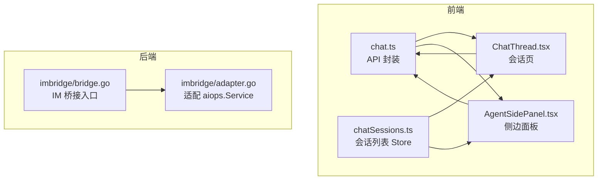
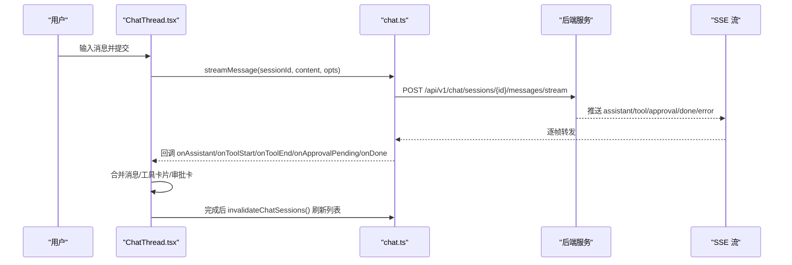
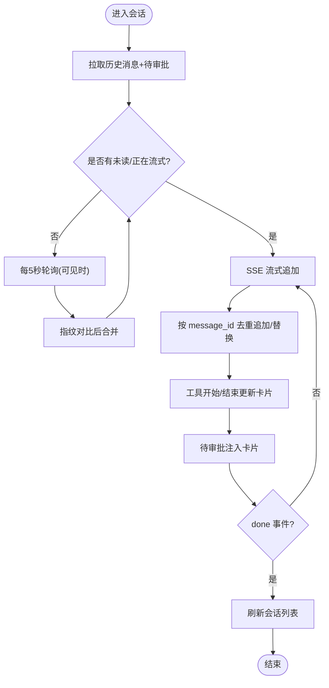
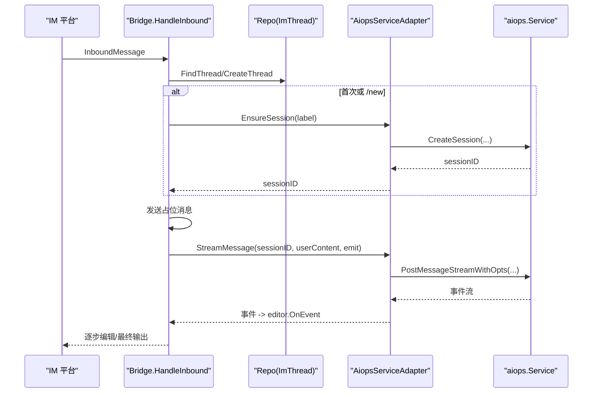
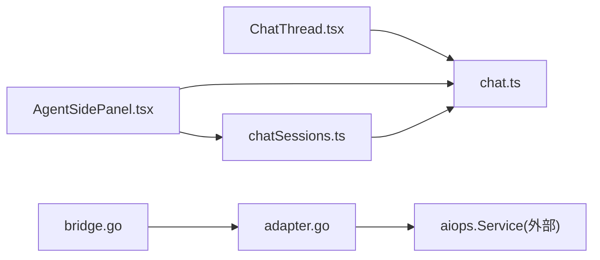

# 聊天会话状态

<cite>
**本文引用的文件**
- [web/src/store/chatSessions.ts](file://web/src/store/chatSessions.ts)
- [web/src/api/chat.ts](file://web/src/api/chat.ts)
- [web/src/pages/ChatThread.tsx](file://web/src/pages/ChatThread.tsx)
- [web/src/components/AgentSidePanel.tsx](file://web/src/components/AgentSidePanel.tsx)
- [internal/manager/biz/imbridge/bridge.go](file://internal/manager/biz/imbridge/bridge.go)
- [internal/manager/biz/imbridge/adapter.go](file://internal/manager/biz/imbridge/adapter.go)
</cite>

## 目录
1. [简介](#简介)
2. [项目结构](#项目结构)
3. [核心组件](#核心组件)
4. [架构总览](#架构总览)
5. [详细组件分析](#详细组件分析)
6. [依赖关系分析](#依赖关系分析)
7. [性能考虑](#性能考虑)
8. [故障排查指南](#故障排查指南)
9. [结论](#结论)
10. [附录](#附录)

## 简介
本文件聚焦于“聊天会话状态管理”的前后端实现与交互机制，覆盖以下主题：
- 会话列表、消息存储与切换逻辑
- 会话的创建、更新、删除与状态同步
- 消息的实时推送（SSE）与历史记录加载策略
- 会话数据的持久化与缓存优化
- 聊天界面中的状态使用示例与性能优化技巧
- 并发处理与冲突解决（含 IM 桥接路径）

## 项目结构
前端侧围绕三个关键模块组织：
- API 层：定义会话与消息的数据模型、HTTP/SSE 接口封装
- Store 层：维护会话列表的全局状态并提供刷新能力
- 页面与组件：承载会话切换、消息渲染、流式事件处理与 UI 交互

后端侧通过 IM 桥接将外部 IM 平台的消息映射到统一的聊天会话，驱动 Agent 运行并流式回写。

图表来源
- [web/src/api/chat.ts](file://web/src/api/chat.ts)
- [web/src/store/chatSessions.ts](file://web/src/store/chatSessions.ts)
- [web/src/pages/ChatThread.tsx](file://web/src/pages/ChatThread.tsx)
- [web/src/components/AgentSidePanel.tsx](file://web/src/components/AgentSidePanel.tsx)
- [internal/manager/biz/imbridge/bridge.go](file://internal/manager/biz/imbridge/bridge.go)
- [internal/manager/biz/imbridge/adapter.go](file://internal/manager/biz/imbridge/adapter.go)

章节来源
- [web/src/api/chat.ts](file://web/src/api/chat.ts)
- [web/src/store/chatSessions.ts](file://web/src/store/chatSessions.ts)
- [web/src/pages/ChatThread.tsx](file://web/src/pages/ChatThread.tsx)
- [web/src/components/AgentSidePanel.tsx](file://web/src/components/AgentSidePanel.tsx)
- [internal/manager/biz/imbridge/bridge.go](file://internal/manager/biz/imbridge/bridge.go)
- [internal/manager/biz/imbridge/adapter.go](file://internal/manager/biz/imbridge/adapter.go)

## 核心组件
- 数据模型与 HTTP/SSE 封装
  - 会话 ChatSession、消息 ChatMessage、工具调用 ToolCallSummary、流事件类型等
  - REST 接口：列出/创建/重命名/删除会话；获取消息；停止会话
  - SSE 接口：streamMessage 提供 assistant/tool/approval/done/error 事件
- 会话列表 Store
  - 单一来源维护 sessions 列表与 loading 状态
  - 提供 refresh() 与 invalidateChatSessions() 触发全局刷新
- 会话页 ChatThread
  - 历史消息拉取 + 5s 轮询增量同步
  - SSE 流式追加消息与工具卡片
  - Esc 中断当前回合（本地 Abort + 服务端 stop）
- 侧边面板 AgentSidePanel
  - 首次发送时懒创建会话，自动刷新会话列表
- IM 桥接 imbridge
  - 将 IM 平台消息映射为 ongrid 会话，支持 /new 重置会话
  - 适配器对接 aiops.Service，复用统一 LLM 默认模型解析

章节来源
- [web/src/api/chat.ts](file://web/src/api/chat.ts)
- [web/src/store/chatSessions.ts](file://web/src/store/chatSessions.ts)
- [web/src/pages/ChatThread.tsx](file://web/src/pages/ChatThread.tsx)
- [web/src/components/AgentSidePanel.tsx](file://web/src/components/AgentSidePanel.tsx)
- [internal/manager/biz/imbridge/bridge.go](file://internal/manager/biz/imbridge/bridge.go)
- [internal/manager/biz/imbridge/adapter.go](file://internal/manager/biz/imbridge/adapter.go)

## 架构总览
前后端通过 REST 与 SSE 协作完成会话与消息的状态流转。IM 桥接作为额外入口，将外部消息纳入同一会话体系。

图表来源
- [web/src/pages/ChatThread.tsx](file://web/src/pages/ChatThread.tsx)
- [web/src/api/chat.ts](file://web/src/api/chat.ts)

## 详细组件分析

### 数据模型与接口（chat.ts）
- 会话与会话列表
  - listSessions：按可选 related_incident_id 过滤，返回 items 与 total
  - createSession：创建新会话，支持 title、scope、related_incident_id、agent_id
  - renameSession：重命名会话标题
  - deleteSession：硬删除会话及其所有消息
- 消息与工具调用
  - getMessages：获取会话消息列表
  - postMessage：非流式发送（用于侧边面板快速回复）
  - ToolCallSummary：携带 name/device_id/status/duration_ms/error/arguments/result 等
- SSE 流式事件
  - AssistantStreamEvent：assistant 文本片段，包含 message_id/iteration/content/created_at/pending_tool_calls
  - ToolStreamEvent：工具开始/结束事件，含 tool_call_id/name/status/duration_ms/arguments/result 等
  - ApprovalPendingStreamEvent：云命令待人工审批事件，含 approval_id/command/credentials
  - StreamCallbacks：onAssistant/onToolStart/onToolEnd/onApprovalPending/onDone/onError
  - streamMessage：基于 fetch + ReadableStream 解析 SSE 帧，分派到回调

章节来源
- [web/src/api/chat.ts](file://web/src/api/chat.ts)

### 会话列表 Store（chatSessions.ts）
- 状态字段
  - sessions：会话数组
  - loading：是否加载中
- 方法
  - refresh()：调用 listSessions 并写入 sessions，异常时仅恢复 loading=false
  - invalidateChatSessions()：从任意位置触发刷新，利用 React 批量更新去抖

章节来源
- [web/src/store/chatSessions.ts](file://web/src/store/chatSessions.ts)

### 会话页状态机与流程（ChatThread.tsx）
- 初始加载与轮询
  - 首屏拉取 getMessages 与 pending approvals，合并后 setMessages
  - 每 5 秒轮询一次，仅在可见且无本地 SSE 流时执行
  - 指纹对比避免无变化时的重复渲染
- 发送与流式追加
  - 乐观插入用户气泡
  - 根据 assistant 事件追加或替换助手消息（以 message_id 去重）
  - 工具开始/结束事件生成/更新工具卡片
  - 待审批事件注入 pending_approval 结果，渲染审批卡片
  - done 回调后刷新会话列表
- 中断与错误处理
  - Esc 同时发起 stopSession 与 AbortController.abort
  - AbortError 视为“有意停止”，保留已持久化的部分对话
  - 其他错误插入错误提示气泡
- 滚动行为
  - stickToBottomRef 记录用户是否主动上滚，控制自动滚动到底部

图表来源
- [web/src/pages/ChatThread.tsx](file://web/src/pages/ChatThread.tsx)
- [web/src/api/chat.ts](file://web/src/api/chat.ts)

章节来源
- [web/src/pages/ChatThread.tsx](file://web/src/pages/ChatThread.tsx)

### 侧边面板懒创建与会话切换（AgentSidePanel.tsx）
- 首次发送时若 sessionId 为空，则调用 createSession 创建会话，设置 agent_id='default'
- 成功后更新本地 sessionId 并调用 invalidateChatSessions() 刷新列表
- 非流式 postMessage 直接获得 assistant_message.content 回填到消息气泡
- 打开完整会话页时导航至 /chat/:sessionId

章节来源
- [web/src/components/AgentSidePanel.tsx](file://web/src/components/AgentSidePanel.tsx)
- [web/src/api/chat.ts](file://web/src/api/chat.ts)

### IM 桥接与会话生命周期（bridge.go + adapter.go）
- 会话映射规则
  - 每个 (im_app_id, im_chat_id, thread_id) 对应一个 ongrid 会话
  - 会话稳定存在，不会因空闲自动旋转；支持 /new 重置会话
- 处理流程
  - 去重：基于 provider:app_id:event_id 防止重复投递
  - 解析 app 与 thread，不存在则新建并绑定新会话
  - 发送占位消息，随后调用 agent.StreamMessage 驱动 Agent
  - 流式编辑 IM 消息，最终 Flush 输出
- 适配器职责
  - EnsureSession：为 IM 线程创建 ongrid 会话
  - StreamMessage：透传事件到上层 AIOPS 服务
  - runOptions：读取集群默认 LLM 提供商与模型，保证 IM 与 SPA 一致

图表来源
- [internal/manager/biz/imbridge/bridge.go](file://internal/manager/biz/imbridge/bridge.go)
- [internal/manager/biz/imbridge/adapter.go](file://internal/manager/biz/imbridge/adapter.go)

章节来源
- [internal/manager/biz/imbridge/bridge.go](file://internal/manager/biz/imbridge/bridge.go)
- [internal/manager/biz/imbridge/adapter.go](file://internal/manager/biz/imbridge/adapter.go)

## 依赖关系分析
- 前端
  - ChatThread.tsx 依赖 chat.ts 的 getMessages/streamMessage/postMessage 等
  - AgentSidePanel.tsx 依赖 chat.ts 的 createSession/postMessage 与 store 的 invalidateChatSessions
  - chatSessions.ts 依赖 chat.ts 的 listSessions
- 后端
  - bridge.go 依赖 Repo 与 AgentSession 抽象
  - adapter.go 将 AgentSession 适配到 aiops.Service，并解析默认 LLM 配置

图表来源
- [web/src/pages/ChatThread.tsx](file://web/src/pages/ChatThread.tsx)
- [web/src/components/AgentSidePanel.tsx](file://web/src/components/AgentSidePanel.tsx)
- [web/src/store/chatSessions.ts](file://web/src/store/chatSessions.ts)
- [web/src/api/chat.ts](file://web/src/api/chat.ts)
- [internal/manager/biz/imbridge/bridge.go](file://internal/manager/biz/imbridge/bridge.go)
- [internal/manager/biz/imbridge/adapter.go](file://internal/manager/biz/imbridge/adapter.go)

## 性能考虑
- 历史消息轮询优化
  - 指纹对比（长度/最后一条 id/内容长度/待审批 id 集合）避免无变化时的重渲染
  - 仅在标签页可见且无本地 SSE 流时轮询，降低无效请求
- SSE 流式渲染
  - 基于 message_id 去重，避免重复插入
  - 工具卡片在开始/结束事件中就地更新，减少 DOM 抖动
- 会话列表缓存
  - 使用 Zustand 单例 store，invalidateChatSessions 触发批量更新，避免整页刷新
- 网络与资源
  - 侧边面板懒创建会话，减少不必要的会话初始化
  - 模型目录一次性加载，会话内复用选择

[本节为通用指导，不直接分析具体文件]

## 故障排查指南
- 发送失败
  - 检查 streamMessage 的错误分支与 ApiError 信息
  - 确认 Authorization 头是否正确传递
- 中断后状态不一致
  - Esc 会同时调用 stopSession 与 AbortController.abort
  - 保留部分对话，等待下一次轮询与历史拉取进行对账
- 工具审批卡片丢失
  - 刷新后会重建 pending cloud_bash 审批卡片（来自待审批收件箱）
  - 若无权限，收件箱返回空，卡片不再显示
- 会话列表未更新
  - 确保在创建/更新会话后调用 invalidateChatSessions()
  - 检查 listSessions 返回值是否为空或异常

章节来源
- [web/src/pages/ChatThread.tsx](file://web/src/pages/ChatThread.tsx)
- [web/src/api/chat.ts](file://web/src/api/chat.ts)
- [web/src/store/chatSessions.ts](file://web/src/store/chatSessions.ts)

## 结论
该方案以前端 SSE 流式渲染为核心，结合轻量轮询与指纹对比，实现了低延迟、高一致性的聊天体验。会话列表通过集中 Store 管理，配合失效刷新策略，避免了全量刷新带来的性能损耗。IM 桥接将外部消息无缝接入统一会话体系，并通过适配器复用现有 AIOPS 服务与默认模型配置，保证了多入口的一致性。整体设计在并发与冲突处理上采用去重、指纹对比与乐观更新等手段，兼顾了用户体验与系统稳定性。

[本节为总结性内容，不直接分析具体文件]

## 附录
- 关键 API 路径参考
  - GET /chat/sessions
  - POST /chat/sessions
  - PATCH /chat/sessions/{id}
  - DELETE /chat/sessions/{id}
  - GET /chat/sessions/{id}/messages
  - POST /chat/sessions/{id}/stop
  - POST /api/v1/chat/sessions/{id}/messages/stream

章节来源
- [web/src/api/chat.ts](file://web/src/api/chat.ts)