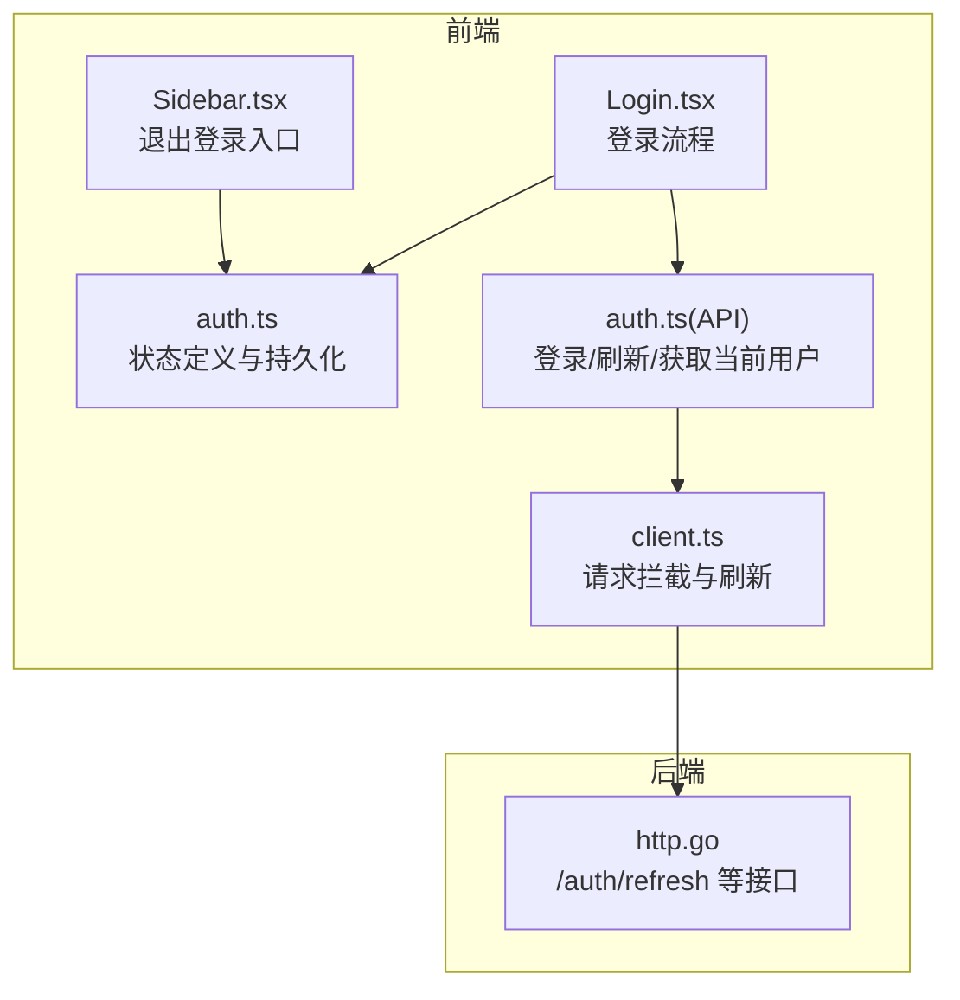
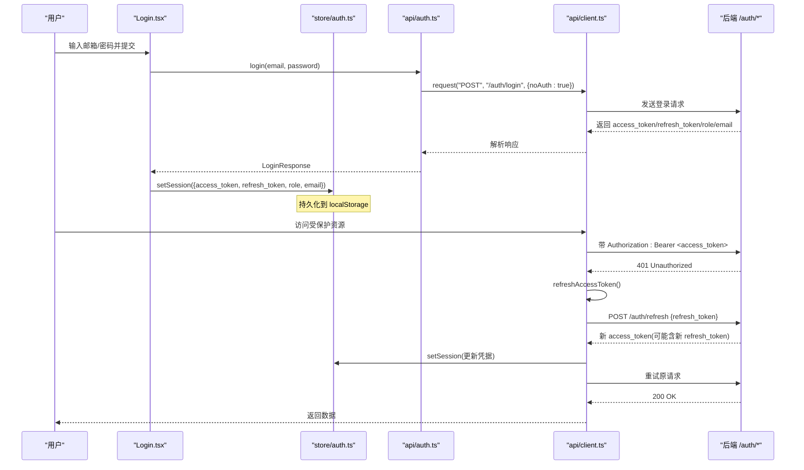
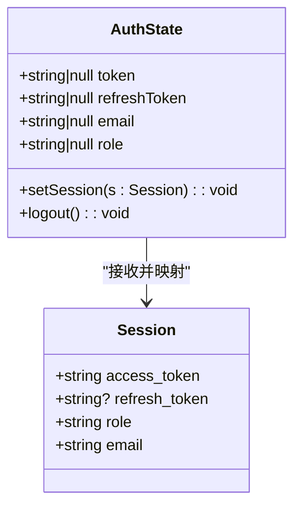
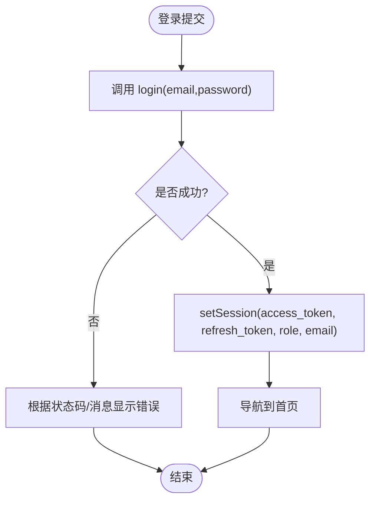
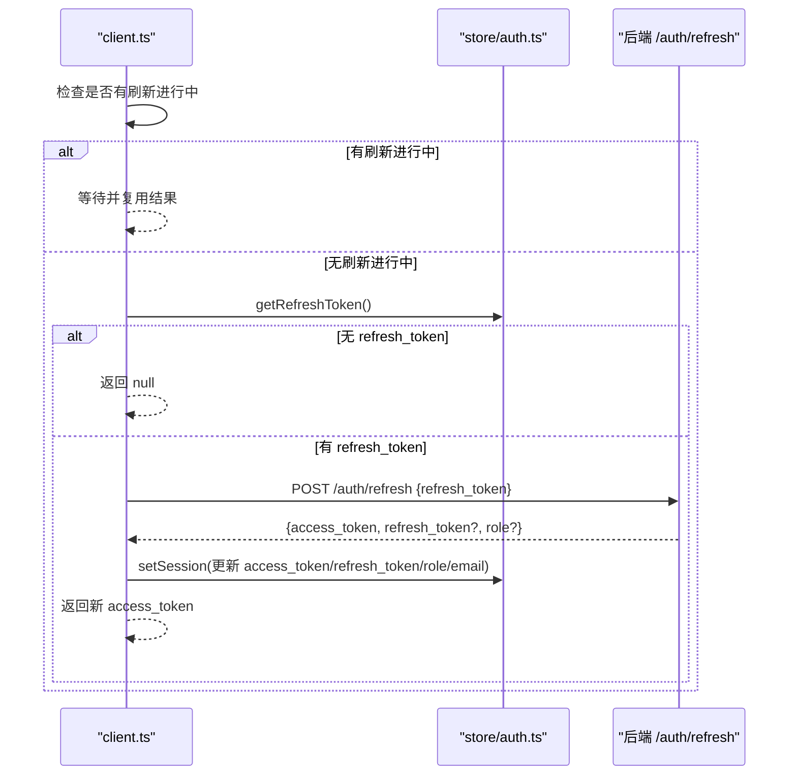
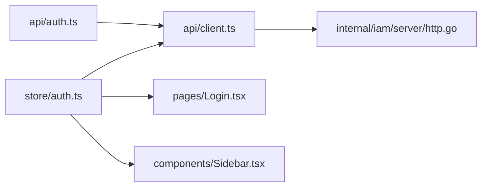

# 认证状态管理

<cite>
**本文引用的文件**   
- [web/src/store/auth.ts](file://web/src/store/auth.ts)
- [web/src/api/client.ts](file://web/src/api/client.ts)
- [web/src/api/auth.ts](file://web/src/api/auth.ts)
- [web/src/pages/Login.tsx](file://web/src/pages/Login.tsx)
- [web/src/components/Sidebar.tsx](file://web/src/components/Sidebar.tsx)
- [internal/iam/server/http.go](file://internal/iam/server/http.go)
- [tests/e2e/auth_refresh_test.go](file://tests/e2e/auth_refresh_test.go)
</cite>

## 目录
1. [简介](#简介)
2. [项目结构](#项目结构)
3. [核心组件](#核心组件)
4. [架构总览](#架构总览)
5. [详细组件分析](#详细组件分析)
6. [依赖关系分析](#依赖关系分析)
7. [性能与并发特性](#性能与并发特性)
8. [错误处理与异常场景](#错误处理与异常场景)
9. [最佳实践与使用示例](#最佳实践与使用示例)
10. [结论](#结论)

## 简介
本文件聚焦于前端认证状态管理的实现与使用，覆盖以下主题：
- Session 类型定义、AuthState 状态结构与持久化机制
- setSession 与 logout 方法的使用方式与参数规范
- Token 刷新机制与会话管理策略
- localStorage 持久化的配置与安全考虑
- 在组件中的使用示例与最佳实践
- 错误处理与异常情况的处理方案

## 项目结构
认证相关的前端代码主要分布在以下位置：
- 状态存储与持久化：web/src/store/auth.ts
- HTTP 客户端与自动刷新：web/src/api/client.ts
- 认证 API 封装：web/src/api/auth.ts
- 登录页面与登出入口：web/src/pages/Login.tsx、web/src/components/Sidebar.tsx
- 后端刷新接口与 E2E 测试：internal/iam/server/http.go、tests/e2e/auth_refresh_test.go

图表来源
- [web/src/store/auth.ts:1-50](file://web/src/store/auth.ts#L1-L50)
- [web/src/api/client.ts:1-163](file://web/src/api/client.ts#L1-L163)
- [web/src/api/auth.ts:1-30](file://web/src/api/auth.ts#L1-L30)
- [web/src/pages/Login.tsx:1-134](file://web/src/pages/Login.tsx#L1-L134)
- [web/src/components/Sidebar.tsx:1-800](file://web/src/components/Sidebar.tsx#L1-L800)
- [internal/iam/server/http.go:271-327](file://internal/iam/server/http.go#L271-L327)

章节来源
- [web/src/store/auth.ts:1-50](file://web/src/store/auth.ts#L1-L50)
- [web/src/api/client.ts:1-163](file://web/src/api/client.ts#L1-L163)
- [web/src/api/auth.ts:1-30](file://web/src/api/auth.ts#L1-L30)
- [web/src/pages/Login.tsx:1-134](file://web/src/pages/Login.tsx#L1-L134)
- [web/src/components/Sidebar.tsx:1-800](file://web/src/components/Sidebar.tsx#L1-L800)
- [internal/iam/server/http.go:271-327](file://internal/iam/server/http.go#L271-L327)

## 核心组件
- Session 类型：包含 access_token、可选 refresh_token、role、email。用于描述一次会话的凭据与用户信息。
- AuthState 状态：暴露 token、refreshToken、email、role 四个字段，以及 setSession(s: Session)、logout() 两个方法。
- 持久化：通过 zustand/middleware 的 persist 与 createJSONStorage 将状态写入 localStorage，键名为 ongrid.auth。
- 辅助函数：getToken()、getRefreshToken() 用于从全局状态读取当前凭据。

章节来源
- [web/src/store/auth.ts:4-18](file://web/src/store/auth.ts#L4-L18)
- [web/src/store/auth.ts:20-41](file://web/src/store/auth.ts#L20-L41)
- [web/src/store/auth.ts:43-50](file://web/src/store/auth.ts#L43-L50)

## 架构总览
认证状态管理在前端的职责边界清晰：
- 登录成功后，由页面调用 setSession 写入状态并持久化到 localStorage。
- 所有受保护请求统一经过 request 拦截器，若返回 401 且未标记 noAuth，则尝试刷新 access_token；刷新成功则重试原请求，失败则触发 logout。
- 退出登录时，清空状态并跳转至登录页。

图表来源
- [web/src/pages/Login.tsx:19-43](file://web/src/pages/Login.tsx#L19-L43)
- [web/src/api/auth.ts:19-25](file://web/src/api/auth.ts#L19-L25)
- [web/src/api/client.ts:97-115](file://web/src/api/client.ts#L97-L115)
- [web/src/api/client.ts:117-162](file://web/src/api/client.ts#L117-L162)
- [internal/iam/server/http.go:271-288](file://internal/iam/server/http.go#L271-L288)

## 详细组件分析

### 状态模型与持久化（auth.ts）
- Session 类型定义了会话所需的最小字段集合，确保后续刷新与 UI 展示的一致性。
- AuthState 提供 setSession 与 logout 两个原子操作：
  - setSession：将 Session 映射为内部 token、refreshToken、role、email 字段，并触发持久化。
  - logout：清空所有认证相关字段，同时清除持久化数据。
- 持久化配置：
  - name: 'ongrid.auth'
  - storage: createJSONStorage(() => localStorage)
  - 这意味着所有认证凭据均保存在浏览器 localStorage 中，键名固定。

图表来源
- [web/src/store/auth.ts:4-18](file://web/src/store/auth.ts#L4-L18)
- [web/src/store/auth.ts:20-41](file://web/src/store/auth.ts#L20-L41)

章节来源
- [web/src/store/auth.ts:4-18](file://web/src/store/auth.ts#L4-L18)
- [web/src/store/auth.ts:20-41](file://web/src/store/auth.ts#L20-L41)

### 登录流程（Login.tsx + api/auth.ts）
- 登录页提交表单后，调用 login(email, password)，该函数通过 request('POST', '/auth/login', ..., {noAuth: true}) 发起无鉴权请求。
- 成功后，调用 setSession 写入 access_token、refresh_token、role、email，并跳转到首页。
- 如果返回 401，显示“邮箱或密码错误”；其他错误显示通用失败提示。

图表来源
- [web/src/pages/Login.tsx:19-43](file://web/src/pages/Login.tsx#L19-L43)
- [web/src/api/auth.ts:19-21](file://web/src/api/auth.ts#L19-L21)

章节来源
- [web/src/pages/Login.tsx:19-43](file://web/src/pages/Login.tsx#L19-L43)
- [web/src/api/auth.ts:19-21](file://web/src/api/auth.ts#L19-L21)

### 退出登录（Sidebar.tsx）
- 侧边栏用户菜单提供“退出登录”按钮，点击后调用 logout() 清空状态，并导航到 /login。
- 这是唯一需要显式调用 logout 的地方，避免在其他业务组件中重复实现。

章节来源
- [web/src/components/Sidebar.tsx:147-151](file://web/src/components/Sidebar.tsx#L147-L151)

### Token 刷新机制与会话管理（client.ts）
- 当受保护请求收到 401 且非 noAuth 时，进入刷新流程：
  - 若已有刷新请求在进行中，直接复用该 Promise，避免并发刷新风暴。
  - 读取当前 refresh_token，若无则直接失败。
  - 调用 POST /auth/refresh，携带 refresh_token。
  - 若成功，使用返回的 access_token 和可能的 refresh_token 更新状态（role 与 email 保留现有值）。
  - 以新的 access_token 重试原请求一次；若仍失败，抛出错误但不强制登出。
  - 若刷新失败，调用 logout() 清理状态，视为会话过期。
- 刷新接口在后端由 http.go 的 refresh 处理器实现，返回 access_token、refresh_token、expires_in、role。

图表来源
- [web/src/api/client.ts:97-115](file://web/src/api/client.ts#L97-L115)
- [web/src/api/client.ts:117-162](file://web/src/api/client.ts#L117-L162)
- [internal/iam/server/http.go:271-288](file://internal/iam/server/http.go#L271-L288)

章节来源
- [web/src/api/client.ts:97-115](file://web/src/api/client.ts#L97-L115)
- [web/src/api/client.ts:117-162](file://web/src/api/client.ts#L117-L162)
- [internal/iam/server/http.go:271-288](file://internal/iam/server/http.go#L271-L288)

### 后端刷新接口与端到端验证
- 后端 refresh 处理器接收 refresh_token，校验并签发新的 access_token 与 refresh_token，同时返回 role。
- E2E 测试验证了 access_token 过期后，通过 refresh 获得新令牌并继续访问受保护资源的完整路径。

章节来源
- [internal/iam/server/http.go:271-288](file://internal/iam/server/http.go#L271-L288)
- [tests/e2e/auth_refresh_test.go:20-54](file://tests/e2e/auth_refresh_test.go#L20-L54)

## 依赖关系分析
- store/auth.ts 被 client.ts、Login.tsx、Sidebar.tsx 等多处引用，作为单一可信源。
- client.ts 依赖 getToken/getRefreshToken/useAuth 进行鉴权与刷新。
- api/auth.ts 基于 client.ts 封装登录、刷新、获取当前用户等接口。
- 后端 http.go 提供 /auth/refresh 等接口，供前端刷新与鉴权使用。

图表来源
- [web/src/store/auth.ts:1-50](file://web/src/store/auth.ts#L1-L50)
- [web/src/api/client.ts:1-163](file://web/src/api/client.ts#L1-L163)
- [web/src/api/auth.ts:1-30](file://web/src/api/auth.ts#L1-L30)
- [web/src/pages/Login.tsx:1-134](file://web/src/pages/Login.tsx#L1-L134)
- [web/src/components/Sidebar.tsx:1-800](file://web/src/components/Sidebar.tsx#L1-L800)
- [internal/iam/server/http.go:271-327](file://internal/iam/server/http.go#L271-L327)

章节来源
- [web/src/store/auth.ts:1-50](file://web/src/store/auth.ts#L1-L50)
- [web/src/api/client.ts:1-163](file://web/src/api/client.ts#L1-L163)
- [web/src/api/auth.ts:1-30](file://web/src/api/auth.ts#L1-L30)
- [web/src/pages/Login.tsx:1-134](file://web/src/pages/Login.tsx#L1-L134)
- [web/src/components/Sidebar.tsx:1-800](file://web/src/components/Sidebar.tsx#L1-L800)
- [internal/iam/server/http.go:271-327](file://internal/iam/server/http.go#L271-L327)

## 性能与并发特性
- 刷新去抖：通过全局变量控制同一时刻仅有一个刷新请求，避免并发刷新导致的状态竞争与额外网络开销。
- 单次重试：刷新成功后仅重试一次原请求，减少不必要的二次失败风险。
- 本地持久化：Zustand persist 中间件在每次状态变更时同步写入 localStorage，读写开销低，但需注意大对象与频繁更新的权衡。

[本节为通用性能讨论，不直接分析具体文件]

## 错误处理与异常场景
- 登录失败：
  - 401：显示“邮箱或密码错误”。
  - 其他错误：显示通用失败提示。
- 刷新失败：
  - 无 refresh_token：直接返回 null，随后触发 logout。
  - 刷新接口失败：返回 null，随后触发 logout。
  - 刷新成功但重试仍 401：抛出错误但不强制登出，交由上层处理。
- 网络异常：
  - fetch 抛出的 AbortError 会透传，其他错误包装为 ApiError 并带上状态码与消息。

章节来源
- [web/src/pages/Login.tsx:32-42](file://web/src/pages/Login.tsx#L32-L42)
- [web/src/api/client.ts:62-67](file://web/src/api/client.ts#L62-L67)
- [web/src/api/client.ts:97-115](file://web/src/api/client.ts#L97-L115)
- [web/src/api/client.ts:117-162](file://web/src/api/client.ts#L117-L162)

## 最佳实践与使用示例
- 设置会话（setSession）
  - 参数规范：传入 Session 对象，必须包含 access_token、role、email；refresh_token 可选。
  - 典型用法：登录成功后，将后端返回的 access_token、refresh_token、role、email 一并写入。
  - 参考路径：[web/src/pages/Login.tsx:25-30](file://web/src/pages/Login.tsx#L25-L30)
- 退出登录（logout）
  - 作用：清空 token、refreshToken、email、role，并移除持久化数据。
  - 典型用法：用户点击“退出登录”后调用，然后导航到登录页。
  - 参考路径：[web/src/components/Sidebar.tsx:147-151](file://web/src/components/Sidebar.tsx#L147-L151)
- 在组件中使用认证状态
  - 读取当前用户信息：通过 useAuth 订阅 email、role 等字段，用于渲染头像、权限判断等。
  - 参考路径：[web/src/components/Sidebar.tsx:56-62](file://web/src/components/Sidebar.tsx#L56-L62)
- 安全与持久化建议
  - 当前实现将凭据存储在 localStorage，便于跨标签页共享与刷新后恢复，但存在 XSS 泄露风险。
  - 生产环境建议结合 HTTPS、严格 CSP、最小权限原则，并评估改用内存态或更安全存储方案的可行性。
  - 参考路径：[web/src/store/auth.ts:36-41](file://web/src/store/auth.ts#L36-L41)

章节来源
- [web/src/pages/Login.tsx:25-30](file://web/src/pages/Login.tsx#L25-L30)
- [web/src/components/Sidebar.tsx:147-151](file://web/src/components/Sidebar.tsx#L147-L151)
- [web/src/components/Sidebar.tsx:56-62](file://web/src/components/Sidebar.tsx#L56-L62)
- [web/src/store/auth.ts:36-41](file://web/src/store/auth.ts#L36-L41)

## 结论
本项目的认证状态管理采用集中式状态与自动刷新策略，具备清晰的职责边界与良好的可维护性：
- 状态模型简洁明确，持久化配置直观可控。
- 刷新机制具备并发保护与幂等重试，兼顾用户体验与健壮性。
- 错误处理分层合理，既能友好提示用户，也能在必要时强制登出。
- 建议在安全性方面进一步加固，如引入更严格的传输与存储策略，以降低凭据泄露风险。