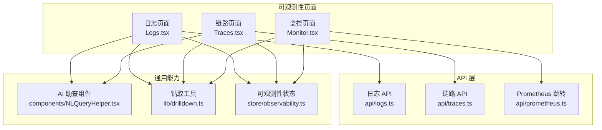
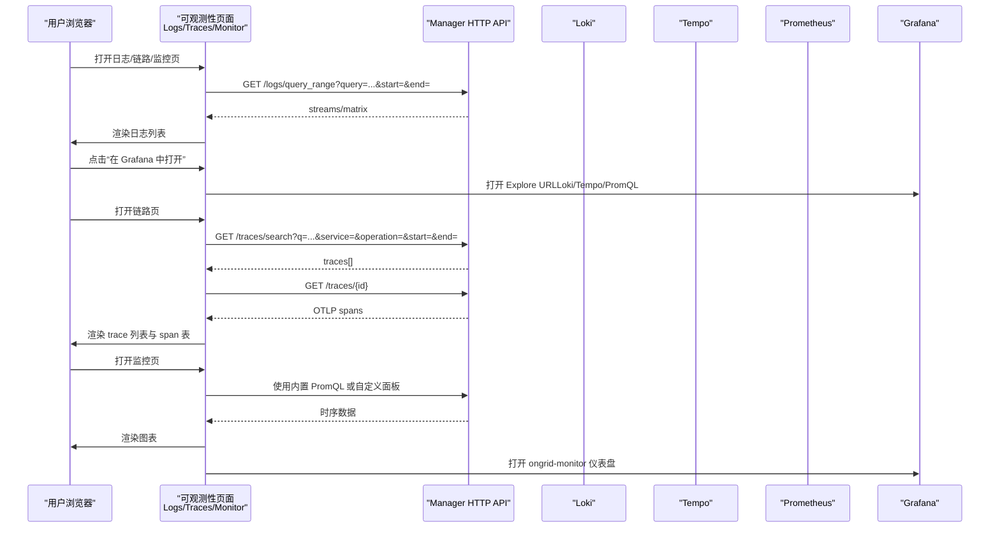
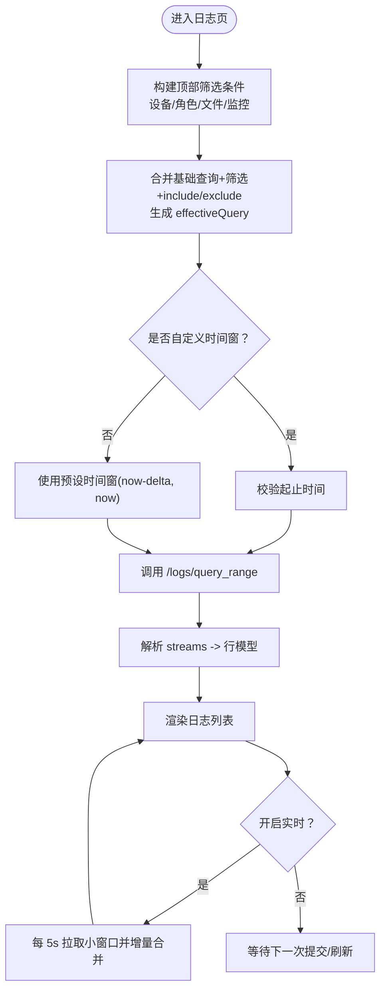
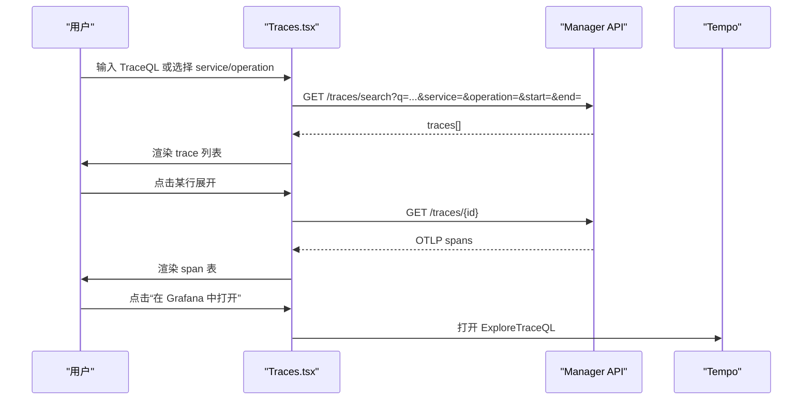
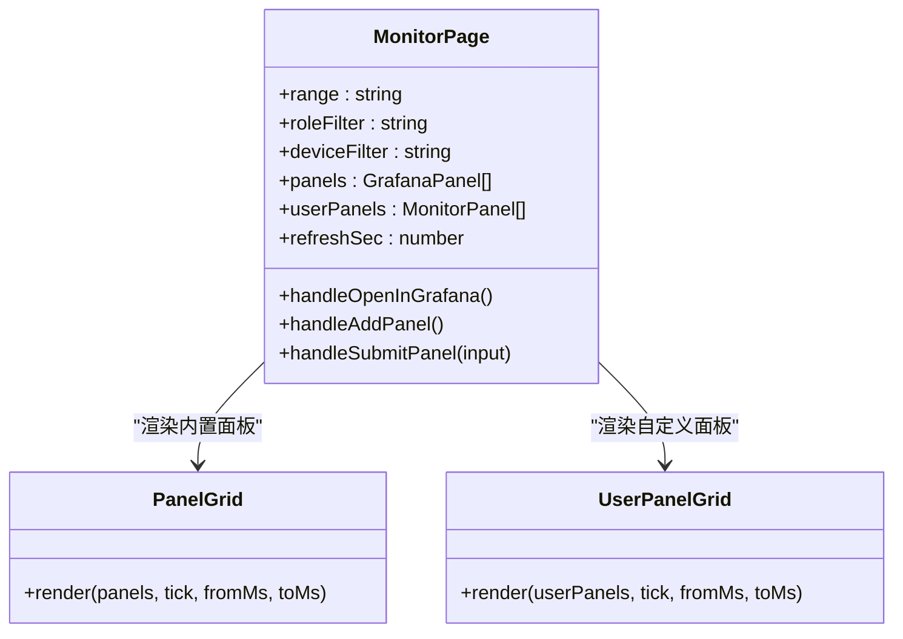
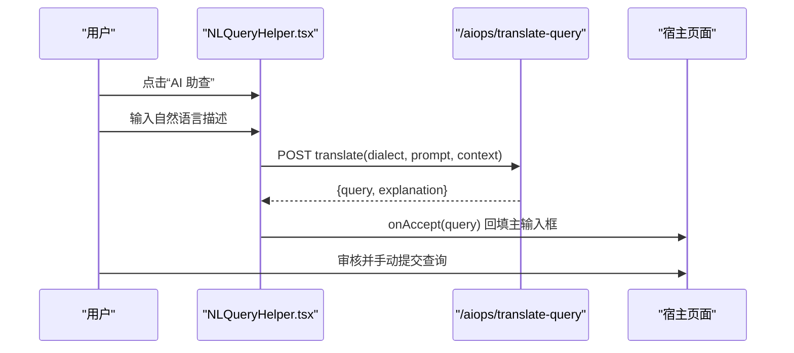
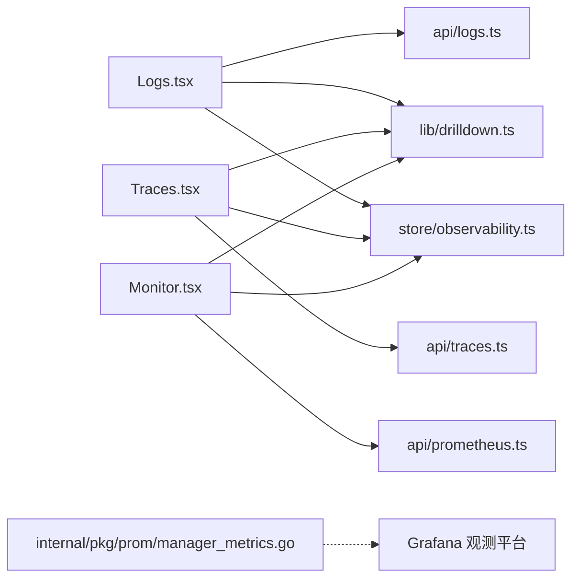

# 可观测性页面

<cite>
**本文引用的文件**   
- [Logs.tsx](file://web/src/pages/Logs.tsx)
- [Traces.tsx](file://web/src/pages/Traces.tsx)
- [Monitor.tsx](file://web/src/pages/Monitor.tsx)
- [logs.ts](file://web/src/api/logs.ts)
- [traces.ts](file://web/src/api/traces.ts)
- [prometheus.ts](file://web/src/api/prometheus.ts)
- [NLQueryHelper.tsx](file://web/src/components/NLQueryHelper.tsx)
- [drilldown.ts](file://web/src/lib/drilldown.ts)
- [observability.ts](file://web/src/store/observability.ts)
- [manager_metrics.go](file://internal/pkg/prom/manager_metrics.go)
</cite>

## 目录
1. [简介](#简介)
2. [项目结构](#项目结构)
3. [核心组件](#核心组件)
4. [架构总览](#架构总览)
5. [详细组件分析](#详细组件分析)
6. [依赖关系分析](#依赖关系分析)
7. [性能与可用性](#性能与可用性)
8. [故障排查指南](#故障排查指南)
9. [结论](#结论)
10. [附录：查询语法与智能提示](#附录：查询语法与智能提示)

## 简介
本文件面向开发者与运维人员，系统性梳理“日志、链路、监控”三大可观测性页面的前端实现与交互流程，重点覆盖：
- 日志实时搜索与过滤机制（LogQL + 快捷筛选）
- 分布式追踪的可视化与分析能力（TraceQL + 服务/操作筛选）
- 页面级性能监控与用户行为分析（PromQL 面板 + 自定义面板）
- 查询语句语法支持与智能提示（AI 助查）
- 自定义监控指标的接入与展示路径

## 项目结构
可观测性相关的前端代码集中在 web/src 下，关键目录与职责如下：
- pages：日志、链路、监控三大页面
- api：对应后端 API 封装（日志、链路、Prometheus 跳转等）
- components：通用 UI 组件（含 AI 助查弹窗）
- lib：工具函数（如 Grafana Explore 链接构建）
- store：全局状态（Grafana 地址、组织 ID 等）

图表来源
- [Logs.tsx:1-1245](file://web/src/pages/Logs.tsx#L1-L1245)
- [Traces.tsx:1-881](file://web/src/pages/Traces.tsx#L1-L881)
- [Monitor.tsx:1-719](file://web/src/pages/Monitor.tsx#L1-L719)
- [logs.ts:1-53](file://web/src/api/logs.ts#L1-L53)
- [traces.ts:1-113](file://web/src/api/traces.ts#L1-L113)
- [prometheus.ts:1-13](file://web/src/api/prometheus.ts#L1-L13)
- [NLQueryHelper.tsx:1-268](file://web/src/components/NLQueryHelper.tsx#L1-L268)
- [drilldown.ts](file://web/src/lib/drilldown.ts)
- [observability.ts](file://web/src/store/observability.ts)

章节来源
- [Logs.tsx:1-1245](file://web/src/pages/Logs.tsx#L1-L1245)
- [Traces.tsx:1-881](file://web/src/pages/Traces.tsx#L1-L881)
- [Monitor.tsx:1-719](file://web/src/pages/Monitor.tsx#L1-L719)

## 核心组件
- 日志页面（Logs.tsx）
  - 支持 LogQL 输入、时间窗选择、设备/角色/文件/监控维度筛选、包含/排除关键词、行内查找、实时刷新、一键跳转到 Grafana Explore。
  - 通过 /logs/query_range 拉取 Loki streams；提供标签探测以区分“无数据”和“查询过窄”。
- 链路页面（Traces.tsx）
  - 支持 TraceQL 与 service/operation 双通道查询、trace_id 直达、快捷预设、实时轮询、跳转到 Grafana Tempo Explore。
  - 通过 /traces/search 与 /traces/{id} 获取摘要与详情，兼容不同 Tempo 版本字段。
- 监控页面（Monitor.tsx）
  - 内置多张 PromQL 面板（CPU/内存/磁盘/网络/进程 Top-N/负载饱和度/conntrack/TCP），支持按角色/设备聚合，自动同步到 Grafana ongrid-monitor 仪表盘。
  - 支持添加自定义面板（PromQL），并持久化到后端，再镜像到 Grafana。

章节来源
- [Logs.tsx:1-1245](file://web/src/pages/Logs.tsx#L1-L1245)
- [Traces.tsx:1-881](file://web/src/pages/Traces.tsx#L1-L881)
- [Monitor.tsx:1-719](file://web/src/pages/Monitor.tsx#L1-L719)

## 架构总览
下图展示了从页面到后端再到存储系统的端到端调用链，以及 Grafana 深度链接的协作方式。

图表来源
- [Logs.tsx:1-1245](file://web/src/pages/Logs.tsx#L1-L1245)
- [Traces.tsx:1-881](file://web/src/pages/Traces.tsx#L1-L881)
- [Monitor.tsx:1-719](file://web/src/pages/Monitor.tsx#L1-L719)
- [logs.ts:1-53](file://web/src/api/logs.ts#L1-L53)
- [traces.ts:1-113](file://web/src/api/traces.ts#L1-L113)
- [prometheus.ts:1-13](file://web/src/api/prometheus.ts#L1-L13)
- [drilldown.ts](file://web/src/lib/drilldown.ts)

## 详细组件分析

### 日志页面（Logs.tsx）
- 查询构建与过滤
  - 基础查询 + 顶部筛选（设备/角色/文件/unit/监控）合并为 effectiveQuery。
  - include/exclude 关键词通过行级正则 |~ 与 !~ 追加到 LogQL。
  - 默认回退查询保证空查询也能返回结果。
- 实时模式
  - 每 5 秒轮询最近窗口，增量去重合并，避免全量重跑。
- 行内查找
  - 支持 Ctrl/Cmd+F 打开，高亮匹配项并滚动定位。
- 空态与引导
  - 探测 Loki 是否有任意 label，区分“未推送日志”和“查询过窄”，并提供快速修复按钮。
- 跳转 Grafana
  - 将当前 effectiveQuery 与时间窗转换为 Explore URL。

图表来源
- [Logs.tsx:1-1245](file://web/src/pages/Logs.tsx#L1-L1245)
- [logs.ts:1-53](file://web/src/api/logs.ts#L1-L53)

章节来源
- [Logs.tsx:1-1245](file://web/src/pages/Logs.tsx#L1-L1245)
- [logs.ts:1-53](file://web/src/api/logs.ts#L1-L53)

### 链路页面（Traces.tsx）
- 查询入口
  - 优先支持 TraceQL；当为空时回退到 service/operation 筛选。
  - 支持 trace_id 直达，直接拉取单条 trace 详情。
- 结果展示
  - 列表展示 trace 摘要（服务、根 span、时长、开始时间、span 数）。
  - 展开后以扁平表格展示 span 明细（名称、服务、类型、时长、状态）。
- 实时模式
  - 切换实时后锁定当前筛选并提交一次查询，随后每 5 秒轮询。
- 跳转 Grafana
  - 根据 TraceQL 或 service/operation 合成 TraceQL，构造 Explore URL。

图表来源
- [Traces.tsx:1-881](file://web/src/pages/Traces.tsx#L1-L881)
- [traces.ts:1-113](file://web/src/api/traces.ts#L1-L113)

章节来源
- [Traces.tsx:1-881](file://web/src/pages/Traces.tsx#L1-L881)
- [traces.ts:1-113](file://web/src/api/traces.ts#L1-L113)

### 监控页面（Monitor.tsx）
- 内置面板
  - CPU/内存/磁盘/网络吞吐、Top 8 进程 CPU/内存、负载饱和度、磁盘 I/O、conntrack 利用率、TCP 连接数。
  - 通过 role/device 筛选注入 device_id 匹配器，确保单设备视图正确生效。
- 自定义面板
  - 新增/编辑/删除面板，持久化到后端，并异步镜像到 Grafana ongrid-monitor 仪表盘。
- 自动刷新
  - 支持关闭/30s/1min/5min 自动刷新，隐藏标签时暂停轮询。
- 跳转 Grafana
  - 打开 ongrid-monitor 仪表盘，支持 viewPanel 参数查看单个面板。

图表来源
- [Monitor.tsx:1-719](file://web/src/pages/Monitor.tsx#L1-L719)

章节来源
- [Monitor.tsx:1-719](file://web/src/pages/Monitor.tsx#L1-L719)

### AI 助查（NLQueryHelper.tsx）
- 功能
  - 自然语言 → LogQL/TraceQL/PromQL 翻译，结果仅回填主输入框，不自动提交。
  - 503（LLM 未配置）会话级隐藏触发器；其他错误在弹窗内提示。
- 上下文
  - 传入当前页面上下文（如 range、device_id、role/service/operation），提高翻译质量。

图表来源
- [NLQueryHelper.tsx:1-268](file://web/src/components/NLQueryHelper.tsx#L1-L268)
- [Logs.tsx:1-1245](file://web/src/pages/Logs.tsx#L1-L1245)
- [Traces.tsx:1-881](file://web/src/pages/Traces.tsx#L1-L881)

章节来源
- [NLQueryHelper.tsx:1-268](file://web/src/components/NLQueryHelper.tsx#L1-L268)

## 依赖关系分析
- 页面与 API
  - Logs.tsx 依赖 logs.ts（/logs/query_range、/logs/labels、/logs/labels/{name}/values）。
  - Traces.tsx 依赖 traces.ts（/traces/search、/traces/{id}、/traces/tags/{tag}/values）。
  - Monitor.tsx 依赖 prometheus.ts（/prometheus/launch 用于跳转）与 Grafana 集成。
- 页面与工具
  - 三者均使用 drilldown.ts 构建 Explore URL，并使用 observability.ts 中的 grafanaBaseUrl/orgId。
- 后端自监控
  - manager_metrics.go 暴露系统级指标（HTTP、DB、LLM 调用等），便于在 Prometheus/Grafana 中观测平台自身健康度。

图表来源
- [Logs.tsx:1-1245](file://web/src/pages/Logs.tsx#L1-L1245)
- [Traces.tsx:1-881](file://web/src/pages/Traces.tsx#L1-L881)
- [Monitor.tsx:1-719](file://web/src/pages/Monitor.tsx#L1-L719)
- [logs.ts:1-53](file://web/src/api/logs.ts#L1-L53)
- [traces.ts:1-113](file://web/src/api/traces.ts#L1-L113)
- [prometheus.ts:1-13](file://web/src/api/prometheus.ts#L1-L13)
- [drilldown.ts](file://web/src/lib/drilldown.ts)
- [observability.ts](file://web/src/store/observability.ts)
- [manager_metrics.go:1-301](file://internal/pkg/prom/manager_metrics.go#L1-L301)

章节来源
- [manager_metrics.go:1-301](file://internal/pkg/prom/manager_metrics.go#L1-L301)

## 性能与可用性
- 日志
  - 默认限制 PAGE_LIMIT 防止大窗口导致响应过大；实时模式采用小窗口增量合并，降低带宽与渲染压力。
  - 行内查找基于 DOM 节点 key 定位，避免全表扫描。
- 链路
  - 默认不主动查询，避免对 Tempo 造成压力；提供快捷预设快速命中常见场景。
  - 列表排序与字段兼容处理提升对不同 Tempo 版本的鲁棒性。
- 监控
  - 内置 PromQL 表达式针对多设备聚合优化；设备筛选通过注入 device_id 匹配器精准收敛。
  - 自动刷新在标签不可见时暂停，减少后台请求。
- 平台自监控
  - 通过 manager_metrics.go 暴露 HTTP、数据库池、LLM 调用等指标，便于在 Grafana 中观测平台自身性能与健康度。

[本节为通用指导，无需特定文件引用]

## 故障排查指南
- 日志页
  - 现象：显示“暂无任何日志流”
    - 检查是否已安装 edge 并推送日志；可通过“去新建设备”引导。
  - 现象：结果为空
    - 尝试扩大时间窗、清空 LogQL 或清除筛选；确认 include/exclude 是否过于严格。
- 链路页
  - 现象：无匹配 trace
    - 扩大时间窗、清空 TraceQL 或使用快捷预设；确认 service/operation 是否正确。
- 监控页
  - 现象：面板无数据
    - 检查 role/device 筛选是否收敛到不存在的数据集；确认 Prometheus 数据源可用。
- 跳转 Grafana
  - 现象：无法打开 Grafana
    - 检查 observability.ts 中的 grafanaBaseUrl/orgId 配置；确认网络可达。

章节来源
- [Logs.tsx:1-1245](file://web/src/pages/Logs.tsx#L1-L1245)
- [Traces.tsx:1-881](file://web/src/pages/Traces.tsx#L1-L881)
- [Monitor.tsx:1-719](file://web/src/pages/Monitor.tsx#L1-L719)

## 结论
日志、链路、监控三大页面形成互补的可观测性体验：日志侧重文本检索与实时跟踪，链路聚焦跨服务调用分析与问题定位，监控提供资源与业务指标的直观呈现。结合 AI 助查与 Grafana 深度链接，既降低了 DSL 门槛，又保留了高级用户的灵活能力。平台自身指标也为稳定性保障提供了基础。

[本节为总结，无需特定文件引用]

## 附录：查询语法与智能提示
- 日志（LogQL）
  - 支持 stream selector、line filter（|~ / !~）、include/exclude 关键词组合。
  - 快捷预设：最近错误、OOM、服务重启、SSH 失败等。
  - AI 助查：支持自然语言转 LogQL，并附带解释说明。
- 链路（TraceQL）
  - 支持 TraceQL 表达式；当为空时回退到 service/operation 筛选。
  - 快捷预设：出错的 trace、超过 1s 的慢 trace、全部。
  - AI 助查：支持自然语言转 TraceQL。
- 监控（PromQL）
  - 内置面板使用标准 PromQL；支持按 role/device 注入 device_id 匹配器。
  - 自定义面板：新增/编辑/删除，自动同步到 Grafana ongrid-monitor 仪表盘。
  - AI 助查：支持自然语言转 PromQL。

章节来源
- [Logs.tsx:1-1245](file://web/src/pages/Logs.tsx#L1-L1245)
- [Traces.tsx:1-881](file://web/src/pages/Traces.tsx#L1-L881)
- [Monitor.tsx:1-719](file://web/src/pages/Monitor.tsx#L1-L719)
- [NLQueryHelper.tsx:1-268](file://web/src/components/NLQueryHelper.tsx#L1-L268)