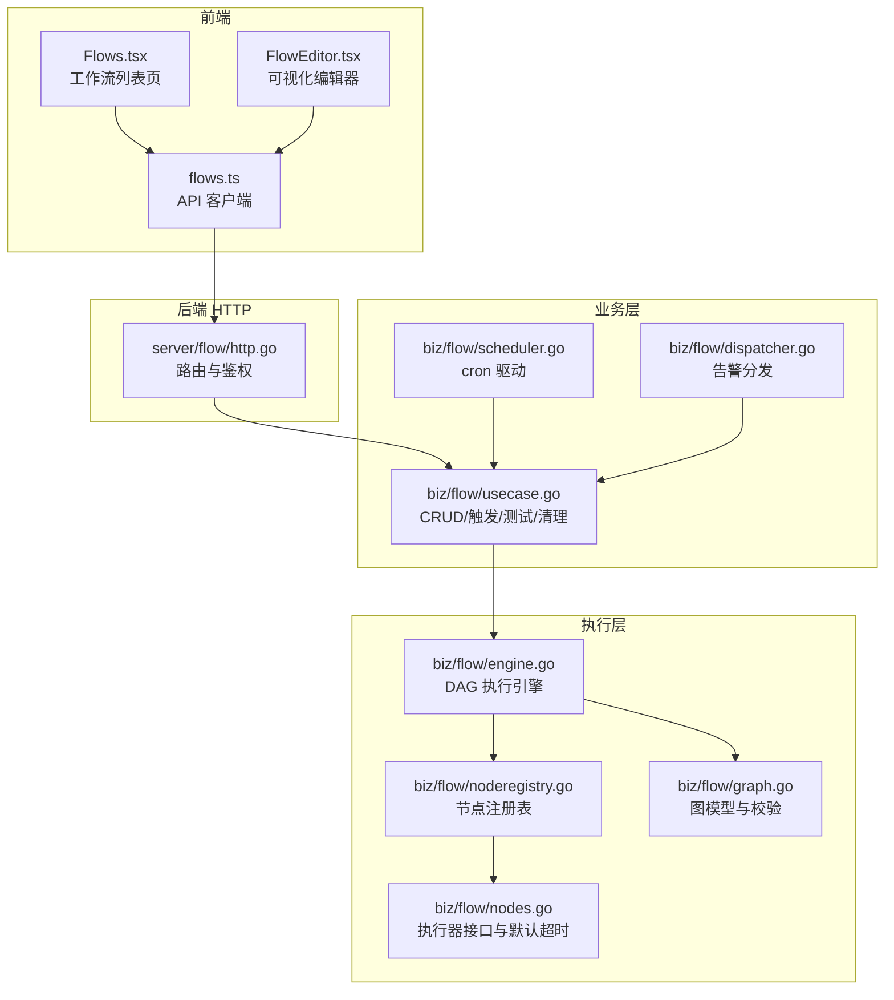
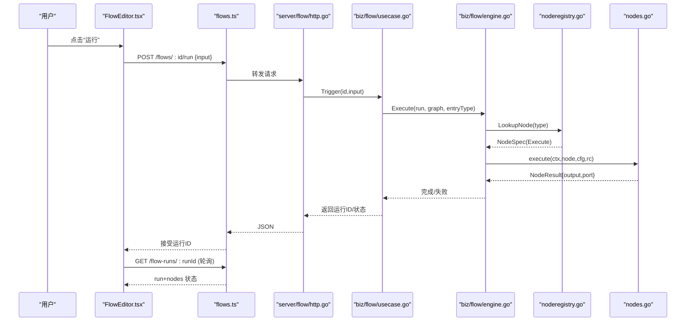
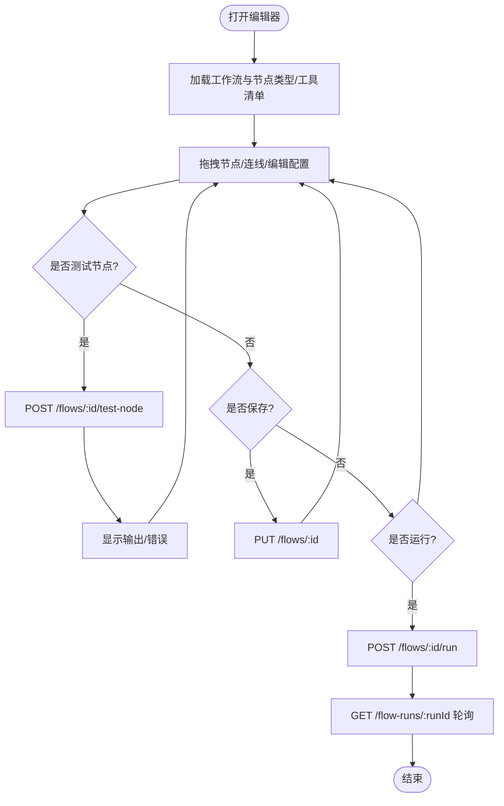
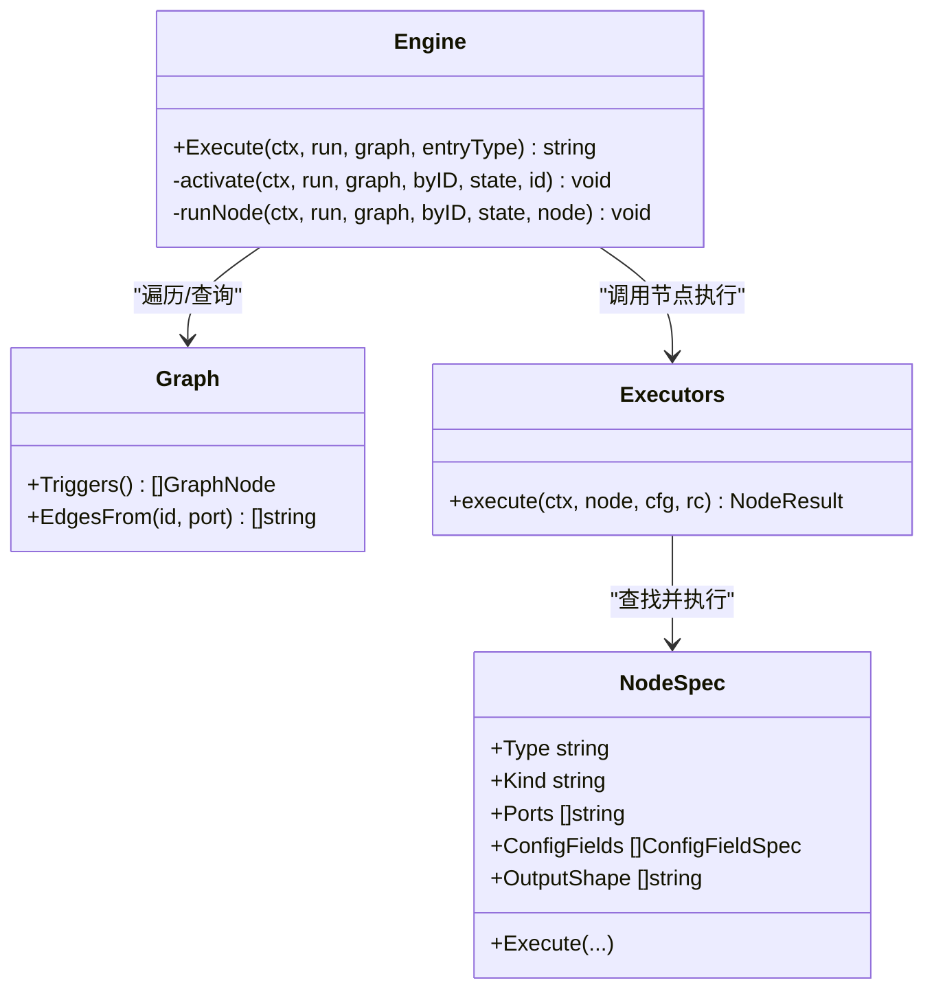
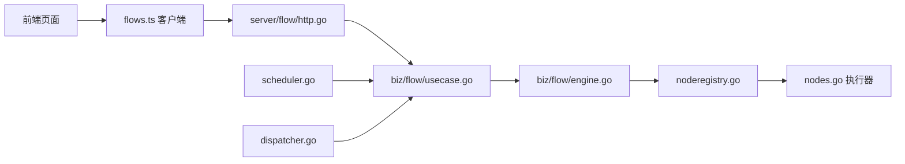

# 工作流页面

<cite>
**本文引用的文件**   
- [web/src/pages/FlowEditor.tsx](file://web/src/pages/FlowEditor.tsx)
- [web/src/pages/Flows.tsx](file://web/src/pages/Flows.tsx)
- [web/src/api/flows.ts](file://web/src/api/flows.ts)
- [internal/manager/server/flow/http.go](file://internal/manager/server/flow/http.go)
- [internal/manager/biz/flow/usecase.go](file://internal/manager/biz/flow/usecase.go)
- [internal/manager/biz/flow/engine.go](file://internal/manager/biz/flow/engine.go)
- [internal/manager/biz/flow/graph.go](file://internal/manager/biz/flow/graph.go)
- [internal/manager/biz/flow/nodes.go](file://internal/manager/biz/flow/nodes.go)
- [internal/manager/biz/flow/noderegistry.go](file://internal/manager/biz/flow/noderegistry.go)
- [internal/manager/biz/flow/scheduler.go](file://internal/manager/biz/flow/scheduler.go)
- [internal/manager/biz/flow/dispatcher.go](file://internal/manager/biz/flow/dispatcher.go)
</cite>

## 目录
1. [简介](#简介)
2. [项目结构](#项目结构)
3. [核心组件](#核心组件)
4. [架构总览](#架构总览)
5. [详细组件分析](#详细组件分析)
6. [依赖关系分析](#依赖关系分析)
7. [性能与扩展性](#性能与扩展性)
8. [故障排查指南](#故障排查指南)
9. [结论](#结论)
10. [附录：版本控制与回滚](#附录版本控制与回滚)

## 简介
本文件面向开发者，系统化梳理“工作流”相关页面的实现与后端编排能力。内容覆盖可视化工作流编辑器（拖拽、连线、配置抽屉、运行与调试）、任务调度与执行（手动/定时/告警触发）、节点类型与数据流转、运行状态跟踪、以及版本管理与回滚策略。同时提供自定义节点与工作流扩展的开发指南，帮助快速接入新节点类型与工具。

## 项目结构
前端以 React Flow 构建可视化画布，提供左侧调色板、中间画布、右侧配置抽屉；后端采用分层设计：HTTP 层 → 业务用例（Usecase）→ 引擎（Engine）→ 节点注册表与执行器（NodeSpec + Executors）。

图表来源
- [web/src/pages/Flows.tsx:1-355](file://web/src/pages/Flows.tsx#L1-L355)
- [web/src/pages/FlowEditor.tsx:1-800](file://web/src/pages/FlowEditor.tsx#L1-L800)
- [web/src/api/flows.ts:1-194](file://web/src/api/flows.ts#L1-L194)
- [internal/manager/server/flow/http.go:1-538](file://internal/manager/server/flow/http.go#L1-L538)
- [internal/manager/biz/flow/usecase.go:1-410](file://internal/manager/biz/flow/usecase.go#L1-L410)
- [internal/manager/biz/flow/scheduler.go:1-139](file://internal/manager/biz/flow/scheduler.go#L1-L139)
- [internal/manager/biz/flow/dispatcher.go:1-109](file://internal/manager/biz/flow/dispatcher.go#L1-L109)
- [internal/manager/biz/flow/engine.go:1-299](file://internal/manager/biz/flow/engine.go#L1-L299)
- [internal/manager/biz/flow/noderegistry.go:1-371](file://internal/manager/biz/flow/noderegistry.go#L1-L371)
- [internal/manager/biz/flow/nodes.go:1-117](file://internal/manager/biz/flow/nodes.go#L1-L117)
- [internal/manager/biz/flow/graph.go:1-214](file://internal/manager/biz/flow/graph.go#L1-L214)

章节来源
- [web/src/pages/Flows.tsx:1-355](file://web/src/pages/Flows.tsx#L1-L355)
- [web/src/pages/FlowEditor.tsx:1-800](file://web/src/pages/FlowEditor.tsx#L1-L800)
- [web/src/api/flows.ts:1-194](file://web/src/api/flows.ts#L1-L194)
- [internal/manager/server/flow/http.go:1-538](file://internal/manager/server/flow/http.go#L1-L538)
- [internal/manager/biz/flow/usecase.go:1-410](file://internal/manager/biz/flow/usecase.go#L1-L410)
- [internal/manager/biz/flow/scheduler.go:1-139](file://internal/manager/biz/flow/scheduler.go#L1-L139)
- [internal/manager/biz/flow/dispatcher.go:1-109](file://internal/manager/biz/flow/dispatcher.go#L1-L109)
- [internal/manager/biz/flow/engine.go:1-299](file://internal/manager/biz/flow/engine.go#L1-L299)
- [internal/manager/biz/flow/noderegistry.go:1-371](file://internal/manager/biz/flow/noderegistry.go#L1-L371)
- [internal/manager/biz/flow/nodes.go:1-117](file://internal/manager/biz/flow/nodes.go#L1-L117)
- [internal/manager/biz/flow/graph.go:1-214](file://internal/manager/biz/flow/graph.go#L1-L214)

## 核心组件
- 可视化编辑器（FlowEditor）
  - 基于 React Flow 的画布，支持拖拽添加节点、端口连线、右侧配置抽屉、运行/保存/单节点测试、运行记录轮询等。
  - 通过 /v1/flow-node-types 动态渲染调色板与表单字段，兼容内置元信息降级。
- 工作流列表（Flows）
  - 创建（AI 生成或空白命名）、启用/停用、删除、直接触发运行、搜索过滤。
- HTTP 服务（server/flow/http.go）
  - 暴露 CRUD、运行、测试节点、工具清单、节点类型清单等 REST 接口；读写权限由角色控制。
- 业务用例（usecase.go）
  - 封装图解析与校验、版本递增、运行生命周期管理、单节点测试、历史清理、事件触发入口。
- 执行引擎（engine.go）
  - DAG 执行：并发扇出、OR-join 执行一次、错误分支、上下文模板解析、结果持久化。
- 节点注册表（noderegistry.go）
  - 声明式节点类型：类别、端口、配置字段、输出形状、执行函数；新增节点无需改动核心逻辑。
- 调度与分发（scheduler.go, dispatcher.go）
  - cron 定时触发；告警事件自动匹配并触发对应工作流。

章节来源
- [web/src/pages/FlowEditor.tsx:1-800](file://web/src/pages/FlowEditor.tsx#L1-L800)
- [web/src/pages/Flows.tsx:1-355](file://web/src/pages/Flows.tsx#L1-L355)
- [web/src/api/flows.ts:1-194](file://web/src/api/flows.ts#L1-L194)
- [internal/manager/server/flow/http.go:1-538](file://internal/manager/server/flow/http.go#L1-L538)
- [internal/manager/biz/flow/usecase.go:1-410](file://internal/manager/biz/flow/usecase.go#L1-L410)
- [internal/manager/biz/flow/engine.go:1-299](file://internal/manager/biz/flow/engine.go#L1-L299)
- [internal/manager/biz/flow/noderegistry.go:1-371](file://internal/manager/biz/flow/noderegistry.go#L1-L371)
- [internal/manager/biz/flow/scheduler.go:1-139](file://internal/manager/biz/flow/scheduler.go#L1-L139)
- [internal/manager/biz/flow/dispatcher.go:1-109](file://internal/manager/biz/flow/dispatcher.go#L1-L109)

## 架构总览
下图展示从前端到后端的完整调用链与关键职责边界。

图表来源
- [web/src/pages/FlowEditor.tsx:1-800](file://web/src/pages/FlowEditor.tsx#L1-L800)
- [web/src/api/flows.ts:1-194](file://web/src/api/flows.ts#L1-L194)
- [internal/manager/server/flow/http.go:1-538](file://internal/manager/server/flow/http.go#L1-L538)
- [internal/manager/biz/flow/usecase.go:1-410](file://internal/manager/biz/flow/usecase.go#L1-L410)
- [internal/manager/biz/flow/engine.go:1-299](file://internal/manager/biz/flow/engine.go#L1-L299)
- [internal/manager/biz/flow/noderegistry.go:1-371](file://internal/manager/biz/flow/noderegistry.go#L1-L371)
- [internal/manager/biz/flow/nodes.go:1-117](file://internal/manager/biz/flow/nodes.go#L1-L117)

## 详细组件分析

### 可视化工作流编辑器（FlowEditor）
- 画布与交互
  - 使用 React Flow 实例管理节点与边；左侧调色板按后端节点类型动态渲染；右侧抽屉根据节点类型动态生成表单字段。
  - 条件节点具备 true/false/error 三个源端口，连线颜色区分控制流语义。
- 数据与模板
  - 运行时上下文通过 {{trigger.*}}、{{nodes.<id>.output.*}}、{{vars.*}} 引用；编辑器在“最近运行”中预取上游输出，辅助填写模板。
- 运行与调试
  - 支持整图运行与单节点测试；测试会隔离执行节点，返回真实输出以便下游引用；对具有副作用的节点（如通知、写类工具）禁止测试。
- 保存与版本
  - 保存时提交当前图；后端仅在图变更时递增版本号，便于追踪与回滚。

图表来源
- [web/src/pages/FlowEditor.tsx:1-800](file://web/src/pages/FlowEditor.tsx#L1-L800)
- [web/src/api/flows.ts:1-194](file://web/src/api/flows.ts#L1-L194)
- [internal/manager/server/flow/http.go:1-538](file://internal/manager/server/flow/http.go#L1-L538)
- [internal/manager/biz/flow/usecase.go:1-410](file://internal/manager/biz/flow/usecase.go#L1-L410)

章节来源
- [web/src/pages/FlowEditor.tsx:1-800](file://web/src/pages/FlowEditor.tsx#L1-L800)
- [web/src/api/flows.ts:1-194](file://web/src/api/flows.ts#L1-L194)
- [internal/manager/server/flow/http.go:1-538](file://internal/manager/server/flow/http.go#L1-L538)
- [internal/manager/biz/flow/usecase.go:1-410](file://internal/manager/biz/flow/usecase.go#L1-L410)

### 工作流列表（Flows）
- 功能要点
  - 新建：支持 AI 生成（自然语言描述）或空白命名；创建成功后跳转编辑器。
  - 运行：一键触发运行；启用/停用开关；删除确认。
  - 搜索：按名称/描述过滤。
- 权限控制
  - 非 viewer 角色可写；viewer 仅读。

章节来源
- [web/src/pages/Flows.tsx:1-355](file://web/src/pages/Flows.tsx#L1-L355)
- [web/src/api/flows.ts:1-194](file://web/src/api/flows.ts#L1-L194)
- [internal/manager/server/flow/http.go:1-538](file://internal/manager/server/flow/http.go#L1-L538)

### 后端 HTTP 层（server/flow/http.go）
- 路由概览
  - 工作流：列表/详情/创建/更新/删除/启用切换/AI 生成
  - 运行：触发运行/列出运行/查看运行详情
  - 调试：测试节点
  - 元数据：工具清单/节点类型清单
- 鉴权与限流
  - 读取开放给已认证用户；写入需非 viewer 角色；请求体大小限制保护。

章节来源
- [internal/manager/server/flow/http.go:1-538](file://internal/manager/server/flow/http.go#L1-L538)

### 业务用例（usecase.go）
- 图与版本
  - 创建/更新时对图进行解析与校验；图变更则版本自增。
- 运行生命周期
  - 触发运行：校验触发器存在、持久化运行行、后台执行引擎、最终落盘状态。
- 单节点测试
  - 隔离执行节点，结合最近运行的上游输出构造上下文；对具副作用节点拒绝测试。
- 历史清理
  - 定期清理过期运行记录，保留天数可配置。

章节来源
- [internal/manager/biz/flow/usecase.go:1-410](file://internal/manager/biz/flow/usecase.go#L1-L410)

### 执行引擎（engine.go）
- 调度语义
  - 从触发器开始，节点完成时沿指定控制端口激活目标；并发扇出受上限控制；OR-join 且执行一次。
- 错误处理
  - 未连接 error 端口的失败将标记运行失败；已连接 error 端口则进入错误分支继续执行。
- 上下文与变量
  - 模板解析在锁内完成，执行在锁外；set 节点变量在锁内合并，避免竞态。

图表来源
- [internal/manager/biz/flow/engine.go:1-299](file://internal/manager/biz/flow/engine.go#L1-L299)
- [internal/manager/biz/flow/graph.go:1-214](file://internal/manager/biz/flow/graph.go#L1-L214)
- [internal/manager/biz/flow/noderegistry.go:1-371](file://internal/manager/biz/flow/noderegistry.go#L1-L371)
- [internal/manager/biz/flow/nodes.go:1-117](file://internal/manager/biz/flow/nodes.go#L1-L117)

章节来源
- [internal/manager/biz/flow/engine.go:1-299](file://internal/manager/biz/flow/engine.go#L1-L299)
- [internal/manager/biz/flow/graph.go:1-214](file://internal/manager/biz/flow/graph.go#L1-L214)
- [internal/manager/biz/flow/nodes.go:1-117](file://internal/manager/biz/flow/nodes.go#L1-L117)

### 节点注册表与内置节点（noderegistry.go, nodes.go）
- 节点类型
  - 触发器：手动、告警、定时
  - 动作：Agent、LLM、工具、通知、HTTP 请求
  - 控制：条件（true/false）
  - 数据：变量设置、字段映射
- 执行器契约
  - 统一输入为已解析的配置与只读上下文；输出为数据结果与控制端口；set 节点通过 Vars 回写共享变量。
- 超时策略
  - 普通节点、LLM、Agent 分别有超时预算，防止长尾阻塞。

章节来源
- [internal/manager/biz/flow/noderegistry.go:1-371](file://internal/manager/biz/flow/noderegistry.go#L1-L371)
- [internal/manager/biz/flow/nodes.go:1-117](file://internal/manager/biz/flow/nodes.go#L1-L117)

### 定时调度与告警分发（scheduler.go, dispatcher.go）
- 定时调度
  - 每 30s 扫描启用中的工作流，解析 trigger.cron 表达式，到达时间即触发运行；附带 fired_at/cron 上下文。
- 告警分发
  - 当告警产生时，按规则名包含与最低严重度筛选匹配的 trigger.alert_fired 节点，异步触发运行。

章节来源
- [internal/manager/biz/flow/scheduler.go:1-139](file://internal/manager/biz/flow/scheduler.go#L1-L139)
- [internal/manager/biz/flow/dispatcher.go:1-109](file://internal/manager/biz/flow/dispatcher.go#L1-L109)

## 依赖关系分析
- 前端依赖
  - Flows.tsx/FlowEditor.tsx 依赖 flows.ts 客户端；后者封装所有 /v1/flows* 与 /v1/flow-* 接口。
- 后端分层
  - HTTP 层仅做鉴权与 DTO 转换；业务用例负责图校验、版本、运行生命周期；引擎专注 DAG 执行；注册表集中声明节点行为。
- 外部集成点
  - Agent/LLM/工具/通知通过 Executors 注入，未注入时对应节点退化为配置期错误，不影响整体可测试性。

图表来源
- [web/src/pages/Flows.tsx:1-355](file://web/src/pages/Flows.tsx#L1-L355)
- [web/src/pages/FlowEditor.tsx:1-800](file://web/src/pages/FlowEditor.tsx#L1-L800)
- [web/src/api/flows.ts:1-194](file://web/src/api/flows.ts#L1-L194)
- [internal/manager/server/flow/http.go:1-538](file://internal/manager/server/flow/http.go#L1-L538)
- [internal/manager/biz/flow/usecase.go:1-410](file://internal/manager/biz/flow/usecase.go#L1-L410)
- [internal/manager/biz/flow/engine.go:1-299](file://internal/manager/biz/flow/engine.go#L1-L299)
- [internal/manager/biz/flow/noderegistry.go:1-371](file://internal/manager/biz/flow/noderegistry.go#L1-L371)
- [internal/manager/biz/flow/nodes.go:1-117](file://internal/manager/biz/flow/nodes.go#L1-L117)
- [internal/manager/biz/flow/scheduler.go:1-139](file://internal/manager/biz/flow/scheduler.go#L1-L139)
- [internal/manager/biz/flow/dispatcher.go:1-109](file://internal/manager/biz/flow/dispatcher.go#L1-L109)

## 性能与扩展性
- 并发与限流
  - 引擎并发扇出上限固定，避免宽图导致资源耗尽；节点执行超时分级控制。
- 历史清理
  - 运行记录按保留天数周期性清理，降低存储压力。
- 可扩展性
  - 新增节点仅需注册 NodeSpec 并提供 Execute；前端通过 /v1/flow-node-types 动态适配，无需硬编码。
  - 工具节点通过 BaseTool 注册表动态发现，参数表单由 JSON Schema 驱动。

[本节为通用指导，不直接分析具体文件]

## 故障排查指南
- 常见错误定位
  - 运行失败：查看运行详情中的节点错误与错误端口分支；若未连接 error 端口，运行将被标记失败。
  - 单节点测试失败：检查节点配置与模板引用；注意写类工具/通知节点不允许测试。
  - 定时/告警未触发：确认工作流启用、触发器存在且配置合法；检查 cron 表达式与告警匹配规则。
- 日志与诊断
  - 引擎 panic 会被捕获并记录堆栈；调度与分发失败会记录警告日志。
- 权限问题
  - 非 viewer 角色才可写；未登录或无租户上下文将返回未授权/禁止访问。

章节来源
- [internal/manager/biz/flow/engine.go:1-299](file://internal/manager/biz/flow/engine.go#L1-L299)
- [internal/manager/server/flow/http.go:1-538](file://internal/manager/server/flow/http.go#L1-L538)
- [internal/manager/biz/flow/usecase.go:1-410](file://internal/manager/biz/flow/usecase.go#L1-L410)

## 结论
工作流系统以“声明式节点 + 数据驱动 UI + 强约束图模型”为核心，提供直观的可视化编排与可靠的执行保障。通过注册表机制与动态表单，扩展新节点与工具成本极低；配合版本管理与历史清理，兼顾可追溯性与运维友好性。

[本节为总结，不直接分析具体文件]

## 附录：版本控制与回滚
- 版本控制
  - 每次图变更保存时，后端递增版本号；列表与详情均展示当前版本，便于对比与审计。
- 回滚策略
  - 由于保存即持久化新版本，回滚可通过选择旧版本图重新保存为新版本来实现；建议在重大变更前先复制工作流再修改。
- 运行快照
  - 每次运行记录包含 flow_version，确保运行与图版本绑定，便于复现与排障。

章节来源
- [internal/manager/biz/flow/usecase.go:1-410](file://internal/manager/biz/flow/usecase.go#L1-L410)
- [web/src/pages/Flows.tsx:1-355](file://web/src/pages/Flows.tsx#L1-L355)
- [web/src/pages/FlowEditor.tsx:1-800](file://web/src/pages/FlowEditor.tsx#L1-L800)