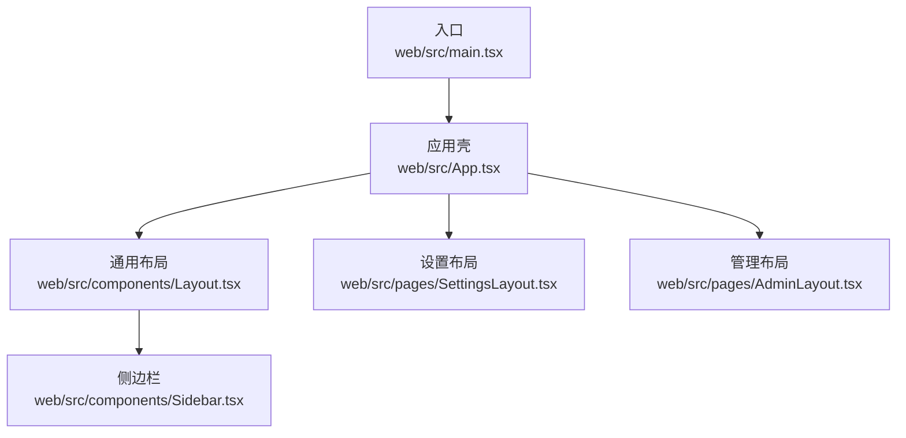
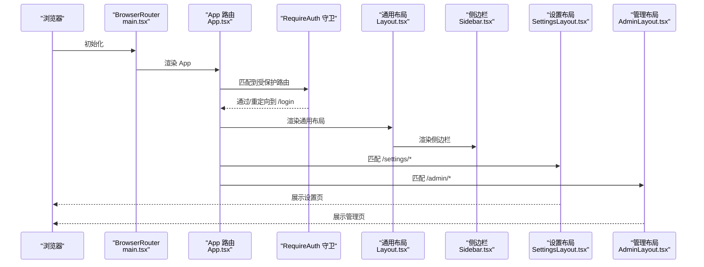
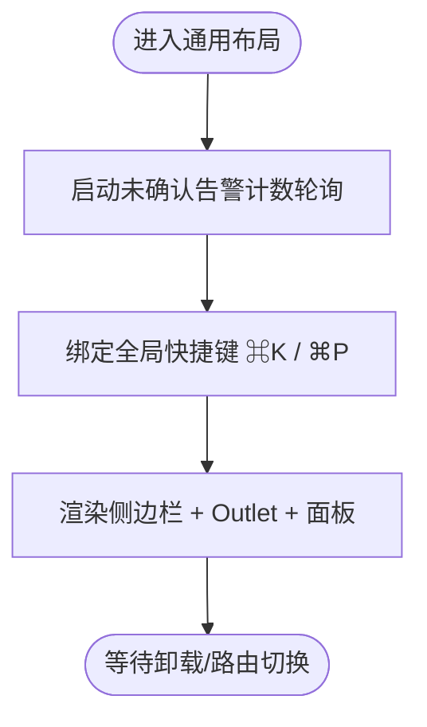
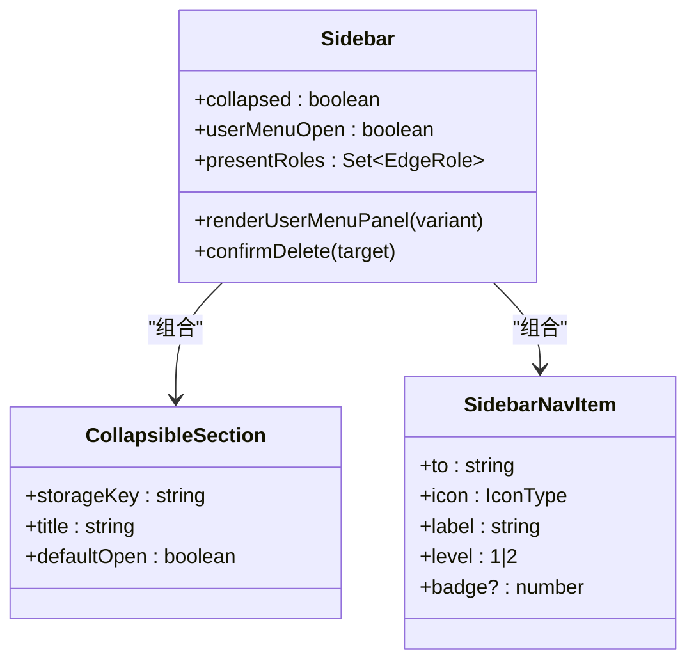
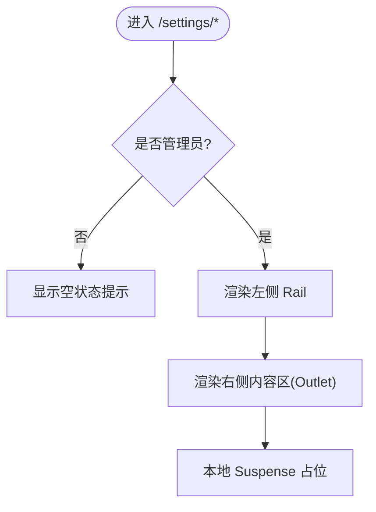
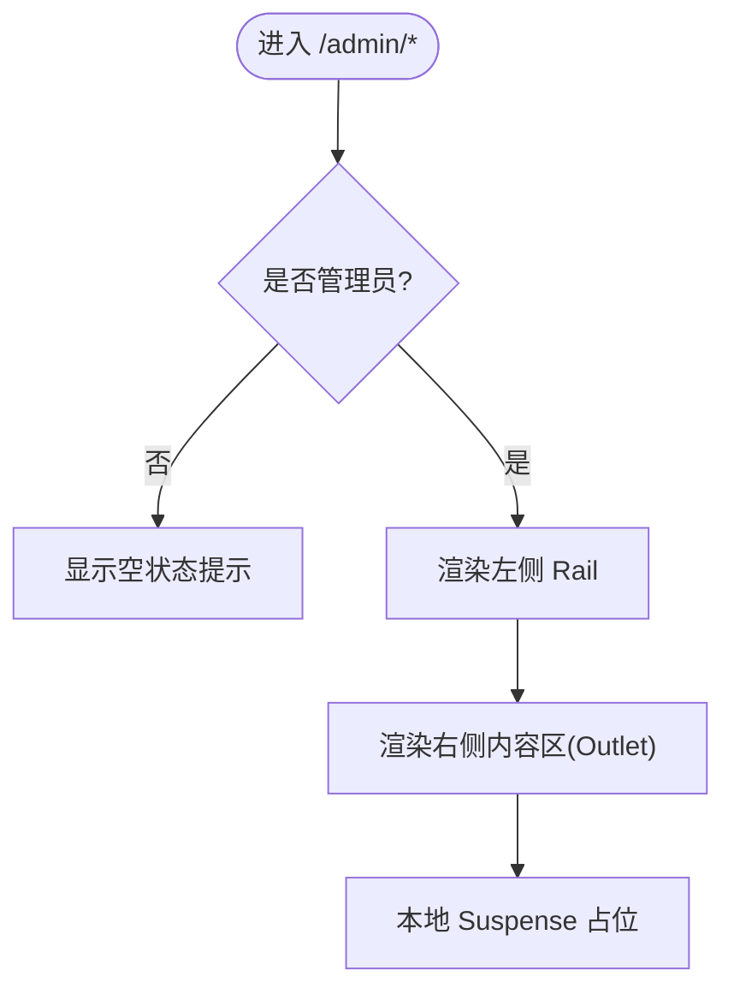
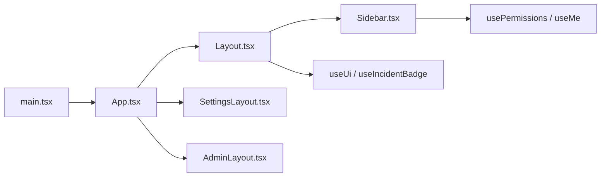
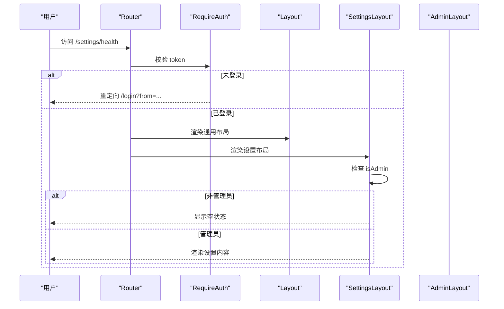

# 布局组件

<cite>
**本文引用的文件**   
- [main.tsx](file://web/src/main.tsx)
- [App.tsx](file://web/src/App.tsx)
- [Layout.tsx](file://web/src/components/Layout.tsx)
- [Sidebar.tsx](file://web/src/components/Sidebar.tsx)
- [SettingsLayout.tsx](file://web/src/pages/SettingsLayout.tsx)
- [AdminLayout.tsx](file://web/src/pages/AdminLayout.tsx)
</cite>

## 目录
1. [简介](#简介)
2. [项目结构](#项目结构)
3. [核心组件](#核心组件)
4. [架构总览](#架构总览)
5. [详细组件分析](#详细组件分析)
6. [依赖关系分析](#依赖关系分析)
7. [性能与可访问性](#性能与可访问性)
8. [主题与样式定制](#主题与样式定制)
9. [响应式与移动端适配](#响应式与移动端适配)
10. [路由守卫与权限控制（布局级）](#路由守卫与权限控制布局级)
11. [开发规范与最佳实践](#开发规范与最佳实践)
12. [故障排查指南](#故障排查指南)
13. [结论](#结论)

## 简介
本文件面向开发者，系统化梳理管理后台的布局体系：通用布局、设置页面布局与管理布局的设计与实现；说明侧边栏、顶部导航与面包屑的布局逻辑；阐述路由守卫与权限控制的布局级落地；给出响应式与移动端适配方案；并提供主题定制、样式覆盖方法以及新布局模板的开发规范与最佳实践。

## 项目结构
前端采用 React + React Router 的单页应用结构。入口在 main.tsx，使用 BrowserRouter 包裹 App；App 中集中声明路由树，并通过 RequireAuth 公共守卫保护需要登录的路由组；被保护的根路由挂载通用布局 Layout，子路由再分别挂载 SettingsLayout 与 AdminLayout 等二级布局。

图表来源
- [main.tsx:1-26](file://web/src/main.tsx#L1-L26)
- [App.tsx:84-120](file://web/src/App.tsx#L84-L120)
- [Layout.tsx:1-56](file://web/src/components/Layout.tsx#L1-L56)
- [Sidebar.tsx:53-120](file://web/src/components/Sidebar.tsx#L53-L120)
- [SettingsLayout.tsx:55-111](file://web/src/pages/SettingsLayout.tsx#L55-L111)
- [AdminLayout.tsx:48-106](file://web/src/pages/AdminLayout.tsx#L48-L106)

章节来源
- [main.tsx:1-26](file://web/src/main.tsx#L1-L26)
- [App.tsx:84-120](file://web/src/App.tsx#L84-L120)

## 核心组件
- 通用布局 Layout：负责全局容器、侧边栏、命令面板、Agent 侧面板、Suspense 加载占位与未确认告警计数轮询启动。
- 侧边栏 Sidebar：导航菜单、会话列表、用户菜单（语言/主题切换、退出）、折叠态与展开态、按角色动态显示设备分组。
- 设置布局 SettingsLayout：左侧分类 Rail + 右侧内容区，管理员权限门控，本地 Suspense 避免整壳闪烁。
- 管理布局 AdminLayout：平台治理（用户/组织/审计）Rail + 内容区，管理员权限门控。

章节来源
- [Layout.tsx:1-56](file://web/src/components/Layout.tsx#L1-L56)
- [Sidebar.tsx:53-120](file://web/src/components/Sidebar.tsx#L53-L120)
- [SettingsLayout.tsx:55-111](file://web/src/pages/SettingsLayout.tsx#L55-L111)
- [AdminLayout.tsx:48-106](file://web/src/pages/AdminLayout.tsx#L48-L106)

## 架构总览
整体路由与布局层次如下：

图表来源
- [main.tsx:19-25](file://web/src/main.tsx#L19-L25)
- [App.tsx:69-100](file://web/src/App.tsx#L69-L100)
- [Layout.tsx:46-56](file://web/src/components/Layout.tsx#L46-L56)
- [Sidebar.tsx:53-120](file://web/src/components/Sidebar.tsx#L53-L120)
- [SettingsLayout.tsx:55-111](file://web/src/pages/SettingsLayout.tsx#L55-L111)
- [AdminLayout.tsx:48-106](file://web/src/pages/AdminLayout.tsx#L48-L106)

## 详细组件分析

### 通用布局 Layout
- 职责
  - 提供全屏容器，承载侧边栏与 Outlet 内容区。
  - 启动未确认告警计数轮询，卸载时停止。
  - 绑定全局快捷键：⌘K 打开 Agent 侧面板，⌘P 打开命令面板。
  - 为懒加载子路由提供 Suspense 占位，避免首屏闪烁。
- 交互要点
  - 侧边栏与命令面板、Agent 侧面板共享 UI 状态 store。
  - 首次进入已认证布局即开始轮询，登出后自动停止。

图表来源
- [Layout.tsx:10-44](file://web/src/components/Layout.tsx#L10-L44)
- [Layout.tsx:46-56](file://web/src/components/Layout.tsx#L46-L56)

章节来源
- [Layout.tsx:1-56](file://web/src/components/Layout.tsx#L1-L56)

### 侧边栏 Sidebar
- 职责
  - 导航项：首页、仪表盘、Agent、知识库、设备、监控告警、日常、会话等。
  - 用户菜单：语言切换、主题切换、退出登录。
  - 折叠态：图标轨道模式，保留关键入口。
  - 动态分组：根据设备角色集合决定“服务器/存储/数据库/网络设备”等分组是否可见。
  - 会话管理：列出最近会话，支持重命名与删除。
- 权限与可见性
  - “用户管理/设置”入口仅对管理员可见，非管理员不渲染该区块。
- 交互细节
  - 点击搜索按钮打开命令面板。
  - 告警项根据未确认数量显示红点/角标。

图表来源
- [Sidebar.tsx:53-120](file://web/src/components/Sidebar.tsx#L53-L120)
- [Sidebar.tsx:719-770](file://web/src/components/Sidebar.tsx#L719-L770)
- [Sidebar.tsx:772-800](file://web/src/components/Sidebar.tsx#L772-L800)

章节来源
- [Sidebar.tsx:53-120](file://web/src/components/Sidebar.tsx#L53-L120)
- [Sidebar.tsx:719-770](file://web/src/components/Sidebar.tsx#L719-L770)
- [Sidebar.tsx:772-800](file://web/src/components/Sidebar.tsx#L772-L800)

### 设置布局 SettingsLayout
- 职责
  - 左侧 Rail 导航（健康、升级、集成、模型、凭证、通知、渠道、助理、偏好、关于）。
  - 右侧内容区，局部 Suspense 防止整壳闪烁。
  - 管理员权限门控：非管理员直接返回“需要管理员权限”空状态。
- 设计要点
  - 将“产品行为配置”集中在 /settings，便于运维与管理员聚焦。
  - 旧路径统一重定向到新路径，保证书签兼容。

图表来源
- [SettingsLayout.tsx:55-111](file://web/src/pages/SettingsLayout.tsx#L55-L111)
- [SettingsLayout.tsx:113-179](file://web/src/pages/SettingsLayout.tsx#L113-L179)

章节来源
- [SettingsLayout.tsx:55-111](file://web/src/pages/SettingsLayout.tsx#L55-L111)
- [SettingsLayout.tsx:113-179](file://web/src/pages/SettingsLayout.tsx#L113-L179)

### 管理布局 AdminLayout
- 职责
  - 左侧 Rail 导航（用户、组织、审计日志）。
  - 右侧内容区，局部 Suspense。
  - 管理员权限门控：非管理员直接返回“需要管理员权限”空状态。
- 设计要点
  - 将“平台治理”从 /settings 剥离，形成独立的 /admin 区域，减少设置页臃肿。

图表来源
- [AdminLayout.tsx:48-106](file://web/src/pages/AdminLayout.tsx#L48-L106)
- [AdminLayout.tsx:108-146](file://web/src/pages/AdminLayout.tsx#L108-L146)

章节来源
- [AdminLayout.tsx:48-106](file://web/src/pages/AdminLayout.tsx#L48-L106)
- [AdminLayout.tsx:108-146](file://web/src/pages/AdminLayout.tsx#L108-L146)

## 依赖关系分析
- 入口与路由
  - main.tsx 创建 BrowserRouter 并渲染 App。
  - App 定义所有路由，使用 RequireAuth 保护主布局组。
- 布局与子布局
  - Layout 作为根布局，包含 Sidebar、命令面板、Agent 侧面板与 Outlet。
  - SettingsLayout 与 AdminLayout 作为二级布局，各自维护 Rail 导航与 Outlet。
- 权限与状态
  - usePermissions 提供 isAdmin 判断，用于隐藏导航与页面级门控。
  - useUi 管理命令面板与 Agent 侧面板开关。
  - useIncidentBadge 驱动告警角标与未确认计数轮询。

图表来源
- [main.tsx:19-25](file://web/src/main.tsx#L19-L25)
- [App.tsx:69-100](file://web/src/App.tsx#L69-L100)
- [Layout.tsx:1-24](file://web/src/components/Layout.tsx#L1-L24)
- [Sidebar.tsx:53-62](file://web/src/components/Sidebar.tsx#L53-L62)
- [SettingsLayout.tsx:55-74](file://web/src/pages/SettingsLayout.tsx#L55-L74)
- [AdminLayout.tsx:48-67](file://web/src/pages/AdminLayout.tsx#L48-L67)

章节来源
- [main.tsx:19-25](file://web/src/main.tsx#L19-L25)
- [App.tsx:69-100](file://web/src/App.tsx#L69-L100)
- [Layout.tsx:1-24](file://web/src/components/Layout.tsx#L1-L24)
- [Sidebar.tsx:53-62](file://web/src/components/Sidebar.tsx#L53-L62)
- [SettingsLayout.tsx:55-74](file://web/src/pages/SettingsLayout.tsx#L55-L74)
- [AdminLayout.tsx:48-67](file://web/src/pages/AdminLayout.tsx#L48-L67)

## 性能与可访问性
- 性能
  - 路由级懒加载配合全局 Suspense，降低首屏体积。
  - 二级布局内部使用本地 Suspense，避免 Rail 与 PageHeader 频繁卸载重建。
  - 未确认告警计数仅在已认证布局挂载时启动轮询，卸载时清理。
- 可访问性
  - 侧边栏与 Rail 导航均提供 aria-label 与 role 属性。
  - 用户菜单使用 menu/menuitem 语义，键盘 Escape 关闭。
  - 折叠/展开按钮具备明确的 aria-expanded 与标题。

章节来源
- [Layout.tsx:10-44](file://web/src/components/Layout.tsx#L10-L44)
- [Sidebar.tsx:128-145](file://web/src/components/Sidebar.tsx#L128-L145)
- [SettingsLayout.tsx:95-111](file://web/src/pages/SettingsLayout.tsx#L95-L111)
- [AdminLayout.tsx:87-106](file://web/src/pages/AdminLayout.tsx#L87-L106)

## 主题与样式定制
- 主题与强调色
  - 启动时应用持久化的主题与强调色，确保首屏一致。
  - 侧边栏用户菜单支持系统/深色/浅色三种主题循环切换。
- 样式覆盖建议
  - 基于 Tailwind 原子类进行覆盖，优先通过 CSS 变量或自定义类名扩展。
  - 保持暗色基调（zinc 色系），必要时通过 accent 色突出活跃态。
- 国际化
  - 侧边栏与布局文案通过 i18n 函数获取，支持中/英切换。

章节来源
- [main.tsx:10-14](file://web/src/main.tsx#L10-L14)
- [Sidebar.tsx:153-162](file://web/src/components/Sidebar.tsx#L153-L162)
- [Layout.tsx:58-69](file://web/src/components/Layout.tsx#L58-L69)

## 响应式与移动端适配
- 侧边栏
  - 桌面端：固定宽度侧边栏 + 滚动 Rail。
  - 窄屏：折叠为图标轨道，保留关键入口；Rail 在小屏下以横向滚动条呈现。
- 设置/管理布局
  - 小屏下 Rail 转为水平滚动行，内容区自适应宽度。
- 建议
  - 新增布局遵循现有栅格与间距约定，确保在窄屏下可读性与可操作性。

章节来源
- [Sidebar.tsx:237-332](file://web/src/components/Sidebar.tsx#L237-L332)
- [SettingsLayout.tsx:79-93](file://web/src/pages/SettingsLayout.tsx#L79-L93)
- [AdminLayout.tsx:72-85](file://web/src/pages/AdminLayout.tsx#L72-L85)

## 路由守卫与权限控制（布局级）
- 登录守卫
  - RequireAuth：无 token 则重定向至 /login，携带 from 以便登录后回跳。
  - PublicOnly：已登录访问 /login 则重定向至首页。
- 布局级权限
  - SettingsLayout 与 AdminLayout 在组件内检查 isAdmin，非管理员直接返回空状态提示，避免渲染 Rail 与 Outlet。
  - 侧边栏对“用户管理/设置”入口做显隐控制，减少误触。
- 路由重定向
  - 多处旧路径重定向到新路径，保证书签与外部链接可用。

图表来源
- [App.tsx:69-82](file://web/src/App.tsx#L69-L82)
- [App.tsx:84-120](file://web/src/App.tsx#L84-L120)
- [SettingsLayout.tsx:55-74](file://web/src/pages/SettingsLayout.tsx#L55-L74)
- [AdminLayout.tsx:48-67](file://web/src/pages/AdminLayout.tsx#L48-L67)

章节来源
- [App.tsx:69-82](file://web/src/App.tsx#L69-L82)
- [App.tsx:84-120](file://web/src/App.tsx#L84-L120)
- [SettingsLayout.tsx:55-74](file://web/src/pages/SettingsLayout.tsx#L55-L74)
- [AdminLayout.tsx:48-67](file://web/src/pages/AdminLayout.tsx#L48-L67)

## 开发规范与最佳实践
- 新建布局模板
  - 在 pages 目录下创建 XxxLayout.tsx，复用 PageHeader、Card、EmptyState 等 UI 组件。
  - 使用 NavLink + Rail 模式组织子路由，结合本地 Suspense 提升体验。
  - 在组件内做权限门控（如 isAdmin），并在侧边栏对应隐藏入口。
- 路由组织
  - 在 App.tsx 中集中注册路由，使用 lazy 导入页面，按需加载。
  - 使用 Navigate 处理旧路径重定向，保持 URL 演进平滑。
- 状态与副作用
  - 使用 store 管理全局 UI 状态（命令面板、Agent 面板、侧边栏折叠）。
  - 在布局层启动轮询/监听，卸载时清理，避免内存泄漏。
- 可访问性与国际化
  - 为交互元素添加 aria-* 与 role。
  - 所有用户可见文案走 i18n，避免硬编码字符串。

章节来源
- [App.tsx:84-217](file://web/src/App.tsx#L84-L217)
- [SettingsLayout.tsx:79-111](file://web/src/pages/SettingsLayout.tsx#L79-L111)
- [AdminLayout.tsx:72-106](file://web/src/pages/AdminLayout.tsx#L72-L106)
- [Layout.tsx:21-44](file://web/src/components/Layout.tsx#L21-L44)

## 故障排查指南
- 症状：进入设置/管理页显示空白或重复空状态
  - 排查：确认当前用户是否为管理员；检查 usePermissions 返回值。
  - 参考：[SettingsLayout.tsx:55-74](file://web/src/pages/SettingsLayout.tsx#L55-L74)、[AdminLayout.tsx:48-67](file://web/src/pages/AdminLayout.tsx#L48-L67)
- 症状：侧边栏未显示“设置/用户管理”入口
  - 排查：确认 isAdmin 状态；检查侧边栏条件渲染逻辑。
  - 参考：[Sidebar.tsx:490-495](file://web/src/components/Sidebar.tsx#L490-L495)
- 症状：命令面板/Agent 面板无法打开
  - 排查：检查全局快捷键监听是否生效；确认 useUi 状态更新。
  - 参考：[Layout.tsx:30-44](file://web/src/components/Layout.tsx#L30-L44)
- 症状：路由跳转后布局闪烁
  - 排查：确认二级布局是否使用本地 Suspense；避免整壳卸载重建。
  - 参考：[SettingsLayout.tsx:95-111](file://web/src/pages/SettingsLayout.tsx#L95-L111)、[AdminLayout.tsx:87-106](file://web/src/pages/AdminLayout.tsx#L87-L106)

章节来源
- [SettingsLayout.tsx:55-74](file://web/src/pages/SettingsLayout.tsx#L55-L74)
- [AdminLayout.tsx:48-67](file://web/src/pages/AdminLayout.tsx#L48-L67)
- [Sidebar.tsx:490-495](file://web/src/components/Sidebar.tsx#L490-L495)
- [Layout.tsx:30-44](file://web/src/components/Layout.tsx#L30-L44)
- [SettingsLayout.tsx:95-111](file://web/src/pages/SettingsLayout.tsx#L95-L111)
- [AdminLayout.tsx:87-106](file://web/src/pages/AdminLayout.tsx#L87-L106)

## 结论
本项目布局体系以通用布局为核心，结合设置与管理二级布局，形成清晰的层级结构与权限边界。侧边栏承担导航与会话管理，命令面板与 Agent 侧面板增强操作效率。通过路由守卫与布局级权限控制，既保证了安全性，也提升了用户体验。遵循本文档的规范与实践，可快速扩展新的布局模板并保持风格与一致性。